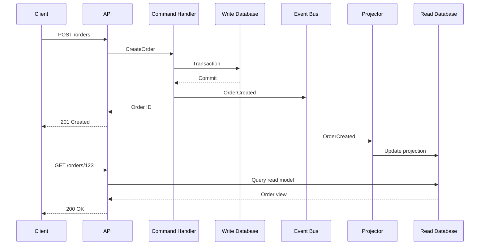
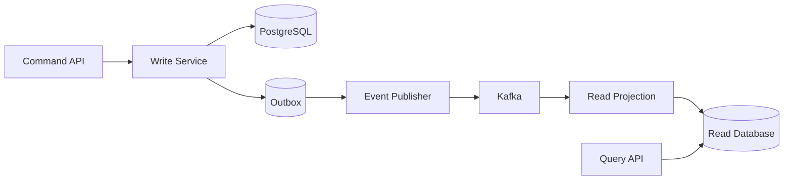
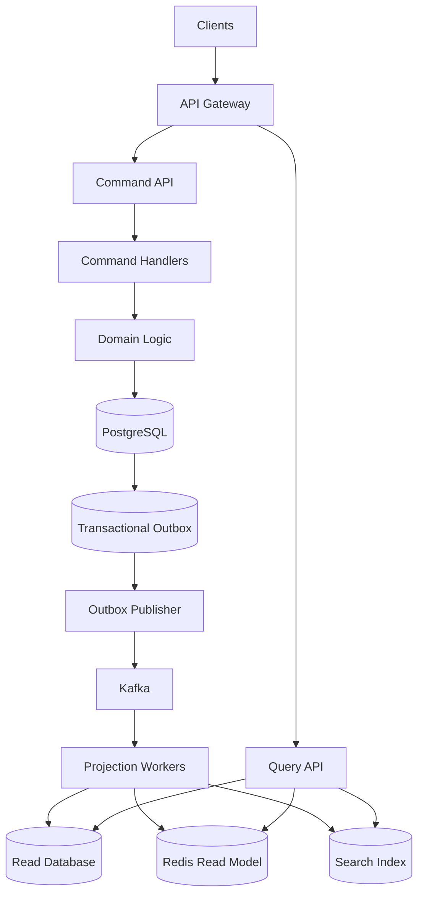

# 11- CQRS

## Overview

Command Query Responsibility Segregation (CQRS) is an architectural pattern that separates operations that **change state** from operations that **read state**.

The core idea is:

```text
Commands                         Queries
   |                                |
   v                                v
Change system state            Read system state
   |                                |
   v                                v
Write model                    Read model
```

A traditional application commonly uses the same domain model and database path for both:

```text
                  Application
                       |
                       v
                 Domain Model
                  /         \
                 v           v
              Writes       Reads
                 \           /
                  v         v
                    Database
```

CQRS separates these responsibilities when the difference between read and write workloads, models, consistency requirements, or scaling characteristics justifies the additional complexity.

CQRS is not synonymous with:

- Microservices
- Event-driven architecture
- Event sourcing
- Kafka
- Database replication
- Read replicas

These technologies can be used with CQRS, but none is a mandatory requirement.

A simple CQRS implementation can use one PostgreSQL database:

```text
                 API
                  |
          +-------+-------+
          |               |
       Command           Query
          |               |
          v               v
    Write Service     Read Service
          |               |
          +-------+-------+
                  |
              PostgreSQL
```

A more advanced architecture may maintain physically separate read and write models:

```text
                         API
                          |
             +------------+------------+
             |                         |
         Commands                    Queries
             |                         |
             v                         v
        Write Model                Read Model
             |                         |
             v                         v
        PostgreSQL                Read Store
             |
             v
           Events
             |
             v
          Kafka
             |
             v
      Read Model Projector
             |
             v
        Read Database
```

The architectural decision is therefore not simply "Should I use CQRS?" but:

> Do the read and write sides have sufficiently different requirements to justify separating their responsibilities?

---

## Why CQRS Exists

Traditional CRUD systems often start with a single model:

```text
User
Order
Product
Invoice
```

The same representation is used to:

- Validate writes
- Execute business rules
- Persist data
- Generate API responses
- Support search
- Produce dashboards
- Serve reports

This works well for many systems.

Problems emerge when read and write requirements diverge significantly.

For example, an order-management system may need:

### Write requirements

- Strong transactional guarantees
- Complex business rules
- Validation
- Inventory checks
- Payment state transitions
- Auditability
- Optimistic locking

### Read requirements

- Fast order-history queries
- Search
- Filtering
- Aggregated totals
- Customer dashboards
- Denormalized views
- Low-latency APIs

Using one model for both can result in compromises.

CQRS allows each side to optimize for its own responsibility.

---

## Commands and Queries

The fundamental distinction is:

| Operation | Responsibility | Should change state? |
|---|---|---:|
| Command | Request a state change | Yes |
| Query | Retrieve information | No |

Examples:

| Command | Query |
|---|---|
| CreateOrder | GetOrder |
| CancelOrder | GetCustomerOrders |
| ApprovePayment | GetPaymentStatus |
| UpdateAddress | GetCustomerProfile |
| ReserveInventory | GetInventory |
| PublishArticle | SearchArticles |

A command represents an **intent**.

A query represents a **request for information**.

For example:

```text
CancelOrder
```

is more expressive than:

```text
UPDATE orders SET status = 'cancelled'
```

The command expresses business intent, while the underlying persistence implementation remains an implementation detail.

---

## Command Model

A command represents an operation that may change system state.

Example:

```python
from dataclasses import dataclass
from uuid import UUID


@dataclass(frozen=True)
class CancelOrder:
    order_id: UUID
    requested_by: UUID
    reason: str
```

The command itself should generally not contain database-specific logic.

The flow becomes:

```text
HTTP Request
     |
     v
CancelOrder command
     |
     v
Command Handler
     |
     v
Domain Logic
     |
     v
Repository
     |
     v
Database
```

---

## Query Model

A query represents a request for information.

```python
from dataclasses import dataclass
from uuid import UUID


@dataclass(frozen=True)
class GetOrder:
    order_id: UUID
```

A query handler should focus on efficiently retrieving the required representation.

It does not need to use the same domain model used by the write side.

For example:

```python
@dataclass(frozen=True)
class OrderSummary:
    order_id: UUID
    customer_name: str
    status: str
    total_amount: str
    item_count: int
```

The read model can be shaped specifically for the API.

---

## CQRS Request Flow

A typical request lifecycle is:



This architecture introduces an important characteristic:

> The write model and read model may temporarily be inconsistent.

That is the primary reason CQRS requires careful consistency design.

---

## Simple CQRS

CQRS does not require separate databases.

A simple implementation can separate the application code while keeping PostgreSQL as the storage system.

```text
                 Application
                      |
          +-----------+-----------+
          |                       |
      Command Side            Query Side
          |                       |
          v                       v
    Write Repository        Query Repository
          |                       |
          +-----------+-----------+
                      |
                  PostgreSQL
```

For example:

```text
commands/
    create_order.py
    cancel_order.py

queries/
    get_order.py
    list_orders.py
```

Both sides can access the same database.

This approach provides architectural separation without introducing distributed systems complexity.

It is often the best starting point.

---

## CQRS With Separate Read and Write Models

A more advanced design uses separate representations.

```text
                  Command
                     |
                     v
              Command Handler
                     |
                     v
              Write Model
                     |
                     v
                PostgreSQL
                     |
                   Event
                     |
                     v
                  Kafka
                     |
                     v
              Read Projector
                     |
                     v
                Read Model
                     |
                     v
                  Query
```

The read model may be:

- PostgreSQL
- Redis
- Elasticsearch/OpenSearch
- DynamoDB
- MongoDB
- A specialized reporting store

The correct choice depends on query patterns.

---

## Why Separate Read Models?

Suppose an order page needs:

```text
Order
Customer
Payment status
Shipment
Product names
Item count
Discount
Total
Latest tracking status
```

A normalized transactional schema might require multiple joins.

A CQRS read model can store:

```json
{
  "order_id": "123",
  "customer_name": "Alice",
  "payment_status": "paid",
  "shipment_status": "shipped",
  "item_count": 4,
  "total": 149.99,
  "tracking_number": "TRK123"
}
```

The API can retrieve the entire representation with one optimized query.

The read model is deliberately shaped around consumption patterns.

---

## CQRS and Denormalization

CQRS commonly works well with denormalized read models.

Write side:

```text
orders
customers
order_items
payments
shipments
```

Read side:

```text
order_dashboard
```

The read model may contain duplicated data:

```text
order_id
customer_name
payment_status
shipment_status
item_count
total
```

This improves read performance at the cost of additional synchronization complexity.

CQRS and denormalization therefore frequently complement each other.

---

## CQRS and Event-Driven Architecture

CQRS can be event-driven, but it does not have to be.

### Without events

```text
Command
   |
   v
Write DB

Query
   |
   v
Read DB
```

### With events

```text
Command
   |
   v
Write DB
   |
   v
Event
   |
   v
Read Model
```

Events become useful when multiple consumers need to react to state changes.

For example:

```text
OrderCreated
     |
     +--> Read Projection
     +--> Notification Service
     +--> Analytics
     +--> Search Index
     +--> Audit Service
```

However, introducing Kafka merely because CQRS is being used adds unnecessary infrastructure if the application does not need asynchronous event distribution.

---

## CQRS and Event Sourcing

CQRS and Event Sourcing are frequently discussed together but solve different problems.

### CQRS

Separates:

```text
Commands
Queries
```

### Event Sourcing

Stores state as:

```text
Sequence of events
```

Instead of primarily storing:

```text
orders.status = "cancelled"
```

an event-sourced system may store:

```text
OrderCreated
PaymentAuthorized
OrderShipped
OrderCancelled
```

Current state is reconstructed from events.

You can have:

```text
CQRS without Event Sourcing
```

and:

```text
Event Sourcing without full CQRS
```

They are complementary, not synonymous.

---

## CQRS With PostgreSQL

A practical architecture can start with PostgreSQL on both sides.

```text
                 API
                  |
          +-------+-------+
          |               |
       Commands          Queries
          |               |
          v               v
   Command Handlers   Query Handlers
          |               |
          v               v
     Write Schema      Read Schema
          |               |
          +-------+-------+
                  |
              PostgreSQL
```

Separate schemas can provide logical isolation:

```text
write_schema.orders
write_schema.payments

read_schema.order_views
read_schema.customer_views
```

This gives the team a CQRS-style architecture without immediately introducing multiple database technologies.

---

## CQRS With Django

A Django application can implement CQRS using explicit service boundaries.

Example structure:

```text
orders/
├── commands/
│   ├── create_order.py
│   └── cancel_order.py
├── queries/
│   ├── get_order.py
│   └── list_orders.py
├── domain/
│   └── models.py
├── repositories/
│   ├── command_repository.py
│   └── query_repository.py
└── api/
    ├── commands.py
    └── queries.py
```

A command service:

```python
from django.db import transaction


class CreateOrderService:
    @transaction.atomic
    def execute(self, customer_id, items):
        order = Order.objects.create(
            customer_id=customer_id,
            status="pending",
        )

        for item in items:
            OrderItem.objects.create(
                order=order,
                product_id=item.product_id,
                quantity=item.quantity,
            )

        return order
```

A query service can optimize independently:

```python
class GetOrderQuery:
    def execute(self, order_id):
        return (
            Order.objects
            .select_related("customer")
            .prefetch_related("items")
            .get(id=order_id)
        )
```

This is CQRS at the application-responsibility level without requiring a distributed read model.

---

## CQRS With FastAPI

FastAPI works naturally with explicit command/query handlers.

```python
from dataclasses import dataclass
from uuid import UUID


@dataclass(frozen=True)
class CreateOrderCommand:
    customer_id: UUID
    product_id: UUID
    quantity: int


class CreateOrderHandler:
    def __init__(self, repository):
        self.repository = repository

    def execute(self, command: CreateOrderCommand):
        return self.repository.create_order(
            customer_id=command.customer_id,
            product_id=command.product_id,
            quantity=command.quantity,
        )
```

The API layer should remain thin:

```text
HTTP
 |
 v
FastAPI Endpoint
 |
 v
Command / Query
 |
 v
Handler
 |
 v
Repository
```

The framework should not contain the core business decision-making.

---

## Read Model Projection

A projection transforms events into query-optimized state.

For example:

```text
OrderCreated
      |
      v
Projection Handler
      |
      v
order_view
```

Pseudo-code:

```python
def handle_order_created(event, read_repository):
    read_repository.upsert_order(
        order_id=event.order_id,
        customer_id=event.customer_id,
        status="created",
        total_amount=event.total_amount,
    )
```

A projection must be designed for:

- Idempotency
- Ordering
- Retry safety
- Duplicate delivery
- Schema evolution
- Failure recovery

---

## Idempotent Projections

Event delivery may be at-least-once.

Therefore:

```text
OrderCreated
OrderCreated
```

should not create two read records.

One approach is to store processed event identifiers:

```text
event_id
projection_name
processed_at
```

Then:

```text
Receive event
     |
     v
Already processed?
   /       \
 Yes        No
 |           |
Skip      Apply
             |
             v
          Record event
```

Idempotency is essential when Kafka, Celery, queues, or retry mechanisms are involved.

---

## Outbox Pattern

A common CQRS failure scenario is:

```text
Write database
      |
      +--> Transaction commits
      |
      X
      |
Event publishing fails
```

The database now contains the new state, but the event was not published.

The **Transactional Outbox Pattern** solves this by storing the event in the same transaction as the business change.

```text
                 Transaction
                     |
          +----------+----------+
          |                     |
      Business Data         Outbox Event
          |                     |
          +----------+----------+
                     |
                   COMMIT
                     |
                     v
              Outbox Publisher
                     |
                     v
                   Kafka
```

Example:

```text
orders
outbox_events
```

Both are committed atomically.

A worker then publishes pending outbox events.

This significantly improves reliability in event-driven CQRS systems.

---

## CQRS Consistency Models

CQRS architectures can provide different consistency guarantees.

| Model | Behavior | Typical use |
|---|---|---|
| Strong consistency | Read immediately reflects write | Financial state |
| Read-after-write | User sees own successful write | User-facing CRUD |
| Eventual consistency | Read catches up asynchronously | Feeds, dashboards |
| Bounded staleness | Read may lag within a known bound | Operational dashboards |

The system should explicitly choose the appropriate model.

Do not accidentally introduce eventual consistency into workflows that require strong consistency.

---

## Handling Read-After-Write

Suppose:

```text
POST /orders
```

creates an order.

The next request:

```text
GET /orders/123
```

may arrive before the projection processes `OrderCreated`.

Possible strategies include:

### Read From Write Model

Immediately after a command:

```text
GET -> Primary / Write DB
```

### Synchronous Projection

Update the read model before returning the command response.

This reduces the consistency window but increases write latency.

### Client-Side Retry

The client retries until the projection becomes visible.

This should be used carefully and with bounded retry behavior.

### Version-Based Reads

Return a version or sequence number from the command:

```json
{
  "order_id": "123",
  "version": 42
}
```

A query can request data at least as fresh as version 42.

### Hybrid Routing

Use the write model for recently modified entities and the read model for older data.

The correct approach depends on the business requirement.

---

## CQRS Failure Modes

A distributed CQRS architecture introduces additional failure points:

```text
Command
   |
Write DB
   |
Outbox
   |
Publisher
   |
Kafka
   |
Consumer
   |
Projection
   |
Read DB
```

Any component can fail.

Potential states include:

```text
Write succeeds
Event pending
Projection delayed
Read model stale
```

The system must be designed to recover automatically.

---

## Event Ordering

Events may arrive out of order.

For example:

```text
OrderCreated
OrderCancelled
```

should not be processed as:

```text
OrderCancelled
OrderCreated
```

Possible solutions include:

- Partitioning events by aggregate ID
- Sequence numbers
- Optimistic version checks
- Event timestamps where appropriate
- Rejecting stale versions

For Kafka, a common strategy is to use the aggregate identifier as the partition key:

```text
key = order_id
```

This keeps events for the same aggregate in the same partition and preserves partition ordering.

Ordering is still not a universal global guarantee across all partitions.

---

## CQRS and Kafka

Kafka can act as the event transport between write and read models.



Kafka is useful when:

- Event volume is high.
- Multiple consumers need the same events.
- Replay is valuable.
- Consumers need independent scaling.
- Asynchronous processing is acceptable.

Kafka is unnecessary for a small application where:

```text
command -> PostgreSQL
query -> PostgreSQL
```

is sufficient.

---

## CQRS and Redis

Redis can serve as a read model when the query workload requires very low latency.

```text
Command
   |
PostgreSQL
   |
Event
   |
Projection
   |
Redis
   |
Query
```

However, Redis should not automatically become the source of truth.

A common design is:

```text
PostgreSQL -> authoritative state
Redis      -> query-optimized representation
```

The system must define how Redis is rebuilt if data is lost.

---

## CQRS and Search

A read model can also be projected into a search engine.

```text
PostgreSQL
    |
    v
Domain Event
    |
    v
Search Projection
    |
    v
OpenSearch / Elasticsearch
```

This is useful for:

- Full-text search
- Filtering
- Faceting
- Ranking
- Autocomplete

The search index is a derived representation and should generally be rebuildable from authoritative data or events.

---

## CQRS Scalability

CQRS can independently scale command and query workloads.

```text
                   Load Balancer
                         |
              +----------+----------+
              |                     |
          Command API            Query API
              |                     |
              v                     v
       Command Instances      Query Instances
              |                     |
              v                     v
          Write DB             Read Store
```

If reads increase by 10x:

```text
Query instances: scale horizontally
Read database: scale independently
```

The write side does not necessarily need to scale by the same amount.

This separation is one of CQRS's strongest architectural benefits.

---

## CQRS Reliability

A production CQRS system should address:

- Durable event delivery
- Idempotent consumers
- Transactional outbox
- Retry policies
- Dead-letter handling
- Projection recovery
- Event replay
- Monitoring
- Backpressure
- Schema evolution
- Version compatibility

A projection should be considered disposable infrastructure.

If the read model can be rebuilt from authoritative data, recovery becomes substantially easier.

---

## Rebuilding Read Models

A strong CQRS architecture treats read models as derived state.

```text
Authoritative State
       |
       v
Event Stream / CDC
       |
       v
Projection
       |
       v
Read Model
```

If the read model becomes corrupted:

```text
Delete read model
       |
       v
Replay events
       |
       v
Rebuild projection
```

This is one of the major benefits of event-driven CQRS.

However, rebuilding can be expensive for large event streams.

Production systems should consider:

- Snapshots
- Checkpoints
- Parallel projection
- Historical event retention
- Backfill tooling
- Versioned projections

---

## Projection Versioning

Read models evolve.

For example:

```text
OrderViewV1
OrderViewV2
```

A new projection may introduce:

```text
customer_segment
delivery_eta
risk_score
```

Avoid breaking existing consumers during migration.

A common approach is:

```text
Events
  |
  +--> Projection V1
  |
  +--> Projection V2
```

Once V2 is validated:

```text
API -> V2
```

This allows controlled migration.

---

## CQRS Security

CQRS does not automatically improve security.

The command side should enforce:

- Authentication
- Authorization
- Domain invariants
- Validation
- Rate limits
- Audit logging

The query side should enforce:

- Authorization
- Tenant isolation
- Field-level access
- Data filtering
- Sensitive-data handling

A common mistake is assuming that a read model is safe because it is read-only.

If the read model contains:

```text
email
phone
address
financial data
```

it requires the same security discipline as the write model.

---

## Multi-Tenant CQRS

Multi-tenant systems require tenant isolation across both models.

Every event and projection should carry sufficient tenant context:

```json
{
  "event_id": "evt_123",
  "tenant_id": "tenant_42",
  "aggregate_id": "order_1001",
  "type": "OrderCreated"
}
```

The read model should enforce tenant filtering:

```sql
SELECT *
FROM order_view
WHERE tenant_id = $1
  AND order_id = $2;
```

Do not rely solely on API-level filtering.

Database-level isolation mechanisms may also be appropriate for high-security environments.

---

## CQRS and Database Transactions

CQRS does not eliminate transactions.

The write side still needs proper transaction boundaries.

For example:

```text
Create Order
    |
    +--> Create order
    +--> Create order items
    +--> Reserve inventory
    +--> Record outbox event
    |
   COMMIT
```

The command handler should define the transactional boundary clearly.

Do not attempt to create one ACID transaction across:

```text
PostgreSQL
Kafka
Redis
Search engine
```

without a carefully designed distributed transaction strategy.

Instead, use:

- Local transactions
- Outbox pattern
- Idempotent consumers
- Compensating actions
- Saga-style workflows where necessary

---

## CQRS and Sagas

For distributed business workflows:

```text
Create Order
   |
   v
Reserve Inventory
   |
   v
Authorize Payment
   |
   v
Create Shipment
```

Each service may have its own transaction boundary.

Failure can require compensation:

```text
Payment failed
      |
      v
Release inventory
```

CQRS can coexist with Saga-based orchestration or choreography.

However, CQRS itself does not solve distributed transaction management.

---

## CQRS Advantages

| Advantage | Engineering impact |
|---|---|
| Separate responsibilities | Cleaner command/query boundaries |
| Independent scaling | Scale reads and writes differently |
| Specialized read models | Optimize for actual query patterns |
| Denormalized reads | Reduce expensive joins |
| Event-driven integration | Multiple consumers can react to changes |
| Better domain boundaries | Commands express business intent |
| Projection flexibility | Add new read models without changing writes |
| Operational isolation | Reporting can be separated from transactional workloads |

---

## CQRS Limitations

| Limitation | Engineering impact |
|---|---|
| More components | Higher operational complexity |
| Eventual consistency | Reads may temporarily be stale |
| Projection failures | Read model can fall behind |
| Duplicate events | Consumers need idempotency |
| Ordering issues | Events may require sequencing |
| Schema evolution | Event contracts require compatibility |
| Debugging complexity | State exists across multiple systems |
| Higher infrastructure cost | Kafka, databases, workers, monitoring |
| Recovery complexity | Projections may need rebuilding |

CQRS should therefore be introduced because a system has a genuine architectural requirement, not because the pattern is considered "more scalable" by default.

---

## When to Use CQRS

CQRS is a strong candidate when:

- Read and write workloads are significantly different.
- Read models require substantial denormalization.
- Commands have complex business rules.
- Queries require specialized representations.
- Multiple read models are required.
- Independent scaling is important.
- Event-driven workflows are already justified.
- Auditability and domain events are important.
- Reporting workloads should be isolated.
- Different teams or services own command and query responsibilities.

---

## When Not to Use CQRS

Avoid CQRS when:

- The application is simple CRUD.
- Read and write models are nearly identical.
- There is no meaningful scaling problem.
- Strong consistency dominates all requirements.
- The team cannot operate distributed infrastructure.
- Event-driven processing provides no real benefit.
- The additional operational complexity exceeds the business value.

For example:

```text
Admin CRUD API
    |
PostgreSQL
```

does not automatically need:

```text
Kafka
Event Store
Projection Workers
Read Database
Redis
Search Engine
```

Architecture should follow requirements.

---

## CQRS Adoption Levels

CQRS can be introduced incrementally.

| Level | Architecture | Complexity |
|---|---|---:|
| Basic | Separate command/query services | Low |
| Logical separation | Separate repositories/models | Low–Medium |
| Separate read schema | Dedicated read tables | Medium |
| Separate read database | Independent query store | Medium |
| Event-driven | Events + projections | High |
| Event-sourced CQRS | Event store + projections | Very High |

A pragmatic progression is:

```text
CRUD
  |
  v
Command / Query separation
  |
  v
Optimized read models
  |
  v
Separate read database
  |
  v
Event-driven projections
```

Do not skip directly to the most complex architecture without a requirement.

---

## Production Architecture

A mature CQRS system may look like:



The write database remains authoritative while read stores are derived according to application requirements.

---

## Observability

CQRS requires end-to-end observability.

Track:

### Command side

- Command latency
- Command failure rate
- Transaction latency
- Database latency
- Validation failures
- Authorization failures

### Event pipeline

- Event publication latency
- Consumer lag
- Event processing rate
- Retry count
- Dead-letter count
- Failed projections

### Query side

- Query latency
- Read-store latency
- Cache hit ratio
- Error rate
- Stale-read duration

### Projection freshness

One of the most important CQRS metrics is:

```text
Current event position
        -
Projected event position
        =
Projection lag
```

This should be visible to operators.

---

## Cost Considerations

CQRS can increase infrastructure costs because the architecture may require:

```text
Write database
Read database
Kafka
Projection workers
Redis
Search infrastructure
Monitoring
```

Before introducing CQRS, estimate:

```text
Additional infrastructure cost
+
Additional engineering cost
+
Operational complexity
```

against:

```text
Expected performance benefit
+
Scalability benefit
+
Business capability
```

The most expensive architecture is often the one that adds distributed infrastructure without solving an actual bottleneck.

---

## Common Mistakes

### Treating CQRS as Microservices

CQRS is an application architecture pattern.

You can implement CQRS inside a monolith.

### Assuming CQRS Requires Kafka

It does not.

A command/query split can use one database and synchronous application code.

### Assuming CQRS Requires Event Sourcing

It does not.

CQRS and event sourcing solve different problems.

### Making the Read Model the Source of Truth

The read model is usually derived state.

The authoritative source must remain clearly defined.

### Ignoring Eventual Consistency

Separate projections naturally introduce synchronization delay.

Business workflows must account for it.

### Creating Too Many Read Models

Every projection introduces:

- Code
- Storage
- Monitoring
- Recovery
- Schema management

Create read models around real query requirements.

### Ignoring Idempotency

At-least-once delivery can result in duplicate events.

Consumers must safely process duplicates.

### Publishing Events Directly After Database Commit

A process crash can create:

```text
DB commit succeeded
Event publication failed
```

Use an outbox or another reliable publication mechanism.

### Ignoring Projection Recovery

A production projection can fail.

There must be a defined way to:

```text
Detect
Pause
Repair
Replay
Rebuild
Validate
Resume
```

---

## Interview Traps

### Is CQRS a database pattern?

No.

It is an architectural pattern separating command and query responsibilities.

### Does CQRS mean two databases?

No.

Separate databases are optional.

### Does CQRS guarantee scalability?

No.

It enables independent scaling and specialized models, but the architecture still has bottlenecks.

### Does CQRS guarantee strong consistency?

No.

Separate read models commonly introduce eventual consistency.

### Why use CQRS if one database is enough?

You can still gain separation of responsibilities and optimized query/command paths without physically separating databases.

### What problem does a read model solve?

It provides a representation optimized for query patterns rather than transactional write requirements.

### Why use an outbox?

To reliably connect a database transaction with asynchronous event publication without losing events between the two operations.

### Why must projections be idempotent?

Because retries and at-least-once delivery can cause the same event to be processed more than once.

### Can CQRS be implemented in Django?

Yes.

A Django monolith can separate command and query services while continuing to use PostgreSQL.

### Is CQRS always better than CRUD?

No.

CQRS is more complex and should be justified by workload, domain, consistency, scaling, or integration requirements.

---

## Key Takeaways

- **CQRS separates state-changing commands from read-oriented queries, allowing each side to evolve and scale according to its own requirements.**
- **CQRS does not require microservices, Kafka, separate databases, or event sourcing; start with the simplest architecture that provides the required separation.**
- **Separate read models enable denormalization and query-specific optimization but introduce eventual consistency, projection failures, and recovery complexity.**
- **Event-driven CQRS requires reliable publication, idempotent consumers, ordering strategies, observability, and projection-rebuild capabilities.**
- **Use CQRS when read/write requirements genuinely diverge; avoid it when a straightforward transactional CRUD architecture already satisfies the system's requirements.**