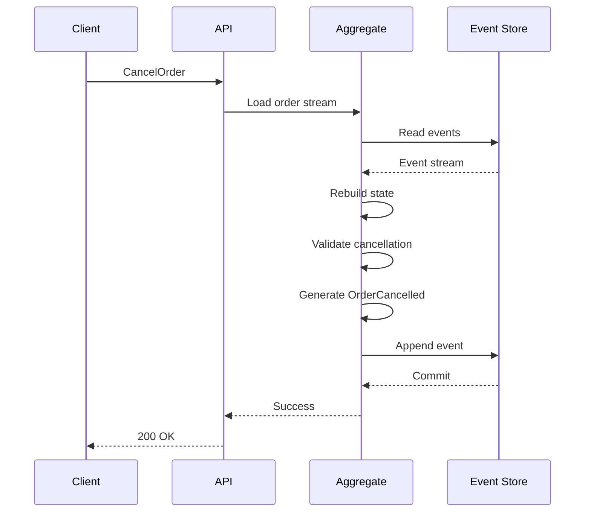
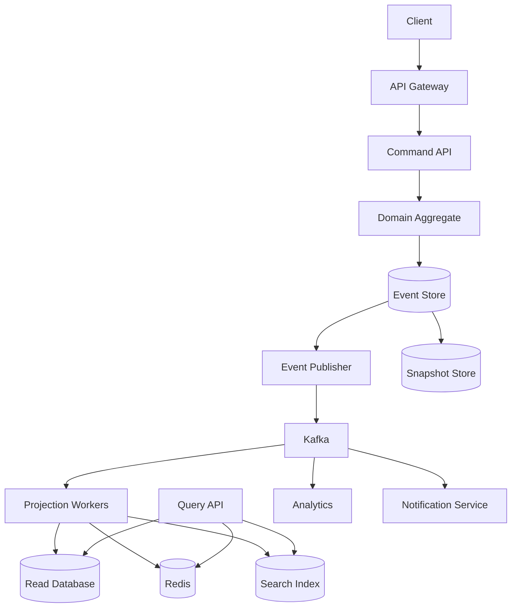

# 12- Event Sourcing

## Overview

Event Sourcing is an architectural pattern in which the system stores **state-changing events as the authoritative record of what happened**, rather than treating the current state of an entity as the primary source of truth.

In a conventional CRUD system, an order might be stored as:

```text
orders
------------------------------------------------
id       status       total       updated_at
1001     cancelled    149.99      2026-08-23
```

The previous states are overwritten as the order changes.

With Event Sourcing, the system stores the sequence of business events:

```text
OrderCreated
PaymentAuthorized
OrderShipped
OrderCancelled
```

The current state is derived by replaying those events:

```text
Event 1 ──> State 1
              |
Event 2 ──> State 2
              |
Event 3 ──> State 3
              |
Event 4 ──> Current State
```

The fundamental distinction is:

| Traditional persistence | Event Sourcing |
|---|---|
| Current state is authoritative | Event history is authoritative |
| Updates overwrite state | New events append to history |
| History often requires audit tables | History is inherent |
| State is directly queried | State is reconstructed/projected |
| Schema represents current state | Events represent facts that happened |

Event Sourcing is particularly useful when **business history, auditability, temporal reconstruction, domain events, or complex state transitions** are first-class requirements.

It is also substantially more complex than conventional database persistence. It should therefore be introduced because the domain benefits from historical event records, not merely because the system needs scalability.

---

## Why Event Sourcing Exists

Traditional CRUD persistence answers:

> What is the current state?

Event Sourcing additionally answers:

> What happened to produce this state?

Consider an account with a current balance:

```text
balance = 850
```

A conventional database may store only:

```text
account_id | balance
-----------|--------
A100       | 850
```

It may be impossible to determine precisely how the balance reached 850 without additional audit data.

An event-sourced system can store:

```text
AccountOpened       +1000
MoneyWithdrawn       -200
MoneyDeposited        +500
MoneyWithdrawn       -450
```

The balance is derived:

```text
1000 - 200 + 500 - 450 = 850
```

The event stream preserves the business history.

This is especially valuable for domains such as:

- Financial systems
- Payments
- Accounting
- Order lifecycles
- Inventory
- Insurance
- Compliance-heavy systems
- Workflow engines
- Trading systems
- Audit-intensive applications

It is generally less valuable for simple CRUD entities where only the latest state matters.

---

## Core Mental Model

The most important mental model is:

```text
Command
   |
   v
Domain Logic
   |
   v
New Event
   |
   v
Event Store
   |
   v
Projection / Aggregate
   |
   v
Current State
```

The database is no longer primarily treated as:

```text
UPDATE row
```

Instead, the system performs:

```text
APPEND event
```

For example:

```text
CancelOrder
     |
     v
OrderCancelled
     |
     v
Event Store
```

The system does not normally mutate:

```text
status = "cancelled"
```

as its authoritative historical record.

Instead, it appends:

```json
{
  "type": "OrderCancelled",
  "order_id": "1001",
  "reason": "customer_request"
}
```

---

## Events

An event represents a fact that has already happened.

Good event names are generally expressed in the past tense:

```text
OrderCreated
PaymentAuthorized
PaymentCaptured
OrderShipped
OrderCancelled
InventoryReserved
InventoryReleased
```

Avoid command-style names:

```text
CreateOrder
CancelOrder
ShipOrder
```

Those describe intentions rather than facts.

A useful distinction is:

```text
Command:
"Cancel this order."

Event:
"Order was cancelled."
```

The command can fail.

The event represents a successful state transition that has already occurred.

---

## Event Structure

A production event normally contains more than just business fields.

Example:

```json
{
  "event_id": "evt_01J8XYZ",
  "event_type": "OrderCreated",
  "aggregate_id": "order_1001",
  "aggregate_type": "Order",
  "aggregate_version": 1,
  "occurred_at": "2026-08-23T14:30:00Z",
  "tenant_id": "tenant_42",
  "causation_id": "cmd_01J8ABC",
  "correlation_id": "req_01J8DEF",
  "payload": {
    "customer_id": "customer_500",
    "currency": "USD",
    "total_amount": 149.99
  },
  "metadata": {
    "actor_id": "user_123",
    "source": "orders-api"
  }
}
```

Important fields include:

| Field | Purpose |
|---|---|
| `event_id` | Globally identifies the event |
| `event_type` | Identifies the business event |
| `aggregate_id` | Identifies the entity stream |
| `aggregate_version` | Supports ordering and optimistic concurrency |
| `occurred_at` | Records event time |
| `tenant_id` | Supports multi-tenant isolation |
| `causation_id` | Identifies the direct triggering operation |
| `correlation_id` | Connects related operations |
| `payload` | Business event data |
| `metadata` | Operational/contextual information |

Do not put secrets, authentication tokens, passwords, or unnecessary personal data into immutable events.

---

## Event Store

An Event Store is the authoritative persistence layer for event streams.

A simple relational implementation can use PostgreSQL:

```sql
CREATE TABLE events (
    event_id UUID PRIMARY KEY,
    aggregate_id UUID NOT NULL,
    aggregate_type TEXT NOT NULL,
    aggregate_version BIGINT NOT NULL,
    event_type TEXT NOT NULL,
    occurred_at TIMESTAMPTZ NOT NULL,
    payload JSONB NOT NULL,
    metadata JSONB NOT NULL DEFAULT '{}'::jsonb,

    UNIQUE (aggregate_id, aggregate_version)
);

CREATE INDEX idx_events_aggregate
    ON events (aggregate_id, aggregate_version);

CREATE INDEX idx_events_type_time
    ON events (event_type, occurred_at);
```

The uniqueness constraint:

```text
(aggregate_id, aggregate_version)
```

prevents two writers from creating the same aggregate version.

This becomes important for concurrency control.

---

## Append-Only Persistence

The event store should generally be append-only.

Instead of:

```sql
UPDATE events
SET payload = ...
WHERE event_id = ...;
```

the application appends a new event.

For example:

```text
Version 1 -> OrderCreated
Version 2 -> PaymentAuthorized
Version 3 -> OrderShipped
Version 4 -> OrderCancelled
```

The historical events should not be silently rewritten.

Corrections should generally be represented as additional business events.

For example:

```text
InvoiceIssued
InvoiceAmountCorrected
```

rather than modifying the original `InvoiceIssued` event.

---

## Event Streams

Events are usually grouped into streams belonging to an aggregate.

For an order:

```text
order-1001

1  OrderCreated
2  PaymentAuthorized
3  InventoryReserved
4  OrderShipped
```

Another order has a different stream:

```text
order-1002

1  OrderCreated
2  PaymentFailed
3  OrderCancelled
```

The aggregate identifier determines the stream:

```text
aggregate_id = order-1001
```

This allows the system to reconstruct one aggregate independently.

---

## Aggregates

Event Sourcing is frequently combined with Domain-Driven Design aggregates.

An aggregate:

- Owns a consistency boundary.
- Processes commands.
- Validates business invariants.
- Produces events.
- Can be reconstructed from its event stream.

For example:

```text
Order Aggregate
    |
    +-- OrderCreated
    +-- ItemAdded
    +-- PaymentAuthorized
    +-- OrderShipped
```

The aggregate does not need to load every aggregate in the system.

It normally loads its own stream:

```text
order-1001
```

and reconstructs its state.

---

## Event Replay

Suppose an order has these events:

```text
OrderCreated
ItemAdded
ItemAdded
PaymentAuthorized
OrderShipped
```

The aggregate starts from an initial state:

```text
OrderState(
    status="new",
    items=[],
    payment_status="pending"
)
```

Then applies each event:

```text
OrderCreated
      |
      v
status = created
      |
ItemAdded
      |
      v
items = [item]
      |
ItemAdded
      |
      v
items = [item, item]
      |
PaymentAuthorized
      |
      v
payment_status = authorized
      |
OrderShipped
      |
      v
status = shipped
```

This is event replay.

---

## Event Handlers

A Python aggregate might look like:

```python
from dataclasses import dataclass, field
from decimal import Decimal
from uuid import UUID


@dataclass
class OrderState:
    order_id: UUID
    status: str = "new"
    total: Decimal = Decimal("0")
    payment_status: str = "pending"
    items: list[dict] = field(default_factory=list)


class OrderAggregate:
    def __init__(self, state: OrderState):
        self.state = state
        self.pending_events: list[dict] = []

    def apply(self, event: dict) -> None:
        event_type = event["event_type"]
        payload = event["payload"]

        if event_type == "OrderCreated":
            self.state.status = "created"

        elif event_type == "ItemAdded":
            self.state.items.append(payload)

        elif event_type == "PaymentAuthorized":
            self.state.payment_status = "authorized"

        elif event_type == "OrderShipped":
            self.state.status = "shipped"

    def record(self, event: dict) -> None:
        self.apply(event)
        self.pending_events.append(event)
```

Production implementations should usually separate:

```text
Command validation
Event generation
Event application
Persistence
```

rather than putting everything into one class.

---

## Commands and Events

The typical lifecycle is:



The important sequence is:

```text
Load
  ↓
Replay
  ↓
Validate
  ↓
Generate event
  ↓
Append
```

---

## Optimistic Concurrency Control

Two requests can load the same aggregate version.

Suppose:

```text
Current version = 10
```

Two workers read version 10:

```text
Worker A -> version 10
Worker B -> version 10
```

Both attempt to append version 11.

Only one should succeed.

The write can enforce:

```text
Expected version = 10
New version = 11
```

Conceptually:

```sql
INSERT INTO events (
    event_id,
    aggregate_id,
    aggregate_type,
    aggregate_version,
    event_type,
    occurred_at,
    payload,
    metadata
)
SELECT
    :event_id,
    :aggregate_id,
    :aggregate_type,
    :expected_version + 1,
    :event_type,
    :occurred_at,
    :payload,
    :metadata
WHERE NOT EXISTS (
    SELECT 1
    FROM events
    WHERE aggregate_id = :aggregate_id
      AND aggregate_version = :expected_version + 1
);
```

A production implementation can instead use a transaction and a unique constraint to detect conflicts.

The result is:

```text
Worker A -> version 11 -> success
Worker B -> version 11 -> conflict
```

Worker B must reload the aggregate and decide whether the command can be retried.

---

## Event Sourcing and ACID

Event Sourcing does not eliminate ACID transactions.

A command may need to atomically append:

```text
Event 1
Event 2
Event 3
```

or none of them.

For example:

```text
PaymentCaptured
OrderConfirmed
```

may belong to one local transaction depending on the aggregate boundary.

The event store should guarantee appropriate atomicity and durability.

Event Sourcing changes **what is persisted**, not the fundamental need for transaction boundaries.

---

## Event Sourcing and CQRS

Event Sourcing and CQRS are complementary patterns.

CQRS separates:

```text
Commands
Queries
```

Event Sourcing changes persistence to:

```text
Events
```

A common architecture is:

```text
                  Commands
                     |
                     v
                Write Model
                     |
                     v
                Event Store
                     |
                     v
                   Events
                     |
             +-------+-------+
             |               |
             v               v
       Read Projection    Other Consumers
             |
             v
          Read DB
             |
             v
           Queries
```

This combination is powerful but significantly increases system complexity.

You should not introduce Event Sourcing simply because CQRS is being used.

---

## Event Sourcing and Kafka

Kafka and an Event Store serve different purposes.

An Event Store is typically the authoritative persistence mechanism for an aggregate's event history.

Kafka is primarily an event streaming and distribution platform.

A common architecture is:

```text
Command
   |
   v
Event Store
   |
   v
Outbox / Publisher
   |
   v
Kafka
   |
   +--> Projection
   +--> Analytics
   +--> Notifications
   +--> Search
```

Kafka should not automatically be treated as the source of truth for domain state.

The correct architecture depends on retention, replay, ordering, consistency, and ownership requirements.

---

## Event Sourcing and the Transactional Outbox

If an event store and Kafka are separate systems, this failure is possible:

```text
Event Store
     |
   COMMIT
     |
     X
     |
Kafka publish fails
```

The business event exists but downstream consumers do not receive it.

A transactional outbox can bridge the database transaction and event publication:

```text
                 Transaction
                     |
          +----------+----------+
          |                     |
      Domain Event         Outbox Record
          |                     |
          +----------+----------+
                     |
                   COMMIT
                     |
                     v
              Event Publisher
                     |
                     v
                   Kafka
```

For systems where the event store itself is the authoritative event stream, the exact publication mechanism may differ, but the core problem remains:

> Persisting state and notifying external systems must be coordinated reliably.

---

## Snapshots

Replay becomes expensive when an aggregate has a very long event stream.

For example:

```text
Event 1
Event 2
Event 3
...
Event 2,000,000
```

Replaying two million events for every request is impractical.

Snapshots store periodically reconstructed state:

```text
Events 1-10,000
       |
       v
Snapshot at version 10,000
       |
       v
Events 10,001-10,050
```

To rebuild:

```text
Load snapshot at version 10,000
             |
             v
Replay events 10,001-10,050
             |
             v
Current state
```

Snapshots are an optimization.

They are not normally the authoritative source of truth.

---

## Snapshot Strategy

A snapshot might contain:

```json
{
  "aggregate_id": "order_1001",
  "version": 5000,
  "state": {
    "status": "shipped",
    "total": 149.99,
    "payment_status": "captured"
  }
}
```

Snapshot frequency depends on:

- Event count
- Replay latency
- Aggregate size
- Storage cost
- Command frequency

Do not snapshot every event automatically.

Measure replay cost and choose a practical threshold.

---

## Event Versioning

Events are durable historical contracts.

Changing their structure carelessly can break:

```text
Old events
   |
   v
New application
```

Suppose V1 emits:

```json
{
  "amount": 100
}
```

Later V2 requires:

```json
{
  "amount": 100,
  "currency": "USD"
}
```

Existing events do not automatically contain `currency`.

Possible strategies include:

- Upcasting
- Versioned event types
- Backward-compatible payload changes
- Explicit migration
- Multiple event handlers

Example:

```text
OrderCreatedV1
OrderCreatedV2
```

An upcaster can transform:

```text
V1 -> V2
```

during replay without rewriting the original event.

---

## Event Schema Evolution

Prefer additive changes where possible.

Safe-ish:

```json
{
  "customer_id": "123",
  "currency": "USD"
}
```

where old consumers can ignore the new field.

Riskier:

```text
Rename customer_id -> user_id
```

because old consumers may depend on `customer_id`.

For long-lived event streams, schema governance is critical.

Consider:

- Schema registry
- Explicit versions
- Compatibility rules
- Contract testing
- Event documentation
- Deprecation policies

---

## Event Immutability

Events should generally be immutable.

If an event contains incorrect business information, do not silently modify history.

Instead:

```text
InvoiceIssued
InvoiceAmountCorrected
```

The correction itself becomes part of the history.

This provides a clear audit trail:

```text
Original fact
      +
Correction
      =
Current interpretation
```

There are exceptional operational situations where low-level event repair may be necessary, but such procedures should be tightly controlled, audited, and treated as exceptional data-recovery operations.

---

## Temporal Queries

One of Event Sourcing's strongest capabilities is reconstructing historical state.

Suppose:

```text
v1 OrderCreated
v2 PaymentAuthorized
v3 ItemAdded
v4 OrderShipped
```

You can reconstruct:

```text
State at v2
```

without needing a separate historical table.

This enables questions such as:

- What did the order look like yesterday?
- What was the account balance before the transaction?
- Which state existed when a decision was made?
- What events caused a particular status?

This is especially valuable in audit-heavy domains.

---

## Auditability

Traditional audit logging often records:

```text
user_id
action
timestamp
```

Event Sourcing can provide richer business history:

```text
OrderCreated
ItemAdded
PaymentAuthorized
ShipmentCreated
OrderCancelled
```

The distinction is important.

An audit log tells you:

> Someone performed an action.

A domain event tells you:

> A business fact occurred.

A production system may use both.

---

## Event Replay

Replay allows consumers or projections to rebuild state.

```text
Event Store
    |
    v
Read events
    |
    v
Apply projection
    |
    v
Read Model
```

Replay is useful for:

- Rebuilding corrupted projections
- Creating new projections
- Backfilling new fields
- Migrating read models
- Reprocessing historical data
- Recovering from projection bugs

However, replaying a large event stream can create substantial CPU, I/O, and downstream load.

Replay must therefore be treated as an operational workload.

---

## Projection Replay

Suppose the system originally has:

```text
OrderProjectionV1
```

and later introduces:

```text
OrderProjectionV2
```

The event stream can be replayed:

```text
Events
  |
  v
Projection V2
  |
  v
New Read Model
```

This avoids modifying historical events simply because a new consumer needs a different representation.

---

## Idempotent Consumers

Event consumers commonly operate under at-least-once delivery.

The same event may arrive more than once:

```text
OrderCreated
OrderCreated
```

A consumer must ensure:

```text
Apply once
```

rather than:

```text
Apply twice
```

A common strategy is to maintain an inbox table:

```sql
CREATE TABLE processed_events (
    consumer_name TEXT NOT NULL,
    event_id UUID NOT NULL,
    processed_at TIMESTAMPTZ NOT NULL DEFAULT now(),
    PRIMARY KEY (consumer_name, event_id)
);
```

Processing can then be coordinated with the projection update inside one local transaction.

---

## Event Ordering

Ordering is normally guaranteed within an aggregate stream rather than globally.

For example:

```text
order-1001
    v1
    v2
    v3
```

should maintain:

```text
v1 < v2 < v3
```

But another aggregate:

```text
order-1002
```

may progress independently.

This enables concurrency.

A common Kafka strategy is:

```text
partition_key = aggregate_id
```

so all events for one aggregate are routed to the same partition.

Do not assume this creates global ordering across all aggregates.

---

## Eventual Consistency

Event Sourcing combined with asynchronous projections commonly results in:

```text
Write completed
      |
      v
Event persisted
      |
      v
Projection pending
      |
      v
Read model updated
```

The period between these stages is the consistency window.

For example:

```text
POST /orders
```

may return successfully while:

```text
GET /orders/123
```

temporarily returns an older representation.

This must be acceptable to the business workflow.

If immediate read-after-write consistency is mandatory, options include:

- Reading from the aggregate state
- Synchronous projection
- Version-aware reads
- Routing recent writes to the write model

---

## Event Sourcing and Microservices

Event Sourcing can work well with microservices, but service boundaries should not automatically correspond to event streams.

A service may own:

```text
Order aggregate
```

and publish integration events:

```text
OrderCreated
OrderShipped
OrderCancelled
```

Other services consume these events without directly accessing the order database.

```text
Order Service
     |
     v
Order Event Stream
     |
     v
Kafka
   / | \
  /  |  \
 v   v   v
Billing Inventory Notification
```

This preserves service ownership.

A service should generally not query another service's event store directly to bypass its API or published contracts.

---

## Event Sourcing in Django

Django can be used to implement an event-sourced system, although Django's normal ORM patterns are state-oriented.

A basic event model might look like:

```python
from django.db import models


class Event(models.Model):
    event_id = models.UUIDField(primary_key=True)
    aggregate_id = models.UUIDField()
    aggregate_type = models.CharField(max_length=100)
    aggregate_version = models.PositiveBigIntegerField()
    event_type = models.CharField(max_length=200)
    occurred_at = models.DateTimeField()
    payload = models.JSONField()
    metadata = models.JSONField(default=dict)

    class Meta:
        constraints = [
            models.UniqueConstraint(
                fields=["aggregate_id", "aggregate_version"],
                name="unique_aggregate_version",
            ),
        ]
        indexes = [
            models.Index(
                fields=["aggregate_id", "aggregate_version"],
            ),
            models.Index(
                fields=["event_type", "occurred_at"],
            ),
        ]
```

Django can provide:

- Transactions
- PostgreSQL integration
- Authentication
- API layers
- Administrative tooling
- Background processing

But the event-sourcing semantics must be deliberately designed rather than relying on normal `Model.save()` behavior.

---

## Event Sourcing With FastAPI

FastAPI can expose commands and queries around an event-sourced domain.

```text
POST /orders
      |
      v
CreateOrderCommand
      |
      v
Order Aggregate
      |
      v
Event Store
```

Example API response:

```json
{
  "order_id": "order_1001",
  "version": 4
}
```

Returning the aggregate version can be useful for:

- Read-after-write coordination
- Optimistic concurrency
- Debugging
- Distributed tracing

---

## Event Sourcing and Redis

Redis can be useful for:

- Cached aggregate state
- Read models
- Projection acceleration
- Query caching

But Redis should generally not replace the durable event store unless the system's durability and recovery requirements are explicitly satisfied.

A safer model is:

```text
Event Store
     |
     v
Authoritative history
     |
     v
Redis
     |
     v
Fast derived state
```

If Redis is lost:

```text
Event Store
     |
     v
Replay
     |
     v
Rebuild Redis
```

---

## Event Sourcing and PostgreSQL

PostgreSQL is a practical event store for many systems.

Advantages include:

- ACID transactions
- Durable storage
- Strong consistency
- Unique constraints
- Indexing
- JSONB
- Backup tooling
- Mature operational ecosystem

A PostgreSQL event store can start relatively simply:

```text
events
snapshots
outbox
processed_events
```

As event volume grows, operational concerns become more important:

- Partitioning
- Index maintenance
- Vacuuming
- Storage growth
- Archival
- Backup duration
- Query performance

Event history can grow indefinitely, so retention and archival policies must be designed deliberately.

---

## Event Store Partitioning

Large event stores may eventually require partitioning.

For example:

```text
events_2026_01
events_2026_02
events_2026_03
```

or partitioning based on another suitable access pattern.

Time-based partitioning can simplify:

- Retention
- Archival
- Maintenance
- Bulk deletion

Aggregate-based partitioning may be useful for some access patterns.

Partitioning should be chosen based on actual workload and database capabilities rather than introduced automatically.

---

## Storage Growth

Event Sourcing naturally creates more records than mutable-state storage.

A conventional order might require:

```text
1 row
```

An event-sourced order might require:

```text
50 events
```

or:

```text
5,000 events
```

Therefore:

```text
Storage cost ↑
Index size ↑
Backup size ↑
Replay cost ↑
```

Strategies include:

- Snapshots
- Compression
- Partitioning
- Archival
- Lifecycle policies
- Efficient payload formats
- Event retention policies where legally and operationally acceptable

Be careful with deleting historical events because doing so can destroy the ability to reconstruct state.

---

## Disaster Recovery

Event Sourcing changes the disaster-recovery strategy.

The event store is authoritative and therefore requires strong protection.

Recommended practices include:

- Automated backups
- Point-in-time recovery
- Cross-region replication where required
- Backup restoration testing
- Encryption at rest
- Encryption in transit
- Recovery runbooks
- Projection rebuild procedures

Read models are usually less critical because they can be rebuilt.

This produces an important distinction:

```text
Event Store
    |
    +--> Critical data
    |
    +--> Strong DR requirements

Read Model
    |
    +--> Derived data
    |
    +--> Rebuildable
```

---

## Security Considerations

Immutable history creates special security challenges.

If an event contains sensitive information:

```text
UserEmailChanged
```

the historical event may remain indefinitely.

This creates tension between:

```text
Immutable audit history
```

and:

```text
Data deletion / privacy requirements
```

Do not assume Event Sourcing automatically satisfies compliance requirements.

Design sensitive-data handling deliberately.

Possible strategies include:

- Store references instead of sensitive values
- Encrypt sensitive payloads
- Tokenize sensitive data
- Separate PII from immutable events
- Use cryptographic deletion strategies where appropriate
- Define retention policies
- Restrict event-store access

Never expose the raw event store directly to untrusted clients.

---

## Event Encryption

For sensitive domains, payloads can be encrypted at rest using envelope encryption.

Conceptually:

```text
Event
  |
  v
Sensitive payload
  |
  v
Encryption
  |
  v
Encrypted event
```

AWS environments can integrate with services such as KMS for key management.

Access to decryption keys should be significantly more restricted than normal application read access.

---

## Observability

Event-sourced systems need observability across the entire event lifecycle.

Monitor:

### Event store

- Append latency
- Read latency
- Event count
- Storage growth
- Failed writes
- Version conflicts

### Consumers

- Consumer lag
- Processing rate
- Retry count
- Failure count
- Dead-letter events

### Projections

- Projection lag
- Rebuild duration
- Failed projections
- Current event version
- Projected version

### Aggregate performance

- Events loaded per command
- Replay duration
- Snapshot hit rate
- Aggregate reconstruction latency

A particularly useful metric is:

```text
projection_lag =
    latest_event_version - projected_version
```

---

## Distributed Tracing

Use correlation identifiers across:

```text
HTTP request
    |
Command
    |
Event
    |
Kafka message
    |
Projection
    |
Database update
```

Example:

```json
{
  "correlation_id": "req_123",
  "causation_id": "cmd_456",
  "event_id": "evt_789"
}
```

This makes debugging distributed workflows significantly easier.

Without correlation identifiers, tracing:

```text
API request -> event -> consumer -> projection
```

can become difficult in production.

---

## Performance Considerations

Event Sourcing introduces several performance trade-offs.

### Write performance

Appending events is generally efficient because the workload is append-oriented.

### Read performance

Aggregate reconstruction can become expensive if streams are long.

### Query performance

Direct querying of raw events is usually not the ideal API query strategy.

Use projections for query-specific workloads.

### Projection throughput

A projection must process events quickly enough to avoid unacceptable lag.

### Replay performance

Rebuilding a large projection can consume significant CPU and I/O.

The architecture should optimize all four paths independently:

```text
Append
Rebuild
Project
Query
```

---

## Common Performance Optimizations

Use:

- Snapshots
- Batch event reads
- Efficient indexes
- Partitioning
- Parallel projection
- Bulk writes
- Connection pooling
- Backpressure
- Appropriate serialization formats
- Dedicated read models

Avoid:

- Loading all historical events for every API request
- Replaying aggregates unnecessarily
- Querying raw JSON payloads without indexes
- Rebuilding projections during peak traffic
- Running unrestricted replay jobs against production databases

---

## Event Retention

Event retention is more complicated than normal log retention.

Deleting old application logs may be straightforward.

Deleting historical domain events may make state reconstruction impossible.

Before implementing retention, answer:

- Can aggregates be reconstructed without old events?
- Are snapshots sufficient?
- Are old events required for audit?
- Are events replicated elsewhere?
- Are legal retention requirements satisfied?
- Can old events be archived safely?
- Can projections still be rebuilt?

A safe archival strategy may be:

```text
Hot Event Store
       |
       v
Cold Archive
       |
       v
Long-Term Storage
```

For AWS environments, object storage such as S3 can be useful for archival, subject to recovery requirements and governance.

---

## Testing Event-Sourced Systems

Testing should focus on behavior rather than only persistence.

Important test categories include:

### Command tests

Verify that commands produce the expected events.

```text
Given:
OrderCreated

When:
CancelOrder

Then:
OrderCancelled
```

### Event application tests

Verify that events produce the expected state.

```text
OrderCreated
PaymentAuthorized
```

should reconstruct:

```text
status = created
payment_status = authorized
```

### Replay tests

Verify that historical streams reconstruct correctly.

### Concurrency tests

Verify that stale aggregate versions are rejected.

### Projection tests

Verify that events generate correct read models.

### Idempotency tests

Verify that duplicate events do not duplicate state.

---

## Event-Sourced Testing Pattern

A useful test structure is:

```text
Given events
    |
    v
When command executes
    |
    v
Then expected events are produced
```

For example:

```python
def test_cancel_order():
    given = [
        {
            "event_type": "OrderCreated",
            "payload": {"order_id": "1001"},
        }
    ]

    command = {
        "type": "CancelOrder",
        "order_id": "1001",
    }

    expected = [
        {
            "event_type": "OrderCancelled",
            "payload": {"order_id": "1001"},
        }
    ]

    result = handle_command(given, command)

    assert result == expected
```

The exact implementation depends on the event-sourcing framework and domain architecture.

---

## Common Mistakes

### Treating Events as Database Audit Rows

A domain event should represent a meaningful business fact.

Avoid generating meaningless events such as:

```text
OrderRowUpdated
```

Prefer:

```text
OrderShipped
```

### Designing Events Around Database Tables

Events should represent domain facts rather than leaking persistence structure.

Avoid:

```text
orders_table_row_updated
```

Prefer:

```text
OrderAddressChanged
```

### Making Events Too Fine-Grained

Events such as:

```text
OrderFieldChanged
```

can become difficult to reason about.

Events should generally communicate meaningful business transitions.

### Storing Sensitive Data Indiscriminately

Immutable events can preserve sensitive data for a very long time.

Design privacy boundaries before production deployment.

### Ignoring Event Schema Evolution

Events are durable contracts.

Changing them casually can make historical replay impossible.

### Treating Kafka as the Event Store Automatically

Kafka is a streaming platform, not a universal replacement for a domain event store.

Evaluate durability, retention, querying, ordering, and aggregate semantics explicitly.

### Ignoring Aggregate Boundaries

An aggregate that loads thousands of unrelated events or spans too much business state becomes difficult to scale.

Keep consistency boundaries focused.

### Replaying Everything for Every Request

This is one of the most common performance mistakes.

Use snapshots and read models when necessary.

### Assuming Eventual Consistency Is Free

Eventual consistency changes application behavior.

Users and workflows may temporarily observe stale data.

### Building Event Sourcing Before Understanding the Domain

Event Sourcing amplifies domain modeling decisions.

Poor event definitions become long-term technical debt.

---

## Production Architecture

A production-oriented event-sourced architecture may look like:



The architecture separates:

```text
Authoritative history
```

from:

```text
Derived query representations
```

and:

```text
External integrations
```

This separation provides flexibility but creates more operational surfaces.

---

## Operational Best Practices

For production Event Sourcing:

- Keep the event store authoritative.
- Make events immutable.
- Use aggregate versioning.
- Enforce optimistic concurrency.
- Keep events semantically meaningful.
- Make consumers idempotent.
- Use snapshots for long streams.
- Version event schemas.
- Build projection replay tooling.
- Monitor projection lag.
- Test disaster recovery.
- Protect sensitive event data.
- Maintain correlation and causation identifiers.
- Keep read models rebuildable.
- Use transactional mechanisms such as an outbox when crossing persistence boundaries.
- Document event contracts.
- Test event replay against representative historical data.

---

## When to Use Event Sourcing

Event Sourcing is a strong candidate when:

- Historical state matters.
- Business events are first-class domain concepts.
- Auditability is critical.
- State transitions are complex.
- The system needs temporal reconstruction.
- Multiple read models must be derived from the same history.
- Event replay provides significant business or operational value.
- The domain naturally maps to aggregates and events.

Examples include:

```text
Payments
Accounting
Trading
Inventory
Order lifecycles
Insurance claims
Compliance workflows
```

---

## When Not to Use Event Sourcing

Avoid Event Sourcing when:

- Only current state matters.
- The domain is simple CRUD.
- Audit requirements are minimal.
- The team does not need replay.
- Event history provides little business value.
- The additional storage and operational complexity is unjustified.
- The team lacks the operational maturity to manage event schemas and projections.

A normal PostgreSQL schema is often a better choice for:

```text
Internal admin CRUD
Basic configuration
Simple user profiles
Simple content management
Low-complexity business applications
```

---

## Event Sourcing vs Traditional CRUD

| Concern | Traditional CRUD | Event Sourcing |
|---|---|---|
| Source of truth | Current state | Event history |
| Updates | Mutable rows | Append events |
| Historical reconstruction | Requires audit/history | Native capability |
| Current-state reads | Direct | Projection or replay |
| Storage complexity | Lower | Higher |
| Query complexity | Lower | Usually higher |
| Auditability | Additional design | Natural |
| Replay | Limited | Core capability |
| Schema evolution | Relatively straightforward | Requires event compatibility |
| Operational complexity | Lower | Higher |
| Eventual consistency | Optional | Common with projections |
| Debugging | Current state focused | Event history focused |
| Best fit | CRUD/state-oriented domains | History/event-oriented domains |

---

## Event Sourcing vs CQRS

| Aspect | CQRS | Event Sourcing |
|---|---|---|
| Primary idea | Separate commands and queries | Persist events as source of truth |
| Requires events? | No | Yes |
| Requires separate DBs? | No | No |
| Requires projections? | No | Often |
| Focus | Responsibility separation | Persistence/history |
| Can exist independently? | Yes | Yes |
| Common combination | CQRS + Event Sourcing | CQRS + Event Sourcing |

The distinction is critical in system-design interviews.

A strong answer should state:

> CQRS separates read and write responsibilities. Event Sourcing persists state transitions as immutable events. They are complementary but independent patterns.

---

## Event Sourcing vs Audit Logging

| Concern | Audit Logging | Event Sourcing |
|---|---|---|
| Primary purpose | Record actions | Store domain history |
| Source of truth | Application state remains primary | Events are authoritative |
| Historical reconstruction | Usually limited | Core capability |
| Business semantics | Optional | Important |
| Mutability | Often flexible | Events generally immutable |
| Replay | Usually not supported | Core capability |
| Operational complexity | Lower | Higher |

A system may use both.

For example:

```text
Event Store
    |
    +--> Domain history

Audit Log
    |
    +--> Security/access activity
```

They answer different questions.

---

## Interview Traps

### Is Event Sourcing the same as event-driven architecture?

No.

Event Sourcing defines how state is persisted.

Event-driven architecture defines how components communicate through events.

They can be used independently.

### Is Event Sourcing the same as CQRS?

No.

CQRS separates commands and queries.

Event Sourcing persists state changes as events.

### Are events mutable?

Generally no.

Historical business facts should be immutable.

### How do you get current state?

Replay the aggregate's event stream or use a snapshot plus subsequent events.

### What happens when there are millions of events?

Use snapshots, optimized streams, partitioning, and carefully designed aggregate boundaries.

### How do you handle duplicate events?

Consumers should be idempotent, commonly using event IDs or consumer-specific inbox records.

### How do you handle concurrent commands?

Use optimistic concurrency with aggregate versions.

### Why are events usually past tense?

Because they represent facts that have already happened.

### Can you delete events?

Technically possible, but dangerous.

Deleting historical events can make state reconstruction and auditing impossible. Retention and archival must be explicitly designed.

### Is Event Sourcing always more scalable?

No.

It can improve certain write and read architectures, but it introduces replay, projection, storage, and operational costs.

### What is the biggest operational challenge?

Maintaining reliable event history and ensuring all derived projections can evolve, recover, and be rebuilt correctly.

---

## Key Takeaways

- **Event Sourcing treats an immutable sequence of domain events as the authoritative history from which current state is derived.**
- **Events are business facts, not database audit rows; good event design, schema evolution, and aggregate boundaries are critical long-term decisions.**
- **Snapshots, optimistic concurrency, idempotent consumers, and replayable projections are essential techniques for operating event-sourced systems at scale.**
- **Event Sourcing and CQRS are complementary but independent patterns; Kafka, microservices, and event-driven architecture are optional implementation choices.**
- **Use Event Sourcing when historical reconstruction, auditability, complex state transitions, or event-driven projections provide real business value; otherwise, conventional PostgreSQL persistence is usually simpler.**