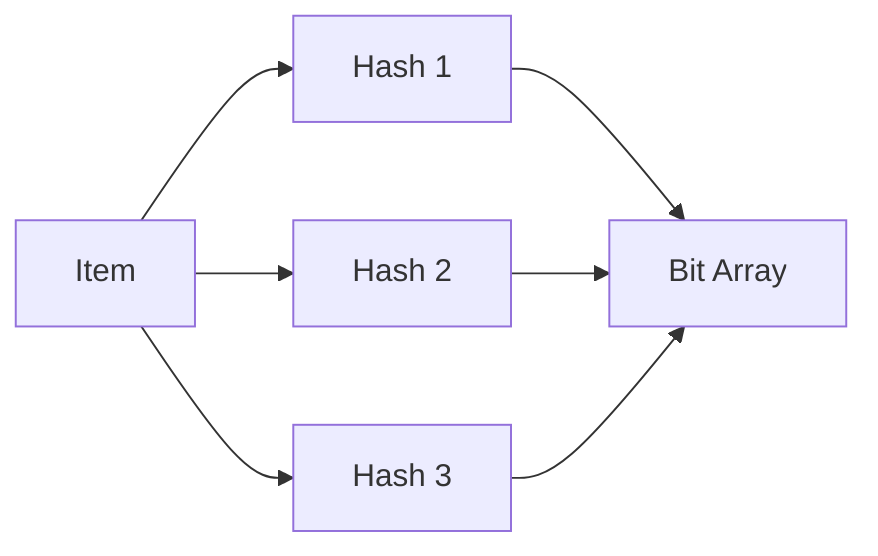
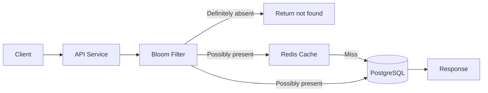
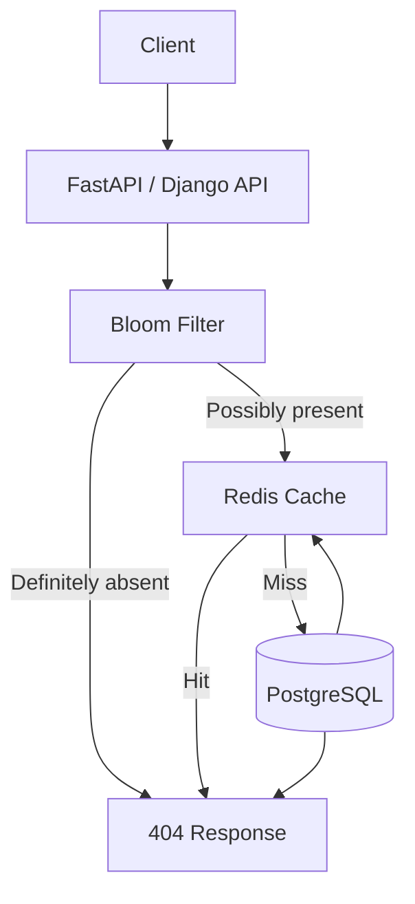

# 13- Bloom Filters

## Overview

A Bloom filter is a **space-efficient probabilistic data structure used to test whether an item is possibly present in a set**.

It answers a deliberately asymmetric question:

```text
"Could this value exist in the set?"
```

The result is either:

- **Definitely not present**
- **Possibly present**

A Bloom filter can produce **false positives**, but a correctly implemented standard Bloom filter does **not produce false negatives**.

This makes Bloom filters useful as a fast rejection layer in front of an expensive data store:

```text
Request
   |
   v
Bloom Filter
   |
   +---- Definitely absent ----> Reject / Skip expensive lookup
   |
   +---- Possibly present ------> Query database/cache
```

For example, suppose a service needs to determine whether a user ID exists in a database containing billions of records.

Without a Bloom filter:

```text
API
 |
 v
PostgreSQL
 |
 v
Index lookup
```

With a Bloom filter:

```text
API
 |
 v
Bloom Filter
 |
 +---- "Definitely absent" ---> Return not found
 |
 +---- "Possibly present" ----> PostgreSQL lookup
```

The filter does not replace the database. It reduces the number of expensive lookups.

Bloom filters are particularly useful when:

- The dataset is very large.
- Membership checks are frequent.
- Most queried values are absent.
- False positives are acceptable.
- Memory efficiency matters.
- The authoritative data source is expensive to query.

---

## Why Bloom Filters Exist

A normal set provides exact membership checks:

```python
if user_id in user_ids:
    ...
```

But an exact in-memory set can become expensive at large scale.

Suppose a service needs to track:

```text
10 billion IDs
```

An exact hash set requires storing:

- The values
- Hash table metadata
- Pointers or object overhead
- Allocation overhead

For high-cardinality datasets, memory requirements can become substantial.

A Bloom filter compresses the membership information into a compact bit array.

The trade-off is intentional:

```text
Exact Set
    |
    +--> High memory
    +--> Exact answers

Bloom Filter
    |
    +--> Very low memory
    +--> Probabilistic answers
```

The fundamental trade is:

> Spend a small amount of memory to avoid many expensive negative lookups.

---

## Core Properties

| Property | Bloom Filter |
|---|---|
| Membership result | Probabilistic |
| False positive | Possible |
| False negative | Not possible in standard use |
| Deletion | Not supported by standard Bloom filter |
| Memory usage | Very low |
| Lookup complexity | Approximately O(k) |
| Insert complexity | Approximately O(k) |
| Exact data storage | No |
| Suitable as source of truth | No |
| Best use | Fast negative filtering |

Here `k` represents the number of hash functions.

---

## How a Bloom Filter Works

A standard Bloom filter consists of:

1. A bit array.
2. Multiple hash functions.
3. An insertion operation.
4. A membership-check operation.

Suppose the filter contains:

```text
m = 16 bits
```

Initially:

```text
0000000000000000
```

To insert:

```text
"user-123"
```

the system calculates several hash positions:

```text
hash_1("user-123") -> 3
hash_2("user-123") -> 7
hash_3("user-123") -> 12
```

The corresponding bits are set:

```text
0001000100010000
   ^   ^    ^
   3   7    12
```

The actual implementation uses modulo arithmetic to map hash values into the bit-array range:

```text
index = hash(value) % m
```

---

## Insertion

For an item `x`:

```text
h1(x) -> position 1
h2(x) -> position 2
...
hk(x) -> position k
```

The filter sets all corresponding bits to `1`.

Conceptually:



For example:

```text
item = "customer-42"

h1 -> 10
h2 -> 25
h3 -> 61
```

The filter sets:

```text
bit[10] = 1
bit[25] = 1
bit[61] = 1
```

It does not store:

```text
"customer-42"
```

inside the Bloom filter.

It only stores the resulting bit information.

---

## Membership Check

Suppose we query:

```text
"customer-42"
```

The filter calculates the same hash positions:

```text
h1 -> 10
h2 -> 25
h3 -> 61
```

If all bits are `1`:

```text
bit[10] = 1
bit[25] = 1
bit[61] = 1
```

the answer is:

```text
Possibly present
```

The actual database must then be checked.

If any bit is `0`:

```text
bit[10] = 1
bit[25] = 0
bit[61] = 1
```

the answer is:

```text
Definitely absent
```

Why?

Because inserting `customer-42` would have set all three corresponding bits.

Therefore:

```text
Any required bit = 0
        |
        v
Definitely absent
```

but:

```text
All required bits = 1
        |
        v
Possibly present
```

The bits may have been set by other values.

That is the source of false positives.

---

## False Positives

Consider two values:

```text
A = "customer-42"
B = "customer-99"
```

Suppose `A` sets:

```text
bits 3, 7, 12
```

Later another value sets:

```text
bits 2, 7, 12
```

A query for some value `C` might happen to hash to:

```text
3, 7, 12
```

All three bits are already set.

The Bloom filter therefore says:

```text
Possibly present
```

even though `C` was never inserted.

The application then performs the authoritative lookup:

```text
Bloom Filter
    |
    v
Possibly present
    |
    v
Database
    |
    v
Actually absent
```

This is not an error in the data structure. It is the intended trade-off.

---

## Why False Negatives Do Not Occur

Suppose:

```text
"user-123"
```

was inserted.

Its corresponding bits were set to `1`.

Unless the filter is corrupted, a membership check for the same value checks those same positions.

Because insertion does not turn bits back to zero, those positions remain set.

Therefore:

```text
Inserted value
      |
      v
Required bits = 1
      |
      v
Membership check cannot report "definitely absent"
```

This property makes Bloom filters particularly useful for eliminating impossible database lookups.

---

## Hash Functions

A Bloom filter needs multiple hash positions.

Conceptually:

```text
hash_1(x)
hash_2(x)
hash_3(x)
...
hash_k(x)
```

Using completely independent cryptographic hash functions is usually unnecessary.

Practical implementations can derive multiple hashes from one or two high-quality base hashes.

A common technique is double hashing:

```text
h_i(x) = h1(x) + i * h2(x)
```

followed by modulo `m`.

This reduces the computational cost of calculating many independent hashes.

The important property is that the resulting positions should distribute values well across the bit array.

---

## Bit Array

The Bloom filter's memory is dominated by its bit array.

Suppose:

```text
m = 1,000,000 bits
```

The raw bit-array size is:

```text
1,000,000 / 8
= 125,000 bytes
≈ 122 KiB
```

This is substantially smaller than storing one million arbitrary strings or object references.

The filter therefore provides a very high density of membership information.

---

## Choosing Filter Size

Bloom filter configuration depends primarily on:

- Expected number of inserted elements `n`
- Desired false-positive probability `p`

The approximate number of bits required is:

```text
m = -n ln(p) / (ln(2)^2)
```

The optimal number of hash functions is:

```text
k = (m / n) ln(2)
```

For example, for:

```text
n = 100,000,000
p = 0.01
```

the filter needs approximately:

```text
m ≈ 958,505,837 bits
```

which is approximately:

```text
114 MiB
```

The optimal number of hash functions is approximately:

```text
k ≈ 7
```

This illustrates the key engineering trade-off:

```text
More memory
     |
     v
Lower false-positive rate
     |
     v
Fewer unnecessary database lookups
```

---

## False-Positive Probability

The approximate false-positive probability is:

```text
p ≈ (1 - e^(-kn/m))^k
```

where:

| Symbol | Meaning |
|---|---|
| `m` | Number of bits |
| `n` | Number of inserted elements |
| `k` | Number of hash functions |
| `p` | False-positive probability |

The formula assumes a well-distributed hash function and appropriate parameterization.

As the filter becomes saturated:

```text
More inserted values
        |
        v
More bits become 1
        |
        v
Higher collision probability
        |
        v
Higher false-positive rate
```

This is why filter capacity must be planned.

---

## Filter Saturation

A Bloom filter has no built-in mechanism to expand itself unless the implementation explicitly supports it.

As more items are inserted:

```text
0000000000000000
```

becomes:

```text
1111011111111011
```

Eventually:

```text
1111111111111111
```

At that point every query returns:

```text
Possibly present
```

The filter has lost most of its usefulness.

This is one of the most important production concerns.

Do not configure:

```text
Expected capacity = 1 billion
```

and silently insert:

```text
10 billion values
```

while assuming the false-positive rate remains unchanged.

---

## Capacity Planning

Before deploying a Bloom filter, estimate:

```text
Expected cardinality
+
Expected growth
+
Target false-positive rate
```

For example:

```text
Current records:      500 million
Expected growth:      200 million/year
Planning horizon:     3 years
Target capacity:      1.1 billion
Target FPR:            0.1%
```

Build the filter around a realistic capacity.

If the dataset is continuously growing beyond the planned capacity, consider:

- Scalable Bloom filters
- Multiple filters
- Periodic rebuilds
- Partitioned filters
- Time-windowed filters

---

## Standard Bloom Filter Limitations

The standard Bloom filter has an important limitation:

> It does not support deletion.

Suppose:

```text
A -> bits 3, 7, 10
B -> bits 3, 7, 15
```

If we remove `A` and clear:

```text
bits 3, 7, 10
```

we also destroy information required by `B`.

For example:

```text
B
 |
 +--> bit 3
 +--> bit 7
 +--> bit 15
```

Clearing those bits would potentially cause a false negative for `B`.

Therefore:

```text
Standard Bloom Filter
        |
        +--> Insert: yes
        +--> Lookup: yes
        +--> Delete: no
```

---

## Counting Bloom Filters

A Counting Bloom Filter replaces each bit with a small counter.

Instead of:

```text
0 1 0 1 1
```

it stores:

```text
0 2 0 1 3
```

Insertion increments counters:

```text
counter[index] += 1
```

Deletion decrements them:

```text
counter[index] -= 1
```

This makes deletion possible.

However, it increases memory usage and introduces additional implementation concerns such as counter overflow.

| Feature | Standard Bloom | Counting Bloom |
|---|---|---|
| Insert | Yes | Yes |
| Lookup | Yes | Yes |
| Delete | No | Yes |
| Memory | Lower | Higher |
| Complexity | Lower | Higher |
| Typical use | Static/growing membership | Dynamic membership |

---

## Scalable Bloom Filters

A Scalable Bloom Filter can grow by adding additional Bloom filters as the dataset expands.

Conceptually:

```text
Filter 1
   |
   +--> capacity reached

Filter 2
   |
   +--> capacity reached

Filter 3
```

A lookup checks the filters:

```text
Filter 1
   |
   v
Filter 2
   |
   v
Filter 3
```

This avoids rebuilding a single massive filter every time capacity is exceeded.

The trade-off is additional lookup and management complexity.

---

## Cuckoo Filters

Cuckoo Filters are another probabilistic membership structure.

Compared with a traditional Bloom filter, Cuckoo Filters can provide:

- Membership checks
- Insertions
- Deletions
- Often competitive space efficiency
- Different performance characteristics

A simplified comparison:

| Feature | Bloom Filter | Cuckoo Filter |
|---|---|---|
| False positives | Yes | Yes |
| False negatives | No, under normal operation | No, under normal operation |
| Deletion | Standard version: no | Yes |
| Implementation | Simpler | More complex |
| Memory efficiency | Excellent | Excellent |
| Dynamic workloads | Limited | Better suited |
| Typical use | Large membership sets | Dynamic membership sets |

The correct choice depends on workload characteristics rather than simply choosing the newer structure.

---

## Bloom Filters in Backend Architecture

A common backend architecture is:



The filter is most valuable when the database lookup is expensive and the majority of requests are for missing records.

For example:

```text
100 million database records
1 billion membership requests/day
90% of requested IDs do not exist
```

If the Bloom filter rejects most nonexistent IDs before reaching PostgreSQL, the database can avoid a large number of unnecessary lookups.

---

## Bloom Filter as a Database Shield

Consider a service checking whether an object exists in S3.

Without a Bloom filter:

```text
Request
   |
   v
S3 HEAD request
   |
   v
Object exists?
```

At very high request volumes, unnecessary existence checks can become expensive.

With a Bloom filter:

```text
Request
   |
   v
Bloom Filter
   |
   +---- Definitely absent ---> Return
   |
   +---- Possibly present ----> S3 HEAD
```

The authoritative storage remains S3.

The Bloom filter only eliminates requests that are guaranteed to be misses.

---

## Bloom Filters With Redis

Redis can maintain Bloom filters using RedisBloom capabilities where available.

Conceptually:

```text
BF.ADD users user-123
BF.EXISTS users user-123
```

A typical architecture is:

```text
Application
    |
    v
Redis Bloom Filter
    |
    +---- Negative ---> Skip database
    |
    +---- Positive ---> PostgreSQL
```

The important architectural principle remains:

```text
Redis Bloom Filter != source of truth
```

If Redis is lost, the application must be able to rebuild the filter from the authoritative dataset.

---

## Python Implementation

A simple implementation demonstrates the underlying mechanism.

```python
import hashlib
import math


class BloomFilter:
    def __init__(self, capacity: int, false_positive_rate: float):
        if capacity <= 0:
            raise ValueError("capacity must be greater than zero")

        if not 0 < false_positive_rate < 1:
            raise ValueError("false_positive_rate must be between 0 and 1")

        self.capacity = capacity
        self.false_positive_rate = false_positive_rate

        self.size = math.ceil(
            -capacity * math.log(false_positive_rate)
            / (math.log(2) ** 2)
        )

        self.hash_count = max(
            1,
            round((self.size / capacity) * math.log(2)),
        )

        self.bits = bytearray((self.size + 7) // 8)

    def _indexes(self, value: str):
        data = value.encode("utf-8")

        digest = hashlib.sha256(data).digest()

        h1 = int.from_bytes(digest[:8], "big")
        h2 = int.from_bytes(digest[8:16], "big")

        for i in range(self.hash_count):
            yield (h1 + i * h2) % self.size

    def _set_bit(self, index: int) -> None:
        byte_index = index // 8
        bit_index = index % 8
        self.bits[byte_index] |= 1 << bit_index

    def _get_bit(self, index: int) -> bool:
        byte_index = index // 8
        bit_index = index % 8
        return bool(self.bits[byte_index] & (1 << bit_index))

    def add(self, value: str) -> None:
        for index in self._indexes(value):
            self._set_bit(index)

    def might_contain(self, value: str) -> bool:
        return all(
            self._get_bit(index)
            for index in self._indexes(value)
        )
```

Usage:

```python
bloom = BloomFilter(
    capacity=1_000_000,
    false_positive_rate=0.001,
)

bloom.add("user-123")

assert bloom.might_contain("user-123") is True

if not bloom.might_contain("user-999"):
    print("Definitely absent")
```

The final database lookup is still required when:

```python
bloom.might_contain("user-999")
```

returns `True`.

---

## Production Lookup Pattern

A production service should treat the Bloom filter as a fast rejection layer.

```python
def user_exists(user_id: str) -> bool:
    if not bloom_filter.might_contain(user_id):
        return False

    return repository.exists(user_id)
```

The critical property is:

```text
Bloom says NO
    |
    v
No database lookup

Bloom says YES
    |
    v
Database lookup
```

Never implement:

```python
def user_exists(user_id: str) -> bool:
    return bloom_filter.might_contain(user_id)
```

That would incorrectly treat false positives as actual membership.

---

## Negative Caching and Bloom Filters

Bloom filters and negative caching solve related but different problems.

A Bloom filter answers:

```text
"Could this exist?"
```

A negative cache stores:

```text
"This exact lookup was recently observed to be absent."
```

They can be combined:

```text
Request
   |
   v
Bloom Filter
   |
   +---- Definitely absent ---> Negative Cache / Return
   |
   +---- Possibly present
              |
              v
         Redis Cache
              |
              +---- Hit
              |
              +---- Miss
                    |
                    v
               PostgreSQL
```

The Bloom filter provides broad probabilistic filtering.

The negative cache provides exact cached knowledge for previously observed misses.

---

## Bloom Filters and Cache Penetration

Cache penetration occurs when attackers or clients repeatedly request keys that do not exist:

```text
GET /users/random-id-1
GET /users/random-id-2
GET /users/random-id-3
...
```

If every miss reaches PostgreSQL:

```text
Client
  |
  v
Redis miss
  |
  v
PostgreSQL
```

the database can become overloaded.

A Bloom filter can reduce this:

```text
Client
  |
  v
Bloom Filter
  |
  +---- Definitely absent ---> Stop
  |
  +---- Possibly present ----> Redis / DB
```

This is particularly useful for high-volume APIs and hostile or accidental cache-miss workloads.

---

## Bloom Filters and Distributed Systems

Bloom filters are useful in distributed systems because their compact representation can be transmitted or replicated efficiently.

For example:

```text
Service A
   |
   v
Bloom Filter Snapshot
   |
   +--> Service B
   +--> Service C
   +--> Service D
```

Each service can use the filter locally to reject impossible lookups.

However, filter synchronization introduces consistency questions.

If a newly created record has not yet reached the filter:

```text
Database contains record
Bloom filter does not
```

the filter would incorrectly answer:

```text
Definitely absent
```

This is a **false negative from the application's overall system**, even though the Bloom filter itself is behaving correctly.

Therefore, distributed Bloom filters require careful update ordering.

---

## Update Ordering

Suppose a new user is created.

Unsafe ordering:

```text
1. Database write
2. Bloom filter update
```

During the gap:

```text
Database = contains user
Bloom = says absent
```

If the application trusts the Bloom filter to reject the request, it may incorrectly skip the database lookup.

A safer write path is:

```text
1. Persist authoritative record
2. Update Bloom filter
3. Make dependent reads available
```

or use an architecture where the read path tolerates temporary filter staleness.

The key principle is:

> A stale Bloom filter can create false negatives at the system level even though the Bloom filter algorithm itself does not produce false negatives.

---

## Bloom Filter Consistency

Bloom filters used in distributed systems are usually treated as derived state.

If:

```text
Authoritative DB
      |
      v
Bloom Filter
```

then the database is the source of truth.

A rebuild procedure should exist:

```text
Database
   |
   v
Scan records
   |
   v
Build new Bloom filter
   |
   v
Publish filter
```

For large datasets, rebuilds should happen incrementally or in a separate process to avoid impacting production traffic.

---

## Availability Considerations

A Bloom filter should not normally become a single point of failure.

If the filter is unavailable, possible fallback behavior is:

```text
Bloom unavailable
      |
      v
Query authoritative database
```

This may increase database load, but preserves correctness.

For example:

```python
def lookup(user_id: str) -> bool:
    try:
        if not bloom_filter.might_contain(user_id):
            return False
    except BloomFilterUnavailable:
        pass

    return repository.exists(user_id)
```

The exact fallback depends on the system's availability and load requirements.

Do not make the Bloom filter mandatory for correctness unless the architecture explicitly guarantees its availability and consistency.

---

## Monitoring

Monitor both the filter and the workload it protects.

Useful metrics include:

| Metric | Why it matters |
|---|---|
| Filter lookup count | Measures utilization |
| Negative filter rate | Shows how many lookups are rejected |
| Database lookups after positive checks | Measures filter effectiveness |
| Actual false-positive rate | Measures configuration quality |
| Insert count | Tracks capacity |
| Estimated saturation | Detects degradation |
| Filter rebuild duration | Operational planning |
| Memory usage | Capacity management |
| Filter availability | Reliability |

A particularly useful metric is:

```text
False Positive Rate =
Actual DB misses after Bloom-positive checks
---------------------------------------------
Total Bloom-positive checks
```

This should be measured from production behavior rather than assumed from the configured theoretical rate.

---

## Capacity Monitoring

Track:

```text
current_insertions / planned_capacity
```

For example:

```text
Current entries:    800 million
Configured capacity: 1 billion

Utilization: 80%
```

At high utilization, evaluate whether the filter should be:

- Rebuilt
- Replaced
- Expanded
- Partitioned
- Reconfigured

Do not wait until the filter reaches complete saturation.

---

## Cost Considerations

Bloom filters can reduce infrastructure cost when they prevent expensive downstream operations.

Potential savings include:

- Database CPU
- Database I/O
- Redis traffic
- Network calls
- S3 requests
- External API calls

However, they also introduce:

- Memory consumption
- CPU for hashing
- Operational complexity
- Rebuild costs
- Monitoring requirements

The correct question is not:

> Is a Bloom filter memory efficient?

It is:

> Does the cost of maintaining the filter justify the expensive operations it prevents?

---

## Security Considerations

Bloom filters do not provide confidentiality.

If an attacker can query a Bloom filter repeatedly, they may be able to infer information about membership.

For example:

```text
BF.EXISTS users customer-123
```

could reveal whether a value is potentially present.

Therefore:

- Do not expose internal Bloom filters directly to untrusted clients.
- Apply normal authentication and authorization.
- Consider enumeration attacks.
- Rate-limit high-volume membership checks.
- Avoid treating Bloom-filter membership as proof of authorization.
- Do not store sensitive plaintext data inside the filter.

A Bloom filter should answer a performance question, not a security decision.

---

## Reliability Considerations

The authoritative database should remain capable of answering the query without the Bloom filter.

A robust design is:

```text
             +----------------+
             | Bloom Filter   |
             +-------+--------+
                     |
             +-------+-------+
             |               |
           Reject          Positive
             |               |
             v               v
           Return        Authoritative DB
```

The filter improves efficiency.

The database guarantees correctness.

This separation makes the optimization removable without changing the business semantics.

---

## Disaster Recovery

Bloom filters are usually derived data.

Therefore:

```text
Database backup
      |
      v
Restore database
      |
      v
Rebuild Bloom filter
```

You generally do not need the Bloom filter itself to be part of the primary disaster-recovery data set unless rebuilding it is prohibitively expensive.

For very large datasets, keeping periodic snapshots may reduce recovery time.

The decision should be based on:

- Dataset size
- Rebuild duration
- RTO
- RPO
- Infrastructure cost

---

## When to Use Bloom Filters

Bloom filters are a strong fit when:

- Negative lookups are common.
- The authoritative lookup is expensive.
- The dataset is large.
- The membership set is relatively stable or monotonically growing.
- False positives are acceptable.
- Memory efficiency is important.

Common applications include:

- Database cache penetration protection
- Object existence checks
- URL deduplication
- Web crawlers
- Distributed caches
- Large-scale storage engines
- Duplicate detection
- Membership checks
- Content-addressed storage
- Distributed systems

---

## When Not to Use Bloom Filters

Avoid them when:

- Exact membership is required.
- False positives are unacceptable.
- The dataset changes constantly and deletion is essential.
- The authoritative lookup is already extremely cheap.
- The dataset is small enough for an exact set.
- Filter maintenance costs exceed the saved database work.
- The system cannot tolerate temporary filter staleness.

For example, authorization should not normally be implemented as:

```text
Bloom Filter -> Allow access
```

because a false positive could result in an incorrect authorization decision.

Use Bloom filters for:

```text
Can I safely skip this expensive lookup?
```

not:

```text
Am I authorized?
```

---

## Bloom Filter vs Hash Set

| Characteristic | Bloom Filter | Hash Set |
|---|---|---|
| Exact membership | No | Yes |
| False positives | Yes | No |
| False negatives | No | No |
| Memory efficiency | Excellent | Lower |
| Deletion | Standard version: no | Yes |
| Stores actual values | No | Yes |
| Lookup | O(k) | Expected O(1) |
| Best use | Large probabilistic filtering | Exact in-memory membership |

A hash set is generally preferable when the entire dataset fits comfortably in memory and exact membership is required.

---

## Bloom Filter vs Database Index

A Bloom filter and a database index solve different problems.

| Concern | Bloom Filter | Database Index |
|---|---|---|
| Purpose | Avoid unnecessary lookups | Accelerate actual lookups |
| Exact result | No | Yes |
| False positives | Possible | No |
| Authoritative | No | Usually part of authoritative store |
| Memory/storage | Very compact | Larger |
| Query capability | Membership only | Rich lookup/query patterns |
| Typical position | Before database | Inside database |

They can work together:

```text
API
 |
 v
Bloom Filter
 |
 +---- Definitely absent ---> Stop
 |
 +---- Possibly present ----> PostgreSQL Index
```

The Bloom filter reduces database traffic.

The database index makes the remaining lookups efficient.

---

## Bloom Filter vs Redis Set

A Redis Set provides exact membership:

```text
SISMEMBER users user-123
```

A Bloom filter uses much less memory but can produce false positives.

| Characteristic | Redis Set | Bloom Filter |
|---|---|---|
| Exact | Yes | No |
| Memory | Higher | Lower |
| Delete | Yes | Standard version: no |
| False positive | No | Yes |
| Large cardinality | More expensive | Very efficient |
| Source of truth | Possible | No |

Choose based on correctness requirements and memory constraints.

---

## Production Architecture Example

Consider an API that validates whether product IDs exist.

The authoritative database contains:

```text
2 billion products
```

The API receives:

```text
500,000 membership checks/second
```

Most requests refer to nonexistent IDs.

A suitable architecture is:



The optimization works because the expensive path is:

```text
Redis
  |
  v
PostgreSQL
```

while the Bloom-filter rejection path is:

```text
Bloom
  |
  v
Return
```

The database remains authoritative.

---

## Operational Deployment Pattern

A production filter can be built independently:

```text
PostgreSQL
    |
    v
Filter Builder
    |
    v
Bloom Filter Snapshot
    |
    v
Object Storage / Redis
    |
    v
API Instances
```

During deployment:

```text
New filter
    |
    v
Validate
    |
    v
Publish
    |
    v
API instances load filter
```

A version identifier can help coordinate rollout:

```text
bloom-filter-version = 2026-08-23-01
```

This makes it easier to determine which filter version each service instance is using.

---

## Common Mistakes and Pitfalls

### Treating `possibly present` as `present`

This is the most important mistake.

Incorrect:

```python
if bloom.might_contain(user_id):
    return True
```

Correct:

```python
if not bloom.might_contain(user_id):
    return False

return database.exists(user_id)
```

### Underestimating Capacity

If the filter is configured for:

```text
1 million elements
```

and receives:

```text
100 million elements
```

the false-positive rate can become dramatically worse.

### Using Too Few Bits

A tiny filter causes excessive collisions.

This makes the filter return:

```text
possibly present
```

too often and reduces its usefulness.

### Using Too Many Hash Functions

More hash functions are not always better.

They increase CPU cost and can increase the number of bits set per insertion.

There is an optimal `k`.

### Trying to Delete From a Standard Bloom Filter

Clearing bits can create false negatives.

Use:

- Counting Bloom Filters
- Cuckoo Filters
- Rebuild strategies

when deletion is required.

### Treating the Filter as a Source of Truth

The Bloom filter does not contain the actual dataset.

Always maintain an authoritative store.

### Ignoring Staleness

A stale filter can become problematic in distributed systems, especially when new records are created after the filter snapshot.

### Exposing Membership Checks Publicly

Bloom filters can leak information about dataset membership.

Do not expose them as unrestricted public APIs.

### Ignoring Rebuilds

Every production Bloom-filter deployment should have a documented rebuild strategy.

### Assuming Theoretical FPR Equals Production FPR

The configured probability is based on assumptions about capacity and hashing.

Measure actual production false positives.

---

## Interview Traps

### Can a Bloom filter return a false negative?

A correctly implemented standard Bloom filter does not.

However, an incorrectly synchronized or stale application-level Bloom filter can cause the overall system to incorrectly reject a record that exists in the authoritative store.

### Why can't a standard Bloom filter delete items?

Because multiple values can share the same bits. Clearing a bit could remove evidence required by another value.

### What happens when all bits become `1`?

Every membership check returns:

```text
Possibly present
```

The filter becomes effectively useless for rejection.

### Why not use a hash set?

A hash set provides exact membership but requires substantially more memory for very large datasets.

### Does a Bloom filter replace a database index?

No.

It can reduce the number of database lookups, while the index handles the remaining authoritative queries.

### Why are Bloom filters useful for cache penetration?

They can reject keys that definitely do not exist before those keys reach Redis or the database.

### What is the biggest advantage?

Very low memory usage for large-scale approximate membership testing.

### What is the biggest limitation?

False positives and the inability of a standard Bloom filter to support deletion.

### Can Bloom filters be distributed?

Yes, but filter freshness, synchronization, rebuilds, and update ordering must be explicitly designed.

### Can Bloom filters be used for authorization?

Not as the authoritative authorization mechanism. A false positive is acceptable for performance filtering but not for security decisions.

---

## Key Takeaways

- **A Bloom filter is a compact probabilistic membership structure that can say "definitely absent" or "possibly present," with false positives but no false negatives under normal operation.**
- **Its primary production value is eliminating expensive negative lookups before reaching PostgreSQL, Redis, S3, or another authoritative system.**
- **Capacity, bit-array size, hash count, and target false-positive probability must be designed together; filter saturation directly reduces its effectiveness.**
- **Standard Bloom filters do not support deletion, so dynamic workloads may require Counting Bloom Filters, Cuckoo Filters, scalable filters, or controlled rebuilds.**
- **A Bloom filter is derived optimization state, not a source of truth or security boundary; correctness must ultimately come from the authoritative data store.**