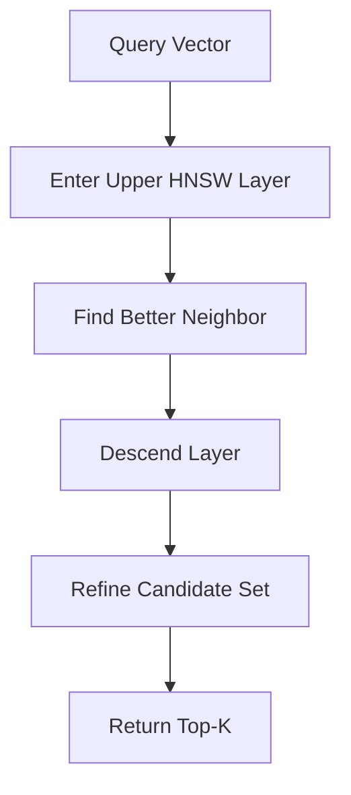
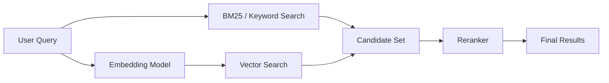
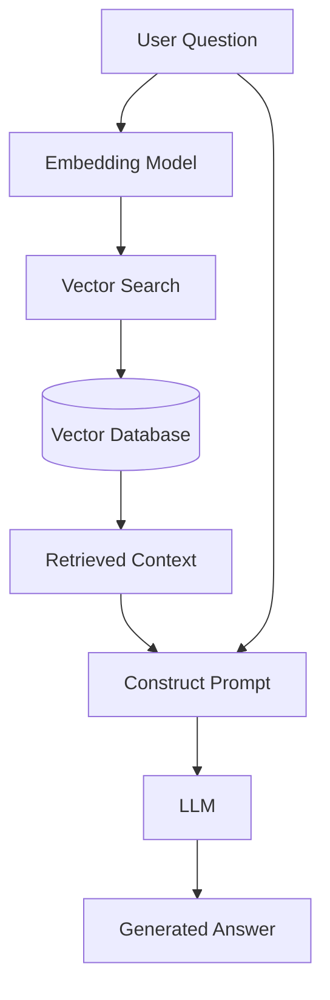
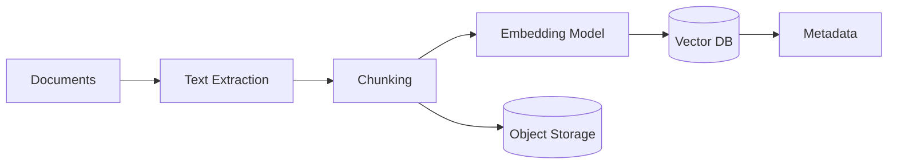
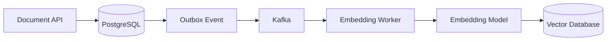
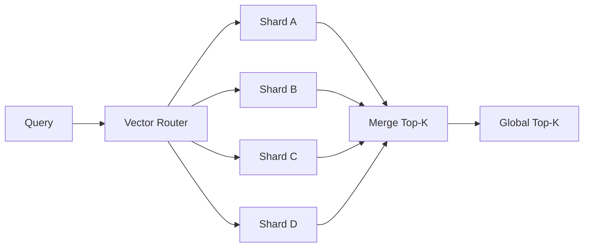

# 14- Vector Databases

## Overview

A vector database is a data storage and retrieval system optimized for storing **high-dimensional numerical vectors** and finding vectors that are similar to a query vector.

Vectors are typically produced by embedding models. For example:

```text
"How do I reset my password?"
            |
            v
      Embedding Model
            |
            v
[0.021, -0.184, 0.732, ..., 0.091]
```

The resulting vector represents semantic characteristics of the input. Similar inputs tend to produce vectors that are close to one another according to a similarity metric.

Traditional relational databases are optimized primarily for exact and structured queries:

```sql
SELECT *
FROM documents
WHERE tenant_id = 42
  AND status = 'published';
```

Vector databases optimize a different class of query:

```text
"Find the documents most semantically similar to this query."
```

A typical retrieval pipeline is:


Vector databases are commonly used for:

- Semantic search
- Retrieval-Augmented Generation (RAG)
- Recommendation systems
- Similarity search
- Image and audio retrieval
- Duplicate detection
- Content discovery
- Anomaly detection
- Personalization
- AI-powered search

A vector database does **not** understand meaning by itself. The embedding model converts data into vectors, while the database efficiently stores, indexes, filters, and retrieves those vectors.

---

## Why Vector Databases Exist

Traditional databases answer questions based primarily on structured values.

For example:

```sql
SELECT *
FROM products
WHERE category = 'laptop'
  AND brand = 'Dell';
```

This works well when the desired relationship is explicitly represented in the data.

Semantic search asks a different question:

```text
Find products similar to:
"lightweight laptop suitable for software development"
```

There may be no exact database column containing that phrase.

An embedding model transforms the query into a vector:

```text
Query
  |
  v
Embedding
  |
  v
[0.12, -0.83, 0.21, ...]
```

The vector database then searches for nearby vectors:

```text
Query Vector
      |
      v
+-------------------+
| Vector Index      |
+-------------------+
   |       |       |
   v       v       v
Product A Product B Product C
  0.91      0.87      0.42
```

The closer the vectors, according to the chosen metric, the more similar they are considered.

---

## What Is a Vector?

A vector is an ordered collection of numerical values.

For example:

```text
[0.12, -0.41, 0.87, 0.22]
```

The number of dimensions is the vector's dimensionality.

Examples:

```text
384 dimensions
768 dimensions
1024 dimensions
1536 dimensions
3072 dimensions
```

The dimensionality depends on the embedding model.

A vector can be represented mathematically as:

```text
v = [v1, v2, v3, ..., vd]
```

where `d` is the number of dimensions.

The vector database must store vectors consistently:

```text
Embedding model
      |
      v
Fixed dimensionality
      |
      v
Vector database
```

You cannot normally insert a vector of dimension `768` into a collection configured for `1536` dimensions.

---

## Embeddings

An embedding is a numerical representation of an object produced by a machine-learning model.

Objects can include:

- Text
- Images
- Audio
- Code
- Products
- Documents
- Users
- Events

For text:

```text
"Python is used for backend development."
```

might become:

```text
[
    0.021,
    -0.193,
    0.732,
    ...
]
```

The embedding model determines what semantic information is encoded.

The vector database does not create semantic meaning.

The relationship is:

```text
Raw Data
   |
   v
Embedding Model
   |
   v
Vector
   |
   v
Vector Database
```

This distinction is important when designing AI systems.

---

## Vector Search

Vector search retrieves vectors that are close to a query vector according to a similarity or distance metric.

A simplified query looks like:

```text
query_vector = [0.1, 0.2, 0.3, ...]

search(query_vector, top_k=10)
```

The database returns:

```text
Document A -> similarity 0.94
Document B -> similarity 0.91
Document C -> similarity 0.88
...
```

The application can then use those records for:

- Search results
- Recommendation
- RAG context
- Classification
- Similarity detection

---

## Similarity and Distance Metrics

The most common metrics are:

- Cosine similarity
- Euclidean distance
- Dot product

| Metric | Core idea | Common use |
|---|---|---|
| Cosine similarity | Compares vector direction | Text embeddings |
| Euclidean distance | Measures geometric distance | Spatial/vector data |
| Dot product | Measures vector alignment and magnitude | Recommendation/ML workloads |

The correct metric depends on how the embedding model was trained and how its vectors are expected to be compared.

---

## Cosine Similarity

Cosine similarity measures the angle between two vectors.

The formula is:

```text
cosine_similarity(A, B)
=
(A · B) / (||A|| ||B||)
```

Conceptually:

```text
       B
      /
     /
    / θ
   /
  A
```

For normalized vectors:

```text
cosine_similarity(A, B)
≈
A · B
```

Typical interpretation:

| Value | Interpretation |
|---:|---|
| `1` | Same direction |
| `0` | Orthogonal |
| `-1` | Opposite direction |

Actual interpretation depends on the embedding model and application.

---

## Euclidean Distance

Euclidean distance measures the geometric distance between vectors:

```text
distance(A, B)
=
sqrt(
    Σ(Ai - Bi)^2
)
```

Smaller distance means greater proximity.

For example:

```text
A = [1, 2]
B = [2, 3]

distance = sqrt((1 - 2)^2 + (2 - 3)^2)
         = sqrt(2)
```

Euclidean distance can be appropriate when the embedding space and model semantics make geometric magnitude meaningful.

---

## Dot Product

The dot product is:

```text
A · B = Σ(Ai * Bi)
```

For normalized vectors, dot product and cosine similarity are equivalent.

For non-normalized vectors, magnitude also influences the score.

This distinction matters because switching metrics without understanding vector normalization can change retrieval behavior significantly.

---

## Exact vs Approximate Vector Search

There are two broad approaches.

### Exact Search

Exact search compares the query vector against every candidate.

For:

```text
N = 10,000,000
```

vectors, a naive exact search potentially evaluates:

```text
10,000,000
```

distance calculations per query.

This becomes expensive as the dataset grows.

### Approximate Nearest Neighbor Search

Approximate Nearest Neighbor (ANN) algorithms avoid examining every vector.

They trade some recall for significantly lower search latency.

The architecture becomes:

```text
Query Vector
     |
     v
ANN Index
     |
     +---- Candidate A
     +---- Candidate B
     +---- Candidate C
     |
     v
Top-K Results
```

The goal is not necessarily to find the mathematically exact nearest neighbors.

The goal is:

> Find sufficiently good nearest neighbors with predictable production latency.

---

## ANN Indexing

A vector database generally maintains an index optimized for nearest-neighbor retrieval.

Common approaches include:

- HNSW
- IVF
- Product Quantization
- Disk-based ANN techniques
- Specialized graph indexes

Different databases expose different combinations and implementations.

---

## HNSW

Hierarchical Navigable Small World (HNSW) is a graph-based approximate nearest-neighbor algorithm.

It builds multiple layers of a proximity graph.

Conceptually:

```text
Layer 2:

A -------- D
 \        /
  \      /
    ----


Layer 1:

A --- B --- C
|     |     |
D --- E --- F
 \         /
   --- G ---
```

Higher layers provide long-range navigation.

Lower layers provide increasingly detailed local search.

A simplified search process is:



The algorithm attempts to quickly navigate toward regions containing vectors close to the query.

---

## HNSW Trade-offs

HNSW provides strong search performance but consumes memory for graph connectivity.

Important configuration parameters commonly include:

| Parameter | Purpose |
|---|---|
| `M` | Number of graph connections per node |
| `ef_construction` | Build-time search width |
| `ef_search` | Query-time search width |

Increasing search parameters can improve recall but increase:

- CPU usage
- Latency
- Memory requirements
- Index build time

A production system should benchmark these parameters rather than blindly maximizing them.

---

## Recall vs Latency

Vector retrieval involves a fundamental trade-off:

```text
Higher recall
     ^
     |
     |       *
     |     *
     |   *
     | *
     +-----------------> Latency
```

Higher search effort generally improves the probability that the true nearest neighbors are found.

But it costs more CPU and latency.

For an AI retrieval system:

```text
Recall
  +
Precision
  +
Latency
  +
Cost
```

must be considered together.

A theoretically excellent vector index can still be a poor production choice if it violates the application's latency budget.

---

## Top-K Search

Most applications do not need every similar vector.

They request:

```text
Top K
```

For example:

```text
top_k = 10
```

The database returns the ten best candidates.

In RAG systems, this might become:

```text
Query
  |
  v
Vector Search
  |
  v
Top 20 candidates
  |
  v
Metadata filtering
  |
  v
Reranking
  |
  v
Top 5 documents
  |
  v
LLM
```

The initial vector search is therefore often only the first retrieval stage.

---

## Metadata Filtering

Real systems rarely search only by vector similarity.

They often combine similarity with structured constraints.

Example:

```text
Find documents semantically similar to:

"How do I configure PostgreSQL replication?"

where:

tenant_id = 42
language = "en"
document_type = "internal"
created_at >= 2026-01-01
```

This requires vector search plus metadata filtering.

A conceptual query is:

```python
results = vector_store.search(
    vector=query_embedding,
    top_k=20,
    filter={
        "tenant_id": 42,
        "language": "en",
        "document_type": "internal",
    },
)
```

This is critical for multi-tenant systems.

A similarity match alone must never bypass tenant isolation.

---

## Pre-Filtering vs Post-Filtering

There are two common strategies.

### Pre-Filtering

The system restricts candidates before or during ANN search.

```text
Query
  |
  v
Metadata Filter
  |
  v
ANN Search
  |
  v
Top-K
```

This can be efficient when the vector index supports filtering well.

### Post-Filtering

The system performs vector search first and filters the results afterward.

```text
Query
  |
  v
ANN Search
  |
  v
Top-K candidates
  |
  v
Metadata Filter
```

This can cause an important problem.

Suppose:

```text
top_k = 10
```

but only one of the ten results belongs to the required tenant.

The application may end up with:

```text
1 usable result
```

instead of ten.

Production vector databases therefore need careful handling of filtering and ANN candidate expansion.

---

## Vector Database Data Model

A typical vector record contains:

```text
ID
Vector
Metadata
Original Content Reference
Timestamp
Tenant ID
```

For example:

```json
{
  "id": "document-123",
  "vector": [0.12, -0.43, 0.77],
  "metadata": {
    "tenant_id": "tenant-42",
    "document_type": "policy",
    "language": "en"
  },
  "content_ref": "s3://documents/document-123"
}
```

The actual document body does not necessarily need to live inside the vector database.

A common architecture is:

```text
Vector DB
   |
   +--> vector
   +--> metadata
   +--> document ID
              |
              v
        Object Storage
```

This separates retrieval infrastructure from primary content storage.

---

## Vector Database vs Relational Database

A vector database is not automatically a replacement for PostgreSQL.

| Requirement | PostgreSQL | Vector Database |
|---|---|---|
| Transactions | Excellent | Depends on product |
| Relational joins | Excellent | Limited |
| Structured queries | Excellent | Usually limited |
| Exact lookup | Excellent | Supported |
| Vector similarity | Supported by extensions in some systems | Core capability |
| ANN indexing | Available in some systems | Core capability |
| Strong relational modeling | Excellent | Not primary purpose |
| General OLTP | Excellent | Usually not ideal |

For many systems, the best architecture is hybrid.

```text
                 +----------------+
                 | Application    |
                 +-------+--------+
                         |
             +-----------+-----------+
             |                       |
             v                       v
       PostgreSQL              Vector DB
       OLTP data              Embeddings
             |                       |
             +-----------+-----------+
                         |
                         v
                     Response
```

---

## PostgreSQL with pgvector

For many applications, a dedicated vector database is not required.

PostgreSQL can store vectors using the `pgvector` extension.

A simplified schema is:

```sql
CREATE TABLE documents (
    id BIGSERIAL PRIMARY KEY,
    tenant_id BIGINT NOT NULL,
    content TEXT NOT NULL,
    embedding VECTOR(1536),
    created_at TIMESTAMPTZ NOT NULL DEFAULT NOW()
);
```

Vector similarity can then be queried using the supported vector operators and indexes.

A conceptual query is:

```sql
SELECT
    id,
    content,
    1 - (embedding <=> $1) AS similarity
FROM documents
WHERE tenant_id = $2
ORDER BY embedding <=> $1
LIMIT 10;
```

The exact operator depends on the selected distance metric and pgvector configuration.

This architecture is attractive when:

- Existing PostgreSQL infrastructure is already strong.
- Dataset size is manageable.
- Transactional and vector data belong together.
- Operational simplicity is more important than specialized vector infrastructure.

---

## Dedicated Vector Databases

Dedicated systems are useful when vector retrieval becomes a primary workload.

Common categories include:

- Managed vector databases
- Open-source vector databases
- Search engines with vector capabilities
- Relational databases with vector extensions

Examples include:

- Qdrant
- Milvus
- Weaviate
- Pinecone
- Elasticsearch/OpenSearch
- PostgreSQL with pgvector

The correct choice depends on:

- Dataset size
- Query rate
- Filtering requirements
- Latency requirements
- Hosting model
- Operational expertise
- Cost
- Replication requirements
- Multi-tenancy
- Hybrid search requirements

---

## Vector Database vs Search Engine

Traditional search engines are optimized for lexical retrieval.

For example:

```text
"postgres replication"
```

can match documents containing:

```text
postgres
replication
```

Vector search can retrieve semantically related content even when exact words differ.

For example:

```text
Query:
"How can I keep a secondary database synchronized?"
```

might retrieve:

```text
"PostgreSQL streaming replication"
```

because the concepts are semantically related.

Modern systems often combine both approaches.

---

## Hybrid Search

Hybrid search combines:

```text
Lexical Search
+
Vector Search
```

A typical architecture is:



This can outperform either retrieval method alone.

Lexical search is particularly useful for:

- Exact names
- IDs
- Error messages
- Product codes
- Technical terms
- Version numbers

Vector search is useful for:

- Semantic similarity
- Paraphrases
- Natural-language questions
- Conceptual relationships

---

## RAG Architecture

One of the most common vector database applications is Retrieval-Augmented Generation.

The basic architecture is:



The vector database provides relevant context.

The LLM generates the final response.

This separation is important:

```text
Vector DB = Retrieval
LLM       = Generation
```

A vector database does not replace the LLM.

---

## Document Ingestion Pipeline

A production RAG system usually has an asynchronous ingestion pipeline.



For large systems, ingestion is usually decoupled from request handling.

For example:

```text
Upload API
   |
   v
S3
   |
   v
Kafka / Queue
   |
   v
Celery / Worker
   |
   +--> Extract
   +--> Chunk
   +--> Embed
   +--> Store vectors
```

This prevents embedding generation from blocking synchronous API requests.

---

## Chunking

Documents are generally split into smaller chunks before embedding.

For example:

```text
Large Document
      |
      v
+-------------+
| Chunk 1     |
+-------------+
| Chunk 2     |
+-------------+
| Chunk 3     |
+-------------+
```

Chunk size affects retrieval quality.

If chunks are too large:

- Retrieval becomes less precise.
- Context contains unrelated information.
- LLM context consumption increases.

If chunks are too small:

- Important context can be lost.
- Individual chunks may lack semantic meaning.
- More retrieval results may be necessary.

Chunking should preserve semantic boundaries where possible.

Good boundaries often include:

- Sections
- Paragraph groups
- API definitions
- Functions/classes
- Headings
- Logical document units

---

## Chunk Overlap

Chunk overlap can preserve context across boundaries.

For example:

```text
Chunk 1:
A B C D E F

Chunk 2:
        E F G H I J
```

The overlap:

```text
E F
```

reduces the chance that information split across chunks becomes unretrievable.

However, excessive overlap increases:

- Storage
- Embedding cost
- Index size
- Duplicate retrievals

There is no universally correct overlap percentage.

---

## Embedding Model Versioning

Embedding models are part of the data model.

Suppose version one produces:

```text
embedding_v1
```

and version two produces:

```text
embedding_v2
```

The vector spaces may not be directly comparable.

Do not silently mix vectors from incompatible models.

Store metadata such as:

```json
{
  "embedding_model": "model-v2",
  "embedding_dimension": 1536,
  "embedding_version": 2
}
```

When changing embedding models, plan for:

- Re-embedding
- Backfills
- Dual-write migration
- Versioned indexes
- A/B testing
- Rollback

---

## Embedding Pipeline Consistency

The same embedding configuration used for indexing should be compatible with query-time embedding.

Bad architecture:

```text
Documents
   |
   v
Embedding Model A
   |
   v
Vector DB


Queries
   |
   v
Embedding Model B
   |
   v
Vector DB
```

The resulting vectors may not be meaningfully comparable.

Safer:

```text
Documents ---> Embedding Model V1 ---> Vector DB
                                      ^
                                      |
Queries -----> Embedding Model V1 ----+
```

Embedding configuration should be treated as a versioned production dependency.

---

## Metadata Design

Metadata is critical in production vector systems.

Example:

```json
{
  "tenant_id": "tenant-42",
  "document_id": "doc-123",
  "chunk_id": "doc-123-chunk-07",
  "document_type": "engineering",
  "language": "en",
  "access_level": "internal",
  "created_at": "2026-08-23T10:00:00Z"
}
```

Useful metadata enables:

- Tenant isolation
- Authorization filtering
- Document-type filtering
- Time-based retrieval
- Version filtering
- Soft deletion
- Content lifecycle management

Do not treat metadata as an afterthought.

---

## Multi-Tenant Vector Search

A multi-tenant system must prevent cross-tenant retrieval.

Unsafe:

```python
results = vector_db.search(
    vector=query_vector,
    top_k=10,
)
```

If vectors from multiple tenants exist in the same collection, this may return another tenant's documents.

Instead, apply tenant isolation:

```python
results = vector_db.search(
    vector=query_vector,
    top_k=10,
    filter={
        "tenant_id": current_tenant_id,
    },
)
```

The tenant boundary should be enforced server-side.

Never trust a client-provided tenant identifier without validating it against the authenticated principal.

---

## Authorization in RAG

Retrieval security is different from normal API authorization.

Suppose:

```text
User A
```

asks:

```text
"What is our internal compensation policy?"
```

The vector database may contain:

```text
Public documents
Internal documents
HR documents
Executive documents
```

A pure semantic search could identify the most relevant sensitive document.

Therefore:

```text
Authentication
      |
      v
Authorization
      |
      v
Metadata Filter
      |
      v
Vector Search
```

Access control must constrain retrieval candidates.

Do not retrieve sensitive documents and rely on the LLM to decide whether they should be shown.

---

## Deletion and Data Lifecycle

Deleting a document from the source system does not automatically remove its embedding.

A production lifecycle must handle:

```text
Document Created
      |
      v
Embedded
      |
      v
Indexed
      |
      v
Updated
      |
      v
Re-embedded
      |
      v
Deleted
      |
      v
Vector Removed
```

Track stable identifiers:

```text
document_id
chunk_id
embedding_version
```

This makes cleanup deterministic.

---

## Updates and Idempotency

Embedding pipelines should be idempotent.

For example:

```text
document_id = 123
version = 7
```

can identify a particular content version.

If a worker retries:

```text
Extract
  |
  v
Embed
  |
  v
Store
```

the operation should not create uncontrolled duplicate vectors.

A robust design uses deterministic IDs such as:

```text
document-123:version-7:chunk-004
```

or equivalent identifiers supported by the vector store.

---

## Event-Driven Vector Updates

Kafka can decouple document changes from vector indexing.



A transactionally consistent outbox pattern can prevent the common failure:

```text
Database write succeeds
Kafka publish fails
```

Without an outbox, the document may exist in PostgreSQL but never receive an updated embedding.

---

## Vector Search Request Lifecycle

A typical synchronous search request looks like:

```text
1. Client sends query
2. API authenticates request
3. API determines tenant/security scope
4. Query is embedded
5. Vector database receives query vector
6. ANN index finds candidates
7. Metadata filters are applied
8. Top-K candidates are returned
9. Optional reranker processes candidates
10. Application builds final response
```

For RAG:

```text
11. Retrieved chunks are inserted into the LLM prompt
12. LLM generates response
13. API returns response
```

The embedding model and vector database therefore become part of the request latency budget.

---

## Latency Budget

Suppose an API has:

```text
P95 target = 500 ms
```

The request might allocate:

| Stage | Example budget |
|---|---:|
| API processing | 30 ms |
| Query embedding | 80 ms |
| Vector search | 40 ms |
| Reranking | 100 ms |
| LLM generation | 220 ms |
| Network/overhead | 30 ms |
| Total | 500 ms |

The exact values depend on infrastructure and model.

The key point is that vector search is only one component of an AI application's latency.

Do not optimize the vector index while ignoring:

- Embedding latency
- Network latency
- Reranking
- LLM latency
- Serialization
- Connection setup

---

## Caching

Vector search can be combined with Redis.

Useful caching targets include:

- Frequently requested embeddings
- Frequently requested search results
- Reranking results
- Prompt context
- Model responses

For example:

```text
Query
  |
  v
Normalize Query
  |
  v
Redis
  |
  +---- Hit ---> Cached Results
  |
  +---- Miss --> Embed ---> Vector DB
```

Cache keys should include relevant dimensions:

```text
tenant_id
query
embedding_model_version
filter configuration
index version
```

Otherwise, cached results can become incorrect or leak data across tenants.

---

## Horizontal Scaling

Vector workloads can become expensive at high cardinality.

A scalable architecture may use:

```text
                  Load Balancer
                       |
          +------------+------------+
          |            |            |
          v            v            v
      Vector Node  Vector Node  Vector Node
          |            |            |
          +------------+------------+
                       |
                  Distributed Index
```

Scaling dimensions include:

- Query throughput
- Dataset size
- Memory
- Index build time
- Replication
- Sharding
- Network bandwidth

Different vector databases use different distribution strategies.

---

## Sharding

A vector dataset may be partitioned across nodes.

For example:

```text
Collection
    |
    +---- Shard A
    +---- Shard B
    +---- Shard C
    +---- Shard D
```

A query may fan out:



The system must merge results from each shard to determine the global top-K.

This introduces:

- Network overhead
- Fan-out latency
- Merge CPU
- Uneven shard utilization

---

## Partitioning Strategy

Possible partition keys include:

- Tenant
- Region
- Document type
- Time period
- Business domain

Tenant-based partitioning can simplify isolation:

```text
Tenant A -> Partition A
Tenant B -> Partition B
Tenant C -> Partition C
```

But extreme tenant skew can create hot partitions.

A single enterprise tenant with 90% of the data may overload one partition.

Partitioning must therefore consider workload distribution, not just logical ownership.

---

## Replication and High Availability

Vector databases should support redundancy appropriate to the application's requirements.

A production deployment may have:

```text
                 Application
                     |
                Vector Router
                 /       \
                v         v
          Replica A   Replica B
```

Replication protects against node failure.

However, understand what is replicated:

- Data
- Index
- Metadata
- Configuration
- Snapshots

Also understand recovery behavior.

A vector database should have a defined recovery process rather than relying exclusively on replication.

---

## Backup and Disaster Recovery

Vector data is often derived from source content.

A recovery strategy can therefore be:

```text
Primary Content
     |
     v
Object Storage / PostgreSQL
     |
     v
Rebuild Embeddings
     |
     v
Rebuild Vector Index
```

But rebuilding may be expensive.

For large systems, consider:

- Vector database snapshots
- Index backups
- Object storage backups
- Embedding model version retention
- Metadata backups
- Periodic recovery tests

A snapshot is only useful if it can actually be restored within the required RTO.

---

## Consistency Considerations

Vector search systems often tolerate some degree of eventual consistency.

For example:

```text
Document created
      |
      v
PostgreSQL updated
      |
      v
Kafka event
      |
      v
Embedding worker
      |
      v
Vector DB updated
```

There may be a delay between:

```text
Document available
```

and:

```text
Document searchable
```

This is usually acceptable for asynchronous indexing systems.

It is not acceptable if the product contract requires immediate search visibility.

The consistency requirement should therefore be explicit.

---

## Cost Considerations

Vector workloads can become expensive because of:

- Embedding generation
- Vector storage
- ANN indexes
- Memory
- Replicas
- Query CPU
- Network traffic
- Reranking
- Re-embedding
- LLM usage

The cost model is often:

```text
Documents
   |
   v
Embedding Cost
   |
   v
Storage Cost
   |
   v
Index Cost
   |
   v
Query Cost
   |
   v
Reranking Cost
   |
   v
Generation Cost
```

Re-embedding an entire corpus after changing models can be one of the largest operational costs.

---

## Monitoring

Vector systems require both infrastructure and retrieval-quality metrics.

### Infrastructure Metrics

Monitor:

- Query latency
- P50/P95/P99 latency
- Queries per second
- CPU utilization
- Memory utilization
- Disk usage
- Index size
- Network throughput
- Replica health
- Error rate
- Timeout rate

### Retrieval Metrics

Monitor:

- Recall
- Precision
- Hit rate
- Empty-result rate
- Top-K relevance
- Reranker improvement
- Duplicate retrieval rate
- Search score distributions

### RAG Metrics

For RAG applications, additionally measure:

- Context relevance
- Context recall
- Groundedness
- Answer correctness
- Citation correctness
- Retrieval latency
- Generation latency

Infrastructure health does not guarantee retrieval quality.

A vector database can be operating perfectly while returning poor documents because of bad chunking or embeddings.

---

## Observability

Trace the complete request:

```text
API Request
   |
   +--> Authentication
   |
   +--> Embedding
   |
   +--> Vector Search
   |
   +--> Reranking
   |
   +--> LLM
   |
   +--> Response
```

Distributed tracing should expose:

```text
embedding.duration
vector_search.duration
vector_search.top_k
vector_search.candidate_count
reranker.duration
llm.duration
```

Avoid logging raw sensitive document content or embeddings unnecessarily.

---

## Security Considerations

Vector databases introduce several security concerns.

### Tenant Isolation

Always enforce tenant filtering server-side.

### Authorization Filtering

Retrieval must respect the same access model as the source data.

### Encryption

Use:

- Encryption in transit
- Encryption at rest
- Managed secrets
- Private networking where appropriate

### Access Control

Restrict:

- Collection management
- Index modification
- Data deletion
- Administrative APIs
- Query APIs

### Data Leakage

Embeddings are not guaranteed to be harmless representations.

Treat them as derived data that may still require protection.

### Prompt Injection

In RAG systems, retrieved documents may contain malicious instructions.

The architecture should distinguish:

```text
Retrieved content
```

from:

```text
Trusted system instructions
```

Never assume that retrieved text is trustworthy merely because it came from the vector database.

---

## Production Best Practices

### Keep the Source of Truth Separate

Use:

```text
PostgreSQL / S3
      |
      v
Vector DB
```

when embeddings are derived from authoritative content.

### Version Embeddings

Store:

```text
embedding_model
embedding_version
dimension
```

with the indexed data.

### Make Ingestion Idempotent

Retries should not create uncontrolled duplicates.

### Filter Before Retrieval When Possible

Push tenant and authorization constraints into the vector database when supported.

### Benchmark ANN Parameters

Measure:

```text
Recall
Latency
Memory
CPU
```

instead of relying on defaults.

### Use Hybrid Retrieval for Technical Search

For developer documentation, combine:

```text
Keyword search
+
Semantic search
```

because exact terms such as:

```text
HTTP 502
Django ORM
PostgreSQL 16
Redis SETNX
```

can be poorly handled by semantic-only retrieval.

### Treat the Vector Database as Derived Infrastructure

Ensure the system can rebuild it from authoritative data.

### Separate Ingestion From Request Handling

Use asynchronous workers for expensive embedding and indexing operations.

### Test Retrieval Quality

Do not rely exclusively on unit tests.

Maintain evaluation datasets containing:

```text
query
expected relevant documents
acceptable alternatives
```

and continuously evaluate retrieval quality.

---

## Common Mistakes and Pitfalls

### Treating Vector Search as Magic Semantic Understanding

The database does not understand language.

The embedding model determines the representation.

Poor embeddings produce poor retrieval.

### Choosing a Vector Database Before Understanding the Workload

Start with requirements:

```text
dataset size
QPS
latency
filtering
recall
multi-tenancy
availability
cost
```

Then choose the storage engine.

### Ignoring Metadata Filtering

Semantic similarity alone is insufficient for:

- Tenant isolation
- Authorization
- Time ranges
- Document types
- Business constraints

### Using Incompatible Embeddings

Do not mix vectors produced by incompatible embedding models or dimensions.

### Retrieving Too Many Documents

Large `top_k` values increase:

- Network traffic
- Context size
- Reranking cost
- LLM input tokens

More results do not automatically mean better answers.

### Retrieving Too Few Documents

Very small `top_k` values can reduce recall.

The correct value should be evaluated empirically.

### Ignoring Chunk Quality

Bad chunking can make an excellent vector index produce poor retrieval.

### Re-Embedding Without a Migration Plan

Changing models can require processing millions or billions of vectors.

Plan:

```text
Version
Build
Evaluate
Migrate
Cut over
Rollback
```

### Using Vector Search for Exact Lookups

Do not use semantic search to find:

```text
order_id = 123456
```

Use an exact indexed lookup.

### Treating Similarity Scores as Universal Probabilities

A score such as:

```text
0.87
```

does not necessarily mean:

```text
87% probability of relevance
```

Score semantics depend on:

- Distance metric
- Embedding model
- Normalization
- Dataset
- Index configuration

### Ignoring Data Deletion

Deleted source documents must eventually disappear from retrieval.

### Trusting Retrieved Content

RAG systems must treat retrieved documents as untrusted input.

---

## Interview Traps

### Is a vector database the same as an embedding model?

No.

```text
Embedding Model -> Produces vectors
Vector Database  -> Stores/indexes/searches vectors
```

### Why can't a relational database always replace a vector database?

Some relational databases support vector extensions and can work extremely well at moderate scale. A specialized vector database becomes attractive when vector search, ANN indexing, distribution, and retrieval throughput become dominant workloads.

### What is ANN?

Approximate Nearest Neighbor search finds vectors close to a query without exhaustively comparing against every vector.

### Why is HNSW popular?

It provides strong approximate nearest-neighbor performance and recall using a navigable proximity graph, at the cost of memory and index-building complexity.

### What is the difference between cosine similarity and Euclidean distance?

Cosine similarity primarily compares vector direction, while Euclidean distance measures geometric distance. Their behavior can become equivalent under appropriate vector normalization.

### Why use metadata filters?

To constrain retrieval to valid candidates such as:

```text
tenant
permissions
document type
region
time range
```

### What happens if a document is deleted from PostgreSQL but not from the vector database?

The deleted document can still be retrieved, causing stale or potentially unauthorized information to enter the application or LLM context.

### Does vector search guarantee relevant results?

No.

Retrieval quality depends on:

- Embedding model
- Chunking
- Index
- Search parameters
- Metadata filtering
- Query formulation
- Reranking
- Evaluation methodology

### Why combine BM25 with vector search?

Keyword retrieval handles exact terms well, while vector retrieval handles semantic similarity. Hybrid retrieval can provide better coverage for technical and natural-language queries.

### Why is multi-tenancy particularly important?

A vector similarity search can naturally return the most similar record regardless of business ownership unless tenant and authorization constraints are explicitly enforced.

---

## Key Takeaways

- **Vector databases optimize similarity search over embeddings; the embedding model creates the vectors while the database stores, indexes, filters, and retrieves them.**
- **Approximate nearest-neighbor indexes such as HNSW trade some recall and memory/CPU cost for dramatically better search performance at large scale.**
- **Production vector retrieval requires more than similarity search: metadata filtering, tenant isolation, authorization, chunking, embedding versioning, and lifecycle management are critical.**
- **PostgreSQL with pgvector can be an excellent starting point when transactional data and vector search belong together; dedicated vector infrastructure becomes valuable as vector workloads and scale increase.**
- **For RAG and search systems, retrieval quality must be measured independently from infrastructure health, with hybrid search, reranking, evaluation datasets, and observability used where appropriate.**