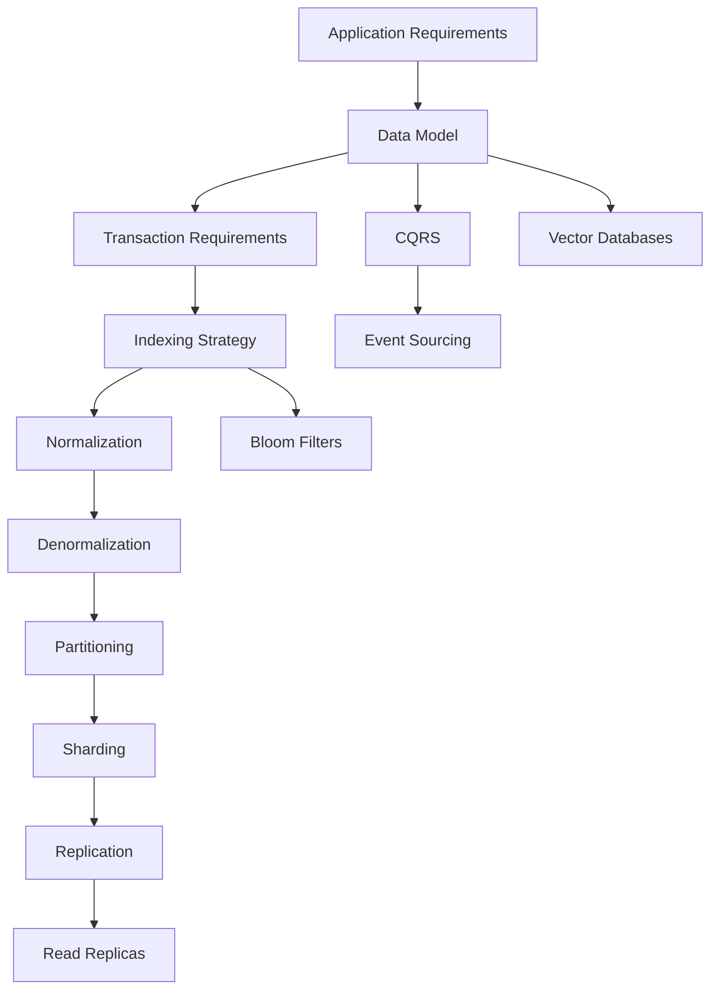
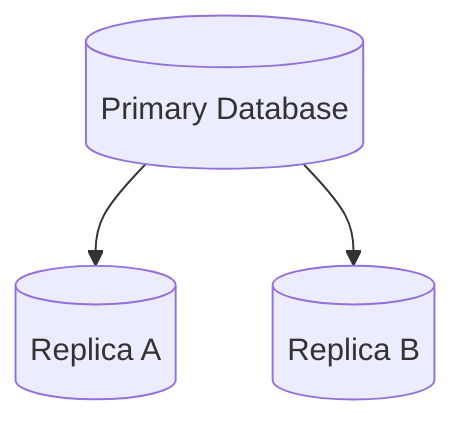
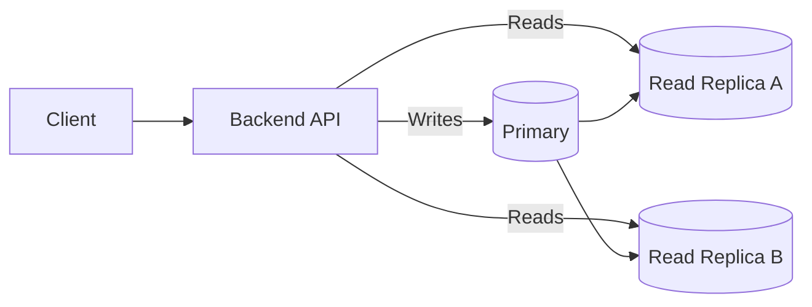
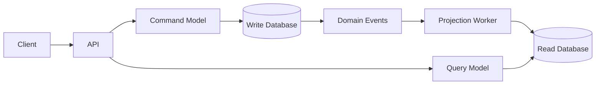
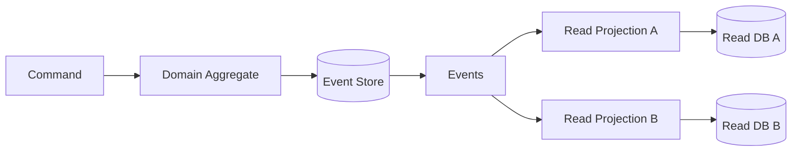
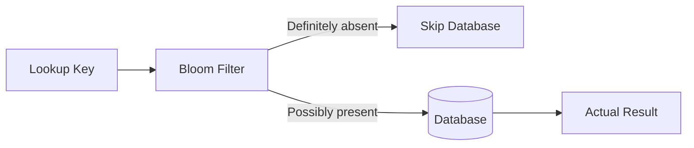
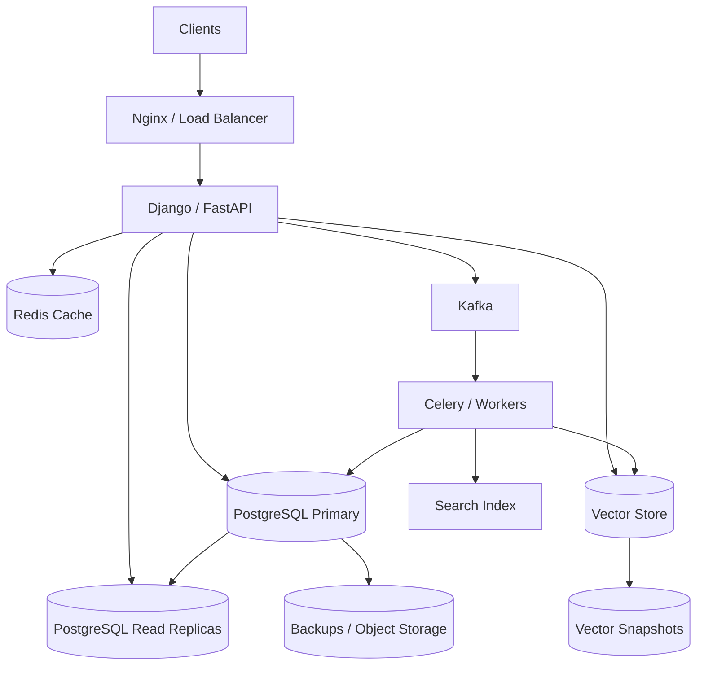

# 15- Summary

## Overview

Data storage is a system-design problem, not simply a database-selection problem. A production backend must choose storage mechanisms based on the application's consistency requirements, access patterns, workload characteristics, availability targets, scale, and operational constraints.

The concepts covered in this section form a connected decision framework:



A senior backend engineer should be able to reason about these concepts together rather than treating them as isolated database features.

The central question is not:

> "Which database is fastest?"

It is:

> "What storage architecture provides the required correctness, performance, scalability, availability, and operational simplicity for this workload?"

---

## Core Data Storage Principles

A reliable data architecture starts with understanding the application's workload.

Important dimensions include:

| Dimension | Questions |
|---|---|
| Data model | Relational, document, key-value, graph, vector? |
| Read/write ratio | Mostly reads, mostly writes, or balanced? |
| Consistency | Strong, eventual, or mixed? |
| Transactions | Are multi-record atomic operations required? |
| Query patterns | Exact lookup, range query, joins, full-text, similarity? |
| Scale | How much data and how many requests? |
| Availability | What downtime is acceptable? |
| Latency | What are the P50/P95/P99 requirements? |
| Geography | Single region or globally distributed? |
| Security | What isolation and authorization boundaries exist? |
| Recovery | What are the RPO and RTO requirements? |
| Operations | How much infrastructure can the team operate? |

Database architecture should follow these requirements rather than forcing the requirements to fit a preferred technology.

---

## ACID

ACID describes properties that make database transactions reliable.

| Property | Meaning |
|---|---|
| Atomicity | A transaction succeeds completely or is rolled back |
| Consistency | Transactions preserve defined data invariants |
| Isolation | Concurrent transactions behave according to the database's isolation guarantees |
| Durability | Committed data survives failures according to the database's durability guarantees |

A typical transaction:

```text
BEGIN
  |
  +--> Update account A
  |
  +--> Update account B
  |
  v
COMMIT
```

If an operation fails before commit:

```text
BEGIN
  |
  +--> Update A
  |
  +--> Update B
  |
  X Failure
  |
  v
ROLLBACK
```

ACID is particularly important for systems such as:

- Payments
- Orders
- Inventory
- Financial accounting
- User permissions
- Critical state transitions

ACID does not mean that every database operation must use the strongest possible isolation level. Isolation and consistency should be selected according to business requirements.

---

## BASE and Eventual Consistency

Distributed systems often relax immediate consistency to improve:

- Availability
- Scalability
- Geographic distribution
- Write throughput

With eventual consistency:

```text
Write
  |
  v
Primary
  |
  +----> Replica A
  |
  +----> Replica B
```

Replicas may temporarily disagree.

Eventually:

```text
Primary = Replica A = Replica B
```

provided replication and recovery complete successfully.

Eventual consistency is appropriate when temporary staleness is acceptable, such as:

- Social activity feeds
- Analytics dashboards
- Search indexes
- Recommendation systems
- Cached data

It is usually inappropriate for operations where stale state can violate a business invariant.

---

## Normalization

Normalization structures relational data to reduce duplication and update anomalies.

A normalized model might separate:

```text
Customer
   |
   +----< Orders
              |
              +----< Order Items
```

Benefits include:

- Reduced duplication
- Better update consistency
- Clear ownership of data
- Stronger relational integrity

Normalization is generally a good default for transactional systems.

However, highly normalized schemas can require more joins and may increase read complexity.

---

## Denormalization

Denormalization deliberately duplicates or precomputes data to optimize read performance.

For example, instead of repeatedly calculating:

```sql
SELECT COUNT(*)
FROM orders
WHERE customer_id = ?;
```

a system may maintain:

```text
customer.total_orders
```

This improves read performance at the cost of additional write complexity.

The trade-off is:

```text
Normalization
    |
    +--> Less duplication
    +--> Easier consistency
    +--> More joins

Denormalization
    |
    +--> Faster reads
    +--> Fewer joins
    +--> More duplicated state
    +--> More consistency management
```

Denormalization should be driven by measured access patterns rather than premature optimization.

---

## Database Indexing

Indexes accelerate data retrieval by maintaining additional data structures optimized for specific query patterns.

For example:

```sql
CREATE INDEX idx_users_email
ON users(email);
```

Without an appropriate index:

```text
Query
  |
  v
Scan many rows
  |
  v
Find matching row
```

With an index:

```text
Query
  |
  v
Index lookup
  |
  v
Relevant row locations
  |
  v
Table data
```

Indexes improve reads but consume:

- Storage
- Memory
- CPU
- Write bandwidth

Every additional index can make `INSERT`, `UPDATE`, and `DELETE` operations more expensive.

---

## Composite Indexes

A composite index covers multiple columns:

```sql
CREATE INDEX idx_orders_customer_status
ON orders(customer_id, status);
```

Column order matters.

For a query such as:

```sql
SELECT *
FROM orders
WHERE customer_id = 42
  AND status = 'pending';
```

the index can be highly effective.

But an index on:

```text
(customer_id, status)
```

is not equivalent to:

```text
(status, customer_id)
```

for all query patterns.

Index design must be based on actual predicates, ordering, cardinality, and workload.

---

## Query-Driven Index Design

A senior engineer should design indexes from queries rather than from table definitions alone.

Start with:

```sql
SELECT *
FROM orders
WHERE customer_id = ?
  AND status = ?
ORDER BY created_at DESC
LIMIT 50;
```

Then evaluate an index such as:

```sql
CREATE INDEX idx_orders_customer_status_created
ON orders(customer_id, status, created_at DESC);
```

Validate the result with the database query planner.

For PostgreSQL:

```sql
EXPLAIN (ANALYZE, BUFFERS)
SELECT *
FROM orders
WHERE customer_id = 42
  AND status = 'pending'
ORDER BY created_at DESC
LIMIT 50;
```

Do not assume that an index is useful merely because it exists.

---

## Partitioning

Partitioning divides a logical table into smaller physical partitions while preserving a unified logical table interface.

Common strategies include:

- Range partitioning
- List partitioning
- Hash partitioning

Example:

```text
orders
  |
  +---- orders_2026_01
  +---- orders_2026_02
  +---- orders_2026_03
```

Partitioning is useful when:

- Tables become very large.
- Queries naturally filter by a partition key.
- Old data needs independent lifecycle management.
- Maintenance operations need smaller physical units.

Partitioning can improve operational management and query performance through partition pruning.

It does not automatically make every query faster.

---

## Partition Pruning

Suppose orders are partitioned by date:

```text
orders_2026_01
orders_2026_02
orders_2026_03
```

A query:

```sql
SELECT *
FROM orders
WHERE created_at >= '2026-03-01'
  AND created_at < '2026-04-01';
```

can potentially access only:

```text
orders_2026_03
```

instead of scanning all partitions.

This is called partition pruning.

Poor partition-key selection can eliminate this advantage.

---

## Sharding

Sharding distributes data across independent database nodes.

For example:

```text
                 Application
                      |
                  Shard Router
             /        |        \
            v         v         v
       Shard A    Shard B    Shard C
       Users      Users      Users
       1-1M       1-1M       2-3M
```

Sharding is useful when a single database cannot satisfy:

- Storage requirements
- Write throughput
- CPU requirements
- Memory requirements
- Operational scaling requirements

The main complexity is that distributed data is harder to query and coordinate.

Potential complications include:

- Cross-shard queries
- Cross-shard transactions
- Rebalancing
- Hot shards
- Routing
- Resharding
- Operational complexity

Sharding should generally be introduced only after simpler scaling strategies have been exhausted.

---

## Shard Key Selection

The shard key is one of the most important decisions in a sharded architecture.

A good shard key should provide:

- Even distribution
- High cardinality
- Predictable routing
- Alignment with common queries
- Low likelihood of hotspots

A poor key can create:

```text
Shard A -> 80% traffic
Shard B -> 10%
Shard C -> 10%
```

This means the theoretical capacity of all shards is irrelevant because the system is constrained by the overloaded shard.

---

## Replication

Replication maintains copies of data across multiple database instances.

A common topology is:



Replication can provide:

- High availability
- Disaster recovery
- Read scaling
- Geographic redundancy

Replication does not automatically provide all three.

The exact guarantees depend on:

- Synchronous vs asynchronous replication
- Failover design
- Replica health
- Recovery mechanisms
- Application routing

---

## Synchronous vs Asynchronous Replication

### Synchronous Replication

A write may not be considered committed until the required replica acknowledgements are received.

```text
Application
    |
    v
Primary
    |
    +----> Replica
    |
    v
Commit acknowledgement
```

Advantages:

- Stronger durability guarantees
- Lower risk of losing acknowledged writes

Limitations:

- Higher write latency
- Replica availability can affect writes

### Asynchronous Replication

The primary acknowledges the write before replicas necessarily receive it.

```text
Application
    |
    v
Primary ---> Replica
    |
    v
Acknowledgement
```

Advantages:

- Lower write latency
- Better write availability

Limitations:

- Replica lag
- Potential data loss during certain failures
- Stale reads

---

## Read Replicas

Read replicas are replicas primarily used to serve read traffic.



This can scale read-heavy applications.

However, replicas may lag behind the primary.

A classic problem is:

```text
POST /orders
   |
   v
Primary
   |
   v
201 Created

GET /orders/123
   |
   v
Replica
   |
   v
404 Not Found
```

The order exists on the primary but has not yet reached the replica.

Applications must explicitly account for this behavior.

---

## Read-After-Write Consistency

A common technique is to route reads that immediately follow writes to the primary.

For example:

```text
POST /profile
    |
    v
Primary

GET /profile
    |
    +--> Primary for a short consistency window
```

Other approaches include:

- Session-level consistency
- LSN-based routing
- Sticky reads
- Waiting for replica replay
- Application-level consistency tokens

The correct solution depends on the business requirement.

---

## CQRS

Command Query Responsibility Segregation separates write models from read models.



The write side is optimized for correctness and transactional state.

The read side is optimized for query patterns.

CQRS is useful when:

- Read and write workloads differ substantially.
- Read models require specialized projections.
- Complex reporting queries should not burden OLTP storage.
- Different scaling characteristics are required.

CQRS introduces additional complexity:

- Event propagation
- Projection management
- Eventual consistency
- Rebuilding read models
- Operational monitoring

CQRS should not be introduced merely because an application has both reads and writes.

---

## Event Sourcing

Event sourcing stores state transitions as an append-only sequence of events rather than storing only the current state.

For example:

```text
AccountCreated
MoneyDeposited
MoneyDeposited
MoneyWithdrawn
```

Current state is derived by replaying events:

```text
Initial State
     |
     v
AccountCreated
     |
     v
MoneyDeposited
     |
     v
MoneyDeposited
     |
     v
MoneyWithdrawn
     |
     v
Current State
```

The event stream becomes the authoritative history.

Advantages include:

- Complete audit history
- Temporal reconstruction
- Reproducible state
- Natural integration with event-driven systems

Limitations include:

- More complex application logic
- Schema evolution
- Event versioning
- Replay costs
- Eventual consistency in projections

Event sourcing is appropriate when the history of state changes is itself a first-class business requirement.

---

## Event Sourcing and CQRS

CQRS and Event Sourcing are related but independent concepts.

You can use:

```text
CQRS without Event Sourcing
```

and:

```text
Event Sourcing without full CQRS
```

A common architecture combines both:



This creates highly specialized read models from an authoritative event stream.

---

## Bloom Filters

A Bloom filter is a probabilistic data structure used to determine whether an item is **possibly present** or **definitely absent**.

It has two important properties:

```text
False positive -> possible
False negative -> normally impossible
```

For example:

```text
Bloom Filter
    |
    +--> "Definitely not present"
    |
    +--> "Possibly present"
```

Bloom filters are useful for reducing unnecessary storage lookups.

A typical flow is:



Applications include:

- Cache protection
- Key-value stores
- Database read optimization
- Distributed storage
- Duplicate detection

A Bloom filter should never be treated as authoritative storage because false positives are expected.

---

## Vector Databases

Vector databases optimize similarity search over high-dimensional vectors.

A common AI architecture is:

```text
Document
   |
   v
Embedding Model
   |
   v
Vector
   |
   v
Vector Database
```

Queries follow the same transformation:

```text
User Query
   |
   v
Embedding Model
   |
   v
Query Vector
   |
   v
Similarity Search
```

Vector databases are commonly used for:

- Semantic search
- RAG
- Recommendations
- Similarity matching
- AI-powered retrieval

Vector search is often combined with metadata filtering and lexical search.

---

## Choosing the Right Storage Pattern

A useful decision framework is:

| Requirement | Typical approach |
|---|---|
| Transactional consistency | Relational database |
| Complex relationships | Relational database |
| High read volume | Read replicas / caching |
| Very large table | Partitioning |
| Beyond single-node capacity | Sharding |
| Read/write model mismatch | CQRS |
| Full state history required | Event Sourcing |
| Fast negative membership checks | Bloom Filter |
| Semantic similarity | Vector Database |
| Exact lookup | Indexed database |
| Search by words | Search engine |
| Search by meaning | Vector search |
| Exact + semantic search | Hybrid search |

These are not mutually exclusive.

A production system frequently combines several patterns.

---

## A Typical Production Architecture

A mature backend may look like:



Each component has a distinct responsibility.

The architecture should not introduce every technology by default.

---

## Storage Decision Hierarchy

A practical approach is to optimize in stages.

```text
Single relational database
        |
        v
Proper indexes
        |
        v
Query optimization
        |
        v
Caching
        |
        v
Read replicas
        |
        v
Partitioning
        |
        v
Specialized read models
        |
        v
Sharding / distributed storage
```

The exact order varies by workload, but the principle is important:

> Prefer the simplest architecture that satisfies the current requirements.

A poorly optimized single database can often outperform a badly designed distributed system.

---

## Data Access Patterns Matter More Than Technology Names

Database selection should start from access patterns.

For example:

```text
GET /users/{id}
```

suggests:

```text
Primary-key lookup
```

while:

```text
GET /orders?customer_id=42&status=pending
```

suggests:

```text
Composite filtering
```

and:

```text
"Find documents similar to this question"
```

suggests:

```text
Vector retrieval
```

The storage design should directly support the dominant queries.

---

## Reliability and Failure Handling

Every production storage architecture should answer:

- What happens when the primary fails?
- What happens when a replica falls behind?
- What happens when a shard becomes unavailable?
- What happens when Kafka is unavailable?
- What happens when an index becomes corrupted?
- What happens when an embedding worker fails?
- Can derived data be rebuilt?
- How much data can be lost?
- How quickly must the service recover?

The answers should be represented in explicit:

```text
RPO
RTO
Availability target
Consistency model
Failover strategy
Backup strategy
Recovery procedure
```

---

## RPO and RTO

### Recovery Point Objective

RPO defines the maximum acceptable amount of data loss.

```text
RPO = 5 minutes
```

means the system should recover with no more than approximately five minutes of potentially lost data under the specified failure scenario.

### Recovery Time Objective

RTO defines how quickly the service must be restored.

```text
RTO = 30 minutes
```

means the recovery process should restore service within approximately thirty minutes.

These requirements influence:

- Replication
- Backup frequency
- Failover automation
- Multi-region architecture
- Storage cost

---

## Backup Strategy

Backups should be treated as an operational system.

A production strategy should include:

- Automated backups
- Point-in-time recovery where supported
- Backup retention policies
- Cross-region copies when required
- Encryption
- Access controls
- Restore testing

The most common backup mistake is assuming:

```text
Backup exists
```

means:

```text
Recovery works
```

It does not.

A backup strategy is incomplete until restoration has been tested.

---

## Monitoring and Observability

Monitor both infrastructure and application-level behavior.

### Database Metrics

Track:

- CPU
- Memory
- Disk
- IOPS
- Connection count
- Query latency
- Lock contention
- Deadlocks
- Replication lag
- Cache hit ratio
- Storage growth

### Application Metrics

Track:

- Query latency by endpoint
- Read/write ratio
- Error rate
- Timeout rate
- Cache hit rate
- Queue lag
- Projection lag
- Search latency

### Distributed Data Metrics

For CQRS, event sourcing, and asynchronous indexing:

```text
Event ingestion lag
Projection lag
Consumer lag
Replication lag
Indexing lag
Rebuild duration
```

These metrics expose consistency delays that ordinary API monitoring may miss.

---

## Security

Data storage security should be designed at multiple layers.

### Access Control

Apply least privilege to:

- Applications
- Developers
- CI/CD
- Background workers
- Administrative tooling

### Encryption

Use encryption:

```text
Client
  |
 TLS
  |
Application
  |
Encrypted connection
  |
Database
```

Use encryption at rest for database storage, backups, snapshots, and object storage where required.

### Secrets

Never hard-code:

```text
DATABASE_PASSWORD
API_KEY
VECTOR_DB_TOKEN
```

Use a proper secret-management system.

### Data Isolation

Multi-tenant systems require explicit tenant boundaries in:

- SQL queries
- Cache keys
- Search indexes
- Vector filters
- Event consumers
- Background jobs

---

## Scalability Strategy

Storage scalability has multiple dimensions.

| Scaling technique | Primary goal |
|---|---|
| Indexing | Faster queries |
| Caching | Reduce database reads |
| Read replicas | Scale reads |
| Partitioning | Manage large datasets |
| Sharding | Scale beyond one node |
| Denormalization | Reduce expensive reads |
| CQRS | Independent read/write scaling |
| Specialized stores | Optimize specific workloads |
| Asynchronous processing | Remove work from request path |

A senior engineer should identify the actual bottleneck before selecting the scaling mechanism.

---

## Common Production Mistakes

### Adding Indexes Without Measuring Queries

Too many indexes increase write cost and storage consumption.

Use query plans and workload measurements.

### Introducing Sharding Too Early

Sharding creates significant operational complexity.

First evaluate:

```text
Indexes
Query optimization
Caching
Vertical scaling
Read replicas
Partitioning
```

### Treating Replicas as Strongly Consistent

Asynchronous replicas can be stale.

Applications must explicitly handle read-after-write requirements.

### Using Denormalization Without Ownership Rules

Duplicated data requires a clear source of truth and update mechanism.

### Using CQRS Everywhere

CQRS is an architectural pattern, not a default requirement for every CRUD API.

### Treating Event Sourcing as a Logging Mechanism

An event-sourced event represents a domain state transition, not arbitrary application logs.

### Ignoring Backfills

Schema changes, embedding changes, projections, and denormalized data often require historical backfills.

Backfills need:

- Rate limiting
- Monitoring
- Idempotency
- Retry handling
- Failure recovery

### Ignoring Hotspots

Partitioning and sharding do not guarantee even load distribution.

### Storing Everything in One Database

A single relational database is an excellent default, but specialized workloads may eventually require specialized storage.

The opposite mistake is introducing multiple databases before they are justified.

---

## Interview-Level Design Heuristics

When discussing data storage in a system-design interview, reason through the following sequence:

```text
Requirements
    |
    v
Access Patterns
    |
    v
Data Model
    |
    v
Consistency
    |
    v
Indexes
    |
    v
Caching
    |
    v
Replication
    |
    v
Partitioning
    |
    v
Sharding
    |
    v
Specialized Storage
```

A strong answer should explain **why** each technology is introduced.

For example:

> "The workload is read-heavy, so I would first optimize query patterns and indexes, then add caching and read replicas if the database remains the bottleneck. I would consider partitioning for very large time-series tables and sharding only if a single database can no longer provide the required throughput or storage capacity."

This demonstrates architectural reasoning rather than technology memorization.

---

## Storage Pattern Comparison

| Pattern | Main benefit | Main cost | Typical trigger |
|---|---|---|---|
| ACID transactions | Correctness | Transaction coordination | Business invariants |
| Indexing | Query performance | Write/storage overhead | Slow queries |
| Normalization | Consistency | More joins | OLTP modeling |
| Denormalization | Read performance | Duplicate state | Read-heavy workloads |
| Read replicas | Read scalability | Replica lag | High read traffic |
| Partitioning | Large-table management | Partition complexity | Large datasets |
| Sharding | Horizontal capacity | Distributed complexity | Single-node limits |
| CQRS | Independent read/write models | Eventual consistency | Complex read/write asymmetry |
| Event Sourcing | Complete state history | Replay/schema complexity | Audit/history requirements |
| Bloom filters | Avoid unnecessary lookups | False positives | High-cost negative lookups |
| Vector databases | Semantic retrieval | Index/model complexity | Similarity search |

---

## Practical Engineering Workflow

When designing storage for a new backend system:

1. Define the correctness and consistency requirements.
2. Identify the dominant read and write patterns.
3. Model the data around business entities and invariants.
4. Start with a suitable primary datastore.
5. Add indexes based on real query patterns.
6. Measure query latency and resource consumption.
7. Introduce caching where repeated reads justify it.
8. Add replicas when read scaling or availability requires them.
9. Consider partitioning when dataset size or lifecycle management requires it.
10. Consider CQRS when read and write models have fundamentally different requirements.
11. Consider event sourcing only when historical state transitions are first-class data.
12. Introduce sharding when single-node capacity is genuinely insufficient.
13. Add specialized stores only for workloads they materially improve.
14. Define backup, disaster recovery, observability, and security before production deployment.
15. Test failure scenarios rather than validating only the happy path.

---

## Technology Selection Heuristics

| Requirement | Reasonable starting point |
|---|---|
| General transactional backend | PostgreSQL |
| Django/FastAPI OLTP | PostgreSQL |
| High-frequency cache | Redis |
| Asynchronous event streaming | Kafka |
| Background processing | Celery |
| Semantic retrieval | Vector database / pgvector |
| Full-text search | Search engine |
| Large historical datasets | Partitioned relational storage / analytical store |
| High read volume | PostgreSQL + read replicas + cache |
| Extremely large distributed dataset | Sharded/distributed datastore |

These are starting points, not universal rules.

The final architecture should be determined by workload characteristics and operational requirements.

---

## Key Takeaways

- **Data storage architecture should be driven by access patterns, consistency requirements, scale, availability, and operational constraints rather than technology preference.**
- **Start simple: model data correctly, add appropriate indexes, optimize queries, and use caching or replicas before introducing partitioning, CQRS, or sharding.**
- **Replication, partitioning, and sharding solve different problems: replication provides copies and availability/read scaling, partitioning organizes large datasets, and sharding distributes capacity across independent nodes.**
- **CQRS, Event Sourcing, Bloom Filters, and Vector Databases are specialized patterns; use them when their specific trade-offs solve a demonstrated system requirement.**
- **Production storage design must include security, observability, backups, RPO/RTO, failure handling, recovery testing, and explicit consistency guarantees—not just schema and query performance.**