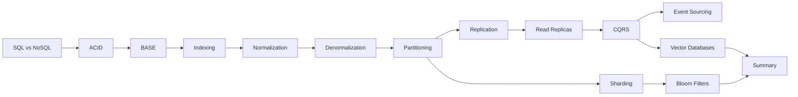

# README

## Overview

This section covers the core data-storage patterns used in backend and distributed-system architecture.

The focus is on understanding how data should be modeled, indexed, replicated, partitioned, distributed, and queried as system requirements grow from a simple transactional application to a large-scale production system.

The material progresses from foundational database properties and schema design to advanced distributed-storage patterns such as sharding, CQRS, event sourcing, probabilistic data structures, and vector databases.

## Contents

| File | Topic | Focus |
|---|---|---|
| [01- SQL vs NoSQL.md](./01-%20SQL%20vs%20NoSQL.md) | SQL vs NoSQL | Choosing relational and non-relational storage based on workload and access patterns |
| [02- ACID.md](./02-%20ACID.md) | ACID | Transaction guarantees, isolation, consistency, and durability |
| [03- BASE.md](./03-%20BASE.md) | BASE | Eventual consistency and distributed-system trade-offs |
| [04- Database Indexing.md](./04-%20Database%20Indexing.md) | Database Indexing | Index structures, query optimization, composite indexes, and query planning |
| [05- Database Normalization.md](./05-%20Database%20Normalization.md) | Database Normalization | Relational modeling, normal forms, data integrity, and update anomalies |
| [06- Denormalization.md](./06-%20Denormalization.md) | Denormalization | Read optimization, duplicated state, and consistency trade-offs |
| [07- Sharding.md](./07-%20Sharding.md) | Sharding | Horizontal data distribution, shard keys, routing, hotspots, and rebalancing |
| [08- Partitioning.md](./08-%20Partitioning.md) | Partitioning | Range, list, and hash partitioning with partition pruning and lifecycle management |
| [09- Database Replication.md](./09-%20Database%20Replication.md) | Database Replication | Primary-replica architectures, synchronous replication, asynchronous replication, and failover |
| [10- Read Replicas.md](./10-%20Read%20Replicas.md) | Read Replicas | Read scaling, replica lag, routing, and read-after-write consistency |
| [11- CQRS.md](./11-%20CQRS.md) | CQRS | Separating command and query models for independent scaling and specialized read models |
| [12- Event Sourcing.md](./12-%20Event%20Sourcing.md) | Event Sourcing | Event streams, state reconstruction, auditability, replay, and event evolution |
| [13- Bloom Filters.md](./13-%20Bloom%20Filters.md) | Bloom Filters | Probabilistic membership testing and reducing unnecessary storage lookups |
| [14- Vector Databases.md](./14-%20Vector%20Databases.md) | Vector Databases | Embeddings, similarity search, semantic retrieval, and AI/RAG architectures |
| [15- Summary.md](./15-%20Summary.md) | Summary | Consolidated storage-design principles and architectural decision-making |

## Learning Flow



## Architecture Themes

The documents collectively cover several recurring system-design concerns:

| Theme | Key Questions |
|---|---|
| Data modeling | How should entities and relationships be represented? |
| Consistency | What guarantees must concurrent operations provide? |
| Performance | How can common queries be made efficient? |
| Scalability | How does storage scale as data and traffic increase? |
| Availability | What happens when a database node fails? |
| Distribution | When should data be partitioned or sharded? |
| Read scaling | Can read traffic be separated from transactional writes? |
| Data history | Does the system need complete state-transition history? |
| Specialized retrieval | Does the workload require probabilistic or vector-based lookup? |
| Operations | How are backup, recovery, monitoring, and migrations handled? |

## Recommended Engineering Progression

A practical storage architecture should generally evolve incrementally:

```text
Relational Database
       |
       v
Correct Data Modeling
       |
       v
Query Optimization
       |
       v
Indexes
       |
       v
Caching
       |
       v
Read Replicas
       |
       v
Partitioning
       |
       v
Specialized Read Models
       |
       v
Sharding / Distributed Storage
```

The progression is not mandatory, but it represents an important engineering principle:

> Do not introduce distributed-storage complexity until the simpler architecture can no longer satisfy measurable requirements.

## Backend Technology Mapping

| Technology | Relevant Storage Concepts |
|---|---|
| PostgreSQL | SQL, ACID, indexing, normalization, partitioning, replication, read replicas |
| Django ORM | Relational modeling, transactions, indexes, query optimization |
| FastAPI | Database access patterns, transactions, connection management, read/write routing |
| Redis | Caching, fast lookups, probabilistic structures, distributed application state |
| Kafka | Event streams, CQRS, event-driven architectures, event sourcing |
| Celery | Asynchronous projections, backfills, indexing, data migration workloads |
| Docker | Reproducible database development environments |
| Kubernetes | Stateful workloads, database connectivity, service discovery, operational concerns |
| AWS | Managed databases, replicas, backups, storage scaling, multi-AZ and multi-region architectures |
| Vector Databases | Embeddings, semantic search, RAG, similarity retrieval |

## Production Considerations

Data-storage decisions should always be evaluated against:

- **Consistency** — What stale or conflicting data is acceptable?
- **Latency** — What are the P50, P95, and P99 requirements?
- **Throughput** — How many reads and writes must the system sustain?
- **Availability** — What failure scenarios must the system tolerate?
- **Scalability** — How will data and traffic grow?
- **Security** — Who can access which data?
- **Observability** — How will storage failures and performance regressions be detected?
- **Recovery** — What are the RPO and RTO requirements?
- **Cost** — What infrastructure and operational complexity are justified?
- **Operational complexity** — Can the team reliably operate the architecture?

## Key Takeaways

- **Choose storage technology and architecture from data access patterns, consistency requirements, scale, and operational constraints—not technology preference.**
- **Use the simplest architecture that satisfies current requirements, then scale deliberately through indexing, caching, replication, partitioning, and eventually sharding when justified.**
- **Understand the distinction between modeling, performance, availability, and distribution patterns; normalization, indexing, replication, partitioning, and sharding solve different problems.**
- **Advanced patterns such as CQRS, Event Sourcing, Bloom Filters, and Vector Databases should be introduced only when their specific architectural benefits justify their complexity.**
- **Production storage design must include security, observability, backup, disaster recovery, consistency guarantees, and failure handling alongside schema and query performance.**