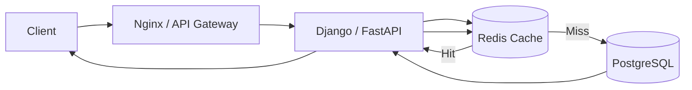
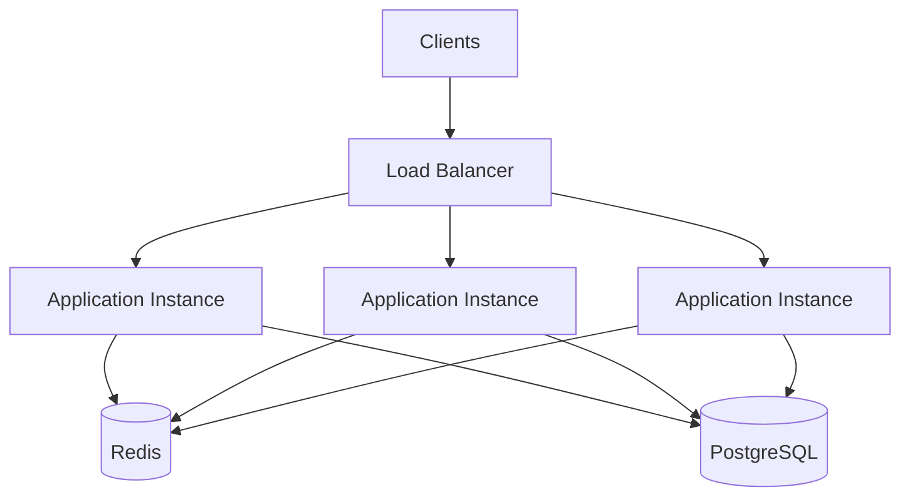
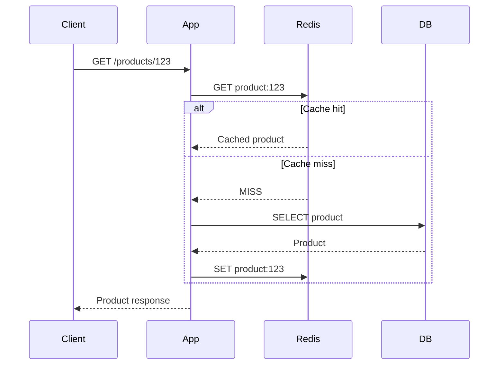
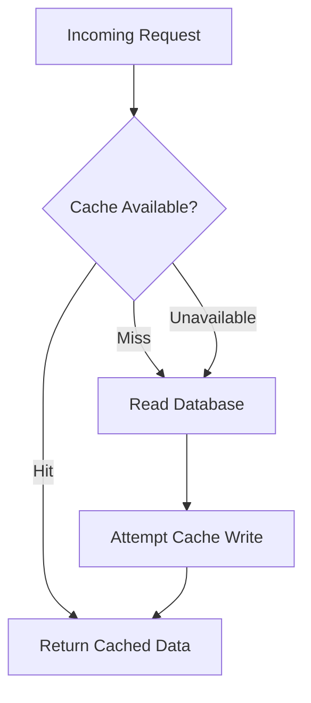
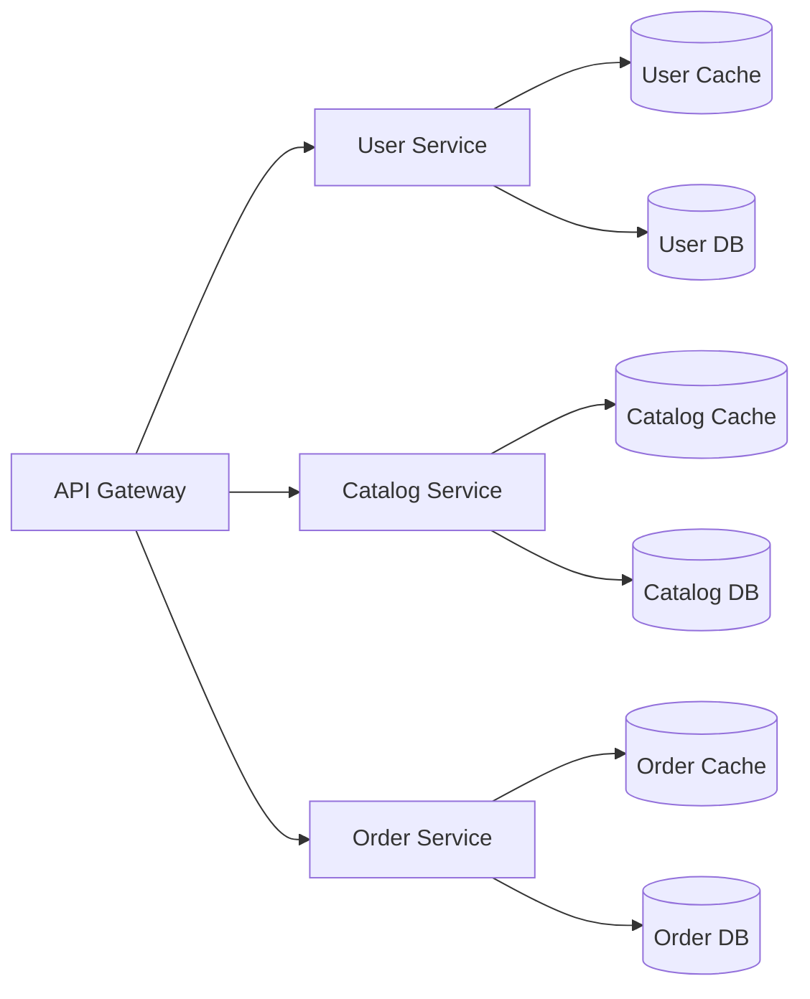
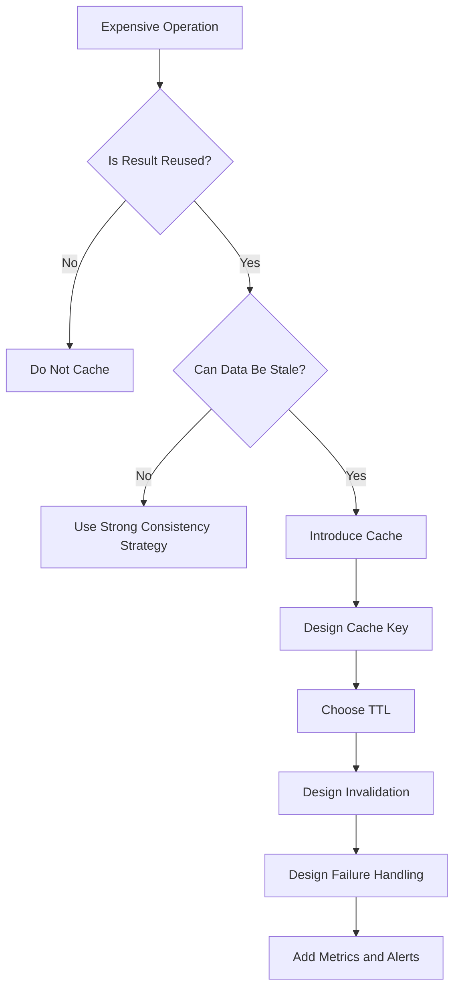

# 01- Introduction to Caching

## Overview

Caching is a performance and scalability technique that stores frequently accessed or expensive-to-compute data closer to the application so that subsequent requests can be served without repeatedly performing the original operation.

In backend systems, the original operation may involve:

- A PostgreSQL query
- A remote service call
- A complex computation
- A filesystem operation
- A database aggregation
- A rendered response
- A third-party API request

Instead of executing the expensive operation for every request, the application can reuse a previously computed result for an appropriate period of time.

A typical backend architecture places a cache between the application and a slower dependency:



Caching is not simply "put Redis in front of PostgreSQL." A production caching strategy requires decisions about cacheability, key design, expiration, invalidation, consistency, failure behavior, memory usage, and observability.

## Why Caching Exists

Database and network operations are often significantly more expensive than reading data from memory.

For example, an API request might normally follow:

```text
Client
  |
  v
API
  |
  v
Application
  |
  v
PostgreSQL
  |
  v
Application
  |
  v
Client
```

If the same data is requested repeatedly, the database may perform essentially the same work over and over.

With caching:

```text
Client
  |
  v
API
  |
  v
Application
  |
  v
Redis
  |
  +---- Cache Hit ----> Response
  |
  +---- Cache Miss ---> PostgreSQL
                            |
                            v
                         Redis
                            |
                            v
                         Response
```

The cache reduces pressure on the backing system and can substantially reduce response latency.

## What Can Be Cached?

Caching can be applied at multiple layers.

| Layer | Example | Typical Benefit |
|---|---|---|
| Browser | Static assets, HTTP responses | Reduces network requests |
| CDN | Images, CSS, JavaScript, public APIs | Reduces origin traffic |
| Reverse proxy | Nginx response cache | Reduces application workload |
| Application | Serialized objects, query results | Avoids repeated computation |
| Distributed cache | Redis, Memcached | Shared cache across instances |
| Database | Buffer/cache pages | Reduces physical disk I/O |
| Computation | Expensive function results | Avoids repeated CPU work |
| External API | Third-party responses | Reduces latency and API usage |

Caching can therefore exist throughout the request path rather than as a single component.

## Cache Hit and Cache Miss

The two fundamental cache outcomes are a **cache hit** and a **cache miss**.

### Cache Hit

A cache hit occurs when the requested data exists in the cache and is considered usable.

```text
Request
  |
  v
Cache
  |
  |-- Key exists
  |
  v
Return cached value
```

The backing database does not need to be queried.

### Cache Miss

A cache miss occurs when the requested value is not available in the cache.

```text
Request
  |
  v
Cache
  |
  |-- Key does not exist
  |
  v
Database
  |
  v
Store result in cache
  |
  v
Return result
```

A cache miss normally has higher latency because the application must access the backing data source.

## Cache Hit Ratio

A key metric for evaluating a cache is the **cache hit ratio**.

```text
Cache Hit Ratio = Cache Hits / Total Cache Requests
```

For example, if an application performs 1,000 cache lookups and 900 are hits:

```text
Hit Ratio = 900 / 1000
          = 90%
```

A high hit ratio generally indicates that the cache is effectively serving repeated access patterns, but a high hit ratio is not automatically proof that the architecture is correct.

A cache containing inexpensive data with a 99% hit rate may provide less value than a cache that prevents a highly expensive database query 80% of the time.

## Cache Miss Ratio

The miss ratio is:

```text
Miss Ratio = Cache Misses / Total Cache Requests
```

Since every lookup is either a hit or a miss:

```text
Miss Ratio = 1 - Hit Ratio
```

Monitoring both metrics is useful because sudden changes can indicate:

- Incorrect TTL configuration
- Poor cache-key design
- Increased working-set size
- Cache eviction
- Application deployment issues
- Data invalidation problems
- Traffic-pattern changes

## Latency Impact

Suppose a request normally performs:

```text
API processing     = 5 ms
Database query     = 30 ms
Serialization      = 5 ms
---------------------------
Total              = 40 ms
```

If the cached response can be retrieved in approximately 1–2 ms:

```text
API processing     = 5 ms
Cache lookup       = 1 ms
Serialization      = 2 ms
---------------------------
Total              = 8 ms
```

The exact numbers depend on the infrastructure and workload, but the architectural principle is important:

> Caching is most valuable when it removes an expensive operation from the critical request path.

## Caching and Throughput

Caching can increase the number of requests an application can handle because fewer requests reach the database.

For example:

```text
Without cache:

10,000 requests/sec
        |
        v
10,000 database queries/sec
```

With a 90% cache hit ratio:

```text
10,000 requests/sec
        |
        v
9,000 cache hits
1,000 cache misses
        |
        v
~1,000 database queries/sec
```

This can significantly reduce database CPU, I/O, connection pressure, and lock contention.

However, the cache itself becomes a production dependency and must be sized and operated appropriately.

## Basic Cache Architecture

A common production architecture is:



The distributed cache allows multiple application instances to share cached state.

Without a shared cache, each application instance could maintain its own local cache:

```text
Application 1 --> Local Cache 1
Application 2 --> Local Cache 2
Application 3 --> Local Cache 3
```

This can lead to duplicated memory usage and inconsistent cache contents.

A local in-process cache can still be useful for extremely hot, small-lived data, but it should be introduced deliberately.

## Common Cache Patterns

### Cache-Aside

Cache-aside is one of the most common application caching strategies.

The application explicitly manages cache reads and writes.



Typical flow:

1. Check the cache.
2. If the value exists, return it.
3. If it does not exist, query the database.
4. Store the result in the cache.
5. Return the result.

This pattern is popular because it is explicit and easy to reason about.

### Write-Through

With write-through caching, writes go through the cache and the cache synchronously updates the backing store.

```text
Application
    |
    v
Cache
    |
    v
Database
```

The application does not independently manage the database write after updating the cache.

Advantages:

- Cache and database can remain synchronized as part of the write path.
- Read-after-write behavior can be easier to reason about.

Limitations:

- Writes have additional latency.
- The cache layer becomes more tightly coupled to persistence.
- Implementation depends heavily on the caching technology.

### Write-Behind

Write-behind, also called write-back caching, allows the cache to acknowledge a write before persistence occurs.

```text
Application
    |
    v
Cache
    |
    | asynchronous
    v
Database
```

This can provide very high write performance but introduces significant durability and consistency risks.

It should only be used when the system can tolerate delayed persistence and has robust recovery mechanisms.

### Read-Through

With read-through caching, the cache itself is responsible for retrieving missing data from the backing store.

```text
Application
    |
    v
Cache
    |
    +-- Hit --> Return data
    |
    +-- Miss --> Load from database
```

The application interacts primarily with the cache abstraction rather than explicitly implementing cache-miss loading logic.

## Cache Pattern Comparison

| Pattern | Read Path | Write Path | Main Benefit | Main Risk |
|---|---|---|---|---|
| Cache-Aside | Application checks cache | Application updates DB/cache | Simple and flexible | Stale data/invalidation complexity |
| Read-Through | Cache loads missing data | Depends on implementation | Centralized read logic | More infrastructure coupling |
| Write-Through | Cache participates in reads | Cache synchronously writes DB | Stronger cache/write coordination | Higher write latency |
| Write-Behind | Cache serves reads | Cache persists asynchronously | High write throughput | Data-loss and consistency risk |

## Cache Key Design

A cache key uniquely identifies the cached value.

A poor key design can cause collisions, stale results, or excessive memory consumption.

For example:

```text
user:123
```

could represent a user's profile.

A more structured key might be:

```text
user:123:profile
```

For an API response:

```text
product:123
```

For a query with multiple dimensions:

```text
products:category:books:page:2:sort:price
```

The key should contain every input that materially changes the result.

### Cache Key Rules

Good cache keys should be:

- Deterministic
- Unique within the cache namespace
- Easy to inspect
- Stable
- Versionable
- Bounded in length
- Consistent across services

Avoid keys such as:

```text
data1
data2
cache123
```

because they provide little operational context.

Prefer:

```text
catalog:v2:product:123
```

The version component is useful when the serialized representation changes.

## Cache Namespacing

Applications should logically namespace keys.

```text
user:v1:123
product:v2:456
order:v1:789
```

This prevents unrelated components from accidentally using the same key.

In multi-service environments, include the service or domain when useful:

```text
inventory:product:v1:123
catalog:product:v2:123
```

## TTL

**TTL**, or Time To Live, defines how long a cached entry should remain valid.

Example:

```text
product:123 -> expires after 300 seconds
```

TTL is one of the primary mechanisms for controlling stale data.

A short TTL:

- Reduces staleness
- Increases cache misses
- Increases database load

A long TTL:

- Improves hit rate
- Reduces database load
- Increases potential staleness

Therefore, TTL is a consistency-versus-performance decision rather than simply a configuration value.

## Choosing TTL

TTL should reflect the data's freshness requirements.

| Data | Possible TTL | Reason |
|---|---:|---|
| User session metadata | Minutes | Changes frequently |
| Product catalog | Minutes to hours | Usually moderately stable |
| Configuration | Minutes | Must reflect changes reasonably quickly |
| Country metadata | Hours to days | Rarely changes |
| Exchange rates | Seconds to minutes | Freshness matters |
| Computed analytics | Minutes to hours | Expensive to regenerate |
| Public content | Minutes to hours | Depends on publishing requirements |

There is no universally correct TTL.

## TTL Jitter

If millions of keys are created with exactly the same TTL, many can expire simultaneously.

This can produce a **cache stampede**.

For example:

```text
10:00:00
  |
  +-- 1,000,000 keys expire
  |
  v
Large number of cache misses
  |
  v
Database overload
```

Adding random jitter spreads expiration:

```text
TTL = Base TTL + Random Jitter
```

For example:

```python
import random

base_ttl = 300
jitter = random.randint(0, 60)
ttl = base_ttl + jitter
```

This reduces synchronized expiration.

## Cache Invalidation

Cache invalidation determines how stale cached values are removed or updated.

A common flow is:

```text
Update Database
      |
      v
Invalidate Cache
      |
      v
Next Read
      |
      v
Cache Miss
      |
      v
Load Fresh Data
```

For example:

```python
from django.core.cache import cache

cache_key = "product:v1:123"

product.save(update_fields=["name", "price"])

cache.delete(cache_key)
```

The ordering of database and cache operations matters.

A common safe approach for cache-aside is:

```text
1. Write database
2. Invalidate cache
```

This avoids deleting the cache first and then having a failed database transaction leave the old value unavailable or create race conditions.

## Why Cache Invalidation Is Difficult

Suppose:

```text
Cache: product:123 = price 100
Database: product 123 = price 100
```

An update changes the database:

```text
Database: price 120
Cache:    price 100
```

If the cache is not invalidated or refreshed, clients receive stale data.

The problem becomes harder when a single database change affects multiple cached representations:

```text
product:123
category:books:page:1
search:books
homepage:featured
recommendations:user:456
```

One write can therefore invalidate many keys.

This is one reason why cache invalidation should be designed as part of the data model rather than treated as an afterthought.

## Cache Stampede

A cache stampede occurs when many requests simultaneously discover that a popular key has expired.

```text
             Redis
               |
        product:123 MISS
               |
     +---------+---------+
     |         |         |
   Req 1     Req 2     Req 3
     |         |         |
     v         v         v
   DB Query  DB Query  DB Query
```

At large scale, this can overwhelm the database.

Mitigation techniques include:

- TTL jitter
- Request coalescing
- Distributed locks
- Background refresh
- Soft expiration
- Serving stale values temporarily
- Prewarming hot keys

## Cache Penetration

Cache penetration occurs when requests repeatedly query data that does not exist.

For example:

```text
GET /users/999999999
```

If the user does not exist and the application never caches that fact:

```text
Request
  |
  v
Cache MISS
  |
  v
Database MISS
```

Every repeated request reaches the database.

A common mitigation is **negative caching**:

```text
user:999999999 -> NOT_FOUND
```

with a short TTL.

Negative caching should use a bounded TTL so that newly created records can become visible without excessive delay.

## Cache Avalanche

A cache avalanche occurs when a large number of cache entries become unavailable at roughly the same time.

Possible causes include:

- Identical TTLs
- Cache cluster failure
- Mass invalidation
- Deployment errors
- Incorrect cache flush operations

Mitigations include:

- TTL jitter
- Graceful cache degradation
- Cache warming
- Rate limiting
- Circuit breakers
- Database protection
- Staggered expiration

## Cache Eviction

A cache has finite memory.

When memory pressure occurs, the cache may evict entries according to its configured eviction policy.

Common strategies include:

| Policy | Behavior |
|---|---|
| LRU | Evict least recently used entries |
| LFU | Evict least frequently used entries |
| FIFO | Evict oldest entries first |
| Random | Evict arbitrary entries |
| No eviction | Reject writes when capacity is reached |

The correct policy depends on the workload.

For hot-key workloads, frequency-based policies can be more appropriate than simple recency-based eviction.

## Redis as a Distributed Cache

Redis is commonly used for application caching because it provides:

- In-memory data access
- Low latency
- TTL support
- Atomic operations
- Multiple data structures
- Replication
- High availability options
- Horizontal scaling capabilities

A typical Python application might use Redis through Django's cache framework.

```python
CACHES = {
    "default": {
        "BACKEND": "django.core.cache.backends.redis.RedisCache",
        "LOCATION": "redis://redis:6379/1",
        "TIMEOUT": 300,
    }
}
```

Application code:

```python
from django.core.cache import cache

def get_product(product_id: int):
    key = f"product:v1:{product_id}"

    product = cache.get(key)

    if product is not None:
        return product

    product = Product.objects.get(pk=product_id)
    cache.set(key, product, timeout=300)

    return product
```

In production, serialization format, connection pooling, network latency, cache capacity, and failure behavior should be evaluated explicitly.

## FastAPI Example

FastAPI applications can use Redis through an asynchronous Redis client.

```python
from redis.asyncio import Redis

redis = Redis.from_url(
    "redis://redis:6379/0",
    decode_responses=True,
)

async def get_product(product_id: int):
    key = f"product:v1:{product_id}"

    cached = await redis.get(key)

    if cached is not None:
        return cached

    product = await load_product_from_database(product_id)

    await redis.set(key, product, ex=300)

    return product
```

For structured objects, use an explicit serialization format such as JSON rather than relying on ambiguous language-specific serialization.

## Serialization Considerations

Cached values must be serialized when stored outside the process.

Common formats include:

| Format | Advantages | Limitations |
|---|---|---|
| JSON | Portable, inspectable | Larger payloads, limited types |
| MessagePack | Compact, efficient | Less human-readable |
| Protocol Buffers | Compact, schema-driven | More setup |
| Pickle | Easy Python serialization | Unsafe for untrusted data, Python-specific |

Never deserialize untrusted data using unsafe mechanisms such as Python `pickle`.

For distributed systems, portable formats with explicit schemas are generally preferable.

## What Should Not Be Cached?

Caching is not appropriate for every piece of data.

Avoid caching data when:

- It changes extremely frequently.
- Every request requires strongly consistent state.
- The value is rarely reused.
- The value is highly sensitive and cache controls are insufficient.
- The cache representation costs more to maintain than recomputation.
- The source query is already extremely cheap.
- The cached object is too large relative to its reuse frequency.

Caching sensitive information also requires careful consideration of:

- Access controls
- Encryption
- Key isolation
- TTL
- Data retention
- Multi-tenant boundaries
- Accidental exposure through logs or debugging tools

## Cache Consistency

Caching introduces another copy of application state.

The system may temporarily contain:

```text
Database:  price = 120
Redis:     price = 100
```

This means caching is fundamentally a consistency decision.

Different applications have different requirements:

| Requirement | Typical Strategy |
|---|---|
| Strong consistency | Avoid caching or tightly coordinate invalidation |
| Bounded staleness | TTL-based cache |
| Eventual consistency | Cache-aside with asynchronous invalidation |
| High read performance | Longer TTL + explicit invalidation |
| Read-after-write | Bypass cache or update cache after successful write |

A senior engineer should ask:

> What is the maximum amount of stale data the business can tolerate?

That answer should influence the caching strategy.

## Cache Failure Handling

A cache should generally be treated as a performance dependency unless the application explicitly makes it part of the source of truth.

For cache-aside:



If Redis becomes unavailable, the application may fall back to PostgreSQL.

However, this creates a potential database overload scenario:

```text
Redis failure
    |
    v
All requests bypass cache
    |
    v
PostgreSQL receives full traffic
    |
    v
Database saturation
```

Therefore, fallback behavior must include protection mechanisms where necessary:

- Rate limiting
- Connection pool limits
- Circuit breakers
- Request shedding
- Query timeouts
- Backpressure

## Monitoring

A production cache should be observable.

Important metrics include:

| Metric | Why It Matters |
|---|---|
| Hit ratio | Measures cache effectiveness |
| Miss ratio | Indicates backing-store pressure |
| Evictions | Indicates memory pressure |
| Memory usage | Determines capacity headroom |
| Key count | Tracks cache growth |
| Latency | Detects cache performance degradation |
| Connection count | Detects client pressure |
| Error rate | Detects cache failures |
| Command rate | Shows workload volume |
| Hot keys | Identifies uneven access patterns |

Application-level metrics should also distinguish:

```text
cache_hit
cache_miss
cache_error
database_fallback
```

This makes it easier to determine whether a performance problem originates in the application, cache, or database.

## High Availability

For production workloads, a single cache node can become a single point of failure.

Possible architectures include:

```text
Application
     |
     v
Redis Primary
     |
     +---- Replica
```

or managed high-availability services.

The appropriate design depends on whether cached data is disposable.

If cache loss only causes a temporary performance degradation, simpler infrastructure may be acceptable.

If the cache also contains critical coordination state, locks, sessions, or other operational state, availability requirements become significantly stricter.

## Scalability

A cache can scale vertically and horizontally.

### Vertical Scaling

Increase memory and CPU of a cache node.

Advantages:

- Simple
- Low operational complexity

Limitations:

- Hardware limits
- Larger failure domain
- Potentially expensive

### Horizontal Scaling

Distribute keys across multiple cache nodes.

```text
                 Application
                      |
              Cache Routing Layer
               /       |       \
              v        v        v
          Redis A   Redis B   Redis C
```

Distributed caches commonly use consistent hashing or a cluster-aware partitioning strategy.

The key challenge is maintaining predictable routing and handling node membership changes.

## Hot Keys

A hot key is a cache key accessed at extremely high frequency.

For example:

```text
homepage:featured-products
```

might receive millions of requests while other keys receive almost none.

A single hot key can overload one cache node even when total cache traffic appears manageable.

Mitigations include:

- Local application caching
- Key replication
- Request coalescing
- CDN caching
- Precomputed responses
- Splitting large hot values

Hot-key detection should be part of cache observability.

## Cache Warming

Cache warming populates frequently needed entries before traffic reaches them.

Examples include:

- Loading popular products after deployment
- Preloading configuration
- Warming homepage content
- Rebuilding caches after a Redis restart

For example:

```text
Deployment
    |
    v
Application starts
    |
    v
Warm critical keys
    |
    v
Receive production traffic
```

Warming should be bounded and prioritized. Attempting to preload an entire large database into memory can create unnecessary load and memory pressure.

## Caching and HTTP

Caching does not have to happen exclusively inside the application.

HTTP provides caching semantics through headers such as:

```http
Cache-Control: public, max-age=300
ETag: "abc123"
```

For public resources, a CDN can cache responses close to users.

A common architecture is:

```text
Client
  |
  v
CloudFront / CDN
  |
  |-- Cache Hit --> Response
  |
  |-- Cache Miss
          |
          v
       Nginx
          |
          v
     Application
          |
          v
       Redis
          |
          v
      PostgreSQL
```

Layered caching can significantly reduce origin traffic.

## Caching in Microservices

In microservice architectures, each service may have its own cache.



This provides isolation but creates distributed invalidation challenges.

For example, an order update may affect:

```text
order cache
customer cache
inventory cache
analytics projections
```

Kafka or another event-driven mechanism can be used for asynchronous cache invalidation where appropriate.

## Security Considerations

Caching can accidentally introduce data-isolation vulnerabilities.

Consider:

```text
GET /users/profile
```

If the cache key is:

```text
profile
```

rather than:

```text
profile:user:123
```

one user's response could potentially be returned to another user.

For authenticated or tenant-specific data, cache keys must incorporate the relevant identity and authorization dimensions.

Important practices include:

- Never cache private data as public.
- Include tenant/user identity where required.
- Avoid sensitive data in cache keys.
- Use appropriate Redis authentication and network controls.
- Encrypt traffic where required.
- Apply short TTLs to sensitive data.
- Avoid logging full cached values.
- Restrict cache administration access.

## Cost Considerations

Caching reduces database workload but introduces infrastructure cost.

The total cost should consider:

```text
Cache infrastructure
+ Network traffic
+ Memory
+ High-availability infrastructure
+ Operational complexity
+ Monitoring
+ Engineering maintenance
```

A cache should therefore be justified by measurable benefits such as:

- Reduced database load
- Lower API latency
- Higher throughput
- Lower database scaling requirements
- Reduced third-party API usage

## Common Mistakes

### Treating the Cache as the Source of Truth

The cache should not normally become the authoritative data store in a cache-aside architecture.

If Redis is lost and the application cannot reconstruct state from the database, the architecture has accidentally made the cache a persistence dependency.

### Using One Global TTL

Different data has different freshness requirements.

Using:

```text
TTL = 1 hour
```

for everything is usually a sign that cache policy has not been designed around business requirements.

### Poor Cache Keys

A key that omits an input parameter can return incorrect data.

For example:

```text
search:products
```

is insufficient if the response depends on:

```text
query
page
sort
filters
tenant
locale
```

### Caching Everything

Caching low-reuse data consumes memory without meaningful benefit.

Cache based on access frequency, computation cost, latency, and freshness requirements.

### Ignoring Cache Failures

A cache outage can turn a healthy system into an overloaded database.

Always model:

```text
Redis unavailable
Redis slow
Redis full
Redis returning errors
Network partition
```

### No Stampede Protection

A highly popular key expiring simultaneously can generate a sudden database traffic spike.

Use appropriate synchronization, jitter, background refresh, or stale-serving strategies.

### Invalidating Before the Database Commit

Invalidating a cache before a transaction successfully commits can create unnecessary misses and race conditions.

Prefer cache invalidation after successful persistence when using cache-aside.

### Storing Large Objects

Large cached values consume memory and increase network and serialization costs.

Cache the smallest useful representation that satisfies the access pattern.

## Interview Traps

| Question | Strong Engineering Answer |
|---|---|
| Why is Redis faster than PostgreSQL? | Redis is optimized for in-memory operations, while PostgreSQL provides richer durable storage and query processing. |
| Is cache always faster? | No. Network hops, serialization, contention, and cache misses can make a cache access expensive. |
| What happens when Redis goes down? | It depends on the architecture; cache-aside systems can often fall back to the database, but database overload must be controlled. |
| How do you invalidate a cache? | TTL, explicit deletion, update-in-place, event-driven invalidation, or combinations of these. |
| What is a cache stampede? | Many requests simultaneously miss or refresh the same expired key, overwhelming the backing store. |
| Should every database query be cached? | No. Cache only workloads where reuse, latency, or backend-load reduction justifies the complexity. |
| What is the biggest challenge with caching? | Maintaining acceptable consistency and invalidation behavior while gaining performance. |

## Practical Decision Framework

Before adding a cache, evaluate:

```text
1. Is the operation expensive?
2. Is the result requested repeatedly?
3. Can the result tolerate staleness?
4. What is the acceptable stale-data window?
5. What should the cache key contain?
6. What TTL is appropriate?
7. How will invalidation work?
8. What happens on cache miss?
9. What happens if the cache is unavailable?
10. How will cache effectiveness be measured?
```

A useful production decision model is:



## Key Takeaways

- **Caching reduces latency and backing-store load by avoiding repeated expensive operations, but it introduces consistency and operational complexity.**
- **Cache-aside with explicit key design, appropriate TTLs, and deliberate invalidation is a strong default for many Django, FastAPI, and microservice workloads.**
- **Production caches require protection against stampedes, penetration, avalanches, hot keys, eviction pressure, and cache outages.**
- **Cache keys, TTLs, invalidation, serialization, security boundaries, and failure behavior must be designed together rather than independently.**
- **Use caching where measured access patterns justify it; do not treat Redis as a mandatory layer or as the authoritative source of durable business data.**