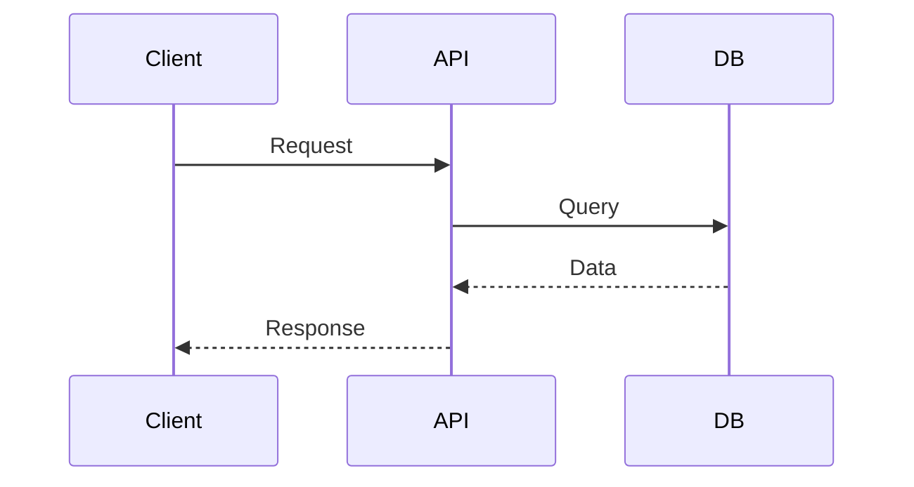
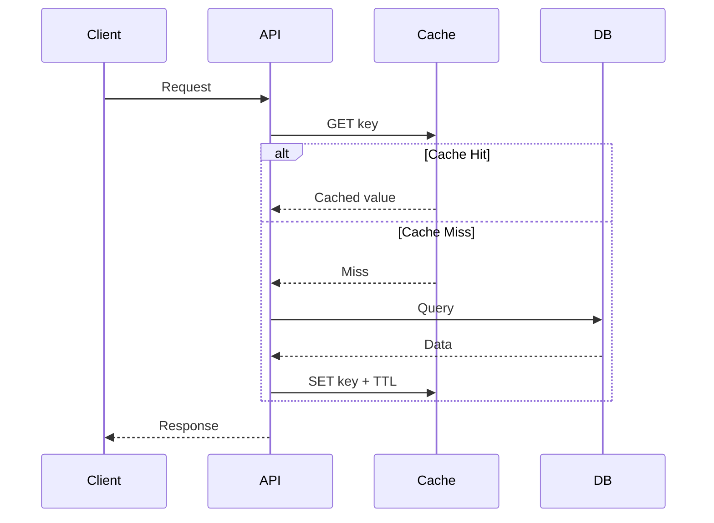
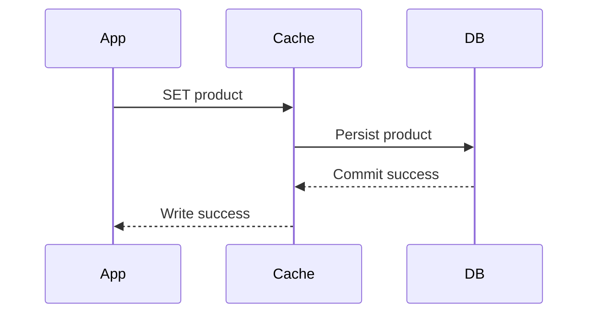
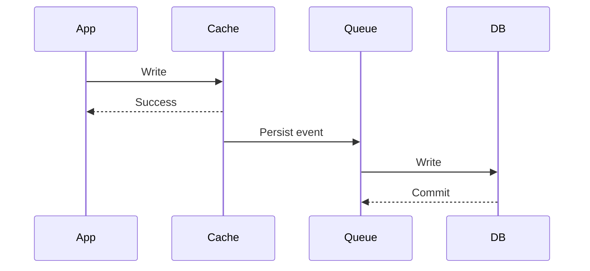
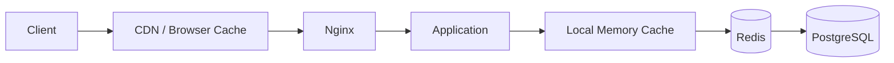
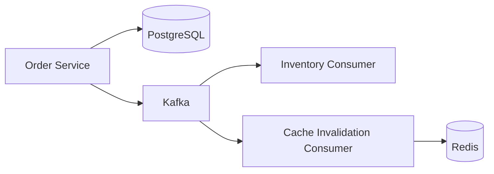
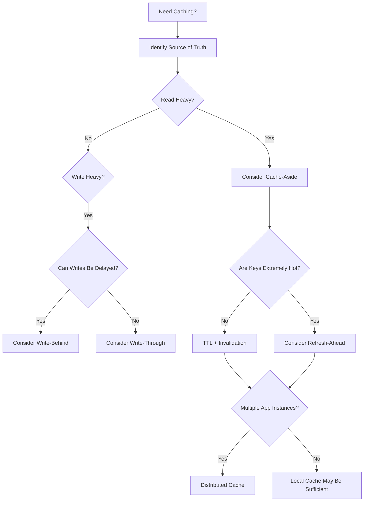

# 02- Cache Patterns

## Overview

Cache patterns define how an application reads from, writes to, and invalidates cached data relative to the system of record.

Choosing a cache pattern is not primarily a Redis configuration decision. It is a consistency and data-flow decision. The pattern determines:

- Which component owns cache population.
- Which component owns persistence.
- When the cache is updated.
- What happens on a cache miss.
- How stale data is handled.
- How failures propagate.
- Whether reads or writes receive additional latency.
- How much consistency the system can provide.

The most common patterns are:

| Pattern | Primary Characteristic | Typical Use |
|---|---|---|
| Cache-Aside | Application explicitly manages cache | General-purpose backend APIs |
| Read-Through | Cache loads data on a miss | Centralized caching infrastructure |
| Write-Through | Cache synchronously writes backing store | Strong cache/write coordination |
| Write-Behind | Cache asynchronously persists writes | High-throughput write workloads |
| Refresh-Ahead | Cache refreshes before expiration | Very hot, predictable data |
| Cache-Only | Cache acts as primary operational store | Ephemeral or derived state |
| Multi-Level Cache | Multiple cache layers | High-scale, latency-sensitive systems |

A production system can combine these patterns. For example, a service may use CDN caching for public HTTP responses, local in-process caching for extremely hot configuration, Redis cache-aside for database entities, and PostgreSQL as the source of truth.

## Cache Architecture Fundamentals

A typical request path without application caching is:



With cache-aside:



The important architectural distinction is that the application owns the decision to read from and populate the cache.

## Cache-Aside

### What It Is

Cache-aside, also called **lazy caching**, is the most common application-level caching pattern.

The application first checks the cache. If the requested value is unavailable, it reads from the database and then populates the cache.

The database remains the source of truth.

```text
Application
    |
    +---- GET cache
    |       |
    |       +---- HIT ----> Return value
    |
    +---- MISS
             |
             v
          Database
             |
             v
          SET cache
             |
             v
          Return value
```

### Why It Exists

Cache-aside is simple because the cache is optional from a data-ownership perspective.

The application can continue operating against the database if the cache is empty or temporarily unavailable, subject to capacity and failure-protection constraints.

### When to Use It

Cache-aside is a strong default when:

- The database is authoritative.
- Read traffic significantly exceeds write traffic.
- Data can tolerate some staleness.
- The application can tolerate cache misses.
- Cache invalidation can be explicitly implemented.
- Different data types require different TTLs or invalidation policies.

Typical examples include:

- Product details
- User profiles
- Configuration
- Frequently accessed reference data
- Expensive database queries
- Computed API responses

### Read Path

```python
from django.core.cache import cache

def get_product(product_id: int):
    key = f"product:v1:{product_id}"

    cached = cache.get(key)

    if cached is not None:
        return cached

    product = (
        Product.objects
        .only("id", "name", "price")
        .get(pk=product_id)
    )

    value = {
        "id": product.id,
        "name": product.name,
        "price": product.price,
    }

    cache.set(key, value, timeout=300)

    return value
```

### Write Path

A common cache-aside write strategy is:

```text
Write database
      |
      v
Successful commit
      |
      v
Invalidate cache
```

Example:

```python
from django.core.cache import cache
from django.db import transaction

def update_product(product_id: int, price: int):
    with transaction.atomic():
        Product.objects.filter(pk=product_id).update(price=price)

        transaction.on_commit(
            lambda: cache.delete(f"product:v1:{product_id}")
        )
```

Using `transaction.on_commit()` prevents cache invalidation from occurring before the database transaction has successfully committed.

### Advantages

- Simple mental model.
- Database remains authoritative.
- Cache can be rebuilt after failure.
- Flexible TTL and invalidation policies.
- Works well with Redis and distributed application instances.
- Easy to introduce incrementally.

### Limitations

- Application code must handle cache logic.
- Stale data is possible.
- Cache invalidation can become complicated.
- Cache misses increase database load.
- Concurrent misses can cause stampedes.

### Production Considerations

Use:

- Explicit cache-key conventions.
- Versioned keys where representations change.
- Appropriate TTLs.
- Cache invalidation after successful commits.
- Metrics for hits, misses, errors, and latency.
- Protection against cache stampedes.
- Database capacity sufficient for cache-failure scenarios.

## Read-Through Cache

### What It Is

In a read-through architecture, the application asks the cache for the data, and the cache is responsible for loading the value from the backing store when the value is missing.

```text
Application
     |
     v
  Cache
   / \
Hit   Miss
 |      |
 v      v
Data  Loader
        |
        v
    Database
```

The application does not explicitly implement the cache-miss database lookup.

### Why It Exists

Read-through caching centralizes cache loading behavior.

Instead of every service implementing:

```text
GET cache
IF miss:
    query DB
    SET cache
```

the caching layer can own this behavior.

### When to Use It

It can be useful when:

- Cache loading logic should be centralized.
- Many consumers use the same data-loading mechanism.
- The caching infrastructure supports loaders or cache-aware repositories.
- The team wants to reduce repeated application-level cache logic.

### Advantages

- Centralized cache-miss handling.
- Consistent caching behavior.
- Less duplicated application code.
- Easier enforcement of common policies.

### Limitations

- More infrastructure coupling.
- More complex failure semantics.
- Cache becomes responsible for understanding backing-store access.
- Less explicit control from application code.

### Cache-Aside vs Read-Through

| Concern | Cache-Aside | Read-Through |
|---|---|---|
| Cache miss logic | Application | Cache layer |
| Application complexity | Higher | Lower |
| Infrastructure complexity | Lower | Higher |
| Flexibility | High | Moderate |
| Database ownership | Application/data layer | Loader/cache integration |
| Common in backend services | Very common | Less common |

For most Django and FastAPI services, cache-aside is usually easier to operate and reason about.

## Write-Through Cache

### What It Is

In write-through caching, writes are sent to the cache, and the cache synchronously writes the data to the backing store before acknowledging success.

```text
Application
     |
     v
   Cache
     |
     v
 Database
```

The cache participates directly in the write path.

### Write Lifecycle



The exact ordering depends on the implementation, but the key characteristic is synchronous persistence coordination.

### Why It Exists

Write-through caching is useful when applications want reads to immediately find recently written data in the cache without requiring a subsequent cache miss.

### When to Use It

Consider it when:

- Read-after-write behavior is important.
- Cached data is closely coupled to persistent data.
- Cache consistency needs to be tightly coordinated.
- The infrastructure supports reliable write-through semantics.

### Advantages

- Cache is populated as part of the write.
- Reduces immediate post-write cache misses.
- Can simplify read-after-write behavior.
- Cache and persistent writes are coordinated.

### Limitations

- Adds cache overhead to writes.
- Increases write latency.
- Cache availability can affect writes.
- More complex failure handling.
- Tighter coupling between cache and database.

### Production Consideration

Write-through should not be selected merely because it sounds more consistent.

If the business can tolerate eventual consistency, cache-aside with explicit invalidation may be substantially simpler.

## Write-Behind Cache

### What It Is

Write-behind, also called **write-back caching**, allows the cache to acknowledge a write before synchronously persisting it to the backing store.

```text
Application
     |
     v
   Cache
     |
     | asynchronous
     v
 Database
```

### Write Lifecycle



The asynchronous component could be a queue, stream, worker, or database writer depending on the architecture.

### Why It Exists

The primary objective is to reduce synchronous write latency and absorb high write throughput.

Instead of waiting for durable persistence:

```text
Application -> Database -> Response
```

the application can perform:

```text
Application -> Cache -> Response
             |
             +--> Async persistence
```

### When to Use It

Use this pattern only when the business requirements explicitly permit:

- Delayed persistence.
- Temporary divergence between cache and database.
- More complex recovery.
- Potential data loss if the cache fails before persistence.

It can be useful for:

- High-volume counters
- Telemetry
- Non-critical analytics
- Aggregated metrics
- Workloads where durable writes can be batched

### Advantages

- Very low write latency.
- High write throughput.
- Writes can be batched.
- Database load can be smoothed.

### Limitations

The risks are significant:

- Data loss if the cache fails.
- More complicated recovery.
- Ordering challenges.
- Duplicate persistence.
- Backpressure requirements.
- More complicated disaster recovery.

### Production Requirements

If using write-behind, design for:

```text
Cache
  |
  v
Durable Queue
  |
  v
Persistence Worker
  |
  v
Database
```

The queue should generally provide stronger durability than the cache itself.

Kafka can be appropriate for some event-driven workloads, while a transactional queue or durable messaging system may be better for other use cases.

Do not rely on an in-memory cache as the only durable buffer for critical business writes.

## Refresh-Ahead

### What It Is

Refresh-ahead proactively refreshes a cache entry before it expires.

Instead of waiting for:

```text
TTL expires
    |
    v
Request arrives
    |
    v
Cache miss
    |
    v
Database query
```

the system refreshes the value before expiration:

```text
Cache nearing expiration
    |
    v
Background refresh
    |
    v
Fresh value
```

### Why It Exists

Refresh-ahead reduces latency spikes caused by cache misses for frequently accessed data.

### When to Use It

It is particularly useful for:

- Very hot keys.
- Predictable access patterns.
- Expensive database queries.
- Data that can tolerate background refresh.
- APIs where consistent low latency is more important than minimizing background work.

### Example

Suppose:

```text
TTL = 300 seconds
Refresh threshold = 60 seconds
```

When the cached value has approximately 60 seconds remaining, a background worker refreshes it.

### Advantages

- Reduces cache misses.
- Avoids request-path database queries.
- Improves latency consistency.
- Useful for hot data.

### Limitations

- Can generate unnecessary work for data nobody requests.
- Requires background processing.
- Requires coordination to avoid duplicate refreshes.
- More complicated than simple TTL caching.

### Stampede Protection

Multiple workers must not simultaneously refresh the same key.

A distributed lock or single-flight mechanism can coordinate refreshes:

```text
Worker A ----+
             |
Worker B ----+--> Distributed Lock --> Refresh
             |
Worker C ----+
```

## Multi-Level Caching

Large systems often use multiple cache layers.

A common architecture is:



Each layer has different characteristics.

| Layer | Latency | Scope | Typical Data |
|---|---|---|---|
| Browser | Very low | Single client | Static/public responses |
| CDN | Very low | Geographic | Public content |
| Nginx | Low | Instance/edge | HTTP responses |
| Local memory | Very low | Application process | Small hot data |
| Redis | Low | Distributed | Shared application state |
| Database buffer cache | Low | Database | Storage pages |

### Why Use Multiple Layers?

A local cache can eliminate even the network round trip to Redis.

For example:

```text
Request
  |
  v
Local cache
  |
  +-- Hit --> Response
  |
  +-- Miss --> Redis
                 |
                 +-- Hit --> Response
                 |
                 +-- Miss --> PostgreSQL
```

### Risks

Every additional cache layer introduces another consistency boundary.

A system with:

```text
CDN -> Nginx -> Local -> Redis -> PostgreSQL
```

has more cache invalidation paths than:

```text
Application -> PostgreSQL
```

Therefore, multi-level caching should be justified by measurable latency or capacity requirements.

## Cache-Aside with Event-Driven Invalidation

In microservice systems, cache invalidation can be driven by domain events.

For example:



When an entity changes:

```text
Database transaction
       |
       v
Domain event
       |
       v
Kafka
       |
       v
Cache invalidation
```

This is useful when multiple services maintain independently cached representations.

However, event-driven invalidation introduces eventual consistency and delivery concerns.

Important considerations include:

- Duplicate events.
- Event ordering.
- Consumer lag.
- Retry behavior.
- Dead-letter handling.
- Idempotent invalidation.
- Cache rebuild after missed events.

## Cache Invalidation Strategies

Caching patterns are closely tied to invalidation strategies.

### TTL-Based Invalidation

The entry expires automatically.

```text
SET product:123 value EX 300
```

Advantages:

- Simple.
- No explicit invalidation required.

Limitations:

- Data can remain stale until TTL expires.
- Short TTLs reduce hit ratio.

### Explicit Invalidation

Delete the relevant key after a successful write.

```python
cache.delete(f"product:v1:{product_id}")
```

Advantages:

- Faster convergence.
- Simple for individual resources.

Limitations:

- Every affected key must be known.
- Related cached representations can be difficult to invalidate.

### Update-in-Place

Update the cache after updating the database.

```text
Database update
      |
      v
Cache update
```

This avoids the next-request miss but introduces the possibility that the cache update fails.

### Versioned Keys

Instead of deleting every old representation:

```text
product:v1:123
```

a new version can be written:

```text
product:v2:123
```

This can be useful when changing serialized representations or schema versions.

## Choosing Between Cache Patterns

| Requirement | Recommended Starting Point |
|---|---|
| General API read caching | Cache-aside |
| Centralized cache loading | Read-through |
| Tight cache/write coordination | Write-through |
| Extremely high asynchronous write throughput | Write-behind |
| Hot predictable data | Refresh-ahead |
| Extremely low latency | Multi-level caching |
| Cross-service invalidation | Event-driven invalidation |
| Public content | CDN/HTTP caching |

These are starting points rather than universal rules.

## Cache Pattern Decision Process

Use the following reasoning process:



## Cache Pattern Selection by Workload

### Product Catalog

Characteristics:

- Many reads.
- Relatively fewer writes.
- Moderate freshness requirements.
- Frequently accessed products.

A reasonable design:

```text
Django/FastAPI
      |
      v
Redis cache-aside
      |
      v
PostgreSQL
```

Use explicit invalidation after product updates and a TTL as a safety mechanism.

### User Session Data

Session data may require:

- Fast reads.
- Short TTL.
- Predictable expiration.
- Stronger access-control boundaries.

Redis is often appropriate, but the session model must account for security and availability.

### Public API Content

For publicly cacheable responses:

```text
Client
  |
  v
CloudFront
  |
  +-- Hit --> Response
  |
  +-- Miss --> Application
```

HTTP cache-control semantics and CDN behavior may be more effective than placing every response in Redis.

### High-Volume Counters

Counters may benefit from atomic cache operations:

```text
Request
  |
  v
Redis INCR
  |
  v
Periodic persistence
```

This can resemble write-behind, but critical accounting systems should not assume Redis alone provides the required durability.

## Consistency Implications

Different patterns provide different consistency characteristics.

| Pattern | Typical Consistency | Main Concern |
|---|---|---|
| Cache-aside + TTL | Eventual | Stale data |
| Cache-aside + explicit invalidation | Near-real-time/eventual | Invalidation races |
| Read-through | Eventual unless coordinated | Loader consistency |
| Write-through | Stronger coordination | Write latency |
| Write-behind | Eventual | Persistence lag/data loss |
| Refresh-ahead | Usually eventual | Refresh races |

No caching pattern automatically provides strong consistency.

Strong consistency must be designed explicitly across the cache, database, transaction boundaries, and request flow.

## Concurrency and Race Conditions

Cache operations can race with database writes.

Consider:

```text
Request A:
    Cache MISS
    Read DB -> price = 100

Request B:
    Update DB -> price = 120
    Delete cache

Request A:
    SET cache -> price = 100
```

The cache now contains stale data even though the invalidation happened after the database update.

This is a classic cache-aside race.

Possible mitigations include:

- Versioned values.
- Compare-and-set operations.
- Delayed invalidation.
- Write-through coordination.
- Event-based invalidation.
- Short TTLs.
- Cache population policies that account for versions.

The correct solution depends on the consistency requirement.

## Cache Stampede Protection

For a hot key, multiple concurrent requests can miss simultaneously.

A common mitigation is a distributed lock:

```text
Request 1 --> MISS --> Acquire lock --> DB
Request 2 --> MISS --> Wait
Request 3 --> MISS --> Wait
Request 4 --> MISS --> Wait

Request 1 --> SET cache --> Release lock

Requests 2-4 --> Read cache
```

The lock must have:

- A bounded expiration.
- Safe ownership semantics.
- Failure handling.
- Reasonable contention limits.

Do not build distributed locking casually. For some workloads, serving a slightly stale value or using background refresh is simpler and safer.

## Negative Caching

Negative caching stores the absence of a resource.

Example:

```text
user:999999 -> NOT_FOUND
```

This prevents repeated invalid requests from reaching the database.

Use a shorter TTL than normal objects.

```text
Existing user:
TTL = 300 seconds

Non-existent user:
TTL = 30 seconds
```

This reduces cache penetration while allowing newly created records to become visible quickly.

## Cache Penetration

Attackers or buggy clients can intentionally request random identifiers:

```text
/user/10000001
/user/10000002
/user/10000003
...
```

If none exist and misses are never cached:

```text
Cache MISS
    |
    v
Database MISS
```

at very high volume.

Mitigation options include:

- Negative caching.
- Request validation.
- Rate limiting.
- Bloom filters for appropriate existence checks.
- Query restrictions.
- Authentication and authorization.

Bloom filters are useful when checking membership approximately before expensive database access, but they introduce false positives and therefore must not be treated as authoritative existence checks.

## Cache Avalanche

A large number of keys expiring simultaneously can cause a sudden database load spike.

Avoid synchronized expiration:

```python
import random

base_ttl = 300
ttl = base_ttl + random.randint(0, 60)
```

Other approaches include:

- Refresh-ahead.
- Staggered TTLs.
- Background regeneration.
- Serving stale values.
- Database load shedding.

## Cache Failure Strategy

Every pattern should explicitly answer:

> What happens if the cache is unavailable?

For cache-aside:

```text
Cache failure
     |
     v
Database fallback
     |
     v
Potential DB overload
```

Therefore, simply "falling back to PostgreSQL" is not always a complete failure strategy.

Production systems may need:

```text
Redis unavailable
      |
      +--> Rate limit
      |
      +--> Limit DB concurrency
      |
      +--> Serve stale data
      |
      +--> Degrade optional features
      |
      +--> Return controlled errors
```

The correct strategy depends on the endpoint's criticality.

## Serialization and Data Contracts

Cache patterns should use stable serialization.

For example:

```python
import json

value = {
    "id": 123,
    "name": "Mechanical Keyboard",
    "price": 129.99,
}

serialized = json.dumps(value)

await redis.set(
    "product:v2:123",
    serialized,
    ex=300,
)
```

Version the cache representation when necessary:

```text
product:v1:123
product:v2:123
```

This prevents deployments from interpreting old serialized values using a new schema.

## Django Integration

Django provides a cache abstraction that allows application code to remain relatively independent of the underlying cache implementation.

```python
from django.core.cache import cache

def get_user_profile(user_id: int):
    key = f"user-profile:v1:{user_id}"

    value = cache.get(key)

    if value is not None:
        return value

    profile = UserProfile.objects.values(
        "user_id",
        "display_name",
        "avatar_url",
    ).get(user_id=user_id)

    cache.set(key, profile, timeout=300)

    return profile
```

For production applications:

- Avoid caching unnecessarily large ORM objects.
- Prefer explicit serialized representations.
- Version keys when representations change.
- Keep cache logic close to the data-access boundary.
- Instrument cache hits and misses.
- Test cache failure behavior.

## FastAPI Integration

FastAPI applications can implement cache-aside using an async Redis client.

```python
import json

from redis.asyncio import Redis

redis = Redis.from_url(
    "redis://redis:6379/0",
    decode_responses=True,
)

async def get_product(product_id: int):
    key = f"product:v1:{product_id}"

    cached = await redis.get(key)

    if cached is not None:
        return json.loads(cached)

    product = await load_product(product_id)

    value = {
        "id": product.id,
        "name": product.name,
        "price": product.price,
    }

    await redis.set(
        key,
        json.dumps(value),
        ex=300,
    )

    return value
```

A production implementation should also define:

- Redis connection lifecycle.
- Connection pooling.
- Timeout behavior.
- Serialization errors.
- Redis failure handling.
- Metrics.
- Cache-key conventions.

## Cache Patterns in Microservices

Caching becomes more complicated when multiple services maintain representations of related data.

Consider:

```text
Order Service
     |
     v
Order Database

Catalog Service
     |
     v
Catalog Database
```

Both services may cache product-related information.

A product update may require:

```text
Catalog database
    |
    v
ProductUpdated event
    |
    v
Kafka
    |
    +--> Catalog cache invalidation
    |
    +--> Order cache invalidation
    |
    +--> Search index update
```

This creates eventual consistency between consumers.

Consumers should be idempotent:

```text
ProductUpdated(product_id=123)
ProductUpdated(product_id=123)
```

Processing the event twice should not corrupt the cache.

## Monitoring Cache Patterns

Cache observability should cover both infrastructure and application behavior.

### Application Metrics

Track:

```text
cache_hits_total
cache_misses_total
cache_errors_total
cache_get_latency
cache_set_latency
cache_invalidations_total
cache_refresh_total
cache_stampede_events
```

### Infrastructure Metrics

Monitor:

- Memory utilization.
- Evictions.
- CPU.
- Network throughput.
- Connection count.
- Command latency.
- Replication health.
- Cluster health.
- Hot keys.

### Important Ratios

```text
Hit Ratio = Hits / (Hits + Misses)

Miss Ratio = Misses / (Hits + Misses)
```

Do not optimize solely for hit ratio. A cache can have an excellent hit ratio while serving stale or incorrect data.

## Operational Best Practices

### Treat the Cache as a Dependency

Define:

- Connection timeouts.
- Retry policy.
- Maximum retry attempts.
- Failure fallback.
- Alerting thresholds.

Avoid unlimited retries against a failing Redis cluster.

### Protect the Database

The database should survive a cache outage.

Use:

- Connection pool limits.
- Query timeouts.
- Rate limiting.
- Backpressure.
- Circuit breakers where appropriate.
- Capacity planning.

### Version Cache Keys

Prefer:

```text
product:v2:123
```

over:

```text
product:123
```

when the cached representation can change across deployments.

### Keep TTL as a Safety Mechanism

Even with explicit invalidation, TTL provides eventual recovery from missed invalidations.

A robust strategy often combines:

```text
Explicit invalidation
+
TTL
```

### Avoid Cache Flushes

Commands equivalent to flushing an entire production cache can cause an immediate traffic spike toward the database.

Prefer targeted invalidation.

### Plan for Cold Starts

After:

- Deployment.
- Redis restart.
- Failover.
- Cache flush.
- Large-scale expiration.

the cache may be cold.

Database capacity must account for this condition.

## Common Mistakes

### Choosing a Pattern Before Defining Consistency

The correct order is:

```text
Business consistency requirement
        |
        v
Data ownership
        |
        v
Cache pattern
        |
        v
TTL + invalidation
        |
        v
Failure strategy
```

Not:

```text
"We use Redis, so let's use cache-aside."
```

### Using Write-Behind for Critical Data

Asynchronous persistence can lose data if durability is not properly engineered.

Do not use write-behind merely because it is faster.

### Assuming Write-Through Means Strong Consistency

Write-through coordinates writes, but other cached representations, replicas, or services may still be stale.

### Refreshing Hot Keys Without Coordination

Multiple workers may simultaneously refresh the same key.

Use single-flight behavior, locking, or background scheduling with ownership.

### Ignoring Invalidation Races

Database updates and cache population can occur concurrently.

Test race conditions explicitly for high-value data.

### Making Every Cache Pattern Generic

A single abstraction such as:

```python
cache.get_or_set(...)
```

may hide important differences in:

- Consistency.
- TTL.
- Serialization.
- Invalidation.
- Failure handling.

Reusable infrastructure is valuable, but data-specific cache policy should remain visible.

## Interview Traps

| Interview Question | Strong Answer |
|---|---|
| Which cache pattern is the default choice? | Cache-aside is a strong default for many read-heavy services because the database remains authoritative and the application controls cache behavior. |
| Why not always use write-through? | It adds write-path latency and infrastructure coupling without necessarily providing the consistency guarantees the business requires. |
| When is write-behind useful? | When delayed persistence is acceptable and throughput/latency justify the additional durability and recovery complexity. |
| How do you prevent a cache stampede? | TTL jitter, request coalescing, distributed locking, stale serving, refresh-ahead, or combinations depending on workload. |
| What happens if Redis fails? | The service may fall back to the source of truth, but database overload protection must be designed explicitly. |
| Is cache-aside eventually consistent? | Usually yes, unless explicit coordination makes stronger guarantees possible. |
| How do you invalidate related cache keys? | Explicit dependency tracking, versioning, event-driven invalidation, namespace strategies, or a combination. |
| Can caching guarantee strong consistency? | Not by itself. Strong consistency requires coordinated reads, writes, invalidation, and transaction semantics. |

## Pattern Selection Checklist

Before selecting a pattern, answer:

- What is the source of truth?
- Is the workload read-heavy or write-heavy?
- How stale can the data become?
- Does the request require read-after-write consistency?
- Can cache misses safely reach the database?
- What happens if the cache is unavailable?
- What happens if many keys expire simultaneously?
- What happens if many requests miss the same hot key?
- How are related keys invalidated?
- How large are cached values?
- How will cache serialization be versioned?
- What metrics indicate cache effectiveness?
- Can the system tolerate a completely cold cache?
- Does the pattern introduce a new durability requirement?
- Is the operational complexity justified by the performance benefit?

## Key Takeaways

- **Cache-aside is the most practical default for many backend services because the application controls caching while the database remains the source of truth.**
- **Read-through, write-through, write-behind, and refresh-ahead solve different workload and consistency problems; no pattern is universally superior.**
- **Cache invalidation, TTLs, concurrency control, and failure handling are part of the pattern itself and must be designed together.**
- **Write-behind and multi-level caching can provide substantial performance improvements but introduce additional durability, consistency, and operational complexity.**
- **Choose a cache pattern from business consistency and workload requirements first, then select Redis, local memory, CDN, or another implementation that satisfies those requirements.**