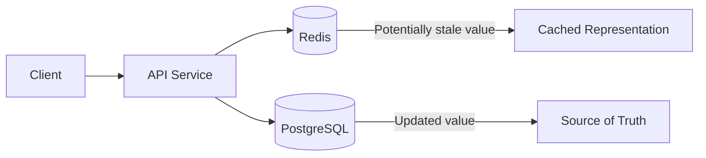
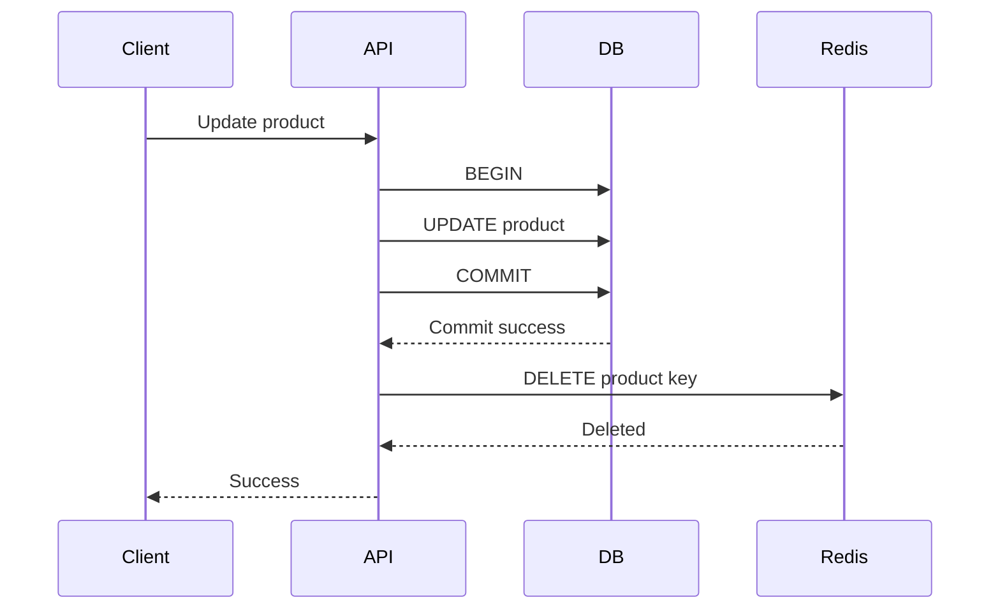
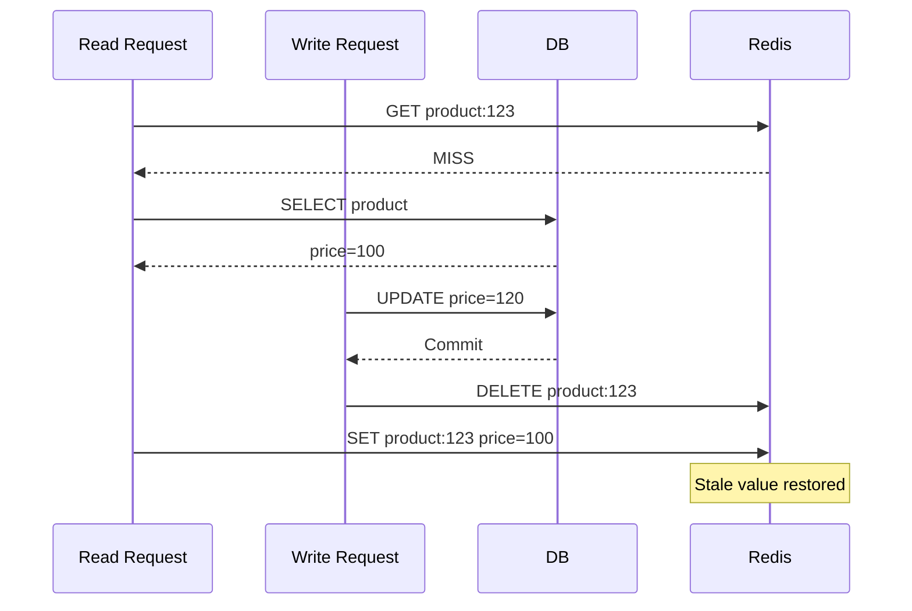
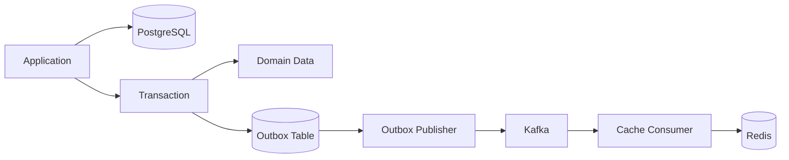
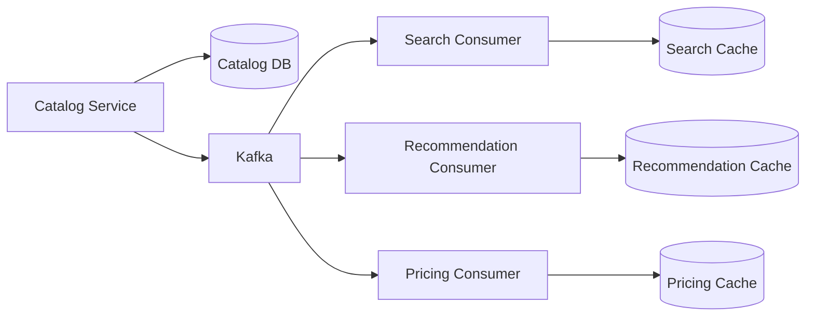
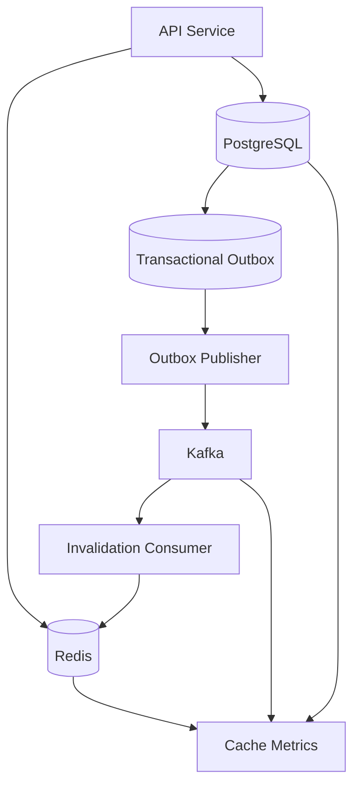

# 03- Cache Invalidation

## Overview

Cache invalidation is the process of removing, updating, or rendering cached data unusable when the underlying source of truth changes.

Caching improves read latency and reduces load on databases and downstream services, but it introduces a second representation of the same data. The moment data exists in both a database and a cache, the system must define how those representations converge.

This is the core difficulty of caching:

> Writing data is usually straightforward; ensuring every cached representation becomes correct at the right time is the hard part.

A production cache-invalidation strategy must answer:

- Which cache entries represent the changed data?
- When should they become invalid?
- Should they be deleted, updated, or versioned?
- What happens if invalidation fails?
- What happens if invalidation races with a concurrent read?
- How much stale data is acceptable?
- How are distributed services notified?
- How is invalidation observed and repaired?

For most backend systems, invalidation is implemented using one or more of:

| Strategy | Mechanism | Typical Use |
|---|---|---|
| TTL expiration | Entry expires automatically | General safety mechanism |
| Explicit deletion | Application deletes keys | Entity caching |
| Update-in-place | Cache is updated after a write | Read-after-write workloads |
| Versioned keys | New version replaces old namespace | Schema/content changes |
| Event-driven invalidation | Domain event triggers invalidation | Microservices |
| Namespace invalidation | Logical version changes | Large key groups |
| Refresh-ahead | Cache refreshed before expiry | Hot data |
| Stale-while-revalidate | Serve stale data while refreshing | Low-latency APIs |

The strongest production designs usually combine multiple techniques rather than relying on a single mechanism.

## Why Cache Invalidation Is Difficult

Consider a simple product API:

```text
PostgreSQL
    |
    | source of truth
    v
product = {
    id: 123,
    price: 100
}

Redis
    |
    v
product:123 = {
    id: 123,
    price: 100
}
```

A request changes the product price:

```text
POST /products/123
price = 120
```

The database is updated:

```text
PostgreSQL
price = 120
```

But Redis still contains:

```text
price = 100
```

The system now has two representations with different values.

If the application continues serving the Redis value, clients receive stale data.

This creates the fundamental cache consistency problem:



The cache is not inherently wrong. It is simply a copy whose lifecycle must be coordinated with the authoritative data.

## Cache Invalidation Models

There are three fundamental approaches.

### Delete

When data changes, delete the cached representation.

```text
Database UPDATE
       |
       v
Cache DELETE
```

The next request experiences a cache miss and reconstructs the value.

This is usually the simplest strategy.

### Update

When data changes, update the cache with the new value.

```text
Database UPDATE
       |
       v
Cache UPDATE
```

This avoids a subsequent cache miss.

However, if the cache update fails, the cache may still contain stale data.

### Expire

Allow the cache entry to become invalid after a TTL.

```text
SET key EX 300
       |
       v
300 seconds
       |
       v
Expired
```

TTL is simple but does not provide immediate convergence.

## Delete vs Update

| Property | Delete | Update |
|---|---|---|
| Implementation complexity | Lower | Higher |
| Next request causes miss | Yes | Usually no |
| Risk of stale cache | Lower after successful deletion | Higher if update fails |
| Write latency | Lower | Higher |
| Cache population logic | Reused | Must duplicate representation logic |
| Good default | Yes | For carefully controlled workloads |

For most entity caches, **delete-on-write plus TTL** is a strong default.

## TTL-Based Invalidation

### What It Is

A TTL specifies how long a cache entry remains valid.

```text
SET product:123 value EX 300
```

After 300 seconds, the entry becomes unavailable.

### Why It Exists

TTL provides automatic expiration without requiring the application to explicitly invalidate every entry.

This is particularly useful as a safety mechanism when explicit invalidation can fail.

### Advantages

- Simple.
- Automatically bounds staleness.
- Prevents permanent stale data.
- Provides recovery from missed invalidation.
- Reduces operational dependency on perfect invalidation.

### Limitations

A TTL does not guarantee freshness.

If:

```text
TTL = 1 hour
```

and the underlying value changes immediately after caching, clients may receive stale data for nearly an hour.

A shorter TTL improves freshness but reduces cache efficiency.

### Production Recommendation

Use TTL even when explicit invalidation exists:

```text
Explicit invalidation
        +
Safety TTL
```

Explicit invalidation provides fast convergence; TTL provides eventual recovery.

## Explicit Invalidation

Explicit invalidation deletes a cache key when the underlying data changes.

```python
from django.core.cache import cache
from django.db import transaction


def update_product(product_id: int, price: int) -> None:
    with transaction.atomic():
        Product.objects.filter(pk=product_id).update(price=price)

        transaction.on_commit(
            lambda: cache.delete(f"product:v1:{product_id}")
        )
```

The important detail is `transaction.on_commit()`.

Invalidating before the database transaction commits can create an inconsistent sequence:

```text
DELETE cache
    |
    v
DB transaction fails
    |
    v
Cache is empty
    |
    v
Next request reloads old database value
```

This is not necessarily incorrect, but the ordering becomes more difficult to reason about.

More importantly, invalidating after a successful commit establishes a cleaner relationship between database state and cache invalidation.

## Delete After Commit

The preferred lifecycle for many cache-aside systems is:



The cache may briefly contain stale data between the database commit and cache deletion.

That interval should be considered when determining consistency requirements.

## The Invalidation Race

Explicit deletion alone does not eliminate race conditions.

Consider this sequence:

```text
Request A:
    Cache MISS
    Read DB -> price = 100

Request B:
    Update DB -> price = 120
    Delete cache

Request A:
    SET cache -> price = 100
```

The final cache value is stale:

```text
Database = 120
Cache    = 100
```

The problem is that Request A started before the write but populated the cache after the write.

This is one of the most important cache-invalidation race conditions.



## Mitigating Invalidation Races

There is no single universal solution.

Possible techniques include:

- Versioned cache values.
- Compare-and-set operations.
- Delayed or repeated invalidation.
- Write-through coordination.
- Event-driven invalidation.
- Locking.
- Short TTLs.
- Avoiding cache population for particularly sensitive data.
- Read-after-write routing to authoritative storage.

The correct choice depends on the consistency requirement and workload.

## Versioned Cache Values

A cached value can contain a version corresponding to the database state.

```json
{
  "version": 42,
  "id": 123,
  "price": 120
}
```

A write increments the version:

```text
DB version = 43
```

A cache writer should not overwrite a newer version with an older one.

Conceptually:

```text
Existing cache version = 43

Incoming value version = 42

42 < 43
    |
    v
Reject cache write
```

This requires atomic comparison at the cache layer.

Redis primitives such as Lua scripts or transactional operations can be used when atomic compare-and-set behavior is required.

## Invalidation Timing

The point at which invalidation happens matters.

### Before Database Write

```text
DELETE cache
UPDATE database
```

Risk:

```text
DB update fails
```

The cache is empty and will need to be repopulated.

This is generally unnecessary for ordinary cache-aside systems.

### After Database Write

```text
UPDATE database
DELETE cache
```

This is generally safer because the database is updated first.

However, there is still a window where stale data may be served.

### After Transaction Commit

```text
BEGIN
UPDATE database
COMMIT
DELETE cache
```

This is usually preferable when using transactional databases.

The database becomes authoritative first, followed by cache invalidation.

## Cache Invalidation and Transactions

A transaction does not automatically include Redis.

This is a common architectural misconception.

For example:

```text
PostgreSQL transaction
+
Redis DELETE
```

does not become one atomic distributed transaction merely because both operations occur in the same Python function.

There is no automatic guarantee that:

```text
DB COMMIT
```

and:

```text
Redis DELETE
```

succeed or fail together.

If Redis invalidation fails:

```text
DB = new value
Redis = old value
```

The system needs a recovery mechanism.

## Transactional Outbox Pattern

For systems where cache invalidation must not be silently lost, a transactional outbox can connect the database transaction with an asynchronous invalidation event.



The transaction writes both:

```text
Business data
+
Invalidation event
```

atomically.

Example:

```text
BEGIN

UPDATE product
INSERT INTO outbox (
    event_type,
    aggregate_id,
    payload
)

COMMIT
```

A background publisher later sends the event to Kafka.

This provides a durable path from the database transaction to cache invalidation.

### Why It Exists

Without an outbox:

```text
DB COMMIT
    |
    v
Publish invalidation
    |
    X
Publisher crashes
```

The invalidation may never happen.

With an outbox:

```text
DB COMMIT
    |
    +--> Data persisted
    |
    +--> Invalidation event persisted
             |
             v
        Publish later
```

### Production Considerations

The outbox publisher must handle:

- Retries.
- Duplicate publication.
- Consumer idempotency.
- Ordering where required.
- Dead-letter handling.
- Monitoring of unpublished events.
- Backlog growth.

The cache consumer should assume events can be delivered more than once.

## Event-Driven Cache Invalidation

In microservices, one service may update data while several services cache representations of it.

For example:

```text
Catalog Service
     |
     v
ProductUpdated
     |
     v
Kafka
     |
     +--> Search Service
     |
     +--> Recommendation Service
     |
     +--> Pricing Service
```

Each consumer invalidates or refreshes its own representation.



This provides loose coupling but introduces eventual consistency.

### Event Requirements

Cache invalidation events should generally be:

- Durable.
- Idempotently processed.
- Observable.
- Versioned.
- Correlated with the entity.
- Safe to retry.

Example event:

```json
{
  "event_id": "01JXYZ...",
  "event_type": "product.updated",
  "aggregate_id": "123",
  "version": 43,
  "occurred_at": "2026-08-23T12:30:00Z"
}
```

The `version` can help consumers reject stale events.

## Idempotent Invalidation

Deleting a cache key should normally be idempotent.

```text
DELETE product:123
DELETE product:123
DELETE product:123
```

The final state is the same:

```text
product:123 = absent
```

This is valuable in distributed systems because retries are unavoidable.

Consumers should therefore prefer operations whose repeated execution is safe.

For example:

```python
await redis.delete(f"product:v1:{product_id}")
```

is easier to retry safely than an operation whose effects depend on execution count.

## Invalidation Granularity

The scope of invalidation matters.

### Single-Key Invalidation

```text
product:123
```

Best when the changed entity maps directly to one cache key.

### Related-Key Invalidation

A product change may affect:

```text
product:123
category:10:products
search:mechanical-keyboards
homepage:featured
recommendations:user:456
```

Deleting only:

```text
product:123
```

may leave other representations stale.

### Namespace Invalidation

Instead of deleting every key individually, use a namespace version:

```text
catalog:v42:product:123
catalog:v42:category:10
```

Increment the namespace:

```text
catalog:v43
```

New requests use the new namespace.

Old keys become unreachable and eventually expire.

This is useful for invalidating large groups of related entries.

## Namespace Versioning

A common design is:

```text
catalog:version = 42
```

Application reads:

```text
GET catalog:version
```

Then builds:

```text
catalog:v42:product:123
```

After a major catalog change:

```text
INCR catalog:version
```

The application now uses:

```text
catalog:v43:product:123
```

### Advantages

- Avoids scanning thousands or millions of keys.
- Makes large-scale invalidation cheap.
- Works well with TTL.
- Old entries can expire naturally.

### Limitations

- Adds an extra lookup unless the namespace version is locally cached.
- Old data remains in Redis until TTL or eviction.
- Requires consistent key construction.
- Does not work well if only a tiny subset of entities changes.

## Wildcard Deletion

A common but dangerous approach is:

```text
KEYS product:*
```

followed by deletion.

Do not use expensive keyspace scans such as `KEYS` on a production Redis instance with a large keyspace.

A large `KEYS` operation can block Redis and cause latency spikes.

If key discovery is genuinely required, use safer operational approaches such as `SCAN`, but recognize that even scanning and deleting a large number of keys can generate significant load.

Better options are often:

- Explicit key tracking.
- Namespaces.
- Versioned keys.
- TTL.
- Maintaining a set of related keys.

## Cache Tags

Cache tags associate cached entries with logical entities.

For example:

```text
product:123
category:10
search:mechanical-keyboards
```

may all have a tag:

```text
product:123
```

Invalidating the product can then invalidate all entries associated with that tag.

Conceptually:

```text
Tag: product:123
   |
   +--> product:123
   +--> category:10:products
   +--> search:mechanical-keyboards
```

This is useful when applications have many derived representations.

The trade-off is that maintaining tag relationships adds memory and operational complexity.

## Delete vs Invalidate vs Refresh

These terms are sometimes used interchangeably, but the behavior can differ.

| Operation | Result |
|---|---|
| Delete | Remove cached value |
| Expire | Make cached value invalid after TTL |
| Update | Replace cached value |
| Refresh | Recompute and store value |
| Version | Make old namespace unreachable |
| Purge | Remove a larger group of entries |

The correct operation depends on the data and consistency requirements.

## Stale-While-Revalidate

Some applications prefer serving slightly stale data rather than blocking a request on regeneration.

Conceptually:

```text
Request
  |
  v
Cache
  |
  +--> Fresh --> Return
  |
  +--> Stale but acceptable --> Return stale
                              |
                              v
                       Background refresh
```

This can dramatically reduce latency spikes for hot data.

### Example

Suppose:

```text
Fresh TTL = 60 seconds
Stale window = 120 seconds
```

At 70 seconds:

```text
Serve existing value
+
Trigger asynchronous refresh
```

At 200 seconds:

```text
Value no longer acceptable
+
Regenerate synchronously
```

This pattern is useful when:

- Slight staleness is acceptable.
- Regeneration is expensive.
- Traffic is high.
- Low tail latency matters.

## Cache Stampede and Invalidation

Invalidation can cause a cache stampede.

Consider:

```text
10,000 requests
      |
      v
Cache key deleted
      |
      v
10,000 cache misses
      |
      v
10,000 DB queries
```

This can overwhelm the database.

Mitigation strategies include:

| Technique | Purpose |
|---|---|
| Request coalescing | Only one request regenerates |
| Distributed lock | Coordinate regeneration |
| Refresh-ahead | Regenerate before expiration |
| Stale-while-revalidate | Serve old data during refresh |
| TTL jitter | Avoid synchronized expiration |
| Prewarming | Populate cache before traffic arrives |
| Rate limiting | Protect downstream systems |

## Cache Invalidation and Negative Caching

Negative cache entries also need invalidation.

Suppose:

```text
GET /users/123
```

returns:

```text
404
```

and the application caches:

```text
user:123 = NOT_FOUND
```

Later:

```text
POST /users
id = 123
```

The negative cache entry must be invalidated.

Otherwise:

```text
Database = user exists
Cache = NOT_FOUND
```

This is a common production bug.

When implementing negative caching, treat positive and negative entries as part of the same invalidation lifecycle.

## Cache Invalidation and Derived Data

A single database entity can influence multiple cached results.

For example:

```text
Product
  |
  +--> Product detail
  +--> Category listing
  +--> Search results
  +--> Recommendations
  +--> Homepage
```

A product price update may invalidate:

```text
product:123
category:10
search:mechanical-keyboards
homepage:featured
```

The challenge is that the dependency graph can become large.

At scale, consider whether every derived representation needs immediate invalidation.

Often the better design is:

```text
Authoritative entity
       |
       +--> Immediate invalidation for critical views
       |
       +--> Eventual refresh for secondary views
```

This avoids creating an unnecessarily complex synchronous invalidation graph.

## Invalidation Ordering

Distributed systems can receive events out of order.

Suppose:

```text
ProductUpdated version=42
ProductUpdated version=43
```

A consumer receives:

```text
43
42
```

If the consumer blindly applies both events, it can regress the cached representation.

Use versioning:

```text
Current cache version = 43

Incoming event version = 42

42 < 43
    |
    v
Ignore event
```

Ordering guarantees should be defined at the appropriate partition or aggregate level when using Kafka or similar systems, but consumers should still avoid assuming perfect global ordering.

## Redis Invalidation Operations

Common Redis operations include:

```text
DEL key
UNLINK key
EXPIRE key seconds
PEXPIRE key milliseconds
TTL key
PTTL key
```

For large values or large numbers of keys, `UNLINK` can be useful because Redis can unlink keys and perform some memory reclamation asynchronously.

Example:

```bash
redis-cli DEL product:v1:123
```

Inspect TTL:

```bash
redis-cli TTL product:v1:123
```

Set an expiration:

```bash
redis-cli SET product:v1:123 '{"price":120}' EX 300
```

Avoid production-wide cache flushing unless the consequences have been explicitly planned.

## Django Invalidation

A clean Django approach is to keep cache invalidation close to the application service responsible for the mutation.

```python
from django.core.cache import cache
from django.db import transaction


def update_product(
    product_id: int,
    *,
    price: int,
) -> None:
    with transaction.atomic():
        Product.objects.filter(pk=product_id).update(
            price=price,
        )

        transaction.on_commit(
            lambda: invalidate_product_cache(product_id)
        )


def invalidate_product_cache(product_id: int) -> None:
    cache.delete(f"product:v1:{product_id}")
```

For complex systems, invalidation should be represented as an explicit domain/application event rather than scattered across model methods and signals.

## Django Signals and Invalidation

Signals can appear convenient:

```python
@receiver(post_save, sender=Product)
def invalidate_cache(sender, instance, **kwargs):
    cache.delete(f"product:v1:{instance.pk}")
```

However, signals can make cache behavior difficult to trace.

Potential problems include:

- Hidden side effects.
- Difficult transaction semantics.
- Unexpected execution paths.
- Complicated testing.
- Invalidation before transaction commit.

For critical cache behavior, explicit application-service logic is often easier to reason about.

Signals may still be appropriate for simple, well-understood use cases.

## FastAPI Invalidation

A FastAPI service can explicitly invalidate Redis after a successful database transaction.

```python
from redis.asyncio import Redis

redis = Redis.from_url(
    "redis://redis:6379/0",
    decode_responses=True,
)


async def invalidate_product(product_id: int) -> None:
    await redis.delete(f"product:v1:{product_id}")
```

In production, do not assume that:

```python
await db.commit()
await redis.delete(...)
```

is atomic.

If Redis invalidation is critical and must survive transient failures, use a durable event/outbox mechanism.

## Cache Invalidation Failures

Consider:

```text
DB COMMIT
   |
   v
Redis DELETE
   |
   X
Redis unavailable
```

The database contains the new value, but Redis contains the old value.

Possible strategies:

### Retry

Retry invalidation with bounded backoff.

```text
Immediate
   |
   v
100 ms
   |
   v
500 ms
   |
   v
2 s
```

Do not use unbounded retries.

### Durable Event

Write an invalidation event to an outbox and process it asynchronously.

### TTL Recovery

Allow the stale value to expire naturally.

### Versioned Keys

Make old cache versions unreachable.

Production systems often combine:

```text
Durable invalidation
+
TTL
+
Monitoring
```

## Failure Recovery

A mature system should be able to repair cache inconsistency.

Possible mechanisms include:

- TTL expiration.
- Full cache rebuild.
- Targeted cache rebuild.
- Background reconciliation.
- Event replay.
- Version comparison.
- Periodic consistency checks.

For example:

```text
PostgreSQL
    |
    v
Reconciliation Job
    |
    +--> Detect stale cache
    |
    +--> Delete/rebuild Redis key
```

This is especially valuable for high-value or compliance-sensitive data.

## Monitoring Cache Invalidation

Track invalidation behavior separately from cache hit ratio.

### Application Metrics

Useful metrics include:

```text
cache_invalidations_total
cache_invalidation_failures_total
cache_invalidation_latency
cache_rebuild_total
cache_rebuild_failures_total
stale_read_detected_total
invalidation_event_lag
invalidation_event_retries
outbox_backlog
```

### Important Alerts

Alert on:

- High invalidation failure rate.
- Growing outbox backlog.
- Increasing Kafka consumer lag.
- Redis connectivity failures.
- Unexpected cache hit-ratio changes.
- Large numbers of stale-read detections.
- Cache regeneration spikes.
- Database load spikes after invalidation events.

## Testing Cache Invalidation

Cache invalidation should be tested as a consistency behavior, not merely as a unit-level `delete()` call.

### Basic Test

```python
def test_product_update_invalidates_cache():
    key = "product:v1:123"

    cache.set(key, {
        "id": 123,
        "price": 100,
    })

    update_product(123, price=120)

    assert cache.get(key) is None
```

### Important Integration Scenarios

Test:

- Database update succeeds and cache deletion succeeds.
- Database update succeeds and cache deletion fails.
- Database update rolls back.
- Concurrent read and write.
- Cache miss during a write.
- Duplicate invalidation events.
- Out-of-order events.
- Redis outage.
- Kafka outage.
- Outbox backlog.
- Cache cold start.
- Negative-cache invalidation.

Concurrency tests are particularly important for high-value cached entities.

## Security Considerations

Cache invalidation is also a security concern.

### Authorization-Sensitive Data

Avoid caching data without considering the identity and authorization context.

For example:

```text
dashboard:user:123
```

is safer than a generic key such as:

```text
dashboard
```

when the content is user-specific.

### Cache Key Collisions

Use structured namespaces:

```text
user:v1:123
product:v1:123
order:v1:123
```

rather than:

```text
123
```

This prevents unrelated resources from colliding.

### Sensitive Data

Avoid unnecessarily caching:

- Authentication credentials.
- Passwords.
- Secrets.
- Access tokens.
- Highly sensitive personal information.

If sensitive information must be cached, apply encryption, access controls, short TTLs, and strict operational controls as appropriate.

## Performance Considerations

Invalidation itself consumes resources.

For a single key:

```text
DELETE key
```

is inexpensive.

For millions of keys:

```text
Invalidate 10,000,000 entries
```

can become an operational event.

Prefer:

- Versioned namespaces.
- TTLs.
- Incremental invalidation.
- Event-driven invalidation.
- Batch processing where appropriate.

Avoid turning cache invalidation into a synchronous operation that blocks critical application requests unnecessarily.

## High Availability Considerations

A highly available application should not depend on one Redis node for successful invalidation.

Consider:

- Redis replication.
- Managed Redis services.
- Cluster/failover capabilities.
- Multi-AZ deployment where supported.
- Connection pooling.
- Timeouts.
- Graceful degradation.
- Durable invalidation events.

The exact availability architecture depends on whether Redis is:

- A performance optimization.
- A required session store.
- A coordination mechanism.
- A temporary data store.
- A durable event buffer.

The more critical Redis becomes to correctness, the more carefully its failure semantics must be designed.

## Disaster Recovery

Cache data is generally rebuildable, but the invalidation mechanism may not be.

After a Redis loss:

```text
Redis empty
    |
    v
Application starts rebuilding cache
    |
    v
Database receives increased load
```

Therefore:

- Protect the source of truth.
- Ensure the database can survive cache cold starts.
- Rate-limit regeneration where necessary.
- Consider cache prewarming.
- Preserve durable invalidation events where required.
- Monitor database load during recovery.

A common architectural principle is:

> The cache should be disposable; the source of truth and the mechanisms required to reconstruct correctness should not be.

## Common Mistakes

### Treating TTL as Complete Invalidation

A TTL only bounds staleness.

It does not provide immediate consistency.

### Deleting Before Commit

Invalidating before the database transaction successfully commits can produce unnecessary cache churn and complicate consistency reasoning.

Prefer invalidation after successful commit where the architecture permits.

### Ignoring Invalidation Failure

This sequence is dangerous:

```python
db.commit()
redis.delete(key)
```

with no timeout, retry, metric, or recovery strategy.

### Using `KEYS` for Bulk Invalidation

`KEYS` can block Redis on large keyspaces.

Prefer explicit keys, namespaces, versioning, or controlled scanning.

### Invalidating Only the Primary Key

A changed entity may appear in many derived caches.

Understand the cache dependency graph.

### Ignoring Negative Caches

A cached `NOT_FOUND` result can remain stale after the entity is created.

### Assuming Events Are Exactly Once

Distributed event processing commonly requires idempotent consumers because retries and duplicate delivery occur.

### Assuming Event Ordering

Consumers should use versions or sequence numbers when stale events can corrupt cached state.

### Using Signals Without Understanding Transactions

Framework callbacks can hide invalidation behavior and make transaction boundaries unclear.

### Flushing the Entire Cache

A global cache flush can transform a cache problem into a database outage.

## Production Design Pattern

A robust cache-aside architecture often looks like:



The data flow is:

```text
1. Application writes authoritative data.
2. Database transaction commits.
3. Transaction records an invalidation event.
4. Event publisher sends the event.
5. Consumer invalidates affected cache entries.
6. TTL provides eventual recovery if an entry is missed.
7. Metrics expose failures and lag.
```

This architecture is more complex than simple cache-aside, so it should be introduced only when the consistency and scale requirements justify it.

## Practical Decision Matrix

| Requirement | Recommended Strategy |
|---|---|
| Simple read-heavy API | Delete-on-write + TTL |
| Immediate cache refresh desired | Update-on-write + TTL |
| Large group invalidation | Namespace/versioned keys |
| Multiple services own cached views | Event-driven invalidation |
| Critical invalidation delivery | Transactional outbox |
| Hot key regeneration | Request coalescing or refresh-ahead |
| Slightly stale data acceptable | Stale-while-revalidate |
| Negative lookup protection | Negative caching + short TTL |
| Cache failure must self-recover | TTL + durable invalidation |
| Large cache purge | Versioned namespace rather than mass deletion |

## Interview Traps

| Question | Strong Answer |
|---|---|
| Is TTL enough for cache invalidation? | No. TTL only bounds staleness; explicit invalidation is needed when faster convergence is required. |
| What is the safest default for entity caching? | Cache-aside with delete-on-write and a TTL safety mechanism. |
| Can database and Redis updates be atomic together? | Not by default. They are separate systems and require explicit distributed coordination if atomicity is required. |
| What happens if Redis is down during invalidation? | The database may contain the new value while Redis retains stale data; retry, durable events, TTL, or versioning can provide recovery. |
| Why use a transactional outbox? | It durably records the invalidation event in the same database transaction as the business change. |
| How do you prevent stale events from overwriting newer cache data? | Include entity versions or sequence numbers and reject older events. |
| How do you invalidate millions of keys? | Prefer namespace/version changes rather than synchronously deleting millions of individual keys. |
| How do you prevent a cache stampede after invalidation? | Use request coalescing, distributed locking, refresh-ahead, stale serving, TTL jitter, or cache prewarming. |

## Key Takeaways

- **Cache invalidation is a consistency problem, not merely a Redis deletion operation; the strategy must define timing, failure handling, concurrency, and recovery.**
- **Delete-on-write combined with TTL is a strong default for many cache-aside systems because explicit deletion provides fast convergence while TTL provides eventual recovery.**
- **Distributed invalidation requires durable, idempotent mechanisms such as transactional outbox events, versioning, and controlled retries when correctness depends on invalidation delivery.**
- **Invalidation races, stampedes, negative caches, derived representations, and out-of-order events are common production failure modes that must be designed and tested explicitly.**
- **Prefer versioned namespaces, targeted invalidation, and asynchronous mechanisms for large-scale invalidation instead of blocking production traffic with mass key deletion.**