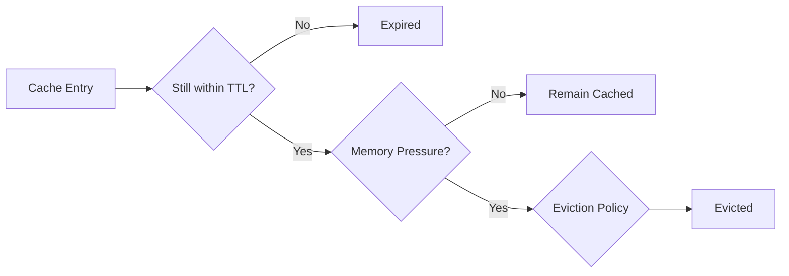
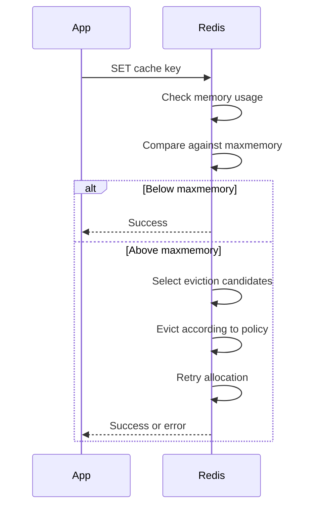
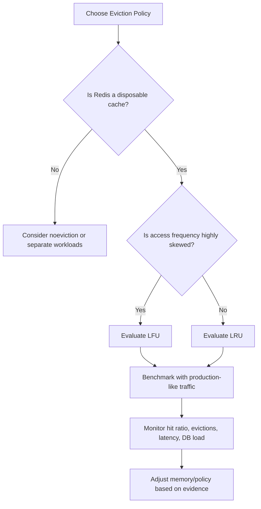
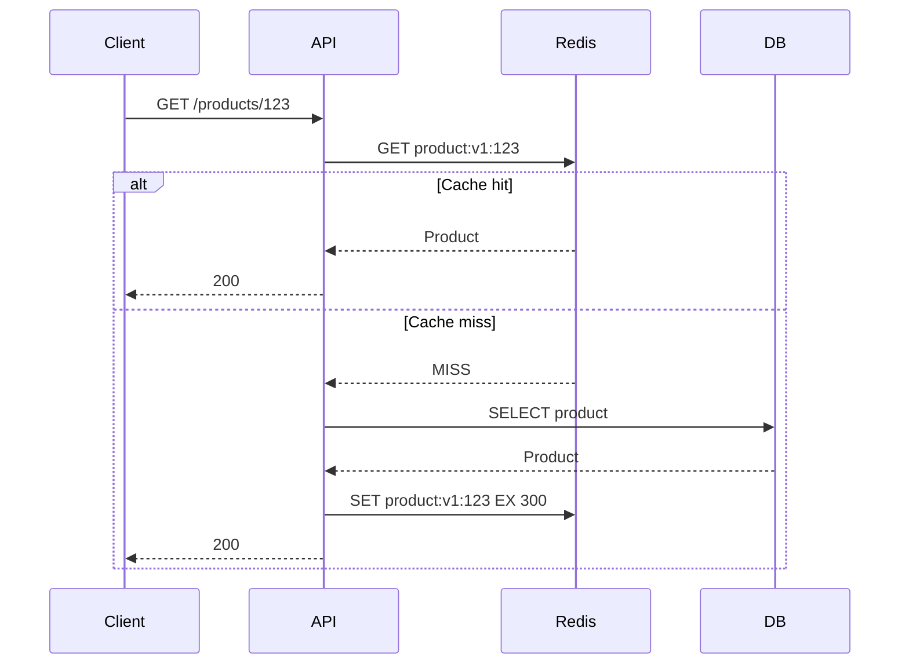

# 04- Cache Eviction Policies

## Overview

Cache eviction is the mechanism used to decide which cached entries should be removed when a cache reaches its configured memory limit or when entries are otherwise considered eligible for removal.

Cache invalidation and cache eviction solve different problems:

| Concept | Trigger | Purpose |
|---|---|---|
| Cache invalidation | Application/data change | Remove data that is no longer logically valid |
| Cache expiration | TTL reached | Remove data that is too old |
| Cache eviction | Resource pressure/policy | Free memory by removing entries |
| Cache refresh | Application policy | Replace or recompute cached data |

A production cache normally needs both invalidation and eviction.

For example:

```text
PostgreSQL
    |
    | source of truth
    v
Redis
    |
    +--> Explicit invalidation when data changes
    |
    +--> TTL expiration when data becomes old
    |
    +--> Eviction when memory pressure requires space
```

Eviction is therefore primarily a **capacity-management mechanism**, not a correctness mechanism.

A cache should never depend on a particular eviction policy to maintain application correctness. Any evicted value must be safely reconstructable from the authoritative source or another durable system.

## Why Cache Eviction Exists

Memory is finite.

Suppose Redis is configured with:

```text
maxmemory = 4 GB
```

The application continues writing cache entries:

```text
1 GB
2 GB
3 GB
4 GB
4 GB + new write
```

At this point Redis needs to determine what happens to the new data.

Possible behaviors include:

- Reject the new write.
- Remove an existing key and accept the new write.
- Remove only keys that have expired.
- Remove keys based on access frequency.
- Remove keys based on recency.
- Remove keys from a configured subset of keys.

The eviction policy determines this behavior.

## Eviction vs TTL

TTL and eviction are related but fundamentally different.

### TTL

TTL answers:

> How long should this entry remain logically valid?

Example:

```text
product:123
TTL = 300 seconds
```

After five minutes, the entry is expired.

### Eviction

Eviction answers:

> Which entry should be removed because the cache needs memory?

An entry can therefore have:

```text
TTL = 1 hour
```

and still be evicted after two minutes because the cache reaches its memory limit.



## Why Eviction Policy Matters

The wrong eviction policy can produce:

- Low cache hit ratios.
- Excessive database load.
- Increased API latency.
- Cache stampedes.
- Unpredictable performance.
- Memory instability.
- Repeated regeneration of expensive values.

The goal is not simply to keep Redis full.

The goal is to maximize useful cache utilization under a fixed memory budget.

A good policy preferentially removes data that has the lowest expected future value.

## Common Eviction Policies

Common policies include:

| Policy | Behavior | Typical Use |
|---|---|---|
| `noeviction` | Reject writes when memory limit is reached | Correctness-sensitive Redis workloads |
| `allkeys-lru` | Evict least recently used keys | General-purpose cache |
| `volatile-lru` | Evict least recently used keys with TTL | Mixed keyspace with expirations |
| `allkeys-lfu` | Evict least frequently used keys | Frequency-driven workloads |
| `volatile-lfu` | LFU among keys with TTL | Mixed workloads |
| `allkeys-random` | Evict random keys | Uniform/random workloads |
| `volatile-random` | Randomly evict keys with TTL | Specialized workloads |
| `volatile-ttl` | Prefer keys with shorter remaining TTL | TTL-oriented workloads |
| `allkeys-lru` / `allkeys-lfu` | Apply policy across all keys | Dedicated cache instances |

Exact policy availability and behavior can vary by Redis version, so production environments should verify the policy supported by the deployed Redis version.

## `noeviction`

With `noeviction`, Redis does not automatically remove existing keys when the configured memory limit is reached.

Instead, commands that would increase memory usage can fail.

Conceptually:

```text
Redis memory
    |
    v
maxmemory reached
    |
    v
SET new-key
    |
    v
Error
```

### Advantages

- Existing cached data is not unexpectedly removed.
- Appropriate when Redis contains data that cannot simply disappear.
- Makes memory exhaustion explicit to the application.

### Limitations

- New cache writes can fail.
- Applications must handle Redis write errors.
- A cache may stop accepting new data during memory pressure.

### When to Use

Use `noeviction` when Redis is acting as more than a disposable cache and losing arbitrary keys would be unacceptable.

Examples include workloads where Redis stores:

- Important coordination state.
- Application state that cannot be silently reconstructed.
- Carefully managed queues or structures.
- Data whose removal has correctness implications.

If Redis is purely a disposable cache, `noeviction` is often less useful than an appropriate eviction policy.

## LRU Eviction

LRU means **Least Recently Used**.

The basic idea is:

> Evict entries that have not been accessed recently.

Suppose the cache contains:

```text
A -> accessed 1 second ago
B -> accessed 10 seconds ago
C -> accessed 1 hour ago
D -> accessed 2 hours ago
```

If memory pressure occurs, `D` is a strong eviction candidate.

### Why LRU Works

Many workloads exhibit temporal locality:

> Data accessed recently is more likely to be accessed again soon.

Examples:

- Recently viewed products.
- Active user sessions.
- Recently requested API responses.
- Popular pages during a traffic burst.

### Advantages

- Simple mental model.
- Works well for many web workloads.
- Naturally adapts to changing access patterns.
- Good general-purpose policy.

### Limitations

LRU considers **recency**, not frequency.

Consider:

```text
Key A:
    accessed 1,000 times yesterday

Key B:
    accessed once 10 seconds ago
```

Key A may be considered less recent even though it has much higher long-term demand.

This is where LFU can perform better.

## Redis LRU Is Not a Perfect Global LRU

A common interview trap is assuming Redis maintains an exact globally sorted list of every key by access time.

Modern Redis uses approximations and samples candidates rather than maintaining an expensive exact global ordering.

This is intentional.

Maintaining exact LRU metadata for every key would introduce additional memory and CPU overhead.

Redis can therefore provide behavior that approximates LRU while keeping eviction efficient.

This is an important systems-design trade-off:

```text
Exact policy
    |
    +--> Better theoretical accuracy
    +--> Higher overhead

Approximate policy
    |
    +--> Lower overhead
    +--> Very good practical behavior
```

## `allkeys-lru`

`allkeys-lru` applies LRU eviction across all keys.

Example:

```text
Redis
├── product:123
├── product:456
├── user:100
├── search:abc
└── recommendations:100
```

All of these can become eviction candidates.

### When to Use

This is often an excellent default for a Redis instance dedicated primarily to caching.

```text
Application
    |
    v
Redis cache
    |
    +--> allkeys-lru
```

The application does not need to ensure every cache key has a TTL merely to make it eligible for eviction.

## LFU Eviction

LFU means **Least Frequently Used**.

Instead of primarily asking:

> Which key was used least recently?

LFU asks:

> Which key has historically been accessed least frequently?

Example:

```text
product:1 -> 100,000 accesses
product:2 -> 20 accesses
product:3 -> 2 accesses
```

Under memory pressure, `product:3` is a stronger eviction candidate.

### Why LFU Exists

Some workloads have highly skewed popularity.

For example:

```text
10% of keys -> 90% of traffic
90% of keys -> 10% of traffic
```

Keeping frequently accessed keys can produce a better hit ratio.

### Advantages

- Good for highly skewed workloads.
- Protects hot keys.
- Less sensitive to temporary bursts than pure recency-based approaches.
- Useful for large caches with stable popularity distributions.

### Limitations

A key that was extremely popular historically may retain a high frequency score even after demand disappears.

Modern implementations therefore use aging/decay mechanisms so historical access does not dominate forever.

## LRU vs LFU

| Characteristic | LRU | LFU |
|---|---|---|
| Primary signal | Recent access | Access frequency |
| Good for | Temporal locality | Stable popularity |
| Hot-key protection | Moderate | Strong |
| Adaptation to sudden changes | Usually better | Can be slower |
| Implementation complexity | Moderate | Higher |
| Typical use | General-purpose cache | Highly skewed workloads |

There is no universal winner.

Choose based on traffic characteristics and validate with measurements.

## Random Eviction

Random eviction chooses entries without considering their access history.

```text
A
B
C
D
```

If one key must be removed:

```text
Randomly choose C
```

### Advantages

- Very low policy overhead.
- Simple.
- Can perform reasonably when key access is close to uniform.

### Limitations

It may remove:

- Extremely hot keys.
- Recently populated values.
- Expensive-to-compute entries.

For typical API caching workloads, LRU or LFU usually provides better locality-aware behavior.

## TTL-Based Eviction

TTL-oriented policies prefer keys with shorter remaining expiration times.

Suppose:

```text
A -> 10 seconds remaining
B -> 100 seconds remaining
C -> 1 hour remaining
```

The policy may prefer `A`.

This can be useful when expiration semantics are particularly important.

However, shortest TTL does not necessarily mean lowest cache value.

A key expiring soon might be extremely hot.

Therefore, TTL-based eviction should be chosen based on workload semantics rather than assumed to be universally optimal.

## `volatile-*` vs `allkeys-*`

This distinction is important.

### `allkeys-*`

The policy can consider all keys.

```text
allkeys-lru
allkeys-lfu
allkeys-random
```

### `volatile-*`

Only keys with an expiration time are eligible.

```text
volatile-lru
volatile-lfu
volatile-random
volatile-ttl
```

Consider:

```text
Key A -> TTL configured
Key B -> no TTL
```

Under `volatile-lru`:

```text
A -> eviction candidate
B -> protected
```

Under `allkeys-lru`:

```text
A -> candidate
B -> candidate
```

## Why `volatile-*` Can Be Dangerous

Suppose developers assume:

```text
volatile-lru
```

means:

> Evict the least useful cache entry.

It does not.

It means:

> Evict according to the selected policy among keys that have expiration metadata.

If many keys do not have TTLs, the eligible pool can become too small.

Eventually Redis may be unable to evict enough memory and writes can fail.

For a dedicated cache instance, `allkeys-*` policies are often easier to reason about.

## Dedicated Cache vs Mixed Redis

Eviction policy decisions become much easier when Redis is dedicated to caching.

### Dedicated Cache

```text
Redis Cluster
    |
    +--> Cache entries only
```

A policy such as:

```text
allkeys-lru
```

has clear semantics.

### Mixed Workload

```text
Redis
├── Cache
├── Sessions
├── Locks
├── Counters
└── Application state
```

Now arbitrary eviction can remove data that is not merely a disposable cache.

This can create correctness problems.

### Production Recommendation

Avoid mixing workloads with fundamentally different eviction semantics in the same Redis instance.

Prefer:

```text
Redis Cache
    |
    +--> Evictable data

Redis State
    |
    +--> Non-evictable data
```

Separate instances or managed Redis deployments often provide clearer operational boundaries.

## Memory Pressure Lifecycle

A simplified eviction lifecycle looks like:



The exact internal behavior depends on Redis version and configuration, but the architectural principle is consistent:

```text
Write
  |
  v
Memory limit
  |
  +--> Capacity available --> Store
  |
  +--> Capacity exhausted --> Eviction policy
                              |
                              +--> Evict
                              |
                              +--> Reject
```

## Configuring Redis Eviction

A Redis configuration can specify:

```conf
maxmemory 4gb
maxmemory-policy allkeys-lru
```

You can inspect the current configuration:

```bash
redis-cli CONFIG GET maxmemory
redis-cli CONFIG GET maxmemory-policy
```

Example output:

```text
1) "maxmemory"
2) "4294967296"

1) "maxmemory-policy"
2) "allkeys-lru"
```

Set the policy dynamically where supported and permitted:

```bash
redis-cli CONFIG SET maxmemory-policy allkeys-lru
```

For managed Redis services, configuration capabilities and operational procedures depend on the provider.

## Choosing `maxmemory`

Do not automatically configure:

```text
maxmemory = total machine RAM
```

Redis itself needs memory for:

- Data structures.
- Client connections.
- Replication buffers.
- Persistence buffers where applicable.
- Internal overhead.
- Cluster metadata.
- Fragmentation.
- Operational spikes.

The actual safe memory budget depends on deployment architecture and workload.

For containerized Redis:

```text
Container memory limit
        |
        +--> Redis maxmemory
        |
        +--> Runtime/internal overhead
        |
        +--> Safety margin
```

Do not configure `maxmemory` so aggressively that the container reaches its cgroup memory limit before Redis can operate safely.

## Memory Fragmentation

Redis memory usage is not simply:

```text
sum(value sizes)
```

Actual memory consumption can include allocator fragmentation and internal overhead.

Useful metrics include:

```text
used_memory
used_memory_rss
mem_fragmentation_ratio
```

Inspect memory:

```bash
redis-cli INFO memory
```

A high RSS relative to logical Redis memory can indicate allocator fragmentation or other process-level memory overhead.

Eviction policy alone cannot solve poor memory sizing.

## Cache Hit Ratio and Eviction

Eviction policy should be evaluated using actual cache effectiveness.

A useful metric is:

```text
cache hit ratio =
    cache hits /
    (cache hits + cache misses)
```

For example:

```text
Hits   = 950,000
Misses = 50,000

Hit ratio = 95%
```

A low hit ratio can indicate:

- Cache too small.
- Poor key selection.
- Incorrect TTLs.
- Bad eviction policy.
- High cardinality.
- Workload churn.
- Unpredictable access patterns.

A high hit ratio does not automatically mean the cache is healthy either.

A cache can have a high hit ratio while:

- Consuming excessive memory.
- Serving stale data.
- Caching low-value responses.
- Increasing operational cost.

Measure latency and backend load alongside hit ratio.

## Eviction Metrics

Important Redis metrics include:

```text
evicted_keys
expired_keys
keyspace_hits
keyspace_misses
used_memory
used_memory_peak
used_memory_rss
maxmemory
mem_fragmentation_ratio
```

Inspect statistics:

```bash
redis-cli INFO stats
```

Inspect memory:

```bash
redis-cli INFO memory
```

Useful application-level metrics include:

```text
cache_hit_ratio
cache_miss_ratio
cache_get_latency
cache_set_latency
cache_eviction_rate
cache_rebuild_rate
database_queries_from_cache_misses
```

## Eviction Rate as an Operational Signal

A small amount of eviction may be normal.

A sudden increase can indicate:

```text
Traffic spike
     |
     v
More cache writes
     |
     v
Memory pressure
     |
     v
Evictions increase
     |
     v
Cache misses increase
     |
     v
Database load increases
```

This can create a feedback loop:

```text
Eviction
  -> Miss
  -> DB query
  -> Cache write
  -> More memory pressure
  -> More eviction
```

If the cache is undersized, increasing traffic can therefore amplify database load.

## Eviction and Cache Stampede

Eviction can trigger the same problems as expiration.

Suppose:

```text
10,000 requests
       |
       v
Hot key evicted
       |
       v
10,000 cache misses
       |
       v
10,000 database queries
```

The cache did exactly what it was configured to do, but the application may still experience a database overload.

Mitigations include:

- Request coalescing.
- Single-flight regeneration.
- Distributed locks.
- Stale-while-revalidate.
- Refresh-ahead.
- Cache prewarming.
- Database connection limits.
- Rate limiting.
- Backpressure.

Eviction policy should therefore be designed together with cache-miss behavior.

## Hot Keys

A hot key receives disproportionately high traffic.

Example:

```text
product:123
```

receives:

```text
500,000 requests/minute
```

while thousands of other keys receive almost no traffic.

Evicting a hot key can cause a severe performance event.

Under LFU, hot keys may be protected better.

Under LRU, a sufficiently active hot key is also likely to remain recently used.

However, eviction policy does not solve all hot-key problems.

A hot key can still create:

- Network concentration.
- CPU concentration.
- Single-node pressure.
- Lock contention.
- Replication pressure.

Hot-key mitigation may require:

- Local in-process caching.
- Key replication.
- Request coalescing.
- Sharding.
- Read-through strategies.
- Traffic-aware architecture.

## Cache Warming

After:

- Deployment.
- Redis restart.
- Cluster replacement.
- Disaster recovery.
- Large cache flush.

the cache may be cold.

```text
Cold cache
    |
    v
Many misses
    |
    v
Database load spike
```

Cache warming can prepopulate predictable high-value entries.

Example:

```text
Deployment
    |
    v
Warm top 10,000 products
    |
    v
Enable production traffic
```

Do not blindly warm everything.

Cache warming itself can overload the database if implemented as an uncontrolled bulk operation.

## TTL Jitter

If many keys are created at exactly the same time with identical TTLs:

```text
100,000 keys
TTL = 300 seconds
```

they may expire around the same time.

This can create a synchronized load spike.

Add jitter:

```python
import random


def cache_ttl(base_seconds: int) -> int:
    return base_seconds + random.randint(0, 60)
```

For example:

```text
TTL = 300–360 seconds
```

This spreads expiration over time.

TTL jitter does not directly change the eviction algorithm, but it reduces synchronized expiration pressure and can improve cache stability.

## Eviction and Persistence

Redis can be used with persistence mechanisms such as:

- RDB snapshots.
- AOF.

However, persistence does not make an evictable cache equivalent to a durable database.

If:

```text
maxmemory-policy = allkeys-lru
```

Redis may intentionally remove entries.

Those entries should remain reconstructable.

For a disposable cache:

```text
PostgreSQL -> source of truth
Redis -> performance optimization
```

This is usually the cleanest architecture.

## Eviction and Replication

In replicated Redis architectures, eviction behavior needs to be considered across primary and replicas.

A cache miss after failover can cause:

```text
Failover
   |
   v
Replica becomes primary
   |
   v
Different cache residency
   |
   v
Miss spike
```

Applications should tolerate cache coldness after failover.

Do not assume a failover preserves exactly the same performance characteristics as the previous primary.

Managed Redis offerings may also impose provider-specific behavior around replication, failover, memory limits, and eviction.

## Eviction in Redis Cluster

Redis Cluster distributes keys across hash slots.

Conceptually:

```text
                 Redis Cluster
                      |
       +--------------+--------------+
       |              |              |
     Node A         Node B         Node C
       |              |              |
    Slot range     Slot range     Slot range
```

Each node has its own memory constraints and eviction behavior.

This means:

```text
Cluster memory = sum of node capacities
```

does not imply that every node has identical utilization.

Poor key distribution can create uneven memory pressure.

Monitor per-node:

- Memory usage.
- Evictions.
- Key count.
- Hit ratio.
- CPU.
- Network throughput.

## Choosing an Eviction Policy

A practical decision process:



### General Guidance

| Workload | Starting Point |
|---|---|
| General API response cache | `allkeys-lru` |
| Highly skewed popularity | `allkeys-lfu` |
| All keys have meaningful TTLs and only TTL keys should be evictable | `volatile-lru` / `volatile-lfu` |
| Uniform/random access | `allkeys-random` |
| Non-disposable state | `noeviction` or separate Redis instance |
| Large disposable cache | `allkeys-lru` or `allkeys-lfu` with benchmarking |

These are starting points, not universal rules.

## Production Sizing Strategy

Do not choose Redis capacity based only on the total size of source data.

Suppose:

```text
Database rows = 100 million
```

You probably do not want:

```text
100 million cached objects
```

Instead, estimate:

```text
Expected working set
+
Key overhead
+
Value overhead
+
Redis data structure overhead
+
Replication/persistence overhead
+
Fragmentation
+
Safety margin
```

The relevant question is:

> How much data must remain cached to achieve the required hit ratio?

This is a workload question rather than simply a database-size question.

## Example: Product API

Suppose a product API receives:

```text
10 million requests/day
```

The top products receive most traffic.

A cache might use:

```text
Key:
product:v1:{id}

TTL:
300–600 seconds

Eviction:
allkeys-lru

Source:
PostgreSQL
```

Read path:



If Redis reaches its memory limit:

```text
allkeys-lru
    |
    v
Least recently used candidate
    |
    v
Evicted
```

The next request simply rebuilds the entry from PostgreSQL.

This is exactly the kind of workload where LRU-style eviction is a reasonable starting point.

## Common Mistakes

### Treating Eviction as Invalidation

Eviction does not mean the underlying data changed.

It only means the cache chose to remove an entry.

The next request should be able to reconstruct it.

### Using an Eviction Policy for Correctness

Do not assume:

```text
Eventually Redis evicts it
```

is an acceptable consistency strategy.

If data must be invalidated after an update, explicitly invalidate it.

### Using `volatile-*` Without TTL Discipline

If many keys have no expiration, they may become ineligible for eviction.

### Mixing Critical State and Disposable Cache Data

An `allkeys-lru` policy can remove any eligible key.

Do not place non-evictable state in the same namespace and assume it is protected.

### Choosing LRU Without Measuring

LRU is a strong default, not a guarantee of optimal hit ratio.

Measure actual workload behavior.

### Assuming More Memory Always Fixes the Problem

Increasing memory can help, but a poor cache-key strategy can waste large amounts of memory.

Check:

- Key cardinality.
- Value size.
- Duplicate representations.
- TTLs.
- Hit ratio.
- Working-set size.

### Ignoring Value Size

One enormous cached object can consume more memory than thousands of small objects.

Cache sizing must account for serialized value sizes and Redis overhead.

### Ignoring Database Load During Eviction

Eviction increases cache misses, which can increase database traffic.

Monitor the entire chain:

```text
Evictions
   |
   v
Misses
   |
   v
Database queries
   |
   v
Database CPU / connections / latency
```

### Flushing the Cache During Peak Traffic

A cache flush can cause a cache stampede.

If a flush is necessary:

- Schedule it carefully.
- Protect the database.
- Prewarm important keys.
- Rate-limit regeneration.
- Monitor database load.

## Interview Traps

| Question | Strong Answer |
|---|---|
| What is cache eviction? | Removing cached entries because of memory/resource pressure according to an eviction policy. |
| Is eviction the same as invalidation? | No. Invalidation is driven by data correctness; eviction is driven by cache capacity/resource management. |
| What is LRU? | Evict entries that have been least recently accessed. |
| What is LFU? | Evict entries with the lowest access frequency, typically with aging to prevent historical popularity from dominating forever. |
| What is `allkeys-lru`? | LRU eviction where all keys can be considered candidates. |
| What is `volatile-lru`? | LRU eviction restricted to keys that have an expiration configured. |
| When would `noeviction` be appropriate? | When arbitrary key removal is unacceptable and write failures are preferable to silently losing data. |
| Is Redis LRU exact? | No. Redis uses an approximation to achieve good eviction behavior without the overhead of maintaining an exact global ordering. |
| Which is better, LRU or LFU? | Neither universally. LRU favors recent access; LFU favors sustained popularity. Benchmark against the actual workload. |
| What happens when a hot key is evicted? | It can cause a miss storm and downstream load spike; request coalescing, refresh-ahead, stale serving, or other protections may be needed. |
| Should a cache contain the entire database? | Usually no. Cache the working set that provides meaningful latency/load reduction. |
| Can eviction guarantee data consistency? | No. Eviction is a capacity mechanism and should never be relied upon as the primary correctness mechanism. |

## Key Takeaways

- **Cache eviction is a capacity-management mechanism; cache invalidation and TTL handle correctness and freshness concerns separately.**
- **`allkeys-lru` is a strong general-purpose starting point for disposable Redis caches, while `allkeys-lfu` can perform better when access frequency is highly skewed.**
- **`volatile-*` policies only consider keys with expiration metadata, so they require disciplined TTL configuration and can be problematic in mixed workloads.**
- **Eviction increases cache misses, so production monitoring must connect eviction rates with hit ratio, latency, database load, and cache-regeneration behavior.**
- **Treat Redis cache data as disposable and reconstructable; separate non-evictable application state from aggressively evictable cache workloads.**