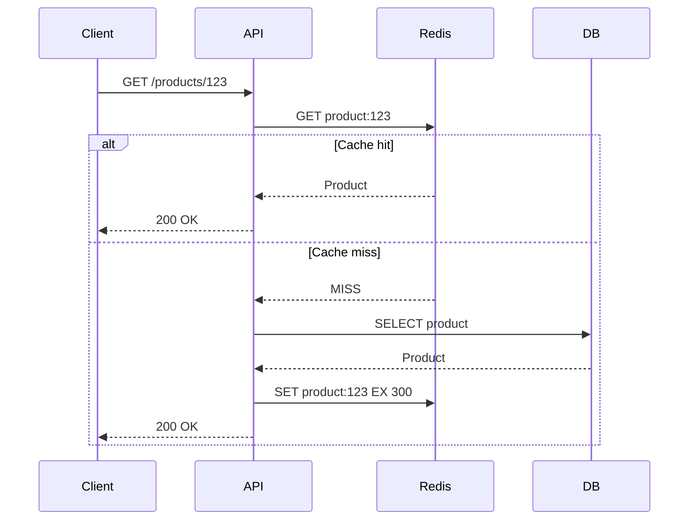
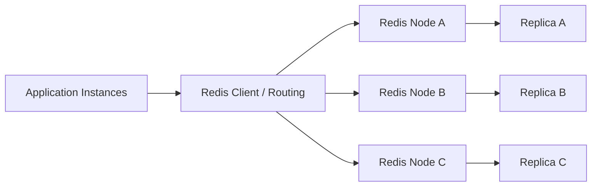
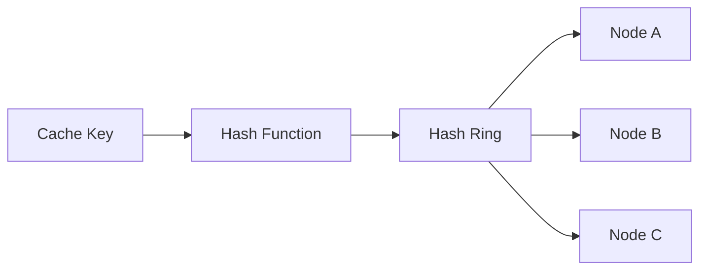
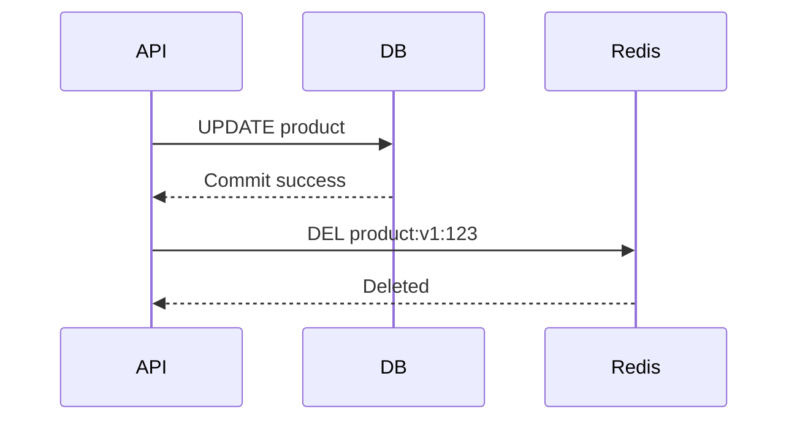

# 05- Distributed Cache

## Overview

A distributed cache is a cache shared by multiple application instances, services, or hosts rather than being stored only inside the memory of a single application process.

Distributed caching is a common scalability pattern for backend systems where many application instances need fast access to the same frequently used data.

A typical architecture looks like:

```text
                    ┌──────────────────┐
                    │      Client      │
                    └────────┬─────────┘
                             │
                             v
                    ┌──────────────────┐
                    │ Nginx / ALB      │
                    └────────┬─────────┘
                             │
              ┌──────────────┼──────────────┐
              │              │              │
              v              v              v
        ┌──────────┐   ┌──────────┐   ┌──────────┐
        │ API #1   │   │ API #2   │   │ API #3   │
        └────┬─────┘   └────┬─────┘   └────┬─────┘
             │              │              │
             └──────────────┼──────────────┘
                            v
                     ┌─────────────┐
                     │ Redis       │
                     │ Distributed │
                     │ Cache       │
                     └──────┬──────┘
                            │
                            v
                     ┌─────────────┐
                     │ PostgreSQL  │
                     └─────────────┘
```

The key architectural property is that application instances share a common cache rather than maintaining isolated process-local caches.

This matters in horizontally scaled systems. If ten API instances independently cache the same data in local memory, each instance can have a different cache state. A distributed cache provides a shared caching layer that can be accessed by all instances.

Common technologies include:

- Redis
- Amazon ElastiCache for Redis-compatible workloads
- Memcached
- Managed caching platforms provided by cloud vendors

For modern Python backends, Redis is commonly used with Django, FastAPI, Celery, rate limiting, distributed locks, session storage, and general-purpose caching.

## Why Distributed Caching Exists

A database is optimized for durable storage and querying, but frequently repeated reads can still become expensive.

Consider:

```text
10 API instances
1,000 requests/second
Each request performs the same database lookup
```

Without caching:

```text
1,000 requests/sec
        |
        v
1,000 database queries/sec
```

With a shared distributed cache:

```text
1,000 requests/sec
        |
        v
Redis
        |
        +----> 950 cache hits
        |
        +----> 50 database queries
```

A 95% cache hit ratio can substantially reduce:

- Database CPU.
- Database connection usage.
- Query latency.
- Application latency.
- Infrastructure cost.
- Pressure on read replicas.

The cache should normally be treated as a performance optimization rather than the system of record.

```text
PostgreSQL
    |
    | authoritative data
    v
Redis
    |
    | faster derived copy
    v
Application
```

If Redis loses all cached values, the application should generally be capable of reconstructing them from the authoritative datastore.

## Local Cache vs Distributed Cache

The fundamental distinction is where cached data lives.

### Local Process Cache

```text
API #1 ──> Local Memory
API #2 ──> Local Memory
API #3 ──> Local Memory
```

Each application instance owns its cache.

### Distributed Cache

```text
API #1 ──┐
API #2 ──┼──> Redis
API #3 ──┘
```

All instances access the same cache infrastructure.

| Characteristic | Local Cache | Distributed Cache |
|---|---|---|
| Location | Application process | External cache cluster |
| Network hop | No | Yes |
| Cross-instance sharing | No | Yes |
| Memory isolation | Per process | Shared |
| Cache consistency | Difficult across instances | Easier to coordinate |
| Failure domain | Application instance | Cache infrastructure |
| Scaling | Memory scales with instances | Cache scales independently |
| Latency | Lowest | Very low, but network-dependent |
| Operational complexity | Low | Higher |
| Typical examples | In-process dictionary, LRU cache | Redis, Memcached |

A local cache can still be useful in front of a distributed cache:

```text
Application
    |
    v
Local L1 Cache
    |
    | miss
    v
Redis L2 Cache
    |
    | miss
    v
PostgreSQL
```

This is a multi-level caching architecture.

## When to Use a Distributed Cache

A distributed cache is useful when:

- Multiple application instances need shared cached state.
- Horizontal scaling is required.
- Database reads are expensive or repetitive.
- Low-latency reads are important.
- The working set is too large for application-process memory.
- Cache state must survive individual application restarts.
- Multiple services need access to the same cached data.
- Centralized rate limiting or coordination is required.

Typical examples include:

- Product metadata.
- User profile data.
- Configuration.
- Frequently accessed API responses.
- Authentication/session data.
- Expensive aggregation results.
- Permissions.
- Feature flags.
- Rate-limit counters.
- Distributed locks.

## When Not to Use One

A distributed cache introduces operational complexity and another network dependency.

Avoid adding one merely because:

> Redis is fast.

If an application performs only a small number of inexpensive database queries, a distributed cache may provide little benefit.

It can also make the system harder to reason about because now there are additional concerns:

- Cache consistency.
- TTL management.
- Serialization.
- Network failures.
- Memory pressure.
- Eviction.
- Failover.
- Monitoring.
- Security.
- Cost.

The right question is:

> Does the reduction in backend work and latency justify the operational complexity of another distributed component?

## Distributed Cache Request Flow

A common cache-aside request path is:



The application decides:

1. What to cache.
2. How to construct the cache key.
3. How long the value should remain valid.
4. What to do on a cache miss.
5. What to do when Redis is unavailable.

The cache itself should not become the owner of business correctness.

## Cache-Aside with Redis

Cache-aside is one of the most common patterns for distributed caching.

```python
from django.core.cache import cache

CACHE_TTL = 300


def get_product(product_id: int):
    key = f"product:v1:{product_id}"

    product = cache.get(key)

    if product is not None:
        return product

    product = load_product_from_database(product_id)

    cache.set(key, product, timeout=CACHE_TTL)

    return product
```

The application controls both cache reads and cache population.

### Advantages

- Simple.
- Easy to introduce incrementally.
- Cache failure can often be handled independently.
- Database remains the source of truth.
- Works well with Redis and Memcached.

### Limitations

- First request after a miss is slower.
- Concurrent misses can cause duplicate database queries.
- Cache invalidation remains an application responsibility.
- Cache stampedes require additional protection.

## Distributed Cache Topologies

### Single Cache Instance

```text
API instances
      |
      v
   Redis
      |
      v
 PostgreSQL
```

Simple but introduces a single infrastructure failure domain.

### Primary + Replica

```text
              ┌──────────────┐
              │ Redis Primary│
              └──────┬───────┘
                     │
                     v
              ┌──────────────┐
              │ Redis Replica│
              └──────────────┘
```

Replication can improve availability and support read scaling depending on the Redis deployment model.

It does not automatically provide unlimited read scalability or eliminate every failure mode.

### Redis Cluster



Redis Cluster distributes keys across hash slots.

This allows the cache to scale horizontally by distributing data across multiple nodes.

## Cache Sharding

Distributed caches can partition keys across nodes.

A simplified model is:

```text
node = hash(cache_key) % N
```

For example:

```text
hash("product:123") % 4 -> Node 2
hash("product:456") % 4 -> Node 0
```

Modern distributed systems generally use more sophisticated approaches such as consistent hashing or Redis Cluster hash slots.

The goal is to distribute:

- Memory.
- Requests.
- CPU.
- Network traffic.

Even distribution is important because one overloaded cache node can become the bottleneck even when the cluster has substantial unused capacity elsewhere.

## Consistent Hashing

Consistent hashing reduces key movement when cache nodes are added or removed.

With naive modulo hashing:

```text
hash(key) % 3
```

changing from three nodes to four causes many keys to map to different nodes.

That can produce a large cache miss storm.

Consistent hashing attempts to minimize remapping.



This is particularly useful for distributed caches where applications manage node membership themselves.

Redis Cluster uses hash slots rather than a traditional application-managed consistent-hashing ring.

## Cache Key Design

Cache-key design is one of the most important parts of distributed caching.

A good key should be:

- Deterministic.
- Unique for the logical resource.
- Stable.
- Versionable.
- Easy to inspect.
- Appropriately scoped.

Example:

```text
product:v1:123
user:v2:456
permissions:v1:user:456
```

Avoid ambiguous keys:

```text
123
user
data
```

Namespacing prevents collisions between applications and data types.

Example:

```text
catalog:product:v1:123
billing:invoice:v1:123
```

These keys can safely coexist.

## Cache-Key Versioning

Schema changes can make existing cached values incompatible with new application code.

Instead of:

```text
product:123
```

use:

```text
product:v2:123
```

When the serialization structure changes:

```text
v1 -> old representation
v2 -> new representation
```

This can avoid expensive full-cache flushes during deployments.

## Serialization

Distributed caches store bytes or data structures rather than Python objects with application-process identity.

A Python application therefore needs serialization.

Common choices include:

- JSON.
- MessagePack.
- Pickle.
- Protocol Buffers.
- Redis-native data structures.

JSON:

```json
{
  "id": 123,
  "name": "Laptop",
  "price": 899.99
}
```

is portable and easy to inspect.

Binary formats can be more compact and faster for certain workloads.

### Security Consideration

Avoid deserializing untrusted data using unsafe mechanisms.

In particular, Python `pickle` can execute arbitrary code when malicious payloads are deserialized.

For distributed systems, prefer explicitly defined serialization formats such as JSON or Protocol Buffers when interoperability and security matter.

## Cache Value Size

Large cache values can cause:

- High memory consumption.
- Network overhead.
- Serialization CPU cost.
- Deserialization CPU cost.
- Increased latency.
- Greater eviction pressure.

For example:

```text
10 KB value × 1,000,000 keys = ~10 GB raw payload
```

Actual memory usage will be higher because of key and data-structure overhead.

Avoid caching unnecessarily large objects.

Instead of:

```text
Entire customer object graph
```

consider:

```text
customer:v1:123
```

containing only the fields needed by the hot request path.

## Cache Stampede

A cache stampede occurs when many requests miss the same key simultaneously.

```text
            Hot key expires
                  |
       ┌──────────┼──────────┐
       v          v          v
    Request    Request    Request
       |          |          |
       +----------+----------+
                  |
             Cache MISS
                  |
       ┌──────────┼──────────┐
       v          v          v
      DB         DB         DB
```

The database can receive a sudden burst of identical queries.

### Mitigations

#### Request Coalescing

Only one request regenerates the value while others wait.

#### Distributed Lock

Use a short-lived lock around regeneration.

```text
GET cache key
     |
     +--> hit -> return
     |
     +--> miss
            |
            v
       acquire lock
            |
            v
       query database
            |
            v
        set cache
            |
            v
       release lock
```

#### Stale-While-Revalidate

Serve slightly stale data while asynchronously refreshing the cache.

#### Refresh-Ahead

Refresh frequently accessed values before they expire.

## Cache Penetration

Cache penetration occurs when requests repeatedly ask for values that do not exist.

Example:

```text
GET /users/999999999
GET /users/999999998
GET /users/999999997
...
```

Every request can bypass the cache and hit the database.

### Mitigation

Cache negative results for a short period.

```text
user:999999999 -> NOT_FOUND
TTL = 30 seconds
```

Bloom filters can also prevent obviously nonexistent keys from reaching the database when the workload justifies their complexity.

Negative caching must be designed carefully because a previously nonexistent record may later be created.

## Cache Availability

A distributed cache is itself a distributed system.

Redis can fail because of:

- Network partitions.
- Node failure.
- Memory exhaustion.
- Configuration errors.
- Deployment problems.
- Client connection exhaustion.
- DNS/service-discovery problems.
- Cloud infrastructure failures.

The application needs an explicit cache failure strategy.

For many read caches:

```text
Redis unavailable
       |
       v
Bypass cache
       |
       v
Database
```

This provides graceful degradation.

However, this can overload the database if Redis remains unavailable under high traffic.

## Fail-Open vs Fail-Closed

### Fail Open

If cache access fails:

```text
Redis failure
    |
    v
Read from database
```

Useful for disposable read caches.

### Fail Closed

If cache access fails:

```text
Redis failure
    |
    v
Reject request
```

This may be appropriate when Redis is required for correctness or authorization state.

| Scenario | Typical Strategy |
|---|---|
| Product response cache | Fail open |
| Expensive recommendation cache | Usually fail open with protection |
| Rate limiter | Depends on security requirements |
| Authentication/session state | Depends on architecture |
| Distributed lock | Usually fail closed for the protected operation |
| Critical coordination state | Fail closed |

Do not make this decision generically. It depends on what Redis represents in the system.

## Database Protection During Cache Failure

A common mistake is:

```text
Redis fails
    |
    v
Every API instance hits PostgreSQL
```

This can cause a database outage.

Use additional protection:

- Circuit breakers.
- Request rate limits.
- Concurrency limits.
- Connection pool limits.
- Backpressure.
- Stale cache fallback.
- Request coalescing.
- Local caching.
- Graceful degradation.

A resilient architecture should prevent cache failure from becoming database failure.

## Multi-Level Caching

A high-throughput architecture can use:

```text
             ┌────────────────┐
Request ───> │ L1 Local Cache │
             └───────┬────────┘
                     │ miss
                     v
             ┌────────────────┐
             │ L2 Redis       │
             └───────┬────────┘
                     │ miss
                     v
             ┌────────────────┐
             │ PostgreSQL     │
             └────────────────┘
```

### L1

Advantages:

- Extremely low latency.
- No network request.
- Reduces Redis traffic.

Limitations:

- Per-instance state.
- Stale data can persist independently.
- More complex invalidation.

### L2

Advantages:

- Shared across instances.
- Larger capacity.
- Centralized cache state.

Limitations:

- Network latency.
- External dependency.
- Operational complexity.

A multi-level cache is useful for extremely high-throughput workloads but introduces more consistency complexity.

## Distributed Cache and Django

Django can use Redis as a shared cache backend.

A typical configuration can look like:

```python
CACHES = {
    "default": {
        "BACKEND": "django.core.cache.backends.redis.RedisCache",
        "LOCATION": "redis://redis:6379/1",
        "TIMEOUT": 300,
    }
}
```

Application code can use:

```python
from django.core.cache import cache


def get_product(product_id: int):
    key = f"catalog:product:v1:{product_id}"

    value = cache.get(key)

    if value is not None:
        return value

    value = load_product_from_database(product_id)

    cache.set(key, value, timeout=300)

    return value
```

For production, configure Redis connectivity, timeouts, authentication, TLS, connection pooling, and failure handling according to the deployment environment.

## Distributed Cache and FastAPI

FastAPI applications commonly use Redis clients directly.

A simplified architecture:

```text
FastAPI
   |
   v
Redis client
   |
   v
Redis cluster
```

Example:

```python
from redis.asyncio import Redis

redis = Redis.from_url(
    "redis://redis:6379/0",
    decode_responses=True,
)


async def get_product(product_id: int):
    key = f"catalog:product:v1:{product_id}"

    cached = await redis.get(key)

    if cached is not None:
        return cached

    product = await load_product_from_database(product_id)

    await redis.set(key, product, ex=300)

    return product
```

Production applications should generally manage the Redis client lifecycle rather than creating a new connection for every request.

## Connection Pooling

A distributed cache introduces network connections.

Do not create a new Redis TCP connection for every operation.

Instead:

```text
FastAPI workers
       |
       v
Redis Connection Pool
       |
       +---- connection 1
       +---- connection 2
       +---- connection 3
       +---- ...
       |
       v
Redis
```

Connection pooling reduces:

- TCP setup overhead.
- TLS negotiation overhead.
- Connection churn.
- CPU overhead.

However, excessive pooling can create too many Redis connections.

Pool sizing should account for:

- Application worker count.
- Request concurrency.
- Command latency.
- Redis connection limits.
- Expected traffic.

## Timeouts

Never allow cache operations to block indefinitely.

Use bounded timeouts.

Conceptually:

```text
Application
    |
    v
Redis request
    |
    +--> Fast response -> continue
    |
    +--> Timeout -> fallback
```

A cache timeout should not consume the entire API request timeout.

For example:

```text
API timeout = 2 seconds
Redis timeout = 100 ms
```

The exact values depend on the workload, but cache operations should generally have tight latency budgets.

## Cache Consistency

A distributed cache introduces another copy of data.

Suppose:

```text
PostgreSQL:
price = 100

Redis:
price = 100
```

An update occurs:

```text
PostgreSQL:
price = 120

Redis:
price = 100
```

The application must define how long the stale value is acceptable.

Common strategies include:

- TTL-based freshness.
- Explicit invalidation.
- Write-through.
- Write-behind.
- Event-driven invalidation.
- Versioned cache keys.

For most backend APIs, cache-aside with explicit invalidation and bounded TTLs provides a practical balance.

## Write-Through vs Cache-Aside

| Pattern | Write Flow | Complexity | Typical Use |
|---|---|---|---|
| Cache-aside | DB first, cache populated separately | Low | General APIs |
| Write-through | Write cache and backing store through cache layer | Higher | Systems requiring coordinated writes |
| Write-behind | Cache accepts write and asynchronously persists | High | Specialized high-throughput workloads |
| Read-through | Cache loads missing data automatically | Medium | Cache-managed data access |

### Cache-Aside

```text
Application
    |
    +--> PostgreSQL
    |
    +--> Redis
```

The application owns synchronization.

### Write-Through

```text
Application
    |
    v
Cache Layer
    |
    +--> Cache
    |
    +--> Database
```

The caching layer participates in writes.

Write-behind can improve write latency but introduces durability and consistency risks and is generally inappropriate when the cache is not a durable source of truth.

## Distributed Cache Invalidation

A typical update flow is:



The order matters.

Do not normally delete the cache before the database transaction commits successfully.

Otherwise:

```text
Cache deleted
   |
   v
Database update fails
   |
   v
Cache miss
   |
   v
Database returns old value
   |
   v
Cache rebuilt with old value
```

Transaction and cache invalidation coordination requires careful design.

For complex systems, an outbox/event-driven architecture can be used to reliably publish invalidation events after database changes.

## Event-Driven Cache Invalidation

A service can publish an event after a successful database transaction:

```text
API
 |
 v
PostgreSQL
 |
 | transaction
 v
Outbox
 |
 v
Kafka
 |
 +-------------------+
 |                   |
 v                   v
Cache Consumer     Other Services
 |
 v
Redis DEL
```

This decouples cache invalidation from the request path.

However, event-driven invalidation introduces eventual consistency and requires handling:

- Duplicate events.
- Out-of-order events.
- Consumer failures.
- Replay.
- Consumer lag.
- Poison messages.

Consumers should therefore be idempotent.

## Cache Namespaces

Use namespaces to isolate application data.

Example:

```text
catalog:product:v1:123
catalog:product:v1:456

billing:invoice:v1:123
billing:invoice:v1:456
```

This is especially important when multiple services share infrastructure.

A stronger approach is to give each service its own logical cache database or dedicated cache infrastructure when operational isolation is important.

Do not treat Redis logical databases as a complete security or failure-isolation boundary.

## Security Considerations

Distributed caches often contain sensitive data.

Potentially sensitive values include:

- Session information.
- Authorization state.
- Personal data.
- Access tokens.
- Internal configuration.
- User-specific responses.

Security practices should include:

- TLS for network traffic where appropriate.
- Authentication and authorization.
- Network isolation.
- Private subnets/security groups.
- Least-privilege access.
- Secret management.
- Keyspace access restrictions where supported.
- Avoiding sensitive data in cache keys.
- Encryption at rest where supported and required.
- Short TTLs for sensitive temporary data.

Never assume:

```text
Internal network = trusted network
```

A compromised application host may be able to reach the cache.

## Cache Key Security

Avoid placing sensitive information directly into keys.

Bad:

```text
session:user@example.com:123456
```

Prefer opaque identifiers:

```text
session:user:8f31c...
```

Keys can appear in:

- Logs.
- Metrics.
- Debugging tools.
- Monitoring dashboards.
- Error messages.

Treat cache keys as potentially observable operational metadata.

## High Availability

A production distributed cache should avoid becoming a single point of failure.

Depending on requirements, consider:

- Multiple cache nodes.
- Replication.
- Automatic failover.
- Multi-AZ deployment.
- Managed Redis.
- Clustered topology.
- Health monitoring.
- Client retry policies.

For AWS deployments, a managed caching service can reduce operational burden, but it does not remove the need to design application-level failure behavior.

The application should tolerate:

```text
Cache node failure
Cache failover
Temporary connection errors
Cache cold starts
Eviction
Network latency
```

## Disaster Recovery

For a disposable cache, disaster recovery usually means:

> Rebuild the cache from the source of truth.

For example:

```text
Redis lost
   |
   v
Application continues
   |
   v
Cache misses
   |
   v
PostgreSQL
   |
   v
Redis repopulates
```

This is preferable to designing the cache as a second database.

If Redis contains state that cannot be reconstructed, it is no longer simply a disposable cache and should be architected as a durable data system with appropriate persistence and recovery requirements.

## Monitoring

Monitor the cache as a first-class production dependency.

### Infrastructure Metrics

Track:

- CPU.
- Memory utilization.
- Network throughput.
- Connected clients.
- Commands per second.
- Evictions.
- Expirations.
- Replication lag where applicable.
- Cache node health.
- Fragmentation.
- Connection errors.

### Application Metrics

Track:

- Hit ratio.
- Miss ratio.
- GET latency.
- SET latency.
- Timeout rate.
- Error rate.
- Cache bypass rate.
- Rebuild rate.
- Hot-key frequency.
- Serialization latency.

### Important Relationship

Do not monitor only Redis.

Monitor:

```text
Redis
  |
  +--> Cache hits
  |
  +--> Cache misses
          |
          v
      PostgreSQL
          |
          +--> CPU
          +--> Connections
          +--> Query latency
```

The real objective is application performance and system stability.

## Cost Considerations

Distributed cache infrastructure costs money.

Costs can include:

- Cache nodes.
- Replicas.
- Multi-AZ deployment.
- Network traffic.
- Monitoring.
- Backups/persistence.
- Operational overhead.

Caching is economically useful when the avoided cost is greater than the cache cost.

For example:

```text
Without cache:
10M DB reads/day

With cache:
1M DB reads/day
+
Redis infrastructure
```

If the reduction in database capacity requirements is significant, the cache can be economically justified.

Do not optimize cache hit ratio at any cost. A marginal improvement from 98% to 99% may require disproportionately more memory.

## Production Failure Modes

| Failure | Impact | Mitigation |
|---|---|---|
| Redis unavailable | Increased backend load | Fail-open carefully, circuit breakers |
| Redis latency spike | API latency increase | Tight timeouts, fallback |
| Cache flush | Miss storm | Prewarming, throttled rebuild |
| Memory exhaustion | Evictions/errors | Proper sizing and policy |
| Hot key | Node/CPU concentration | Local cache, replication, key redesign |
| Cache stampede | Database overload | Locking, request coalescing |
| Bad invalidation | Stale data | Explicit invalidation and bounded TTL |
| Cluster imbalance | Uneven resource usage | Monitor key distribution |
| Network partition | Cache failures/timeouts | HA design and bounded retries |
| Serialization mismatch | Application errors | Versioned keys and schemas |

## Retry Strategy

Retries against a distributed cache must be bounded.

A dangerous pattern is:

```text
Redis timeout
   |
   v
Retry
   |
   v
Retry
   |
   v
Retry
```

If thousands of requests do this simultaneously, the failing cache receives even more traffic.

This is a retry storm.

Prefer:

- Short timeouts.
- Limited retries.
- Exponential backoff where appropriate.
- Jitter.
- Circuit breakers.
- Graceful fallback.

For a cache read, it can often be better to perform one fast attempt and immediately fall back to the database than to spend hundreds of milliseconds retrying Redis.

## Operational Best Practices

### Use a Dedicated Cache

Prefer:

```text
Redis Cache
```

over mixing:

```text
Cache
Sessions
Queues
Locks
Critical state
```

unless the workload has been deliberately designed and isolated.

### Use Explicit Namespaces

Prefer:

```text
catalog:product:v1:123
```

over:

```text
123
```

### Bound TTLs

Even when using eviction, TTLs prevent stale data from surviving indefinitely.

### Design for Cache Loss

Assume:

```text
Redis contains zero keys
```

The application should still have a valid recovery path.

### Monitor Misses and Downstream Load

A cache problem is often a database problem waiting to happen.

### Use Versioned Keys

This simplifies deployments and schema evolution.

### Keep Values Small

Large values increase memory, network, serialization, and eviction costs.

### Protect Hot Keys

Use local caching, request coalescing, refresh-ahead, or other techniques when a small number of keys dominate traffic.

## Common Mistakes and Pitfalls

### Treating Redis as the Primary Database

If the system cannot recover when Redis loses its contents, Redis is carrying durable state responsibilities.

Use a durable datastore for authoritative data unless the architecture explicitly requires Redis as a durable data system.

### Ignoring Cache Failure

A production system must define what happens when:

```text
Redis is unavailable for 30 seconds
```

If the answer is simply "everything goes to PostgreSQL," verify that PostgreSQL can actually sustain the resulting load.

### Unlimited Retries

Retries can turn a dependency failure into a traffic amplification event.

### Caching Everything

Caching low-value data increases:

- Memory usage.
- Eviction pressure.
- Serialization cost.
- Invalidation complexity.

Cache based on measured access patterns and business value.

### Poor Cache Keys

Ambiguous keys create collisions and make operations difficult.

### No TTL

Permanent cache entries can consume memory indefinitely and preserve stale data.

### No Negative Caching

Repeated nonexistent lookups can bypass the cache and overload the database.

### Ignoring Serialization Versioning

Changing a cached object's schema without changing its cache key can produce runtime errors.

### Assuming High Hit Ratio Means Success

A 99% hit ratio does not compensate for:

- Excessive Redis latency.
- Huge values.
- Database bottlenecks during misses.
- Incorrect or stale data.
- High infrastructure cost.

## Interview Traps

| Question | Strong Answer |
|---|---|
| Why use a distributed cache instead of an in-memory dictionary? | A distributed cache is shared across application instances and can scale independently from application processes. |
| What happens if Redis goes down? | It depends on the workload. For disposable caches, applications can often bypass Redis and use the source of truth, but database overload protection is required. |
| Is Redis always the source of truth? | No. In typical cache architectures, PostgreSQL or another durable datastore remains authoritative. |
| How does a distributed cache improve horizontal scaling? | Multiple application instances can share the same cached working set instead of maintaining independent copies. |
| What is cache stampede? | Many concurrent requests regenerate the same missing cache entry simultaneously, potentially overwhelming the backing datastore. |
| How do you prevent a stampede? | Request coalescing, distributed locking, stale-while-revalidate, refresh-ahead, and controlled regeneration. |
| Why are cache keys versioned? | To isolate incompatible cached representations during schema or application changes. |
| What is cache penetration? | Repeated requests for nonexistent data bypass the cache and repeatedly hit the backing datastore. |
| How do you handle Redis failure safely? | Use bounded timeouts, controlled fallback, circuit breakers, concurrency limits, and database protection. |
| What is a hot key? | A key receiving disproportionately high traffic, potentially creating a CPU, network, or node-level bottleneck. |
| Why is cache invalidation difficult? | The cache contains a second copy of data, so updates must coordinate freshness, ordering, failures, and concurrency. |
| Why can adding more cache nodes cause misses? | Depending on the partitioning strategy, keys may remap to different nodes. Consistent hashing or slot-based partitioning reduces unnecessary remapping. |

## Key Takeaways

- **A distributed cache provides a shared, low-latency data layer for horizontally scaled applications, but introduces network, consistency, availability, and operational concerns.**
- **Treat cache data as disposable whenever possible and keep PostgreSQL or another durable datastore as the source of truth.**
- **Production cache design requires more than choosing Redis: key design, TTLs, eviction, serialization, failure handling, stampede protection, and monitoring must be designed together.**
- **Cache failures must not automatically become database failures; use bounded timeouts, controlled fallback, circuit breakers, and downstream load protection.**
- **At scale, explicitly design for hot keys, cache warming, sharding, high availability, memory pressure, and cache-loss recovery.**