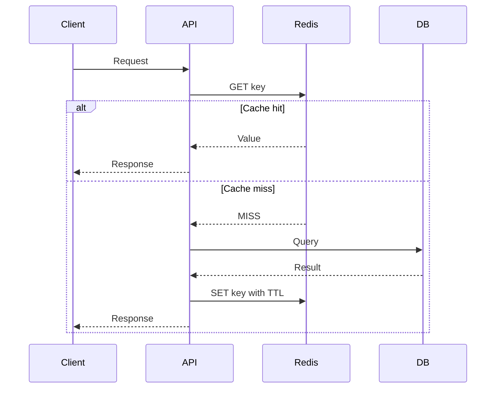
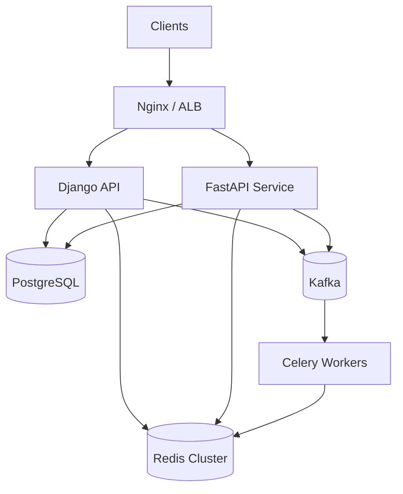

# 06- Redis in System Design

## Overview

Redis is an in-memory data structure server commonly used in system design as a distributed cache, session store, rate limiter, distributed coordination mechanism, temporary state store, and high-throughput data-access layer.

In backend architecture, Redis is valuable because it provides very low-latency access to frequently accessed data while reducing pressure on primary databases such as PostgreSQL or MySQL.

A typical architecture is:

```text
                         ┌──────────────┐
                         │    Client    │
                         └───────┬──────┘
                                 │
                                 v
                         ┌──────────────┐
                         │ Nginx / ALB  │
                         └───────┬──────┘
                                 │
                    ┌────────────┼────────────┐
                    │            │            │
                    v            v            v
               ┌─────────┐ ┌─────────┐ ┌─────────┐
               │ API #1  │ │ API #2  │ │ API #3  │
               └────┬────┘ └────┬────┘ └────┬────┘
                    │           │           │
                    └───────────┼───────────┘
                                │
                                v
                         ┌──────────────┐
                         │    Redis     │
                         │ Shared State │
                         └───────┬──────┘
                                 │
                                 v
                         ┌──────────────┐
                         │ PostgreSQL   │
                         │ Source Truth │
                         └──────────────┘
```

Redis should not automatically be treated as "just a cache." Its data structures and atomic operations make it useful for several distributed-system primitives.

However, Redis also introduces another network dependency, memory constraints, consistency concerns, operational complexity, and potential failure modes. Good system design therefore focuses not only on how Redis is used, but also on what happens when Redis is slow, unavailable, inconsistent, full, or restarted.

## Why Redis Matters in System Design

Traditional database access can become a bottleneck when the same data is requested repeatedly.

Suppose an API receives 20,000 requests per second and every request performs an identical database lookup.

```text
20,000 API requests/sec
          |
          v
20,000 DB queries/sec
          |
          v
Database becomes bottleneck
```

With Redis:

```text
20,000 API requests/sec
          |
          v
       Redis
          |
    ┌─────┴─────┐
    │           │
    v           v
18,000 hits   2,000 misses
                  |
                  v
              PostgreSQL
```

A high cache hit ratio can dramatically reduce database work.

The benefit is not only raw latency. Redis can also reduce:

- Database CPU utilization.
- Database connection usage.
- Query execution.
- Storage I/O.
- Application response time.
- Infrastructure cost.
- Scaling pressure on read replicas.

The architectural objective is generally:

> Keep the authoritative data in a durable system and use Redis to make hot access paths faster or to coordinate distributed application behavior.

## Redis Characteristics

Redis is fundamentally different from a traditional relational database.

| Characteristic | Redis | PostgreSQL |
|---|---|---|
| Primary storage model | In-memory data structures | Durable relational storage |
| Typical latency | Sub-millisecond to low milliseconds | Usually higher |
| Query model | Commands/data structures | SQL |
| Persistence | Optional/configurable | Core capability |
| Transactions | Limited transactional semantics | Full transactional database model |
| Joins | No | Yes |
| Complex queries | Limited | Strong |
| Horizontal scaling | Cluster/sharding | Different scaling mechanisms |
| Typical role | Cache/state/coordination | Source of truth |
| Data model | Key-value + structures | Relational |

Redis can persist data, but persistence does not automatically make it equivalent to PostgreSQL for every workload.

## Core Redis Data Structures

Redis provides several data structures with different system-design applications.

| Data Structure | Typical Use |
|---|---|
| String | Cache values, counters, flags |
| Hash | User/session/object attributes |
| List | Queues, ordered collections |
| Set | Membership, uniqueness |
| Sorted Set | Leaderboards, ranking, scheduling |
| Stream | Event streams and consumer groups |
| Bitmap | Compact boolean state |
| HyperLogLog | Approximate cardinality |
| Geospatial | Location queries |
| Bitfield | Compact integer fields |

Choosing the correct data structure can significantly affect memory usage and operational complexity.

## Strings

Strings are the simplest Redis data type.

```text
SET user:123:name "Aranya"
GET user:123:name
```

They are commonly used for:

- Serialized objects.
- Counters.
- Flags.
- Tokens.
- Cache entries.

Example:

```text
product:v1:123
    ->
{"id":123,"name":"Laptop","price":899.99}
```

A cache value can have an expiration:

```text
SET product:v1:123 "..." EX 300
```

This stores the value for 300 seconds.

## Hashes

Hashes store field-value pairs.

```text
HSET user:123 name "Aranya" role "admin"
HGET user:123 role
```

Conceptually:

```text
user:123
├── name -> Aranya
└── role -> admin
```

Hashes are useful when individual fields need to be accessed or updated without serializing the entire object.

Typical uses include:

- User metadata.
- Session attributes.
- Counters associated with an entity.
- Lightweight object state.

They are not a replacement for relational modeling when relationships and transactional constraints matter.

## Lists

Lists maintain ordered collections.

```text
LPUSH jobs job-100
LPUSH jobs job-101
RPOP jobs
```

They can be used for simple queue-like workloads.

However, for production event processing with stronger delivery semantics, Redis Streams, Kafka, SQS, or another purpose-built messaging technology may be more appropriate.

## Sets

Sets store unique members.

```text
SADD user:123:roles admin
SADD user:123:roles editor
SISMEMBER user:123:roles admin
```

Useful applications include:

- Membership checks.
- Unique collections.
- Tag relationships.
- Feature assignments.

Membership lookup is particularly useful when the application needs to answer:

```text
"Is this user a member of this group?"
```

## Sorted Sets

Sorted sets associate each member with a numeric score.

```text
ZADD leaderboard 950 user:123
ZADD leaderboard 875 user:456
ZREVRANGE leaderboard 0 9 WITHSCORES
```

Useful for:

- Leaderboards.
- Ranking.
- Priority queues.
- Time-based scheduling.
- Top-N queries.

A common design is:

```text
score = timestamp
member = job_id
```

which allows jobs to be ordered by execution time.

## Streams

Redis Streams provide an append-oriented log-like structure with consumer groups.

Conceptually:

```text
Stream
──────────────────────────────────────>
event-1  event-2  event-3  event-4
              |
              v
        Consumer Group
        ┌──────────────┐
        │ Consumer A   │
        │ Consumer B   │
        └──────────────┘
```

Streams are useful for:

- Event processing.
- Background jobs.
- Consumer groups.
- Ordered event sequences.
- Temporary event pipelines.

Kafka is generally a stronger choice when the architecture requires a large durable event log, long retention, high partition scalability, or extensive replay capabilities.

## Redis Command Execution Model

Redis commands are typically processed through a single Redis server event loop for command execution.

This gives Redis an important property:

```text
Command
   |
   v
Redis event loop
   |
   v
Execute command
   |
   v
Response
```

Many individual Redis operations are effectively atomic from the perspective of other Redis commands.

For example:

```text
INCR counter
```

is atomic.

This makes Redis useful for:

- Counters.
- Rate limiting.
- Simple coordination.
- Atomic state transitions.

However, atomic individual commands do not mean an entire multi-step application workflow is automatically atomic.

## Atomicity

Consider:

```text
GET balance
SET balance new_balance
```

Another client can modify the balance between these operations.

For atomic read-modify-write operations, use appropriate Redis mechanisms such as:

- Atomic commands.
- `MULTI` / `EXEC`.
- Lua scripts.
- Redis Functions where appropriate.
- Compare-and-set style patterns.
- Distributed coordination patterns.

Do not assume that:

```text
GET
+
SET
```

is equivalent to one atomic operation.

## Redis Transactions

Redis supports transactions using:

```text
MULTI
EXEC
```

Conceptually:

```text
MULTI
SET key1 value1
SET key2 value2
EXEC
```

The commands are queued and executed as a transaction block.

Redis transactions do not provide the same semantics as a relational database transaction.

In particular, Redis does not provide traditional SQL-style rollback of already executed commands if a later command fails.

Use Redis transactions when atomic command grouping is required, not as a generic replacement for PostgreSQL transactions.

## Lua Scripts and Redis Functions

For more complex atomic operations, server-side execution can be useful.

Example requirement:

```text
Read current value
Check condition
Update value
Return result
```

Doing these operations as separate network calls creates race conditions.

A server-side script can execute the logic atomically from the perspective of other Redis commands.

This is particularly useful for:

- Rate limiters.
- Atomic counters.
- Conditional updates.
- Lock acquisition.
- Inventory-like counters.
- Small coordination algorithms.

Keep scripts small and bounded. Long-running server-side execution can block other Redis work.

## Cache-Aside Pattern

Cache-aside is the most common Redis caching pattern.



Example in Python:

```python
from redis import Redis

redis = Redis.from_url(
    "redis://localhost:6379/0",
    decode_responses=True,
)

CACHE_TTL_SECONDS = 300


def get_product(product_id: int) -> dict:
    key = f"product:v1:{product_id}"

    cached = redis.get(key)

    if cached is not None:
        return deserialize_product(cached)

    product = load_product_from_database(product_id)

    redis.set(
        key,
        serialize_product(product),
        ex=CACHE_TTL_SECONDS,
    )

    return product
```

The database remains authoritative.

## Cache Invalidation

Suppose:

```text
PostgreSQL:
price = 100

Redis:
price = 100
```

An update changes PostgreSQL:

```text
PostgreSQL:
price = 120

Redis:
price = 100
```

The application needs a strategy for removing or refreshing the stale cache.

A common pattern is:

```text
UPDATE PostgreSQL
       |
       v
COMMIT
       |
       v
DELETE Redis key
```

Example:

```python
def update_product(product_id: int, price: float) -> None:
    update_product_in_database(product_id, price)

    redis.delete(f"product:v1:{product_id}")
```

In more complex architectures, an outbox table and Kafka can publish reliable domain events used for cache invalidation.

## TTL Design

TTL determines how long cached data can remain without refresh.

Examples:

```text
Product catalog        -> 5 minutes
Feature configuration  -> 30 seconds
User permissions       -> 1 minute
Exchange rates         -> 10 seconds
Static metadata        -> 1 hour
```

There is no universal TTL.

The correct TTL depends on:

- Data volatility.
- Business tolerance for staleness.
- Cache memory.
- Database load.
- Rebuild cost.
- Request frequency.

A TTL that is too short reduces cache effectiveness.

A TTL that is too long increases stale-data exposure.

## Cache Stampede

A popular key expires:

```text
product:123
    |
    v
TTL expires
    |
    v
10,000 requests miss simultaneously
    |
    v
10,000 database queries
```

This is a cache stampede.

Mitigations include:

- Distributed locks.
- Request coalescing.
- Stale-while-revalidate.
- Refresh-ahead.
- TTL jitter.
- Local L1 caching.

TTL jitter can prevent large groups of keys from expiring at exactly the same time.

For example, instead of:

```text
TTL = 300 seconds
```

use a bounded range such as:

```text
TTL = 270–330 seconds
```

when appropriate.

## Cache Penetration

Cache penetration occurs when requests repeatedly target nonexistent records.

```text
GET user:999999
GET user:999998
GET user:999997
...
```

Every request can hit PostgreSQL.

Possible mitigations:

- Negative caching.
- Bloom filters.
- Request validation.
- Rate limiting.

Example:

```text
user:999999 -> NOT_FOUND
TTL = 30 seconds
```

## Hot Keys

A hot key receives a disproportionate amount of traffic.

Example:

```text
product:popular-iphone
```

receives millions of requests per minute while most keys receive only a few.

A single Redis key can become a bottleneck.

Possible mitigations include:

- Local application caching.
- Replicated reads where appropriate.
- Key replication strategies.
- Request coalescing.
- CDN caching for public content.
- Redesigning the data access pattern.

Do not solve every hot-key problem by blindly adding Redis nodes. If every request targets the same logical key, sharding the rest of the dataset may not solve the concentrated workload.

## Cache Eviction

Redis can evict keys when configured memory limits are reached.

Common policies include:

| Policy | Behavior |
|---|---|
| `noeviction` | Return errors when memory limit is reached |
| `allkeys-lru` | Evict least recently used keys |
| `allkeys-lfu` | Evict least frequently used keys |
| `volatile-lru` | Evict LRU keys with TTL |
| `volatile-lfu` | Evict LFU keys with TTL |
| `volatile-ttl` | Prefer keys with shorter remaining TTL |

For a pure cache workload, an `allkeys-*` policy is often more appropriate than policies that only evict keys with expiration metadata.

The correct policy depends on what Redis stores.

Do not mix critical non-cache state and disposable cache data without understanding the consequences of eviction.

## Memory Management

Redis is memory-oriented, so memory sizing is a first-class design concern.

Raw payload size is not the same as actual Redis memory usage.

Memory is consumed by:

- Keys.
- Values.
- Data structures.
- Allocator overhead.
- Replication buffers.
- Client buffers.
- Internal metadata.

For example:

```text
1 million keys
×
100 bytes average payload
```

does not mean Redis needs exactly:

```text
100 MB
```

Actual memory usage can be significantly higher.

Monitor memory utilization and fragmentation rather than estimating solely from serialized payload size.

## Distributed Locking

Redis can be used for distributed coordination.

A simplified lock acquisition uses:

```text
SET lock:order:123 token NX EX 30
```

The important properties are:

- `NX`: only set if the key does not already exist.
- `EX`: automatically expire the lock.

Example:

```python
token = generate_unique_token()

acquired = redis.set(
    "lock:order:123",
    token,
    nx=True,
    ex=30,
)

if acquired:
    try:
        process_order()
    finally:
        release_lock_safely("lock:order:123", token)
```

The lock value should identify its owner.

Never blindly execute:

```text
DEL lock:order:123
```

because the original lock may have expired and been acquired by another process.

The release operation should verify ownership atomically.

Distributed locking is subtle. If correctness depends critically on lock semantics, carefully evaluate the failure model and consider whether a database constraint, queue, workflow engine, or another coordination mechanism provides a stronger design.

## Rate Limiting

Redis is particularly useful for distributed rate limiting.

Without Redis:

```text
API #1 -> local counter
API #2 -> local counter
API #3 -> local counter
```

Each application instance has incomplete information.

With Redis:

```text
API #1 ─┐
API #2 ─┼──> Redis counter
API #3 ─┘
```

A simple fixed-window model:

```text
rate:user:123:2026-08-23T19:00
```

with an atomic increment and expiration.

For more sophisticated limits, use:

- Sliding window.
- Token bucket.
- Leaky bucket.
- Lua-based atomic implementations.

Redis makes distributed rate limiting possible, but the algorithm must be selected based on traffic and fairness requirements.

## Sessions

Redis can store server-side sessions.

```text
Client
   |
   | session cookie
   v
API
   |
   v
Redis
   |
   v
Session state
```

The cookie might contain:

```text
session_id=8f31...
```

while Redis stores:

```text
session:8f31...
```

This is useful when multiple application instances need shared session state.

Security requirements include:

- Secure cookies.
- `HttpOnly`.
- Appropriate `SameSite`.
- Session expiration.
- Session rotation.
- Access control.
- TLS between services.

## Redis with Django

Django can use Redis as a cache backend.

```python
CACHES = {
    "default": {
        "BACKEND": "django.core.cache.backends.redis.RedisCache",
        "LOCATION": "redis://redis:6379/1",
        "TIMEOUT": 300,
    }
}
```

Application code:

```python
from django.core.cache import cache


def get_product(product_id: int):
    key = f"catalog:product:v1:{product_id}"

    product = cache.get(key)

    if product is not None:
        return product

    product = load_product_from_database()

    cache.set(key, product, timeout=300)

    return product
```

For production, configure:

- Connection pooling.
- Timeouts.
- Authentication.
- TLS where required.
- Appropriate Redis topology.
- Health monitoring.
- Failure handling.

## Redis with FastAPI

FastAPI applications can use an asynchronous Redis client.

```python
from redis.asyncio import Redis

redis = Redis.from_url(
    "redis://redis:6379/0",
    decode_responses=True,
)


async def get_product(product_id: int):
    key = f"catalog:product:v1:{product_id}"

    cached = await redis.get(key)

    if cached is not None:
        return deserialize_product(cached)

    product = await load_product_from_database()

    await redis.set(
        key,
        serialize_product(product),
        ex=300,
    )

    return product
```

The Redis client should normally be initialized once per application process and reused through its connection pool rather than recreated for every request.

## Redis and Celery

Redis can act as:

- Celery broker.
- Celery result backend.
- Application cache.

However, these workloads should not automatically share the same Redis instance or memory budget.

Consider:

```text
                    Redis Infrastructure
                           |
              ┌────────────┼────────────┐
              v            v            v
           Cache        Celery        Sessions
```

If cache eviction or memory pressure affects Celery's messaging workload, the application can experience failures unrelated to caching.

Production systems should consider separate Redis instances/clusters or carefully isolated capacity and policies.

## Redis and Kafka

Redis and Kafka solve different problems.

| Requirement | Redis | Kafka |
|---|---|---|
| Low-latency cache | Excellent | Poor fit |
| Simple counters | Excellent | Poor fit |
| Distributed rate limiting | Excellent | Poor fit |
| Temporary state | Excellent | Possible but inefficient |
| Durable event log | Limited | Excellent |
| Long event retention | Limited | Excellent |
| Event replay | Limited | Excellent |
| Consumer groups | Streams support them | Core capability |
| Massive event pipelines | Not primary purpose | Excellent |

A common architecture is:

```text
                 ┌─────────────┐
                 │ PostgreSQL  │
                 └──────┬──────┘
                        │
             ┌──────────┴──────────┐
             v                     v
          Redis                   Kafka
       Fast state             Event stream
```

Redis accelerates access and coordinates state.

Kafka transports durable asynchronous events.

They are complementary rather than interchangeable.

## Redis Cluster

Redis Cluster partitions data across nodes using hash slots.

Conceptually:

```text
                 Redis Cluster
        ┌───────────┼───────────┐
        v           v           v
   Node A       Node B       Node C
 slots 0-5k   slots 5k-10k slots 10k-16k
```

A Redis Cluster client determines which node owns a key's hash slot.

This provides horizontal data partitioning.

### Advantages

- Larger aggregate memory capacity.
- Horizontal scaling.
- Distributed keyspace.
- Better throughput for partitionable workloads.

### Limitations

- More operational complexity.
- Multi-key operations can have restrictions.
- Keys involved in certain atomic operations may need to share a hash slot.
- Resharding requires careful operational planning.
- Client libraries must understand cluster redirections.

## Hash Tags

Redis Cluster supports hash tags to intentionally place related keys in the same slot.

Example:

```text
order:{123}:items
order:{123}:metadata
order:{123}:status
```

The `{123}` portion can be used to ensure related keys map to the same hash slot.

This is useful when an atomic operation needs multiple related keys.

However, overusing a single hash tag can create a hot slot.

## High Availability

A production Redis deployment should be designed around its failure model.

Possible architecture:

```text
                 Application
                      |
                      v
              Redis Primary
               /          \
              /            \
             v              v
        Replica AZ-1   Replica AZ-2
```

Depending on the deployment, automatic failover can promote a replica when the primary fails.

Important considerations include:

- Multi-AZ placement.
- Replication.
- Automatic failover.
- Client reconnect behavior.
- DNS/service discovery.
- Connection pooling.
- Timeout configuration.
- Failover testing.

High availability at the Redis layer does not automatically mean the application is highly available.

The application must also handle:

```text
Connection reset
Timeout
Failover
Cold cache
Temporary unavailability
Stale data
```

## Redis Persistence

Redis supports persistence mechanisms such as:

- RDB snapshots.
- AOF.
- Configurations combining persistence approaches.

For a disposable cache, persistence may not be necessary.

For state that must survive restart, persistence requirements become more important.

The key design question is:

> Can this data be reconstructed from another source?

If yes, Redis can often be treated as a disposable cache.

If no, Redis needs a much stronger durability and disaster-recovery design.

## Disaster Recovery

For a cache:

```text
Redis lost
   |
   v
Application reads PostgreSQL
   |
   v
Redis repopulates
```

This is often the simplest recovery model.

For non-cache Redis data, recovery may require:

- Persistence.
- Replication.
- Backups.
- Restore testing.
- RPO/RTO definitions.
- Cross-region strategy.

Do not design disaster recovery around assumptions that have never been tested.

## Redis Failure Handling

Cache reads should usually have bounded timeouts.

```text
API request
    |
    v
Redis GET
    |
    +----> success -> use cache
    |
    +----> timeout -> fallback
```

A dangerous design is:

```text
Redis timeout
    |
    v
retry
    |
    v
retry
    |
    v
retry
    |
    v
API timeout
```

Under heavy traffic, retries can amplify the outage.

Prefer:

- Tight Redis timeouts.
- Limited retries.
- Exponential backoff when retries are justified.
- Jitter.
- Circuit breakers.
- Database concurrency protection.

## Cache Failure and Database Protection

Suppose:

```text
Normal:
1,000 requests/sec
900 cache hits
100 DB queries
```

Redis fails:

```text
1,000 requests/sec
0 cache hits
1,000 DB queries
```

The database has suddenly received approximately 10× the previous cache-miss load.

A robust architecture should include:

```text
Redis
  |
  | failure
  v
Circuit Breaker
  |
  v
Concurrency Limiter
  |
  v
PostgreSQL
```

The objective is graceful degradation rather than allowing a cache outage to cascade into a database outage.

## Cache Warming

After a restart or deployment, the cache may be empty.

```text
Redis restart
    |
    v
Empty cache
    |
    v
Many misses
    |
    v
Database load spike
```

This is known as a cold-cache problem.

Potential approaches include:

- Prewarming popular keys.
- Background warming.
- Gradual traffic ramp-up.
- Stale-cache preservation where supported.
- Controlled cache regeneration.

Do not blindly preload millions of records if most will never be requested.

Warm based on actual traffic patterns.

## Cache Key Design

A good Redis key should be:

- Deterministic.
- Namespaced.
- Versioned where necessary.
- Unambiguous.
- Easy to inspect.
- Free from unnecessary sensitive information.

Good:

```text
catalog:product:v1:123
user:profile:v2:456
permissions:v1:user:456
```

Bad:

```text
123
data
user
```

Versioning allows application deployments to change cache schemas safely.

## Serialization

Redis stores data independently of the application's Python object memory.

Common formats include:

- JSON.
- MessagePack.
- Protocol Buffers.
- Redis-native structures.

JSON:

```json
{
  "id": 123,
  "name": "Laptop",
  "price": 899.99
}
```

is portable and easy to inspect.

For high-performance internal systems, binary serialization may reduce payload size and CPU overhead.

Avoid unsafe deserialization mechanisms for data that could be influenced by untrusted actors.

## Connection Pooling

Redis connections are network resources.

Avoid:

```text
Request
  |
  +--> Create TCP connection
  +--> Execute command
  +--> Close connection
```

for every request.

Prefer:

```text
Application Worker
       |
       v
Connection Pool
   ├── Connection 1
   ├── Connection 2
   ├── Connection 3
   └── Connection N
       |
       v
     Redis
```

Pool sizing should be based on:

- Worker count.
- Concurrency.
- Redis command latency.
- Maximum Redis connections.
- Traffic patterns.

Too small a pool causes application-side waiting.

Too large a pool can exhaust Redis connections.

## Monitoring Redis

Redis should be monitored as a production dependency.

### Infrastructure Metrics

Monitor:

- Memory utilization.
- CPU utilization.
- Network throughput.
- Connected clients.
- Commands per second.
- Evictions.
- Expirations.
- Replication health.
- Replication lag where applicable.
- Keyspace statistics.
- Fragmentation.
- Blocked clients.
- Connection errors.

### Application Metrics

Monitor:

- Cache hit ratio.
- Cache miss ratio.
- Redis latency.
- Redis timeout rate.
- Redis error rate.
- Cache bypass rate.
- Cache regeneration rate.
- Hot-key frequency.
- Serialization latency.
- Database load during cache misses.

A cache hit ratio alone is insufficient.

For example:

```text
Hit ratio = 99%
Redis latency = 100 ms
```

may be much worse than:

```text
Hit ratio = 95%
Redis latency = 1 ms
```

depending on the workload.

## Security

Redis should be treated as an internal production service, not an openly accessible network endpoint.

Recommended controls include:

- Private networking.
- Security groups/firewalls.
- Authentication.
- TLS where appropriate.
- Secret management.
- Least-privilege access.
- Encryption at rest when required.
- Network segmentation.
- No public exposure unless explicitly justified and secured.

Sensitive data may include:

- Sessions.
- Tokens.
- Personal information.
- Authorization state.
- Internal application configuration.

Use appropriate TTLs and access controls for sensitive values.

Avoid putting sensitive information directly into keys because keys may appear in logs and operational tooling.

## Cost Considerations

Redis is memory-oriented infrastructure, which can make memory capacity the dominant cost.

Cost is influenced by:

- Dataset size.
- Replica count.
- Availability requirements.
- Node size.
- Network traffic.
- Persistence.
- Multi-AZ deployment.
- Operational monitoring.

A cache should reduce overall system cost or materially improve performance/reliability.

Do not retain every database row in Redis simply because memory is fast.

## Common Redis Architecture Patterns

| Pattern | Redis Role | Typical Example |
|---|---|---|
| Cache-aside | Read cache | Product API |
| Session store | Shared state | Authentication sessions |
| Rate limiter | Atomic counters | API throttling |
| Distributed lock | Coordination | Scheduled job ownership |
| Leaderboard | Sorted set | Gaming ranking |
| Membership store | Set | User groups |
| Temporary queue | List/Stream | Background work |
| Event stream | Stream | Lightweight event processing |
| Pub/Sub | Ephemeral messaging | Notifications |
| Token bucket | Atomic state | API rate limiting |

## Production Architecture Example

A Django/FastAPI microservice architecture might look like:



Redis provides low-latency shared state.

PostgreSQL remains the durable source of truth.

Kafka handles durable asynchronous events.

Celery workers process background jobs.

This separation prevents Redis from becoming responsible for every type of distributed-system workload.

## Redis vs Database vs Message Broker

| Requirement | Redis | PostgreSQL | Kafka |
|---|---|---|---|
| Fast key lookup | Excellent | Good | Poor |
| Durable relational data | Poor fit | Excellent | Poor fit |
| Complex queries | Poor | Excellent | Poor |
| Cache | Excellent | Possible but inefficient | Poor |
| Counters | Excellent | Good | Poor |
| Rate limiting | Excellent | Possible | Poor |
| Durable event stream | Limited | Poor | Excellent |
| Long-term event replay | Limited | Possible but inefficient | Excellent |
| Distributed coordination | Good | Good for some cases | Different model |
| Transactions | Limited | Strong | Different semantics |

The right technology depends on the responsibility being designed.

## Common Mistakes and Pitfalls

### Using Redis as a Database by Default

Redis persistence does not automatically mean Redis should replace PostgreSQL.

Choose the datastore based on:

- Durability.
- Query requirements.
- Consistency.
- Data relationships.
- Recovery requirements.
- Scale.

### No Failure Strategy

Do not assume Redis will always be available.

Define:

```text
What happens if Redis is unavailable?
```

before deploying it.

### Unlimited Retries

Retry storms can amplify Redis outages.

### No TTL

Without TTLs, stale data can remain indefinitely and memory consumption can grow.

### Caching Huge Objects

Large objects increase:

- Memory usage.
- Network transfer.
- Serialization overhead.
- Eviction pressure.

### Ignoring Hot Keys

A single heavily accessed key can become a bottleneck even when overall Redis utilization looks healthy.

### Mixing Workloads Without Capacity Planning

Using one Redis cluster simultaneously for:

```text
Cache
+
Celery broker
+
Sessions
+
Locks
```

can create unpredictable failure interactions.

### Treating Cache Hit Ratio as the Only Metric

Always correlate cache metrics with:

- Latency.
- Database load.
- Redis memory.
- Evictions.
- Error rate.
- Request throughput.

### Blindly Using Distributed Locks

Locks can introduce:

- Deadlocks.
- Expiration races.
- Ownership problems.
- Availability issues.

Use the simplest coordination mechanism that provides the required correctness.

## Interview Traps

| Question | Strong Answer |
|---|---|
| Why Redis instead of PostgreSQL for frequently read data? | Redis provides much lower-latency access and can reduce repeated database work, while PostgreSQL remains authoritative. |
| Is Redis always a cache? | No. It can also provide counters, sets, sorted sets, streams, sessions, rate limiting, and coordination primitives. |
| What happens when Redis fails? | For disposable cache data, the application can often fall back to the source of truth, but downstream overload protection is required. |
| How do you prevent cache stampedes? | Locking, request coalescing, stale-while-revalidate, refresh-ahead, and TTL jitter. |
| Why use TTL? | To bound stale-data lifetime and control memory growth. |
| What is a hot key? | A key receiving disproportionate traffic that can become a node or CPU bottleneck. |
| How does Redis Cluster scale? | It partitions keys across hash slots distributed among cluster nodes. |
| Why use hash tags? | To deliberately place related keys in the same Redis Cluster hash slot when multi-key atomic operations require co-location. |
| Can Redis transactions roll back like PostgreSQL? | No. Redis transactions provide command grouping and atomic execution semantics, but not traditional relational rollback semantics. |
| Why is `GET` followed by `SET` unsafe for concurrent updates? | Another client can modify the key between the two operations; atomic commands or server-side logic may be required. |
| Redis or Kafka for events? | Redis can handle lightweight streams, but Kafka is generally better for durable, replayable, high-throughput event streams. |
| How do you protect PostgreSQL during Redis failure? | Use bounded timeouts, circuit breakers, concurrency limits, rate limiting, stale data where appropriate, and controlled fallback. |

## Key Takeaways

- **Redis is a low-latency distributed data layer, not merely a cache; its strings, hashes, sets, sorted sets, and streams support several system-design patterns.**
- **Use Redis to accelerate or coordinate workloads while keeping durable business data in an appropriate source of truth unless Redis is intentionally designed as the authoritative datastore.**
- **Production Redis architecture requires careful design of TTLs, eviction, key distribution, hot keys, connection pools, timeouts, failure handling, and high availability.**
- **Redis and Kafka solve different problems: Redis is optimized for fast state access and coordination, while Kafka is designed for durable, replayable event streaming.**
- **The strongest Redis designs account for failure first: cache loss, node failure, network partitions, cold caches, retry storms, and downstream database overload must all have explicit handling strategies.**