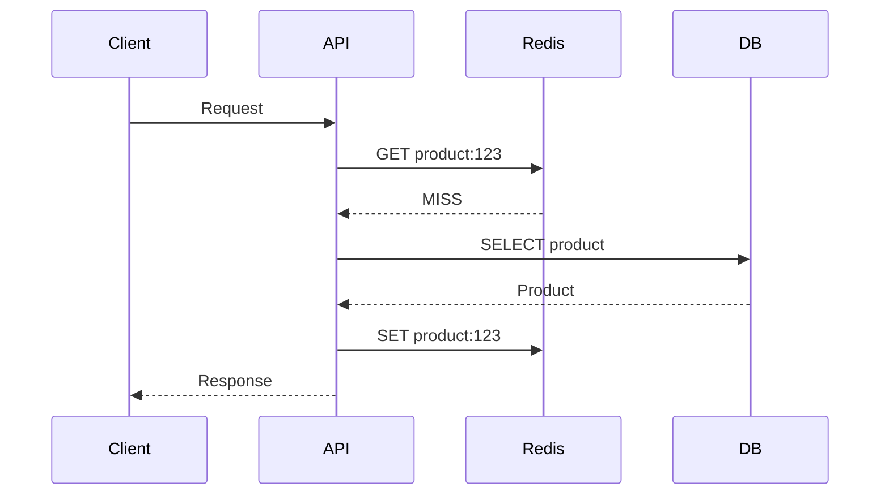
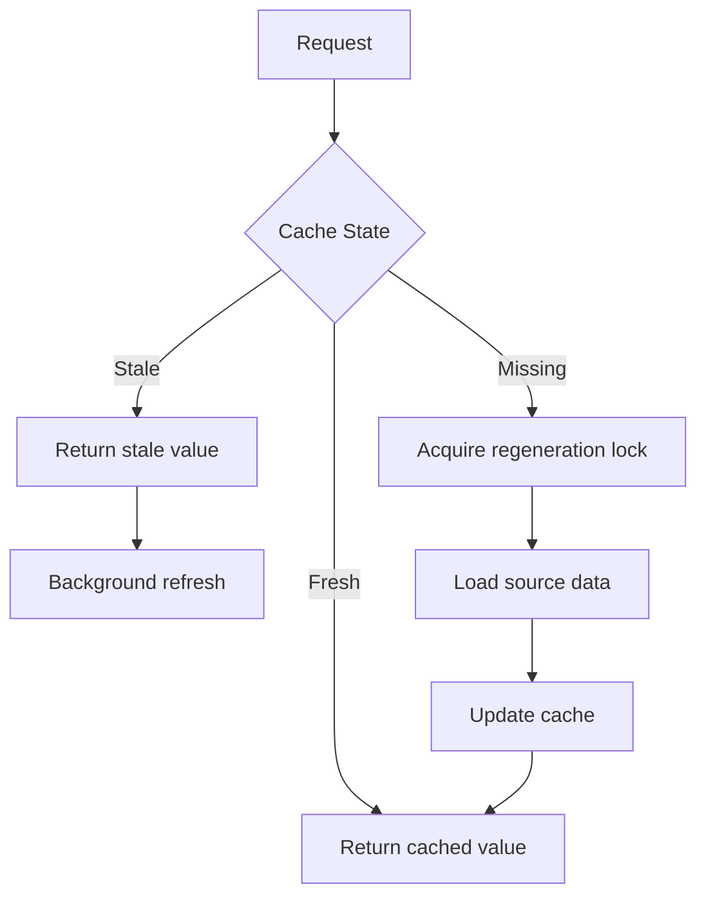
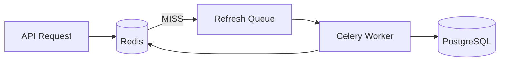

# 07- Cache Stampede

## Overview

A cache stampede occurs when a large number of requests simultaneously discover that the same cached data is unavailable and independently attempt to regenerate it.

The common sequence is:

```text
                    Cache Entry Expires
                            |
                            v
                    ┌───────────────┐
                    │ Redis: MISS   │
                    └───────┬───────┘
                            |
              ┌─────────────┼─────────────┐
              │             │             │
              v             v             v
           Request 1     Request 2     Request N
              │             │             │
              └─────────────┼─────────────┘
                            |
                            v
                    PostgreSQL / API
                            |
                            v
                 Massive concurrent load
```

A cache stampede is dangerous because the cache is normally protecting the underlying dependency. When many requests miss simultaneously, that protection disappears precisely when traffic is highest.

For a backend system, cache-stampede prevention is therefore not simply a Redis configuration concern. It is a concurrency, load-management, consistency, and resilience problem.

## Why Cache Stampede Matters

Consider an API serving a popular product.

Under normal conditions:

```text
10,000 requests/sec
        |
        v
Redis
        |
   9,950 hits
        |
     50 misses
        |
        v
PostgreSQL
```

Suppose the cached product expires.

Without protection:

```text
10,000 requests/sec
        |
        v
Redis MISS
        |
        v
10,000 database queries
        |
        v
PostgreSQL overload
```

The database may experience:

- CPU saturation.
- Connection-pool exhaustion.
- Increased query latency.
- Lock contention.
- Increased I/O.
- Request timeouts.
- Cascading failures.

The resulting failures can cause retries from clients and upstream services, increasing the load further.

```text
Cache expiration
      |
      v
Cache misses
      |
      v
Database overload
      |
      v
Higher latency
      |
      v
Request timeouts
      |
      v
Client retries
      |
      v
More database load
      |
      v
Cascading failure
```

The important system-design principle is:

> A cache must protect the source of truth even when the cache itself is cold, unavailable, or being regenerated.

## Cache Miss vs Cache Stampede

A cache miss is normal.

A cache stampede is a concurrency problem caused by many requests responding to the same miss simultaneously.

| Situation | Description | Risk |
|---|---|---|
| Cache hit | Data returned from cache | Low |
| Single cache miss | One request loads source data | Low |
| Multiple unrelated misses | Different keys miss | Usually manageable |
| Popular key expiration | One hot key expires | Potentially high |
| Simultaneous regeneration | Many workers rebuild one key | High |
| Redis outage | Large portion of cache unavailable | Very high |

A single miss does not require stampede protection.

A hot key with expensive regeneration usually does.

## How a Cache Stampede Happens

The typical cache-aside flow is:



Now assume 5,000 requests arrive concurrently.

```text
Request 1  -> Redis MISS -> DB
Request 2  -> Redis MISS -> DB
Request 3  -> Redis MISS -> DB
...
Request 5000 -> Redis MISS -> DB
```

The problem is that all requests observe the same missing state before any one request has finished regenerating the cache.

## The Dogpile Effect

The term **dogpile effect** is commonly used for the same class of behavior.

The pattern is:

```text
Many consumers
      |
      v
Same expired resource
      |
      v
Simultaneous regeneration
      |
      v
Dependency overload
```

The terms cache stampede, cache avalanche, and dogpile effect are sometimes used interchangeably, but they describe different failure patterns.

| Term | Typical Meaning |
|---|---|
| Cache stampede | Many requests regenerate the same missing key |
| Dogpile effect | Requests pile onto an expensive regeneration operation |
| Cache avalanche | Many cached entries expire or become unavailable together |
| Cache penetration | Requests repeatedly query nonexistent data |

The distinction matters because the mitigation differs.

## Cache Stampede vs Cache Avalanche

A stampede usually focuses on a specific hot key or a small set of keys.

A cache avalanche can affect a large portion of the cache.

For example:

```text
Redis
├── product:1      expires at 12:00:00
├── product:2      expires at 12:00:00
├── product:3      expires at 12:00:00
├── product:4      expires at 12:00:00
└── product:N      expires at 12:00:00
```

If millions of keys receive the same TTL at the same time:

```text
12:00:00
   |
   v
Millions of expirations
   |
   v
Millions of misses
   |
   v
Database overload
```

This is why TTL jitter is useful.

## Core Mitigation Strategies

Common approaches include:

| Strategy | Primary Purpose |
|---|---|
| Distributed lock | Allow one request to regenerate |
| Request coalescing | Collapse concurrent requests |
| TTL jitter | Avoid synchronized expiration |
| Stale-while-revalidate | Serve stale data while refreshing |
| Refresh-ahead | Refresh before expiration |
| Local L1 cache | Reduce pressure on Redis |
| Negative caching | Prevent repeated misses for absent data |
| Concurrency limiting | Protect the source of truth |
| Circuit breaker | Prevent cascading failures |

Production systems often combine several of these.

## Distributed Lock

The simplest widely applicable mitigation is to allow only one process to regenerate a particular cache key.

```text
                Redis MISS
                    |
                    v
              Acquire lock
               /        \
            success     failure
              |           |
              v           v
        Query database   Wait/retry
              |
              v
          SET cache
              |
              v
        Release lock
```

The lock key should be derived from the cached resource:

```text
lock:product:123
```

A lock can be acquired using an atomic Redis operation:

```text
SET lock:product:123 unique-token NX EX 10
```

Where:

- `NX` means set only if the key does not already exist.
- `EX 10` gives the lock a bounded lifetime.
- `unique-token` identifies the lock owner.

The expiration is essential because a crashed worker must not permanently block regeneration.

## Lock Ownership

A common mistake is:

```text
SET lock:product:123 worker-A NX EX 10

...

DEL lock:product:123
```

This can be unsafe.

Consider:

```text
Worker A acquires lock
        |
        v
Lock expires
        |
        v
Worker B acquires lock
        |
        v
Worker A executes DEL
        |
        v
Worker B's lock is deleted
```

The release operation should verify that the caller still owns the lock.

A Lua script can perform the check-and-delete atomically:

```lua
if redis.call("GET", KEYS[1]) == ARGV[1] then
    return redis.call("DEL", KEYS[1])
end

return 0
```

This pattern prevents one worker from deleting another worker's lock.

## Locking Example in Python

A simplified implementation:

```python
import uuid
from redis import Redis


LOCK_TTL_SECONDS = 10


def acquire_lock(redis: Redis, key: str) -> str | None:
    token = str(uuid.uuid4())

    acquired = redis.set(
        key,
        token,
        nx=True,
        ex=LOCK_TTL_SECONDS,
    )

    return token if acquired else None
```

The regeneration path can then be structured as:

```python
def get_product(redis: Redis, product_id: int):
    cache_key = f"product:v1:{product_id}"
    lock_key = f"lock:{cache_key}"

    cached = redis.get(cache_key)

    if cached is not None:
        return deserialize(cached)

    token = acquire_lock(redis, lock_key)

    if token is not None:
        try:
            cached = redis.get(cache_key)

            if cached is not None:
                return deserialize(cached)

            product = load_product_from_database(product_id)

            redis.set(
                cache_key,
                serialize(product),
                ex=300,
            )

            return product
        finally:
            release_lock(redis, lock_key, token)

    return wait_for_cache_or_fallback(redis, cache_key, product_id)
```

The second cache lookup after acquiring the lock is important.

Without it:

```text
Worker A gets lock
Worker B waits
Worker A populates cache
Worker B eventually gets lock
Worker B queries database again
```

With the second lookup:

```text
Worker A
  |
  +--> DB
  |
  +--> SET cache
       |
       v
Worker B
  |
  +--> GET cache
       |
       v
     HIT
```

This is commonly called **double-checked locking**.

## Request Coalescing

Request coalescing means concurrent requests for the same resource share one regeneration operation.

Instead of:

```text
Request A ──> DB
Request B ──> DB
Request C ──> DB
Request D ──> DB
```

the application performs:

```text
Request A ──┐
Request B ──┤
Request C ──┼──> Single regeneration
Request D ──┘
```

This can be implemented:

- Inside one application process.
- Across multiple processes.
- Across multiple hosts using Redis.
- Through a dedicated single-flight mechanism.

A process-local mechanism is fast but only protects requests handled by that process.

A distributed mechanism is more comprehensive but introduces network coordination.

## Local Single-Flight

For a single application instance:

```text
Process
├── Request A ─┐
├── Request B ─┼──> Shared future/promise
├── Request C ─┘
│
└── One database query
```

This avoids unnecessary Redis lock traffic and is useful when a single worker receives a burst of identical requests.

However, in Kubernetes:

```text
Pod A
Pod B
Pod C
Pod D
```

each pod has its own memory.

A local lock in Pod A does not prevent Pod B from regenerating the same key.

For distributed protection, coordination must happen across instances.

## TTL Jitter

Synchronized TTLs are a common cause of cache avalanches.

Instead of:

```text
SET key EX 300
```

for millions of keys, introduce controlled randomness.

```python
import random


def cache_ttl(base_seconds: int) -> int:
    jitter = random.randint(-30, 30)
    return max(1, base_seconds + jitter)
```

Then:

```python
redis.set(
    cache_key,
    serialize(product),
    ex=cache_ttl(300),
)
```

Instead of:

```text
All keys expire at:
12:05:00
```

expiration becomes distributed:

```text
12:04:31
12:04:44
12:05:07
12:05:21
12:05:29
```

TTL jitter reduces synchronized regeneration.

It does not prevent a stampede when one extremely hot key expires.

## Stale-While-Revalidate

Instead of treating expiration as a binary state:

```text
Fresh -> Expired
```

use multiple states:

```text
Fresh
  |
  v
Stale but usable
  |
  v
Regeneration
```

A request can receive slightly stale data while one worker refreshes the cache.



This is particularly useful for data where a small amount of staleness is acceptable.

Examples:

- Product catalogs.
- Public profiles.
- Configuration metadata.
- Search results.
- Analytics dashboards.

It is generally inappropriate when stale data could violate business correctness.

## Refresh-Ahead

Refresh-ahead proactively regenerates a cache entry before it expires.

Example:

```text
TTL = 10 minutes

At 8 minutes:
    Refresh asynchronously

At 10 minutes:
    Existing value is still available
```

The lifecycle becomes:

```text
Populate
   |
   v
Fresh
   |
   v
Near expiration
   |
   +----> Background refresh
   |
   v
Fresh again
```

Refresh-ahead works particularly well for:

- Predictably hot keys.
- Expensive database queries.
- Data with known access patterns.
- Frequently requested configuration.

The trade-off is additional background work even if traffic drops.

## Probabilistic Early Refresh

A more advanced strategy is to refresh entries probabilistically as they approach expiration.

Instead of:

```text
TTL == 0
    |
    v
Refresh
```

requests approaching expiration have an increasing probability of triggering refresh.

This spreads regeneration work over time.

It can be useful for very high-throughput systems where deterministic expiration causes synchronized load.

## Background Refresh

A background worker can refresh hot data independently of request handling.

```text
                  ┌───────────────┐
                  │ Redis Cache   │
                  └───────┬───────┘
                          |
                    Near expiry
                          |
                          v
                   Refresh Queue
                          |
                          v
                   Celery Worker
                          |
                          v
                    PostgreSQL
                          |
                          v
                       Redis
```

With Celery:

```python
from celery import shared_task


@shared_task
def refresh_product(product_id: int) -> None:
    product = load_product_from_database(product_id)

    redis.set(
        f"product:v1:{product_id}",
        serialize(product),
        ex=300,
    )
```

The request path can trigger the task instead of synchronously querying PostgreSQL.

This prevents expensive regeneration from consuming request-worker capacity.

## Preventing the Thundering Herd

A thundering herd occurs when many consumers simultaneously perform work after the same event.

For caching:

```text
Expiration
    |
    v
Thousands of requests
    |
    v
Thousands of regeneration attempts
```

The general solution is to establish a single regeneration owner.

```text
                  Cache MISS
                      |
                      v
              ┌──────────────┐
              │ Coordination │
              └──────┬───────┘
                     |
           ┌─────────┴─────────┐
           v                   v
       One worker          Other workers
           |                   |
           v                   v
      Regenerate          Wait / stale /
           |              fallback
           v
       Update cache
```

## Concurrency Limits

Stampede prevention should not rely entirely on Redis.

The database itself should be protected.

Suppose:

```text
Redis MISS
    |
    v
1,000 requests
    |
    v
1,000 DB queries
```

Even if the cache layer cannot prevent every miss, a concurrency limiter can cap database work.

```text
1,000 cache misses
       |
       v
Concurrency limiter
       |
       v
50 active DB queries
       |
       v
Remaining requests wait
```

This protects the database from sudden concurrency spikes.

Application-level controls can include:

- Semaphores.
- Connection-pool limits.
- Bulkheads.
- Queueing.
- Rate limiting.
- Circuit breakers.

## Database Connection Pool Protection

A cache stampede can exhaust the database connection pool.

For example:

```text
Django workers
      |
      v
Database connection pool
      |
      +--> 20 connections
```

If thousands of requests simultaneously attempt cache regeneration, they compete for those connections.

This increases:

- Queueing latency.
- Transaction duration.
- Connection wait time.
- Timeout frequency.

A healthy system should explicitly define maximum database concurrency.

## Circuit Breakers

If the source of truth is already unhealthy, continuing cache regeneration can make the problem worse.

A circuit breaker can stop repeated database calls:

```text
Cache MISS
    |
    v
Circuit Breaker
    |
    +---- CLOSED ----> DB
    |
    +---- OPEN ------> fallback
```

When the database becomes unhealthy:

```text
DB failures
    |
    v
Circuit opens
    |
    v
No new regeneration requests
```

Possible fallbacks include:

- Stale cached data.
- Static defaults.
- Graceful error responses.
- Asynchronous regeneration.
- Retry after a controlled interval.

## Stale Data as a Resilience Mechanism

For some workloads, serving stale data is preferable to failing.

A useful model is:

```text
Fresh TTL: 300 seconds
Stale grace period: 60 seconds
```

The cache entry can logically have:

```text
0–300 sec   -> Fresh
300–360 sec -> Stale but usable
>360 sec    -> Unavailable
```

During the stale window:

```text
Request
  |
  v
Stale cache
  |
  +--> Return stale value
  |
  +--> Trigger refresh
```

This is a powerful resilience mechanism, but it must be explicitly accepted by the business domain.

## Cache Stampede with Django

A Django application using cache-aside should not allow every request to regenerate an expired hot key.

A simplified pattern:

```python
import time
import uuid

from django.core.cache import cache


def get_product(product_id: int):
    cache_key = f"product:v1:{product_id}"
    lock_key = f"lock:{cache_key}"

    cached = cache.get(cache_key)

    if cached is not None:
        return cached

    token = str(uuid.uuid4())

    acquired = cache.add(
        lock_key,
        token,
        timeout=10,
    )

    if acquired:
        try:
            cached = cache.get(cache_key)

            if cached is not None:
                return cached

            product = load_product_from_database()

            cache.set(
                cache_key,
                product,
                timeout=300,
            )

            return product
        finally:
            release_lock(lock_key, token)

    deadline = time.monotonic() + 0.2

    while time.monotonic() < deadline:
        cached = cache.get(cache_key)

        if cached is not None:
            return cached

        time.sleep(0.01)

    return load_product_from_database()
```

For production code, lock release should be implemented atomically and the fallback should have explicit database concurrency protection.

Do not blindly copy this polling strategy for high-throughput workloads. Waiting workers can themselves consume significant application resources.

## Cache Stampede with FastAPI

An asynchronous application can use an async coordination mechanism.

Conceptually:

```python
async def get_product(product_id: int):
    cache_key = f"product:v1:{product_id}"

    cached = await redis.get(cache_key)

    if cached is not None:
        return deserialize(cached)

    if await acquire_lock(cache_key):
        try:
            cached = await redis.get(cache_key)

            if cached is not None:
                return deserialize(cached)

            product = await load_product(product_id)

            await redis.set(
                cache_key,
                serialize(product),
                ex=300,
            )

            return product
        finally:
            await release_lock(cache_key)

    return await wait_for_cache_refresh(cache_key)
```

The important architectural properties are:

- Only one worker regenerates the key.
- Other requests do not independently hit PostgreSQL.
- Lock lifetime is bounded.
- Lock ownership is validated.
- The application has a fallback if regeneration fails.

## Lock Contention

A distributed lock is not free.

Suppose 10,000 requests all miss:

```text
10,000 requests
       |
       v
10,000 lock attempts
       |
       v
1 succeeds
9,999 fail
```

The system has prevented a database stampede, but Redis itself receives a large number of coordination operations.

For extremely hot keys, better approaches may include:

- Request coalescing.
- Local caching.
- Stale-while-revalidate.
- Refresh-ahead.
- Proactive warming.

The correct solution depends on traffic characteristics.

## Hot Keys and Stampedes

A hot key is particularly dangerous.

Consider:

```text
product:homepage
```

with:

```text
100,000 requests/sec
```

If it expires:

```text
100,000 requests/sec
        |
        v
Redis MISS
        |
        v
Regeneration
```

Even a distributed lock may not be sufficient if every waiting request repeatedly polls Redis.

A stronger design could be:

```text
Hot key
  |
  +--> L1 local cache
  |
  +--> Redis
  |
  +--> Background refresh
  |
  +--> Database
```

This reduces the amount of coordination traffic reaching Redis.

## Multi-Level Caching

A production architecture can use multiple cache layers.

```text
Client
  |
  v
CDN
  |
  v
Application L1 Cache
  |
  v
Redis L2 Cache
  |
  v
PostgreSQL
```

Each layer has different characteristics.

| Layer | Latency | Scope | Typical Use |
|---|---:|---|---|
| Browser | Very low | Single user/device | Client caching |
| CDN | Very low | Global | Public content |
| L1 application cache | Very low | Single process/pod | Hot data |
| Redis | Low | Distributed | Shared cache |
| Database | Higher | Durable | Source of truth |

Multi-level caching reduces pressure on Redis and the database but increases invalidation complexity.

## TTL Jitter vs Locking

These techniques solve different problems.

| Technique | Solves |
|---|---|
| TTL jitter | Synchronized expiration |
| Distributed lock | Concurrent regeneration |
| Request coalescing | Duplicate work |
| Stale-while-revalidate | Avoiding synchronous regeneration |
| Refresh-ahead | Preventing expiration of hot data |
| Concurrency limits | Protecting the database |

A mature architecture often uses several together.

Example:

```text
                    Redis
                      |
              ┌───────┴────────┐
              |                |
           Fresh            Stale
              |                |
              v                v
           Return       Return + refresh
                               |
                               v
                          Distributed lock
                               |
                               v
                           PostgreSQL
```

## Cache Key Versioning

Cache schema changes can create unexpected regeneration spikes.

Suppose version one stores:

```text
product:v1:123
```

A deployment changes the serialized representation.

Instead of overwriting the existing key format immediately:

```text
product:v2:123
```

can be introduced.

This allows gradual migration and avoids collisions between incompatible cache representations.

## Avoiding Stampedes During Deployments

A deployment can cause a cache stampede even if TTLs are configured correctly.

For example:

```text
Deploy
  |
  v
Cache key namespace changes
  |
  v
All requests MISS
  |
  v
Database spike
```

Avoid mass invalidation where possible.

Safer approaches include:

- Versioned cache keys.
- Gradual rollout.
- Background warming.
- Traffic ramp-up.
- Keeping old cache keys temporarily.
- Canary deployments.

## Cache Warm-Up

After a Redis restart:

```text
Redis
  |
  v
Empty
```

If the application immediately receives production traffic:

```text
Requests
   |
   v
Cache MISS
   |
   v
Database
```

A warm-up strategy can preload only important keys.

For example:

```text
Top 1,000 products
Top configuration values
Popular categories
Frequently accessed metadata
```

The selection should be based on actual traffic rather than assumptions.

## Preventing Stampedes with Background Jobs

A background queue can isolate cache regeneration from request traffic.



The request may return:

```text
stale value
```

or a controlled response while the worker refreshes the cache.

This is useful when regeneration is expensive.

## Observability

Cache-stampede prevention must be observable.

Track at least:

### Cache Metrics

- Cache hit rate.
- Cache miss rate.
- Expiration rate.
- Eviction rate.
- Key access frequency.
- Hot-key frequency.

### Regeneration Metrics

- Number of regeneration attempts.
- Number of successful regenerations.
- Regeneration latency.
- Regeneration failures.
- Concurrent regeneration count.
- Lock acquisition success rate.
- Lock wait duration.

### Dependency Metrics

- Database QPS.
- Database CPU.
- Database connection utilization.
- Query latency.
- Connection wait time.
- Error rate.

A useful alert is not simply:

```text
Redis miss rate > 20%
```

Instead, correlate:

```text
Cache miss rate ↑
+
Database QPS ↑
+
Database latency ↑
```

This provides stronger evidence of a cache-related overload condition.

## Detecting a Stampede

Useful signals include:

```text
Cache miss rate       ↑
Database QPS          ↑↑
Database latency      ↑↑
Redis latency         normal
Regeneration count    ↑↑
Lock contention       ↑
```

This pattern is important.

If Redis itself is healthy but database traffic suddenly spikes after cache expiration, the problem is likely regeneration behavior rather than Redis infrastructure failure.

## Security Considerations

Cache stampede prevention mechanisms introduce security considerations.

### Lock Keys

Do not allow untrusted input to construct arbitrary coordination keys without validation.

### Cache Keys

Use predictable namespaces:

```text
product:v1:{id}
```

rather than exposing sensitive information.

### Lock TTL

Locks must have bounded lifetimes.

An indefinite lock can become an availability vulnerability.

### Cache Poisoning

Only trusted application paths should populate authoritative cached data.

Otherwise, an attacker may intentionally populate malicious or incorrect values.

### Resource Exhaustion

An attacker can intentionally request many uncached or expensive resources.

Combine cache protection with:

- Rate limiting.
- Request validation.
- Authentication where appropriate.
- Concurrency controls.
- Query limits.

## Reliability Considerations

Cache stampede prevention should follow a layered resilience model:

```text
                 Request
                    |
                    v
              Rate Limiting
                    |
                    v
              L1 Cache
                    |
                    v
                Redis
                    |
                    v
            Stampede Control
                    |
                    v
            Concurrency Limit
                    |
                    v
              PostgreSQL
```

Each layer protects the next layer.

The goal is not merely to make Redis fast.

The goal is to ensure that failure or expiration at one layer does not overwhelm the layer below it.

## Production Recommendations

For high-traffic backend systems:

- Use cache-aside for general read-heavy workloads.
- Add TTLs to disposable cache entries.
- Add TTL jitter when many keys share similar lifetimes.
- Protect expensive hot-key regeneration with distributed coordination.
- Re-check the cache after acquiring a regeneration lock.
- Use lock ownership tokens.
- Bound lock lifetime.
- Prefer stale-while-revalidate when business requirements permit stale data.
- Use refresh-ahead for predictable hot data.
- Protect the database with connection and concurrency limits.
- Avoid unbounded retries.
- Use short dependency timeouts.
- Instrument cache misses and regeneration activity.
- Monitor database load during cache failures.
- Warm critical keys after cold starts or controlled Redis restarts.
- Avoid mass cache invalidation during deployments.
- Consider L1 + L2 caching for extremely hot data.
- Test Redis failure and cold-cache scenarios under production-like load.

## Common Mistakes and Pitfalls

### Treating Every Cache Miss as an Independent Database Request

This is the fundamental stampede problem.

Use coordination for expensive hot keys.

### Acquiring a Lock Without Rechecking the Cache

A worker may wait for another worker to populate the cache and then query the database unnecessarily.

Always perform a second cache lookup after acquiring the lock.

### Lock Without Expiration

A crashed worker can leave the lock permanently held.

Always use a bounded TTL.

### Unsafe Lock Release

Blindly deleting a lock can delete another worker's lock after expiration and reacquisition.

Use an ownership token and atomic release.

### Polling Too Aggressively

Thousands of requests repeatedly polling Redis can create another load problem.

Prefer request coalescing, notifications, stale data, or controlled backoff where appropriate.

### Relying Only on Distributed Locks

Locks prevent duplicate regeneration but do not solve:

- Database overload from unrelated keys.
- Redis outages.
- Cache avalanches.
- Client retry storms.
- Hot-key traffic.

Stampede protection should be part of a broader resilience strategy.

### No Database Concurrency Limit

Even with cache protection, unexpected misses can still overwhelm the database.

Bound expensive downstream concurrency.

### Using the Same TTL Everywhere

Identical TTLs increase the probability of synchronized expiration.

Use TTL jitter where appropriate.

### Serving Stale Data Without Business Approval

Stale-while-revalidate is powerful, but stale authorization, inventory, financial, or security-sensitive data can be unacceptable.

Staleness must be a domain-level decision.

### Warming the Entire Dataset

Preloading everything into Redis can consume significant memory and database capacity.

Warm only high-value or demonstrably hot data.

## Interview Traps

| Question | Strong Answer |
|---|---|
| What is a cache stampede? | Many requests simultaneously miss or expire the same cache entry and independently regenerate it, overloading the backing dependency. |
| Is every cache miss a stampede? | No. A stampede requires concurrent or highly concentrated regeneration that creates excessive downstream load. |
| How do you prevent a stampede? | Use locks, request coalescing, stale-while-revalidate, refresh-ahead, TTL jitter, and downstream concurrency limits as appropriate. |
| Why recheck the cache after acquiring a lock? | Another worker may have populated the cache before the current worker acquired the lock, making another database query unnecessary. |
| Why does a lock need an expiration? | To prevent a crashed worker from permanently blocking cache regeneration. |
| Why use a unique lock token? | To identify ownership and prevent an expired lock from being deleted by its previous owner. |
| What does TTL jitter solve? | It reduces synchronized expiration across large groups of cache entries. |
| Does TTL jitter solve a single hot-key stampede? | Not reliably. A single hot key can still expire and receive thousands of concurrent misses. |
| When is stale-while-revalidate useful? | When the business can tolerate bounded staleness and availability is more important than immediate freshness. |
| Why is cache stampede dangerous? | The cache normally shields the database; simultaneous misses can remove that protection and create a sudden dependency load spike. |
| How can you protect PostgreSQL during a cache stampede? | Limit concurrency, bound retries, use circuit breakers, enforce connection-pool limits, and avoid unbounded synchronous regeneration. |
| Can a distributed lock guarantee correctness in every failure scenario? | No. Distributed locking has failure and timing complexities; correctness-critical workflows may require stronger coordination mechanisms. |
| What is the difference between cache stampede and cache avalanche? | A stampede generally involves concentrated concurrent regeneration, while an avalanche refers to many keys becoming unavailable or expiring together. |
| Why can polling for a lock be problematic? | Large numbers of waiting requests can create additional Redis and application load. |
| What is refresh-ahead? | Proactively refreshing frequently used cache entries before expiration so normal traffic does not encounter a cold key. |

## Key Takeaways

- **A cache stampede occurs when many concurrent requests regenerate the same missing or expired cache entry, potentially overwhelming the database or another backing dependency.**
- **Distributed locks, request coalescing, and double-checked cache reads prevent duplicate regeneration, while lock ownership and bounded TTLs are essential for safe coordination.**
- **TTL jitter prevents synchronized expiration across many keys, while stale-while-revalidate and refresh-ahead reduce the need for synchronous regeneration of hot data.**
- **Stampede protection must extend beyond Redis: database concurrency limits, bounded retries, circuit breakers, timeouts, and graceful fallbacks prevent cache failures from becoming system-wide outages.**
- **The strongest production design combines multiple techniques based on workload characteristics, especially hot-key frequency, regeneration cost, acceptable staleness, traffic volume, and dependency capacity.**