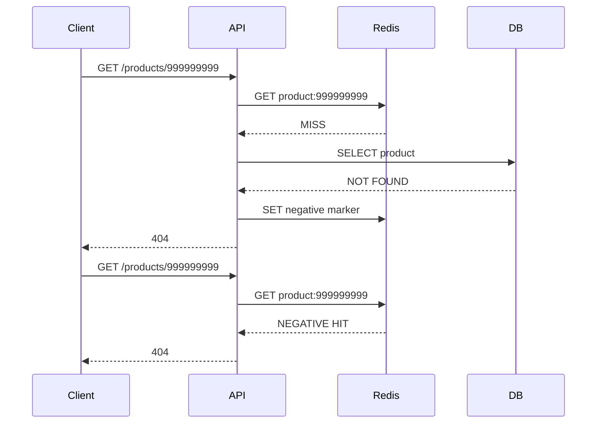
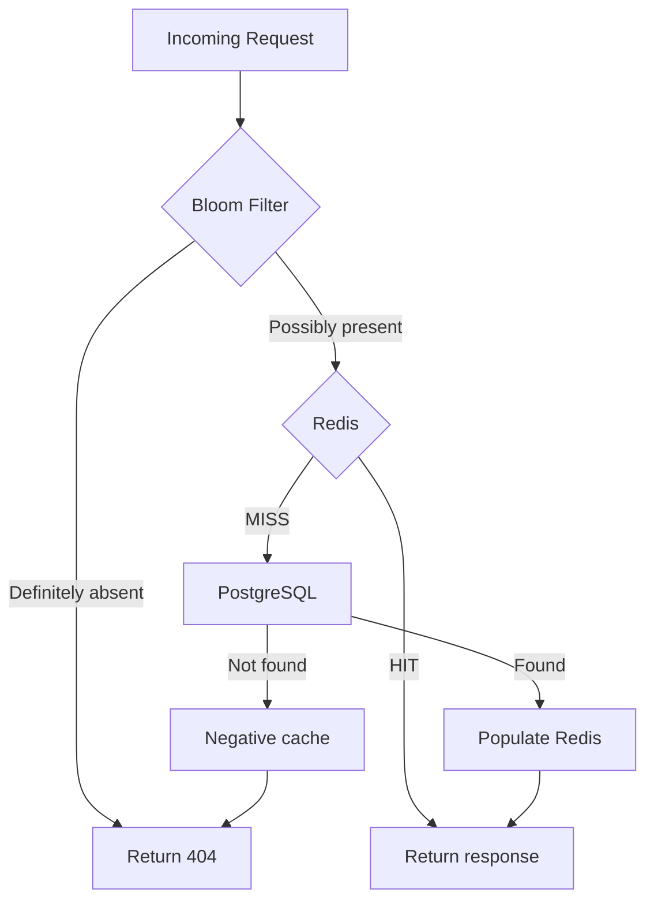
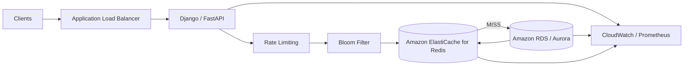
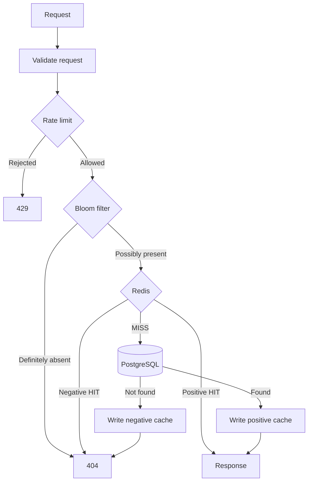

# 08- Cache Penetration

## Overview

Cache penetration occurs when requests repeatedly query data that does not exist in the underlying data store, causing every request to bypass the cache and reach the database or another expensive dependency.

A typical cache-aside implementation behaves correctly for existing records:

```text
Request
   |
   v
Redis
   |
   +---- HIT ----> Return data
   |
   +---- MISS ---> PostgreSQL
                     |
                     v
                  Data exists
                     |
                     v
                  Redis SET
```

The problem appears when the requested resource does not exist:

```text
Request for ID 999999
        |
        v
      Redis
        |
       MISS
        |
        v
   PostgreSQL
        |
      NOT FOUND
        |
        v
   Return 404
```

If the same nonexistent key is requested repeatedly:

```text
Request 1 -> Redis MISS -> DB -> 404
Request 2 -> Redis MISS -> DB -> 404
Request 3 -> Redis MISS -> DB -> 404
...
Request N -> Redis MISS -> DB -> 404
```

The cache never stores anything for the nonexistent resource, so every request reaches the database.

This becomes especially dangerous when attackers deliberately generate large numbers of nonexistent IDs or when clients repeatedly request invalid resources.

The core engineering principle is:

> A cache should protect the backing data store not only for existing data, but also against repeated requests for data that is known not to exist.

## Why Cache Penetration Matters

A cache normally reduces database load:

```text
100,000 requests
       |
       v
     Redis
       |
       +---- 99,000 hits
       |
       +---- 1,000 misses
                 |
                 v
             PostgreSQL
```

With cache penetration:

```text
100,000 requests
       |
       v
     Redis
       |
       +---- 100,000 misses
                 |
                 v
             PostgreSQL
```

The database receives the entire workload.

This is particularly problematic when:

- Requests are unauthenticated.
- Resource IDs are attacker-controlled.
- Database queries are expensive.
- The API exposes large identifier spaces.
- The endpoint has high traffic.
- The requested records are rarely present.
- Clients retry aggressively.

A database query returning zero rows is still work.

## Cache Penetration vs Cache Stampede

Cache penetration and cache stampede are related cache failure modes, but they have different causes.

| Problem | Cause | Typical Pattern |
|---|---|---|
| Cache penetration | Requests target nonexistent data | `MISS -> DB -> NOT FOUND` |
| Cache stampede | Many requests regenerate the same expired data | `MISS -> many DB queries` |
| Cache avalanche | Many cache entries become unavailable together | `many MISS -> DB spike` |
| Cache poisoning | Invalid or malicious data enters cache | `attacker -> cache` |

The mitigation must match the failure mode.

For cache penetration, the primary problem is **negative knowledge**: the system knows that a requested resource does not exist, but the cache does not remember that fact.

## How Cache Penetration Happens

Consider:

```text
GET /products/123
```

If product `123` exists:

```text
Redis GET product:123
        |
        v
      MISS
        |
        v
SELECT * FROM products WHERE id = 123
        |
        v
      FOUND
        |
        v
Redis SET product:123
```

For:

```text
GET /products/999999999
```

the result may be:

```text
Redis GET product:999999999
        |
        v
      MISS
        |
        v
SELECT * FROM products WHERE id = 999999999
        |
        v
     NOT FOUND
        |
        v
       404
```

Unless the application caches the negative result, the next request repeats the database query.

## Negative Caching

The most direct mitigation is **negative caching**.

Instead of caching only successful results:

```text
product:123 -> product data
```

also cache the fact that a resource does not exist:

```text
product:999999999 -> NOT_FOUND
```

The flow becomes:



The database is queried only once during the negative-cache TTL.

## Negative Cache TTL

Negative entries should generally have a shorter TTL than normal data.

For example:

| Cache Entry | Example TTL |
|---|---:|
| Existing product | 5 minutes |
| Nonexistent product | 30 seconds |
| Highly volatile resource | 5–30 seconds |
| Static metadata | Several minutes or longer |

The correct value depends on how frequently nonexistent resources can become valid.

Consider a product that does not exist now but may be created shortly afterward.

If the negative cache TTL is:

```text
10 minutes
```

a newly created product could continue returning `404` for up to 10 minutes unless the negative entry is explicitly invalidated.

Therefore:

> Negative caching trades repeated database work for bounded stale absence.

## Negative Cache Representation

Avoid using `None` ambiguously.

For example:

```python
cached = redis.get(key)

if cached is None:
    # Could mean cache miss or cached null
```

A dedicated marker is clearer:

```text
__NOT_FOUND__
```

For example:

```python
NOT_FOUND = "__NOT_FOUND__"
```

Then:

```text
product:123       -> serialized product
product:999999    -> __NOT_FOUND__
```

The application can distinguish:

```text
Redis MISS
Redis HIT with object
Redis HIT with negative marker
```

## Python Example

A production-oriented cache-aside implementation can explicitly represent negative results:

```python
import json

from redis import Redis


NOT_FOUND = "__NOT_FOUND__"
PRODUCT_TTL_SECONDS = 300
NEGATIVE_TTL_SECONDS = 30


def get_product(redis: Redis, product_id: int):
    cache_key = f"product:v1:{product_id}"

    cached = redis.get(cache_key)

    if cached == NOT_FOUND.encode():
        return None

    if cached is not None:
        return json.loads(cached)

    product = load_product_from_database(product_id)

    if product is None:
        redis.set(
            cache_key,
            NOT_FOUND,
            ex=NEGATIVE_TTL_SECONDS,
        )
        return None

    redis.set(
        cache_key,
        json.dumps(product),
        ex=PRODUCT_TTL_SECONDS,
    )

    return product
```

The important distinction is:

```text
cached is None
```

means:

```text
Cache MISS
```

while:

```text
cached == NOT_FOUND
```

means:

```text
Cache HIT: resource is known to be absent
```

## Negative Cache With JSON

For more structured cache values, use an explicit envelope:

```json
{
  "status": "not_found"
}
```

Existing data could use:

```json
{
  "status": "found",
  "data": {
    "id": 123,
    "name": "Keyboard"
  }
}
```

This is useful when multiple negative states need to be represented.

However, a compact sentinel value is often more memory-efficient for a high-volume negative cache.

## Bloom Filters

A Bloom filter is another important cache-penetration defense.

A Bloom filter is a probabilistic data structure that answers:

> "Is this value possibly present in the set?"

It has two possible outcomes:

```text
PRESENT
NOT PRESENT
```

But the semantics are asymmetric:

- `NOT PRESENT` is guaranteed to be absent, assuming the filter is correctly maintained.
- `PRESENT` means possibly present.

This means Bloom filters can safely reject requests for keys that definitely do not exist.

## Bloom Filter Request Flow



The key benefit is that obviously invalid identifiers can be rejected before reaching Redis or PostgreSQL.

## Bloom Filter Properties

| Property | Bloom Filter |
|---|---|
| False positives | Possible |
| False negatives | Normally no |
| Exact membership | No |
| Memory usage | Very low |
| Deletes | Difficult with standard Bloom filters |
| Lookup | Very fast |
| Distributed usage | Possible |
| Best use | Reject definitely nonexistent keys |

Suppose the database contains:

```text
100
101
102
103
104
```

A request for:

```text
999999
```

may produce:

```text
Bloom Filter -> definitely absent
```

The request can be rejected immediately.

A request for:

```text
101
```

produces:

```text
Bloom Filter -> possibly present
```

The application continues to Redis and then PostgreSQL if necessary.

## Bloom Filter False Positives

A Bloom filter can say:

```text
"Maybe this ID exists"
```

when it actually does not.

That is a false positive.

This is acceptable because the request continues to the normal cache/database path.

The dangerous condition would be a false negative:

```text
Bloom Filter says absent
but the record actually exists
```

A standard Bloom filter is designed to avoid this as long as the filter is correctly constructed and maintained.

## Bloom Filter Memory Efficiency

A Bloom filter can represent a very large set using significantly less memory than storing every identifier individually.

For a high-volume identifier space:

```text
Millions of valid IDs
```

storing every ID in Redis as an independent membership key can consume substantial memory.

A Bloom filter compresses membership information into a bit array.

The trade-off is probabilistic behavior and configuration complexity.

## Bloom Filter Hashing

Conceptually:

```text
ID
 |
 +--> Hash 1 --> bit 17
 |
 +--> Hash 2 --> bit 483
 |
 +--> Hash 3 --> bit 991
```

When inserting a value:

```text
hashes -> set bits
```

When checking:

```text
hashes -> inspect bits
```

If any required bit is zero:

```text
Definitely absent
```

If all are one:

```text
Possibly present
```

Multiple values can map to overlapping bits, which causes false positives.

## Bloom Filter Configuration

Two important parameters are:

- Expected number of elements.
- Desired false-positive probability.

For example:

```text
Expected elements: 10 million
Target false-positive rate: 0.1%
```

The implementation chooses an appropriate:

- Bit-array size.
- Number of hash functions.

An incorrectly sized Bloom filter can become saturated and produce an unacceptable false-positive rate.

## Redis Bloom

Redis deployments can use RedisBloom/Redis Stack functionality for probabilistic data structures.

A conceptual command is:

```text
BF.ADD products 123
BF.EXISTS products 123
```

A production deployment should verify the exact Redis distribution and module support before depending on these commands.

The architectural pattern remains the same:

```text
Request
   |
   v
Bloom Filter
   |
   +---- definitely absent ----> reject
   |
   +---- possibly present -----> Redis
```

## Bloom Filter Maintenance

The difficult part is not lookup.

The difficult part is maintaining correctness as the database changes.

Suppose:

```text
Database
100
101
102
```

and the Bloom filter contains:

```text
100
101
102
```

A new record is created:

```text
103
```

The Bloom filter must eventually contain:

```text
103
```

Otherwise:

```text
Request 103
   |
   v
Bloom filter
   |
   v
Definitely absent
   |
   v
Incorrect 404
```

This is why insertion paths and synchronization must be carefully designed.

## Handling Deletes

Standard Bloom filters do not support safe deletion.

If a record is deleted:

```text
ID 101 removed from DB
```

the corresponding bits may also belong to other IDs.

Clearing them could incorrectly remove valid membership information.

Options include:

- Rebuilding the Bloom filter periodically.
- Using a counting Bloom filter where supported.
- Using another probabilistic structure.
- Combining Bloom filters with negative caching.
- Accepting some false positives.

For many systems, false positives are harmless because the database remains authoritative.

## Bloom Filter Rebuild Strategy

For a large database, rebuilding the filter can be an operational task.

A common pattern is:

```text
PostgreSQL
    |
    v
Snapshot / scan
    |
    v
Build new Bloom filter
    |
    v
Validate
    |
    v
Atomically switch
```

Avoid rebuilding in a way that blocks production traffic.

A versioned filter can help:

```text
products:bloom:v1
products:bloom:v2
```

Build `v2` in the background and switch readers after validation.

## Combining Bloom Filters and Negative Caching

These mechanisms work well together.

```text
                 Request
                    |
                    v
             Bloom Filter
              /          \
     definitely absent   possibly present
            |                 |
            v                 v
          404              Redis
                             |
                      ┌──────┴──────┐
                      |             |
                    HIT           MISS
                      |             |
                      v             v
                  Response       Database
                                     |
                           ┌─────────┴─────────┐
                           |                   |
                         Found             Not found
                           |                   |
                           v                   v
                         Redis          Negative cache
```

Bloom filters reject obviously invalid identifiers cheaply.

Negative caching protects the database from repeated misses that pass the Bloom filter.

This provides defense in depth.

## Input Validation

Not every invalid request should reach the cache.

For example:

```text
GET /products/abc
```

when the API expects an integer ID should be rejected at the API layer.

FastAPI can validate this through typed path parameters:

```python
from fastapi import FastAPI


app = FastAPI()


@app.get("/products/{product_id}")
async def get_product(product_id: int):
    return await load_product(product_id)
```

A request such as:

```text
/products/abc
```

can be rejected before database lookup.

Django REST Framework similarly provides serializer and URL parameter validation mechanisms.

This is cheaper than allowing malformed requests to reach Redis or PostgreSQL.

## Identifier Validation

Validation can include:

- Type checks.
- Length limits.
- Range limits.
- UUID format validation.
- Enumeration constraints.
- Tenant ownership checks.
- Pagination limits.

For numeric IDs, rejecting obviously impossible values can reduce unnecessary work.

For example:

```text
product_id <= 0
```

may be rejected immediately if the domain guarantees positive identifiers.

However, validation should not be treated as the primary defense against penetration because valid-looking nonexistent IDs can still be generated.

## Rate Limiting

An attacker can intentionally generate nonexistent IDs:

```text
/products/900000001
/products/900000002
/products/900000003
...
```

Even with negative caching, continuously generating unique IDs defeats the negative cache.

Rate limiting becomes important.

```text
Client
  |
  v
Rate Limiter
  |
  +---- allowed ----> API
  |
  +---- excessive --> 429
```

Rate limits can be applied by:

- IP address.
- User.
- API key.
- Tenant.
- Token.
- Endpoint.
- Combination of dimensions.

For public APIs, multiple dimensions are often more effective than IP-only limits.

## Attack Pattern

A penetration attack can look like:

```text
Attacker
   |
   +--> /products/10000001
   +--> /products/10000002
   +--> /products/10000003
   +--> /products/10000004
   |
   v
Redis MISS
   |
   v
PostgreSQL
   |
   v
NOT FOUND
```

Because each key is unique:

```text
Negative cache key 1 -> miss
Negative cache key 2 -> miss
Negative cache key 3 -> miss
...
```

Negative caching alone may not provide enough protection.

The architecture should combine:

```text
Rate limiting
+
Input validation
+
Bloom filter
+
Negative caching
+
Database protection
```

## Pagination and Enumeration Risks

Sequential IDs make resource enumeration easy.

For example:

```text
/products/10001
/products/10002
/products/10003
...
```

Attackers can systematically probe the identifier space.

Alternatives such as UUIDs or opaque identifiers can make enumeration harder.

However:

> UUIDs do not replace authorization.

A random identifier does not make an object secure if an attacker can obtain or guess a valid identifier.

Every resource lookup still needs authorization checks.

## Multi-Tenant Systems

Cache penetration becomes more subtle in multi-tenant architectures.

A cache key should generally include tenant context:

```text
tenant:{tenant_id}:product:{product_id}
```

not merely:

```text
product:{product_id}
```

Otherwise a negative cache entry from one tenant could incorrectly affect another tenant.

For example:

```text
Tenant A:
product 123 does not exist

Tenant B:
product 123 exists
```

If the negative cache is:

```text
product:123 -> NOT_FOUND
```

Tenant B may incorrectly receive a `404`.

Tenant isolation is therefore both a correctness and security requirement.

## Authorization and Negative Caching

A resource may appear nonexistent for different reasons:

```text
1. Resource genuinely does not exist.
2. Resource exists but user is unauthorized.
3. Resource exists but belongs to another tenant.
```

These states should not always be cached identically.

Consider:

```text
GET /orders/123
```

A user may receive:

```text
404
```

to avoid revealing that an object exists.

Caching that response globally could incorrectly affect another authorized user.

Negative caching must respect the cache's scope:

```text
Global negative cache
```

is appropriate only when the absence is globally true.

User- or tenant-dependent results require appropriately scoped keys and policies.

## Negative Caching and Creation

A major production issue occurs when a resource is created shortly after a negative cache entry is written.

Timeline:

```text
10:00:00
GET product:123
-> DB says NOT FOUND
-> negative cache for 60 seconds

10:00:10
POST /products
-> product 123 created

10:00:20
GET product:123
-> negative cache HIT
-> incorrect 404
```

Mitigation:

```text
Create/update resource
       |
       v
Invalidate negative cache
       |
       v
Future GET
       |
       v
Database / positive cache
```

If cache invalidation cannot be guaranteed, keep negative TTLs short enough for the business requirement.

## Cache Key Namespaces

Use explicit namespaces:

```text
product:v1:{id}
product:negative:v1:{id}
```

or a single key with explicit values:

```text
product:v1:{id} -> FOUND
product:v1:{id} -> NOT_FOUND
```

A separate negative namespace can simplify operational analysis.

For example:

```text
SCAN product:negative:v1:*
```

can help identify the volume of negative entries.

Avoid unbounded `KEYS` operations in production Redis workloads.

## Memory Considerations

Negative caching can itself consume significant memory.

An attacker could generate millions of unique nonexistent identifiers:

```text
1 million invalid IDs
        |
        v
1 million negative cache entries
```

Even if each entry is small, the aggregate memory usage can become significant.

Mitigations include:

- Short negative TTLs.
- Maximum cache memory.
- Appropriate eviction policies.
- Rate limiting.
- Bloom filters.
- Key normalization.
- Request validation.
- Monitoring negative-cache cardinality.

Negative caching should not become an unbounded storage mechanism.

## Eviction Policy Interaction

Redis eviction policies affect negative caching.

Suppose Redis uses:

```text
allkeys-lru
```

Negative entries may be evicted under memory pressure.

That is acceptable from a correctness perspective because eviction merely causes:

```text
negative cache HIT
```

to become:

```text
cache MISS -> database
```

The important point is that the database must remain authoritative.

Never depend on the cache for correctness.

## Database Protection

Even with cache-penetration controls, the database should remain resilient.

Use:

- Proper indexes.
- Query timeouts.
- Connection-pool limits.
- Read replicas where appropriate.
- Circuit breakers.
- Rate limits.
- Query budgets.
- Pagination limits.

For an indexed primary-key lookup:

```sql
SELECT id, name, price
FROM products
WHERE id = %s;
```

the database can usually handle misses efficiently.

But an attacker can still create massive query volume.

An index improves individual query cost; it does not make unlimited traffic safe.

## Query Optimization Is Not a Complete Solution

A common mistake is:

> "The query is indexed, so cache penetration is not a problem."

An indexed query may be cheap individually.

But:

```text
100 queries/sec  -> manageable
100,000 queries/sec -> potentially expensive
```

The system-level problem is aggregate resource consumption.

Caching and traffic control address request volume; indexes address per-query efficiency.

Both matter.

## Monitoring

Monitor cache penetration explicitly.

Useful metrics include:

| Metric | Why It Matters |
|---|---|
| Negative cache hit rate | Shows how many misses are being absorbed |
| Negative cache size | Detects memory growth |
| Cache miss rate | Detects increased backend dependency traffic |
| 404 rate | Identifies nonexistent-resource traffic |
| Unique missing IDs | Detects enumeration or attack patterns |
| Database QPS | Measures backing-store pressure |
| Database query latency | Detects saturation |
| Bloom filter rejection rate | Measures early filtering |
| Bloom false-positive rate | Measures filter effectiveness |
| Rate-limit rejection rate | Indicates abusive traffic |

A useful dashboard can correlate:

```text
404 rate
+
unique missing identifiers
+
negative cache misses
+
database QPS
```

A sudden increase in all four can indicate deliberate cache penetration.

## Security Monitoring

Repeated requests for nonexistent resources may indicate:

- Resource enumeration.
- Credential or token probing.
- Scraping.
- Vulnerability scanning.
- Abuse.
- Accidental client bugs.

Do not automatically treat every `404` as an attack.

Look for patterns:

```text
High request rate
+
High unique-ID cardinality
+
Low successful-resource ratio
+
High database load
```

This is a much stronger signal.

## Observability Example

Application metrics might expose:

```text
cache_lookup_total{result="hit"}
cache_lookup_total{result="miss"}
cache_lookup_total{result="negative_hit"}

resource_lookup_total{result="found"}
resource_lookup_total{result="not_found"}

bloom_lookup_total{result="definitely_absent"}
```

These metrics make the request path visible.

For example:

```text
Bloom rejection rate:       82%
Negative cache hit rate:    14%
Database lookup rate:        4%
```

This indicates that most invalid requests are being stopped before reaching PostgreSQL.

## Availability Considerations

A cache should improve availability, not become a single point of failure.

If Redis becomes unavailable:

```text
API
 |
 v
Redis unavailable
 |
 v
Database
```

A naive application may immediately send all traffic to PostgreSQL.

This can create a secondary outage.

Therefore, cache failures should be handled with:

- Database concurrency limits.
- Circuit breakers.
- Rate limiting.
- Timeouts.
- Graceful degradation.
- Load shedding.

For negative caching specifically, Redis failure means the application may lose its remembered absence information. The system must still remain correct without the cache.

## AWS Architecture

A production AWS architecture might look like:



The exact architecture depends on traffic volume and requirements.

The important property is that multiple layers protect the database from untrusted request volume.

## Cost Considerations

Cache penetration can create unexpected costs.

Potential cost increases include:

- Database compute.
- Database I/O.
- Read replica traffic.
- Redis memory.
- Network traffic.
- Application CPU.
- Observability ingestion.
- Autoscaling events.

A particularly expensive failure mode is:

```text
Invalid traffic
    |
    v
Application autoscaling
    |
    v
More database queries
    |
    v
Database scaling
    |
    v
Higher infrastructure cost
```

Autoscaling can amplify cost without solving the underlying abuse pattern.

## Disaster Recovery

Caches are generally disposable.

The source database should remain authoritative.

After a Redis failure:

```text
Redis restored
     |
     v
Cold cache
     |
     v
Requests
     |
     v
Database
```

The system should recover through controlled repopulation rather than assuming the cache contains durable state.

For negative caching, this means the database remains capable of determining whether a resource exists.

## Production Design Pattern

A robust request path can be:



Each layer has a specific responsibility:

| Layer | Responsibility |
|---|---|
| Validation | Reject malformed requests |
| Rate limiting | Control abusive request volume |
| Bloom filter | Reject definitely nonexistent keys |
| Redis positive cache | Serve known existing data |
| Redis negative cache | Remember known absence |
| Database | Authoritative existence check |

This layered design is stronger than relying on any single mechanism.

## When to Use Negative Caching

Negative caching is useful when:

- Nonexistent-resource requests are common.
- Database lookups are relatively expensive.
- Resource absence changes infrequently.
- APIs expose attacker-controlled identifiers.
- The endpoint is read-heavy.
- A bounded stale `404` is acceptable.

Examples:

- Product IDs.
- Public user profiles.
- Catalog entries.
- Configuration objects.
- Content IDs.
- Metadata records.

## When to Be Careful With Negative Caching

Use caution when:

- Resources are created frequently.
- Existence depends on user authorization.
- Existence depends on tenant context.
- Data visibility changes frequently.
- A stale `404` has business impact.
- Resource state is security-sensitive.

In these cases, use:

- Very short TTLs.
- Explicit invalidation.
- Scoped keys.
- Event-driven invalidation.
- No negative caching where necessary.

## Advantages and Limitations

| Technique | Advantages | Limitations |
|---|---|---|
| Input validation | Very cheap | Cannot detect valid-looking nonexistent IDs |
| Negative caching | Simple and effective | Can return stale absence |
| Bloom filter | Very memory-efficient | Probabilistic and operationally complex |
| Rate limiting | Protects against abusive traffic | Can affect legitimate clients |
| UUIDs/opaque IDs | Makes enumeration harder | Does not prevent random invalid requests |
| Database indexing | Makes misses cheaper | Does not control request volume |
| L1 cache | Reduces shared-cache load | Limited to individual application instances |
| Query limits | Protects database | May increase latency or rejected requests |

## Common Mistakes and Pitfalls

### Caching Only Successful Responses

This leaves nonexistent resources uncached.

If repeated misses are expensive, cache the negative result with an appropriate TTL.

### Using an Infinite Negative TTL

A permanently cached `NOT_FOUND` can make newly created resources appear nonexistent.

Use bounded TTLs and explicit invalidation where appropriate.

### Using a Global Negative Cache for Tenant-Specific Data

This can produce cross-tenant correctness or security problems.

Include tenant context in the cache key.

### Treating `None` as Both Cache Miss and Negative Hit

The application cannot distinguish:

```text
Cache contains no entry
```

from:

```text
Cache explicitly knows the resource is absent
```

Use an explicit sentinel or structured cache representation.

### Assuming Bloom Filters Are Exact

A Bloom filter can return false positives.

It should be treated as an optimization, not the source of truth.

### Ignoring Bloom Filter Updates

If new records are not added correctly, legitimate requests can be incorrectly rejected.

Use reliable insertion paths and operational rebuild strategies.

### Trying to Delete From a Standard Bloom Filter

Standard Bloom filters do not support arbitrary safe deletion.

Use rebuilds or a data structure designed for deletions.

### Relying Only on UUIDs

UUIDs reduce predictable enumeration but do not prevent an attacker from generating random nonexistent UUIDs.

Use traffic controls and cache protection as well.

### Allowing Unlimited Invalid Requests

A negative cache cannot protect against an attacker generating a unique invalid key for every request.

Rate limiting and request-level controls remain necessary.

### Using `KEYS` for Production Analysis

Scanning large Redis keyspaces with `KEYS` can block Redis and cause latency spikes.

Prefer `SCAN` for operational inspection.

```bash
redis-cli SCAN 0 MATCH 'product:negative:v1:*' COUNT 1000
```

### Assuming an Index Eliminates the Problem

Indexes reduce query cost but do not eliminate the cost of massive query volume.

Protect the database at the traffic and concurrency layers as well.

## Interview Traps

| Question | Strong Answer |
|---|---|
| What is cache penetration? | Repeated requests for nonexistent data bypass the cache and repeatedly hit the backing store. |
| How is cache penetration different from cache stampede? | Penetration repeatedly queries nonexistent keys; stampede causes many requests to regenerate the same missing or expired key. |
| What is negative caching? | Caching the knowledge that a resource does not exist so repeated requests can be rejected without querying the database. |
| Why should negative TTLs usually be short? | Because a resource that does not exist now may be created later, and a long negative TTL can cause stale `404` responses. |
| What is a Bloom filter used for? | Quickly rejecting values that are definitely not present before expensive cache or database lookups. |
| Can a Bloom filter have false negatives? | A correctly maintained standard Bloom filter should not; it can have false positives. |
| Why is a Bloom filter useful for cache penetration? | It prevents obviously nonexistent identifiers from reaching Redis or the database. |
| Why is negative caching alone insufficient against an attacker? | An attacker can continuously generate unique nonexistent keys, preventing reuse of negative cache entries. |
| How do you protect against unique invalid IDs? | Combine rate limiting, Bloom filters, validation, database protection, and appropriate negative caching. |
| Are UUIDs a solution to cache penetration? | No. They make enumeration harder but do not prevent requests for nonexistent UUIDs. |
| Can negative caching cause incorrect responses? | Yes, if the resource is created after a negative entry is cached or if the result is incorrectly shared across tenants/users. |
| Should cache determine whether a resource exists? | No. The database or authoritative service remains the source of truth. |
| What is a Bloom filter false positive? | The filter says an item may exist when it does not; the request continues to the normal lookup path. |
| Why can't a standard Bloom filter safely delete entries? | Multiple values may share the same bits, so clearing bits for one value could incorrectly remove another value. |
| What should happen if Redis fails? | The system should remain correct without Redis while protecting the database through rate limits, concurrency limits, timeouts, and graceful degradation. |

## Key Takeaways

- **Cache penetration occurs when repeated requests for nonexistent resources bypass the cache and repeatedly consume database or backend capacity.**
- **Negative caching remembers known absence and is the simplest mitigation, but its TTL must balance database protection against stale `404` responses.**
- **Bloom filters efficiently reject values that are definitely absent, but they are probabilistic optimizations and must never replace the authoritative database.**
- **High-volume unique invalid requests require layered protection such as input validation, rate limiting, Bloom filters, negative caching, and database concurrency controls.**
- **Production cache-penetration defenses must account for tenant isolation, authorization, resource creation, Redis failure, memory consumption, observability, and attacker-driven traffic patterns.**