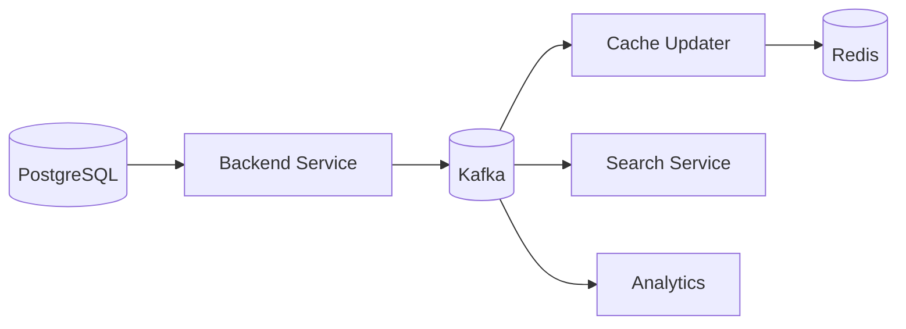

# 09- Cache Avalanche

## Overview

A **cache avalanche** occurs when a large portion of cached data becomes unavailable at approximately the same time, causing a sudden surge of requests toward the underlying data store.

The cache is normally used to absorb read traffic:

```text
Clients
   |
   v
Application
   |
   v
Redis
   |
   +---- HIT ----> Response
   |
   +---- MISS ---> Database
```

During an avalanche, many cache entries disappear together:

```text
Clients
   |
   v
Application
   |
   v
Redis
   |
   +---- MISS
   +---- MISS
   +---- MISS
   +---- MISS
   +---- MISS
          |
          v
      PostgreSQL
          |
          v
    Connection saturation
          |
          v
      High latency
          |
          v
       Timeouts
```

The important characteristic is **correlated cache failure**. A single cache miss is normal. Thousands or millions of simultaneous misses can overwhelm the database even when the database handled the normal workload comfortably.

Cache avalanche is therefore primarily a **capacity and recovery problem**:

> The cache normally spreads backend load over time, but synchronized cache loss can suddenly expose the full workload to the backing store.

## Why Cache Avalanche Matters

Consider an API receiving 50,000 requests per second.

Under normal operation:

```text
50,000 requests/sec
        |
        v
      Redis
        |
        +---- 49,500 hits
        |
        +---- 500 misses
                  |
                  v
              PostgreSQL
```

The database handles only approximately 1% of the traffic.

Now suppose the cache is lost:

```text
50,000 requests/sec
        |
        v
      Redis
        |
        +---- 50,000 misses
                  |
                  v
              PostgreSQL
```

The database workload has increased by approximately 100x.

If PostgreSQL can sustainably process only 5,000 relevant requests per second, the application has immediately exceeded database capacity.

The resulting failure can cascade:

```text
Cache loss
    |
    v
Database traffic spike
    |
    v
Database connection saturation
    |
    v
Query latency increases
    |
    v
Application requests remain in flight
    |
    v
Thread/process/worker exhaustion
    |
    v
Timeouts and retries
    |
    v
More database traffic
    |
    v
System-wide degradation
```

This is why cache availability must be considered part of the overall system's reliability design.

## Cache Avalanche vs Cache Stampede

These terms are often used interchangeably, but they describe different failure patterns.

| Failure | Primary Cause | Scope | Typical Example |
|---|---|---|---|
| Cache miss | Individual key absent | Single key | New request |
| Cache stampede | Many clients regenerate one key simultaneously | One or a small set of hot keys | Popular key expires |
| Cache avalanche | Many keys become unavailable simultaneously | Large portion of cache | Shared TTL expiration or cache outage |
| Cache penetration | Requests target nonexistent data | Potentially many unique keys | Random invalid IDs |

A cache stampede can therefore be viewed as a **localized regeneration storm**, while an avalanche is generally a **broader cache-loss event**.

The mitigation strategies overlap but are not identical.

## Common Causes

Cache avalanche generally comes from one of two broad categories:

1. **Correlated expiration or eviction**
2. **Cache infrastructure failure**

Typical causes include:

- Identical TTLs for large numbers of keys.
- Bulk cache population at the same time.
- Application restart that reconstructs cache entries together.
- Redis node failure.
- Redis cluster failure.
- Network connectivity failure.
- Incorrect Redis configuration.
- Memory pressure causing mass eviction.
- Deployment or operational events.
- Large-scale cache flushes.
- Recovery after a cold cache.
- Incorrect TTL configuration.

## Synchronized TTL Expiration

The most common application-level cause is synchronized expiration.

Suppose an application writes 1 million keys:

```text
key:1 -> TTL 300 seconds
key:2 -> TTL 300 seconds
key:3 -> TTL 300 seconds
...
key:1000000 -> TTL 300 seconds
```

If these keys are populated within a short period, they can expire within a narrow time window.

The resulting traffic pattern becomes:

```text
Time
 |
 |       Cache HIT
 |       Cache HIT
 |       Cache HIT
 |
 +-----------------------> Expiration boundary
                          |
                          v
                    Massive MISS
                          |
                          v
                     Database
```

The database receives a sudden regeneration workload.

## Why Fixed TTLs Are Dangerous

A fixed TTL such as:

```python
redis.set(key, value, ex=300)
```

is not inherently wrong.

The problem occurs when many high-value keys are created at approximately the same time and receive exactly the same expiration interval.

For example:

```text
09:00:00 -> 300 seconds
09:00:01 -> 300 seconds
09:00:02 -> 300 seconds
```

Their expiration times become:

```text
09:05:00
09:05:01
09:05:02
```

A sufficiently large batch can still produce a significant expiration spike.

The engineering goal is to **decorrelate expiration times**.

## TTL Jitter

TTL jitter adds a small randomized component to expiration.

Instead of:

```text
TTL = 300 seconds
```

use:

```text
TTL = 300 + random(0, 60) seconds
```

This spreads expiration over time.

Conceptually:

```text
Without jitter:

300s  300s  300s  300s  300s
  |     |     |     |     |
  v     v     v     v     v
######### expiration spike #########


With jitter:

300s  314s  327s  341s  358s
  |     |     |     |     |
  v     v     v     v     v
#  ##   ###   ##   #   ##  #
```

The total number of expirations is unchanged, but the workload becomes more distributed.

## Python TTL Jitter

A simple implementation:

```python
import random


BASE_TTL_SECONDS = 300
TTL_JITTER_SECONDS = 60


def get_cache_ttl() -> int:
    return BASE_TTL_SECONDS + random.randint(
        0,
        TTL_JITTER_SECONDS,
    )
```

Then:

```python
redis.set(
    cache_key,
    serialized_value,
    ex=get_cache_ttl(),
)
```

For a more symmetric distribution:

```python
def get_cache_ttl() -> int:
    return random.randint(270, 330)
```

The exact range should be chosen based on freshness requirements.

## TTL Jitter Trade-Offs

TTL jitter is useful, but it changes cache freshness behavior.

| Benefit | Trade-Off |
|---|---|
| Reduces synchronized expiration | Some entries live longer |
| Smooths database load | Cache freshness becomes less deterministic |
| Easy to implement | Requires appropriate jitter bounds |
| Works across many application instances | Does not protect against Redis outage |

TTL jitter is therefore a **load-shaping technique**, not a complete avalanche defense.

## Cache Warming

Cache warming means proactively populating frequently needed cache entries before they are requested under normal production traffic.

Without warming:

```text
Deploy / cache restart
       |
       v
Empty cache
       |
       v
Traffic arrives
       |
       v
Massive cache misses
       |
       v
Database
```

With controlled warming:

```text
Cache restart
     |
     v
Warm critical keys
     |
     v
Gradually accept traffic
     |
     v
Normal cache hit rate
```

Typical warming candidates include:

- Popular products.
- Configuration.
- Feature flags.
- Frequently accessed metadata.
- Home-page content.
- Frequently accessed reference data.
- Expensive aggregate queries.

Do not attempt to warm every possible key.

Warm the keys that provide meaningful protection against backend load.

## Controlled Cache Warming

A production warming process should avoid generating another database storm.

Bad approach:

```text
Cache restart
    |
    v
10,000 workers
    |
    v
10,000 database queries/sec
```

Better:

```text
Cache restart
    |
    v
Warm queue
    |
    v
Controlled concurrency
    |
    v
Database
    |
    v
Redis
```

For example, Celery can process warming tasks with bounded concurrency.

```python
from celery import shared_task


@shared_task
def warm_product_cache(product_id: int) -> None:
    product = load_product_from_database(product_id)

    if product is None:
        return

    cache_product(product)
```

The worker configuration should limit the number of concurrent warming operations so cache recovery does not overload PostgreSQL.

## Lazy Warming

Another strategy is to repopulate entries only when requested:

```text
Request
  |
  v
Redis MISS
  |
  v
Database
  |
  v
Redis SET
  |
  v
Response
```

This avoids unnecessary work for keys nobody requests.

However, after a large cache outage, lazy warming can produce a large burst.

Therefore, production systems often combine:

- Lazy loading.
- Hot-key warming.
- Rate-limited background warming.
- Request coalescing.

## Cache Warming Strategy Comparison

| Strategy | Advantages | Limitations |
|---|---|---|
| Full warming | High initial hit rate | Expensive and potentially dangerous |
| Lazy warming | Minimal unnecessary work | Can cause miss storms |
| Hot-key warming | Good protection per unit of work | Requires traffic knowledge |
| Background warming | Controlled recovery | Requires job infrastructure |
| Hybrid warming | Balances protection and cost | More operational complexity |

## High Availability for Redis

An avalanche can happen because the cache itself becomes unavailable.

For production systems, avoid treating a single Redis process as sufficient high availability.

Depending on requirements, use:

- Redis replication.
- Redis Sentinel.
- Redis Cluster.
- Managed Redis services.
- Multi-AZ deployment.
- Automated failover.

On AWS, a managed Redis-compatible service such as Amazon ElastiCache can reduce operational burden.

The exact topology should be based on:

- Required availability.
- Dataset size.
- Throughput.
- Failure domains.
- Operational expertise.
- Recovery objectives.
- Cost constraints.

## Redis Failure vs Cache Expiration

These scenarios should be distinguished.

### Expiration Avalanche

```text
Redis available
     |
     v
Many keys expire
     |
     v
Massive cache misses
     |
     v
Database overload
```

### Cache Infrastructure Failure

```text
Redis outage
     |
     v
All cache requests fail
     |
     v
Application falls back to database
     |
     v
Database overload
```

The second case requires resilience at the infrastructure and application layers.

TTL jitter does not help if Redis is completely unavailable.

## Database Protection

The database must have explicit protection against cache-loss scenarios.

Useful controls include:

- Connection pool limits.
- Query timeouts.
- Statement timeouts.
- Read replicas.
- Load shedding.
- Circuit breakers.
- Request concurrency limits.
- Rate limiting.
- Backpressure.
- Priority queues.
- Graceful degradation.

A critical principle is:

> Do not allow the database to inherit unlimited cache-miss traffic.

## Connection Pool Protection

Consider:

```text
1,000 API workers
        |
        v
PostgreSQL
        |
        v
10,000 concurrent queries
```

The database may fail before CPU becomes the primary bottleneck.

A bounded connection pool provides a hard limit.

For example:

```text
API traffic
    |
    v
Application concurrency limit
    |
    v
DB connection pool
    |
    v
PostgreSQL
```

A queue may form, but uncontrolled concurrency is usually worse than controlled backpressure.

## Request Coalescing

Request coalescing prevents multiple concurrent requests from independently regenerating the same cache entry.

Suppose:

```text
1,000 requests
     |
     v
product:123 cache miss
```

Without coalescing:

```text
1,000 requests
     |
     +--> DB query
     +--> DB query
     +--> DB query
     ...
```

With coalescing:

```text
1,000 requests
     |
     v
Shared regeneration
     |
     v
1 database query
     |
     v
Redis
     |
     v
1,000 responses
```

This is especially useful for hot keys.

## Redis Locking

A distributed lock can coordinate regeneration.

Conceptually:

```text
Request A -> acquire lock -> regenerate
Request B -> lock exists -> wait
Request C -> lock exists -> wait
```

A Redis-based lock should have:

- Unique ownership token.
- Expiration.
- Bounded wait time.
- Safe release semantics.
- Failure handling.

Do not implement distributed locking with a simple permanent:

```text
SET lock
```

because a crashed worker could leave the lock indefinitely.

## Single-Flight Pattern

An alternative is request coalescing within a single application process.

Conceptually:

```text
                    +--> Request A
                    |
Cache miss ---------+--> Request B
                    |
                    +--> Request C
                           |
                           v
                     One DB query
                           |
                           v
                         Redis
                           |
             +-------------+-------------+
             |             |             |
             v             v             v
             A             B             C
```

This is commonly called a **single-flight** or request-deduplication pattern.

It is particularly effective when multiple requests hit the same application instance.

Distributed systems may require a shared coordination mechanism.

## Stale-While-Revalidate

Instead of treating expiration as an immediate hard boundary, a system can continue serving slightly stale data while refreshing it in the background.

Conceptually:

```text
Fresh
  |
  v
Stale-but-servable
  |
  +----> serve stale immediately
  |
  +----> background refresh
  |
  v
Refreshed
```

This reduces the probability that a large number of clients simultaneously wait for regeneration.

A typical cache entry may contain:

```text
value
fresh_until
stale_until
```

For example:

```text
0 - 300 sec   -> fresh
300 - 360 sec -> stale but servable
> 360 sec     -> unavailable
```

The actual implementation depends on the cache library or application architecture.

## Stale-While-Revalidate Trade-Offs

| Benefit | Cost |
|---|---|
| Smooths regeneration traffic | Serves potentially stale data |
| Protects database | More complex cache lifecycle |
| Improves latency | Requires background refresh |
| Reduces synchronized misses | Not appropriate for all data |

This works particularly well for:

- Catalog data.
- Public configuration.
- Content.
- Aggregated dashboards.
- Reference data.

It is usually inappropriate for strongly consistency-sensitive information such as account balances.

## Early Refresh

Instead of waiting until expiration:

```text
TTL = 300s
```

the application can refresh frequently accessed keys before they become unavailable.

For example:

```text
0s        240s       300s
|----------|-----------|
           |
       refresh
```

This reduces the number of requests encountering an actual expiration boundary.

Early refresh is most valuable for hot keys.

## Probabilistic Early Refresh

A more advanced strategy is to probabilistically refresh a key as it approaches expiration.

Conceptually:

```text
TTL remaining
    |
    v
Large ---------> Low refresh probability
    |
    v
Small ---------> High refresh probability
```

This prevents all instances from deciding to refresh the same key at exactly the same moment.

The implementation should be carefully bounded so refresh traffic does not itself become a storm.

## Local L1 Cache

A small in-process cache can provide another layer of protection.

Architecture:

```text
Application
   |
   v
L1 Cache
   |
   +---- HIT
   |
   +---- MISS
          |
          v
       Redis
          |
          +---- HIT
          |
          +---- MISS
                 |
                 v
              Database
```

For example:

```text
L1 -> 5 seconds
L2 Redis -> 5 minutes
DB -> source of truth
```

The L1 cache can absorb very hot requests even if Redis is experiencing pressure.

However, local caches introduce consistency challenges across application instances.

## L1 Cache Risks

With multiple application instances:

```text
Instance A -> local cache -> value A
Instance B -> local cache -> value B
```

An update may invalidate Redis but leave stale values in one or more local caches.

Therefore:

- Keep L1 TTLs short.
- Use L1 only for appropriate data.
- Consider explicit invalidation for critical entries.
- Do not use local caching as the authoritative state.

## Randomized Refresh

If multiple application instances refresh the same key based on a deterministic schedule:

```text
Instance A -> refresh at 12:00
Instance B -> refresh at 12:00
Instance C -> refresh at 12:00
```

they can produce another synchronization problem.

Introduce jitter:

```text
Instance A -> 11:59:42
Instance B -> 12:00:11
Instance C -> 12:00:27
```

The objective is the same as TTL jitter: reduce correlated work.

## Cache Partitioning

Large caches should avoid unnecessary blast radius.

Partitioning can separate workloads:

```text
Redis Cluster
 |
 +-- Product cache
 +-- User cache
 +-- Configuration cache
 +-- Session cache
```

The exact topology depends on the cache technology.

Partitioning can improve:

- Failure isolation.
- Capacity management.
- Scaling.
- Operational control.

However, excessive fragmentation increases operational complexity.

## Failure Domain Design

Avoid putting unrelated critical workloads into a cache deployment where one failure can affect all of them.

For example:

```text
One Redis instance
 |
 +-- Sessions
 +-- Product cache
 +-- Configuration
 +-- Rate limiting
 +-- Background-job state
```

A complete Redis outage may now affect multiple system functions.

Consider whether different workloads require different availability guarantees.

Some applications separate:

```text
Critical shared state
```

from:

```text
Disposable cache data
```

because their failure characteristics differ.

## Cache Data Classification

Not every cached value should receive the same protection.

| Data Type | Typical Strategy |
|---|---|
| Product catalog | TTL jitter + stale-while-revalidate |
| User profile | Cache-aside + moderate TTL |
| Feature configuration | Warm + long TTL + explicit invalidation |
| Sessions | Highly available Redis topology |
| Expensive aggregates | Request coalescing + TTL jitter |
| Static metadata | Long TTL + proactive warming |
| Strongly consistent financial data | Avoid relying on stale cache |

A senior system designer should classify data based on correctness and traffic characteristics rather than applying one caching policy globally.

## Cache Dependency Isolation

A common architectural mistake is allowing cache failure to make every endpoint depend directly on the database.

For example:

```text
Redis outage
    |
    +--> Product API -> DB
    +--> Search API -> DB
    +--> Profile API -> DB
    +--> Recommendation API -> DB
    +--> Configuration API -> DB
```

This can create a database-wide overload.

A better design introduces independent protection:

```text
Redis failure
    |
    +--> Product API -> bounded DB traffic
    +--> Profile API -> bounded DB traffic
    +--> Search API -> degraded response
    +--> Recommendation API -> fallback
```

This is where system design moves beyond caching into **fault isolation**.

## Graceful Degradation

When cache infrastructure is unavailable, not every feature needs to fail.

For example:

```text
Recommendation cache unavailable
        |
        v
Return default recommendations
```

rather than:

```text
Recommendation cache unavailable
        |
        v
Query expensive recommendation model
        |
        v
Overload downstream service
```

Graceful degradation should be designed per dependency.

Examples include:

- Default configuration.
- Reduced result sets.
- Cached stale values.
- Disabled non-critical features.
- Read-only behavior.
- Approximate results.

## Circuit Breakers

A circuit breaker can prevent repeated requests from overwhelming an unhealthy dependency.

Conceptually:

```text
                 +--> Redis healthy --> normal operation
                 |
Application ------+
                 |
                 +--> Redis failing --> circuit opens
                                      |
                                      v
                                fallback path
```

Circuit breakers should have:

- Failure thresholds.
- Open-state duration.
- Half-open probing.
- Timeouts.
- Bounded fallback behavior.

A circuit breaker does not solve cache avalanche by itself. It prevents the application from repeatedly hammering an unhealthy dependency.

## Retry Storms

Retries can make cache avalanche substantially worse.

Suppose:

```text
Cache miss
   |
   v
Database request
   |
   v
Timeout
   |
   v
Retry
```

If 50,000 requests all retry:

```text
50,000 original requests
+
50,000 retries
+
50,000 second retries
```

The system can enter a positive feedback loop.

Avoid unbounded retries.

Use:

- Small retry counts.
- Exponential backoff.
- Jitter.
- Deadlines.
- Retry budgets.
- Idempotency where appropriate.

## Retry Jitter

Without jitter:

```text
Request A -> retry at 1s
Request B -> retry at 1s
Request C -> retry at 1s
```

With jitter:

```text
Request A -> retry at 0.82s
Request B -> retry at 1.14s
Request C -> retry at 1.37s
```

This prevents clients from synchronizing their retry traffic.

## Queue-Based Recovery

For large cache rebuilds, use asynchronous processing.

```text
Database
   |
   v
Cache Warm Queue
   |
   v
Celery Workers
   |
   v
Redis
```

Control:

- Worker concurrency.
- Task rate.
- Batch size.
- Retry count.
- Backoff.
- Priority.

Do not let a cache warming queue consume all available worker capacity.

Separate critical application jobs from cache maintenance jobs where necessary.

## Kafka-Based Cache Invalidation

Event-driven systems can use Kafka to propagate cache updates.

For example:



A product update might publish:

```json
{
  "event": "product.updated",
  "product_id": 123
}
```

A cache consumer can refresh or invalidate the corresponding key.

This reduces dependence on synchronized TTL expiration.

However, event-driven invalidation introduces:

- Consumer lag.
- Duplicate events.
- Ordering concerns.
- Replay requirements.
- Poison messages.
- Operational complexity.

Use it when the consistency and scale requirements justify the complexity.

## Cache Invalidation vs TTL

TTL should not be treated as the only cache lifecycle mechanism.

A mature system often uses:

```text
Explicit invalidation
+
TTL
+
Jitter
+
Background refresh
```

For example:

```text
Product update
    |
    v
Invalidate product cache immediately
    |
    v
TTL remains as safety mechanism
```

TTL provides eventual cleanup even if an invalidation event is lost.

This creates defense in depth.

## Monitoring Cache Avalanche

A production monitoring system should measure both cache health and backend consequences.

Important metrics include:

| Metric | Signal |
|---|---|
| Cache hit ratio | Detects cache degradation |
| Cache miss rate | Detects increased backend traffic |
| Expiration rate | Detects synchronized TTL behavior |
| Eviction rate | Detects memory pressure |
| Redis latency | Detects cache infrastructure problems |
| Redis memory utilization | Detects capacity pressure |
| Redis connection count | Detects client pressure |
| Database QPS | Measures cache-miss amplification |
| Database CPU | Detects backend saturation |
| Database connection utilization | Detects concurrency pressure |
| API latency | Measures user-visible impact |
| Timeout rate | Detects cascading failure |
| Retry rate | Detects feedback loops |

## Expiration Rate Monitoring

A useful signal is the rate at which keys expire.

For example:

```text
Normal:
expiration rate = 5,000/sec

Incident:
expiration rate = 500,000/sec
```

A sharp expiration spike combined with increased database QPS is strong evidence of a cache avalanche.

## Cache Hit Ratio

A cache hit ratio alone is not enough.

Suppose:

```text
Normal hit ratio = 98%
Incident hit ratio = 70%
```

The change is important, but the more useful question is:

> What additional load does the 30% miss traffic create on the backing services?

Monitor both:

```text
Cache hit ratio
+
Cache miss QPS
+
Database QPS
+
Database latency
```

## Redis Memory Pressure

Eviction can cause a gradual cache avalanche.

For example:

```text
Redis memory
   |
   v
95%
   |
   v
Evictions increase
   |
   v
Cache misses increase
   |
   v
Database load increases
```

Memory utilization should therefore be monitored before Redis reaches its eviction threshold.

## Alerting

Useful alerts include:

```text
Cache hit ratio drops sharply
```

```text
Redis eviction rate exceeds baseline
```

```text
Redis latency exceeds threshold
```

```text
Database QPS increases without corresponding request growth
```

```text
Database connection utilization exceeds safe threshold
```

```text
API timeout rate increases
```

The strongest alerts are based on correlated signals rather than one metric alone.

## Capacity Planning

A production cache should be sized based on more than average traffic.

Consider:

- Peak requests per second.
- Cache hit ratio.
- Miss amplification.
- Dataset size.
- Object size.
- TTL distribution.
- Eviction behavior.
- Redis throughput.
- Network bandwidth.
- Database regeneration capacity.
- Recovery time after cache loss.

A useful capacity question is:

> If the cache disappears completely, can the backing services survive long enough for the cache to recover?

If the answer is no, the cache is acting as a hidden dependency for capacity.

## Designing for Full Cache Loss

A strong resilience test is:

```text
Assume Redis contains zero useful entries.
```

Then determine:

- Maximum safe database QPS.
- Maximum application concurrency.
- Which endpoints can degrade.
- Which data should be served stale.
- How quickly hot keys can be rebuilt.
- How much traffic should be shed.
- Whether the database has sufficient read capacity.
- Whether replicas can absorb recovery traffic.

This is more useful than designing only for the normal 99% cache-hit scenario.

## Load Testing Cache Loss

A production-like load test can simulate:

```text
Warm cache
    |
    v
Normal traffic
    |
    v
Flush / invalidate selected cache
    |
    v
Observe:
- DB QPS
- DB CPU
- connection usage
- API latency
- timeout rate
- retry rate
- recovery time
```

Do not perform destructive cache tests against production without an explicitly designed resilience exercise.

A staging environment should reproduce realistic:

- Traffic.
- Dataset size.
- Cache hit ratios.
- Database capacity.
- Application concurrency.

## Recovery Objectives

Cache recovery should have measurable objectives.

Examples:

| Objective | Example |
|---|---:|
| Maximum acceptable DB utilization during recovery | 70% |
| Maximum API p95 latency | 500 ms |
| Maximum cache recovery time | 10 minutes |
| Maximum error rate | 1% |
| Maximum warming concurrency | 100 workers |

These values are system-specific.

The important principle is to turn cache recovery into an engineered process rather than an uncontrolled side effect.

## Security Considerations

Cache avalanche is primarily a reliability problem, but security controls are relevant because traffic can intentionally trigger it.

Attackers may attempt:

- Mass cache invalidation through application behavior.
- Request bursts against cold keys.
- Triggering expensive cache misses.
- Exploiting endpoints with predictable expiration.
- Causing repeated cache failures.
- Generating high-cardinality cache keys.

Defenses include:

- Authentication where appropriate.
- Rate limiting.
- WAF rules.
- Request validation.
- Query-cost controls.
- Concurrency limits.
- Monitoring.
- Anomaly detection.

Do not rely on the cache itself as a security boundary.

## Cost Considerations

Cache avalanche can cause cost amplification.

For example:

```text
Normal:
100,000 requests/sec
99% cache hit
1,000 DB queries/sec

Avalanche:
100,000 requests/sec
0% cache hit
100,000 DB queries/sec
```

Potential consequences:

```text
Database scaling
+
Read replica scaling
+
Application scaling
+
Network traffic
+
Observability costs
```

A system may temporarily scale aggressively and then remain overprovisioned after the incident.

Cost-aware recovery should therefore include:

- Bounded concurrency.
- Load shedding.
- Controlled warming.
- Backpressure.
- Autoscaling limits.

## Production Checklist

Before deploying a cache-heavy service, verify:

- [ ] Critical cache keys have appropriate TTLs.
- [ ] TTL jitter is applied where synchronized expiration is possible.
- [ ] Redis has an appropriate HA topology.
- [ ] Database connection pools are bounded.
- [ ] Database queries have timeouts.
- [ ] Cache failures do not create unlimited database traffic.
- [ ] Hot keys can be regenerated safely.
- [ ] Request coalescing exists where required.
- [ ] Retry behavior includes backoff and jitter.
- [ ] Cache warming is rate-limited.
- [ ] Critical data has an explicit invalidation strategy.
- [ ] Monitoring covers hit ratio, misses, evictions, and expiration rates.
- [ ] Database QPS and connection utilization are monitored.
- [ ] Graceful degradation exists for non-critical features.
- [ ] Cache loss has been load-tested.
- [ ] Recovery time has been measured.
- [ ] Redis memory limits and eviction behavior are understood.
- [ ] Cache rebuild jobs cannot starve critical workloads.

## Common Mistakes and Pitfalls

### Giving Every Key the Same TTL

This can synchronize expiration and create a regeneration spike.

Use TTL jitter for large populations of independently cached entries.

### Assuming TTL Jitter Solves Redis Outages

TTL jitter helps with synchronized expiration.

It does not help when:

```text
Redis is completely unavailable
```

Infrastructure HA and application fallback are required.

### Flushing the Entire Cache During Deployment

A full cache flush can create an artificial avalanche.

Prefer:

- Versioned cache keys.
- Gradual migration.
- Selective invalidation.
- Background warming.

### Warming Everything Immediately

A cache warm-up job can overload the database just as effectively as a traffic spike.

Warm only high-value data and control concurrency.

### Ignoring Retry Amplification

Retries can multiply database traffic during cache recovery.

Use deadlines, bounded retries, exponential backoff, and jitter.

### Relying Only on Cache Hit Ratio

A 95% hit ratio may still generate significant backend traffic at very high request volume.

Always examine absolute miss QPS.

### Allowing Unlimited Database Fallback

This converts a cache outage into a database outage.

Use bounded concurrency and load shedding.

### Treating Redis as the Source of Truth

Cache loss should not destroy correctness.

The authoritative data store should remain responsible for durable state.

### Using a Single Redis Instance for Critical Workloads

A single cache node creates a large failure domain.

Use an appropriate HA deployment for workloads where cache availability materially affects system availability.

### Ignoring Cache Recovery Time

A cache may recover technically within seconds but take minutes or hours to repopulate under real traffic.

Measure recovery under realistic load.

### Running Uncontrolled Cache Warmers

A cache warmer that creates thousands of concurrent database queries can become the incident trigger itself.

Use queues, bounded workers, batching, and backpressure.

## Interview Traps

| Question | Strong Answer |
|---|---|
| What is cache avalanche? | A large number of cache entries become unavailable together, causing a sudden surge of requests to backing services. |
| What causes cache avalanche? | Common causes include synchronized TTL expiration, mass eviction, cache flushes, and cache infrastructure failures. |
| How is cache avalanche different from cache stampede? | Avalanche generally affects a large portion of cached data; stampede commonly focuses on concurrent regeneration of the same hot key or small set of keys. |
| How does TTL jitter help? | It randomizes expiration times so many keys do not expire at the same moment. |
| Does TTL jitter protect against Redis failure? | No. It addresses correlated expiration, not infrastructure outages. |
| How do you recover from a cold cache? | Use controlled lazy loading, hot-key warming, background warming, request coalescing, and database concurrency limits. |
| Why is cache warming dangerous? | Uncontrolled warming can generate a database query storm and make recovery worse. |
| What happens if Redis goes down and every request falls back to PostgreSQL? | Database load can increase dramatically and cause connection saturation, latency, timeouts, and cascading failure. |
| How do you protect PostgreSQL during cache failure? | Use bounded connection pools, concurrency limits, timeouts, rate limiting, circuit breakers, load shedding, replicas, and graceful degradation. |
| What is TTL jitter? | A randomized variation added to a base TTL to spread expiration events over time. |
| What is stale-while-revalidate? | Serving a slightly stale value while refreshing it asynchronously in the background. |
| Why use request coalescing? | To ensure concurrent requests for the same missing key share one regeneration operation instead of independently querying the database. |
| Why can retries make cache avalanche worse? | Failed cache-miss requests can generate additional database requests, amplifying the original load. |
| What should you monitor during a cache avalanche? | Cache hit/miss rates, expiration and eviction rates, Redis health, database QPS, connections, latency, API errors, retries, and recovery time. |
| How would you design for complete cache loss? | Determine safe backing-store capacity, bound fallback traffic, prioritize critical endpoints, degrade non-critical features, and rehearse controlled recovery. |

## Key Takeaways

- **Cache avalanche occurs when many cached entries become unavailable together, exposing the backing database to a sudden and potentially catastrophic traffic spike.**
- **TTL jitter, staggered expiration, proactive refresh, and stale-while-revalidate reduce correlated cache regeneration and smooth backend load.**
- **A cache outage requires stronger protection: bounded database concurrency, rate limiting, backpressure, circuit breakers, graceful degradation, and highly available cache infrastructure.**
- **Cache warming must be controlled; uncontrolled recovery traffic can overload the database and turn cache recovery into a secondary outage.**
- **Production resilience requires designing and load-testing for complete cache loss, monitoring miss amplification, and measuring recovery behavior rather than relying solely on normal cache hit rates.**