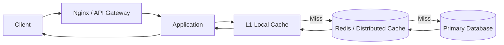
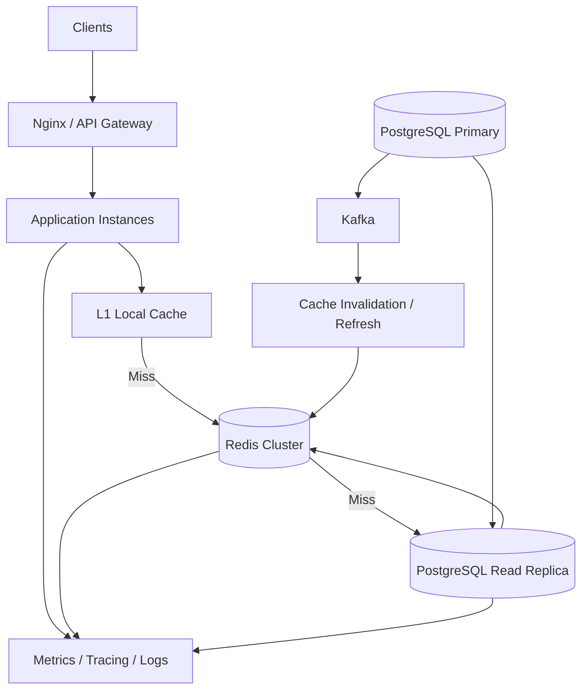

# 10- Summary

## Overview

Caching is a system design technique for reducing latency, database load, network traffic, and computational cost by storing frequently accessed or expensive-to-compute data closer to the application.

A production caching architecture is not simply:

```text
Application -> Redis -> Database
```

It is a coordinated system involving:

- Cache placement.
- Cache keys.
- TTLs.
- Eviction policies.
- Invalidation.
- Consistency.
- Replication.
- High availability.
- Failure handling.
- Stampede protection.
- Monitoring.
- Capacity planning.
- Graceful degradation.

The central engineering challenge is balancing **performance, freshness, consistency, reliability, and operational complexity**.



## Cache Fundamentals

A cache stores data that can be retrieved faster than recomputing or fetching it from the original source.

The most common backend pattern is **cache-aside**:

```text
Request
   |
   v
Check cache
   |
   +---- HIT ----> Return cached value
   |
   +---- MISS ---> Query database
                       |
                       v
                   Populate cache
                       |
                       v
                   Return value
```

The cache should generally be treated as a **performance optimization**, not the authoritative source of durable business state.

| Property | Cache | Primary Database |
|---|---|---|
| Primary purpose | Reduce read cost and latency | Durable source of truth |
| Typical latency | Very low | Higher |
| Data durability | Usually limited | High |
| Failure impact | Performance/degradation | Correctness/data availability |
| Typical storage | Memory | Disk/SSD |
| Data lifecycle | TTL/invalidation/eviction | Explicit persistence rules |

## Cache Patterns

Different workloads require different caching strategies.

| Pattern | Description | Typical Use |
|---|---|---|
| Cache-aside | Application manages reads and population | General APIs |
| Read-through | Cache loads missing values automatically | Managed caching layers |
| Write-through | Writes update cache and backing store | Stronger cache freshness |
| Write-behind | Cache acknowledges writes and persists asynchronously | High write throughput |
| Refresh-ahead | Popular entries refreshed before expiry | Hot data |
| Stale-while-revalidate | Serve stale data while refreshing | Read-heavy content |
| Request coalescing | Concurrent misses share one regeneration | Hot keys |

### Cache-Aside

Cache-aside is often the default choice for Django, FastAPI, and microservice applications because it gives the application explicit control over cache behavior.

```python
value = redis.get(key)

if value is None:
    value = load_from_database()
    redis.set(key, serialize(value), ex=300)

return value
```

The important production consideration is that cache misses must remain bounded. A cache failure should not automatically result in unlimited database traffic.

## Cache Invalidation

Invalidation determines when cached data should no longer be considered valid.

Common mechanisms include:

- TTL expiration.
- Explicit deletion.
- Versioned keys.
- Event-driven invalidation.
- Background refresh.
- Write-through updates.

A robust design often combines explicit invalidation with TTL:

```text
Database update
      |
      v
Invalidate cache
      |
      v
TTL remains as safety mechanism
```

TTL protects against stale data if an invalidation event is missed.

## TTL Design

TTL is both a **freshness mechanism** and a **load-management mechanism**.

A short TTL provides fresher data but increases cache misses.

A long TTL improves hit rate but increases the maximum period stale data can remain available.

| TTL | Freshness | Cache Hit Potential | Backend Load |
|---|---|---|---|
| Very short | High | Lower | Higher |
| Moderate | Balanced | Balanced | Balanced |
| Long | Lower | Higher | Lower |

For large populations of keys, avoid identical expiration boundaries.

Use **TTL jitter**:

```python
import random

ttl = 300 + random.randint(0, 60)
redis.set(key, value, ex=ttl)
```

This spreads expiration events over time.

## Cache Eviction

A cache has finite memory. When capacity is reached, entries must be removed according to an eviction policy.

Common strategies include:

| Policy | Behavior | Useful For |
|---|---|---|
| LRU | Removes least recently used entries | General workloads |
| LFU | Removes least frequently used entries | Stable hot-key workloads |
| Random | Removes random entries | Simple workloads |
| TTL-based | Removes expired entries | Expiration-driven caches |
| No eviction | Rejects new writes | Strict capacity control |

Eviction policy should match access patterns.

A high-volume API with a small set of very popular keys may benefit from frequency-aware eviction. A workload where recent access strongly predicts future access may benefit from recency-aware policies.

Eviction is not a substitute for capacity planning.

## Cache Stampede

A cache stampede occurs when many concurrent requests attempt to regenerate the same missing key.

```text
1,000 requests
      |
      v
Same cache key
      |
      v
Cache MISS
      |
      +--> DB
      +--> DB
      +--> DB
      +--> DB
      ...
```

The solution is to coordinate regeneration.

```text
1,000 requests
      |
      v
Cache MISS
      |
      v
One request regenerates
      |
      v
Database
      |
      v
Redis
      |
      v
All requests receive value
```

Useful techniques include:

- Distributed locks.
- Single-flight request coalescing.
- Stale-while-revalidate.
- Early refresh.
- Probabilistic refresh.

## Cache Avalanche

A cache avalanche occurs when a large number of cache entries become unavailable at approximately the same time.

Common causes include:

- Identical TTLs.
- Mass expiration.
- Cache flushes.
- Large-scale eviction.
- Redis outages.
- Cold-cache recovery.

The resulting traffic can overwhelm the backing database:

```text
Cache loss
    |
    v
Mass cache misses
    |
    v
Database traffic spike
    |
    v
Connection saturation
    |
    v
Latency + timeouts
    |
    v
Retries
    |
    v
Further overload
```

Key mitigations include:

- TTL jitter.
- Staggered expiration.
- Cache warming.
- Request coalescing.
- Database concurrency limits.
- Rate limiting.
- Backpressure.
- Graceful degradation.
- Highly available Redis.
- Controlled recovery.

## Cache Penetration

Cache penetration occurs when requests repeatedly query data that does not exist.

For example:

```text
GET /users/999999999
GET /users/999999998
GET /users/999999997
...
```

If nonexistent results are never cached, every request reaches the database.

Common mitigations include:

- Negative caching.
- Bloom filters.
- Input validation.
- Authentication and authorization.
- Rate limiting.

Negative caching should use an appropriate short TTL:

```text
user:999999999 -> NOT_FOUND -> TTL 30s
```

This protects the database without keeping nonexistent state cached indefinitely.

## Bloom Filters

A Bloom filter is a probabilistic data structure used to efficiently determine whether an item is **possibly present** or **definitely absent**.

```text
Request
   |
   v
Bloom Filter
   |
   +---- Definitely absent ---> Reject / avoid DB
   |
   +---- Possibly present ----> Redis / Database
```

Bloom filters can dramatically reduce database queries for obviously nonexistent keys.

The key property is:

> False positives are possible; false negatives are not, assuming the filter is correctly maintained.

A Bloom filter therefore answers:

```text
Definitely not present
```

or:

```text
Possibly present
```

It should not be treated as an authoritative data store.

## Distributed Caching

A distributed cache is shared by multiple application instances.

Without distributed caching:

```text
Application A -> Local Cache A
Application B -> Local Cache B
Application C -> Local Cache C
```

Each instance maintains separate state.

With Redis:

```text
Application A ---+
Application B ---+--> Redis
Application C ---+
```

This provides shared cache state across instances.

It is particularly useful for:

- Kubernetes deployments.
- Horizontally scaled APIs.
- Multiple Django/FastAPI instances.
- Microservices.
- Shared sessions.
- Shared rate limits.

The trade-off is network dependency and distributed-system complexity.

## Redis in System Design

Redis is commonly used as a distributed caching layer because it provides:

- In-memory data access.
- Low latency.
- High throughput.
- TTL support.
- Atomic operations.
- Replication.
- Cluster capabilities.
- Data structures beyond simple key/value storage.

Typical architecture:

```text
                    +--> PostgreSQL
                    |
Application --> Redis
                    |
                    +--> Kafka / Events
```

Redis should not automatically become the source of truth simply because it is fast.

Its role should be explicitly defined:

| Redis Role | Example |
|---|---|
| Cache | Product data |
| Session store | Authentication sessions |
| Rate limiter | API request counters |
| Distributed lock | Coordinating regeneration |
| Temporary state | Short-lived workflow state |
| Queue support | Background processing |
| Pub/Sub | Lightweight event distribution |

Each role has different reliability and consistency requirements.

## Multi-Level Caching

A production architecture can use multiple cache levels:

```text
Client
  |
  v
CDN / HTTP Cache
  |
  v
Application
  |
  v
L1 Local Cache
  |
  v
L2 Redis
  |
  v
Database
```

A typical request may therefore follow:

```text
L1 HIT -> fastest
   |
   v
L1 MISS
   |
   v
Redis HIT
   |
   v
Redis MISS
   |
   v
Database
```

L1 caching reduces network traffic to Redis but creates local consistency challenges.

Keep L1 TTLs short unless the data is intentionally tolerant of staleness.

## Consistency and Caching

Caching creates a consistency decision.

Suppose PostgreSQL contains:

```text
balance = 100
```

while Redis contains:

```text
balance = 80
```

The system must define which value is authoritative and how quickly the cache should converge.

Common consistency models include:

| Model | Behavior |
|---|---|
| Strong consistency | Reads reflect the latest committed state |
| Eventual consistency | Cache converges after some delay |
| Bounded staleness | Data may be stale within a known window |
| Explicit invalidation | Updates trigger cache removal |
| Versioned consistency | Consumers compare data versions |

For many read-heavy APIs, eventual consistency is acceptable.

For highly sensitive data, such as financial balances, blindly serving cached values can be unsafe.

## Read Replicas and Caching

Caching and read replicas solve different problems.

```text
Cache
  |
  +--> Reduces repeated reads

Read Replica
  |
  +--> Adds database read capacity
```

They can be combined:

```text
Application
   |
   v
Redis
   |
   +---- HIT ----> Response
   |
   +---- MISS
          |
          v
      Read Replica
          |
          v
        Redis
```

The cache should reduce repetitive reads, while replicas provide additional database capacity when cache misses occur or when queries cannot be effectively cached.

## Cache Failure Handling

A cache failure should have an explicitly designed behavior.

Possible strategies include:

### Fail Open

Continue operating using the backing store.

```text
Redis failure
    |
    v
Database fallback
```

This preserves functionality but risks overwhelming the database.

### Fail Closed

Reject or disable operations that require the cache.

```text
Redis failure
    |
    v
Endpoint unavailable
```

This protects the database but reduces availability.

### Graceful Degradation

Serve reduced functionality or stale data.

```text
Cache unavailable
    |
    +--> stale value
    +--> default value
    +--> reduced response
    +--> feature disabled
```

The correct strategy depends on the endpoint and business requirements.

## Database Protection

A cache should not be allowed to amplify traffic beyond what the database can safely handle.

Important controls include:

- Bounded connection pools.
- Query timeouts.
- Statement timeouts.
- Concurrency limits.
- Rate limiting.
- Circuit breakers.
- Load shedding.
- Backpressure.
- Read replicas.
- Graceful degradation.

A critical principle is:

> Cache misses are a normal event; unlimited cache-miss amplification is not.

## Retry Behavior

Retries can transform a cache failure into a cascading failure.

```text
Cache miss
   |
   v
Database request
   |
   v
Timeout
   |
   v
Retry
   |
   v
More database load
```

Use:

- Exponential backoff.
- Random jitter.
- Deadlines.
- Bounded retries.
- Retry budgets.
- Idempotency where appropriate.

Never configure aggressive retries without considering the downstream service's capacity.

## High Availability

For production workloads where cache availability affects system availability, consider:

- Replication.
- Multi-AZ deployment.
- Automatic failover.
- Redis Sentinel or Cluster where appropriate.
- Managed Redis services.
- Failure-domain isolation.
- Capacity headroom.

A cache architecture should answer:

> What happens if the entire cache disappears?

If the answer is "the database receives all application traffic," the database must explicitly be sized and protected for that failure mode.

## Monitoring

Caching should be observable from both the cache and application perspectives.

Important metrics include:

| Metric | Why It Matters |
|---|---|
| Cache hit ratio | Measures effectiveness |
| Cache miss QPS | Measures backend amplification |
| Redis latency | Detects cache performance issues |
| Redis memory usage | Detects capacity pressure |
| Eviction rate | Detects memory-driven data loss |
| Expiration rate | Detects TTL behavior |
| Connection count | Detects client pressure |
| Database QPS | Measures cache dependency |
| Database CPU | Detects backend saturation |
| Database connections | Detects concurrency pressure |
| API p95/p99 latency | Measures user impact |
| Error rate | Measures reliability |
| Retry rate | Detects failure amplification |

A high cache hit ratio alone is not sufficient.

For example:

```text
99% hit ratio
100,000 requests/sec
```

still means:

```text
1,000 cache misses/sec
```

At larger scale, even a small miss percentage can create substantial database load.

## Capacity Planning

Cache sizing should consider:

- Dataset size.
- Object size.
- Requests per second.
- Hit ratio.
- TTL distribution.
- Eviction rate.
- Peak traffic.
- Cache rebuild cost.
- Redis throughput.
- Network bandwidth.
- Database fallback capacity.

The key question is:

> Can the backing service survive a significant reduction in cache effectiveness?

This should be validated through load testing rather than assumed.

## Cost Considerations

Caching reduces backend compute and database workload but introduces infrastructure cost.

Costs can include:

- Redis nodes.
- Replicas.
- Cross-AZ network traffic.
- Memory consumption.
- Operational tooling.
- Monitoring.
- Cache warming.
- Additional application complexity.

Caching should therefore be justified by workload characteristics.

A cache is valuable when the cost of maintaining it is lower than the cost of repeatedly accessing or computing the underlying data.

## Security Considerations

Cache keys and values may contain sensitive information.

Avoid caching sensitive data unless the security model explicitly permits it.

Important considerations include:

- Never expose one user's cached data to another user.
- Include tenant/user identity in keys where necessary.
- Avoid predictable authorization-insensitive keys.
- Encrypt data where required.
- Protect Redis network access.
- Use authentication and authorization.
- Avoid exposing Redis directly to the public internet.
- Apply least-privilege access.
- Consider data retention requirements.

For multi-tenant systems, a key should often include tenant context:

```text
tenant:{tenant_id}:user:{user_id}:profile
```

A cache-key isolation bug can become a serious data-leak vulnerability.

## Common Production Pitfalls

### Treating Cache as the Database

Cache loss should not cause permanent data loss when the cache is intended to be disposable.

### Using Identical TTLs Everywhere

Synchronized expiration can create cache avalanches.

Use TTL jitter where appropriate.

### Ignoring Negative Results

Repeated requests for nonexistent resources can bypass the cache and overload the database.

### Unlimited Database Fallback

A cache outage can become a database outage if every request is allowed to fall through.

### Unbounded Retries

Retries amplify traffic during dependency failures.

### Flushing the Cache During Deployment

A full flush can create a cold-cache storm immediately after deployment.

### Ignoring Hot Keys

A single extremely popular key can cause stampedes even when the overall cache hit ratio is excellent.

### Assuming Redis Is Infinitely Fast

Redis latency depends on:

- Network distance.
- Payload size.
- Commands.
- CPU.
- Memory pressure.
- Connection management.
- Cluster topology.

### Using Large Cache Values

Large serialized objects increase:

- Memory consumption.
- Network traffic.
- Serialization cost.
- Latency.
- Eviction pressure.

Cache only the data needed for the access pattern.

### Forgetting Serialization Costs

For Python services, converting large Django models or complex objects to JSON can become a significant part of request latency.

Prefer compact, deliberate cache representations.

## Interview Decision Framework

When designing a caching layer, reason through these questions in order:

| Question | Design Decision |
|---|---|
| What data is expensive to retrieve? | Identify cache candidates |
| How frequently is it read? | Estimate cache benefit |
| How fresh must it be? | Choose TTL/consistency |
| How is it invalidated? | TTL/events/explicit deletion |
| What happens on a miss? | Define fallback path |
| What happens on cache outage? | Fail-open/closed/degrade |
| Can one key become extremely hot? | Add stampede protection |
| Can many keys expire together? | Add TTL jitter |
| How large can the cache become? | Choose capacity/eviction |
| How is Redis made highly available? | Replication/failover/topology |
| How is the database protected? | Limits/backpressure/load shedding |
| How is effectiveness measured? | Hit/miss/backend metrics |
| What happens after total cache loss? | Recovery and warming strategy |

This reasoning is more important than memorizing individual cache technologies.

## Reference Architecture

A production-oriented read-heavy architecture can combine several techniques:



The important characteristics are:

- Local caching for extremely hot data.
- Distributed caching for shared state.
- Database replicas for additional read capacity.
- Event-driven invalidation where appropriate.
- Bounded fallback traffic.
- Explicit observability.
- Controlled cache recovery.

## Practical Backend Strategy

For a typical Django or FastAPI API backed by PostgreSQL and Redis, a sensible baseline is:

```text
Client
  |
  v
Nginx / Load Balancer
  |
  v
Django / FastAPI
  |
  v
Redis
  |
  +---- HIT ----> Response
  |
  +---- MISS ---> PostgreSQL Read Replica
                       |
                       v
                     Redis
                       |
                       v
                    Response
```

Then progressively add protections based on actual requirements:

```text
Baseline cache-aside
        |
        v
TTL + jitter
        |
        v
Explicit invalidation
        |
        v
Request coalescing
        |
        v
Stale-while-revalidate
        |
        v
Database protection
        |
        v
High availability
        |
        v
Observability + load testing
```

Do not introduce every caching technique by default. Complexity should follow actual system requirements.

## Key Takeaways

- **Caching is a performance and scalability mechanism, not automatically a source of truth; the underlying data store should remain authoritative unless the architecture explicitly defines otherwise.**
- **Cache design requires coordinated decisions about cache patterns, TTLs, invalidation, eviction, consistency, hot keys, and failure behavior rather than simply adding Redis to an architecture.**
- **Cache failures can amplify traffic into databases and downstream services, so production systems need stampede protection, TTL jitter, bounded concurrency, backpressure, retries with jitter, and graceful degradation.**
- **A distributed cache improves horizontal scalability, but introduces distributed-system concerns around availability, consistency, invalidation, network failures, and operational complexity.**
- **The strongest caching designs are measurable and failure-aware: monitor cache misses and backend amplification, plan capacity, and explicitly test what happens when the cache becomes cold or completely unavailable.**