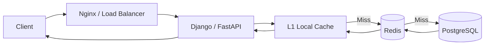

# README

## Overview

This section covers caching as a system design capability for improving application latency, reducing database load, increasing throughput, and controlling infrastructure cost.

The material progresses from fundamental caching concepts to production concerns such as distributed caching, invalidation, eviction, consistency, cache stampedes, cache penetration, cache avalanches, and Redis-based architectures.

The focus is on designing caches as part of reliable backend systems rather than treating caching as a simple key-value lookup mechanism.

## Topics

| File | Topic | Focus |
|---|---|---|
| [01- Introduction to Caching](./01-%20Introduction%20to%20Caching.md) | Introduction to Caching | Cache fundamentals, cache placement, latency, hit/miss behavior, and caching architecture |
| [02- Cache Patterns](./02-%20Cache%20Patterns.md) | Cache Patterns | Cache-aside, read-through, write-through, write-behind, refresh-ahead, and related patterns |
| [03- Cache Invalidation](./03-%20Cache%20Invalidation.md) | Cache Invalidation | TTLs, explicit invalidation, event-driven invalidation, consistency, and stale data |
| [04- Cache Eviction Policies](./04-%20Cache%20Eviction%20Policies.md) | Cache Eviction Policies | LRU, LFU, TTL-based eviction, memory pressure, and policy selection |
| [05- Distributed Cache](./05-%20Distributed%20Cache.md) | Distributed Cache | Shared caching across application instances, Redis architecture, scalability, and failure handling |
| [06- Redis in System Design](./06-%20Redis%20in%20System%20Design.md) | Redis in System Design | Redis architecture, use cases, distributed systems patterns, availability, and production design |
| [07- Cache Stampede](./07-%20Cache%20Stampede.md) | Cache Stampede | Hot keys, concurrent cache misses, request coalescing, distributed locks, and refresh strategies |
| [08- Cache Penetration](./08-%20Cache%20Penetration.md) | Cache Penetration | Nonexistent-key attacks, negative caching, Bloom filters, validation, and database protection |
| [09- Cache Avalanche](./09-%20Cache%20Avalanche.md) | Cache Avalanche | Mass expiration, cache failures, synchronized TTLs, recovery storms, and resilience techniques |
| [10- Summary](./10-%20Summary.md) | Caching Summary | Production design principles, failure modes, trade-offs, and interview decision framework |

## Navigation

### Fundamentals

- [Introduction to Caching](./01-%20Introduction%20to%20Caching.md)
- [Cache Patterns](./02-%20Cache%20Patterns.md)
- [Cache Invalidation](./03-%20Cache%20Invalidation.md)
- [Cache Eviction Policies](./04-%20Cache%20Eviction%20Policies.md)

### Distributed Caching

- [Distributed Cache](./05-%20Distributed%20Cache.md)
- [Redis in System Design](./06-%20Redis%20in%20System%20Design.md)

### Cache Failure Modes

- [Cache Stampede](./07-%20Cache%20Stampede.md)
- [Cache Penetration](./08-%20Cache%20Penetration.md)
- [Cache Avalanche](./09-%20Cache%20Avalanche.md)

### Reference

- [Caching Summary](./10-%20Summary.md)

## Recommended Reading Order

The files are organized so that each topic builds on the previous one.

```text
Introduction to Caching
        |
        v
Cache Patterns
        |
        v
Cache Invalidation
        |
        v
Cache Eviction Policies
        |
        v
Distributed Cache
        |
        v
Redis in System Design
        |
        +-------------------+
        |                   |
        v                   v
Cache Stampede       Cache Penetration
        |                   |
        +---------+---------+
                  |
                  v
           Cache Avalanche
                  |
                  v
              Summary
```

A practical progression is:

1. Understand why caching exists and where it fits in a backend architecture.
2. Learn the major cache access and write patterns.
3. Understand how cached data becomes stale and how invalidation works.
4. Learn how finite cache memory is managed through eviction policies.
5. Understand distributed caches and the implications of sharing cache state across application instances.
6. Study Redis as a production distributed caching platform.
7. Learn how concurrent cache misses create stampedes.
8. Understand how nonexistent keys can cause cache penetration.
9. Understand how mass expiration or cache failures can trigger cache avalanches.
10. Use the summary as a system design and interview reference.

## System Design Context

Caching should be evaluated as part of the complete request path rather than as an isolated infrastructure component.



The key design questions are:

- What data should be cached?
- What is the acceptable staleness window?
- Which cache pattern fits the workload?
- How should cache keys be structured?
- What happens when a cache entry expires?
- What happens when many entries expire together?
- What happens when the cache is unavailable?
- Can the database survive a cold-cache scenario?
- How are hot keys protected?
- How is cached data invalidated?
- How is cache effectiveness measured?
- How much memory and network capacity are required?
- What consistency guarantees does the application require?

## Technology Mapping

| Technology | Typical Caching Role |
|---|---|
| Redis | Distributed cache, sessions, rate limiting, locks, temporary state |
| Django | Application-level and framework-integrated caching |
| FastAPI | Application-level caching through Redis or other cache clients |
| PostgreSQL | Primary source of truth behind the cache |
| Nginx | HTTP-level caching and request-layer optimization |
| CDN | Edge caching for static and cacheable HTTP content |
| Kubernetes | Horizontal application scaling around shared distributed caches |
| Kafka | Event-driven cache invalidation and refresh workflows |
| Celery | Asynchronous cache warming and refresh operations |
| AWS | Managed infrastructure for application, database, cache, and networking layers |

## Production Design Principles

A production cache should be designed around explicit failure and consistency assumptions.

### Cache Is Usually Not the Source of Truth

For most backend systems:

```text
PostgreSQL = authoritative state
Redis      = performance layer
```

Losing Redis should normally result in degraded performance rather than permanent business-data loss.

### Cache Misses Must Be Bounded

A cache miss is expected behavior. The dangerous condition is allowing unlimited misses to reach a downstream dependency.

Use:

- Connection limits.
- Query timeouts.
- Concurrency controls.
- Rate limiting.
- Backpressure.
- Circuit breakers.
- Request coalescing.
- Graceful degradation.

### TTL Is Not a Complete Invalidation Strategy

TTL provides an upper bound on cache lifetime but may not provide sufficiently fresh data.

For frequently changing data, combine TTL with explicit or event-driven invalidation where appropriate.

### Cache Failures Must Be Designed

Ask what happens when:

```text
Redis is slow
Redis is unavailable
Redis loses data
Redis becomes completely cold
Redis reaches memory capacity
A hot key expires
Thousands of keys expire simultaneously
```

The answer should be part of the architecture rather than an operational surprise.

### Observability Is Part of Cache Design

Monitor both cache performance and downstream impact.

Important metrics include:

- Cache hit ratio.
- Cache miss rate.
- Redis latency.
- Redis memory usage.
- Eviction rate.
- Expiration rate.
- Connection count.
- Database QPS.
- Database CPU.
- Database connection utilization.
- API p95/p99 latency.
- Error rate.
- Retry rate.

A high hit ratio does not necessarily mean the system is safe. Even a small miss percentage can generate significant database traffic at high request volume.

## Key Takeaways

- **Caching should be treated as a system design capability involving latency, consistency, invalidation, capacity, reliability, and failure handling.**
- **Redis is commonly used as a distributed cache, but its role should be explicitly defined and should not replace the authoritative data store without deliberate architectural reasoning.**
- **Production caching requires protection against stampedes, penetration, avalanches, synchronized expiration, hot keys, and cache outages.**
- **Cache effectiveness must be evaluated together with downstream impact; hit ratio, miss traffic, database load, latency, memory pressure, and eviction behavior should all be observable.**
- **A strong cache design explicitly defines freshness requirements, invalidation behavior, failure handling, capacity limits, and recovery behavior before optimizing for cache hit rate.**