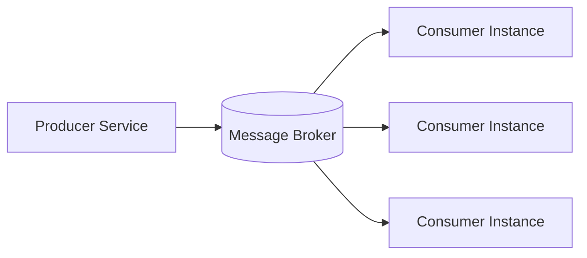
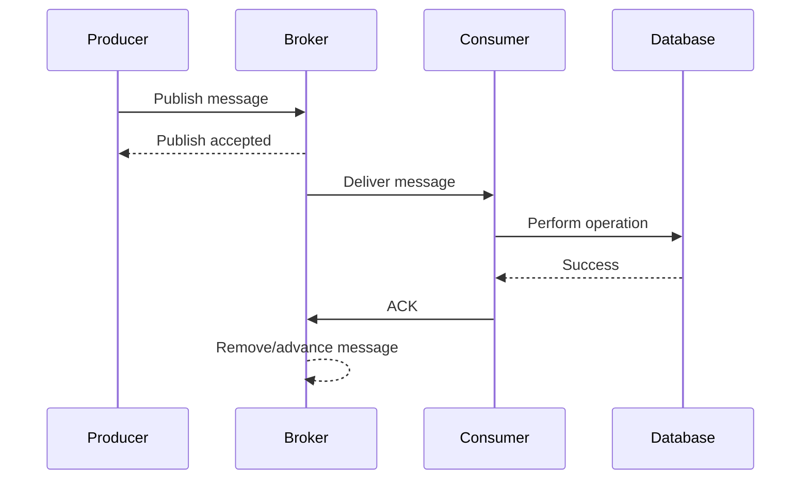
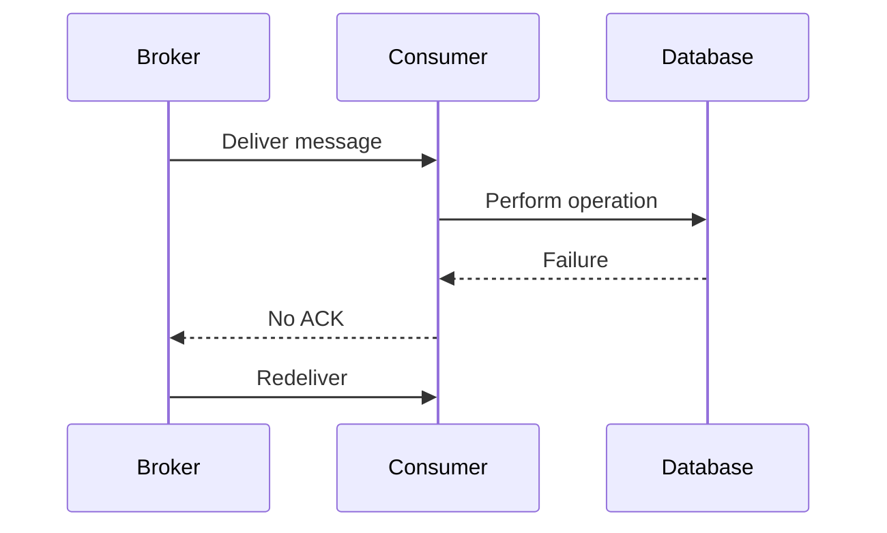
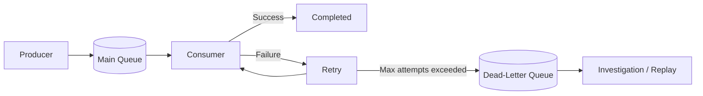
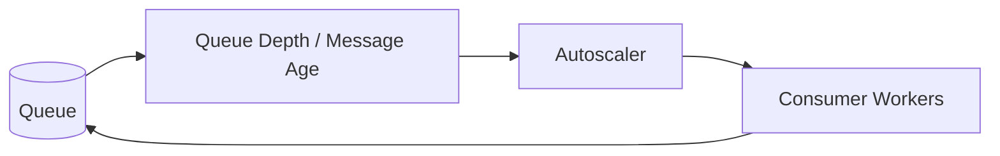
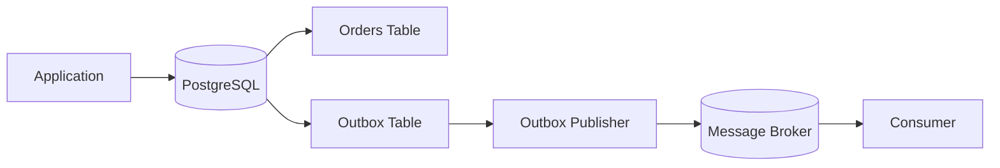
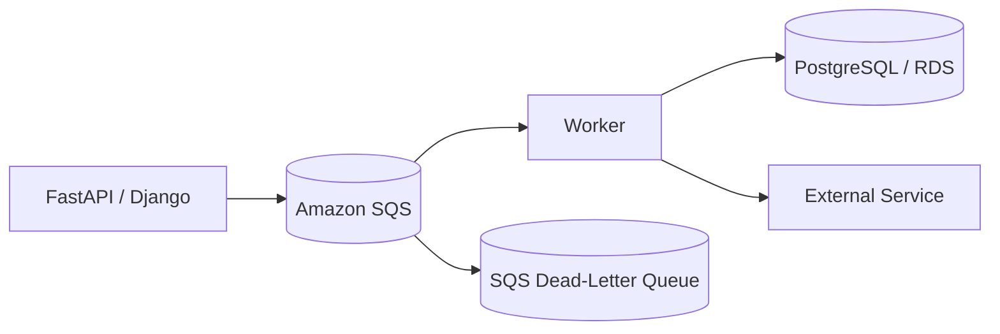
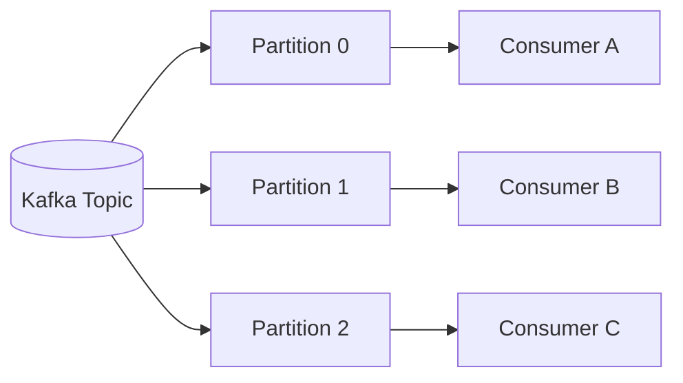
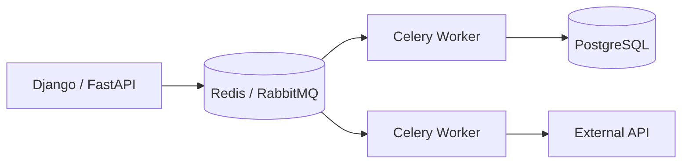
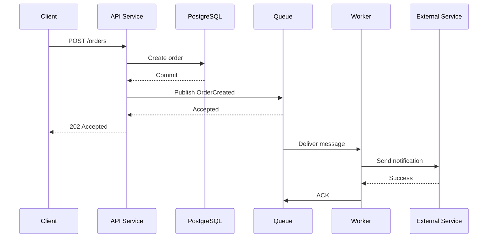

# 01- Message Queues

## Overview

A message queue is an asynchronous communication mechanism that allows one component to submit work as a message while another component processes that work independently.

Instead of requiring a producer and consumer to execute within the same request lifecycle:

```text
Synchronous:

Client
  |
  v
API
  |
  v
Database
  |
  v
External Service
  |
  v
Response
```

a message queue can decouple the request path:

```text
Asynchronous:

Client
  |
  v
API
  |
  v
Message Broker
  |
  v
Worker
  |
  +--> Database
  |
  +--> External Service
```

This separation is useful when work is slow, bursty, retryable, failure-prone, or does not need to complete before an HTTP response is returned.

Message queues are common in backend systems for:

- Background processing.
- Email and notification delivery.
- Image and video processing.
- Payment workflows.
- Order processing.
- Data synchronization.
- Webhook processing.
- Report generation.
- Database-to-service integration.
- Retryable external API calls.
- Event-driven microservices.
- Workload smoothing and backpressure.

The important system-design question is not simply whether a queue is available. It is whether asynchronous processing improves the system's reliability, scalability, latency, or isolation enough to justify the operational complexity.

## Why Message Queues Exist

A synchronous architecture creates temporal coupling between services.

If Service A calls Service B synchronously, Service A depends on Service B being:

- Available.
- Reachable.
- Responsive.
- Able to process the request.
- Able to handle the current traffic volume.

A queue removes much of this coupling.



The producer only needs to successfully submit the message to the broker. The consumer can process the message later.

This creates several important properties.

| Property | Benefit |
|---|---|
| Asynchronous execution | Slow work does not block the request |
| Buffering | Traffic bursts can be absorbed |
| Decoupling | Producer and consumer can evolve independently |
| Retryability | Failed work can be retried |
| Horizontal scaling | Consumers can be scaled independently |
| Backpressure | Processing can be limited by consumer capacity |
| Failure isolation | Consumer failures do not necessarily fail the producer |
| Work distribution | Multiple workers can process independent messages |

## Message Queue vs Direct Service Call

Consider an API that accepts an order and sends a confirmation email.

Without a queue:

```text
POST /orders
      |
      v
Order Service
      |
      v
PostgreSQL
      |
      v
Email Provider
      |
      v
HTTP Response
```

The API latency now depends on the email provider.

With a queue:

```text
POST /orders
      |
      v
Order Service
      |
      +--> PostgreSQL
      |
      +--> Queue
              |
              v
         Email Worker
              |
              v
        Email Provider
```

The API can return after the order and message have been durably accepted.

This does not mean the email is guaranteed to have been sent when the HTTP response is returned. The API contract must explicitly communicate the asynchronous nature of the operation.

## Core Components

A basic message-queue architecture contains several logical components.

### Producer

The producer creates and publishes messages.

Examples:

- Django application.
- FastAPI application.
- Payment service.
- Order service.
- Scheduled job.
- Kafka producer.
- Celery task publisher.

The producer should generally avoid embedding transient request-specific assumptions that a consumer cannot reproduce later.

A production message commonly contains:

```json
{
  "message_id": "01JABC123XYZ",
  "event_type": "order.created",
  "version": 1,
  "occurred_at": "2026-08-23T12:30:00Z",
  "correlation_id": "req-12345",
  "payload": {
    "order_id": "ord-1001"
  }
}
```

### Broker

The broker receives, stores, routes, and delivers messages.

Examples include:

- RabbitMQ.
- Amazon SQS.
- Apache Kafka.
- Redis-based queues.
- NATS.
- ActiveMQ.

The broker's responsibilities depend heavily on the technology.

A traditional work queue typically focuses on distributing work to consumers.

A log-based system such as Kafka focuses more heavily on durable ordered streams that consumers can independently replay.

### Consumer

A consumer retrieves messages and performs the required work.

For example:

```text
Queue
 |
 +--> Worker 1
 |
 +--> Worker 2
 |
 +--> Worker 3
```

Consumers should be designed to tolerate duplicate delivery unless the chosen messaging system and processing architecture provide stronger guarantees.

### Acknowledgment

An acknowledgment tells the broker that the consumer has successfully processed a message.

Conceptually:

```text
Broker
  |
  | deliver message
  v
Consumer
  |
  | process
  v
Database
  |
  | success
  v
Consumer
  |
  | ACK
  v
Broker
```

If processing fails before acknowledgment, the broker may make the message available again depending on the messaging system and configuration.

## Message Lifecycle

A typical reliable message lifecycle looks like this:



Failure changes the lifecycle:



The exact behavior varies between RabbitMQ, SQS, Kafka, and other systems.

## Queue Semantics

A queue typically represents work that needs to be processed.

A simplified model is:

```text
Producer
   |
   v
+-----------------------+
| Message Queue         |
|                       |
| M1 | M2 | M3 | M4    |
+-----------------------+
   |       |       |
   v       v       v
 Worker  Worker  Worker
```

Messages are generally consumed by one worker or one logical consumer for a work queue.

This is different from publish/subscribe systems where multiple independent subscribers may each receive the same event.

## Queue vs Pub/Sub

These models should not be confused.

| Characteristic | Work Queue | Pub/Sub |
|---|---|---|
| Primary purpose | Distribute work | Broadcast events |
| Consumers | Usually one consumer handles a message | Multiple subscribers can receive an event |
| Typical example | Generate PDF | `order.created` event |
| Message ownership | One worker | Multiple independent consumers |
| Scaling model | Add workers | Add subscribers/consumer groups |
| Typical technologies | SQS, RabbitMQ, Celery | Kafka, SNS, NATS, Pub/Sub |

A system can also combine both patterns.

For example:

```text
Order Service
     |
     v
Event Stream
     |
     +--> Billing Consumer
     |
     +--> Inventory Consumer
     |
     +--> Notification Consumer
```

## Queue Ordering

Ordering is frequently misunderstood.

A system may provide:

- Global ordering.
- Partition-level ordering.
- Queue-level ordering.
- Per-key ordering.
- No ordering guarantee.

Global ordering is expensive to maintain at scale because concurrent processing inherently introduces parallelism.

A common production compromise is ordering by entity key.

For example:

```text
customer_id = 100

event 1 -> customer 100
event 2 -> customer 100
event 3 -> customer 100
```

The system can ensure these events are processed in order while processing different customers concurrently.

Kafka commonly uses partition keys for this model.

```text
Partition 0: customer 100 events
Partition 1: customer 200 events
Partition 2: customer 300 events
```

This gives ordering within a partition while preserving parallelism across partitions.

## Delivery Semantics

Message systems commonly discuss three delivery models.

### At-Most-Once

A message is delivered zero or one time.

```text
Deliver
  |
  v
Process
  |
  v
Done
```

A failure can result in message loss.

Advantages:

- Low overhead.
- Simple processing model.
- No duplicate processing.

Limitations:

- Messages can be lost.
- Usually unsuitable for critical business operations.

### At-Least-Once

A message is delivered one or more times.

```text
Deliver
  |
  v
Process
  |
  X failure before ACK
  |
  v
Redeliver
  |
  v
Process again
```

This is common in production systems because reliable delivery is generally prioritized over avoiding duplicates.

Consumers must therefore be idempotent.

### Exactly-Once

The system attempts to provide exactly-once processing semantics.

This is considerably more complicated than simply saying "the message is processed once."

Exactly-once behavior depends on:

- Broker semantics.
- Consumer behavior.
- Transaction boundaries.
- Database behavior.
- External side effects.
- Retry behavior.
- Failure timing.

If a consumer charges a credit card, for example, broker-level exactly-once delivery does not automatically make the external payment provider operation exactly once.

A safer design usually combines durable messaging with idempotency.

## Idempotent Consumers

An idempotent consumer produces the same logical result when the same message is processed multiple times.

Suppose:

```text
message_id = msg-123
operation = create_invoice
```

The consumer can store the processed message identifier.

```sql
CREATE TABLE processed_messages (
    consumer_name TEXT NOT NULL,
    message_id TEXT NOT NULL,
    processed_at TIMESTAMPTZ NOT NULL DEFAULT NOW(),
    PRIMARY KEY (consumer_name, message_id)
);
```

The consumer can then reject duplicate processing.

Conceptually:

```python
def process_message(message):
    if already_processed(message.id):
        return

    perform_business_operation(message)

    mark_as_processed(message.id)
```

However, the important production issue is atomicity.

If the business operation succeeds but `mark_as_processed()` fails, the message may be processed again.

A stronger design places the business update and deduplication record in the same database transaction.

```python
from django.db import transaction

@transaction.atomic
def process_order_created(message_id: str, order_id: str) -> None:
    inserted = insert_processed_message_if_new(
        consumer_name="billing",
        message_id=message_id,
    )

    if not inserted:
        return

    create_invoice(order_id)
```

The exact implementation depends on the database and framework, but the principle is consistent:

> Idempotency must be designed around the side effect, not merely around message consumption.

## Visibility Timeout

Some queue systems temporarily hide a message after delivering it to a consumer.

This is commonly called a visibility timeout.

```text
Queue
 |
 | receive
 v
Worker
 |
 | message becomes invisible
 |
 +--> success --> delete/ack
 |
 +--> failure --> timeout --> visible again
```

If processing takes longer than the visibility timeout, another worker may receive the same message.

Therefore:

```text
visibility timeout > expected processing duration
```

with enough margin for normal variability.

For long-running jobs, use visibility-timeout extension mechanisms where supported.

## Retries

Retries are necessary because many failures are transient.

Examples:

- Temporary database failure.
- Network timeout.
- External API rate limit.
- Service deployment.
- DNS failure.
- Temporary dependency overload.

A typical retry strategy is exponential backoff.

```text
Attempt 1 -> immediate
Attempt 2 -> 1 second
Attempt 3 -> 2 seconds
Attempt 4 -> 4 seconds
Attempt 5 -> 8 seconds
```

Add jitter to prevent many consumers from retrying simultaneously.

```text
delay = base_delay * 2^attempt + random_jitter
```

A conceptual Python implementation:

```python
import random


def retry_delay(attempt: int, base: float = 1.0, maximum: float = 60.0) -> float:
    exponential = min(maximum, base * (2 ** attempt))
    jitter = random.uniform(0, exponential * 0.2)
    return min(maximum, exponential + jitter)
```

Retries should be bounded.

Infinite retries can create an endless failure loop and hide permanent problems.

## Dead-Letter Queues

A dead-letter queue, or DLQ, stores messages that cannot be successfully processed after an acceptable number of attempts.



A DLQ is useful for:

- Poison messages.
- Invalid payloads.
- Permanent business validation failures.
- Unexpected schema versions.
- Persistent downstream failures.

A DLQ is not a place where failed work should disappear permanently.

Production operations should define:

- DLQ monitoring.
- Alert thresholds.
- Message inspection.
- Replay procedures.
- Correction workflows.
- Retention periods.
- Access controls.

## Poison Messages

A poison message is a message that repeatedly fails processing.

For example:

```json
{
  "order_id": null,
  "customer_id": "invalid-format"
}
```

If the consumer retries this message indefinitely:

```text
Message
  |
  v
Consumer
  |
  X
  |
  v
Retry
  |
  v
Consumer
  |
  X
  |
  v
Retry
```

the message consumes worker capacity while making no progress.

Use:

- Schema validation.
- Maximum retry counts.
- Dead-letter queues.
- Error classification.
- Operational alerts.

## Backpressure

Backpressure occurs when producers generate work faster than consumers can process it.

Suppose:

```text
Incoming rate = 10,000 messages/sec
Processing rate = 6,000 messages/sec
```

The queue grows by approximately:

```text
4,000 messages/sec
```

If sustained, backlog becomes a capacity problem.

Monitor queue depth and message age.

```text
Queue depth alone:
10,000 messages

Queue depth + age:
10,000 messages
oldest message = 2 minutes
```

Message age is often more useful operationally because a queue can contain many messages while still maintaining an acceptable processing delay.

Backpressure strategies include:

- Increase consumer capacity.
- Limit producer throughput.
- Batch processing.
- Increase partition count where applicable.
- Optimize consumer processing.
- Prioritize critical work.
- Reject non-critical work.
- Apply rate limits.
- Degrade gracefully.

## Queue Depth and Consumer Scaling

A common autoscaling strategy is to scale consumers based on backlog.



For Kubernetes, consumer deployment capacity can be adjusted based on queue metrics.

A simplistic policy might be:

```text
queue depth < 1,000    -> 2 workers
queue depth < 10,000   -> 5 workers
queue depth < 50,000   -> 15 workers
queue depth >= 50,000  -> 30 workers
```

In production, scaling should account for:

- Consumer processing time.
- Maximum database connections.
- Downstream API limits.
- CPU and memory.
- Queue partitioning.
- Maximum safe concurrency.

Scaling consumers without considering downstream capacity can move the bottleneck rather than solve it.

## Message Batching

Consumers can improve throughput by processing multiple messages together.

Instead of:

```text
message -> database transaction
message -> database transaction
message -> database transaction
```

use:

```text
messages [1..100]
       |
       v
single batch operation
       |
       v
database
```

Batching can reduce:

- Network round trips.
- Transaction overhead.
- Serialization overhead.
- Database connection overhead.

However, larger batches increase:

- Processing latency.
- Failure blast radius.
- Memory usage.
- Retry complexity.

Choose batch size based on workload characteristics rather than maximizing it blindly.

## Message Size

Messages should generally contain enough information for reliable processing without becoming oversized data-transfer objects.

Prefer:

```json
{
  "event_type": "order.created",
  "order_id": "ord-1001"
}
```

over:

```json
{
  "event_type": "order.created",
  "order": {
    "id": "ord-1001",
    "customer": {},
    "items": [],
    "shipping": {},
    "payment": {},
    "large_metadata": {}
  }
}
```

Large messages increase:

- Network bandwidth.
- Broker storage.
- Serialization cost.
- Consumer memory usage.
- Retry cost.

However, using only an identifier introduces a different problem: the consumer must fetch current state from the database, which can create consistency issues.

The correct payload depends on whether the message represents:

- A command to perform work.
- An event describing historical state.
- A notification containing a reference to state.

## Commands vs Events

A command tells a system to perform an action.

```text
CreateInvoice
SendWelcomeEmail
GenerateReport
```

An event describes something that already happened.

```text
OrderCreated
PaymentCompleted
UserRegistered
```

The distinction matters because commands generally have one intended handler, while events can have multiple independent consumers.

| Property | Command | Event |
|---|---|---|
| Meaning | Request to perform work | Fact about something that happened |
| Typical naming | `CreateInvoice` | `InvoiceCreated` |
| Intent | Action | Historical fact |
| Consumers | Usually one logical handler | Potentially many |
| Coupling | More operational | More event-oriented |
| Retry semantics | Usually action-oriented | Usually event-processing-oriented |

## Transactional Messaging

One of the most difficult messaging problems is maintaining consistency between a database transaction and message publication.

Consider:

```text
BEGIN TRANSACTION

INSERT order

COMMIT

publish OrderCreated
```

If the database commit succeeds but message publishing fails:

```text
Database = success
Message   = failure
```

The order exists but downstream services never receive the event.

The reverse is also dangerous:

```text
publish OrderCreated

database transaction fails
```

Now consumers received an event for state that does not exist.

## Transactional Outbox Pattern

The transactional outbox pattern solves this by writing the business state and outgoing message to the same database transaction.



Example:

```sql
CREATE TABLE outbox_events (
    id UUID PRIMARY KEY,
    event_type TEXT NOT NULL,
    aggregate_id TEXT NOT NULL,
    payload JSONB NOT NULL,
    created_at TIMESTAMPTZ NOT NULL DEFAULT NOW(),
    published_at TIMESTAMPTZ
);
```

The application transaction writes both:

```text
orders
outbox_events
```

A separate publisher reads unpublished outbox rows and sends them to the broker.

This gives the system a durable bridge between database state and asynchronous messaging.

The publisher itself may publish a message more than once, so consumers should still be idempotent.

## Exactly-Once vs Idempotency

A common interview mistake is assuming:

```text
exactly-once delivery = exactly-once business effect
```

These are different.

For example:

```text
Broker delivers message once
        |
        v
Consumer calls payment provider
        |
        X network timeout
        |
        v
Consumer retries
```

The external payment provider may already have processed the first request.

The safer approach is to use an idempotency key:

```text
payment_id = pay-123
idempotency_key = order-1001-payment
```

The downstream service can guarantee that repeated requests with the same key do not create multiple charges.

## Ordering vs Parallelism

Ordering and throughput often compete.

Suppose there are:

```text
100,000 messages
```

and strict global ordering is required.

Processing may need to be serialized:

```text
M1 -> M2 -> M3 -> M4 -> ...
```

This limits throughput.

If ordering is only required per customer:

```text
Customer A -> A1 -> A2 -> A3
Customer B -> B1 -> B2 -> B3
Customer C -> C1 -> C2 -> C3
```

then customers can be processed concurrently.

This is often a better production design.

## Queue Durability

A message broker can be configured with different durability guarantees.

Important considerations include:

- Message persistence.
- Replication.
- Broker disk durability.
- Acknowledgment behavior.
- Replication lag.
- Failover behavior.
- Retention.
- Disaster recovery.

Do not assume:

```text
producer received HTTP 200
```

means:

```text
message is durably stored
```

The producer acknowledgment semantics must be understood for the chosen messaging platform.

## High Availability

A production messaging system should avoid a single broker failure becoming a system-wide outage.

Typical strategies include:

- Managed broker services.
- Multi-node broker clusters.
- Replication.
- Multi-AZ deployment.
- Durable storage.
- Automated failover.
- Independent consumer instances.

For AWS workloads, Amazon SQS removes much of the broker-cluster operational burden because it is a managed service.

For self-managed Kafka or RabbitMQ, cluster topology and failure handling become part of the team's operational responsibility.

## Kafka vs Traditional Message Queues

Kafka is frequently described as a message queue, but its architecture and usage model are different from traditional work queues.

| Characteristic | RabbitMQ / SQS-style Queue | Kafka |
|---|---|---|
| Primary abstraction | Queue | Distributed log |
| Consumption | Message is generally removed/acknowledged | Consumer tracks offset |
| Replay | Usually limited or explicit | Native replay through retained offsets |
| Ordering | Queue/group dependent | Ordered within partition |
| Scaling | Consumer workers | Consumer groups and partitions |
| Retention | Usually processing-oriented | Explicit retention-oriented |
| Multiple consumers | Possible | Native consumer groups |
| Best fit | Work distribution | Event streams and high-throughput pipelines |

The choice should be based on requirements rather than popularity.

Use a traditional queue when the primary problem is:

```text
"Distribute this unit of work."
```

Use Kafka when the primary problem is closer to:

```text
"Persist this stream of events so multiple consumers can process
and potentially replay it independently."
```

## RabbitMQ

RabbitMQ is a broker designed around messaging concepts such as:

```text
Producer
   |
   v
Exchange
   |
   v
Queue
   |
   v
Consumer
```

The exchange can route messages to queues based on routing configuration.

Common exchange types include:

- Direct.
- Topic.
- Fanout.
- Headers.

RabbitMQ is a strong fit for:

- Task queues.
- RPC-style asynchronous workflows.
- Routing-heavy messaging.
- Background jobs.
- Microservice integration.

## Amazon SQS

Amazon SQS is a managed queue service.

A typical AWS architecture is:



Important concepts include:

- Standard queues.
- FIFO queues.
- Visibility timeout.
- Message retention.
- Dead-letter queues.
- Long polling.
- Redrive policies.

Long polling reduces unnecessary empty receives compared with repeatedly polling with very short intervals.

## Kafka

Kafka uses topics and partitions.

```text
Topic: orders

Partition 0: M1 M4 M7 M10
Partition 1: M2 M5 M8 M11
Partition 2: M3 M6 M9 M12
```

Consumers are grouped into consumer groups.



A consumer group distributes partitions among its members.

If there are more consumers than partitions, additional consumers may remain idle.

Therefore:

```text
maximum active consumers per consumer group
<= number of partitions
```

for a given topic.

## Python and Celery

Celery provides distributed task execution for Python applications.

A common architecture is:



Example:

```python
from celery import shared_task


@shared_task(
    bind=True,
    autoretry_for=(TimeoutError,),
    retry_backoff=True,
    retry_jitter=True,
    max_retries=5,
)
def send_order_confirmation(self, order_id: str) -> None:
    order = load_order(order_id)
    send_confirmation_email(order)
```

The task should still be idempotent.

Celery does not eliminate distributed-systems problems such as:

- Duplicate execution.
- Worker crashes.
- Retry storms.
- Broker outages.
- Long-running tasks.
- External API failures.
- Database contention.

## Queue-Based Load Leveling

One of the most valuable uses of a queue is smoothing traffic spikes.

Without a queue:

```text
Traffic
  |
  v
API
  |
  v
Database

Traffic spike -> Database overload
```

With a queue:

```text
Traffic
  |
  v
API
  |
  v
Queue
  |
  +--> Worker
  +--> Worker
  +--> Worker
```

The queue absorbs the burst while workers process at a sustainable rate.

This is useful when the work can tolerate asynchronous completion.

## Request Lifecycle with Asynchronous Processing

A production API may behave like:



The `202 Accepted` response is appropriate when the operation has been accepted for asynchronous processing but is not yet complete.

The API should provide an appropriate status or query mechanism if the client needs to observe completion.

## When to Use Message Queues

Use a message queue when at least one of these conditions is significant:

| Requirement | Queue Benefit |
|---|---|
| Long-running work | Moves work outside request path |
| Burst traffic | Buffers workload |
| Independent scaling | Producers and consumers scale separately |
| Retryable operations | Supports controlled retries |
| Failure isolation | Prevents synchronous dependency chains |
| Background processing | Enables worker-based execution |
| Rate-limited dependency | Controls downstream request rate |
| Event-driven architecture | Decouples service reactions |
| Batch processing | Accumulates work for efficient processing |

## When Not to Use a Queue

A queue is not automatically an improvement.

Avoid introducing one when:

- The operation must complete synchronously.
- The workload is tiny and reliable.
- Added latency is unacceptable.
- Operational complexity outweighs the benefit.
- Strong immediate consistency is required.
- The system has no need for asynchronous execution or buffering.

For example, a simple read API:

```text
GET /users/123
```

usually does not need a message queue between the API and database.

## Queue Capacity Planning

Capacity planning should consider:

```text
incoming message rate
processing rate
average processing latency
peak traffic
consumer concurrency
message size
retention period
downstream limits
```

A basic relationship is:

```text
backlog growth = arrival rate - processing rate
```

If:

```text
arrival rate > processing rate
```

the queue grows.

For a stable system over time:

```text
average processing capacity >= average arrival rate
```

with enough additional capacity to absorb expected bursts.

## Queue Lag

Queue lag measures how far processing is behind production.

Depending on the messaging system, useful measures include:

- Number of pending messages.
- Age of oldest message.
- Consumer offset lag.
- Processing latency.
- Time from publish to completion.

For Kafka:

```text
consumer lag =
    latest available offset - consumer committed offset
```

High lag can indicate:

- Consumer slowdown.
- Insufficient partitions.
- Insufficient consumers.
- Database bottlenecks.
- External dependency latency.
- Deployment failures.
- Poison messages.

## Monitoring

A production messaging platform should expose both infrastructure and business metrics.

### Broker Metrics

Monitor:

- Queue depth.
- Message age.
- Publish rate.
- Consume rate.
- Consumer count.
- Consumer lag.
- Broker CPU.
- Broker memory.
- Disk usage.
- Network throughput.
- Replication health.
- Connection count.

### Application Metrics

Monitor:

- Processing latency.
- Success rate.
- Failure rate.
- Retry count.
- DLQ count.
- Duplicate processing.
- External dependency latency.
- Database latency.

### Business Metrics

For an order-processing system:

```text
orders_created
orders_processed
orders_failed
orders_retrying
orders_dead_lettered
```

These metrics can be more meaningful than broker metrics alone.

## Distributed Tracing

Messages should preserve trace and correlation information.

For example:

```json
{
  "message_id": "msg-123",
  "correlation_id": "req-456",
  "trace_id": "trace-789",
  "event_type": "order.created"
}
```

This allows operators to connect:

```text
HTTP request
    |
    v
Database transaction
    |
    v
Message publication
    |
    v
Consumer
    |
    v
External API
```

Without correlation identifiers, asynchronous debugging becomes significantly harder.

## Security Considerations

Messages can contain sensitive business information.

Apply:

- Encryption in transit.
- Encryption at rest.
- IAM or broker-level authorization.
- Least-privilege consumer permissions.
- Secret management.
- Payload minimization.
- Schema validation.
- Audit logging where required.

Avoid putting secrets directly into messages.

Bad:

```json
{
  "api_key": "secret-value"
}
```

Prefer a reference to securely managed configuration or credentials.

Also consider that messages may be retained longer than expected. Sensitive data in a retained event can increase the security and compliance impact of the messaging system.

## Schema Evolution

Messages become APIs between services.

Once multiple consumers depend on a message schema, changing it becomes a compatibility problem.

Prefer additive changes:

```json
{
  "order_id": "ord-123",
  "customer_id": "cus-123",
  "currency": "USD"
}
```

Adding:

```json
{
  "region": "us-east-1"
}
```

is generally safer than removing or changing the meaning of existing fields.

Include:

```json
{
  "event_type": "order.created",
  "version": 2
}
```

when explicit schema versioning is valuable.

Consumers should generally tolerate fields they do not recognize.

## Common Mistakes

### Treating Queues as Databases

A queue is designed for message delivery or streaming, not arbitrary business-state queries.

Do not use:

```text
queue -> query historical customer state
```

as a replacement for a proper data store.

### Ignoring Duplicate Messages

At-least-once delivery means duplicates are possible.

Every critical consumer should have an idempotency strategy.

### Infinite Retries

Infinite retries can create:

```text
failure -> retry -> failure -> retry -> ...
```

Use bounded retries and DLQs.

### Using Retries Without Backoff

Immediate retries can overload an already unhealthy dependency.

Use exponential backoff and jitter.

### Scaling Consumers Without Protecting the Database

Suppose:

```text
10 workers -> 100 DB connections
```

and then autoscaling creates:

```text
100 workers -> 1,000 DB connections
```

The queue may drain faster while the database collapses.

Consumer concurrency must be constrained by downstream capacity.

### Assuming Message Order

Parallel consumers, partitions, retries, and redelivery can affect ordering.

Only rely on ordering guarantees explicitly provided by the messaging architecture.

### Putting Large Payloads in Messages

Large messages increase broker storage, network cost, processing time, and retry cost.

Store large objects in object storage and send references when appropriate.

### Publishing Directly After Database Writes

This can create a database/message consistency gap.

For critical workflows, consider the transactional outbox pattern.

### Assuming `ACK` Means Business Success

An acknowledgment only has meaning within the broker's delivery semantics.

The business operation must be completed successfully before acknowledging the message.

### Ignoring Poison Messages

A malformed message can consume worker capacity indefinitely.

Use validation, bounded retries, and DLQs.

## Production Checklist

Before deploying a queue-backed workflow, verify:

- [ ] Message schema is defined and versioned where necessary.
- [ ] Delivery semantics are understood.
- [ ] Consumers are idempotent.
- [ ] Retry policy is bounded.
- [ ] Exponential backoff and jitter are used where appropriate.
- [ ] Dead-letter handling exists.
- [ ] Poison messages cannot consume workers indefinitely.
- [ ] Queue depth is monitored.
- [ ] Message age or consumer lag is monitored.
- [ ] Consumer capacity is bounded.
- [ ] Downstream database capacity is considered.
- [ ] Broker durability is appropriate.
- [ ] High availability requirements are satisfied.
- [ ] Message retention is explicitly configured.
- [ ] Sensitive payloads are protected.
- [ ] Correlation and tracing identifiers are propagated.
- [ ] Schema compatibility is tested.
- [ ] Replay procedures are documented.
- [ ] Disaster recovery requirements are defined.
- [ ] Alerts exist for growing backlog and DLQ activity.

## Interview Traps

### "Does a Queue Guarantee Exactly-Once Processing?"

No.

Many systems provide at-least-once delivery, which means duplicates are possible. Exactly-once behavior requires careful coordination between the messaging system, consumer, database, and external side effects.

### "Why Not Just Increase Consumer Count?"

Because consumers usually depend on downstream resources.

Increasing workers can overload:

- PostgreSQL.
- Redis.
- External APIs.
- Network connections.
- CPU.
- Memory.

Scaling must consider the entire dependency chain.

### "Why Is Idempotency Important?"

Because retries and redelivery can cause the same logical message to be processed more than once.

For financial, inventory, billing, and notification workflows, duplicate side effects can be expensive or dangerous.

### "What Happens If the Database Commit Succeeds but Publishing Fails?"

The database contains state that downstream consumers do not know about.

The transactional outbox pattern is a common solution.

### "Kafka or RabbitMQ?"

The answer depends on the workload.

Use the requirements to reason about:

- Throughput.
- Ordering.
- Replay.
- Retention.
- Consumer independence.
- Routing.
- Operational complexity.
- Delivery model.

There is no universally correct broker.

## Key Takeaways

- **Message queues decouple producers from consumers, enabling asynchronous processing, workload buffering, independent scaling, retries, and failure isolation.**
- **At-least-once delivery is common, so production consumers should be idempotent and protected against duplicate side effects.**
- **Retries must be bounded and use backoff and jitter; poison messages should eventually move to a dead-letter queue.**
- **Queue capacity must be designed around the entire dependency chain because scaling consumers without protecting databases and downstream services can amplify failures.**
- **For database-plus-message consistency, patterns such as the transactional outbox are often more reliable than publishing directly after a database transaction.**