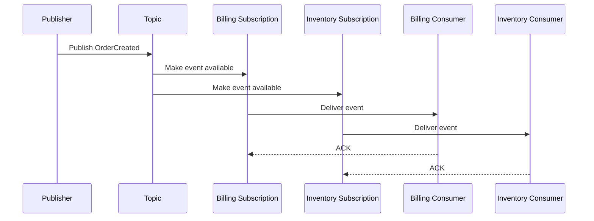
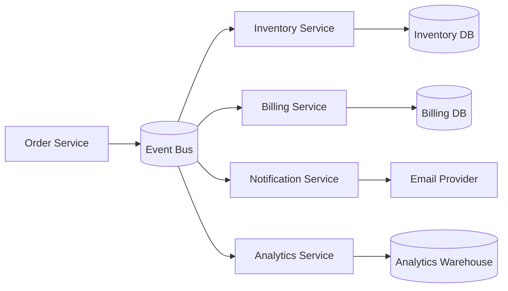
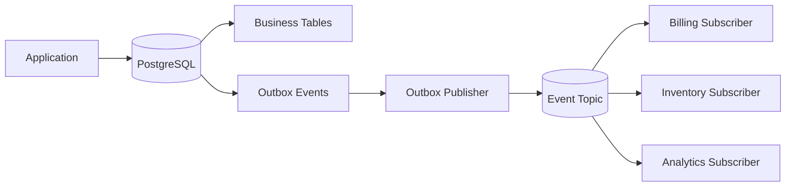

# 02- Publish Subscribe

## Overview

Publish-subscribe, commonly called **Pub/Sub**, is a messaging pattern in which a producer publishes a message to a logical destination and multiple independent consumers can receive that message.

Unlike a traditional work queue, where one consumer usually processes a message, Pub/Sub allows multiple subscribers to react independently to the same event.

```text
                    +--> Billing Service
                    |
Producer --> Topic -+--> Inventory Service
                    |
                    +--> Notification Service
                    |
                    +--> Analytics Service
```

This pattern is fundamental to event-driven architectures and is commonly implemented with systems such as Kafka, Amazon SNS, Google Cloud Pub/Sub, NATS, and RabbitMQ exchanges.

A useful mental model is:

> A queue distributes work. Pub/Sub distributes information.

For example, when an order is created:

```text
Order Service
      |
      | OrderCreated
      v
   Event Bus
      |
      +--> Inventory
      +--> Billing
      +--> Notification
      +--> Analytics
```

The Order Service does not need to know which downstream services consume the event. This reduces coupling and allows new consumers to be introduced without changing the producer.

## Why Pub/Sub Exists

A synchronous architecture creates direct dependencies between services.

```text
Order Service
     |
     +--> Inventory Service
     |
     +--> Billing Service
     |
     +--> Notification Service
     |
     +--> Analytics Service
```

This creates several problems:

- The producer must know about downstream services.
- A slow consumer increases producer latency.
- A failed dependency can affect the request.
- Adding a consumer requires modifying the producer.
- The producer becomes responsible for coordinating downstream work.
- Dependency growth creates a tightly coupled service graph.

Pub/Sub changes the architecture:

```text
                    +--> Inventory
                    |
Order Service --> Event Bus --> Billing
                    |
                    +--> Notification
                    |
                    +--> Analytics
```

The producer publishes a fact, while subscribers independently decide what to do with it.

This is particularly valuable in microservices because service ownership remains separated.

## Core Concepts

A production Pub/Sub system usually contains these logical components:

| Component | Responsibility |
|---|---|
| Publisher | Produces messages or events |
| Topic | Logical destination for published messages |
| Broker | Stores and routes messages |
| Subscription | Defines how a subscriber receives messages |
| Consumer | Processes messages |
| Consumer group | Coordinates multiple instances of one logical consumer |
| Offset / acknowledgment | Tracks consumption progress |
| Dead-letter mechanism | Captures repeatedly failing messages |

The exact terminology differs by platform.

Kafka uses:

```text
Producer -> Topic -> Partition -> Consumer Group -> Consumer
```

Amazon SNS commonly uses:

```text
Publisher -> Topic -> Subscription -> Subscriber
```

RabbitMQ can implement Pub/Sub using exchanges and multiple queues:

```text
Publisher -> Exchange -> Queue A -> Consumer A
                    |
                    +-> Queue B -> Consumer B
```

## Publish-Subscribe vs Work Queue

The most important distinction is what happens when multiple consumers exist.

### Work Queue

```text
             +--> Worker A
             |
Queue ------>+--> Worker B
             |
             +--> Worker C
```

A message is generally processed by one worker.

If:

```text
M1
```

is consumed by Worker A, Workers B and C do not independently process M1.

### Pub/Sub

```text
              +--> Subscriber A
              |
Topic --------+--> Subscriber B
              |
              +--> Subscriber C
```

Each subscriber can independently receive the published event.

| Characteristic | Work Queue | Pub/Sub |
|---|---|---|
| Primary goal | Distribute work | Distribute events |
| Message consumers | Usually one logical consumer | Multiple independent subscribers |
| Typical use | Background task | Domain event |
| Consumer independence | Lower | Higher |
| Replay | Depends on broker | Often supported |
| Example | Generate PDF | `OrderCreated` |
| Scaling | More workers | More subscribers/consumer instances |

## Topic

A topic is a logical stream or destination to which publishers send messages.

For example:

```text
orders.created
orders.updated
orders.cancelled
payments.completed
users.registered
```

A topic should represent a meaningful event domain rather than becoming a generic dumping ground.

Good:

```text
orders.created
payments.completed
inventory.reserved
```

Poor:

```text
everything
events
misc
service_messages
```

Well-defined topics make ownership, monitoring, schema evolution, access control, and operational debugging easier.

## Subscription

A subscription represents a consumer's interest in a topic.

Conceptually:

```text
                    +--> Billing Subscription
                    |
OrderCreated Topic -+--> Inventory Subscription
                    |
                    +--> Notification Subscription
```

Each subscription can have its own:

- Consumer instances.
- Retry policy.
- Dead-letter handling.
- Processing rate.
- Retention behavior.
- Monitoring.
- Access permissions.

This is one of the major advantages of Pub/Sub: subscribers can evolve independently.

## Message Lifecycle

A typical Pub/Sub lifecycle is:



The important property is that the publisher does not need to wait for Billing or Inventory to complete.

## Event vs Command

Pub/Sub is particularly effective when messages represent **events**.

An event describes something that has already happened.

```text
OrderCreated
PaymentCompleted
UserRegistered
ShipmentDispatched
```

A command requests that something happen.

```text
CreateInvoice
ReserveInventory
SendEmail
```

The distinction affects coupling.

### Event

```text
Order Service
    |
    | OrderCreated
    v
Event Bus
    |
    +--> Billing
    +--> Analytics
    +--> Notification
```

The publisher does not dictate which subscribers must act.

### Command

```text
Order Service
    |
    | ReserveInventory
    v
Inventory Service
```

The sender has a specific intended recipient and operation.

Pub/Sub is generally more natural for events, while point-to-point queues are often better for commands.

## Event-Driven Architecture

Pub/Sub is a core building block of event-driven architecture.

Consider an e-commerce system:



The Order Service publishes:

```json
{
  "event_type": "order.created",
  "event_version": 1,
  "event_id": "evt-123",
  "occurred_at": "2026-08-23T13:00:00Z",
  "aggregate_id": "order-1001",
  "payload": {
    "order_id": "order-1001",
    "customer_id": "customer-500"
  }
}
```

Each service independently reacts.

## Why Events Reduce Coupling

Without Pub/Sub:

```text
Order Service
   |
   +--> Billing API
   +--> Inventory API
   +--> Notification API
   +--> Analytics API
```

The Order Service knows the implementation details of every downstream dependency.

With Pub/Sub:

```text
Order Service
      |
      v
OrderCreated
      |
      +--> Billing
      +--> Inventory
      +--> Notification
      +--> Analytics
```

The producer only needs to understand the event contract.

This creates **temporal decoupling** and **structural decoupling**.

Temporal decoupling means the producer does not require consumers to be immediately available.

Structural decoupling means the producer does not need direct knowledge of each consumer.

## Fan-Out

Fan-out is the ability for one published event to reach multiple independent consumers.

```text
                    +--> Consumer A
                    |
Publisher --> Topic +--> Consumer B
                    |
                    +--> Consumer C
                    |
                    +--> Consumer D
```

Fan-out is useful when several business capabilities depend on the same event.

For example:

```text
UserRegistered
      |
      +--> Send welcome email
      +--> Create analytics profile
      +--> Initialize preferences
      +--> Notify CRM
```

The publisher does not execute these operations itself.

## Fan-Out Trade-Offs

Fan-out improves decoupling but increases system complexity.

One event may trigger:

```text
1 event
  |
  +--> 5 consumers
  |
  +--> 5 independent retries
  |
  +--> 5 independent failure modes
  |
  +--> 5 operational pipelines
```

The original event may therefore produce significant downstream work.

This means engineers should understand the **blast radius** of high-fan-out events.

A highly popular event should be treated as an important platform dependency.

## Kafka Pub/Sub Model

Kafka implements Pub/Sub primarily through topics, partitions, and consumer groups.

```text
                    Topic
                      |
        +-------------+-------------+
        |             |             |
    Partition 0   Partition 1   Partition 2
        |             |             |
        v             v             v
     Consumer       Consumer      Consumer
       Group A        Group A       Group A
```

A consumer group represents one logical subscriber.

Suppose:

```text
Topic: order-events

Consumer Group: billing
Consumer Group: inventory
Consumer Group: analytics
```

Then the same event can be processed independently by each group.

```text
OrderCreated
     |
     v
+------------------+
| Kafka Topic      |
+------------------+
     |
     +--> billing group
     |
     +--> inventory group
     |
     +--> analytics group
```

Within a consumer group, partitions are distributed across consumer instances.

## Consumer Groups

Consumer groups are one of the most important Kafka concepts.

Suppose a topic has three partitions:

```text
P0
P1
P2
```

and one consumer group contains:

```text
C1
C2
C3
```

Kafka can assign:

```text
P0 -> C1
P1 -> C2
P2 -> C3
```

This allows parallel processing.

Now introduce a second consumer group:

```text
billing:
  C1 -> P0
  C2 -> P1
  C3 -> P2

analytics:
  C1 -> P0
  C2 -> P1
  C3 -> P2
```

Both groups independently consume the same events.

This is how Kafka provides both:

- Fan-out across consumer groups.
- Load balancing within a consumer group.

## Consumer Group Scaling

For a Kafka topic with `N` partitions:

```text
maximum useful consumer parallelism
≈ N consumers per consumer group
```

If a topic has:

```text
3 partitions
10 consumers
```

only up to three consumers can actively own partitions at a time.

The remaining consumers are idle.

Therefore partition count becomes an architectural scaling decision.

Increasing partitions later can be possible, but it can affect:

- Ordering.
- Key distribution.
- Consumer assignments.
- Operational complexity.
- Broker resource usage.

## Partitioning and Ordering

Kafka guarantees ordering within a partition, not globally across a topic.

Suppose:

```text
customer_id = 100
```

is used as the partition key:

```text
hash(customer_id) -> Partition 2
```

Then:

```text
OrderCreated
PaymentCompleted
OrderShipped
```

for customer 100 can remain ordered within that partition.

At the same time:

```text
customer 200 -> Partition 0
customer 300 -> Partition 1
```

can be processed concurrently.

This is usually a better trade-off than requiring global ordering.

## Ordering Requirements

Before designing a Pub/Sub system, explicitly identify the ordering boundary.

Examples:

| Requirement | Suitable ordering boundary |
|---|---|
| All events globally ordered | Single stream/partition, expensive |
| Per customer | Customer ID |
| Per order | Order ID |
| Per account | Account ID |
| No ordering required | Any partitioning strategy |

Do not say "Kafka guarantees ordering" without specifying **where**.

The accurate statement is:

> Kafka preserves message order within a partition.

## Message Delivery Semantics

Pub/Sub systems can provide different delivery guarantees.

### At-Most-Once

Messages may be lost but are not intentionally redelivered.

Useful when occasional loss is acceptable.

### At-Least-Once

Messages can be delivered multiple times.

This is common and requires idempotent consumers.

### Exactly-Once

Exactly-once semantics can exist within specific system boundaries, but they should not be interpreted as a universal guarantee that every downstream business side effect happens exactly once.

For example:

```text
Kafka
  |
  v
Consumer
  |
  v
Payment Provider
```

Kafka's exactly-once processing does not automatically make the external payment operation exactly once.

For critical external side effects, use explicit idempotency keys.

## Idempotent Subscribers

Subscribers should assume that duplicate delivery is possible unless the entire processing chain explicitly guarantees otherwise.

For example:

```text
event_id = evt-123
```

The consumer can maintain a processed-event record:

```sql
CREATE TABLE processed_events (
    consumer_name TEXT NOT NULL,
    event_id TEXT NOT NULL,
    processed_at TIMESTAMPTZ NOT NULL DEFAULT NOW(),
    PRIMARY KEY (consumer_name, event_id)
);
```

The important detail is that deduplication and the business side effect should be coordinated transactionally where possible.

Otherwise:

```text
insert processed_event
      |
      X
database operation fails
```

or:

```text
business operation succeeds
      |
      X
processed_event insert fails
```

can produce inconsistent behavior.

## Retry Handling

Subscriber failures should be classified.

### Transient Failure

Examples:

- Timeout.
- Temporary database failure.
- HTTP 503.
- Rate limiting.
- Temporary network failure.

Retry with backoff.

### Permanent Failure

Examples:

- Invalid schema.
- Missing required field.
- Unsupported event version.
- Invalid business state.

Repeated retries are unlikely to help.

Route these events to a dead-letter mechanism.

A common strategy is:

```text
event
 |
 v
consumer
 |
 +--> success --> ACK
 |
 +--> transient failure --> retry
 |
 +--> permanent failure --> DLQ
```

## Dead-Letter Topics and Queues

A subscriber should not allow one permanently invalid event to block processing indefinitely.

For example:

```text
OrderCreated Topic
       |
       v
Billing Subscription
       |
       +--> Billing Consumer
               |
               +--> success
               |
               +--> failure
                       |
                       v
                 Retry Policy
                       |
                       v
                    DLQ
```

Dead-letter handling should include:

- Maximum delivery attempts.
- Error reason.
- Original event metadata.
- Timestamp.
- Consumer identity.
- Replay mechanism.
- Alerting.

## Replay

One of the strongest advantages of event-stream systems such as Kafka is replay.

Suppose Analytics has a bug.

Instead of losing historical events permanently:

```text
Topic
 |
 +--> Analytics Consumer
        |
        X bug
```

the consumer can correct the bug and process historical events again.

```text
Retained Topic
      |
      +--> reset consumer offset
      |
      v
Analytics Consumer v2
```

Replay requires the consumer to be designed accordingly.

It should be safe to process historical events without corrupting current state.

## Event Retention

Retention determines how long events remain available.

For a retained event stream:

```text
Event
  |
  v
Kafka
  |
  +--> Consumer A
  +--> Consumer B
  |
  | retained
  v
Replay later
```

Retention may be based on:

- Time.
- Storage size.
- Both.

Longer retention provides stronger replay capabilities but increases storage cost.

Retention is therefore both an operational and architectural decision.

## Event Schema Design

Events become contracts between independently deployed services.

A production event should generally include metadata such as:

```json
{
  "event_id": "evt-123",
  "event_type": "order.created",
  "event_version": 1,
  "occurred_at": "2026-08-23T13:15:00Z",
  "producer": "order-service",
  "correlation_id": "req-456",
  "aggregate_type": "order",
  "aggregate_id": "order-1001",
  "payload": {
    "order_id": "order-1001"
  }
}
```

Useful metadata includes:

- Unique event identifier.
- Event type.
- Schema version.
- Timestamp.
- Producer.
- Correlation ID.
- Aggregate identifier.
- Trace context.

This metadata significantly improves observability and debugging.

## Schema Evolution

Once several consumers depend on an event, changing its schema becomes a distributed compatibility problem.

Prefer backward-compatible changes.

For example, adding:

```json
{
  "currency": "USD"
}
```

is generally safer than changing:

```json
"amount": 100
```

from an integer to an incompatible structure.

Avoid casually removing existing fields.

Schema evolution strategies include:

- Versioned event schemas.
- Backward-compatible changes.
- Schema registries.
- Consumer contract testing.
- Explicit deprecation periods.

For Kafka-based systems, schema formats such as Avro, Protobuf, or JSON Schema can be combined with schema-registry tooling.

## Event Payload Design

There are two common approaches.

### Event Contains State

```json
{
  "event_type": "order.created",
  "order_id": "order-1001",
  "customer_id": "customer-1",
  "total": 1500,
  "currency": "USD"
}
```

Advantages:

- Consumer does not need an immediate database lookup.
- Event is more self-contained.
- Historical replay can be more deterministic.

Limitations:

- Larger messages.
- More schema evolution.
- Data duplication.

### Event Contains Reference

```json
{
  "event_type": "order.created",
  "order_id": "order-1001"
}
```

Advantages:

- Small messages.
- Less duplicated state.

Limitations:

- Consumer must query the source service or database.
- Current state may differ from the state at event time.
- Can create a database load spike.

The correct choice depends on whether the event represents a **fact about historical state** or merely a **notification that state changed**.

## Event Notification vs Event-Carried State

This distinction is important in system design.

A notification:

```text
OrderCreated
order_id = 1001
```

means:

> Something happened to order 1001.

The consumer may fetch current state.

An event-carried-state event:

```text
OrderCreated
order_id = 1001
total = 1500
currency = USD
customer_id = 500
```

contains information needed to process the event independently.

Event-carried state is often better for high-scale consumers because it reduces synchronous lookups.

However, it increases event size and schema complexity.

## Transactional Outbox with Pub/Sub

A producer can use the transactional outbox pattern to reliably publish events after committing business state.



The database transaction contains:

```text
business state
+
outbox event
```

This prevents the application from committing business state while losing the corresponding event due to a publisher failure.

The publisher can retry publishing.

Consumers must still be idempotent because the outbox publisher may publish an event more than once.

## Eventual Consistency

Pub/Sub frequently introduces eventual consistency.

Consider:

```text
Order Service
    |
    | OrderCreated
    v
Event Bus
    |
    +--> Inventory
    |
    +--> Billing
```

The order may exist immediately while Billing has not yet processed the event.

Therefore:

```text
Order state = CREATED
Billing state = PROCESSING
```

may temporarily be valid.

Systems must explicitly model this.

Avoid designing asynchronous workflows while assuming all services will observe the same state immediately.

## Distributed Transactions

Pub/Sub can reduce the need for distributed transactions.

Instead of:

```text
BEGIN distributed transaction
  |
  +--> Order
  +--> Inventory
  +--> Billing
  +--> Notification
COMMIT
```

services can own their local transactions and communicate through events.

```text
Order transaction
       |
       v
OrderCreated
       |
       +--> Inventory transaction
       |
       +--> Billing transaction
       |
       +--> Notification transaction
```

This improves service autonomy but requires:

- Idempotency.
- Retry handling.
- Compensation.
- Eventual consistency.
- Observability.

## Saga-Style Workflows

For multi-step business workflows, Pub/Sub can be combined with saga-style orchestration or choreography.

Example:

```text
OrderCreated
     |
     v
InventoryReserved
     |
     v
PaymentCompleted
     |
     v
OrderConfirmed
```

If payment fails:

```text
PaymentFailed
     |
     v
ReleaseInventory
```

This avoids requiring every service to participate in one distributed database transaction.

However, saga-based workflows introduce their own complexity around:

- Compensation.
- Duplicate events.
- Ordering.
- Partial failure.
- Workflow observability.
- Recovery.

## Backpressure

Pub/Sub can absorb bursts, but it cannot eliminate capacity constraints.

Suppose:

```text
Publisher rate = 50,000 events/sec
Subscriber processing = 20,000 events/sec
```

Backlog grows.

The system must respond through:

- Consumer scaling.
- Partition scaling.
- Batching.
- Processing optimization.
- Rate limiting.
- Prioritization.
- Load shedding where appropriate.

Do not interpret a growing backlog as successful buffering. It is also a signal that processing capacity is insufficient.

## Hot Partitions

Partitioning introduces another failure mode: uneven key distribution.

Suppose:

```text
customer_id = 1
```

generates most of the traffic.

If all events hash to one partition:

```text
Partition 0 -> 90% of traffic
Partition 1 -> 3%
Partition 2 -> 3%
Partition 3 -> 4%
```

adding consumers does not solve the bottleneck because only one consumer can process that hot partition at a time within the consumer group.

Therefore partition keys should be selected using both:

- Ordering requirements.
- Traffic distribution.

## Fan-Out and Cost

Every additional subscriber creates additional processing.

For:

```text
1 million events/day
10 subscribers
```

the system may perform approximately:

```text
10 million consumer deliveries/day
```

depending on the platform's delivery model.

Consider:

- Broker costs.
- Network traffic.
- Consumer compute.
- Storage.
- Database reads.
- External API calls.

Do not create subscriptions simply because they are technically cheap to create.

## Security

Pub/Sub systems often contain sensitive business events and therefore require strong access control.

Use:

- TLS for network communication.
- Encryption at rest.
- Least-privilege publisher permissions.
- Least-privilege subscriber permissions.
- Topic-level or subscription-level authorization.
- Secret management.
- Audit logging.
- Payload minimization.

For example:

```text
Billing Consumer
   |
   +--> Can read payments topic
   |
   X--> Cannot read internal HR topic
```

A subscriber should receive only the topics required for its responsibilities.

## Multi-Tenant Security

In multi-tenant systems, avoid accidentally exposing one tenant's data to another.

Events should carry tenant context where appropriate:

```json
{
  "event_type": "invoice.created",
  "tenant_id": "tenant-123",
  "invoice_id": "invoice-456"
}
```

Authorization should be enforced at the infrastructure and application layers.

Do not rely solely on a `tenant_id` field for isolation.

## Monitoring

A production Pub/Sub system should monitor both infrastructure and business behavior.

### Topic Metrics

Monitor:

- Publish rate.
- Publish errors.
- Message size.
- Throughput.
- Retention usage.

### Subscription Metrics

Monitor:

- Backlog.
- Message age.
- Consumer lag.
- Acknowledgment latency.
- Retry rate.
- Dead-letter count.
- Consumer count.

### Consumer Metrics

Monitor:

- Processing latency.
- Error rate.
- Throughput.
- Database latency.
- External API latency.
- Duplicate processing.
- Retry count.

### Business Metrics

For an order platform:

```text
orders_created
orders_billed
orders_inventory_reserved
orders_failed
orders_stuck
```

These often provide more useful operational information than broker metrics alone.

## Distributed Tracing

An asynchronous system should propagate tracing metadata.

```text
HTTP Request
     |
     v
Order Service
     |
     v
OrderCreated
     |
     +--> Billing
     |
     +--> Inventory
```

The event should carry correlation or trace context so operators can reconstruct the distributed workflow.

Without this:

```text
API request -> unknown event -> unknown consumer failure
```

becomes difficult to debug.

With it:

```text
trace-123
  |
  +--> HTTP request
  +--> database operation
  +--> event publication
  +--> billing processing
  +--> inventory processing
```

the workflow becomes observable.

## Failure Isolation

One of the strongest benefits of Pub/Sub is isolating subscribers from each other.

Suppose Billing is unavailable:

```text
OrderCreated
    |
    +--> Inventory -> success
    |
    +--> Analytics -> success
    |
    +--> Billing -> failure
```

Billing's failure should not necessarily prevent Inventory or Analytics from processing the event.

Each subscriber can maintain independent retry state.

This is significantly safer than having the producer synchronously call all downstream services.

## Replay and Reprocessing

Replay is valuable when:

- A consumer has a software bug.
- A new consumer is introduced.
- Historical analytics need to be rebuilt.
- Data needs to be migrated.
- A downstream system was unavailable.

A replayable architecture should ensure consumers can distinguish between:

```text
live processing
```

and:

```text
historical replay
```

where necessary.

Replay should also be controlled because reprocessing millions of events can generate significant load.

## New Consumer Introduction

A major architectural advantage of Pub/Sub is adding a new consumer without modifying the producer.

Before:

```text
Order Service
  |
  +--> Billing
  +--> Inventory
```

New requirement:

```text
Fraud Detection
```

With Pub/Sub:

```text
OrderCreated
    |
    +--> Billing
    +--> Inventory
    +--> Fraud Detection
```

The Order Service does not necessarily need a code deployment.

This enables independent team ownership and deployment.

## Common Mistakes

### Treating Pub/Sub Like a Synchronous API

Publishing an event does not mean subscribers have completed their work.

Avoid promises such as:

```text
POST /orders -> 200 -> inventory definitely reserved
```

if Inventory operates asynchronously.

Represent asynchronous state explicitly.

### Assuming All Subscribers Process Events Simultaneously

Subscribers operate independently.

One may process an event immediately while another may have seconds or minutes of lag.

Design for independent progress.

### Assuming Global Ordering

Kafka ordering is partition-scoped.

Other platforms have their own ordering semantics.

Always identify the required ordering boundary.

### Ignoring Duplicate Delivery

Subscribers should be idempotent.

A duplicate event should not:

```text
charge a customer twice
decrement inventory twice
send duplicate notifications
```

### Creating Excessive Subscribers

Every subscriber adds operational and computational cost.

Create subscribers based on actual business ownership and processing requirements.

### Using One Consumer Group for Independent Applications

In Kafka, independent logical applications should generally use separate consumer groups.

For example:

```text
billing group
analytics group
notification group
```

If Billing and Analytics share one group, Kafka treats them as competing consumers rather than independent subscribers.

### Using an Unstable Partition Key

A poor partition key can create hot partitions and destroy expected parallelism.

Choose keys based on both distribution and ordering requirements.

### Ignoring Schema Evolution

An event is an API contract.

Changing fields without considering existing consumers can break production systems.

### Publishing Before Database Commit

Publishing an event before the corresponding database transaction commits can produce events describing state that ultimately does not exist.

Use transactional patterns such as an outbox when consistency matters.

### Assuming Replay Is Free

Replaying a large event stream can create significant:

- CPU load.
- Database load.
- Network traffic.
- External API calls.
- Cost.

Replay should be rate-limited and operationally controlled.

## Production Design Checklist

Before introducing Pub/Sub into a production architecture, verify:

- [ ] Events have clear ownership.
- [ ] Topic naming is consistent.
- [ ] Event schemas are documented.
- [ ] Schema evolution rules are defined.
- [ ] Event IDs are unique.
- [ ] Correlation and tracing metadata are propagated.
- [ ] Delivery semantics are understood.
- [ ] Consumers are idempotent.
- [ ] Retry policies are bounded.
- [ ] Dead-letter handling exists.
- [ ] Consumer lag is monitored.
- [ ] Backlog and message age are monitored.
- [ ] Partition strategy is documented where applicable.
- [ ] Ordering requirements are explicit.
- [ ] Hot-partition risks are considered.
- [ ] Consumer scaling limits are understood.
- [ ] Downstream database capacity is protected.
- [ ] Sensitive payloads are protected.
- [ ] Topic and subscription access is least-privilege.
- [ ] Replay procedures are documented.
- [ ] Event retention is intentional.
- [ ] Disaster recovery requirements are defined.
- [ ] Business-level processing metrics exist.

## Interview Traps

### "What Is the Difference Between Pub/Sub and a Queue?"

A queue generally distributes a unit of work among competing consumers.

Pub/Sub distributes an event to multiple independent subscribers.

The key difference is **consumer independence**.

### "Does Kafka Broadcast Every Message to Every Consumer?"

Not to every consumer instance.

Kafka broadcasts logically across **consumer groups**.

Each consumer group independently receives the topic's events, while consumers within the same group divide partitions among themselves.

### "Why Use Consumer Groups?"

Consumer groups provide two properties:

- Horizontal scaling within one logical application.
- Independent consumption across different applications.

### "Does Pub/Sub Guarantee Exactly-Once Business Processing?"

No.

Even if the broker provides strong delivery semantics, downstream side effects may still be repeated.

Idempotency remains important.

### "How Do You Maintain Ordering in Kafka?"

Choose a partition key that represents the required ordering boundary.

For example:

```text
order_id -> partition
```

Events for the same order then remain ordered within that partition.

### "Why Use an Outbox?"

It prevents the classic failure where:

```text
database commit succeeds
event publication fails
```

The business state and outbox record are committed together, and a separate publisher reliably forwards the event.

## Key Takeaways

- **Pub/Sub decouples publishers from independent subscribers, making it a strong foundation for event-driven microservices and fan-out workflows.**
- **Kafka consumer groups provide independent subscriptions across applications while distributing partitions among instances of the same application.**
- **At-least-once delivery, retries, and replay make idempotent consumers and explicit event contracts essential production requirements.**
- **Partitioning is both a scalability and ordering decision; choose keys that satisfy ordering requirements without creating hot partitions.**
- **Reliable Pub/Sub architectures require more than a broker: schema evolution, observability, failure isolation, security, retention, replay, and transactional publication must be designed explicitly.**