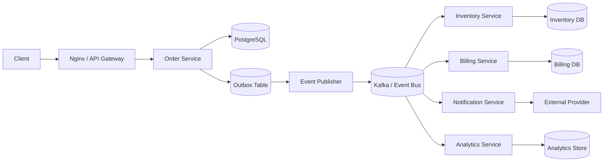
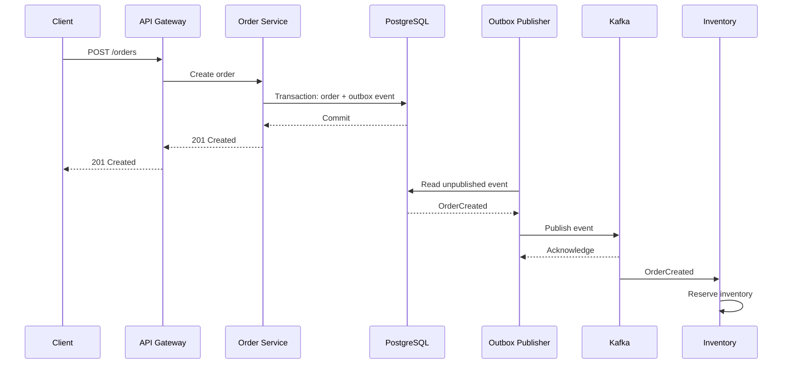
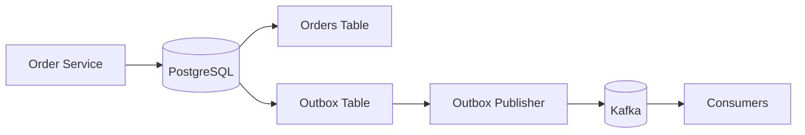

# 03- Event-Driven Architecture

## Overview

Event-driven architecture (EDA) is a distributed architecture in which components communicate by producing and consuming events rather than relying exclusively on direct synchronous calls.

An **event** represents a fact that has already occurred:

```text
OrderCreated
PaymentCompleted
InventoryReserved
ShipmentDispatched
UserRegistered
```

Instead of tightly coupling services through synchronous request chains:

```text
Client
  |
  v
Order Service
  |
  +--> Inventory Service
  |
  +--> Payment Service
  |
  +--> Notification Service
```

an event-driven architecture can publish domain events through a messaging infrastructure:

```text
Client
  |
  v
Order Service
  |
  | OrderCreated
  v
Event Broker
  |
  +--> Inventory Service
  +--> Payment Service
  +--> Notification Service
  +--> Analytics Service
```

The producer does not need to know every consumer. Consumers can evolve independently, process events asynchronously, retry failures, and scale according to their own workloads.

EDA is particularly useful for microservices, asynchronous workflows, high-throughput systems, integration architectures, audit pipelines, and systems where temporal decoupling is valuable.

However, EDA is not simply "replace REST with Kafka." It introduces eventual consistency, duplicate processing, ordering constraints, schema evolution, observability challenges, replay semantics, and operational complexity. A senior-level design must account for those trade-offs explicitly.

## Why Event-Driven Architecture Exists

Synchronous service-to-service communication creates temporal and structural coupling.

Consider:

```text
Order API
   |
   +--> Inventory API
   |
   +--> Payment API
   |
   +--> Notification API
```

A request can become:

```text
Client
  |
  v
Order
  |
  v
Inventory
  |
  v
Payment
  |
  v
Notification
```

If each operation takes 100 ms, the total latency can become substantial. More importantly, a downstream failure can propagate upstream.

For example:

```text
Payment Service unavailable
        |
        v
Order request fails
        |
        v
Client receives error
```

EDA allows the system to separate the initial transaction from downstream reactions:

```text
Order Service
     |
     | OrderCreated
     v
Event Broker
     |
     +--> Inventory
     +--> Payment
     +--> Notification
```

The Order Service can commit its local transaction without requiring every downstream service to be available at that exact moment.

This provides:

- Temporal decoupling.
- Reduced synchronous latency.
- Independent scaling.
- Failure isolation.
- Independent deployment.
- Easier fan-out.
- Asynchronous processing.
- Event replay in systems that retain events.

The trade-off is that the system becomes more difficult to reason about because state changes propagate asynchronously.

## Core Concepts

An event-driven system typically contains these components:

| Component | Responsibility |
|---|---|
| Producer | Creates and publishes events |
| Event | Immutable representation of something that happened |
| Broker | Transports and often persists events |
| Topic / Stream | Logical event destination |
| Consumer | Processes events |
| Consumer Group | Coordinates instances of one logical consumer |
| Offset / Acknowledgment | Tracks processing progress |
| Dead-Letter Queue | Stores repeatedly failing events |
| Schema Registry | Manages event schema compatibility |
| Outbox | Reliably connects database transactions to event publication |

The exact terminology depends on the messaging platform.

Common implementations include:

- Apache Kafka
- Amazon SNS
- Amazon SQS
- Amazon EventBridge
- Google Cloud Pub/Sub
- RabbitMQ
- NATS

## Event

An event is a statement about something that happened.

Good event names generally use past-tense semantics:

```text
OrderCreated
PaymentAuthorized
InventoryReserved
UserRegistered
InvoiceGenerated
```

Avoid event names that sound like commands:

```text
CreateOrder
ChargePayment
ReserveInventory
```

Those describe requested actions rather than facts.

An event should generally contain enough metadata for reliable processing and observability.

```json
{
  "event_id": "evt-8f13",
  "event_type": "order.created",
  "event_version": 1,
  "occurred_at": "2026-08-23T13:00:00Z",
  "producer": "order-service",
  "correlation_id": "req-123",
  "aggregate_type": "order",
  "aggregate_id": "order-1001",
  "payload": {
    "order_id": "order-1001",
    "customer_id": "customer-500",
    "amount": 1499,
    "currency": "INR"
  }
}
```

Useful metadata includes:

- `event_id`
- `event_type`
- `event_version`
- `occurred_at`
- `producer`
- `correlation_id`
- `aggregate_type`
- `aggregate_id`
- Trace context

## Event Immutability

An event should normally be treated as an immutable historical fact.

For example:

```text
OrderCreated
```

should not later be modified into:

```text
OrderCreated
total = 500
```

because another consumer may already have processed the original event.

If the order changes, publish another event:

```text
OrderCreated
OrderUpdated
OrderCancelled
```

This preserves the historical sequence of facts.

Immutability becomes especially important when events are retained and replayed.

## Event vs Command

The distinction between an event and a command is important.

An event says:

> This happened.

A command says:

> Please make this happen.

### Event

```text
Order Service
     |
     | OrderCreated
     v
Event Broker
     |
     +--> Billing
     +--> Inventory
     +--> Analytics
```

The producer does not necessarily know which services will react.

### Command

```text
Order Service
     |
     | ReserveInventory
     v
Inventory Service
```

The sender has a specific target and intended operation.

A system can use both patterns.

```text
Command
   |
   v
Inventory Service
   |
   | InventoryReserved
   v
Event Broker
```

This distinction becomes important when designing service boundaries and contracts.

## Event-Driven vs Request-Driven Architecture

The two approaches solve different problems.

| Characteristic | Request-Driven | Event-Driven |
|---|---|---|
| Communication | Direct | Through event infrastructure |
| Coupling | Higher | Lower |
| Response | Immediate | Usually asynchronous |
| Consistency | Often stronger | Often eventual |
| Failure propagation | More direct | More isolated |
| Replay | Usually unavailable | Often possible |
| Debugging | Simpler | More complex |
| Latency | Predictable for synchronous work | Variable |
| Scaling | Request-driven | Consumer-driven |
| Best for | Queries and immediate commands | Events and asynchronous workflows |

Most production systems use both.

For example:

```text
REST/gRPC
   |
   v
Order Service
   |
   +--> PostgreSQL
   |
   +--> Kafka
          |
          +--> Billing
          +--> Analytics
```

Synchronous APIs are often appropriate for immediate request/response interactions, while events handle asynchronous propagation.

## Event-Driven Architecture Flow

A typical architecture looks like:



The key architectural boundary is:

```text
Transactional application state
            |
            v
       Event publication
            |
            v
      Asynchronous world
```

This boundary must be designed carefully because failures can occur between the database transaction and message publication.

## Request Lifecycle

Consider:

```text
POST /orders
```

A production flow might look like:



Notice that Inventory processing is not part of the synchronous API transaction.

This gives better request latency and failure isolation, but the inventory state may temporarily lag behind the order state.

## Eventual Consistency

Event-driven systems frequently introduce eventual consistency.

Immediately after:

```text
OrderCreated
```

the following states may temporarily exist:

```text
Order DB:
  order = CREATED

Inventory DB:
  reservation = NOT_PROCESSED

Billing DB:
  payment = NOT_STARTED
```

After asynchronous processing:

```text
Order DB:
  order = CREATED

Inventory DB:
  reservation = RESERVED

Billing DB:
  payment = AUTHORIZED
```

This is not necessarily a failure. It is an expected consistency model.

The application must represent intermediate states explicitly.

For example:

```text
CREATED
PAYMENT_PENDING
INVENTORY_PENDING
CONFIRMED
FAILED
CANCELLED
```

Do not build an asynchronous architecture while assuming all services immediately observe the same state.

## When to Use Event-Driven Architecture

EDA is particularly useful when:

### Independent Consumers Need the Same Event

```text
UserRegistered
    |
    +--> Email
    +--> CRM
    +--> Analytics
    +--> Recommendation Engine
```

### Work Does Not Need to Complete During the Request

Examples:

- Sending email.
- Generating reports.
- Updating search indexes.
- Analytics processing.
- Image processing.
- Audit logging.

### Traffic Is Bursty

A broker can absorb temporary bursts:

```text
Traffic spike
     |
     v
Event Broker
     |
     v
Consumers process at sustainable rate
```

### Services Need Temporal Decoupling

The producer can publish an event even when consumers are temporarily unavailable, assuming the broker retains the event.

### Independent Teams Own Different Capabilities

Events create stable integration boundaries between teams.

## When Not to Use It

EDA is not automatically better.

Avoid introducing asynchronous messaging when:

- A simple synchronous database transaction is sufficient.
- The operation requires an immediate response from another service.
- The workflow is small and does not benefit from decoupling.
- Operational complexity outweighs the scalability benefit.
- The team cannot operate the messaging infrastructure reliably.
- Strong synchronous consistency is a hard requirement.

For example:

```text
GET /users/123
```

usually does not need Kafka.

Likewise:

```text
POST /auth/login
```

typically requires immediate request/response behavior.

Use asynchronous architecture because the problem requires it, not because event-driven systems are fashionable.

## Event Producers

A producer should focus on publishing facts rather than coordinating all downstream work.

Poor design:

```python
def create_order(order):
    save_order(order)
    charge_payment(order)
    reserve_inventory(order)
    send_email(order)
    update_analytics(order)
```

This creates strong coupling.

A more event-driven design is:

```python
def create_order(order):
    save_order(order)
    create_outbox_event(
        event_type="order.created",
        aggregate_id=order.id,
    )
```

Downstream services independently process the event.

## Transactional Outbox

The transactional outbox pattern is one of the most important production patterns in EDA.

Without an outbox:

```text
BEGIN
  |
  +--> Save order
  |
COMMIT
  |
  +--> Publish event
```

A failure between commit and publish can create:

```text
Database:
  Order exists

Broker:
  OrderCreated missing
```

The system is now inconsistent.

With an outbox:

```text
BEGIN
  |
  +--> Save order
  +--> Save OrderCreated in outbox
  |
COMMIT
```

A separate publisher later sends the event.



The database transaction guarantees that business state and the intent to publish are committed together.

The publisher may still publish an event more than once, so consumers must remain idempotent.

## Idempotent Consumers

At-least-once delivery means a consumer can receive:

```text
evt-123
evt-123
```

The consumer should safely handle this.

For example:

```sql
CREATE TABLE processed_events (
    consumer_name TEXT NOT NULL,
    event_id TEXT NOT NULL,
    processed_at TIMESTAMPTZ NOT NULL DEFAULT NOW(),
    PRIMARY KEY (consumer_name, event_id)
);
```

The consumer can use the event ID as a deduplication key.

Where possible, the deduplication record and business update should be part of the same database transaction.

This is especially important for operations such as:

- Charging payments.
- Decrementing inventory.
- Creating invoices.
- Issuing rewards.
- Sending externally visible actions.

For external APIs, use their idempotency mechanisms where available.

## Delivery Semantics

EDA designs must explicitly choose delivery semantics.

| Semantics | Behavior | Typical implication |
|---|---|---|
| At-most-once | Event may be lost | Consumer need not handle duplicates |
| At-least-once | Event may be delivered repeatedly | Consumer must be idempotent |
| Exactly-once | Duplicate processing can be prevented within defined boundaries | Does not automatically guarantee external side-effect exactly-once |

At-least-once is often the practical default.

A senior design should never say:

> The message will be processed exactly once.

Instead specify:

> The broker provides at-least-once delivery, and the consumer uses an idempotency key to make the business operation effectively once-only.

## Message Ordering

Ordering is not automatically global.

Kafka, for example, guarantees ordering within a partition.

Suppose:

```text
order-1001
```

produces:

```text
OrderCreated
PaymentCompleted
OrderShipped
```

Using:

```text
partition_key = order_id
```

can keep those events in the same partition.

```text
hash(order-1001) -> Partition 2

Partition 2:
  OrderCreated
  PaymentCompleted
  OrderShipped
```

The ordering requirement should be explicitly defined.

| Requirement | Example key |
|---|---|
| Per order | `order_id` |
| Per customer | `customer_id` |
| Per account | `account_id` |
| Global ordering | Single ordered stream |
| No ordering | Load-balanced partitioning |

Global ordering usually reduces scalability and should only be introduced when required.

## Kafka Consumer Groups

Kafka uses consumer groups to combine Pub/Sub and horizontal scaling.

Suppose:

```text
Topic: order-events
```

has:

```text
billing group
inventory group
analytics group
```

Each group independently consumes the event stream.

```text
                    Kafka Topic
                         |
          +--------------+--------------+
          |              |              |
       billing        inventory      analytics
        group           group           group
```

Within a group, partitions are distributed among instances.

```text
Topic partitions:
P0 P1 P2 P3

Billing consumers:
C1 -> P0, P1
C2 -> P2, P3
```

A new consumer group can be introduced without modifying the producer.

This is one of the major architectural benefits of event-driven systems.

## Partitioning

Partitioning determines how events are distributed for parallel processing.

A common strategy is:

```text
partition_key = aggregate_id
```

For example:

```text
order_id
```

This provides:

- Per-order ordering.
- Parallelism across different orders.
- Predictable ownership.

However, a poor key can produce hot partitions.

Suppose:

```text
90% of events -> Partition 0
10% of events -> Partitions 1-9
```

Adding consumers does not fix the hot partition.

Partition strategy therefore combines:

- Ordering requirements.
- Traffic distribution.
- Consumer parallelism.
- Broker capacity.

## Backpressure

A broker can buffer work but cannot create unlimited processing capacity.

Suppose:

```text
Producer = 100,000 events/sec
Consumer = 60,000 events/sec
```

The backlog grows:

```text
Backlog
  |
  |       /
  |      /
  |     /
  |____/____________ Time
```

This can eventually exhaust:

- Broker storage.
- Consumer memory.
- Database capacity.
- External service quotas.

Backpressure strategies include:

- Horizontal consumer scaling.
- More partitions where appropriate.
- Batch processing.
- Consumer optimization.
- Rate limiting.
- Prioritization.
- Load shedding.
- Downstream capacity protection.

Monitor backlog age, not only message count.

## Retry Strategy

Retries should distinguish transient and permanent failures.

Transient:

```text
HTTP 503
Database timeout
Connection reset
Rate limit
```

Permanent:

```text
Invalid schema
Missing required field
Unsupported version
Invalid business state
```

A typical workflow:

```text
Consumer
   |
   +--> Success --------> ACK
   |
   +--> Transient ------> Retry with backoff
   |
   +--> Permanent ------> Dead-letter
```

Use exponential backoff with jitter where appropriate.

Avoid immediate tight retry loops because they can amplify an outage.

## Dead-Letter Handling

A dead-letter queue or topic prevents permanently failing messages from continuously blocking normal processing.

```text
Main Topic
    |
    v
Consumer
    |
    +--> success
    |
    +--> failure
           |
           v
        retries
           |
           v
          DLQ
```

A DLQ should preserve enough context to investigate and replay the event:

- Original event.
- Event ID.
- Consumer.
- Failure reason.
- Retry count.
- First failure timestamp.
- Last failure timestamp.
- Correlation ID.

A DLQ without monitoring is not a reliability mechanism. It is simply a place where failures disappear.

## Event Replay

Event retention enables replay in platforms such as Kafka.

Replay can be useful when:

- A consumer had a bug.
- A new consumer is introduced.
- A database needs rebuilding.
- Analytics must be recalculated.
- A downstream system was unavailable.

For example:

```text
Retained Kafka Topic
       |
       +--> Existing consumers
       |
       +--> New consumer
       |
       +--> Rebuild consumer
```

Replay requires consumers to be designed for historical processing.

Do not assume replay is harmless. Reprocessing millions of events can create substantial:

- Database load.
- CPU consumption.
- Network traffic.
- External API traffic.
- Infrastructure cost.

Replay should therefore be controlled and rate-limited.

## Schema Evolution

Events are distributed API contracts.

If ten services consume:

```text
OrderCreated
```

then changing its schema is equivalent to changing an API used by ten clients.

Prefer backward-compatible changes.

Safe evolution often includes:

- Adding optional fields.
- Preserving existing fields.
- Explicit versioning.
- Schema compatibility checks.
- Consumer contract testing.
- Deprecation periods.

Avoid changing:

```json
"amount": 100
```

into:

```json
"amount": {
  "value": 100,
  "currency": "INR"
}
```

without considering existing consumers.

Schema technologies can include:

- JSON Schema.
- Protobuf.
- Avro.
- Schema registries.

## Event-Carried State

There are two broad event styles.

### Notification Event

```json
{
  "event_type": "order.created",
  "order_id": "order-1001"
}
```

The consumer receives an identifier and may query another service.

Advantages:

- Small message.
- Less duplicated state.

Limitations:

- Additional network calls.
- Current state may differ from historical state.
- Can create read spikes.

### Event-Carried State

```json
{
  "event_type": "order.created",
  "order_id": "order-1001",
  "customer_id": "customer-500",
  "amount": 1499,
  "currency": "INR"
}
```

Advantages:

- Fewer synchronous dependencies.
- Better replay determinism.
- Consumers can process independently.

Limitations:

- Larger messages.
- More schema management.
- Potential duplication.

Choose based on the consistency and independence requirements of the consumer.

## Eventual Consistency and User Experience

Asynchronous workflows affect API behavior.

Suppose:

```text
POST /orders
```

returns:

```http
201 Created
```

while payment processing is asynchronous.

The API should not claim:

```text
payment=completed
```

unless that fact is actually known.

Instead:

```json
{
  "order_id": "order-1001",
  "status": "PAYMENT_PENDING"
}
```

The client can later query:

```http
GET /orders/order-1001
```

or receive an asynchronous notification.

Good API design makes asynchronous state visible instead of hiding it behind misleading synchronous semantics.

## Saga Pattern

Event-driven systems are often used to coordinate distributed business transactions through sagas.

Example:

```text
OrderCreated
     |
     v
InventoryReserved
     |
     v
PaymentAuthorized
     |
     v
OrderConfirmed
```

If payment fails:

```text
PaymentFailed
     |
     v
ReleaseInventory
```

The system compensates for previously completed actions instead of rolling back a distributed database transaction.

There are two major styles.

### Choreography

Services react to events independently.

```text
OrderCreated
    |
    +--> Inventory
             |
             v
     InventoryReserved
             |
             +--> Payment
```

Advantages:

- Loose coupling.
- No central coordinator.

Limitations:

- Workflow logic becomes distributed.
- Harder to understand as workflows grow.
- Event chains can become difficult to debug.

### Orchestration

A workflow coordinator explicitly invokes or commands services.

```text
             Saga Orchestrator
              /      |      \
             v       v       v
        Inventory  Payment  Shipping
```

Advantages:

- Central workflow visibility.
- Easier control of complex processes.
- Explicit compensation logic.

Limitations:

- Coordinator becomes important infrastructure.
- More coupling to workflow semantics.

Use choreography for simple event reactions and orchestration when business workflows become complex enough to require explicit coordination.

## Failure Isolation

One advantage of EDA is that one subscriber can fail without necessarily blocking others.

```text
OrderCreated
     |
     +--> Inventory ------> success
     |
     +--> Analytics ------> success
     |
     +--> Notification ---> failure
```

Notification can retry independently while Inventory continues processing.

This creates failure isolation at the consumer boundary.

However, isolation is only effective if:

- Consumers have independent subscriptions.
- Retry queues are isolated.
- Consumer resource pools are separated where necessary.
- Downstream dependencies are protected.

A single shared worker pool can reintroduce coupling even when the messaging architecture appears decoupled.

## Database Integration

A common EDA architecture uses:

```text
Service
   |
   +--> PostgreSQL
   |
   +--> Outbox
   |
   v
Event Broker
```

PostgreSQL remains the source of transactional business state.

The broker is the transport and distribution mechanism.

Redis may be used for:

- Caching.
- Idempotency state where appropriate.
- Rate limiting.
- Short-lived coordination.

Redis should not automatically be treated as a durable event log.

Kafka is generally more appropriate when the architecture requires durable streams, partitioning, replay, and high-throughput event processing.

## Python Example

A simplified producer might look like:

```python
from datetime import datetime, timezone
from uuid import uuid4

event = {
    "event_id": str(uuid4()),
    "event_type": "order.created",
    "event_version": 1,
    "occurred_at": datetime.now(timezone.utc).isoformat(),
    "aggregate_type": "order",
    "aggregate_id": "order-1001",
    "payload": {
        "order_id": "order-1001",
        "customer_id": "customer-500",
        "amount": 1499,
        "currency": "INR",
    },
}
```

In production, publication should normally be integrated with the application's transactional design rather than simply calling a broker after a database write.

For Django or FastAPI services, a common architecture is:

```text
Django/FastAPI
     |
     +--> PostgreSQL transaction
     |       |
     |       +--> Business record
     |       +--> Outbox record
     |
     +--> HTTP response
     
Outbox Publisher
     |
     v
Kafka
```

This keeps business transactions inside PostgreSQL while moving asynchronous distribution into a separate publishing process.

## Service Boundaries

EDA works best when events align with domain boundaries.

For example:

```text
Order Domain
    |
    +--> OrderCreated

Payment Domain
    |
    +--> PaymentAuthorized
    +--> PaymentFailed

Inventory Domain
    |
    +--> InventoryReserved
    +--> InventoryRejected
```

Avoid publishing database-level events such as:

```text
orders_table_row_updated
```

unless the event is specifically part of an integration contract.

Business events are generally more stable than internal persistence details.

## Event Ownership

Every event should have an owner.

For example:

| Event | Owner | Consumers |
|---|---|---|
| `order.created` | Order Service | Billing, Inventory, Analytics |
| `payment.completed` | Payment Service | Order, Notification |
| `inventory.reserved` | Inventory Service | Order, Fulfillment |

The owner is responsible for:

- Event semantics.
- Schema.
- Versioning.
- Documentation.
- Compatibility.
- Deprecation.

This prevents events from becoming unmanaged shared infrastructure.

## Security Considerations

Events often contain sensitive information.

Protect them with:

- TLS in transit.
- Encryption at rest.
- Least-privilege producer permissions.
- Least-privilege consumer permissions.
- Secret management.
- Audit logging.
- Topic-level authorization.
- Payload minimization.

Avoid publishing sensitive data merely because it is convenient.

Instead of:

```json
{
  "customer": {
    "name": "...",
    "email": "...",
    "password_hash": "...",
    "credit_card": "..."
  }
}
```

publish only the data required by subscribers.

```json
{
  "customer_id": "customer-500",
  "order_id": "order-1001"
}
```

Events may persist for days or months, so data published to a broker can have a much longer lifetime than the original API request.

## Multi-Tenant Systems

Multi-tenant events should preserve tenant context where necessary:

```json
{
  "event_type": "invoice.created",
  "tenant_id": "tenant-123",
  "aggregate_id": "invoice-456"
}
```

However, a tenant ID is metadata, not a security boundary by itself.

Infrastructure permissions and application authorization must still prevent unauthorized cross-tenant access.

## Observability

Asynchronous systems require stronger observability than simple synchronous services.

Monitor:

### Producer Metrics

- Publish rate.
- Publish failures.
- Event size.
- Publication latency.
- Outbox backlog.

### Broker Metrics

- Throughput.
- Storage.
- Partition health.
- Replication health.
- Broker errors.

### Consumer Metrics

- Consumer lag.
- Message age.
- Processing latency.
- Error rate.
- Retry rate.
- DLQ count.
- Processing throughput.

### Business Metrics

Technical metrics should be combined with domain metrics.

For an order system:

```text
orders_created
orders_confirmed
payments_failed
inventory_reservation_failed
orders_stuck
```

An application can have healthy Kafka metrics while still having a serious business failure.

## Distributed Tracing

Trace context should propagate across asynchronous boundaries.

```text
HTTP Request
    |
    v
Order Service
    |
    v
OrderCreated
    |
    +--> Billing
    |
    +--> Inventory
```

A correlation ID or distributed tracing context allows operators to connect:

```text
API request
    |
    +--> database transaction
    +--> event publication
    +--> consumer processing
    +--> downstream database operation
```

Without this, asynchronous failures can be difficult to correlate with their originating requests.

## High Availability

Production event-driven systems should eliminate unnecessary single points of failure.

For Kafka-like systems:

- Use multiple brokers.
- Replicate partitions.
- Spread brokers across availability zones.
- Configure appropriate replication factors.
- Monitor under-replicated partitions.
- Avoid relying on a single consumer instance.

For managed AWS services, use managed multi-AZ capabilities where appropriate and understand the service-specific durability and availability guarantees.

Consumers should also run multiple instances where workload and partitioning allow.

## Disaster Recovery

Disaster recovery requirements depend on whether the broker is merely a transport layer or a durable event store.

Consider:

- Event retention.
- Replication.
- Cross-region strategy.
- Backup requirements.
- Consumer state recovery.
- Offset recovery.
- Schema registry recovery.
- Reprocessing procedures.

A critical question is:

> Can the business recover if the event broker becomes unavailable for an extended period?

For some systems, rebuilding events from the primary database is possible. For others, the event stream itself is an important durable business record.

## Performance Considerations

EDA performance depends on more than broker throughput.

The end-to-end path is:

```text
Producer
   |
   v
Broker
   |
   v
Consumer
   |
   v
Database / External API
```

A fast broker does not help if the consumer spends most of its time waiting for PostgreSQL.

Important performance factors include:

- Message size.
- Serialization format.
- Batch size.
- Compression.
- Partition count.
- Consumer concurrency.
- Database connection pool size.
- External API limits.
- Network latency.
- Retry behavior.

Optimize the complete pipeline rather than only the broker.

## Batch Processing

Consumers can improve throughput by processing events in batches.

Instead of:

```text
event -> DB transaction
event -> DB transaction
event -> DB transaction
```

use:

```text
batch
  |
  +--> DB transaction
```

Batching can reduce:

- Network round trips.
- Transaction overhead.
- Serialization overhead.

However, larger batches increase:

- Processing latency.
- Failure blast radius.
- Memory usage.

Choose a batch size based on measured workload behavior.

## Cost Considerations

EDA introduces infrastructure and operational costs.

Consider:

- Broker compute.
- Broker storage.
- Network transfer.
- Replication.
- Consumer compute.
- Database operations.
- Monitoring.
- Log volume.
- Long-term retention.
- Cross-region replication.

High retention and large payloads can significantly increase costs.

Keep event payloads intentionally sized and retain events only as long as required by business and recovery needs.

## Common Production Pitfalls

### Publishing Events Directly After a Database Commit

This can lose events if the process crashes between the database commit and broker publication.

Use an outbox when the event must reliably correspond to committed state.

### Treating Kafka as a Database

Kafka can retain events, but it should not automatically replace a transactional database.

Use the correct storage technology for the required access pattern.

### Making Consumers Non-Idempotent

At-least-once delivery can produce duplicates.

Design business operations around idempotency.

### Using One Giant Event

Avoid putting the entire database entity into every event.

Large payloads increase:

- Storage.
- Network traffic.
- Serialization cost.
- Schema coupling.
- Privacy risk.

### Creating Long Event Chains

A workflow such as:

```text
A -> B -> C -> D -> E -> F -> G
```

can become difficult to debug and recover.

Use explicit workflow orchestration when business processes become complex.

### Hiding Eventual Consistency

If the system is asynchronous, model intermediate states explicitly.

Do not expose misleading "completed" states before downstream work is actually complete.

### Ignoring Consumer Lag

A consumer can be healthy from a process perspective while being hours behind.

Message age and consumer lag are critical operational signals.

### No Replay Strategy

If events are important enough to build the architecture around, determine how the system behaves when a consumer needs historical reprocessing.

### No Schema Governance

A shared event stream without ownership and compatibility rules becomes a distributed integration failure point.

## Operational Checklist

Before deploying an event-driven workflow, verify:

- [ ] Event ownership is defined.
- [ ] Event names represent stable business facts.
- [ ] Event schemas are versioned or compatibility-managed.
- [ ] Producers publish only required payload data.
- [ ] Database and event publication consistency is addressed.
- [ ] Consumers are idempotent.
- [ ] Retry policies use bounded backoff.
- [ ] Permanent failures go to a DLQ.
- [ ] Consumer lag is monitored.
- [ ] Message age is monitored.
- [ ] Event IDs and correlation IDs exist.
- [ ] Distributed tracing crosses asynchronous boundaries.
- [ ] Partition keys satisfy ordering requirements.
- [ ] Hot partitions have been considered.
- [ ] Consumer scaling limits are understood.
- [ ] Event retention is intentional.
- [ ] Replay procedures are documented.
- [ ] Sensitive data is protected.
- [ ] Topic permissions follow least privilege.
- [ ] Disaster recovery procedures are tested.
- [ ] Business-level metrics and alerts exist.

## Interview Traps

### "Why Use EDA Instead of REST?"

Do not answer that REST is outdated.

REST and EDA solve different problems.

Use REST or gRPC when the caller requires an immediate response or direct interaction. Use events when asynchronous processing, decoupling, fan-out, buffering, or independent consumer lifecycles provide architectural value.

### "Does Event-Driven Mean No Synchronous Communication?"

No.

Production architectures commonly combine:

```text
REST/gRPC
+
Events
+
Databases
+
Caches
```

The architecture should use each communication model where it is appropriate.

### "Does Event-Driven Architecture Guarantee Eventual Consistency?"

Not automatically.

EDA frequently introduces eventual consistency, but the actual consistency model depends on how state is stored, propagated, and consumed.

### "How Do You Guarantee an Event Is Not Lost?"

Use a reliable publication strategy such as a transactional outbox when the event corresponds to database state.

The consumer should also be idempotent because reliable publication commonly results in at-least-once delivery.

### "How Do You Handle Duplicate Events?"

Use a stable event ID or business idempotency key and make the consumer operation safe to execute more than once.

### "How Do You Handle a Failed Consumer?"

Use retries with exponential backoff for transient failures and a dead-letter mechanism for persistent failures. Monitor consumer lag and message age.

### "How Do You Maintain Ordering?"

Define the required ordering boundary and choose a partitioning strategy around it.

For example:

```text
order_id -> partition key
```

provides ordering for events belonging to the same order in a partition-ordered system such as Kafka.

### "When Would You Avoid EDA?"

Avoid it when the workflow is simple, requires immediate synchronous consistency, or does not justify the operational complexity of a broker and asynchronous processing model.

## Key Takeaways

- **Event-driven architecture decouples services through asynchronous events, enabling independent scaling, fan-out, failure isolation, and temporal decoupling.**
- **EDA does not eliminate synchronous communication; mature systems combine REST/gRPC, databases, caches, and event infrastructure according to workload requirements.**
- **Reliable EDA requires transactional publication, idempotent consumers, bounded retries, dead-letter handling, schema governance, and explicit eventual-consistency semantics.**
- **Partitioning, ordering, consumer lag, backpressure, retention, and replay are core scalability and operational concerns, not implementation details to defer until production.**
- **The strongest event-driven designs align events with business boundaries, minimize coupling, provide end-to-end observability, and explicitly design for failure and recovery.**