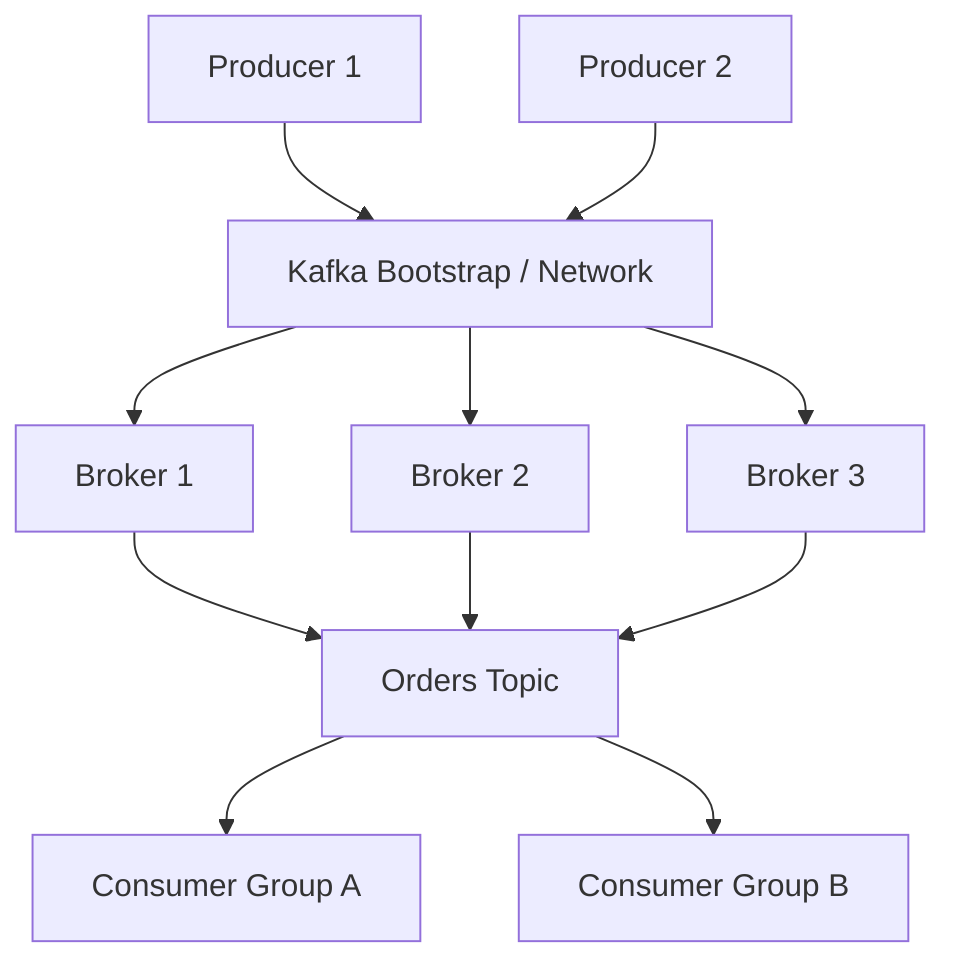
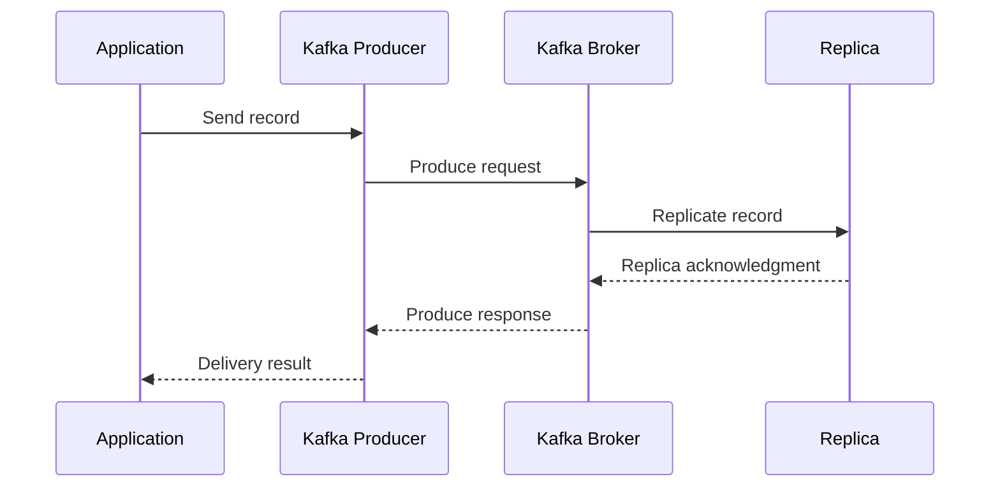
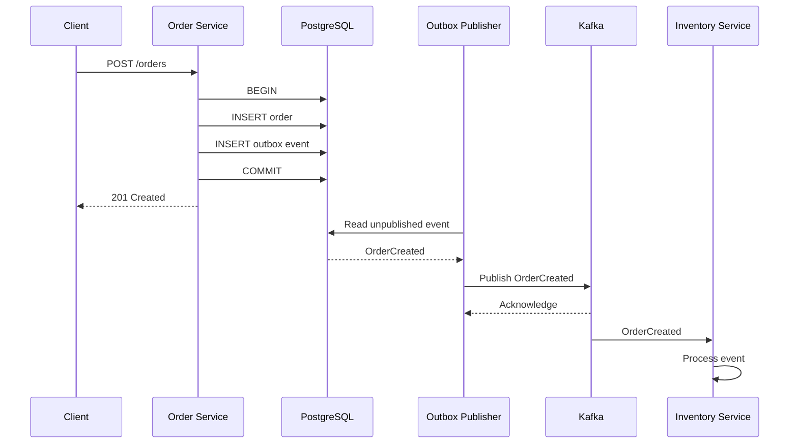
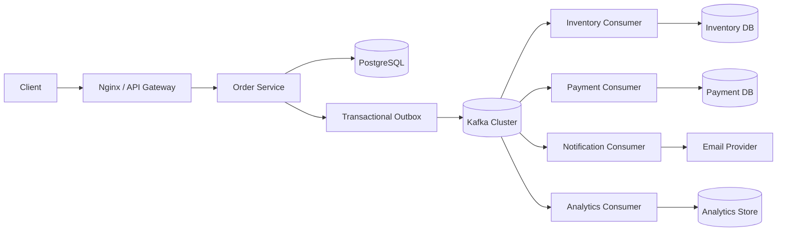

# 04- Kafka

## Overview

Apache Kafka is a distributed event streaming platform designed to ingest, persist, process, and distribute high-volume streams of records.

In system design, Kafka is commonly used as the durable event backbone between independently deployable services:

```text
                    +-------------------+
                    |   Order Service   |
                    +---------+---------+
                              |
                              | OrderCreated
                              v
                    +-------------------+
                    |      Kafka        |
                    |                   |
                    | Topic: orders     |
                    +---------+---------+
                              |
              +---------------+---------------+
              |               |               |
              v               v               v
       Inventory         Payment          Analytics
        Service           Service           Service
```

Kafka is fundamentally different from a traditional request/response API.

With REST or gRPC:

```text
Client -> Service -> Response
```

With Kafka:

```text
Producer -> Kafka -> Consumer
```

The producer and consumer do not need to be simultaneously available. Kafka retains records according to configured retention policies, allowing consumers to process them asynchronously and, within the retained history, replay them.

Kafka is particularly useful for:

- Event-driven microservices.
- High-throughput asynchronous processing.
- Log and activity pipelines.
- Data integration.
- Stream processing.
- Audit trails.
- Real-time analytics.
- Decoupling producers from consumers.
- Buffering traffic between systems.

Kafka is not automatically the correct choice for every asynchronous workload. For simple background jobs, a task queue such as Celery with Redis or another queue may be operationally simpler. Kafka becomes particularly valuable when durable event streams, multiple independent consumers, partitioned parallelism, replay, and high throughput are architectural requirements.

## Why Kafka Exists

A synchronous architecture can create strong runtime coupling:

```text
Order Service
     |
     +--> Payment Service
     |
     +--> Inventory Service
     |
     +--> Notification Service
```

If Payment is unavailable, the Order request may fail or remain blocked.

Kafka changes the communication model:

```text
Order Service
     |
     | OrderCreated
     v
    Kafka
     |
     +--> Payment
     +--> Inventory
     +--> Notification
```

The producer can complete its own local work without requiring every consumer to be available.

Kafka provides several important properties:

- Durable event storage.
- Horizontal partitioning.
- Ordered records within a partition.
- Consumer-controlled processing.
- Consumer offsets.
- Independent consumer groups.
- High sequential I/O throughput.
- Replication for fault tolerance.
- Event replay within the retention period.

The architectural value is not merely message delivery. Kafka provides a durable, distributed stream that multiple independent consumers can process at their own pace.

## Kafka Mental Model

The most important Kafka concepts are:

```text
Kafka Cluster
    |
    +-- Broker
    |
    +-- Topic
           |
           +-- Partition
                  |
                  +-- Record
                  |
                  +-- Offset
```

Consumers read records from partitions and maintain their progress using offsets.

A simplified model is:

```text
Topic: orders

Partition 0
--------------------------------------------->
Offset: 0   1   2   3   4   5   6
        |   |   |   |   |   |   |
        E   E   E   E   E   E   E
                        ^
                     Consumer
                     position
```

Kafka does not generally delete a record immediately after a consumer reads it.

Instead, the record remains available according to retention policy.

This distinction is fundamental:

```text
Traditional queue:
consume -> remove

Kafka:
consume -> advance offset
```

That is one reason Kafka can support replay and multiple independent consumer groups.

## Kafka Architecture

A production Kafka cluster consists of multiple brokers.



Each broker stores some partitions.

A topic can therefore be distributed across the cluster:

```text
orders topic

Broker 1:
  orders-0
  orders-3

Broker 2:
  orders-1
  orders-4

Broker 3:
  orders-2
  orders-5
```

Replication can place copies of those partitions on other brokers.

## Kafka Broker

A broker is a Kafka server responsible for:

- Storing partitions.
- Serving produce requests.
- Serving fetch requests.
- Managing replicas.
- Participating in cluster coordination.
- Serving metadata to clients.

A production cluster normally contains multiple brokers.

The number of brokers depends on:

- Throughput.
- Storage requirements.
- Replication factor.
- Availability requirements.
- Partition count.
- Recovery objectives.

A three-broker cluster is a common starting point for highly available production deployments, but broker count should be determined from capacity and failure requirements rather than copied blindly.

## Topics

A topic is a logical stream of records.

Examples:

```text
orders
payments
inventory-events
user-events
audit-events
```

Topics should represent meaningful domain or integration boundaries.

A topic may contain many partitions:

```text
orders
  |
  +-- Partition 0
  +-- Partition 1
  +-- Partition 2
  +-- Partition 3
```

A topic does not itself provide a single global ordering guarantee.

Ordering is primarily a partition-level property.

## Partitions

Partitions are the fundamental unit of Kafka scalability.

For example:

```text
orders
├── Partition 0
├── Partition 1
├── Partition 2
└── Partition 3
```

Records are appended to partitions.

Each record receives an offset unique within that partition:

```text
Partition 0

Offset 100 -> OrderCreated
Offset 101 -> OrderCreated
Offset 102 -> PaymentCompleted
Offset 103 -> OrderShipped
```

Partitions allow Kafka to distribute work across brokers and consumers.

More partitions can increase parallelism, but they also increase operational overhead and resource requirements.

## Partition Key

A producer can specify a key:

```text
key = order_id
```

Kafka hashes the key to select a partition.

For example:

```text
order-1001 -> Partition 2
order-1002 -> Partition 0
order-1003 -> Partition 1
order-1004 -> Partition 2
```

This is particularly useful when all events belonging to the same aggregate must remain ordered.

For example:

```text
order-1001:
    OrderCreated
    PaymentCompleted
    OrderShipped
```

Using `order_id` as the partition key can place all three events in the same partition.

The exact partitioning behavior depends on the producer's partitioner configuration.

## Ordering Guarantees

Kafka provides ordering within a partition.

Suppose:

```text
Partition 2

Offset 10 -> OrderCreated
Offset 11 -> PaymentCompleted
Offset 12 -> OrderShipped
```

A consumer reading that partition observes those records in offset order.

Kafka does not provide unrestricted global ordering across all partitions.

This distinction is a frequent interview topic.

### Per-Entity Ordering

Use a stable partition key:

```text
order_id
```

when ordering is required per order.

### Global Ordering

A single partition can provide total ordering for that topic, but this limits parallelism.

Therefore:

```text
Global ordering
      |
      v
Single partition
      |
      v
Lower parallelism
```

Use global ordering only when the business requirement genuinely demands it.

## Records

A Kafka record generally contains:

- Key.
- Value.
- Headers.
- Timestamp.
- Partition.
- Offset.

Conceptually:

```json
{
  "key": "order-1001",
  "value": {
    "event_type": "order.created",
    "order_id": "order-1001",
    "customer_id": "customer-500",
    "amount": 1499
  },
  "headers": {
    "trace_id": "abc123"
  }
}
```

Kafka stores the serialized bytes. The producer and consumer determine how those bytes are encoded and decoded.

Common serialization formats include:

- JSON.
- Avro.
- Protobuf.
- JSON Schema.

For strongly governed production environments, schema-managed formats can provide better compatibility guarantees than arbitrary JSON.

## Producer

A producer writes records to Kafka.

The simplified lifecycle is:



The producer is responsible for:

- Selecting a topic.
- Selecting a partition.
- Serializing records.
- Batching records.
- Compressing records.
- Handling retries.
- Receiving broker acknowledgments.

Production producers should generally use batching and compression where they improve throughput without violating latency requirements.

## Producer Acknowledgments

Kafka producers can control how strongly a broker must acknowledge a write.

A common setting is:

```text
acks=all
```

This requests acknowledgment after the leader has received the record according to the broker's configured in-sync replica requirements.

Conceptually:

| Setting | Behavior | Reliability |
|---|---|---|
| `acks=0` | Producer does not wait for broker acknowledgment | Lowest |
| `acks=1` | Leader acknowledges | Moderate |
| `acks=all` | Required in-sync replicas acknowledge | Strongest |

The actual durability guarantee also depends on cluster configuration, replication factor, minimum in-sync replicas, unclean leader election settings, and producer retry behavior.

For critical events, `acks=all` is commonly appropriate.

## Producer Retries

Transient broker or network failures can cause a producer request to fail.

A producer can retry.

However, retries introduce an important question:

```text
Did the broker reject the message?

or

Did the broker accept it but the acknowledgment get lost?
```

If the latter occurred, a retry can create duplicates.

Kafka supports idempotent producer behavior to reduce duplicate records caused by producer retries.

For critical event pipelines, enable appropriate idempotent producer settings rather than assuming network retries are harmless.

## Idempotent Producer

An idempotent Kafka producer uses producer identity and sequence information to prevent certain duplicate writes caused by retries.

Conceptually:

```text
Producer
   |
   | record sequence 100
   v
Broker
   |
   X ACK lost
   |
Producer retries sequence 100
   |
   v
Broker detects duplicate
```

The broker can avoid appending the duplicate record.

Idempotence does not eliminate the need for idempotent consumers. Consumer-side duplicates can still occur because of processing and acknowledgment failures.

## Consumers

A consumer reads records from Kafka.

Conceptually:

```text
Kafka
  |
  v
Consumer
  |
  +--> Deserialize
  |
  +--> Validate
  |
  +--> Business logic
  |
  +--> Database
  |
  +--> Commit offset
```

The most important design question is:

> When should the consumer advance its offset?

A safe model is generally:

```text
Read event
   |
   v
Process event
   |
   v
Commit progress
```

rather than:

```text
Read event
   |
   v
Commit progress
   |
   v
Process event
```

The second model can lose work if the process crashes after committing but before completing the business operation.

## Consumer Groups

A consumer group represents one logical application consuming a topic.

Suppose a topic has four partitions:

```text
Topic
P0 P1 P2 P3
```

A consumer group with four consumers can distribute them:

```text
Consumer Group: inventory

C1 -> P0
C2 -> P1
C3 -> P2
C4 -> P3
```

If another consumer group exists:

```text
Consumer Group: analytics

A1 -> P0
A2 -> P1
A3 -> P2
A4 -> P3
```

Both groups independently receive the event stream.

This is Kafka's core Pub/Sub model.

## Consumer Scaling

Within one consumer group:

```text
maximum active consumer parallelism
≈ number of partitions
```

Suppose:

```text
Topic partitions = 6
Consumers = 10
```

At most six consumers can actively own partitions at one time.

```text
C1 -> P0
C2 -> P1
C3 -> P2
C4 -> P3
C5 -> P4
C6 -> P5
C7 -> idle
C8 -> idle
C9 -> idle
C10 -> idle
```

Adding consumers beyond the partition count does not increase partition-level parallelism.

This is a critical capacity-planning consideration.

## Consumer Rebalancing

When consumers join or leave a consumer group, Kafka can rebalance partition ownership.

For example:

```text
Before:

C1 -> P0, P1
C2 -> P2, P3

C3 joins

After:

C1 -> P0
C2 -> P2
C3 -> P1, P3
```

Rebalancing is necessary for availability and scaling, but frequent rebalances can hurt throughput.

Causes can include:

- Consumer crashes.
- Long processing pauses.
- Poor timeout configuration.
- Deployments.
- Network instability.
- Slow event processing.

Long-running work should be designed carefully so consumers do not appear dead to the group coordinator.

## Consumer Offset

The offset represents a consumer group's progress through a partition.

```text
Partition:

0   1   2   3   4   5   6
            ^
         committed
          offset
```

Kafka stores committed offsets so a consumer can resume after a restart.

Offsets belong to consumer groups, not individual business services in isolation.

Therefore:

```text
billing group
```

can be at offset 500 while:

```text
analytics group
```

is at offset 2,000.

Each group maintains independent progress.

## At-Least-Once Processing

At-least-once processing is a common practical Kafka model.

Consider:

```text
1. Consumer reads event
2. Consumer updates PostgreSQL
3. Consumer crashes
4. Offset was not committed
5. Consumer restarts
6. Event is processed again
```

The same event can therefore be processed twice.

This is why consumers must be idempotent.

For example:

```sql
CREATE TABLE processed_events (
    consumer_name TEXT NOT NULL,
    event_id TEXT NOT NULL,
    processed_at TIMESTAMPTZ NOT NULL DEFAULT NOW(),
    PRIMARY KEY (consumer_name, event_id)
);
```

The event processing transaction can atomically record:

```text
business update
+
processed event
```

This prevents duplicate business effects after retries.

## Exactly-Once Semantics

"Exactly once" must be treated carefully.

Kafka provides mechanisms for exactly-once processing in specific Kafka-to-Kafka transactional workflows.

That does not mean:

```text
Kafka -> PostgreSQL -> External Payment API
```

automatically becomes exactly once.

External side effects require their own idempotency strategy.

For example:

```text
Kafka
  |
  v
Payment Consumer
  |
  v
Payment API
```

If the consumer crashes after the payment succeeds but before the Kafka offset is committed, the payment operation may be attempted again.

The payment provider should therefore support an idempotency key:

```text
idempotency_key = event_id
```

Exactly-once business behavior is usually achieved through coordinated idempotency and transactional boundaries rather than by relying on a single Kafka configuration option.

## Kafka Retention

Kafka normally retains records according to configured policies rather than deleting them immediately after consumption.

Retention can be based on:

- Time.
- Size.
- Compaction policy.

For example:

```text
orders topic
retention = 7 days
```

A consumer can potentially replay records from earlier offsets within the retained range.

Retention should be driven by:

- Replay requirements.
- Recovery requirements.
- Compliance.
- Storage cost.
- Consumer outage tolerance.

Long retention increases storage requirements.

## Log Compaction

Kafka log compaction retains the latest record for a given key, subject to compaction mechanics.

For example:

```text
key=user-123
value=name=Alice

key=user-123
value=name=Alicia
```

After compaction, older values can eventually be removed while retaining the latest state for the key.

Compaction is useful for topics representing current state:

```text
user-profile
account-state
product-state
```

It is different from normal time-based retention.

Compaction should not be treated as an immediate deletion guarantee. Cleanup happens asynchronously.

## Retention vs Compaction

| Property | Time/Size Retention | Log Compaction |
|---|---|---|
| Primary purpose | Historical retention | Latest state per key |
| Old records | Removed based on retention | Older keyed records may be compacted |
| Replay history | Preserved for retention window | Historical versions may disappear |
| Useful for | Events | State snapshots |
| Key requirement | No | Yes |

A topic can also be configured with combinations of retention-related policies depending on the required semantics.

## Consumer Lag

Consumer lag measures how far a consumer group is behind the latest available records.

Conceptually:

```text
Latest offset = 10,000
Consumer offset = 9,400

Lag = 600
```

Lag is one of the most important Kafka operational metrics.

However, message count alone is insufficient.

Suppose:

```text
Lag = 100,000
```

If consumers process 20,000 records/sec, recovery may be quick.

If they process 100 records/sec, the same lag may represent a serious incident.

Monitor:

- Lag.
- Lag growth rate.
- Processing rate.
- Record age.
- Time-to-catch-up.

## Backpressure

Kafka can absorb bursts, but it cannot make a slow downstream dependency faster.

Suppose:

```text
Producer = 100,000 events/sec
Consumer = 50,000 events/sec
```

Then:

```text
Producer rate > Consumer rate

             backlog
                /
               /
              /
-------------/---------- time
```

The consumer backlog grows continuously.

Possible responses include:

- Add consumer instances.
- Increase partitions if partition capacity is the bottleneck.
- Optimize consumer processing.
- Batch database operations.
- Reduce downstream calls.
- Rate-limit producers.
- Introduce priority handling.
- Protect downstream dependencies.

Do not solve every backlog problem by blindly adding consumers. The actual bottleneck may be PostgreSQL, an external API, CPU, network bandwidth, or partition skew.

## Hot Partitions

A poor partition key can produce uneven traffic.

For example:

```text
90% of events -> Partition 0
10% of events -> Partitions 1-9
```

Adding more consumers does not solve the problem if Partition 0 remains the bottleneck.

A good partition key balances two requirements:

```text
Ordering requirement
        +
Traffic distribution
        =
Partition strategy
```

For an order workflow, `order_id` is often appropriate.

For a globally popular customer or tenant, however, a key such as `customer_id` can create a hot partition.

Partition-key selection is therefore a system-design decision, not merely a producer implementation detail.

## Producer Batching

Kafka performs well when producers batch multiple records into requests.

Conceptually:

```text
Without batching:

record -> network
record -> network
record -> network
record -> network

With batching:

record
record
record
record
  |
  v
one produce request
```

Batching reduces network overhead and improves throughput.

Relevant producer settings include:

- `batch.size`
- `linger.ms`
- Compression settings

Increasing batching can increase throughput but may add latency.

Production tuning should be driven by measurements rather than maximum possible batch sizes.

## Compression

Kafka producers can compress record batches.

Common compression codecs include:

- gzip
- snappy
- lz4
- zstd

Compression can reduce:

- Network bandwidth.
- Broker storage.
- Disk I/O.

The trade-off is additional CPU consumption.

For many modern workloads, compression is beneficial, particularly when event payloads contain repetitive structured data.

## Message Size

Large Kafka messages can cause:

- Higher network latency.
- Increased broker memory usage.
- Higher storage costs.
- Larger replication overhead.
- Consumer memory pressure.
- Slow serialization/deserialization.

Do not use Kafka as a general-purpose object store.

Instead of:

```json
{
  "image": "<multi-megabyte binary>"
}
```

store the object in durable object storage such as Amazon S3 and publish a reference:

```json
{
  "object_key": "orders/order-1001/invoice.pdf"
}
```

Consumers can retrieve the object when required.

## Transactional Outbox

A common microservice pattern is:

```text
Application
   |
   +--> PostgreSQL transaction
   |      |
   |      +--> Business record
   |      +--> Outbox record
   |
   v
Outbox Publisher
   |
   v
Kafka
```

Without the outbox:

```text
DB commit
   |
   X application crashes
   |
Kafka publish never happens
```

With the outbox:

```text
BEGIN
  |
  +--> INSERT order
  +--> INSERT outbox event
  |
COMMIT
```

A publisher can safely retry unpublished events.

This solves the database-to-Kafka atomicity problem at the application architecture level.

## Kafka Connect

Kafka Connect is used to move data between Kafka and external systems.

Conceptually:

```text
PostgreSQL
    |
    v
Kafka Connect
    |
    v
Kafka
    |
    v
Kafka Connect
    |
    v
Data Warehouse
```

It is useful for integration pipelines where custom application code would otherwise be required.

Examples include:

- Database change data capture.
- Elasticsearch/OpenSearch integration.
- Object storage sinks.
- Data warehouse integration.

Kafka Connect is particularly useful when the integration is primarily data movement rather than business logic.

## Kafka Streams

Kafka Streams is a stream-processing library for building applications that process Kafka records.

Examples:

```text
orders
  |
  v
Kafka Streams
  |
  +--> filter
  +--> aggregate
  +--> join
  +--> window
  |
  v
derived topic
```

Typical use cases include:

- Aggregations.
- Windowed metrics.
- Stream joins.
- Stateful stream processing.
- Derived event streams.

Not every application needs Kafka Streams. Python systems may instead use consumers, Flink, Spark, or other stream-processing technologies depending on workload and team expertise.

## Kafka vs RabbitMQ

Kafka and RabbitMQ can both support asynchronous messaging, but their architectural strengths differ.

| Area | Kafka | RabbitMQ |
|---|---|---|
| Primary model | Distributed event stream | Message broker |
| Replay | Strong | More limited |
| Partitioned scaling | Core capability | Different model |
| Consumer groups | Core capability | Consumer/queue model |
| Long retention | Strong | Usually not primary use case |
| High-throughput streams | Excellent | Good |
| Complex routing | More limited | Strong |
| Task queues | Possible | Excellent fit |
| Event history | Strong | Not primary purpose |
| Stream processing | Strong ecosystem | Less central |

Use Kafka when durable streams, high throughput, replay, partitioning, and multiple independent consumers are important.

Use RabbitMQ when sophisticated routing and traditional work-queue semantics are more important.

## Kafka vs Redis

Redis can also be used for asynchronous processing, but the design goals differ.

| Area | Kafka | Redis |
|---|---|---|
| Durable event stream | Strong | Depends on feature/configuration |
| Replay | Strong | Depends on Streams configuration |
| Long event retention | Strong | Usually more memory-sensitive |
| High-volume event pipelines | Strong | Good for many workloads |
| Cache | No | Excellent |
| Low-latency state | Limited | Excellent |
| Simple task queue | Possible | Common |
| Stream partitioning | Strong | Different model |

For a Django or FastAPI application, Redis is often a good cache and task coordination system.

Kafka becomes more compelling when the system requires durable, independently consumed event streams.

## Kafka vs Celery

Celery is a distributed task-processing framework, not a direct Kafka equivalent.

Typical Celery architecture:

```text
Django/FastAPI
      |
      v
   Broker
      |
      v
 Celery Workers
```

Typical Kafka architecture:

```text
Services
   |
   v
 Kafka Topics
   |
   +--> Consumer Group A
   +--> Consumer Group B
   +--> Consumer Group C
```

Celery is generally better suited to:

- Background jobs.
- Scheduled tasks.
- Application task execution.
- Retryable asynchronous functions.

Kafka is generally better suited to:

- Event streaming.
- Durable event history.
- Multiple independent consumers.
- High-throughput pipelines.
- Replay.
- Stream processing.

They can coexist in the same architecture.

## Kafka with Django

A Django service can use Kafka for domain events while PostgreSQL remains the transactional database.

```text
Django
  |
  +--> PostgreSQL
  |
  +--> Outbox
          |
          v
        Kafka
          |
          +--> Notification
          +--> Analytics
          +--> Search Index
```

The Django request should not normally block on every downstream consumer.

For example:

```text
POST /orders
    |
    v
Django
    |
    +--> save order
    +--> save outbox event
    |
    v
201 Created

Later:

Outbox -> Kafka -> consumers
```

This preserves a fast request path while allowing asynchronous processing.

## Kafka with FastAPI

FastAPI services can follow the same architecture:

```text
FastAPI
   |
   +--> PostgreSQL
   |
   +--> Outbox
   |
   v
Kafka
```

Kafka consumers can run as separate worker processes rather than inside the HTTP worker lifecycle.

This separation is usually preferable:

```text
HTTP process
    |
    +--> handles API traffic

Kafka consumer process
    |
    +--> handles event processing
```

Mixing long-running Kafka consumption directly into API worker processes can complicate:

- Scaling.
- Deployments.
- Graceful shutdown.
- Resource isolation.
- Health checks.

## Kubernetes Deployment Considerations

Kafka consumers commonly run as Kubernetes Deployments.

```text
Kafka
  |
  v
Consumer Deployment
  |
  +--> Pod 1
  +--> Pod 2
  +--> Pod 3
```

Scaling should consider:

- Number of partitions.
- Consumer lag.
- CPU.
- Memory.
- Downstream database capacity.

A Horizontal Pod Autoscaler based solely on CPU may not respond quickly enough to growing Kafka lag.

A more meaningful scaling signal can incorporate:

```text
consumer lag
+
processing rate
+
downstream capacity
```

Do not scale consumers beyond useful partition parallelism.

## Graceful Shutdown

Kafka consumers should stop cleanly.

A production shutdown flow is approximately:

```text
SIGTERM
  |
  v
Stop accepting new work
  |
  v
Finish current processing
  |
  v
Commit successful progress
  |
  v
Leave consumer group
  |
  v
Process exits
```

This reduces unnecessary duplicate work and avoids abrupt consumer-group disruption.

Container orchestration systems should provide sufficient termination grace periods for the application's processing characteristics.

## Security

Kafka should be treated as production infrastructure carrying potentially sensitive business data.

Important controls include:

- TLS encryption.
- Authentication.
- Authorization.
- Least-privilege topic access.
- Encryption at rest.
- Secret rotation.
- Network isolation.
- Audit logging.

Common authentication mechanisms include:

- SASL.
- TLS client authentication.
- Cloud-provider identity mechanisms where supported.

A consumer should not automatically receive access to every topic.

For example:

```text
inventory-service
    |
    +--> READ orders
    +--> WRITE inventory-events

analytics-service
    |
    +--> READ orders
    +--> READ payments
```

Topic permissions should match service responsibilities.

## Schema Management

Kafka topics are integration contracts.

A schema change can affect many consumers:

```text
orders topic
   |
   +--> Billing
   +--> Inventory
   +--> Analytics
   +--> Notifications
```

Useful practices include:

- Explicit event versions.
- Backward-compatible changes.
- Schema validation.
- Contract testing.
- Consumer compatibility testing.
- Schema registry where appropriate.

A common safe evolution pattern is:

```text
Version 1:
{
  "order_id": "123"
}

Version 2:
{
  "order_id": "123",
  "currency": "INR"
}
```

Adding an optional field is generally safer than changing the meaning or type of an existing field.

## Dead-Letter Topics

A failed event should not necessarily block healthy events indefinitely.

A typical design:

```text
orders
  |
  v
Consumer
  |
  +--> success
  |
  +--> transient failure
  |       |
  |       v
  |     retry
  |
  +--> permanent failure
          |
          v
       orders.DLQ
```

The DLQ should be monitored.

Operational procedures should define:

1. How failures are investigated.
2. Whether the event can be safely replayed.
3. How the underlying bug is fixed.
4. How the event is reintroduced.
5. How duplicate side effects are prevented.

## Retry Topics

Retries should generally be bounded.

A dangerous design is:

```text
consume
  |
  v
fail
  |
  v
retry immediately
  |
  v
fail
  |
  v
retry immediately
```

During an outage, this can create a retry storm.

A better approach is:

```text
Main Topic
    |
    v
Consumer
    |
    +--> success
    |
    +--> retry-1
             |
             v
          retry-2
             |
             v
            DLQ
```

The exact implementation depends on the Kafka ecosystem and operational requirements.

## Kafka and the Transactional Outbox Together

For a microservice architecture:



This pattern provides a strong foundation for reliable microservice event publication.

The outbox publisher itself must be idempotent or tolerate duplicate publication, and consumers must be idempotent.

## Change Data Capture

Kafka is frequently used with change data capture (CDC).

Conceptually:

```text
PostgreSQL
    |
    | WAL / CDC
    v
CDC Connector
    |
    v
Kafka
    |
    +--> Search
    +--> Analytics
    +--> Data Lake
    +--> Other Services
```

CDC can be useful when consumers need database changes without modifying application code.

However, CDC events represent persistence changes, not necessarily domain-level business events.

For example:

```text
row updated
```

is different from:

```text
PaymentAuthorized
```

Use CDC when data-change propagation is the actual requirement. Use domain events when business semantics are required.

## Monitoring

A production Kafka deployment should monitor at least:

### Broker Metrics

- CPU.
- Memory.
- Disk utilization.
- Disk I/O.
- Network throughput.
- Request latency.
- Request errors.
- Under-replicated partitions.
- Offline partitions.

### Producer Metrics

- Record rate.
- Request latency.
- Error rate.
- Retry rate.
- Record batch size.
- Compression ratio.
- Buffer utilization.

### Consumer Metrics

- Consumer lag.
- Records consumed.
- Processing latency.
- Poll latency.
- Commit failures.
- Rebalances.
- Consumer errors.

### Topic Metrics

- Partition count.
- Storage growth.
- Bytes in.
- Bytes out.
- Retention behavior.

### Business Metrics

For an order system:

```text
orders.created
orders.confirmed
orders.failed
payments.failed
inventory.failed
```

Kafka infrastructure can be healthy while business processing is broken. Both technical and business observability are required.

## Disaster Recovery

Kafka disaster recovery depends heavily on the business role of the event stream.

Questions to answer:

- How much event history must survive?
- Can events be reconstructed from source databases?
- Is cross-region replication required?
- How quickly must consumers recover?
- How are consumer offsets recovered?
- How is schema metadata recovered?
- How much data loss is acceptable?

For critical systems, define:

```text
RPO = acceptable event/data loss
RTO = acceptable recovery time
```

A disaster recovery design might include:

```text
Primary Region
    |
    v
Kafka Cluster
    |
    | Replication
    v
Secondary Region
```

The appropriate architecture depends on cost, latency, consistency, and recovery requirements.

## Cost Considerations

Kafka costs are influenced by:

```text
Storage
+
Replication
+
Network
+
Broker compute
+
Consumer compute
+
Monitoring
+
Retention
```

Storage grows with:

```text
event rate
×
average event size
×
retention duration
×
replication factor
```

For example, if a system produces 10,000 events/sec and each event averages 2 KB:

```text
10,000 × 2 KB
≈ 20 MB/sec
```

That is approximately:

```text
1.7 TB/day
```

before accounting for replication, compression, and implementation-specific storage overhead.

This simple calculation is useful during capacity planning.

## Capacity Planning

Before choosing Kafka cluster capacity, estimate:

```text
events/sec
average event size
peak events/sec
retention period
replication factor
consumer throughput
partition count
```

For example:

```text
Peak ingress:
100,000 events/sec

Average event:
1 KB

Raw ingress:
~100 MB/sec

Daily raw volume:
~8.64 TB/day
```

This immediately reveals that retention and replication can become significant infrastructure requirements.

Capacity planning should use peak traffic rather than average traffic alone.

## Common Mistakes

### Treating Kafka as a Generic Queue

Kafka can implement queue-like behavior, but its strongest model is a durable partitioned event stream.

If the workload is simply:

```text
submit task
   |
   v
one worker executes task
```

a traditional task queue may be simpler.

### Using One Partition for Everything

A single partition provides simple ordering but eliminates much of Kafka's horizontal parallelism.

Do not sacrifice scalability unless global ordering is actually required.

### Adding Too Many Partitions Without Planning

More partitions are not free.

They increase:

- Metadata.
- Broker resource usage.
- Recovery work.
- Operational complexity.
- File and network overhead.

Choose a partition count based on throughput and future scaling requirements.

### Ignoring the Partition Key

A poor key can create hot partitions.

Always reason about:

```text
ordering
+
distribution
+
future scale
```

### Assuming More Consumers Always Improve Throughput

Consumers cannot exceed useful partition parallelism.

If six partitions exist, ten consumers do not automatically provide ten-way partition parallelism.

### Committing Offsets Before Processing

This can cause message loss after a crash.

The application must carefully define the relationship between:

```text
business processing
and
offset commitment
```

### Assuming Exactly Once

Kafka's transactional capabilities do not automatically make external side effects exactly once.

Use idempotency at business boundaries.

### Ignoring Consumer Lag

A consumer can be running and passing health checks while being hours behind.

Monitor lag and message age.

### Putting Large Objects in Kafka

Kafka is not an object-storage replacement.

Store large objects in systems such as S3 and publish references.

### Publishing Database Rows as Domain Events

A database row change is not necessarily a business event.

Prefer meaningful domain events when service contracts depend on business semantics.

### No Schema Governance

A topic consumed by multiple teams is effectively a distributed API.

Schema compatibility must be managed accordingly.

### Running Kafka Consumers Inside API Workers

Combining HTTP request handling and long-running Kafka consumption can complicate resource management and deployment.

Separate workloads when their scaling and lifecycle requirements differ.

## Practical Design Example

Consider an e-commerce platform:



The request path remains short:

```text
Client
  |
  v
API Gateway
  |
  v
Order Service
  |
  +--> PostgreSQL
  +--> Outbox
  |
  v
201 Created
```

The asynchronous path handles downstream processing:

```text
Outbox
   |
   v
Kafka
   |
   +--> Inventory
   +--> Payment
   +--> Notification
   +--> Analytics
```

This architecture allows each consumer to scale independently.

For example:

```text
Inventory:
    10 consumers

Notification:
    3 consumers

Analytics:
    20 consumers
```

assuming sufficient partitions and downstream capacity.

## Recommended Production Defaults

There is no universal Kafka configuration, but a strong starting design for critical event pipelines is:

| Concern | Recommended direction |
|---|---|
| Replication | Multiple replicas across failure domains |
| Producer acknowledgment | `acks=all` for important events |
| Producer idempotence | Enabled for critical pipelines |
| Compression | Use appropriate compression after benchmarking |
| Partition key | Stable domain key where ordering matters |
| Consumer delivery | Design for at-least-once |
| Consumer idempotency | Required for side-effecting consumers |
| Event publication | Transactional outbox where DB consistency matters |
| Retry | Bounded exponential backoff |
| DLQ | Required for persistent failures |
| Schema | Versioned and compatibility-managed |
| Monitoring | Lag, age, throughput, errors, replication |
| Security | TLS + authentication + least privilege |
| Deployment | Separate API and consumer workloads when appropriate |
| DR | Explicit RPO/RTO and recovery procedures |

These are architectural starting points, not replacements for workload-specific capacity testing.

## Interview Questions

### What is Kafka?

Kafka is a distributed event streaming platform that stores records in partitioned, replicated logs and allows multiple independent consumer groups to process those records.

### Why is Kafka scalable?

Kafka scales through:

- Partitioning.
- Multiple brokers.
- Parallel producers.
- Parallel consumers.
- Sequential append-oriented storage.
- Distributed replication.

### What is a partition?

A partition is an ordered append-only sequence of records within a Kafka topic. It is the fundamental unit of Kafka parallelism.

### Does Kafka guarantee ordering?

Kafka guarantees ordering within a partition, not arbitrary global ordering across partitions.

### How do you guarantee ordering per order?

Use `order_id` as the partition key so events for the same order are routed to the same partition.

### What is a consumer group?

A consumer group is a logical set of consumers that jointly process partitions of a topic. Each partition is assigned to at most one active consumer within that group at a time.

### Can two consumer groups consume the same event?

Yes. Each consumer group maintains independent offsets and can consume the same topic independently.

### What happens when a consumer crashes?

Its partitions can be reassigned to another consumer in the same group. Uncommitted records can be processed again, which is why consumers should be idempotent.

### What is consumer lag?

Consumer lag represents how far a consumer group is behind the latest available records. It is a key indicator of processing health and capacity.

### Why use the transactional outbox?

It prevents the application from committing database state successfully while failing to publish the corresponding event.

### Why not publish directly to Kafka after saving to PostgreSQL?

Because the process can crash between the database commit and Kafka publication, leaving the database and event stream inconsistent.

### How do you handle duplicate messages?

Use event IDs or business idempotency keys and make the consumer's business operation safe to execute multiple times.

### What is log compaction?

Log compaction retains the latest value for each key over time, making it useful for state-oriented topics where the latest state matters more than the complete historical sequence.

### Kafka vs Redis?

Redis is commonly used for caching, low-latency state, and simple asynchronous coordination. Kafka is designed around durable, partitioned event streams, independent consumer groups, replay, and high-throughput streaming.

### Kafka vs RabbitMQ?

Kafka is generally stronger for durable event streams, high throughput, partitioning, replay, and multiple independent consumers. RabbitMQ is often stronger for traditional work queues and sophisticated message routing.

### Kafka vs Celery?

Celery is a task execution framework suited to background jobs and application tasks. Kafka is an event-streaming platform suited to durable streams and independent event consumers.

### Does Kafka replace PostgreSQL?

No.

Kafka and PostgreSQL solve fundamentally different problems:

```text
PostgreSQL:
transactional state

Kafka:
distributed event stream
```

A production architecture often uses both.

## Key Takeaways

- **Kafka is a distributed, durable event-streaming platform built around topics, partitions, offsets, replication, and independent consumer groups.**
- **Partitions provide Kafka's scalability and ordering boundary; partition-key selection must balance per-entity ordering with even traffic distribution.**
- **Production consumers should assume at-least-once processing and use idempotency, while critical database-to-event workflows commonly use the transactional outbox pattern.**
- **Consumer lag, backpressure, retries, dead-letter handling, schema evolution, replication, and replay are core operational concerns that must be designed explicitly.**
- **Kafka should complement—not automatically replace—PostgreSQL, Redis, Celery, REST, or gRPC; choose it when durable streams, high throughput, replay, and independent consumers justify its operational complexity.**