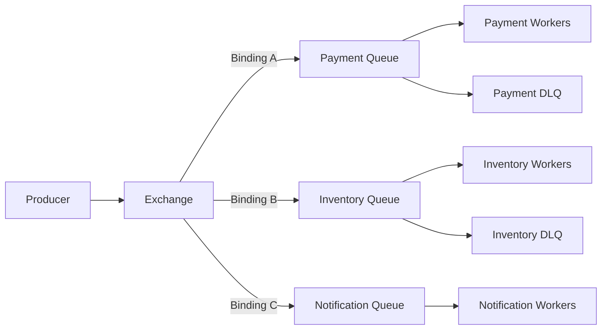
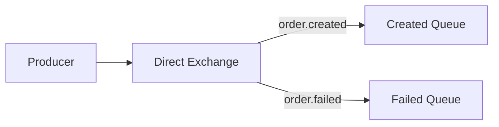
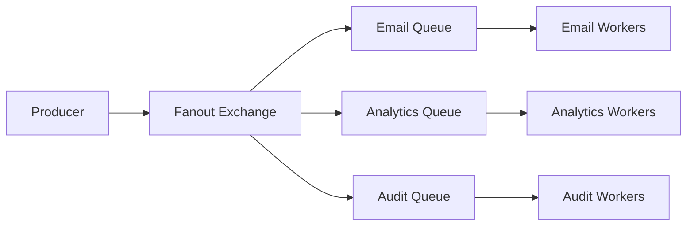
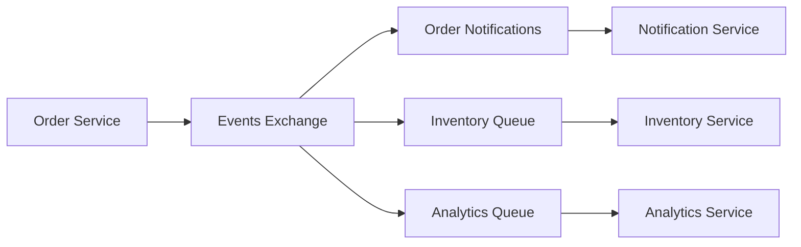
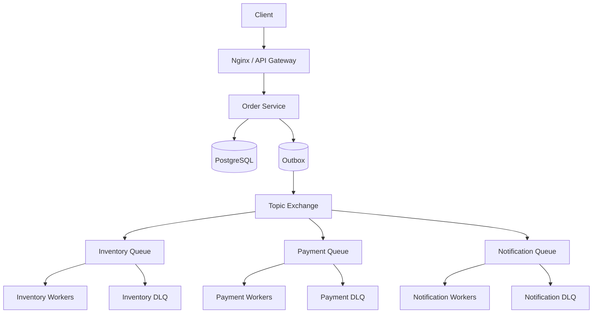

# 05- RabbitMQ

## Overview

RabbitMQ is a message broker designed to reliably route messages from producers to consumers. It is widely used for asynchronous processing, background jobs, service-to-service communication, workflow orchestration, and event-driven architectures.

Unlike Kafka, which is fundamentally a distributed event log, RabbitMQ is primarily a broker built around message delivery and routing.

A typical RabbitMQ flow is:

```text
Producer
   |
   v
Exchange
   |
   | routing
   v
Queue
   |
   v
Consumer
```

The producer normally does not send directly to a queue. It publishes a message to an exchange, and the exchange routes the message to one or more queues according to bindings and routing rules.

RabbitMQ is particularly strong when the system requires:

- Sophisticated message routing.
- Work queues.
- Explicit acknowledgment.
- Retry and dead-letter workflows.
- Per-message delivery semantics.
- Priority queues.
- Request/reply messaging.
- Background job execution.
- Moderate-to-high-throughput asynchronous processing.

RabbitMQ is commonly used with Python applications through libraries such as `pika` or higher-level frameworks such as Celery.

## Why RabbitMQ Exists

Synchronous service communication creates runtime coupling:

```text
Order Service
     |
     v
Payment Service
     |
     v
Notification Service
```

If Payment is unavailable, the Order Service may be forced to fail, retry, or block.

RabbitMQ introduces asynchronous communication:

```text
Order Service
     |
     v
RabbitMQ
     |
     v
Payment Queue
     |
     v
Payment Worker
```

The producer can publish work and continue without requiring the consumer to be immediately available.

RabbitMQ therefore acts as a buffer between workloads.

This is especially useful when:

```text
Producer rate > Consumer processing rate
```

Instead of forcing the producer to wait, RabbitMQ can temporarily accumulate messages in a queue.

## RabbitMQ Mental Model

The core RabbitMQ model is:

```text
Producer
   |
   v
Exchange
   |
   +--> Binding --> Queue
   |
   +--> Binding --> Queue
                       |
                       v
                    Consumer
```

The important components are:

| Component | Responsibility |
|---|---|
| Producer | Publishes messages |
| Exchange | Routes messages |
| Binding | Connects exchanges to queues using routing rules |
| Queue | Stores messages until consumers process them |
| Consumer | Processes messages |
| Virtual host | Provides logical isolation |
| Connection | TCP connection to RabbitMQ |
| Channel | Lightweight logical session over a connection |
| Acknowledgment | Confirms successful processing |
| Dead-letter exchange | Routes rejected/expired messages elsewhere |

Understanding the difference between an **exchange** and a **queue** is fundamental.

A producer generally publishes to an exchange, while consumers consume from queues.

## RabbitMQ Architecture

A simplified production architecture looks like:



The exchange determines where a message should go.

The queue determines how messages are buffered and consumed.

This separation allows routing logic to evolve independently from producer implementation.

## Producer

A producer publishes messages to an exchange.

Conceptually:

```text
Application
    |
    | publish(message)
    v
Exchange
    |
    v
Queue
```

A producer usually specifies:

- Exchange name.
- Routing key.
- Message body.
- Message properties.
- Delivery mode.
- Optional headers.

For example:

```json
{
  "event_id": "evt-1001",
  "event_type": "order.created",
  "order_id": "order-123",
  "customer_id": "customer-456"
}
```

A production message should normally contain enough metadata for observability and safe processing.

Useful fields include:

- `event_id`
- `event_type`
- `occurred_at`
- `correlation_id`
- `trace_id`
- `schema_version`

## Exchange

An exchange receives messages and determines which queues should receive them.

RabbitMQ provides several important exchange types:

| Exchange | Routing behavior | Typical use |
|---|---|---|
| Direct | Exact routing-key match | Work routing |
| Topic | Pattern-based routing | Event routing |
| Fanout | Broadcast to bound queues | Pub/Sub |
| Headers | Header-based matching | Specialized routing |

The exchange does not normally store messages for later consumption. Queues provide message storage.

## Direct Exchange

A direct exchange routes based on an exact routing-key match.

```text
Exchange: orders.direct

order.created  -> orders.created.queue
order.failed   -> orders.failed.queue
```

Conceptually:



Direct exchanges are useful when routing rules are explicit and simple.

Example:

```text
routing_key = payment.created
```

only reaches queues bound with:

```text
payment.created
```

## Topic Exchange

Topic exchanges support wildcard routing.

RabbitMQ topic patterns use:

- `*` for exactly one word.
- `#` for zero or more words.

For example:

```text
order.created
order.payment.completed
order.payment.failed
inventory.reserved
```

A binding such as:

```text
order.*
```

matches:

```text
order.created
```

but not:

```text
order.payment.completed
```

A binding such as:

```text
order.#
```

can match both.

Topic exchanges are useful for domain-oriented event routing.

Example:

```text
events
   |
   +--> order.#       -> Order Consumers
   +--> payment.#     -> Payment Consumers
   +--> inventory.#   -> Inventory Consumers
```

## Fanout Exchange

A fanout exchange broadcasts a message to every bound queue.



Fanout is useful when every independent consumer should receive its own copy.

For example:

```text
UserRegistered
      |
      v
Fanout Exchange
      |
      +--> Email Queue
      +--> Analytics Queue
      +--> Audit Queue
```

Each queue has an independent copy of the message.

## Headers Exchange

A headers exchange routes based on message headers rather than routing keys.

This is useful for specialized routing requirements but is less common than direct, topic, and fanout exchanges.

For most backend systems:

```text
Direct
Topic
Fanout
```

are sufficient.

## Queue

A queue stores messages waiting for consumers.

```text
Producer
   |
   v
Exchange
   |
   v
Queue
   |
   +--> Message 1
   +--> Message 2
   +--> Message 3
   |
   v
Consumer
```

Queues provide:

- Buffering.
- Delivery ordering within the queue under normal conditions.
- Consumer coordination.
- Message persistence when configured appropriately.
- Retry/dead-letter integration.
- Backpressure visibility.

Queue design should reflect the workload rather than simply creating one queue per producer.

## Queue Durability

A durable queue survives broker restart.

For important workloads, queues should generally be durable.

However, durable queues alone do not guarantee that every message survives failure.

Message durability and publisher confirmation also matter.

The durability chain is conceptually:

```text
Durable queue
      +
Persistent message
      +
Publisher confirms
      +
Reliable replication
```

All relevant layers must be considered together.

## Persistent Messages

Messages can be published with persistent delivery mode.

For example:

```python
from pika import BasicProperties

properties = BasicProperties(
    delivery_mode=2,
)
```

Persistent messages are intended to survive broker restarts when used with durable infrastructure.

Persistent messages can increase disk I/O and latency.

Do not enable durability blindly for workloads where message loss is acceptable.

## Publisher Confirms

A producer should know whether RabbitMQ successfully accepted a published message.

Publisher confirms allow the producer to receive broker-level confirmation.

Conceptually:

```text
Producer
   |
   | publish
   v
RabbitMQ
   |
   | confirm
   v
Producer
```

Without confirmation, a network failure can leave the producer uncertain:

```text
Did RabbitMQ receive the message?

Yes?
No?
Unknown?
```

For important messages, publisher confirms are an important reliability mechanism.

## Consumer

A consumer reads messages from a queue and processes them.

A typical lifecycle is:

```text
Receive
   |
   v
Deserialize
   |
   v
Validate
   |
   v
Business logic
   |
   v
Acknowledge
```

The acknowledgment should normally happen only after successful processing.

## Acknowledgments

RabbitMQ supports explicit acknowledgments.

A consumer can acknowledge a message:

```text
ack
```

after successful processing.

If processing fails, the consumer can:

```text
reject
```

or:

```text
nack
```

depending on the required behavior.

This allows RabbitMQ to distinguish successfully processed messages from messages that need further handling.

## Manual Acknowledgment

For production workloads, manual acknowledgment is often preferable.

Conceptually:

```text
RabbitMQ
   |
   v
Consumer
   |
   v
Process
   |
   +---- failure ---> retry / DLQ
   |
   v
ack
```

If the consumer crashes before acknowledging:

```text
Consumer crashes
       |
       v
Message remains unacknowledged
       |
       v
RabbitMQ can redeliver
```

This provides at-least-once delivery behavior.

## Acknowledgment Timing

Consider:

```text
1. Receive message
2. ACK
3. Update PostgreSQL
4. Process crashes
```

The message may be lost from the queue while the database update never completes.

A safer sequence is generally:

```text
1. Receive message
2. Process business operation
3. Commit database transaction
4. ACK
```

Even this can produce duplicates if the process crashes after the database commit but before the acknowledgment.

Therefore consumers should be idempotent.

## Idempotent Consumers

Suppose RabbitMQ delivers:

```text
event_id = evt-1001
```

twice.

A consumer should not accidentally create two business effects.

A database-backed idempotency table can help:

```sql
CREATE TABLE processed_messages (
    consumer_name TEXT NOT NULL,
    event_id TEXT NOT NULL,
    processed_at TIMESTAMPTZ NOT NULL DEFAULT NOW(),
    PRIMARY KEY (consumer_name, event_id)
);
```

The business operation and event-record insertion should ideally occur in the same transaction.

The exact implementation depends on whether the downstream operation is transactional.

## Prefetch

Prefetch controls how many unacknowledged messages a consumer can receive.

Conceptually:

```text
prefetch = 10

Consumer
  |
  +--> Message 1
  +--> Message 2
  ...
  +--> Message 10
```

The consumer receives additional messages as acknowledgments are returned.

A very high prefetch value can:

- Increase memory usage.
- Increase unfair work distribution.
- Increase processing latency for individual messages.
- Make shutdown slower.

A very low prefetch value can:

- Reduce throughput.
- Increase network round trips.
- Leave workers underutilized.

Prefetch should be tuned according to:

```text
message processing time
message size
worker concurrency
memory
downstream capacity
```

## Work Queues

A common RabbitMQ architecture is a work queue:

```text
             +--> Worker 1
             |
Producer --> Queue
             |
             +--> Worker 2
             |
             +--> Worker 3
```

A message is normally delivered to one consumer in the competing consumer group.

This is useful for:

- Image processing.
- Report generation.
- Email delivery.
- Document processing.
- Background jobs.
- Data transformation.

Work queues are one of RabbitMQ's strongest use cases.

## Competing Consumers

Suppose:

```text
Queue
 |
 +--> Worker A
 +--> Worker B
 +--> Worker C
```

Workers compete for messages.

If one worker fails, other workers can continue processing.

This provides horizontal scaling:

```text
1 worker  -> lower throughput
5 workers -> higher throughput
20 workers -> potentially higher throughput
```

until another bottleneck is reached.

The bottleneck may be:

- Database connections.
- CPU.
- External APIs.
- Network.
- Queue throughput.
- Message processing time.

## Message Ordering

RabbitMQ can preserve queue order under normal circumstances, but applications should not assume a universal ordering guarantee.

Ordering can be affected by:

- Multiple consumers.
- Concurrent processing.
- Redelivery.
- Retries.
- Priority queues.
- Consumer failures.

For example:

```text
Queue:

A
B
C
```

With multiple concurrent workers:

```text
Worker 1 -> A
Worker 2 -> B
Worker 3 -> C
```

B may finish before A.

Therefore:

```text
queue order != business completion order
```

If strict ordering is required, design explicitly for it.

## Priority Queues

RabbitMQ supports priority messages.

For example:

```text
Priority 10 -> Payment failure
Priority 5  -> Normal order
Priority 1  -> Analytics
```

Priority queues can be useful for:

- Critical operational tasks.
- User-facing jobs.
- Emergency processing.

However, priority queues can complicate scheduling and increase resource usage.

Do not use priority queues as a substitute for proper workload separation.

A better design may be:

```text
critical.queue
normal.queue
bulk.queue
```

when workloads have fundamentally different service-level requirements.

## Dead-Letter Exchanges

Messages may need to be routed away from the primary queue when:

- They are rejected.
- They expire.
- Queue limits are reached.
- Retry attempts are exhausted.

RabbitMQ supports dead-letter exchanges.

```text
Main Queue
    |
    +--> success
    |
    +--> failure
           |
           v
       DLX Exchange
           |
           v
        DLQ Queue
```

A dead-letter queue should not become a permanent garbage dump.

It needs:

- Monitoring.
- Alerting.
- Investigation procedures.
- Replay procedures.
- Ownership.

## Retry Design

Immediate retries are dangerous.

Suppose an external API is down:

```text
Consumer
   |
   v
API call fails
   |
   v
Immediate retry
   |
   v
API fails
   |
   v
Immediate retry
```

Thousands of consumers can amplify the outage.

A better pattern uses delayed or scheduled retries:

```text
Main Queue
    |
    v
Consumer
    |
    +--> success
    |
    +--> retry 1
           |
           v
        retry 2
           |
           v
        retry 3
           |
           v
          DLQ
```

Use bounded retries and exponential backoff.

Example:

```text
1st retry: 5 seconds
2nd retry: 30 seconds
3rd retry: 5 minutes
4th retry: DLQ
```

The exact values depend on the downstream dependency and business SLA.

## Poison Messages

A poison message is a message that repeatedly fails processing.

Example:

```text
Malformed payload
     |
     v
Consumer
     |
     v
Failure
     |
     v
Requeue
     |
     v
Same failure
     |
     v
Requeue forever
```

This can create a tight failure loop.

Avoid unlimited requeue behavior.

A safer design is:

```text
message
  |
  v
process
  |
  +--> success
  |
  +--> failure
          |
          v
       retry count
          |
          +--> retry
          |
          +--> DLQ
```

## Message TTL

RabbitMQ supports message expiration using TTL.

For example:

```text
payment.request
TTL = 5 minutes
```

After the message expires, it can be removed or dead-lettered depending on configuration.

TTL is useful when stale work is no longer meaningful.

Examples:

- Temporary authentication tasks.
- Time-sensitive notifications.
- Expiring reservation requests.

Do not apply TTL to business events that must remain available indefinitely unless the business explicitly permits expiration.

## Queue Length and Backpressure

Queue depth is an important operational signal.

Suppose:

```text
Incoming = 5,000 messages/sec
Processing = 3,000 messages/sec
```

Then backlog grows by approximately:

```text
2,000 messages/sec
```

A growing queue indicates one of:

- Consumer capacity is insufficient.
- Consumers are failing.
- A downstream dependency is slow.
- Producers are generating excessive load.
- Message processing became more expensive.

Monitor both:

```text
queue depth
+
message age
```

Queue depth alone can be misleading.

## Connection vs Channel

RabbitMQ clients commonly use:

```text
Connection
    |
    +--> Channel
    +--> Channel
    +--> Channel
```

A connection is a network connection.

A channel is a lightweight logical session multiplexed over a connection.

Creating a TCP connection for every message is inefficient.

Production applications should reuse connections and use channels appropriately.

## Virtual Hosts

RabbitMQ virtual hosts provide logical isolation within a RabbitMQ installation.

For example:

```text
/
production
staging
development
```

Permissions can be assigned per virtual host.

This can help isolate:

- Applications.
- Environments.
- Teams.
- Credentials.
- Exchanges.
- Queues.

Environment isolation should generally be stronger than merely relying on naming conventions.

## RabbitMQ with Python

A low-level Python application can use `pika`.

Example producer:

```python
import json

import pika


connection = pika.BlockingConnection(
    pika.ConnectionParameters(host="rabbitmq")
)
channel = connection.channel()

channel.exchange_declare(
    exchange="orders",
    exchange_type="topic",
    durable=True,
)

message = {
    "event_id": "evt-1001",
    "event_type": "order.created",
    "order_id": "order-123",
}

channel.basic_publish(
    exchange="orders",
    routing_key="order.created",
    body=json.dumps(message),
    properties=pika.BasicProperties(
        delivery_mode=pika.DeliveryMode.Persistent,
        content_type="application/json",
    ),
)

connection.close()
```

A production application should additionally consider:

- Publisher confirms.
- Connection recovery.
- Timeouts.
- Authentication.
- TLS.
- Serialization contracts.
- Structured logging.
- Metrics.
- Idempotency.

## Python Consumer

A simplified consumer using manual acknowledgment:

```python
import json

import pika


def process_order(message: dict) -> None:
    print(f"Processing order {message['order_id']}")


connection = pika.BlockingConnection(
    pika.ConnectionParameters(host="rabbitmq")
)
channel = connection.channel()

channel.queue_declare(
    queue="orders",
    durable=True,
)

channel.basic_qos(prefetch_count=10)


def callback(ch, method, properties, body):
    try:
        message = json.loads(body)
        process_order(message)
        ch.basic_ack(delivery_tag=method.delivery_tag)
    except Exception:
        ch.basic_nack(
            delivery_tag=method.delivery_tag,
            requeue=False,
        )


channel.basic_consume(
    queue="orders",
    on_message_callback=callback,
)

channel.start_consuming()
```

This example demonstrates the critical acknowledgment lifecycle:

```text
receive
  |
  v
process
  |
  +--> success -> ACK
  |
  +--> failure -> NACK / retry / DLQ
```

A production consumer should not silently discard exceptions. Failures should be observable and routed according to an explicit retry policy.

## RabbitMQ with Django

RabbitMQ is commonly used as the broker for Celery in Django systems.

```text
Django
   |
   | enqueue task
   v
RabbitMQ
   |
   v
Celery Workers
   |
   +--> PostgreSQL
   +--> Redis
   +--> External APIs
```

Example:

```python
from celery import shared_task


@shared_task(
    bind=True,
    autoretry_for=(TimeoutError,),
    retry_backoff=True,
    max_retries=5,
)
def generate_invoice(self, order_id: str) -> None:
    # Perform the background operation.
    ...
```

The Django request can return without waiting for the task:

```text
POST /orders
    |
    v
Django
    |
    +--> PostgreSQL
    |
    +--> Celery task
            |
            v
         RabbitMQ
            |
            v
         Worker
```

This is often preferable to implementing raw RabbitMQ consumers when the problem is simply background task execution.

## RabbitMQ with FastAPI

FastAPI can publish messages directly or use Celery/RabbitMQ for background workloads.

A common architecture is:

```text
Client
   |
   v
Nginx
   |
   v
FastAPI
   |
   +--> PostgreSQL
   |
   +--> RabbitMQ
           |
           +--> Worker A
           +--> Worker B
```

For long-running work, keep HTTP request handling and message consumption as separate workloads when their scaling characteristics differ.

## RabbitMQ with Celery

Celery commonly uses RabbitMQ as a broker:

```text
Django / FastAPI
       |
       | Task
       v
   RabbitMQ
       |
       v
 Celery Workers
       |
       +--> task execution
```

RabbitMQ provides message transport and delivery.

Celery provides:

- Task abstraction.
- Worker management.
- Retries.
- Scheduling.
- Task routing.
- Result handling.
- Task lifecycle management.

This distinction is important:

```text
RabbitMQ = message broker
Celery   = distributed task framework
```

## RabbitMQ vs Kafka

RabbitMQ and Kafka overlap but are optimized around different models.

| Area | RabbitMQ | Kafka |
|---|---|---|
| Primary abstraction | Broker + queues | Distributed event log |
| Routing | Excellent | More application/topic-oriented |
| Work queues | Excellent | Possible |
| Replay | Limited compared with Kafka | Core capability |
| Consumer groups | Queue/consumer model | Core capability |
| Long retention | Not primary strength | Strong |
| Event streaming | Good | Excellent |
| Complex routing | Excellent | More limited |
| Task processing | Excellent | Possible |
| Partitioning | Different model | Core scaling mechanism |
| Historical event log | Not primary | Core capability |
| Typical use | Jobs and message delivery | Event streams and pipelines |

A useful rule is:

```text
Need sophisticated routing + work queues?
    -> RabbitMQ

Need durable event history + replay + partitions?
    -> Kafka
```

The two can coexist when different workloads justify different messaging models.

## RabbitMQ vs Redis

Redis can be used for queues and streams, but its primary role in many backend architectures is low-latency data access.

| Requirement | RabbitMQ | Redis |
|---|---|---|
| Traditional message broker | Excellent | Possible |
| Complex routing | Strong | Limited |
| Work queues | Excellent | Good |
| Cache | No | Excellent |
| Low-latency state | Limited | Excellent |
| Pub/Sub | Yes | Yes |
| Durable messaging | Strong when configured correctly | Depends on mechanism |
| Task frameworks | Strong Celery integration | Strong Celery integration |
| Message acknowledgments | Strong | Stream-specific |

Do not select Redis simply because it is already present as a cache.

Messaging requirements should determine the infrastructure.

## RabbitMQ vs Amazon SQS

Amazon SQS is a managed queue service.

| Area | RabbitMQ | Amazon SQS |
|---|---|---|
| Managed infrastructure | No, unless using managed offering | Yes |
| Routing | Rich exchange model | Simpler |
| Queue semantics | Rich | Strong |
| Operational overhead | Higher | Lower |
| AWS integration | Good | Excellent |
| Fine-grained broker control | Strong | Limited |
| Server management | Required for self-hosted | AWS-managed |
| Typical use | Application messaging | Managed cloud queues |

On AWS, SQS is often preferable when the requirement is simply a durable managed queue and sophisticated RabbitMQ routing is unnecessary.

## High Availability

A production RabbitMQ deployment should be designed around failure domains.

Important considerations include:

- Multiple RabbitMQ nodes.
- Durable queues.
- Durable exchanges.
- Persistent messages where required.
- Publisher confirms.
- Appropriate queue replication.
- Load balancing.
- Automated recovery.
- Monitoring.

RabbitMQ's queue replication behavior depends on the queue type and cluster configuration.

Modern RabbitMQ deployments commonly use quorum queues for replicated critical queues.

## Quorum Queues

Quorum queues are replicated queues designed for stronger data safety and high availability.

Conceptually:

```text
             Queue Leader
                 |
       +---------+---------+
       |                   |
       v                   v
   Replica 1           Replica 2
```

A quorum queue can continue operating through certain node failures when enough replicas remain available.

Quorum queues provide stronger safety properties than legacy mirrored queue designs and are a common choice for critical workloads.

They consume more resources than a single non-replicated queue, so capacity planning remains important.

## RabbitMQ Clustering

A RabbitMQ cluster consists of multiple nodes.

```text
RabbitMQ Cluster

+-----------+    +-----------+    +-----------+
| Node 1    |    | Node 2    |    | Node 3    |
+-----------+    +-----------+    +-----------+
```

Clustering does not mean every queue is automatically replicated across every node.

Queue placement and replication semantics must be understood explicitly.

A production architecture should therefore distinguish:

```text
cluster membership
```

from:

```text
queue replication
```

These are related but different concepts.

## Kubernetes Considerations

RabbitMQ can run on Kubernetes, but it should be treated as stateful infrastructure.

Important considerations include:

- Persistent volumes.
- Stable identities.
- Pod disruption budgets.
- Anti-affinity.
- Resource requests and limits.
- Storage performance.
- Graceful shutdown.
- Cluster formation.
- Backup and recovery.

A typical architecture is:

```text
Kubernetes
   |
   +--> RabbitMQ Pod 1
   +--> RabbitMQ Pod 2
   +--> RabbitMQ Pod 3
           |
           v
     Persistent Storage
```

Avoid treating RabbitMQ like a stateless Deployment where pods can be freely destroyed without considering queue state and persistence.

## AWS Considerations

On AWS, RabbitMQ can be self-hosted or deployed using Amazon MQ for RabbitMQ.

A managed service can reduce:

- Broker administration.
- Patching effort.
- Infrastructure management.
- Some operational burden.

However, managed infrastructure does not eliminate:

- Queue design.
- Retry design.
- Consumer idempotency.
- Capacity planning.
- Monitoring.
- Application-level failure handling.

The broker being managed does not make the messaging architecture automatically reliable.

## Security

RabbitMQ should be protected like any production infrastructure.

Use:

- TLS.
- Strong authentication.
- Least-privilege permissions.
- Separate virtual hosts where appropriate.
- Network restrictions.
- Secret management.
- Credential rotation.
- Encryption at rest where supported.
- Monitoring of authentication failures.

Avoid embedding credentials in source code.

For Kubernetes:

```text
Application
   |
   v
Kubernetes Secret
   |
   v
RabbitMQ credentials
```

For AWS environments, use an appropriate secret-management solution rather than hardcoding credentials into Docker images or deployment manifests.

## Observability

RabbitMQ monitoring should cover both infrastructure and application behavior.

### Broker Metrics

Monitor:

- CPU.
- Memory.
- Disk usage.
- Disk alarms.
- Network traffic.
- Connection count.
- Channel count.
- Node availability.

### Queue Metrics

Monitor:

- Ready messages.
- Unacknowledged messages.
- Total message rate.
- Consumer count.
- Message age.
- Queue growth rate.

### Consumer Metrics

Monitor:

- Processing latency.
- Failure rate.
- Retry rate.
- Acknowledgment rate.
- Consumer restarts.
- Concurrency.

### Business Metrics

For payment processing:

```text
payments.received
payments.completed
payments.failed
payments.retrying
payments.dead_lettered
```

A queue being empty does not necessarily mean the business workflow is healthy.

## Alerting

Useful alerts include:

```text
Queue depth growing continuously
Consumer count = 0
Message age exceeds SLA
DLQ receives messages
High unacknowledged count
Broker disk alarm
Node unavailable
Authentication failures spike
Consumer processing latency increases
```

Alert on trends rather than arbitrary static thresholds where possible.

For example:

```text
queue depth > 10,000
```

may be normal for one workload and catastrophic for another.

A better alert may be:

```text
queue depth increasing continuously for 10 minutes
```

or:

```text
oldest message age > processing SLA
```

## Disaster Recovery

RabbitMQ recovery requirements should be explicitly defined.

Important questions include:

- Can messages be regenerated?
- How much message loss is acceptable?
- What is the RPO?
- What is the RTO?
- Are queues replicated?
- Are definitions backed up?
- How are credentials restored?
- How are consumers reconnected?

A disaster recovery strategy may include:

```text
Primary RabbitMQ
       |
       | Replication / backup strategy
       v
Secondary recovery environment
```

The exact approach depends on whether RabbitMQ contains:

- Temporary work.
- Financial transactions.
- Business events.
- Audit data.
- Reconstructable jobs.

## Performance Considerations

RabbitMQ performance depends on:

```text
Message size
+
Publish rate
+
Consumer rate
+
Acknowledgment behavior
+
Prefetch
+
Persistence
+
Replication
+
Disk performance
+
Network latency
```

Large persistent messages with replicated queues require significantly more resources than small transient messages.

Optimize based on measurements.

Useful techniques include:

- Reuse connections.
- Reuse channels appropriately.
- Tune prefetch.
- Batch application work where safe.
- Keep messages compact.
- Avoid excessive routing complexity.
- Use appropriate persistence.
- Scale consumers horizontally.
- Protect downstream systems.

## Message Size

Messages should generally contain the data required to perform the operation without becoming large payload containers.

Instead of:

```json
{
  "order_id": "123",
  "pdf": "<large binary payload>"
}
```

prefer:

```json
{
  "order_id": "123",
  "document_url": "s3://bucket/orders/123/invoice.pdf"
}
```

Large payloads increase:

- Network traffic.
- Broker memory.
- Disk usage.
- Replication cost.
- Consumer latency.

Object storage is usually a better fit for large binary content.

## Transactional Outbox

RabbitMQ does not automatically make a database update and message publication atomic.

Consider:

```text
BEGIN
   |
   +--> INSERT order
COMMIT
   |
   X
RabbitMQ publish fails
```

Now PostgreSQL contains an order but RabbitMQ does not contain the event.

The transactional outbox pattern solves this:

```text
BEGIN
   |
   +--> INSERT order
   |
   +--> INSERT outbox message
   |
COMMIT
   |
   v
Outbox Publisher
   |
   v
RabbitMQ
```

The publisher retries until the message is successfully published.

Consumers still need idempotency because duplicate publication can occur.

## RabbitMQ Request/Reply

RabbitMQ can support request/reply patterns.

Conceptually:

```text
Client
  |
  | request
  v
RabbitMQ
  |
  v
Worker
  |
  | response
  v
RabbitMQ
  |
  v
Client
```

Message properties such as:

```text
correlation_id
reply_to
```

can be used to associate responses with requests.

However, request/reply over RabbitMQ introduces additional complexity.

Use synchronous REST or gRPC when immediate request/response semantics are required and asynchronous messaging does not provide a meaningful architectural benefit.

## Event-Driven Architecture

RabbitMQ can support event-driven systems:



However, distinguish between:

```text
event
```

and:

```text
command
```

An event describes something that happened:

```text
OrderCreated
```

A command asks another component to perform an action:

```text
ReserveInventory
```

This distinction helps keep message contracts clear.

## Command vs Event

| Message type | Meaning | Example |
|---|---|---|
| Command | Request to perform work | `ReserveInventory` |
| Event | Fact that something happened | `OrderCreated` |
| Query | Request for information | `GetOrderStatus` |

RabbitMQ can carry all three, but the routing and ownership semantics should be explicit.

## Common Mistakes

### Publishing Directly to Queues Everywhere

This couples producers to specific queue names.

Prefer:

```text
Producer
   |
   v
Exchange
   |
   v
Queue
```

when routing flexibility is required.

### Using Auto-Acknowledgment for Critical Work

Auto-ack can remove the message before business processing completes.

For critical tasks, use explicit acknowledgments.

### Unlimited Requeue

This can create poison-message loops and overload the broker.

Use bounded retries and DLQs.

### No Idempotency

At-least-once delivery can result in duplicate processing.

Use event IDs, unique constraints, or idempotency keys.

### Excessive Prefetch

A very high prefetch can cause one consumer to reserve a large number of messages while another worker is idle.

Tune it according to workload characteristics.

### Treating Queue Depth as the Only Health Signal

A queue may be empty because producers stopped publishing.

Monitor producer traffic, consumer activity, message age, and business metrics together.

### Ignoring Downstream Capacity

Adding consumers can overwhelm PostgreSQL or an external API.

Always scale the complete dependency chain.

### Using RabbitMQ as a Long-Term Event Store

RabbitMQ is not primarily designed as a Kafka-style historical event log.

If long-term replay and large-scale event retention are core requirements, Kafka may be more appropriate.

### Using One Giant Queue

A single queue can couple unrelated workloads.

Separate workloads when they have different:

- SLAs.
- Retry behavior.
- Consumer scaling.
- Priority.
- Ownership.

### Embedding Large Payloads

Use object storage for large files and publish references.

### Running Without Publisher Confirms

The producer may not know whether RabbitMQ accepted an important message.

### Ignoring Schema Evolution

Messages are distributed contracts.

Changing:

```text
amount: integer
```

to:

```text
amount: object
```

can break consumers.

Use versioning and compatibility practices.

## Production Architecture Example

Consider an e-commerce system:



The synchronous request path is:

```text
Client
  |
  v
API
  |
  v
Order Service
  |
  +--> PostgreSQL
  +--> Outbox
  |
  v
HTTP Response
```

The asynchronous workflow is:

```text
Outbox
   |
   v
RabbitMQ Exchange
   |
   +--> Inventory
   +--> Payment
   +--> Notification
```

Each consumer can scale independently.

For example:

```text
Inventory:
    8 workers

Payment:
    5 workers

Notification:
    20 workers
```

The actual worker count should be constrained by RabbitMQ capacity and downstream dependencies.

## Production Checklist

Before deploying RabbitMQ for a critical workload, verify:

### Reliability

- Durable queues are configured where required.
- Persistent messages are used where required.
- Publisher confirms are enabled for critical publications.
- Consumer acknowledgments are explicit.
- Consumers are idempotent.
- Retry limits are defined.
- DLQs exist.
- Recovery procedures are documented.

### Scalability

- Consumer concurrency is measurable.
- Prefetch is tuned.
- Queue growth is monitored.
- Downstream database capacity is understood.
- Large messages are avoided.
- Workloads are separated where necessary.

### Security

- TLS is configured.
- Authentication is enabled.
- Permissions follow least privilege.
- Credentials are stored securely.
- Network access is restricted.
- Separate environments use appropriate isolation.

### Operations

- Broker metrics are monitored.
- Queue depth and message age are monitored.
- DLQs are monitored.
- Consumer failures are alerted.
- Disk utilization is monitored.
- Backups and recovery procedures are tested.

## Interview Questions

### What is RabbitMQ?

RabbitMQ is a message broker that receives messages from producers and routes them through exchanges into queues for asynchronous consumption.

### What is an exchange?

An exchange receives messages from producers and routes them to queues according to bindings and routing rules.

### What is a queue?

A queue stores messages until consumers process them.

### What is the difference between an exchange and a queue?

An exchange handles routing. A queue buffers messages for consumers.

### What are the major exchange types?

The major types are:

- Direct.
- Topic.
- Fanout.
- Headers.

### What is a direct exchange?

It routes messages based on exact routing-key matches.

### What is a topic exchange?

It supports wildcard routing using `*` and `#`.

### What is a fanout exchange?

It broadcasts messages to all queues bound to the exchange.

### What is acknowledgment?

An acknowledgment tells RabbitMQ that a consumer successfully processed a message.

### What happens if a consumer crashes before ACK?

The unacknowledged message can be redelivered to another consumer.

### Does RabbitMQ guarantee exactly-once processing?

No. Applications should generally design for at-least-once delivery and make side effects idempotent.

### What is prefetch?

Prefetch controls the number of unacknowledged messages delivered to a consumer.

### Why is prefetch important?

It controls workload distribution, memory usage, concurrency, and throughput.

### What is a dead-letter exchange?

It receives messages that are rejected, expired, or otherwise dead-lettered from another queue.

### Why use a DLQ?

To isolate messages that cannot currently be processed and prevent them from blocking or repeatedly failing the primary workload.

### RabbitMQ vs Kafka?

RabbitMQ is primarily a message broker with sophisticated routing and queue semantics. Kafka is primarily a distributed event-streaming platform with durable partitioned logs and replay.

### RabbitMQ vs Celery?

RabbitMQ provides message transport. Celery provides a distributed task execution framework that can use RabbitMQ as its broker.

### How do you guarantee reliable database-to-message publication?

Use a transactional outbox or another explicit coordination pattern rather than assuming a database transaction and broker publication are atomic.

### How do you handle duplicate messages?

Use idempotency keys, event IDs, database uniqueness constraints, or transactional processing.

### How do you prevent poison messages?

Use bounded retries, retry backoff, dead-letter queues, and operational alerting.

## Key Takeaways

- **RabbitMQ is a message broker centered around exchanges, routing, queues, acknowledgments, and asynchronous work delivery.**
- **Exchange and queue design determines routing and workload isolation; direct, topic, and fanout exchanges cover most backend messaging requirements.**
- **Production consumers should use explicit acknowledgments, bounded retries, dead-letter handling, tuned prefetch, and idempotent business processing.**
- **Reliable RabbitMQ systems require publisher confirms, durable infrastructure where necessary, observability, security, and explicit failure-recovery procedures.**
- **RabbitMQ is especially strong for work queues and sophisticated routing, while Kafka is generally a better fit for durable event streams, replay, partition-based scaling, and large historical event pipelines.**