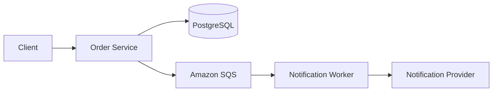
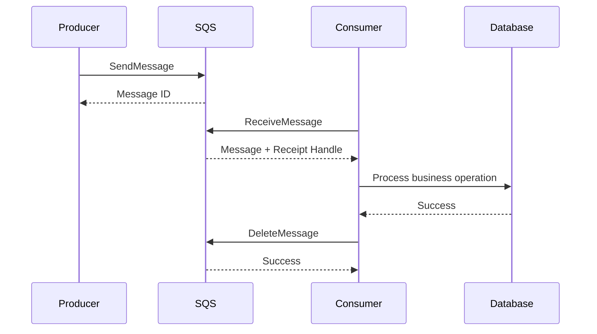
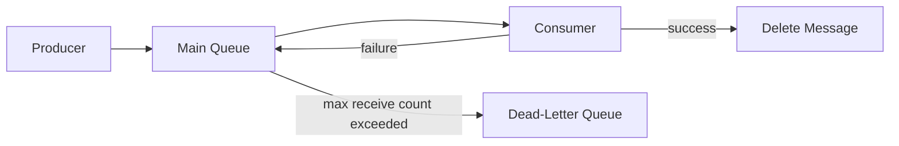
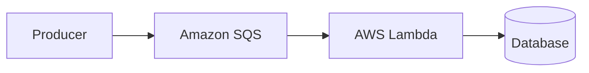
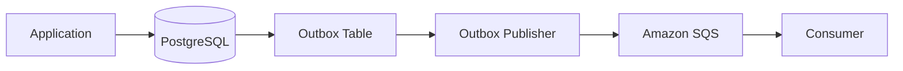
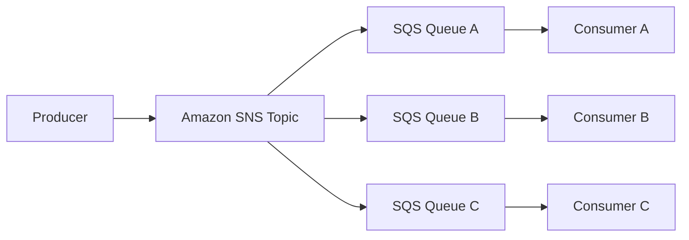
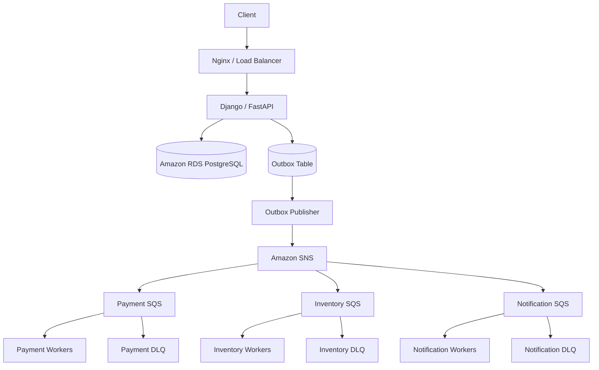

# 06- Amazon SQS

## Overview

Amazon Simple Queue Service (Amazon SQS) is a fully managed message queuing service used to decouple distributed applications and process work asynchronously.

SQS is intentionally simpler than a full-featured broker such as RabbitMQ. Instead of managing exchanges, bindings, broker nodes, and queue replication, the application interacts directly with an AWS-managed queue.

A typical architecture is:

```text
Producer
   |
   | SendMessage
   v
Amazon SQS
   |
   | ReceiveMessage
   v
Consumer
   |
   v
Business Processing
```

SQS is particularly useful for:

- Asynchronous background processing.
- Decoupling microservices.
- Buffering traffic spikes.
- Reliable task delivery.
- Distributed workers.
- Event-driven AWS architectures.
- Integrating Lambda with asynchronous workloads.
- Isolating unreliable or slow downstream systems.

SQS should generally be viewed as a **durable asynchronous work boundary**, not as a database, cache, or general-purpose event-streaming platform.

## Why SQS Exists

Synchronous communication creates temporal coupling.

Consider:

```text
Client
  |
  v
Order Service
  |
  v
Payment Service
  |
  v
Notification Service
```

If Notification Service is unavailable, the Order Service may become slower or fail even though notification is not required to create the order.

SQS changes the architecture:



The order service can enqueue work and return without waiting for notification processing.

This provides:

- Temporal decoupling.
- Failure isolation.
- Backpressure.
- Independent scaling.
- Asynchronous execution.

## Core SQS Model

The fundamental SQS model is:

```text
Producer
   |
   v
Queue
   |
   +--> Consumer A
   |
   +--> Consumer B
   |
   +--> Consumer C
```

Unlike RabbitMQ, a producer does not normally publish to an exchange.

The producer sends a message directly to an SQS queue.

| Component | Responsibility |
|---|---|
| Producer | Sends messages |
| Queue | Stores messages |
| Consumer | Receives and processes messages |
| Visibility timeout | Temporarily hides received messages |
| Dead-letter queue | Captures messages that repeatedly fail |
| Long polling | Reduces unnecessary empty receives |
| Message retention | Controls how long messages remain available |
| Delay queue | Delays message availability |
| IAM | Controls access |
| CloudWatch | Provides monitoring and metrics |

## Standard Queue vs FIFO Queue

SQS provides two primary queue types:

| Feature | Standard Queue | FIFO Queue |
|---|---|---|
| Throughput | Very high | Lower, with scaling options |
| Ordering | Best effort | Strict ordering within a message group |
| Delivery | At-least-once | Exactly-once processing semantics for supported deduplication behavior |
| Duplicate delivery | Possible | Designed to prevent duplicate processing within deduplication interval |
| Use case | General asynchronous workloads | Ordering and deduplication-sensitive workloads |
| Scaling | Excellent | Strong, but constrained by FIFO semantics |

The choice should be based on business semantics rather than simply selecting FIFO because it appears more reliable.

## Standard Queues

Standard queues are designed for very high throughput and distributed workloads.

They provide **at-least-once delivery**, meaning a message can occasionally be delivered more than once.

Therefore:

```text
Consumer
   |
   +--> Process message
   |
   +--> Duplicate delivery
```

must be considered normal.

Consumers should be idempotent.

Standard queues are appropriate when:

- Ordering is not mandatory.
- High throughput is important.
- Duplicate processing can be safely handled.
- Work can be processed independently.

Examples include:

- Image processing.
- Email delivery.
- Analytics jobs.
- Report generation.
- Background data processing.

## FIFO Queues

FIFO means:

```text
First In
First Out
```

FIFO queues provide stronger ordering guarantees and support deduplication.

They are useful when operations must be processed in a defined order.

For example:

```text
AccountCreated
AccountUpdated
AccountSuspended
```

must not be processed as:

```text
AccountUpdated
AccountCreated
AccountSuspended
```

FIFO queues are useful for workloads such as:

- Financial operations.
- State transitions.
- Ordered commands.
- Inventory workflows.
- Per-customer or per-account processing.

## Message Groups

FIFO queues support message groups.

For example:

```text
Message Group: customer-123

A
B
C
```

Messages within the same group are processed in order.

Different groups can be processed concurrently:

```text
customer-123 -> A -> B -> C
customer-456 -> X -> Y -> Z
customer-789 -> P -> Q -> R
```

This allows a system to combine:

```text
ordering within an entity
+
parallelism across entities
```

This is a powerful system-design pattern.

For example:

```text
customer_id = message_group_id
```

can preserve per-customer ordering while allowing different customers to be processed concurrently.

## Message Lifecycle

A message typically follows this lifecycle:



The important detail is that **receiving a message does not delete it**.

The consumer must explicitly delete the message after successful processing.

## Visibility Timeout

When a consumer receives a message, SQS temporarily hides it from other consumers.

This period is called the **visibility timeout**.

```text
Queue
 |
 +--> Message A
 |
 v
Consumer receives A
 |
 v
A becomes invisible
 |
 +--> Consumer processes A
 |
 v
DeleteMessage
```

If the consumer successfully deletes the message:

```text
Message -> removed
```

If the consumer crashes before deleting it:

```text
Visibility timeout expires
        |
        v
Message becomes visible again
```

This is the foundation of SQS at-least-once processing.

## Visibility Timeout Design

Suppose average processing time is:

```text
20 seconds
```

and the visibility timeout is:

```text
5 seconds
```

The message can become visible again while the first worker is still processing it.

That can produce duplicate concurrent processing:

```text
Worker A
  |
  +--> processing message
  |
  | 5 seconds
  v
Visibility expires
  |
  v
Worker B receives same message
```

The visibility timeout should normally exceed expected processing time with sufficient headroom.

However, do not simply configure an extremely large timeout.

If a consumer crashes, the message remains invisible for that entire period before becoming available again.

## ChangeMessageVisibility

For long-running or variable-duration tasks, consumers can extend visibility while processing.

For example:

```text
Initial timeout = 60 seconds

Processing continues
       |
       v
Extend visibility
       |
       v
Continue processing
       |
       v
Delete message
```

This is useful when processing time is unpredictable.

A common pattern is:

```text
visibility timeout
>
expected processing duration
```

combined with:

```text
periodic visibility extension
```

for exceptionally long operations.

## Message Acknowledgment

SQS does not use RabbitMQ-style `ACK` semantics.

Instead:

```text
ReceiveMessage
       |
       v
Process
       |
       v
DeleteMessage
```

Deleting the message is effectively the successful completion signal.

If the consumer does not delete it:

```text
visibility timeout expires
       |
       v
message becomes available again
```

This distinction is important in interviews.

## At-Least-Once Delivery

Standard SQS queues provide at-least-once delivery.

That means:

```text
Message sent
    |
    v
Consumer receives
    |
    v
Processing succeeds
    |
    X
DeleteMessage fails
    |
    v
Message becomes visible again
```

The same message may be processed twice.

Therefore, a production consumer must be designed for idempotency.

## Idempotent Consumers

Suppose:

```json
{
  "event_id": "evt-1001",
  "order_id": "order-123"
}
```

is delivered twice.

The consumer should not create two orders or charge the customer twice.

A PostgreSQL uniqueness constraint can provide an important safety boundary:

```sql
CREATE TABLE processed_messages (
    consumer_name TEXT NOT NULL,
    event_id TEXT NOT NULL,
    processed_at TIMESTAMPTZ NOT NULL DEFAULT NOW(),
    PRIMARY KEY (consumer_name, event_id)
);
```

The exact implementation depends on the business operation.

For financial operations, use transactional database constraints and idempotency keys rather than relying only on application-level checks.

## Long Polling

Without long polling, a consumer may repeatedly ask:

```text
ReceiveMessage
    |
    v
No message
    |
    v
ReceiveMessage
    |
    v
No message
```

This creates unnecessary API calls.

Long polling allows SQS to wait for messages to become available.

Conceptually:

```text
Consumer
   |
   | ReceiveMessage(wait)
   v
SQS
   |
   | wait for message
   |
   v
Message
```

Long polling generally reduces:

- Empty responses.
- API calls.
- Consumer CPU usage.
- Unnecessary polling traffic.

For most consumers, long polling should be preferred over aggressive short polling.

## Batch Operations

SQS supports batch APIs for sending, receiving, and deleting messages.

For example:

```text
Receive up to N messages
       |
       v
Process batch
       |
       v
Delete successfully processed messages
```

Batch operations can improve throughput and reduce API request overhead.

However, batch processing complicates failure handling.

For example:

```text
10 messages received

Message 1 -> success
Message 2 -> success
Message 3 -> failure
Message 4 -> success
...
```

The consumer should delete only the successfully processed messages.

Do not assume a failed message means the entire batch should be retried.

## Message Retention

SQS messages remain available for a configurable retention period.

Retention should be based on recovery requirements.

Ask:

- How long can consumers be unavailable?
- How long do we need to recover failed processing?
- Can messages be reconstructed?
- What is the business RPO?

Longer retention can improve recovery flexibility but increases the amount of stored data.

## Delay Queues

SQS supports delaying message visibility for a configured period.

Example:

```text
Send message
     |
     v
Delay = 60 seconds
     |
     v
Message becomes available
```

This can be useful for:

- Delayed processing.
- Short scheduling windows.
- Retry workflows.
- Temporary deferral.

Do not use SQS delay as a replacement for a full scheduling system when the business requires complex calendars, recurring schedules, or long-term workflow orchestration.

## Dead-Letter Queues

A dead-letter queue (DLQ) receives messages that repeatedly fail processing.



The DLQ prevents permanently failing messages from repeatedly cycling through the main queue.

A typical configuration uses:

```text
Main Queue
    |
    +--> maxReceiveCount
             |
             v
           DLQ
```

The DLQ should be monitored and operationally owned.

## Redrive Policy

A redrive policy determines when messages are moved to a DLQ.

For example:

```text
maxReceiveCount = 5
```

means a message that repeatedly fails processing can eventually be moved to the DLQ.

The number should reflect:

- Expected transient failure rate.
- Retry duration.
- Processing cost.
- Downstream recovery time.
- Business SLA.

Do not choose `5` simply because it is a common example.

## DLQ Redrive

A DLQ should support a controlled recovery process.

A typical workflow is:

```text
Main Queue
    |
    X
Repeated failures
    |
    v
DLQ
    |
    v
Investigation
    |
    +--> Fix consumer
    |
    +--> Correct data
    |
    v
Redrive
    |
    v
Main Queue
```

Blindly replaying a large DLQ can overload the system.

Replay should be rate-limited and observable.

## Poison Messages

A poison message is a message that consistently causes processing failure.

Example:

```text
Malformed payload
       |
       v
Consumer
       |
       v
Failure
       |
       v
Retry
       |
       v
Failure
       |
       v
DLQ
```

Without a DLQ:

```text
Failure
   |
   v
Retry
   |
   v
Failure
   |
   v
Retry forever
```

This can consume worker capacity and increase system latency.

## Retry Strategies

SQS does not automatically provide arbitrary application-level retry policies.

Retry behavior is normally designed around:

- Visibility timeout.
- Receive count.
- DLQs.
- Additional retry queues.
- Application logic.
- EventBridge Scheduler or other AWS services where appropriate.

A simple retry model is:

```text
Main Queue
    |
    v
Consumer
    |
    +--> success
    |
    +--> failure
            |
            v
       Visibility timeout
            |
            v
          Retry
            |
            v
       max attempts
            |
            v
           DLQ
```

For exponential backoff, separate delay queues can be used:

```text
Main Queue
    |
    v
Retry 1 Queue
    |
    | delay
    v
Retry 2 Queue
    |
    | longer delay
    v
Retry 3 Queue
    |
    v
DLQ
```

The architecture should prevent retry storms.

## Queue-Based Load Leveling

One of the strongest system-design uses of SQS is absorbing traffic bursts.

Suppose:

```text
Traffic spike:
20,000 requests/sec
```

but workers can process:

```text
5,000 jobs/sec
```

Without a queue:

```text
Application
    |
    v
Database / downstream service
    |
    X
Overloaded
```

With SQS:

```text
Application
    |
    v
SQS
    |
    +--> Worker
    +--> Worker
    +--> Worker
    +--> Worker
```

The queue absorbs the burst while consumers process at a sustainable rate.

This is called **load leveling** or **buffering**.

## Backpressure

A queue is not a solution to unlimited traffic.

If:

```text
arrival rate > processing rate
```

for a sustained period, backlog grows indefinitely.

For example:

```text
Producer = 10,000 msg/sec
Consumer = 7,000 msg/sec

Backlog growth = 3,000 msg/sec
```

Eventually the queue reaches operational or business limits.

Therefore monitor:

- Queue depth.
- Oldest message age.
- Consumer throughput.
- Producer throughput.
- Processing latency.
- DLQ volume.

The most useful signal is often **message age**, because it maps directly to user-visible processing delay.

## Scaling Consumers

SQS supports horizontal consumer scaling.

```text
              +--> Worker 1
              |
SQS Queue ----+--> Worker 2
              |
              +--> Worker 3
              |
              +--> Worker N
```

Workers can run on:

- ECS.
- EKS.
- EC2.
- AWS Lambda.
- Kubernetes.
- Fargate.
- Other compute platforms.

A scaling policy can use queue-related metrics.

For example:

```text
Queue backlog increases
       |
       v
Increase workers
       |
       v
Processing rate increases
       |
       v
Backlog decreases
```

However, scaling workers too aggressively can overload:

- PostgreSQL.
- Redis.
- External APIs.
- CPU.
- Network.
- Other downstream services.

Consumer scaling must consider the entire dependency chain.

## SQS and AWS Lambda

SQS integrates naturally with Lambda.



Lambda polls the queue and invokes functions with batches of messages.

This removes the need to manage consumer servers for some workloads.

However, Lambda concurrency must be controlled.

If SQS contains:

```text
1 million messages
```

and Lambda scales aggressively, downstream systems may suddenly receive a large amount of traffic.

Use:

- Reserved concurrency.
- Event source scaling controls.
- Appropriate batch sizes.
- Visibility timeout.
- DLQs.
- Idempotent handlers.

## Lambda Visibility Timeout

When SQS triggers Lambda, the visibility timeout should be long enough to cover the Lambda processing lifecycle.

If the Lambda function can take:

```text
30 seconds
```

and the message becomes visible after:

```text
10 seconds
```

the same message can be processed concurrently.

The relationship between:

```text
Lambda timeout
+
SQS visibility timeout
+
retry behavior
```

must be deliberately configured.

## SQS and Django

A Django application can publish work to SQS using the AWS SDK.

Using `boto3`:

```python
import json
import os

import boto3


sqs = boto3.client(
    "sqs",
    region_name=os.environ["AWS_REGION"],
)

QUEUE_URL = os.environ["SQS_QUEUE_URL"]


def enqueue_invoice(order_id: str) -> None:
    payload = {
        "event_id": f"invoice:{order_id}",
        "event_type": "invoice.generate",
        "order_id": order_id,
    }

    sqs.send_message(
        QueueUrl=QUEUE_URL,
        MessageBody=json.dumps(payload),
    )
```

The Django request should generally not wait for the background worker.

```text
POST /orders
     |
     v
Django
     |
     +--> PostgreSQL
     |
     +--> SQS
     |
     v
HTTP 202 / 201
```

The consumer can run separately:

```text
SQS
 |
 v
Worker
 |
 v
Generate invoice
```

For Django applications already using Celery, SQS can also serve as a Celery broker depending on the deployment requirements.

## SQS and FastAPI

FastAPI can publish messages through `boto3`.

```python
import json

import boto3
from fastapi import FastAPI, status

app = FastAPI()

sqs = boto3.client("sqs", region_name="ap-south-1")
QUEUE_URL = "https://sqs.ap-south-1.amazonaws.com/123456789012/orders"


@app.post("/orders", status_code=status.HTTP_202_ACCEPTED)
def create_order(order_id: str):
    message = {
        "event_type": "order.created",
        "order_id": order_id,
    }

    sqs.send_message(
        QueueUrl=QUEUE_URL,
        MessageBody=json.dumps(message),
    )

    return {
        "status": "accepted",
        "order_id": order_id,
    }
```

For production applications:

- Use IAM roles instead of static credentials.
- Load configuration from environment or a configuration system.
- Configure timeouts and retries appropriately.
- Add correlation IDs.
- Emit structured logs and metrics.
- Do not hardcode queue URLs or regions.

## SQS with Celery

Celery can use SQS as a broker.

The architecture becomes:

```text
Django / FastAPI
       |
       v
     Celery
       |
       v
      SQS
       |
       v
 Celery Workers
```

This can be useful when the application already relies on Celery abstractions.

However, SQS and RabbitMQ have different broker semantics.

When choosing a Celery broker, evaluate:

- Delivery guarantees.
- Visibility timeout.
- Retry behavior.
- Throughput.
- Operational requirements.
- Existing AWS architecture.
- Task acknowledgment behavior.

## SQS and PostgreSQL

A common architecture is:

```text
Application
    |
    +--> PostgreSQL
    |
    +--> SQS
```

The difficult problem is atomicity.

Consider:

```text
BEGIN
   |
   +--> INSERT order
COMMIT
   |
   X
SQS send fails
```

The database says the order exists, but the asynchronous event was not published.

The reverse is also possible:

```text
SQS send succeeds
   |
   X
Database transaction rolls back
```

Now consumers may process an event for data that does not exist.

## Transactional Outbox

The transactional outbox pattern solves this coordination problem.



The application transaction writes:

```text
business data
+
outbox record
```

atomically.

Example:

```sql
BEGIN;

INSERT INTO orders (
    id,
    customer_id,
    status
)
VALUES (
    'order-123',
    'customer-456',
    'created'
);

INSERT INTO outbox_events (
    event_id,
    event_type,
    aggregate_id,
    payload
)
VALUES (
    'evt-1001',
    'order.created',
    'order-123',
    '{"order_id":"order-123"}'
);

COMMIT;
```

A publisher later sends the outbox event to SQS.

The publisher should be idempotent because it may publish the same event more than once.

## SQS and SNS

SNS and SQS are frequently used together.

SNS provides publish/subscribe fan-out, while SQS provides durable queue-based consumption.



This is a powerful AWS event-driven pattern.

For example:

```text
OrderCreated
      |
      v
SNS Topic
      |
      +--> Payment Queue
      +--> Inventory Queue
      +--> Notification Queue
      +--> Analytics Queue
```

Each consumer gets an independent queue.

This is conceptually similar to fanout messaging in RabbitMQ.

## SQS vs SNS

| Feature | SQS | SNS |
|---|---|---|
| Primary abstraction | Queue | Topic |
| Message storage | Yes | Short-lived delivery/fanout mechanism |
| Consumer pull | Yes | Primarily push/fanout |
| Work queue | Excellent | No |
| Fan-out | Through integrations | Core feature |
| Consumer isolation | Queue per consumer | Topic subscribers |
| Retry buffering | Strong | Often combined with SQS |
| Typical role | Async work | Event distribution |

A common architecture is:

```text
Producer
   |
   v
SNS
   |
   +--> SQS A
   +--> SQS B
   +--> SQS C
```

rather than trying to make one SQS queue serve multiple independent consumer applications.

## SQS vs RabbitMQ

| Area | SQS | RabbitMQ |
|---|---|---|
| Infrastructure management | AWS-managed | Self-managed or managed service |
| Exchanges | No | Yes |
| Routing | Simpler | Rich |
| Queue model | Strong | Strong |
| AWS integration | Excellent | Good |
| Operational overhead | Low | Higher |
| Protocol flexibility | AWS API | AMQP and client ecosystem |
| Fine-grained broker control | Lower | Higher |
| Work queues | Excellent | Excellent |
| Pub/Sub | With SNS integration | Native exchange model |
| Typical choice | AWS-native applications | Sophisticated broker requirements |

Choose SQS when managed AWS infrastructure and simple durable queues are more valuable than broker-level routing flexibility.

## SQS vs Kafka

| Area | SQS | Kafka |
|---|---|---|
| Primary abstraction | Queue | Distributed event log |
| Message replay | Limited | Core capability |
| Long-term retention | Limited compared with Kafka | Strong |
| Partitioning | Not application-controlled in the Kafka sense | Core scaling mechanism |
| Consumer groups | Different model | Core abstraction |
| Work queues | Excellent | Possible |
| Event streaming | Limited | Excellent |
| Operational overhead | Very low | Higher |
| AWS integration | Excellent | Available through managed services |
| Typical use | Async jobs | Event streams and pipelines |

A useful architectural distinction is:

```text
Need asynchronous work delivery?
    -> SQS

Need durable event history and replay?
    -> Kafka
```

## Message Size

SQS messages have a maximum message size.

Large application payloads should generally not be embedded directly in messages.

Instead of:

```json
{
  "order_id": "123",
  "invoice_pdf": "<large binary payload>"
}
```

prefer:

```json
{
  "order_id": "123",
  "invoice_uri": "s3://bucket/orders/123/invoice.pdf"
}
```

The consumer can retrieve the object from Amazon S3.

This reduces:

- Network transfer.
- Queue payload size.
- Consumer memory usage.
- Serialization overhead.

## Security

SQS security is primarily integrated with AWS IAM.

Use:

- IAM policies.
- IAM roles for workloads.
- Least privilege.
- Encryption at rest.
- KMS customer-managed keys when required.
- VPC endpoints where appropriate.
- TLS for transport.
- CloudTrail for API auditing.
- Secrets management for application credentials where credentials are unavoidable.

A workload should have permission to perform only the required operations.

For example:

```text
Producer:
    sqs:SendMessage

Consumer:
    sqs:ReceiveMessage
    sqs:DeleteMessage
    sqs:ChangeMessageVisibility
```

Avoid giving every application:

```text
sqs:*
```

## IAM Example

A producer might require a policy conceptually similar to:

```json
{
  "Version": "2012-10-17",
  "Statement": [
    {
      "Effect": "Allow",
      "Action": [
        "sqs:SendMessage"
      ],
      "Resource": "arn:aws:sqs:ap-south-1:123456789012:orders"
    }
  ]
}
```

A consumer requires additional permissions for receiving and deleting messages.

Use workload IAM roles whenever possible.

Do not place long-lived AWS access keys inside:

- Docker images.
- Git repositories.
- Source code.
- CI logs.
- Kubernetes manifests.

## Encryption

SQS supports server-side encryption.

Encryption protects messages while stored by the service.

Use AWS-managed encryption when it satisfies the organization's requirements.

Use customer-managed KMS keys when requirements include:

- Explicit key ownership.
- Key rotation control.
- Fine-grained key policies.
- Cross-account governance.
- Regulatory requirements.

Encryption does not replace application-level authorization.

A consumer that can read a queue can still access the decrypted message.

## High Availability

SQS is a regional managed AWS service designed to remove the need for application teams to operate broker nodes.

This significantly reduces operational concerns compared with self-managed RabbitMQ.

You do not normally need to design:

```text
RabbitMQ node 1
RabbitMQ node 2
RabbitMQ node 3
```

when using SQS.

Instead, focus on:

- Consumer availability.
- Multi-AZ application deployment.
- IAM.
- Queue configuration.
- DLQs.
- Monitoring.
- Recovery procedures.
- Downstream resilience.

The managed queue removes broker infrastructure management, not application failure management.

## Monitoring

SQS integrates with Amazon CloudWatch.

Important metrics include:

| Metric | Why it matters |
|---|---|
| ApproximateNumberOfMessagesVisible | Current backlog |
| ApproximateNumberOfMessagesNotVisible | Messages currently being processed |
| NumberOfMessagesSent | Producer throughput |
| NumberOfMessagesReceived | Consumer activity |
| NumberOfMessagesDeleted | Successful processing |
| NumberOfMessagesReceived - NumberOfMessagesDeleted | Potential processing pressure |
| DLQ message count | Failed workload |
| Oldest message age | Processing latency / backlog age |

Metrics should be interpreted as operational signals rather than exact transactional counters where AWS documents them as approximate.

## Queue Age

Queue depth is useful but message age is often more meaningful.

Suppose:

```text
Queue depth = 100
```

If consumers process:

```text
10,000 msg/sec
```

100 messages may be harmless.

But:

```text
Queue depth = 100
```

with:

```text
consumer rate = 1 msg/sec
```

may represent severe user-visible latency.

For SLA-driven systems, monitor:

```text
oldest message age
```

against the business processing SLA.

## CloudWatch Alarms

Useful alarms include:

```text
Oldest message age > SLA
DLQ message count > 0
Queue backlog growing continuously
Messages not deleted
Consumer throughput drops
Lambda errors increase
```

Alert thresholds should be based on business requirements.

For example:

```text
Payment processing SLA = 2 minutes

Alert:
oldest message age > 90 seconds
```

is more meaningful than:

```text
queue depth > 1,000
```

without workload context.

## Cost Considerations

SQS pricing is primarily usage-oriented rather than infrastructure-oriented.

Costs depend on factors such as:

- API requests.
- Message operations.
- Payload size.
- Encryption-related usage.
- Data transfer.
- Related services such as Lambda, SNS, or KMS.

Batch APIs can reduce the number of API operations for high-throughput systems.

For example:

```text
10 individual SendMessage calls
```

can often be replaced with:

```text
1 SendMessageBatch call
```

when the workload allows batching.

Cost optimization should not compromise reliability.

## Disaster Recovery

SQS is a managed regional service, but disaster recovery requirements still need explicit design.

Questions to answer:

- Is the queue regional or cross-region?
- Can messages be regenerated?
- What is the required RPO?
- What is the required RTO?
- How are producers redirected?
- How are consumers deployed in the recovery region?
- Are encryption keys available?
- Are queue policies and infrastructure definitions reproducible?

For critical workloads, infrastructure should be defined using IaC such as:

- AWS CloudFormation.
- AWS CDK.
- Terraform.

A recovery environment should not depend on manually created queues.

## Queue Naming and Ownership

Use predictable naming conventions.

For example:

```text
production-orders
production-payments
production-notifications
```

or:

```text
prod.order.created
prod.payment.process
prod.email.send
```

The exact convention matters less than consistency.

Document:

- Queue owner.
- Producer.
- Consumer.
- Purpose.
- SLA.
- Retry policy.
- DLQ.
- Data classification.
- Retention.
- Operational contact.

A queue without clear ownership becomes difficult to operate as the system grows.

## Schema Evolution

SQS does not enforce message schemas.

A message contract should therefore be explicitly defined.

For example:

```json
{
  "schema_version": 2,
  "event_id": "evt-1001",
  "event_type": "order.created",
  "occurred_at": "2026-08-23T10:30:00Z",
  "data": {
    "order_id": "order-123"
  }
}
```

Use compatibility rules when evolving schemas.

Prefer additive changes:

```text
v1:
{
    order_id
}

v2:
{
    order_id,
    customer_id
}
```

over destructive changes:

```text
v1:
order_id: string

v2:
order_id: object
```

Consumers should be tolerant of fields they do not understand when appropriate.

## Observability Metadata

Messages should carry useful correlation information.

Example:

```json
{
  "event_id": "evt-1001",
  "correlation_id": "req-9001",
  "trace_id": "trace-abc123",
  "event_type": "order.created",
  "schema_version": 1,
  "occurred_at": "2026-08-23T10:30:00Z",
  "data": {
    "order_id": "order-123"
  }
}
```

This makes it possible to trace:

```text
HTTP Request
    |
    v
Django / FastAPI
    |
    v
SQS
    |
    v
Worker
    |
    v
PostgreSQL
```

without relying only on application logs.

## Common Mistakes

### Treating SQS Like Kafka

SQS is not a long-term event log.

Do not design a system around arbitrary replay of a historical message stream.

Use Kafka or another event-streaming technology when durable replay is a primary requirement.

### Assuming Exactly-Once Processing

Standard SQS can deliver duplicate messages.

Consumers must be idempotent.

### Deleting Before Processing

This is dangerous:

```text
Receive
  |
  v
Delete
  |
  v
Process
```

If processing fails after deletion, the message cannot be retried.

Prefer:

```text
Receive
  |
  v
Process
  |
  v
Delete
```

### Incorrect Visibility Timeout

If visibility timeout is too short, duplicate concurrent processing becomes more likely.

If it is excessively long, recovery from crashed consumers becomes slower.

### No DLQ

Without a DLQ, poison messages can repeatedly consume processing capacity.

### No Long Polling

Aggressive short polling causes unnecessary empty receives and increased API activity.

### Ignoring Message Age

A queue can appear healthy based on message count while processing latency is already violating the SLA.

### Unbounded Consumer Scaling

Adding consumers can overload the database or external dependency.

### Large Messages

Use S3 for large objects and place references in SQS messages.

### Hardcoded AWS Credentials

Use IAM roles and workload identity mechanisms rather than static credentials.

### No Transactional Boundary

Assuming PostgreSQL commit and SQS publication are atomic creates consistency gaps.

Use the transactional outbox pattern where reliable event publication is required.

### Replaying an Entire DLQ at Once

A large replay can create another production incident.

Replay gradually and monitor downstream capacity.

### Using FIFO Without a Real Ordering Requirement

FIFO semantics can introduce unnecessary constraints.

Use FIFO when ordering or deduplication semantics provide concrete business value.

## Production Architecture

A production AWS backend might use:



This architecture separates:

```text
Synchronous request processing
```

from:

```text
Asynchronous work processing
```

and provides independent scaling for each consumer.

For example:

```text
Payment workers:
    constrained by payment provider

Inventory workers:
    constrained by PostgreSQL

Notification workers:
    constrained by email provider
```

Each queue can therefore have its own:

- Retry policy.
- Visibility timeout.
- Consumer scaling.
- DLQ.
- SLA.
- Monitoring.

## Production Checklist

### Reliability

- Use standard or FIFO queues based on business semantics.
- Configure appropriate visibility timeouts.
- Use DLQs for failure isolation.
- Make consumers idempotent.
- Use transactional outbox where required.
- Implement bounded retries.
- Monitor message age.
- Test consumer crash recovery.

### Scalability

- Use horizontal consumers.
- Use long polling.
- Use batch APIs where appropriate.
- Tune consumer concurrency.
- Protect downstream dependencies.
- Scale based on backlog and age.
- Avoid unnecessarily large messages.

### Security

- Use IAM roles.
- Apply least-privilege queue policies.
- Enable encryption.
- Use KMS where required.
- Restrict network access where appropriate.
- Audit access.
- Never commit AWS credentials.

### Operations

- Monitor queue depth.
- Monitor oldest message age.
- Monitor DLQs.
- Monitor consumer errors.
- Track producer and consumer throughput.
- Define queue ownership.
- Document retry and replay procedures.
- Test disaster recovery.

### Cost

- Use batch APIs.
- Avoid unnecessary polling.
- Use long polling.
- Keep messages compact.
- Avoid unnecessary cross-region traffic.
- Review related Lambda, SNS, KMS, and data-transfer costs.

## Interview Questions

### What is Amazon SQS?

Amazon SQS is a fully managed message queuing service used to decouple distributed systems and process work asynchronously.

### What are the two main SQS queue types?

Standard and FIFO.

### What is the main difference?

Standard queues provide very high throughput with at-least-once delivery and best-effort ordering. FIFO queues provide stronger ordering and deduplication semantics.

### Does SQS provide exactly-once delivery?

Standard SQS does not.

Consumers should generally be idempotent.

FIFO queues provide deduplication capabilities, but applications should still be designed defensively against duplicate business effects.

### What is visibility timeout?

The period during which a received message is hidden from other consumers before it is deleted or becomes visible again.

### What happens if a consumer crashes?

If the message was not deleted, it becomes visible again after the visibility timeout.

### Why do we need idempotent consumers?

Because at-least-once delivery can result in duplicate processing.

### What is a DLQ?

A dead-letter queue stores messages that repeatedly fail processing after exceeding a configured receive threshold.

### What is long polling?

Long polling allows SQS to wait for messages during a receive request, reducing empty responses and unnecessary API calls.

### How do you handle a poison message?

Use bounded retries, an appropriate visibility timeout, and a DLQ.

### How do you scale SQS consumers?

Run multiple consumers and scale them based on queue backlog, message age, processing throughput, and downstream capacity.

### What is the transactional outbox pattern?

It stores business data and the event to be published in the same database transaction, then asynchronously publishes the outbox event to SQS.

### SQS vs RabbitMQ?

SQS is a managed AWS queue service with low operational overhead. RabbitMQ provides richer broker-level routing and messaging semantics but requires more infrastructure management.

### SQS vs Kafka?

SQS is primarily designed for asynchronous work delivery and queue-based decoupling. Kafka is designed around durable partitioned event streams, retention, and replay.

### Why use SNS with SQS?

SNS provides fan-out while SQS provides durable independent queues for each consumer.

### Why not use one SQS queue for all consumers?

Independent consumers would compete for messages instead of each receiving its own copy. Use separate queues, commonly behind SNS fan-out, when consumers require independent processing.

### What happens if the visibility timeout is too short?

A message can become visible again while the original consumer is still processing it, causing duplicate concurrent processing.

### What happens if the visibility timeout is too long?

Failed messages remain hidden longer before another consumer can retry them.

### How do you prevent SQS from overwhelming PostgreSQL?

Control consumer concurrency, batch size, worker scaling, and database connection usage. Scale based on downstream capacity rather than queue backlog alone.

## Key Takeaways

- **Amazon SQS is a managed asynchronous queue that provides temporal decoupling, buffering, failure isolation, and independent consumer scaling without requiring broker infrastructure management.**
- **Standard queues favor high throughput and at-least-once delivery, while FIFO queues should be used when ordering and deduplication semantics provide concrete business value.**
- **Visibility timeout, explicit message deletion, idempotent consumers, bounded retries, and DLQs are the core mechanisms for building reliable SQS consumers.**
- **SNS + SQS is a strong AWS-native fan-out pattern, while Kafka is generally more appropriate when durable event history, replay, and partition-based streaming are primary requirements.**
- **Production SQS architecture must account for downstream capacity, message age, observability, IAM, encryption, transactional outbox patterns, controlled scaling, and disaster recovery.**