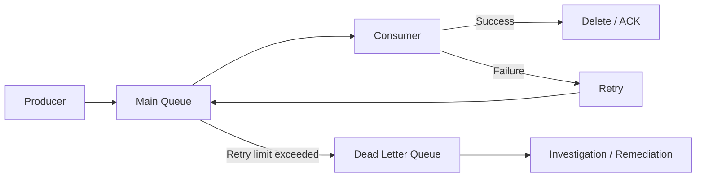
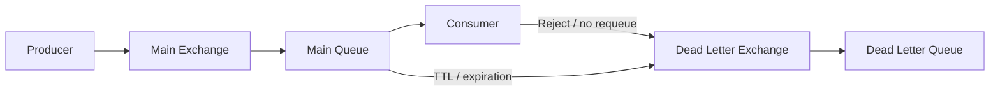
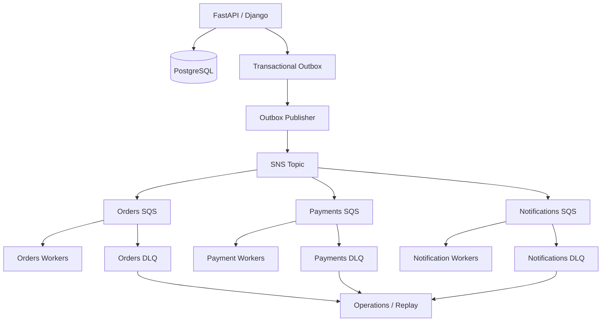

# 07- Dead Letter Queues

## Overview

A Dead Letter Queue (DLQ) is a dedicated queue that receives messages that cannot be successfully processed after a configured number of attempts or after exhausting an application-defined retry strategy.

A DLQ changes failure handling from:

```text
Message
   |
   v
Consumer
   |
   X
Failure
   |
   v
Retry forever
   |
   v
Failure
   |
   v
Retry forever
```

to:

```text
Message
   |
   v
Consumer
   |
   X
Failure
   |
   v
Retry
   |
   X
Failure
   |
   v
Retry limit reached
   |
   v
Dead Letter Queue
```

The DLQ is not merely a storage location for failed messages. It is an **operational isolation boundary** that prevents poison messages from continuously consuming consumer capacity while preserving failed work for investigation, correction, and controlled replay.

DLQs are commonly used with:

- Amazon SQS
- RabbitMQ
- Kafka-based retry architectures
- Celery
- Microservices
- Event-driven architectures
- Background workers
- Payment and order-processing systems
- Notification pipelines

A production DLQ strategy should answer four questions:

1. Why did processing fail?
2. How many times should the system retry?
3. What should happen after retries are exhausted?
4. How can failed messages be safely recovered?

## Why Dead Letter Queues Exist

Distributed systems fail for many reasons:

- Temporary database outages.
- External API failures.
- Network failures.
- Invalid payloads.
- Schema incompatibilities.
- Application bugs.
- Authorization failures.
- Missing referenced data.
- Expired business state.
- Poison messages.

Without a DLQ, a permanently failing message can repeatedly consume worker capacity.

For example:

```text
Queue
 |
 +--> Message A -> success
 |
 +--> Message B -> permanent failure
 |
 +--> Message C -> success
```

If Message B is continuously retried:

```text
Worker
  |
  +--> B -> failure
  |
  +--> B -> failure
  |
  +--> B -> failure
  |
  +--> B -> failure
```

the system wastes processing capacity on work that cannot currently succeed.

A DLQ isolates that failure:

```text
Main Queue
    |
    +--> A -> success
    |
    +--> B -> failure -> retry -> DLQ
    |
    +--> C -> success
```

The remaining workload can continue processing normally.

## What Is a Poison Message?

A poison message is a message that repeatedly causes processing failure.

Example:

```json
{
  "event_type": "order.created",
  "order_id": null
}
```

Suppose the consumer requires `order_id`.

Every processing attempt fails:

```text
Receive
   |
   v
Validate
   |
   X
Invalid payload
   |
   v
Retry
```

Because the underlying message itself is invalid, simply retrying it will not fix the problem.

Other examples include:

- Invalid JSON.
- Unsupported schema version.
- Missing required fields.
- Invalid enum values.
- Corrupt data.
- Referenced resource permanently deleted.
- Business rule violation.
- Consumer bug affecting a specific message.

DLQs are particularly valuable for these cases.

## Temporary Failure vs Permanent Failure

Not every failure should immediately result in a DLQ.

A useful distinction is:

| Failure | Typical handling |
|---|---|
| Temporary network timeout | Retry |
| Database connection failure | Retry |
| External API 503 | Retry with backoff |
| Rate limit | Retry with delay |
| Invalid JSON | DLQ |
| Missing required field | DLQ |
| Unsupported schema | DLQ or quarantine |
| Application bug | Retry cautiously, then DLQ |
| Authentication configuration error | Alert and retry carefully |
| Business validation failure | Usually DLQ |
| Permanent downstream rejection | Usually DLQ |

The system should distinguish **transient failures** from **permanent failures** whenever possible.

## DLQ Architecture

A basic queue architecture is:



The main queue handles normal processing.

The DLQ handles messages that have exceeded the configured failure policy.

## Message Lifecycle

A typical message lifecycle is:

```text
Produced
   |
   v
Main Queue
   |
   v
Consumer receives message
   |
   +----> Success ----> Delete
   |
   +----> Temporary failure
   |             |
   |             v
   |           Retry
   |
   +----> Permanent failure
                 |
                 v
                DLQ
```

The exact implementation depends on the messaging technology.

For SQS, a message can be moved to a DLQ after exceeding `maxReceiveCount`.

For RabbitMQ, dead-letter exchanges can route rejected or expired messages to another queue.

For Kafka, DLQ behavior is generally implemented through application-level topics and retry topics rather than a built-in SQS-style DLQ primitive.

## Amazon SQS Dead Letter Queues

Amazon SQS provides native DLQ support.

The architecture is:

```text
Producer
    |
    v
Main SQS Queue
    |
    v
Consumer
    |
    +--> Success
    |
    +--> Failure
            |
            v
      Visibility Timeout
            |
            v
          Retry
            |
            v
      maxReceiveCount
            |
            v
           DLQ
```

The main queue is associated with a dead-letter queue through a redrive policy.

Conceptually:

```json
{
  "deadLetterTargetArn": "arn:aws:sqs:ap-south-1:123456789012:orders-dlq",
  "maxReceiveCount": 5
}
```

If the message repeatedly becomes visible after failed processing and reaches the configured receive threshold, SQS moves it to the DLQ.

## SQS Redrive Policy

The redrive policy determines:

- Which DLQ receives failed messages.
- How many receives are permitted before redrive.

Example:

```text
Main Queue
    |
    | receive #1
    v
Consumer -> failure

Main Queue
    |
    | receive #2
    v
Consumer -> failure

Main Queue
    |
    | receive #3
    v
Consumer -> failure

...

Receive count exceeds threshold
    |
    v
DLQ
```

The `maxReceiveCount` should be based on workload behavior.

Do not automatically choose a value such as `5` without considering:

- Processing duration.
- Transient failure rate.
- Retry interval.
- Downstream recovery time.
- Business SLA.
- Cost of processing.
- Severity of duplicate processing.

## Visibility Timeout and DLQs

SQS DLQs depend heavily on correct visibility timeout configuration.

Consider:

```text
Processing time = 60 seconds
Visibility timeout = 10 seconds
```

A message can become visible again while the first worker is still processing it.

This can cause:

```text
Worker A
   |
   +--> processing
   |
   | 10 seconds
   v
Message visible again
   |
   v
Worker B receives it
```

The receive count may increase even though the application did not actually perform five complete processing attempts.

Therefore:

```text
Visibility timeout
+
Processing duration
+
Retry policy
+
maxReceiveCount
```

must be designed together.

## RabbitMQ Dead Lettering

RabbitMQ uses dead-letter exchanges to route messages that meet specific conditions.

A message can be dead-lettered because of events such as:

- Rejection without requeue.
- Queue expiration.
- Message expiration.
- Queue length limits.

A conceptual architecture is:



The important architectural distinction is that RabbitMQ provides explicit broker-level routing primitives for dead lettering.

SQS instead provides a simpler queue-to-DLQ redrive model.

## Kafka Dead Letter Queues

Kafka does not use a DLQ in exactly the same way as SQS.

A common Kafka design creates dedicated retry and dead-letter topics:

```text
orders
   |
   v
Consumer
   |
   +--> success
   |
   +--> failure
          |
          v
      retry-topic
          |
          v
       Consumer
          |
          +--> success
          |
          +--> failure
                  |
                  v
                dlq-topic
```

For example:

```text
orders
orders.retry.1
orders.retry.2
orders.dlq
```

This allows more sophisticated retry schedules and replay semantics.

Kafka DLQ topics can retain failed events for investigation and controlled replay.

## DLQ vs Retry Queue

A retry queue and a DLQ serve different purposes.

| Property | Retry Queue | Dead Letter Queue |
|---|---|---|
| Purpose | Temporary retry | Failure isolation |
| Expected state | Message may succeed later | Message requires investigation or remediation |
| Processing | Automated | Usually controlled |
| Duration | Short/medium | Potentially longer |
| Typical trigger | Transient failure | Retry exhaustion/permanent failure |
| Replay | Automatic | Manual or controlled |
| Alerting | Usually lower severity | Usually operationally significant |

A useful model is:

```text
Main Queue
    |
    v
Transient Failure
    |
    v
Retry
    |
    v
Transient Failure
    |
    v
Retry
    |
    X
Still failing
    |
    v
DLQ
```

## Retry Backoff

Immediate retries can create a retry storm.

For example:

```text
Database unavailable

1,000 messages
    |
    v
1,000 immediate retries
    |
    v
Database still unavailable
    |
    v
1,000 more retries
```

Instead, use increasing delays:

```text
Attempt 1 -> immediate
Attempt 2 -> 1 second
Attempt 3 -> 5 seconds
Attempt 4 -> 30 seconds
Attempt 5 -> 2 minutes
Attempt 6 -> DLQ
```

The exact schedule depends on the system.

Exponential backoff with jitter is generally preferable to synchronized fixed retries.

## Jitter

If 10,000 consumers retry at exactly the same time:

```text
10:00:00 -> retry
10:00:00 -> retry
10:00:00 -> retry
10:00:00 -> retry
```

the downstream service receives another traffic spike.

Jitter randomizes retry timing:

```text
Worker A -> 10:00:01.2
Worker B -> 10:00:03.8
Worker C -> 10:00:02.1
Worker D -> 10:00:04.7
```

This reduces synchronized retry storms.

## DLQ Design Principle

A DLQ should not become a permanent data graveyard.

A healthy DLQ lifecycle is:

```text
Failure
   |
   v
DLQ
   |
   v
Detect
   |
   v
Investigate
   |
   +--> Fix code
   +--> Fix data
   +--> Fix dependency
   +--> Discard invalid message
   |
   v
Controlled replay
   |
   v
Main Queue
```

If messages remain indefinitely without investigation, the DLQ is only hiding system failures.

## DLQ Monitoring

At minimum monitor:

- Number of messages in DLQ.
- Oldest DLQ message age.
- Rate of messages entering DLQ.
- Retry count.
- Failure reason.
- Consumer error rate.
- Replay success rate.

For many production systems:

```text
DLQ message count > 0
```

should generate an alert.

However, alert severity should depend on business criticality.

A failed analytics message may be lower priority than a failed payment event.

## Message Age

DLQ depth alone is insufficient.

Consider:

```text
DLQ = 10 messages
```

If the oldest message is:

```text
5 seconds old
```

the issue may be actively recovering.

If:

```text
DLQ = 10 messages
```

and the oldest message is:

```text
14 days old
```

there is likely an unresolved operational problem.

Monitor:

```text
oldest_message_age
```

alongside message count.

## Failure Metadata

Failed messages should carry enough context to diagnose the problem.

Example:

```json
{
  "event_id": "evt-1001",
  "event_type": "order.created",
  "schema_version": 2,
  "correlation_id": "req-9001",
  "trace_id": "trace-abc123",
  "attempt": 5,
  "occurred_at": "2026-08-23T10:30:00Z",
  "data": {
    "order_id": "order-123"
  }
}
```

Operational metadata can also be recorded separately:

```text
failure_reason
consumer_version
first_failed_at
last_failed_at
retry_count
```

Do not blindly place sensitive stack traces or credentials into message payloads.

## Correlation and Traceability

A DLQ investigation should make it possible to answer:

```text
Which request produced this event?
Which service produced it?
Which consumer processed it?
Which application version failed?
What dependency caused the failure?
How many times was it retried?
```

Use:

- Event IDs.
- Correlation IDs.
- Trace IDs.
- Structured logs.
- Metrics.
- Distributed tracing.

For example:

```text
HTTP request
   |
   | trace_id=abc
   v
Django
   |
   | event_id=evt-1001
   v
SQS
   |
   v
Worker
   |
   | trace_id=abc
   v
PostgreSQL
```

This dramatically reduces incident investigation time.

## Idempotency During Replay

DLQ replay is inherently dangerous if consumers are not idempotent.

Suppose:

```text
Payment event
```

was processed successfully but the consumer crashed before acknowledging the message.

The message enters the DLQ.

A replay may cause:

```text
Charge customer
   |
   v
Charge customer again
```

Therefore replay requires the same idempotency guarantees as normal message processing.

Common approaches include:

- Idempotency keys.
- Unique database constraints.
- Processed-event tables.
- Business transaction identifiers.
- Conditional writes.

For example:

```sql
CREATE TABLE processed_events (
    consumer_name TEXT NOT NULL,
    event_id TEXT NOT NULL,
    processed_at TIMESTAMPTZ NOT NULL DEFAULT NOW(),
    PRIMARY KEY (consumer_name, event_id)
);
```

## DLQ Replay

Replay should be controlled.

A poor strategy is:

```text
10 million messages in DLQ
       |
       v
Replay all immediately
```

This can overwhelm:

- Consumers.
- PostgreSQL.
- Redis.
- External APIs.
- Network capacity.
- Other queues.

A safer strategy is:

```text
DLQ
 |
 v
Inspection
 |
 v
Select subset
 |
 v
Rate-limited replay
 |
 v
Main Queue
 |
 v
Monitor
 |
 +--> Success
 |
 +--> DLQ again
```

Replay should support:

- Rate limiting.
- Batch size control.
- Filtering.
- Dry-run capability where possible.
- Monitoring.
- Rollback or stop controls.

## Replay Strategies

Common strategies include:

| Strategy | Use case |
|---|---|
| Replay everything | Small, well-understood failure |
| Replay by event type | Isolate affected workload |
| Replay by time range | Recover a specific incident window |
| Replay by entity | Recover specific customers/orders |
| Replay in batches | Large DLQs |
| Replay after deployment | Consumer bug fixed |
| Transform then replay | Message schema/data corrected |
| Discard | Permanently invalid events |

Do not replay messages without understanding why they failed.

## DLQ Investigation Workflow

A production investigation can follow:

```text
DLQ alert
   |
   v
Inspect message
   |
   v
Identify failure class
   |
   +--> Transient dependency failure
   |
   +--> Consumer bug
   |
   +--> Invalid payload
   |
   +--> Schema incompatibility
   |
   +--> Business rejection
   |
   v
Determine remediation
   |
   v
Fix system/data
   |
   v
Test replay
   |
   v
Rate-limited replay
   |
   v
Verify success
```

The important principle is:

> Fix the reason for failure before replaying at scale.

## DLQ and Schema Evolution

Schema incompatibility is a common source of DLQ traffic.

Suppose Producer emits:

```json
{
  "order_id": "123",
  "customer_id": "456"
}
```

and Consumer version 1 expects:

```json
{
  "order_id": "123"
}
```

An additive field is generally safe if consumers ignore unknown fields.

A breaking change can cause:

```text
Producer v2
    |
    v
New message schema
    |
    v
Consumer v1
    |
    X
Failure
    |
    v
DLQ
```

Use:

- Explicit schema versions.
- Backward-compatible changes.
- Consumer compatibility testing.
- Contract tests.
- Controlled deployments.

## DLQ and Deployment Strategy

A consumer deployment can create DLQ spikes.

For example:

```text
Consumer v1
    |
    v
Works

Deploy v2
    |
    v
Schema handling bug
    |
    v
Messages fail
    |
    v
DLQ grows rapidly
```

Monitor DLQ metrics during deployments.

For critical consumers, consider:

- Canary deployments.
- Blue/green deployments.
- Gradual rollout.
- Automated rollback.
- Consumer contract tests.

## DLQ and Database Failures

A database outage should normally be treated differently from invalid data.

For example:

```text
SQS
 |
 v
Worker
 |
 v
PostgreSQL
 |
 X
Connection failure
```

Immediately moving every message to a DLQ may be unnecessary.

Instead:

```text
Database outage
     |
     v
Retry with backoff
     |
     v
Database recovery
     |
     v
Processing resumes
```

If the dependency remains unavailable beyond a reasonable retry window:

```text
Retry exhausted
      |
      v
DLQ
```

The retry policy should prevent a dependency outage from becoming a retry storm.

## DLQ and External APIs

External APIs frequently produce transient errors:

```text
HTTP 429 -> rate limit
HTTP 502 -> gateway failure
HTTP 503 -> service unavailable
```

These should generally be retried with backoff.

Permanent errors such as:

```text
HTTP 400 -> invalid request
```

may require DLQ handling.

The exact classification depends on the API contract.

## DLQ and Celery

Celery commonly uses broker-specific retry mechanisms.

A Celery task can explicitly retry:

```python
from celery import shared_task


@shared_task(
    bind=True,
    autoretry_for=(TimeoutError,),
    retry_backoff=True,
    retry_jitter=True,
    max_retries=5,
)
def process_order(self, order_id: str) -> None:
    process_order_integration(order_id)
```

When integrating Celery with a broker such as RabbitMQ or SQS, understand the broker's delivery and acknowledgment semantics.

Do not assume Celery's task retry behavior is identical to the underlying queue's DLQ behavior.

## DLQ and Django

A Django worker consuming from a queue should separate:

```text
message receipt
```

from:

```text
business transaction
```

A robust processing flow is:

```text
Receive message
      |
      v
Validate message
      |
      +---- invalid ----> DLQ
      |
      v
Begin DB transaction
      |
      v
Perform idempotent operation
      |
      v
Commit
      |
      v
Acknowledge/delete message
```

The acknowledgment should occur only after the required business operation has completed successfully.

## DLQ and FastAPI

FastAPI itself does not provide a DLQ.

A typical architecture is:

```text
FastAPI
   |
   v
Message Broker
   |
   v
Worker
   |
   +--> success
   |
   +--> retry
   |
   +--> DLQ
```

The API service should generally not contain the entire retry and DLQ processing lifecycle.

Dedicated workers provide:

- Independent scaling.
- Failure isolation.
- Better observability.
- Separate resource limits.

## DLQ and Kubernetes

Kubernetes workers can consume from a queue and scale horizontally.

For example:

```text
             +--> Pod 1
             |
SQS Queue ---+--> Pod 2
             |
             +--> Pod N
```

Scaling can consider:

- Queue depth.
- Message age.
- CPU.
- Processing latency.

Queue-based autoscaling should avoid creating more pods than downstream dependencies can handle.

For example:

```text
SQS backlog increases
        |
        v
Kubernetes scales from 10 -> 100 pods
        |
        v
PostgreSQL connection exhaustion
```

This is a common distributed-systems failure mode.

Scaling consumers is only useful when downstream capacity scales with them.

## Security Considerations

DLQs can contain sensitive production data.

Treat them with the same or stronger security controls as the primary queue.

Consider:

- Encryption at rest.
- IAM least privilege.
- KMS policies.
- Access logging.
- Data retention.
- PII classification.
- Audit requirements.
- Secure replay tooling.

Do not assume failed messages are harmless.

A payment event, authentication event, or customer record may contain sensitive information.

## Cost Considerations

DLQs create additional storage and processing costs.

Potential cost drivers include:

- Stored DLQ messages.
- Replayed messages.
- Additional API operations.
- KMS requests.
- Monitoring.
- Operational tooling.

The cost is generally small compared with the operational value of preserving failed messages, but an uncontrolled DLQ can grow indefinitely.

Define retention and cleanup policies appropriate to the business.

## Disaster Recovery

DLQ recovery is part of disaster recovery.

Document:

- Where the DLQ exists.
- Who owns it.
- How messages are inspected.
- How messages are replayed.
- What IAM permissions are required.
- What downstream capacity is safe.
- How failed replays are handled.
- How data is backed up if required.

Infrastructure should be reproducible using IaC.

For AWS environments, define:

- SQS queues.
- Redrive policies.
- IAM policies.
- KMS keys.
- CloudWatch alarms.

through CloudFormation, CDK, Terraform, or equivalent tooling.

## Common Mistakes

### Treating the DLQ as a Retry Queue

A DLQ should represent exhausted or isolated failures.

Do not continuously process the DLQ as if it were the primary queue.

### No Alerting

A DLQ that nobody monitors provides little operational value.

Alert on meaningful DLQ growth and age.

### Replaying Without Fixing the Root Cause

If the consumer still contains the same bug:

```text
DLQ
 |
 v
Replay
 |
 v
Failure
 |
 v
DLQ
```

The replay simply creates more noise.

### Replaying Everything at Once

Large replay operations can overwhelm downstream systems.

Use controlled, rate-limited replay.

### Ignoring Idempotency

Replay can duplicate business effects.

Always design consumers for safe repeated processing.

### No Failure Classification

Treating all failures identically causes either:

- Too many retries for permanent failures.
- Too few retries for transient failures.

Classify errors where practical.

### Infinite Retries

Infinite retries can create:

- Queue starvation.
- Retry storms.
- Increased costs.
- Downstream overload.
- Delayed processing of healthy messages.

Use bounded retry policies.

### Using Fixed Retry Delays Everywhere

Synchronized retries can create traffic spikes.

Use exponential backoff and jitter where appropriate.

### Logging Sensitive Payloads

Dumping entire failed messages into logs can leak:

- Tokens.
- Passwords.
- Personal information.
- Payment data.

Log identifiers and sanitized failure metadata instead.

### No Ownership

A DLQ without an owner eventually becomes a forgotten operational backlog.

Every production DLQ should have:

- An owner.
- An SLA.
- An alert.
- A documented replay process.

## Production Best Practices

### Reliability

- Distinguish transient and permanent failures.
- Use bounded retries.
- Use exponential backoff where appropriate.
- Add jitter to distributed retries.
- Configure visibility timeouts carefully.
- Make consumers idempotent.
- Use DLQs for poison messages.
- Test replay procedures.

### Scalability

- Keep DLQ processing separate from normal workloads.
- Rate-limit replay.
- Protect downstream dependencies.
- Monitor queue age and throughput.
- Avoid unbounded consumer scaling.

### Observability

Track:

```text
DLQ message count
DLQ oldest message age
DLQ ingress rate
Retry count
Failure reason
Consumer version
Replay success rate
```

Use correlation IDs and event IDs to connect queue failures to application requests.

### Security

- Encrypt DLQs.
- Restrict read access.
- Restrict replay permissions.
- Audit administrative operations.
- Avoid sensitive payload logging.
- Apply appropriate retention policies.

### Operations

Document:

```text
Who owns the DLQ?
What causes messages to enter it?
How are messages investigated?
How are messages replayed?
What is the safe replay rate?
What requires manual approval?
When should messages be permanently discarded?
```

## Example Production Architecture

A production AWS architecture may look like:



Each queue has independent:

- Retry policy.
- Visibility timeout.
- DLQ.
- Consumer scaling.
- Monitoring.
- Business SLA.

This prevents failures in one workload from unnecessarily affecting unrelated consumers.

## Production Checklist

| Area | Checks |
|---|---|
| Retry | Is retry bounded? |
| Backoff | Is retry delay appropriate? |
| Jitter | Are synchronized retries avoided? |
| DLQ | Is every critical queue protected? |
| Monitoring | Are count and age monitored? |
| Alerting | Does the owning team receive alerts? |
| Idempotency | Can messages be safely replayed? |
| Security | Is sensitive data protected? |
| Replay | Is replay controlled and rate-limited? |
| Ownership | Is there a responsible team? |
| Schema | Are message contracts versioned? |
| Deployment | Are consumer changes monitored? |
| Recovery | Is the failure recovery process documented? |
| Capacity | Can downstream systems handle replay traffic? |

## Interview Questions

### What is a Dead Letter Queue?

A DLQ is a separate queue used to isolate messages that repeatedly fail processing or otherwise meet a dead-lettering condition.

### Why do we need a DLQ?

It prevents poison messages from continuously consuming worker capacity while preserving failed messages for investigation and recovery.

### Is a DLQ the same as a retry queue?

No. A retry queue is intended for temporary failures and automated retry. A DLQ is generally the destination after retries are exhausted or when a message requires investigation.

### What is a poison message?

A message that repeatedly fails processing, often because of invalid data, incompatible schema, or a deterministic application error.

### How does an SQS message reach a DLQ?

A source SQS queue can be configured with a redrive policy and `maxReceiveCount`. Once the message exceeds the configured receive threshold, SQS moves it to the DLQ.

### Why shouldn't we retry forever?

Infinite retries can starve healthy work, overload dependencies, increase cost, and prevent operators from isolating permanent failures.

### What happens if the visibility timeout is too short?

A message can become visible while still being processed, causing duplicate processing and potentially increasing the receive count.

### How should DLQ messages be replayed?

After identifying and fixing the root cause, replay messages gradually with rate limits, monitoring, and idempotent consumers.

### Why is idempotency important for DLQ replay?

A message may already have partially or fully succeeded before being moved to the DLQ. Replaying it without idempotency can duplicate business effects.

### Should every error go directly to the DLQ?

No. Transient failures such as network timeouts or temporary service unavailability should generally be retried before dead lettering.

### How do you prevent retry storms?

Use bounded retries, exponential backoff, jitter, and controlled concurrency.

### How do you monitor a DLQ?

Monitor message count, oldest message age, ingress rate, failure reason, and replay success rate.

### What is the difference between SQS DLQ and Kafka DLQ?

SQS has native queue-to-DLQ redrive behavior. Kafka DLQs are commonly implemented using dedicated topics and application-level retry routing.

### How do RabbitMQ DLQs work?

RabbitMQ uses dead-letter exchanges to route messages that are rejected, expire, or otherwise meet configured dead-lettering conditions.

### What should happen after a DLQ message is investigated?

Depending on the failure, it can be corrected and replayed, transformed and replayed, permanently discarded, or retained for audit.

### Why is replay a potentially dangerous operation?

Replay can create a large traffic spike and repeat business side effects. It must therefore be rate-limited and supported by idempotent consumers.

## Key Takeaways

- **A DLQ is a failure-isolation mechanism, not simply another retry queue; it prevents poison messages from continuously consuming normal worker capacity.**
- **Reliable DLQ design requires bounded retries, appropriate backoff, correct visibility or acknowledgment semantics, and clear separation between transient and permanent failures.**
- **Idempotency is essential because failed messages may have partially succeeded before entering the DLQ, and replay can otherwise duplicate business effects.**
- **A production DLQ must be observable and operationally owned, with alerts, failure metadata, documented investigation procedures, and controlled replay.**
- **DLQs should be treated as part of the system's reliability architecture: protect them with appropriate security, retention, monitoring, downstream-capacity controls, and disaster-recovery procedures.**