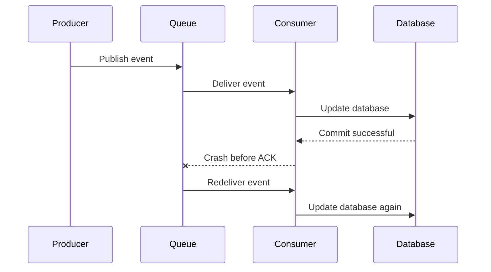
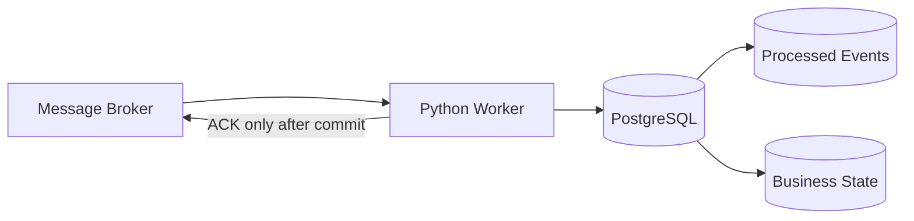
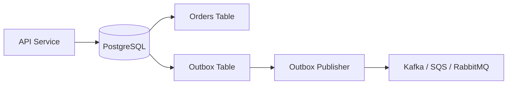
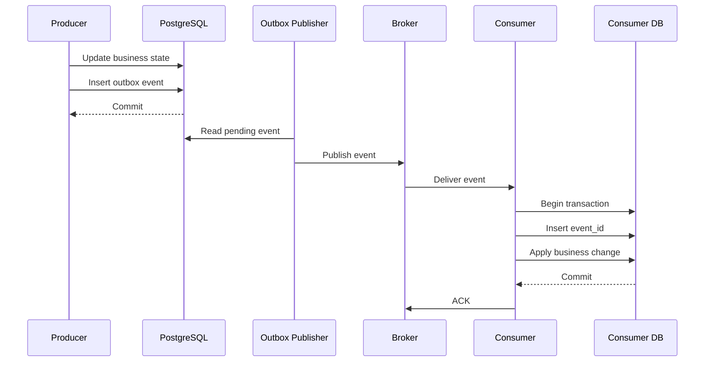

# 08- Exactly Once vs At Least Once

## Overview

Message delivery semantics define the guarantees a messaging system provides about how often a message may be delivered to a consumer.

The three commonly discussed models are:

| Delivery semantic | Meaning |
|---|---|
| At-most-once | A message is delivered zero or one time |
| At-least-once | A message is delivered one or more times |
| Exactly-once | The system provides semantics in which the intended effect is observed once despite retries or duplicate delivery |

The important engineering distinction is that **message delivery** and **business-effect execution** are not necessarily the same thing.

A queue can deliver a message twice even when the producer created it once:

```text
Producer
   |
   | event-123
   v
Message Broker
   |
   +----> Consumer
   |
   +----> Consumer again
```

This commonly happens because of the failure window between processing a message and acknowledging it.

For example:

```text
Consumer receives message
        |
        v
Process business operation
        |
        v
Database commit succeeds
        |
        X
Consumer crashes before ACK
        |
        v
Broker redelivers message
```

The database operation may already have succeeded, but the broker does not know that.

Therefore, production messaging systems commonly favor **at-least-once delivery combined with idempotent consumers** rather than attempting to make every component mathematically exactly once.

## Why Delivery Semantics Matter

Delivery semantics directly affect system design decisions involving:

- Payments
- Orders
- Inventory
- Notifications
- Email
- Financial transactions
- Database updates
- Event-driven microservices
- Kafka consumers
- Amazon SQS workers
- RabbitMQ consumers
- Celery tasks

Consider an order-processing event:

```json
{
  "event_id": "evt-123",
  "event_type": "order.created",
  "order_id": "order-456"
}
```

If the consumer creates the order twice, the result may be incorrect.

For an email notification, duplicate processing may be tolerable:

```text
Email sent twice
```

For a payment operation, it may be unacceptable:

```text
Customer charged twice
```

Delivery semantics therefore need to be evaluated against the **business consequence of duplication and loss**.

## At-Most-Once Delivery

At-most-once means a message is processed zero or one time.

The consumer acknowledges or removes the message before performing the business operation.

```text
Broker
  |
  v
Consumer
  |
  v
ACK
  |
  v
Process
```

If the consumer crashes after the acknowledgment but before processing:

```text
Receive
  |
  v
ACK
  |
  X
Consumer crashes
  |
  v
Message lost
```

### Advantages

- No duplicate processing.
- Simple consumer behavior.
- Lower retry overhead.
- Lower broker-side redelivery traffic.

### Limitations

The primary limitation is message loss.

At-most-once is appropriate only when losing a message is acceptable.

Typical examples include:

- Non-critical metrics.
- Best-effort telemetry.
- Ephemeral notifications.
- Some logging pipelines.
- Non-critical cache invalidation signals.

It is usually inappropriate for:

- Payments.
- Orders.
- Financial transactions.
- Inventory updates.
- Critical business events.

## At-Least-Once Delivery

At-least-once means the system attempts to ensure that a message is not lost after successful delivery, even if this means the message may be delivered multiple times.

The typical flow is:

```text
Broker
   |
   v
Consumer receives message
   |
   v
Process
   |
   v
ACK
```

If processing fails:

```text
Broker
   |
   v
Consumer
   |
   X
Failure
   |
   v
Retry
```

If the consumer crashes after processing but before acknowledgment:

```text
Broker
   |
   v
Consumer
   |
   v
Business operation succeeds
   |
   X
Consumer crashes
   |
   v
No ACK observed
   |
   v
Redelivery
```

The broker assumes the message was not successfully processed and delivers it again.

This is why at-least-once systems require idempotent consumers.

## Why At-Least-Once Is Common

At-least-once delivery provides a useful reliability trade-off:

```text
Prefer:
duplicate processing

over:
silent message loss
```

For many business systems, duplicate detection is easier and safer than recovering a permanently lost event.

A typical architecture is:

```text
Producer
   |
   v
Durable Broker
   |
   v
Consumer
   |
   +--> process successfully
   |
   +--> retry
   |
   +--> duplicate -> ignore
```

The application takes responsibility for making repeated processing safe.

## Exactly-Once Delivery

Exactly-once semantics aim to ensure that an operation is effectively performed once despite failures and retries.

This is significantly harder than at-least-once delivery.

A naive interpretation is:

```text
Producer sends once
        |
        v
Broker stores once
        |
        v
Consumer processes once
```

Distributed failures make this assumption unrealistic.

There are multiple independent failure boundaries:

```text
Producer
   |
   v
Network
   |
   v
Broker
   |
   v
Consumer
   |
   v
Database
   |
   v
External API
```

Exactly-once guarantees must therefore be defined carefully.

## The Exactly-Once Problem

Consider this sequence:



The broker cannot know that the database transaction succeeded.

This creates a fundamental failure window:

```text
Business operation succeeded
        |
        X
Acknowledgment failed
```

The next delivery is therefore legitimate from the broker's perspective.

## Exactly Once Is Not a Single Property

When someone says:

> "This system provides exactly-once processing."

ask:

> Exactly once at which boundary?

Possible boundaries include:

- Producer-to-broker.
- Broker storage.
- Broker-to-consumer.
- Consumer processing.
- Database state.
- Kafka topic-to-topic processing.
- End-to-end business effect.
- External API side effects.

These are different guarantees.

A system can provide exactly-once semantics internally while still producing duplicate effects in an external system.

## Delivery Exactly Once vs Effect Exactly Once

This distinction is critical.

### Exactly-Once Delivery

The consumer receives a logical message once.

### Exactly-Once Effect

The business state changes as if the message were processed once.

These are not equivalent.

For example:

```text
Message delivered once
       |
       v
Consumer
       |
       v
External payment API
       |
       X
Timeout
       |
       v
Consumer retries
       |
       v
Payment API called again
```

Even if the message broker guarantees exactly-once delivery, the external payment system may still observe two API requests.

Exactly-once delivery does not automatically create exactly-once external side effects.

## Idempotency

Idempotency means processing the same logical operation multiple times produces the same intended final state.

Suppose:

```text
event_id = evt-123
```

The consumer receives it twice:

```text
evt-123
   |
   +--> processing attempt 1
   |
   +--> processing attempt 2
```

An idempotent consumer ensures:

```text
Final state after 1 execution
=
Final state after 2 executions
```

For example:

```sql
UPDATE orders
SET status = 'PAID'
WHERE id = 'order-123';
```

Repeating this update may be safe if the business operation is naturally idempotent.

By contrast:

```sql
UPDATE accounts
SET balance = balance + 100;
```

is not naturally idempotent.

Running it twice produces:

```text
balance + 200
```

instead of:

```text
balance + 100
```

## Idempotency Keys

A common approach is to associate every business operation with a unique idempotency key.

Example:

```text
event_id = evt-123
```

Store processed events:

```sql
CREATE TABLE processed_events (
    consumer_name TEXT NOT NULL,
    event_id TEXT NOT NULL,
    processed_at TIMESTAMPTZ NOT NULL DEFAULT NOW(),
    PRIMARY KEY (consumer_name, event_id)
);
```

The consumer can attempt to insert the event ID before performing the business operation.

If the insert conflicts:

```text
event already processed
```

the consumer can safely ignore the duplicate.

## Transactional Idempotency

The strongest approach is to combine duplicate detection and the business update inside the same database transaction.

Conceptually:

```text
BEGIN
   |
   +--> Insert event_id
   |
   +--> Apply business change
   |
   +--> COMMIT
```

If either operation fails:

```text
ROLLBACK
```

The message can be retried.

A Python implementation using PostgreSQL might look like:

```python
from django.db import IntegrityError, transaction
from django.db.models import F

from orders.models import Order, ProcessedEvent


def process_order_paid(event: dict) -> None:
    event_id = event["event_id"]
    order_id = event["order_id"]

    try:
        with transaction.atomic():
            ProcessedEvent.objects.create(
                consumer_name="order-paid-consumer",
                event_id=event_id,
            )

            updated = (
                Order.objects
                .filter(id=order_id, status="PENDING")
                .update(status="PAID")
            )

            if updated != 1:
                raise ValueError(
                    f"Order {order_id} could not transition to PAID"
                )

    except IntegrityError:
        # The event was already processed.
        return
```

The important property is that the idempotency record and business state change commit together.

## Why Transaction Boundaries Matter

Consider this incorrect design:

```text
Insert processed_event
      |
      v
COMMIT
      |
      v
Update business state
      |
      X
Crash
```

The event is marked as processed, but the business operation did not complete.

On retry:

```text
event already processed
      |
      v
Skip
```

The business state remains incorrect.

The idempotency record and business mutation should therefore share a transaction whenever they use the same transactional database.

## Database Constraints as Idempotency

A unique constraint is often more reliable than application-level checks.

Avoid:

```python
if not ProcessedEvent.objects.filter(event_id=event_id).exists():
    ProcessedEvent.objects.create(event_id=event_id)
```

Two consumers can execute the check concurrently:

```text
Consumer A -> does not exist
Consumer B -> does not exist

Consumer A -> insert
Consumer B -> insert
```

Use a database uniqueness constraint:

```sql
PRIMARY KEY (consumer_name, event_id)
```

and let the database enforce uniqueness atomically.

## At-Least-Once with PostgreSQL

A common production architecture is:



The processing sequence is:

```text
Receive
   |
   v
Validate
   |
   v
BEGIN
   |
   +--> Check / insert idempotency record
   |
   +--> Update business state
   |
   v
COMMIT
   |
   v
ACK
```

This is a strong and common pattern for microservices.

## The Transactional Outbox Pattern

At-least-once semantics become more complicated when a service needs to update its database and publish an event.

Consider:

```text
BEGIN
   |
   +--> UPDATE database
   |
   +--> PUBLISH Kafka event
   |
   v
COMMIT
```

The database and broker do not necessarily share the same transaction.

The service can fail between the operations.

For example:

```text
Database commit
      |
      X
Application crashes
      |
      v
Event never published
```

The transactional outbox pattern solves this by storing the event in the same database transaction.



The transaction becomes:

```text
BEGIN
   |
   +--> Update business data
   |
   +--> Insert outbox event
   |
   v
COMMIT
```

A separate publisher sends outbox events to the broker.

This provides reliable publication while retaining at-least-once delivery.

## Exactly-Once Processing with Kafka

Kafka provides stronger processing semantics than a basic queue when using its transactional features.

Kafka supports transactional producers and exactly-once semantics for specific Kafka-to-Kafka processing patterns.

Conceptually:

```text
Kafka Input Topic
       |
       v
Kafka Consumer
       |
       v
Transactional Processing
       |
       v
Kafka Output Topic
```

The consumer can process input records and atomically publish output records within Kafka's transactional model.

This can prevent duplicate output records caused by consumer retries in supported processing patterns.

However, Kafka exactly-once semantics should not be interpreted as:

```text
Kafka exactly once
=
Every external side effect exactly once
```

An external PostgreSQL update or HTTP request may still require its own idempotency strategy.

## Kafka Exactly-Once Semantics

Kafka's exactly-once model is particularly useful for:

- Kafka-to-Kafka transformations.
- Stream processing.
- Aggregations.
- Derived event pipelines.

For example:

```text
orders
   |
   v
Order Processor
   |
   +--> payment-events
   |
   +--> analytics-events
```

Transactional processing can make the Kafka-side result effectively exactly once.

But:

```text
Kafka
  |
  v
HTTP payment provider
```

still requires careful idempotency handling at the external boundary.

## SQS and At-Least-Once Delivery

Amazon SQS standard queues provide at-least-once delivery.

A typical flow is:

```text
ReceiveMessage
      |
      v
Process
      |
      v
DeleteMessage
```

If the worker does not delete the message successfully:

```text
Visibility timeout expires
      |
      v
Message becomes visible
      |
      v
Another ReceiveMessage
```

Therefore, SQS consumers should be designed for duplicate delivery.

SQS FIFO queues provide additional ordering and deduplication capabilities, but these features still should not be treated as a universal replacement for application-level idempotency.

## RabbitMQ and At-Least-Once Processing

RabbitMQ consumers commonly use manual acknowledgments:

```text
Delivery
   |
   v
Consumer
   |
   v
Business operation
   |
   v
ACK
```

If the consumer crashes before ACK:

```text
Consumer crash
   |
   v
Message redelivery
```

This provides an at-least-once processing model when acknowledgments are handled after successful processing.

Again, consumers should tolerate duplicates.

## Exactly Once with External APIs

External APIs are one of the hardest exactly-once boundaries.

Consider:

```text
Consumer
   |
   | POST /payments
   v
Payment Service
   |
   v
Payment succeeds
   |
   X
Network timeout
```

The consumer does not know whether the payment succeeded.

Retrying:

```text
POST /payments
```

could create a duplicate charge.

The solution is usually an idempotency key:

```http
POST /payments
Idempotency-Key: payment-order-123
```

The payment provider stores the result associated with the key.

Repeated requests with the same key return the same logical result rather than executing the payment again.

This is an important distributed-systems pattern:

```text
At-least-once request delivery
+
Idempotent operation
=
Effectively-once business behavior
```

## Effectively Once

In practical system design, **effectively once** is often more useful than claiming absolute exactly-once semantics.

A system can tolerate duplicate delivery while ensuring that the business state behaves as though the operation occurred once.

For example:

```text
Message delivered twice
        |
        v
Consumer processes twice
        |
        v
Idempotency protection
        |
        v
One business effect
```

This provides the business property most systems actually need.

## Comparison

| Property | At-most-once | At-least-once | Exactly-once |
|---|---|---|---|
| Duplicate delivery | No | Possible | Logically prevented within defined scope |
| Message loss | Possible | Minimized | Minimized within defined scope |
| Consumer complexity | Low | Medium | High |
| Retry support | Limited | Strong | Strong |
| Idempotency | Usually unnecessary | Required | Still valuable |
| Operational complexity | Low | Medium | High |
| Typical use | Best-effort data | Business events | Controlled transactional pipelines |
| External side effects | Risky | Requires idempotency | Still requires boundary-specific design |
| Cost | Lower | Moderate | Higher |
| Failure handling | Simpler | Robust | Complex |

## Choosing the Right Semantic

Use the business operation to determine the appropriate guarantee.

| Workload | Recommended approach |
|---|---|
| Metrics | At-most-once may be acceptable |
| Logging | At-most-once may be acceptable |
| Email | At-least-once + deduplication |
| Notifications | At-least-once + idempotency |
| Order creation | At-least-once + idempotent consumer |
| Inventory updates | At-least-once + transactional idempotency |
| Payments | At-least-once + external idempotency |
| Kafka stream transformation | Kafka transactional exactly-once where justified |
| Financial ledger | Strong database transaction + idempotency + auditability |

The correct question is not:

> "Which delivery semantic is theoretically strongest?"

The better question is:

> "What failure behavior does this business operation require?"

## Common Failure Windows

Distributed messaging systems contain several important failure windows.

### Crash Before Acknowledgment

```text
Process
   |
   v
Business operation
   |
   X
Crash
   |
   v
No ACK
   |
   v
Duplicate delivery
```

Solution:

```text
Idempotent processing
```

### ACK Before Processing

```text
Receive
   |
   v
ACK
   |
   X
Crash
   |
   v
Message lost
```

This is the classic at-most-once trade-off.

### Database Commit Before Event Publication

```text
DB commit
   |
   X
Crash
   |
   v
Event missing
```

Solution:

```text
Transactional Outbox
```

### Event Publication Before Database Commit

```text
Publish event
   |
   X
DB transaction fails
```

Now downstream consumers may observe an event describing state that never committed.

Again, the transactional outbox pattern is often appropriate.

### External Side Effect Before Local Commit

```text
Call payment provider
   |
   v
Payment succeeds
   |
   X
Local DB transaction fails
```

A retry may call the payment provider again.

Solution:

- External idempotency keys.
- State machines.
- Reconciliation.
- Saga patterns where appropriate.

## Idempotency vs Exactly Once

These concepts are related but not identical.

| Idempotency | Exactly Once |
|---|---|
| Property of an operation | Delivery/processing guarantee |
| Duplicate execution can be safe | Attempts to eliminate duplicate effects |
| Often implemented at application level | Often requires broker/transaction support |
| Usually simpler | Usually more complex |
| Works across many messaging systems | Scope depends on technology |
| Essential for reliable retries | Does not eliminate the value of idempotency |

In practice:

```text
At-least-once
+
Idempotent consumer
```

is often preferable to attempting to build a globally exactly-once distributed transaction.

## Monitoring Delivery Semantics

Track metrics that reveal duplicate and failed processing.

Useful metrics include:

```text
message_received_total
message_processed_total
message_failed_total
message_retried_total
message_duplicate_total
message_dlq_total
processing_latency
ack_latency
consumer_lag
```

For idempotency:

```text
duplicate_event_rate
```

is particularly useful.

A sudden increase can indicate:

- Consumer crashes.
- Broker instability.
- Slow processing.
- Visibility timeout problems.
- Database latency.
- Deployment regressions.

## Security Considerations

Delivery semantics can influence security-sensitive operations.

Avoid non-idempotent operations such as:

```text
grant_permission()
transfer_money()
create_api_key()
```

without duplicate protection.

An attacker or accidental retry mechanism should not be able to repeatedly trigger the same privileged operation.

Use:

- Unique operation IDs.
- Database constraints.
- Idempotency keys.
- Authorization checks.
- Audit logs.
- Replay controls.

## Performance and Scalability

Idempotency introduces additional work.

For example:

```text
Message
  |
  +--> Idempotency lookup
  |
  +--> Business operation
```

The idempotency table can become a scalability bottleneck if poorly designed.

Consider:

- Proper indexing.
- Appropriate retention.
- Partitioning for very large datasets.
- Efficient primary keys.
- Database connection usage.
- Cleanup policies.

For high-throughput systems, avoid expensive duplicate detection queries.

Prefer:

```text
PRIMARY KEY / UNIQUE constraint
```

over:

```text
SELECT then INSERT
```

when the database can enforce the invariant atomically.

## Retention of Idempotency Records

Idempotency records do not necessarily need to exist forever.

Retention depends on:

```text
Maximum replay window
+
Maximum message retention
+
Business retry period
+
Audit requirements
```

For example, if messages can only be replayed for seven days, retaining operational idempotency records indefinitely may be unnecessary.

However, financial or regulatory systems may require substantially longer retention.

## Common Mistakes

### Assuming "Exactly Once" Means No Duplicate Requests

Exactly-once semantics usually have a defined scope.

A Kafka transaction does not automatically make an external HTTP request exactly once.

### Acknowledging Before the Business Transaction

This can cause message loss.

ACK only after the required business operation is durable.

### Using Application-Level Duplicate Checks Without a Unique Constraint

Concurrent consumers can race.

Use database-enforced uniqueness.

### Assuming At-Least-Once Means Every Message Is Guaranteed Forever

At-least-once is a delivery semantic, not an unlimited retention guarantee.

Messages can still be lost because of:

- Incorrect configuration.
- Expired retention.
- Data corruption.
- Administrative deletion.
- Infrastructure failures outside the guarantee.

### Ignoring Partial Success

A consumer can partially complete an operation before failing.

Design business operations and transactions around this reality.

### Making External APIs Non-Idempotent

If a consumer retries an external request, duplicate effects can occur.

Use idempotency keys whenever the external API supports them.

### Using Exactly-Once Everywhere

Exactly-once mechanisms can add:

- Complexity.
- Latency.
- Operational overhead.
- Resource consumption.
- Difficult failure modes.

Use them where the business and architecture justify the cost.

### Confusing Ordering with Exactly Once

These are different properties.

A system can provide:

```text
ordered + duplicate delivery
```

or:

```text
unordered + deduplicated processing
```

Ordering does not automatically prevent duplicates.

### Confusing Deduplication with Idempotency

Deduplication attempts to identify repeated messages.

Idempotency ensures repeated execution does not produce an incorrect final effect.

A message may be duplicated with a different transport identifier but represent the same business operation.

## Interview Traps

### "Exactly Once Means the Consumer Runs Only Once."

Not necessarily.

Exactly-once semantics are scoped to a particular system boundary. A consumer process can restart and execute logic multiple times while the resulting observable state remains exactly once.

### "At-Least-Once Is Less Reliable Than Exactly Once."

Not necessarily.

At-least-once is often the preferred reliability model because it prioritizes preventing message loss and delegates duplicate protection to idempotent consumers.

### "Kafka Exactly Once Solves Payment Duplication."

No.

Kafka transactional guarantees apply to supported Kafka processing boundaries. An external payment system requires its own idempotency mechanism.

### "SQS Guarantees Exactly Once with FIFO."

FIFO queues provide deduplication and ordering capabilities, but system-wide exactly-once business effects still require careful application design.

### "Database Transactions Automatically Provide Exactly Once."

No.

A database transaction protects operations within its transaction boundary. It does not automatically coordinate with a message broker or external API.

## Production Design Pattern

A strong general-purpose architecture is:



This architecture combines:

- Transactional outbox for reliable publication.
- At-least-once broker delivery.
- Idempotent consumers.
- Database transactions.
- Explicit acknowledgments.
- Controlled retries.

The result is often a more practical and robust system than trying to implement global distributed exactly-once processing.

## Practical Decision Framework

When designing a messaging workflow, evaluate it in this order:

### Define the Business Effect

Ask:

```text
What happens if this operation runs twice?
What happens if it never runs?
```

If duplication is worse than loss, the system may require different semantics than if loss is worse than duplication.

### Define the Failure Boundary

Identify:

```text
Producer
Broker
Consumer
Database
External APIs
```

Exactly-once guarantees must be evaluated independently at each boundary.

### Prefer Durable State Transitions

Use database transactions for state changes that must remain consistent.

### Make Consumers Idempotent

Use:

- Event IDs.
- Idempotency keys.
- Unique constraints.
- Conditional updates.
- Transactional processing.

### Add Reliable Event Publication

Use the transactional outbox pattern when database state and event publication must remain consistent.

### Use Exactly-Once Features Selectively

Kafka transactions and similar mechanisms are valuable when their guarantees match the architecture and the additional operational complexity is justified.

## Key Takeaways

- **At-least-once delivery is often the practical default for business-critical systems because duplicate processing can be controlled with idempotency, while lost messages are much harder to recover.**
- **Exactly-once semantics are always scoped to a boundary; exactly-once Kafka processing does not automatically make PostgreSQL updates or external API side effects exactly once.**
- **Idempotent consumers, database uniqueness constraints, and transactional state changes are the core tools for converting duplicate delivery into effectively-once business behavior.**
- **Transactional outbox solves the database-to-message-broker consistency problem, while external APIs generally require idempotency keys or reconciliation mechanisms.**
- **Choose delivery semantics based on the business consequence of loss versus duplication rather than assuming exactly-once is automatically the best architecture.**