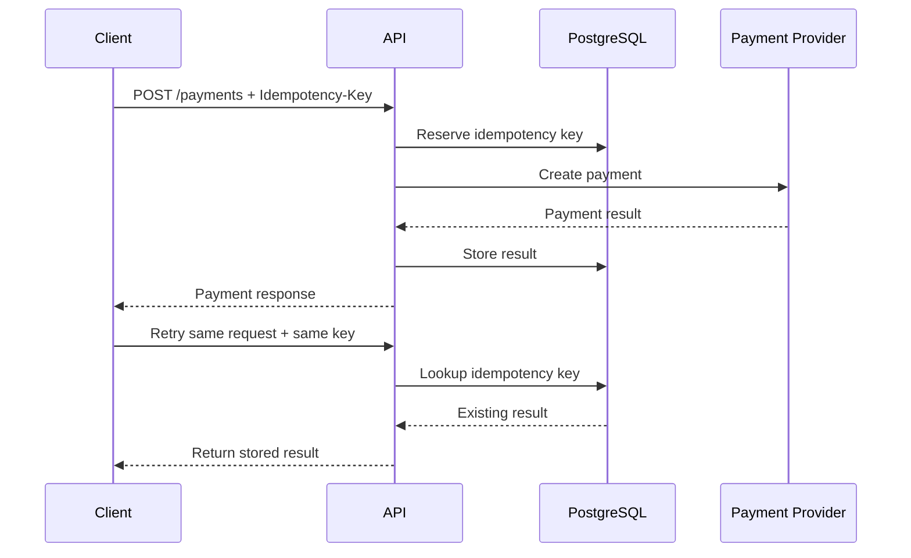
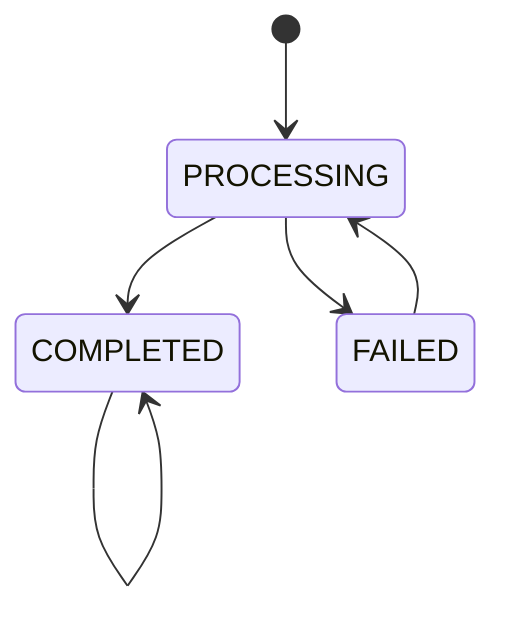
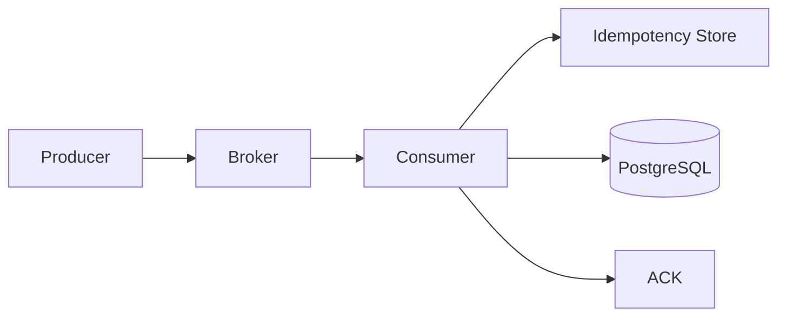
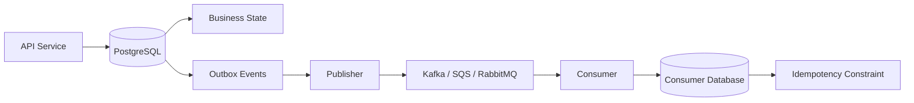

# 09- Idempotency

## Overview

Idempotency is the property that allows an operation to be executed multiple times while producing the same intended business outcome as executing it once.

In distributed systems, retries are unavoidable. Requests can time out, consumers can crash, network connections can fail, workers can restart, and message brokers can redeliver messages. A system that assumes every operation executes exactly once will eventually encounter duplicate effects.

A common production pattern is therefore:

```text
At-least-once delivery
        +
Idempotent processing
        =
Effectively-once business behavior
```

Idempotency is especially important for:

- Payment processing
- Order creation
- Inventory updates
- Message consumers
- REST APIs
- gRPC requests
- Webhook handlers
- Background jobs
- Kafka consumers
- Amazon SQS workers
- RabbitMQ consumers
- Celery tasks
- Database-backed workflows

The key distinction is between **duplicate requests** and **duplicate business effects**. A request may legitimately arrive multiple times; the system should prevent those retries from producing unintended additional effects.

## What Idempotency Means

An operation is idempotent when repeating the same logical operation does not change the intended final result.

For example:

```text
Set order status = PAID
```

can be idempotent:

```text
PENDING -> PAID
PAID    -> PAID
PAID    -> PAID
```

Whereas:

```text
balance = balance + 100
```

is not naturally idempotent:

```text
1000 -> 1100
1000 -> 1200
```

The same logical request executed twice creates two effects.

A useful abstraction is:

```text
f(f(state, request), request)
=
f(state, request)
```

The practical engineering requirement is not necessarily mathematical purity. It is that repeated processing of the same logical operation produces the same business outcome.

## Why Idempotency Exists

Distributed systems frequently operate under **at-least-once execution**.

Consider a REST request:

```text
Client
  |
  | POST /payments
  v
API
  |
  v
Payment Service
  |
  v
Payment succeeds
  |
  X
Network timeout
  |
  v
Client sees timeout
```

The client cannot determine whether the payment succeeded.

A retry may therefore occur:

```text
POST /payments
       |
       v
Payment Service
       |
       v
Payment executed again
```

Without idempotency:

```text
One user request
       |
       +--> Payment 1
       |
       +--> Payment 2
```

With idempotency:

```text
One logical request
       |
       +--> Attempt 1 -> payment created
       |
       +--> Attempt 2 -> existing result returned
```

## Idempotency Key

The most common mechanism is an **idempotency key**.

The client generates a unique key for a logical operation:

```text
Idempotency-Key: 7c6e8f6c-8d8d-4c5f-9a17-9c6c7e6d7b01
```

The server associates that key with the operation's result.

For example:

```http
POST /api/payments
Idempotency-Key: 7c6e8f6c-8d8d-4c5f-9a17-9c6c7e6d7b01
Content-Type: application/json

{
  "order_id": "order-123",
  "amount": 4999,
  "currency": "INR"
}
```

The first request performs the operation.

A retry using the same key should return the previously stored result instead of creating another payment.

## Basic Request Lifecycle



The retry should not execute the external side effect again.

## Idempotency Key vs Request ID

These identifiers serve different purposes.

| Identifier | Purpose |
|---|---|
| Request ID | Correlates a particular HTTP request |
| Trace ID | Correlates distributed tracing |
| Message ID | Identifies a transport-level message |
| Event ID | Identifies a logical event |
| Idempotency key | Identifies a logical operation across retries |

A retry can have a new request ID:

```text
Request #1 -> request_id=A
Request #2 -> request_id=B
Request #3 -> request_id=C
```

while all three represent the same logical operation:

```text
idempotency_key=XYZ
```

This distinction is critical for distributed systems.

## Where Idempotency Is Needed

Idempotency is especially valuable at boundaries where retries can create side effects.

| Operation | Idempotency importance |
|---|---|
| `GET /users/123` | Usually naturally idempotent |
| `PUT /users/123` | Usually designed to be idempotent |
| `DELETE /users/123` | Usually idempotent |
| `POST /orders` | High |
| `POST /payments` | Critical |
| Send email | High |
| Charge card | Critical |
| Inventory decrement | Critical |
| Publish event | High |
| Create background task | High |
| Cache read | Usually unnecessary |

## Naturally Idempotent HTTP Methods

HTTP semantics provide useful defaults.

### GET

```http
GET /orders/123
```

Repeated requests should not create a new business effect.

### PUT

A request such as:

```http
PUT /users/123

{
  "status": "active"
}
```

can be naturally idempotent because repeating it leaves the resource in the same state.

### DELETE

```http
DELETE /users/123
```

Once the resource is deleted, repeating the request should not create another deletion effect.

### POST

POST commonly creates or triggers a new operation:

```http
POST /orders
```

Therefore, POST endpoints frequently require explicit idempotency support when retries are possible.

HTTP method semantics do not automatically make application logic idempotent. A poorly implemented `PUT` can still perform non-idempotent side effects.

## Database-Enforced Idempotency

For database-backed systems, the database should usually enforce idempotency constraints.

Consider:

```sql
CREATE TABLE idempotency_keys (
    key TEXT PRIMARY KEY,
    request_hash TEXT NOT NULL,
    status TEXT NOT NULL,
    response_code INTEGER,
    response_body JSONB,
    created_at TIMESTAMPTZ NOT NULL DEFAULT NOW(),
    expires_at TIMESTAMPTZ
);
```

The primary key prevents concurrent requests from creating multiple records for the same key.

Avoid relying only on:

```python
if not exists(key):
    create(key)
```

because concurrent requests can race.

The database should enforce:

```text
UNIQUE(idempotency_key)
```

## Race Condition

Suppose two requests arrive simultaneously:

```text
Request A                 Request B
    |                         |
    v                         v
SELECT key                SELECT key
    |                         |
    v                         v
Not found                 Not found
    |                         |
    v                         v
Create payment            Create payment
```

Both requests can execute the business operation.

The solution is an atomic reservation mechanism backed by a unique constraint.

```text
Request A
   |
   v
INSERT idempotency key
   |
   v
Success
   |
   v
Process operation


Request B
   |
   v
INSERT same key
   |
   v
Unique constraint violation
   |
   v
Load existing result
```

## Request Hashing

An idempotency key alone is not always sufficient.

A client might accidentally reuse the same key with different request parameters:

```text
Key: abc-123

Request 1:
amount = 100

Request 2:
amount = 500
```

Silently treating these as the same operation is dangerous.

Store a canonical hash of the request:

```text
idempotency_key
+
request_hash
```

On retry:

```text
same key
+
same request hash
=
valid retry
```

But:

```text
same key
+
different request hash
=
client error
```

For example:

```http
409 Conflict
```

or another API-specific validation response can indicate key reuse with incompatible parameters.

## Canonical Request Hashing

The hash must be deterministic.

Conceptually:

```text
canonical_request =
method
+
path
+
normalized body
+
relevant operation context
```

Then:

```text
SHA-256(canonical_request)
```

can be stored.

Do not blindly hash raw JSON if semantically equivalent JSON can have different representations:

```json
{"amount":100,"currency":"INR"}
```

and:

```json
{
  "currency": "INR",
  "amount": 100
}
```

If ordering is irrelevant, canonicalize the representation before hashing.

## Idempotency State Machine

An idempotency record should usually have explicit states.



A more detailed implementation might use:

| State | Meaning |
|---|---|
| `PROCESSING` | Operation currently executing |
| `COMPLETED` | Result successfully persisted |
| `FAILED` | Operation failed and may be retried |
| `EXPIRED` | Record is outside its retention period |

Avoid treating all records as simply "exists" or "doesn't exist".

## Handling Concurrent Requests

Suppose a client sends the same request twice concurrently.

```text
Request A ---------------->
Request B ---------------->
```

The server needs deterministic behavior.

Possible policies include:

### Return Existing Result

If the first request completes quickly, subsequent requests receive the stored result.

### Return Conflict While Processing

```http
409 Conflict
```

with a response such as:

```json
{
  "error": "operation_in_progress"
}
```

### Wait for Completion

The second request can wait for the first operation to finish.

This is appropriate only when the expected processing time is short and bounded.

For long-running operations, asynchronous processing is generally preferable.

## Production API Pattern

A robust API flow is:

```text
Request
   |
   v
Validate authentication
   |
   v
Validate request
   |
   v
Validate Idempotency-Key
   |
   v
Compute request hash
   |
   v
Reserve key atomically
   |
   +---- existing completed -> return stored response
   |
   +---- existing processing -> wait/conflict
   |
   v
Execute business transaction
   |
   v
Persist result
   |
   v
Return response
```

## Django Example

A simplified Django model might be:

```python
from django.db import models


class IdempotencyRecord(models.Model):
    class Status(models.TextChoices):
        PROCESSING = "processing"
        COMPLETED = "completed"
        FAILED = "failed"

    key = models.CharField(max_length=255, unique=True)
    request_hash = models.CharField(max_length=64)
    status = models.CharField(
        max_length=20,
        choices=Status.choices,
    )
    response_status = models.PositiveSmallIntegerField(null=True)
    response_body = models.JSONField(null=True)
    created_at = models.DateTimeField(auto_now_add=True)
    updated_at = models.DateTimeField(auto_now=True)
    expires_at = models.DateTimeField(null=True)
```

The uniqueness constraint is essential:

```python
key = models.CharField(max_length=255, unique=True)
```

Application-level checking should not replace database enforcement.

## Transactional Django Example

For a database-local operation:

```python
from django.db import IntegrityError, transaction
from django.http import JsonResponse

from .models import IdempotencyRecord, Order


def create_order(*, user, idempotency_key, request_hash, payload):
    try:
        with transaction.atomic():
            record = IdempotencyRecord.objects.create(
                key=idempotency_key,
                request_hash=request_hash,
                status=IdempotencyRecord.Status.PROCESSING,
            )

            order = Order.objects.create(
                user=user,
                amount=payload["amount"],
                currency=payload["currency"],
            )

            response_body = {
                "order_id": str(order.id),
                "status": "created",
            }

            record.status = IdempotencyRecord.Status.COMPLETED
            record.response_status = 201
            record.response_body = response_body
            record.save(
                update_fields=[
                    "status",
                    "response_status",
                    "response_body",
                    "updated_at",
                ]
            )

            return JsonResponse(response_body, status=201)

    except IntegrityError:
        record = IdempotencyRecord.objects.get(key=idempotency_key)

        if record.request_hash != request_hash:
            return JsonResponse(
                {"error": "idempotency_key_reused"},
                status=409,
            )

        if record.status == IdempotencyRecord.Status.COMPLETED:
            return JsonResponse(
                record.response_body,
                status=record.response_status,
            )

        return JsonResponse(
            {"error": "operation_in_progress"},
            status=409,
        )
```

In a production implementation, concurrency behavior around `PROCESSING` records should be explicitly designed rather than relying on a simple lookup.

## FastAPI Pattern

The same architectural pattern applies to FastAPI.

```python
from fastapi import Header, HTTPException


def require_idempotency_key(
    idempotency_key: str | None = Header(default=None),
) -> str:
    if not idempotency_key:
        raise HTTPException(
            status_code=400,
            detail="Idempotency-Key header is required",
        )

    if len(idempotency_key) > 255:
        raise HTTPException(
            status_code=400,
            detail="Invalid Idempotency-Key",
        )

    return idempotency_key
```

The endpoint should then use the key as part of the transactional workflow.

## Redis-Based Idempotency

Redis can be useful for short-lived idempotency state.

A common reservation pattern is:

```text
SET key value NX EX 300
```

The `NX` option ensures the key is created only if it does not already exist.

Example:

```bash
redis-cli SET idempotency:abc-123 processing NX EX 300
```

Possible result:

```text
OK
```

means the request acquired the reservation.

A missing result means another request already owns the key.

### Advantages

- Very low latency.
- High throughput.
- Useful for short-lived reservations.
- Reduces database load.

### Limitations

Redis should not automatically become the source of truth for a business-critical operation.

Potential problems include:

- Key expiration before the business operation finishes.
- Eviction.
- Failover behavior.
- Data loss depending on Redis configuration.
- Incorrect distributed locking assumptions.

For critical financial operations, durable database-backed idempotency is often preferable.

## Redis as a Reservation Layer

A practical architecture can combine Redis and PostgreSQL:

```text
Request
   |
   v
Redis reservation
   |
   v
PostgreSQL transaction
   |
   v
Business effect
```

Redis can prevent obvious duplicate work, while PostgreSQL remains the durable source of truth.

However, correctness should not depend solely on Redis if Redis data can disappear.

## Idempotency with Message Queues

Idempotency is essential for at-least-once message delivery.

Typical flow:



The consumer should generally:

1. Receive the message.
2. Validate the event.
3. Identify the logical operation.
4. Atomically reserve or record the event.
5. Perform the business operation.
6. Commit durable state.
7. Acknowledge the message.

The critical ordering is:

```text
Business state durable
        |
        v
ACK
```

not:

```text
ACK
 |
 v
Business state
```

## Message ID vs Business Idempotency Key

Do not assume the transport message ID always identifies the business operation.

For example:

```text
Message A:
message_id = m-123
order_id = order-456

Message B:
message_id = m-987
order_id = order-456
```

The messages have different transport IDs but may represent the same business operation.

The idempotency key should therefore be derived from the correct business invariant.

Possible keys:

```text
payment_id
order_id + operation
event_id
external_reference
```

The correct choice depends on the domain.

## Kafka Consumers

Kafka consumers can receive duplicate records because of consumer failures and offset management.

A common processing sequence is:

```text
poll()
  |
  v
process record
  |
  v
commit offset
```

If processing succeeds but the consumer crashes before committing the offset:

```text
process succeeds
      |
      X
crash
      |
      v
record processed again
```

Therefore, Kafka consumers performing external side effects should still be idempotent.

Kafka transactions can provide stronger semantics for Kafka-to-Kafka processing, but they do not eliminate the need for idempotency at external system boundaries.

## Amazon SQS

SQS standard queues provide at-least-once delivery.

A typical worker:

```text
ReceiveMessage
      |
      v
Process
      |
      v
DeleteMessage
```

If the worker crashes before deletion:

```text
Visibility timeout
      |
      v
Message becomes visible again
```

The same message can therefore be processed again.

A production SQS worker should use an idempotency key based on the event's logical identity.

## RabbitMQ

With manual acknowledgments:

```text
consume
  |
  v
process
  |
  v
ack
```

a consumer crash before acknowledgment can result in redelivery.

The same principle applies:

```text
duplicate delivery
        |
        v
idempotent consumer
        |
        v
single business effect
```

## Celery Tasks

Celery tasks can also execute more than once due to retries, worker failures, acknowledgment behavior, or operational replay.

A task such as:

```python
@app.task
def charge_customer(payment_id):
    ...
```

should not assume that the task body executes exactly once.

A robust implementation should use:

- Stable business identifiers.
- Database uniqueness constraints.
- Transactional state transitions.
- External API idempotency keys.
- Explicit retry policies.

Retries should be considered a normal execution path rather than an exceptional one.

## Idempotency and Database Transactions

Idempotency becomes significantly easier when the business operation and idempotency record can participate in the same transaction.

For example:

```text
BEGIN
   |
   +--> INSERT idempotency key
   |
   +--> UPDATE order
   |
   +--> INSERT audit record
   |
   v
COMMIT
```

If the process crashes before commit:

```text
ROLLBACK
```

The operation can be retried safely.

If the transaction commits:

```text
business state
+
idempotency state
```

become durable together.

## Conditional State Transitions

Database state transitions are another powerful idempotency mechanism.

Instead of:

```sql
UPDATE orders
SET status = 'PAID'
WHERE id = 'order-123';
```

use business-state conditions:

```sql
UPDATE orders
SET status = 'PAID',
    paid_at = NOW()
WHERE id = 'order-123'
  AND status = 'PENDING';
```

Then:

```text
PENDING -> PAID
```

succeeds once.

A retry:

```text
PAID -> PAID
```

does not perform the same transition again.

This approach is especially useful for:

- Order state machines.
- Payment state transitions.
- Job state transitions.
- Workflow processing.

## Idempotency and Side Effects

Database writes are relatively easy to make transactional.

External side effects are harder:

```text
Database
External API
Email
Payment provider
SMS provider
Third-party webhook
```

Suppose:

```text
BEGIN
  |
  +--> UPDATE database
  |
  +--> Send email
  |
  X
Transaction rollback
```

The email cannot be rolled back.

This is why external side effects should usually be separated from the core transaction using mechanisms such as:

- Transactional outbox.
- Background workers.
- Idempotent external APIs.
- Reconciliation.
- State machines.

## Transactional Outbox and Idempotency

A common production architecture is:



The producer transaction ensures:

```text
business state
+
outbox event
```

commit together.

The consumer then uses:

```text
event_id
+
unique constraint
+
business transaction
```

to tolerate duplicate event delivery.

## Idempotency and Retries

Retries should be designed around idempotency.

A retry policy might look like:

```text
Attempt 1
   |
   v
Failure
   |
   v
Exponential backoff
   |
   v
Attempt 2
   |
   v
Failure
   |
   v
Exponential backoff
   |
   v
Attempt 3
```

A retry without idempotency can amplify failures.

For example:

```text
Original request
   |
   +--> operation succeeds
   |
   X
timeout

Retry
   |
   +--> operation succeeds again
```

The system has transformed a temporary network failure into a duplicate business effect.

## Idempotency Retention

Idempotency records should have a deliberate retention policy.

Consider:

```text
Maximum retry window
+
Message retention
+
Client retry behavior
+
Replay capability
+
Audit requirements
```

For a short-lived API operation:

```text
TTL = hours or days
```

may be sufficient.

For financial operations, the idempotency record may need long-term retention or an immutable transaction ledger.

Never choose a TTL arbitrarily.

If the idempotency key expires while a client can still retry the original operation:

```text
Original operation
      |
      v
Idempotency record expires
      |
      v
Late retry
      |
      v
Operation executes again
```

This defeats the intended guarantee.

## Idempotency Storage Options

| Storage | Strengths | Limitations | Typical use |
|---|---|---|---|
| PostgreSQL | Durable, transactional, unique constraints | Higher latency than Redis | Critical business operations |
| Redis | Fast, low latency | Volatility and TTL concerns | Short-lived deduplication |
| Kafka state/store | High-throughput stream processing | More specialized | Kafka pipelines |
| DynamoDB | Durable, scalable conditional writes | Distributed data model | AWS serverless workloads |
| Application memory | Very fast | Lost on restart, not shared | Rarely appropriate |

For business-critical correctness, prefer durable storage with atomic uniqueness guarantees.

## Security Considerations

Idempotency keys can contain sensitive information if poorly designed.

Prefer opaque identifiers:

```text
550e8400-e29b-41d4-a716-446655440000
```

Avoid embedding:

```text
customer_email
credit_card_number
account_number
```

Do not log sensitive request bodies together with idempotency keys unless necessary.

Also consider authorization carefully.

An attacker should not be able to reuse another user's idempotency key to access or retrieve another user's operation result.

The idempotency record should generally be scoped to the appropriate security context:

```text
tenant_id
+
user_id
+
operation
+
idempotency_key
```

where the domain requires it.

## Multi-Tenant Systems

In multi-tenant systems, a globally unique key may not be the correct invariant.

For example:

```text
tenant-A + key-123
tenant-B + key-123
```

may represent two independent operations.

A composite uniqueness constraint may therefore be appropriate:

```sql
CREATE UNIQUE INDEX unique_idempotency_scope
ON idempotency_keys (tenant_id, key);
```

The correct scope should match the business operation.

## Observability

Track idempotency behavior explicitly.

Useful metrics include:

```text
idempotency_requests_total
idempotency_replays_total
idempotency_conflicts_total
idempotency_processing_total
idempotency_failures_total
idempotency_expirations_total
```

A useful derived metric is:

```text
replay_rate =
idempotency_replays_total
/
idempotency_requests_total
```

A sudden increase can indicate:

- Network instability.
- Aggressive client retries.
- Consumer crashes.
- Database latency.
- Broker redelivery.
- Incorrect visibility timeout.
- Deployment regressions.

Include identifiers such as:

```text
request_id
trace_id
idempotency_key
event_id
```

in structured logs, while ensuring sensitive values are appropriately protected.

## Performance Considerations

Idempotency adds a persistence operation to the request path:

```text
Request
   |
   v
Idempotency lookup/reservation
   |
   v
Business operation
```

At high request volumes, this can become significant.

Optimize with:

- Proper indexes.
- Compact records.
- Appropriate TTL policies.
- Partitioning for very large tables.
- Efficient connection pooling.
- Database-local transactions.
- Redis for appropriate short-lived use cases.

Do not sacrifice correctness merely to remove one database lookup from a critical workflow.

The better optimization is often to make the idempotency operation atomic and efficient.

## High Availability

Idempotency storage becomes part of the correctness path.

If the idempotency store is unavailable:

```text
Request
   |
   v
Cannot determine whether operation already happened
```

Do not blindly bypass idempotency protection for critical operations.

For critical workloads:

- Run PostgreSQL in a highly available configuration.
- Use managed database failover where appropriate.
- Monitor replication health.
- Back up durable idempotency state where required.
- Define behavior during dependency outages.

For non-critical workloads, failing closed may be unnecessarily expensive. The correct behavior depends on business risk.

## Disaster Recovery

Idempotency data can have different recovery requirements from ordinary cache data.

If the idempotency store is restored from a backup that predates a successful business operation:

```text
Business state:
payment = completed

Idempotency store:
key = missing
```

A retry could execute the operation again.

Therefore, disaster recovery planning should consider whether idempotency state must survive the same recovery point as the business state.

For financial systems, the durable transaction state should remain the ultimate source of truth, with reconciliation mechanisms available to detect inconsistent external effects.

## Common Mistakes

### Using `SELECT` Before `INSERT`

This creates a race condition.

Prefer:

```sql
INSERT ... ON CONFLICT ...
```

or an equivalent atomic database operation.

### Storing Only the Idempotency Key

A reused key with a different payload can produce incorrect behavior.

Store enough information to validate that a retry represents the same logical operation.

### Using Request IDs as Idempotency Keys

A retry commonly generates a new request ID.

Use a stable logical operation identifier instead.

### Using Redis as the Only Source of Truth for Financial Operations

Redis can be excellent for performance but may not provide the durability guarantees required for critical business state.

### Expiring Keys Too Quickly

A retry after expiration can execute the operation again.

Retention should cover the complete retry and replay window.

### Marking the Operation Complete Before the Side Effect Commits

This can produce:

```text
idempotency = completed
business operation = failed
```

The state transition must be atomic whenever possible.

### Returning Different Results for the Same Completed Operation

Once a request is successfully completed, retries should normally return the stored logical result.

### Ignoring Authorization Scope

A key should not allow one user or tenant to retrieve another user's operation result.

### Assuming Idempotency Eliminates All Duplicate Work

The consumer may still execute application code multiple times before discovering the duplicate.

Idempotency guarantees should focus on preventing duplicate **business effects**, not necessarily duplicate CPU execution.

## Production Pitfalls

### Long-Running Operations

If an operation takes several minutes, keeping an HTTP request open while holding an idempotency record can be fragile.

Prefer:

```text
POST request
   |
   v
Create operation
   |
   v
Return operation_id
   |
   v
Background processing
```

Then the operation itself remains idempotent.

### Stale `PROCESSING` Records

A worker can crash after creating:

```text
status = PROCESSING
```

but before completing the operation.

The system needs a recovery strategy.

Possible approaches include:

- Lease expiration.
- Heartbeats.
- Retryable state.
- Worker ownership tokens.
- Reconciliation jobs.

### Locking Forever

Never create a permanent lock that can remain stuck after a process crash.

Use bounded leases or recoverable states.

### Idempotency Across Service Boundaries

A single idempotency key may need to propagate through several services:

```text
Client
  |
  v
API Gateway
  |
  v
Order Service
  |
  v
Payment Service
  |
  v
Notification Service
```

However, each service may have a different idempotency scope.

Do not blindly reuse one key for unrelated business operations.

## Interview Questions

### Why is idempotency important in distributed systems?

Because retries and duplicate deliveries are unavoidable. Idempotency allows the system to tolerate those duplicates without producing incorrect business effects.

### How do you make a POST API idempotent?

Require a stable idempotency key, persist it with the operation state and request fingerprint, enforce uniqueness atomically, and return the previously stored result for valid retries.

### Why isn't an application-level `if exists` check sufficient?

Because concurrent requests can both observe that the record does not exist. A database unique constraint or atomic operation is required to enforce the invariant safely.

### How do you handle an idempotency key reused with different payloads?

Store a canonical request hash. If the same key is used with a different hash, reject the request rather than treating it as a valid retry.

### Does idempotency mean the code executes only once?

No. The operation can execute multiple times. Idempotency means repeated execution does not produce additional unintended business effects.

### How does idempotency help with Kafka or SQS?

Both systems can produce duplicate deliveries or processing attempts. A stable event identifier and durable deduplication mechanism allow consumers to safely process those duplicates.

### Where should idempotency be stored?

For critical operations, usually in a durable transactional store such as PostgreSQL. Redis can be useful for short-lived reservations or optimization but should not automatically be the correctness boundary.

### Does exactly-once delivery eliminate the need for idempotency?

No. Exactly-once guarantees are scoped to particular system boundaries. External databases and APIs may still experience retries or duplicate requests.

## Production Checklist

Before deploying an idempotent operation, verify:

- [ ] A stable idempotency key identifies the logical operation.
- [ ] The key has an explicit scope.
- [ ] The database enforces uniqueness atomically.
- [ ] Request parameters are validated against key reuse.
- [ ] The business mutation and idempotency state share a transaction where possible.
- [ ] Duplicate requests return deterministic results.
- [ ] `PROCESSING` states can recover after worker crashes.
- [ ] Idempotency records have an appropriate retention period.
- [ ] External APIs use provider-supported idempotency keys.
- [ ] Message consumers tolerate redelivery.
- [ ] ACKs happen only after required durable processing.
- [ ] Duplicate/replay metrics are monitored.
- [ ] Sensitive information is not exposed through idempotency records or logs.
- [ ] Disaster recovery behavior accounts for idempotency state.
- [ ] Reconciliation exists for external side effects that cannot participate in the local transaction.

## Key Takeaways

- **Idempotency allows systems to safely tolerate retries and duplicate delivery without creating duplicate business effects.**
- **Use stable idempotency keys, database-enforced uniqueness, and transactional state changes rather than application-level duplicate checks alone.**
- **Idempotency is different from request IDs, message IDs, deduplication, and exactly-once delivery; each solves a different distributed-systems problem.**
- **Critical external side effects require idempotency at the external boundary, while transactional outbox and idempotent consumers provide reliable patterns for event-driven architectures.**
- **Treat idempotency state as part of the correctness path: retention, concurrency, recovery, security, observability, and disaster recovery all need explicit design.**