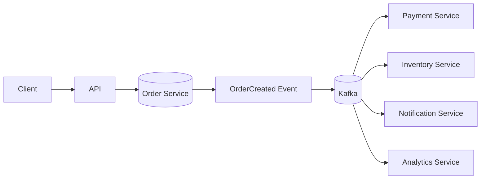

# 10- Summary

## Overview

Messaging systems decouple producers from consumers and allow backend services to communicate asynchronously. They are a fundamental building block for scalable microservices, event-driven architectures, background processing, workflow orchestration, and integration with external systems.

The core design problem is not simply "how do I send a message?" It is:

```text
How do I reliably move work or facts
between independently operating components
while tolerating failures, retries, duplication,
backpressure, and partial outages?
```

The messaging topics covered in this section build toward that problem:

```text
Message Queues
      |
      v
Publish / Subscribe
      |
      v
Event-Driven Architecture
      |
      +--------------------+
      |                    |
      v                    v
    Kafka               RabbitMQ
      |                    |
      +---------+----------+
                |
                v
          Amazon SQS
                |
                v
       Dead Letter Queues
                |
                v
     Delivery Semantics
                |
                v
          Idempotency
```

A production messaging architecture must consider both **transport reliability** and **business correctness**. A broker can successfully deliver a message while the consumer still produces an incorrect result because of duplicate processing, non-idempotent operations, ordering assumptions, or partial failures.

## Core Messaging Models

### Point-to-Point

A producer sends messages to a queue and one consumer processes each message.

```text
Producer
   |
   v
+---------+
|  Queue  |
+---------+
   |
   +----> Consumer A
   |
   +----> Consumer B
```

Typically, one message is processed by one consumer.

This is appropriate for:

- Background jobs
- Image processing
- Email delivery
- Order processing
- Asynchronous API work
- Celery workers
- Amazon SQS worker pools

The queue acts as a buffer between production and consumption rates.

### Publish / Subscribe

A producer publishes an event and multiple consumers receive their own copy or logical subscription of that event.

```text
              +--> Consumer A
              |
Producer --> Topic
              |
              +--> Consumer B
              |
              +--> Consumer C
```

This is appropriate when multiple independent services need to react to the same business event.

For example:

```text
OrderCreated
    |
    +--> Payment Service
    +--> Inventory Service
    +--> Notification Service
    +--> Analytics Service
```

The producer does not need to know which consumers exist.

## Queue vs Event

A queue generally represents **work to be performed**.

```text
GenerateInvoiceJob
```

An event generally represents **something that already happened**.

```text
InvoiceGenerated
```

This distinction influences architecture.

| Characteristic | Queue / Command | Event |
|---|---|---|
| Meaning | Do this work | This happened |
| Typical consumers | One worker per message | Multiple consumers |
| Coupling | Producer defines work | Consumers react independently |
| Replay | Usually limited | Often valuable |
| Example | `SendEmail` | `OrderCreated` |
| Typical technology | SQS, RabbitMQ, Celery | Kafka, SNS, event streams |

The distinction is conceptual rather than absolute. Modern systems can implement both patterns using the same underlying messaging technology.

## Event-Driven Architecture

Event-driven architecture uses events as the mechanism for propagating state changes between components.



The producer publishes:

```json
{
  "event_id": "evt-123",
  "event_type": "OrderCreated",
  "aggregate_id": "order-456",
  "occurred_at": "2026-08-23T10:00:00Z",
  "version": 1,
  "data": {
    "customer_id": "customer-789",
    "amount": 4999,
    "currency": "INR"
  }
}
```

Consumers independently decide whether the event is relevant.

### Advantages

- Reduced synchronous coupling.
- Independent scaling.
- Asynchronous processing.
- Better fault isolation.
- Natural integration between services.
- Multiple consumers can react to the same event.

### Limitations

- More operational complexity.
- Eventual consistency.
- Harder debugging.
- Duplicate delivery.
- Ordering challenges.
- Schema evolution concerns.
- Distributed transaction problems.

Event-driven architecture should be introduced because the system benefits from asynchronous decoupling, not simply because Kafka or another broker is available.

## Kafka

Kafka is a distributed event-streaming platform designed around durable, partitioned logs.

The core abstraction is a topic divided into partitions:

```text
orders
  |
  +--> Partition 0
  |
  +--> Partition 1
  |
  +--> Partition 2
```

Messages within a partition have ordered offsets:

```text
Partition 0

offset 100
offset 101
offset 102
offset 103
```

Consumers track their position in the stream.

### Consumer Groups

A consumer group allows multiple consumers to divide partitions.

```text
Topic
 |
 +--> Partition 0 ---> Consumer A
 |
 +--> Partition 1 ---> Consumer B
 |
 +--> Partition 2 ---> Consumer C
```

A partition is normally assigned to one consumer within a consumer group at a time.

This enables horizontal scaling.

A critical Kafka rule is:

```text
Maximum useful consumers in one consumer group
≈
Number of partitions
```

Adding more consumers than available partitions does not increase parallelism for that topic.

### Kafka Strengths

- High throughput.
- Durable event streams.
- Partition-based scalability.
- Consumer replay.
- Multiple independent consumer groups.
- Strong ordering within a partition.
- Stream-processing capabilities.

### Kafka Limitations

- Operational complexity.
- Partition planning matters.
- Ordering is not global by default.
- Consumers must manage offsets correctly.
- Duplicate processing remains possible.
- Poor partition-key selection can create hotspots.

Kafka is particularly strong when events need to be retained, replayed, independently consumed, or processed by multiple downstream systems.

## RabbitMQ

RabbitMQ is traditionally centered around exchanges, queues, bindings, and acknowledgments.

```text
Producer
   |
   v
Exchange
   |
   +--> Queue A --> Consumer A
   |
   +--> Queue B --> Consumer B
```

The exchange determines how messages are routed.

Common exchange types include:

| Exchange | Routing behavior |
|---|---|
| Direct | Exact routing-key match |
| Topic | Pattern-based routing |
| Fanout | Broadcast to bound queues |
| Headers | Header-based routing |

RabbitMQ is well suited for:

- Task queues.
- Routing-heavy workloads.
- Worker pools.
- Request/response messaging.
- Application-level asynchronous workflows.

RabbitMQ and Kafka are not interchangeable in every architecture.

A useful distinction is:

```text
RabbitMQ:
message routing + queueing + acknowledgments

Kafka:
durable partitioned event log + replay + streaming
```

Both can implement more than this simplified model, but the architectural center of gravity differs.

## Amazon SQS

Amazon SQS is a managed queue service that removes most broker infrastructure management.

Typical architecture:

```text
Producer
   |
   v
SQS
   |
   +--> Worker A
   +--> Worker B
   +--> Worker C
```

Two important queue types are:

| Type | Main characteristic |
|---|---|
| Standard | Very high throughput, at-least-once delivery, best-effort ordering |
| FIFO | Ordering and deduplication features with throughput constraints |

For standard SQS, consumers should assume duplicate delivery is possible.

A typical worker lifecycle is:

```text
ReceiveMessage
      |
      v
Process message
      |
      v
Persist business result
      |
      v
DeleteMessage
```

The message should normally be deleted only after the required business processing has become durable.

## Visibility Timeout

SQS uses visibility timeout to prevent a received message from immediately being delivered to another consumer.

```text
Message received
      |
      v
Invisible
      |
      +--> Processing succeeds --> Delete
      |
      +--> Worker crashes
                    |
                    v
             Visibility expires
                    |
                    v
               Redelivery
```

The visibility timeout must be designed around actual processing time.

If it is too short:

```text
Worker A still processing
        |
        v
Message becomes visible
        |
        v
Worker B receives it
```

Duplicate processing becomes more likely.

If it is excessively long, failed messages take longer to become available for retry.

## Dead Letter Queues

A Dead Letter Queue, or DLQ, isolates messages that repeatedly fail processing.

```text
Main Queue
    |
    v
Consumer
    |
    +---- success ---> completed
    |
    +---- failure ---> retry
                         |
                         v
                    max attempts
                         |
                         v
                        DLQ
```

A DLQ prevents permanently failing messages from consuming unlimited processing capacity.

Typical causes include:

- Invalid payloads.
- Unsupported schema versions.
- Missing referenced entities.
- Application bugs.
- Poison messages.
- External dependency failures.

A DLQ is not a garbage bin.

It should be operationally monitored and have a defined remediation process.

## Retry Strategy

Retries should distinguish between transient and permanent failures.

### Transient Failure

Examples:

- Database connection timeout.
- HTTP 503.
- Temporary network failure.
- Rate limiting.

Retrying may succeed.

### Permanent Failure

Examples:

- Invalid payload.
- Missing mandatory field.
- Unsupported event type.
- Invalid business state.

Repeated retries are unlikely to help.

A production retry strategy often uses:

```text
Attempt 1
   |
   v
Backoff
   |
Attempt 2
   |
   v
Backoff
   |
Attempt 3
   |
   v
DLQ
```

Exponential backoff with jitter helps prevent many workers from retrying simultaneously.

## Cache and Messaging Failure Patterns

Messaging systems and caching systems solve different problems but interact frequently.

For example:

```text
API
 |
 +--> Redis cache
 |
 +--> PostgreSQL
 |
 +--> Kafka event
```

A cache failure should not necessarily become a messaging failure, and a broker failure should not necessarily make cached reads unavailable.

System boundaries should be explicit.

## Delivery Semantics

Messaging systems are often described using three delivery guarantees.

| Semantics | Meaning | Engineering consequence |
|---|---|---|
| At-most-once | Message processed zero or one time | Possible loss |
| At-least-once | Message can be processed multiple times | Consumer must tolerate duplicates |
| Exactly-once | Intended effect occurs once within a defined boundary | Complex and scope-dependent |

### At-Most-Once

The system acknowledges or advances past a message before processing is guaranteed.

```text
Receive
  |
  v
ACK
  |
  v
Process
```

If the consumer crashes:

```text
ACK succeeded
Process failed
```

The message may be lost.

### At-Least-Once

The system processes before acknowledging.

```text
Receive
  |
  v
Process
  |
  v
ACK
```

If the process succeeds but crashes before ACK:

```text
Process succeeded
       |
       X
     crash
       |
       v
Message redelivered
```

At-least-once delivery is common because it favors durability over eliminating duplicate execution.

### Exactly-Once

Exactly-once is often misunderstood.

A broker may provide exactly-once guarantees within a particular transactional boundary, but that does not automatically mean:

```text
Kafka
  |
  v
PostgreSQL
  |
  v
Payment Provider
```

will produce one global side effect.

Cross-system exactly-once semantics are difficult because independent systems do not share one transaction.

In practice, a common production strategy is:

```text
At-least-once delivery
+
Idempotent processing
+
Transactional state changes
=
Effectively-once business outcome
```

## Idempotency

Idempotency ensures duplicate processing does not create duplicate business effects.

For API requests:

```http
POST /payments
Idempotency-Key: 7c6e8f6c-8d8d-4c5f-9a17-9c6c7e6d7b01
```

For messages:

```text
event_id = evt-123
```

A durable uniqueness constraint can enforce deduplication:

```sql
CREATE TABLE processed_events (
    event_id TEXT PRIMARY KEY,
    processed_at TIMESTAMPTZ NOT NULL DEFAULT NOW()
);
```

The important design principle is:

```text
Do not rely only on:
    "if this does not exist"

Enforce:
    "this cannot exist twice"
```

Database constraints are critical when multiple consumers or workers can race.

## Idempotency vs Exactly Once

These concepts should not be conflated.

| Concept | Primary purpose |
|---|---|
| Idempotency | Repeated execution produces the same intended effect |
| Deduplication | Detects repeated messages or operations |
| Exactly-once delivery | Attempts to prevent duplicate delivery/processing within a defined boundary |
| Transaction | Makes multiple local state changes atomic |
| Outbox | Reliably connects database state to message publication |

Idempotency is usually the more practical mechanism for protecting business correctness.

## Transactional Outbox

The transactional outbox pattern addresses the dual-write problem.

Without an outbox:

```text
BEGIN
   |
   +--> Update PostgreSQL
   |
   +--> Publish Kafka event
   |
   X
Broker unavailable
```

The database transaction and message publication can become inconsistent.

With an outbox:

```text
BEGIN
   |
   +--> Update business state
   |
   +--> Insert outbox event
   |
  COMMIT
   |
   v
Outbox Publisher
   |
   v
Kafka
```

Both the business change and event record are committed in the same database transaction.

The publisher can retry publishing the outbox record safely.

## Message Ordering

Ordering guarantees are usually scoped.

Kafka provides ordering within a partition, not across an entire topic.

For an order:

```text
OrderCreated
OrderPaid
OrderShipped
```

the same partition key can preserve ordering:

```text
partition_key = order_id
```

But ordering can conflict with scalability.

A single global ordering requirement can create a bottleneck.

Senior-level system design should therefore ask:

```text
What exactly must be ordered?
For which entity?
Across what scope?
For how long?
```

Avoid demanding global ordering when per-entity ordering is sufficient.

## Backpressure

A producer and consumer rarely operate at exactly the same rate.

```text
Producer: 10,000 msg/s
Consumer:  6,000 msg/s
```

The backlog grows:

```text
Queue depth
100
500
1,000
5,000
...
```

Messaging systems provide buffering, but buffering is not infinite.

Backpressure strategies include:

- Consumer scaling.
- Rate limiting producers.
- Batching.
- Increasing partition count where appropriate.
- Optimizing consumer processing.
- Load shedding.
- Priority queues.
- Delayed retries.
- Circuit breakers around downstream dependencies.

Monitor queue depth and message age rather than looking only at CPU utilization.

## Consumer Scaling

For worker queues:

```text
Queue
 |
 +--> Worker 1
 +--> Worker 2
 +--> Worker 3
 +--> Worker 4
```

For Kafka:

```text
Topic
 |
 +--> Partition 0 --> Consumer A
 +--> Partition 1 --> Consumer B
 +--> Partition 2 --> Consumer C
```

Scaling consumers only helps when there is sufficient parallelizable work.

A single hot partition or ordered workflow can become the bottleneck.

## Poison Messages

A poison message is a message that repeatedly fails processing.

Without protection:

```text
Message
  |
  v
Consumer
  |
 failure
  |
 retry
  |
 failure
  |
 retry
  |
 ...
```

This can starve healthy messages.

Use:

- Bounded retries.
- Exponential backoff.
- DLQs.
- Error classification.
- Monitoring.
- Operational replay tools.

A production system should make it possible to identify why a message entered the DLQ.

## Observability

Messaging systems require metrics beyond traditional request metrics.

Important metrics include:

### Producer

```text
messages_published_total
publish_failures_total
publish_latency
```

### Consumer

```text
messages_processed_total
processing_failures_total
processing_latency
```

### Queue

```text
queue_depth
oldest_message_age
messages_visible
messages_in_flight
```

### Kafka

```text
consumer_lag
partition_distribution
rebalance_count
produce_latency
fetch_latency
```

### DLQ

```text
dlq_depth
dlq_message_age
dlq_rate
```

The most useful operational metric is often **message age or consumer lag**, because a queue can have a small number of messages that have been waiting for a dangerously long time.

## Security

Messaging systems are infrastructure boundaries and should be protected accordingly.

Important controls include:

- TLS encryption.
- Authentication.
- Authorization.
- Least-privilege producer permissions.
- Least-privilege consumer permissions.
- Secret management.
- Network isolation.
- Payload validation.
- Sensitive-data handling.

For AWS:

```text
IAM
+
SQS policies
+
KMS
+
VPC endpoints where appropriate
```

can provide layered protection.

Do not put secrets or credentials directly into event payloads.

## Reliability Principles

A reliable messaging architecture generally follows these rules:

```text
Persist before ACK
       +
Retry transient failures
       +
Reject permanent failures
       +
DLQ poison messages
       +
Idempotent consumers
       +
Monitor lag and age
       +
Define replay strategy
```

Reliability is not provided by the broker alone.

The consumer, producer, database, external APIs, retry strategy, and operational tooling all contribute to the final reliability guarantee.

## Common Production Patterns

| Problem | Recommended pattern |
|---|---|
| Async background work | Queue + worker |
| Multiple consumers | Pub/Sub |
| Durable event history | Kafka |
| Managed AWS queue | SQS |
| Complex routing | RabbitMQ |
| Poison messages | DLQ |
| Duplicate delivery | Idempotent consumer |
| DB + event consistency | Transactional outbox |
| Temporary downstream failure | Exponential retry + jitter |
| Consumer overload | Backpressure + autoscaling |
| Long-running operation | Async job + operation status |
| Event replay | Durable event log |
| Per-entity ordering | Stable partition/routing key |

## Technology Selection

There is no universal "best" messaging system.

| Requirement | Strong candidate |
|---|---|
| Managed AWS queue | Amazon SQS |
| Simple task queue | RabbitMQ / SQS |
| Complex routing | RabbitMQ |
| High-throughput event streaming | Kafka |
| Long-lived event history | Kafka |
| Multiple independent event consumers | Kafka / Pub/Sub |
| Minimal broker operations on AWS | SQS |
| Celery task execution | RabbitMQ / Redis / SQS |
| Strict FIFO workload on AWS | SQS FIFO |
| Stream processing | Kafka |

The decision should be based on requirements such as:

- Throughput.
- Ordering.
- Replay.
- Retention.
- Delivery semantics.
- Routing complexity.
- Operational requirements.
- Cloud environment.
- Cost.
- Consumer model.
- Failure-handling requirements.

## Architecture Decision Checklist

When designing a messaging architecture, evaluate:

### Communication Model

```text
Is this:
- command?
- task?
- event?
- notification?
```

### Delivery

```text
Can messages be lost?
Can messages be duplicated?
Can they be delayed?
```

### Ordering

```text
Does ordering matter?
At what scope?
Can the workload be partitioned?
```

### Processing

```text
Can consumers process messages concurrently?
What happens when processing fails?
```

### Persistence

```text
How long must messages be retained?
Can events be replayed?
```

### Failure

```text
What happens when:
- broker fails?
- consumer crashes?
- database fails?
- downstream API fails?
```

### Recovery

```text
Can failed messages be retried?
Can DLQ messages be replayed?
How are corrupted messages handled?
```

### Correctness

```text
Can the operation be performed twice?
If yes, is it idempotent?
```

## Senior-Level Design Principle

A mature messaging design does not start with:

```text
"Should we use Kafka or RabbitMQ?"
```

It starts with:

```text
What business guarantee do we need?
        |
        v
What communication model fits?
        |
        v
What delivery semantics are acceptable?
        |
        v
What ordering is required?
        |
        v
How do we handle retries?
        |
        v
How do we prevent duplicate effects?
        |
        v
How do we recover from permanent failures?
        |
        v
How do we observe and operate the system?
```

The broker is one component of the architecture, not the architecture itself.

## Interview Traps

### "Kafka Guarantees Exactly Once"

Too broad.

A more accurate statement is that Kafka provides transactional and exactly-once processing capabilities within defined Kafka boundaries. External side effects still require their own correctness strategy.

### "SQS Guarantees Exactly Once"

Standard SQS does not provide exactly-once processing. Consumers should assume duplicate delivery.

### "Adding Consumers Always Improves Throughput"

Not necessarily.

Kafka parallelism is bounded by partitions, while queue workloads may be limited by downstream databases, APIs, locks, or other bottlenecks.

### "DLQ Solves Message Failures"

A DLQ isolates failures; it does not fix them.

The system still needs:

- Alerting.
- Diagnosis.
- Replay.
- Remediation.
- Retention policy.

### "Retries Are Always Good"

Retries can amplify outages.

If a downstream dependency is unavailable, thousands of immediate retries can create a retry storm.

Use:

```text
backoff
+
jitter
+
bounded retries
+
circuit breaking
```

where appropriate.

### "Idempotency Means No Duplicate Execution"

Incorrect.

A consumer can execute the same message multiple times while still producing only one business effect.

## Practical Mental Model

A useful mental model for messaging systems is:

```text
                 Messaging System
                        |
        +---------------+---------------+
        |               |               |
        v               v               v
     Delivery         Routing        Storage
        |               |               |
        v               v               v
    at-least-once     topic/queue     retention
    at-most-once      exchange        replay
        |
        v
    Processing
        |
        +----------------+
        |                |
        v                v
    Idempotency       Transactions
        |                |
        +-------+--------+
                |
                v
          Business Correctness
                |
                v
         Observability
                |
                v
           Operations
```

The most important architectural insight is that **delivery guarantees and business guarantees are different**.

A broker can guarantee that a message is durable while the application still creates duplicate orders. Conversely, an application can achieve effectively-once business behavior even when the underlying transport provides at-least-once delivery.

## Key Takeaways

- **Messaging systems decouple services and provide asynchronous communication, but reliability depends on producers, consumers, persistence, retries, and business logic—not only the broker.**
- **Queues are generally suited to work distribution, while event streams and pub/sub architectures are suited to broadcasting facts to independent consumers.**
- **At-least-once delivery is common and practical; idempotent consumers, transactional state changes, and outbox patterns are the primary tools for achieving correct business behavior under retries and duplicates.**
- **Kafka, RabbitMQ, and Amazon SQS solve overlapping but different problems; choose based on throughput, ordering, replay, routing, retention, delivery semantics, operational requirements, and cost.**
- **Production messaging architecture must explicitly design for backpressure, poison messages, DLQs, observability, security, failure recovery, and replay rather than treating message delivery as inherently reliable.**