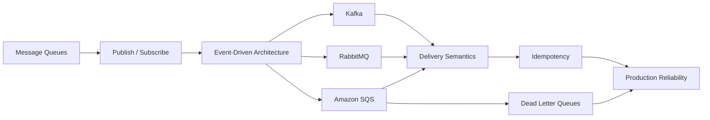
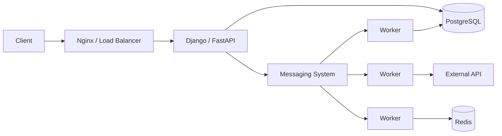
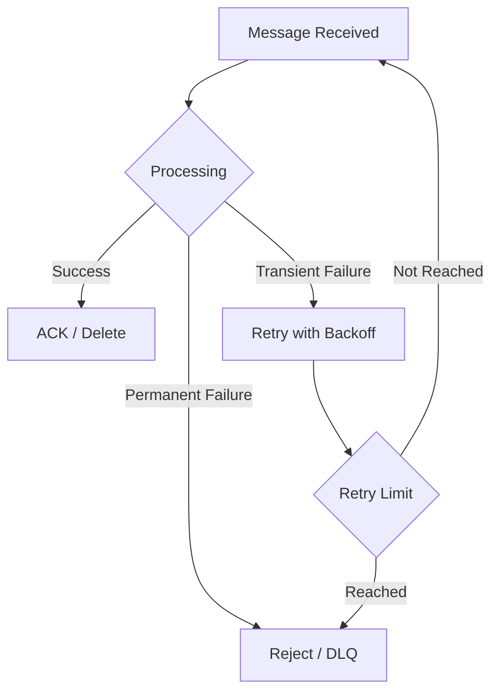

# README

## Overview

This section covers messaging systems as a core component of scalable backend architecture.

Messaging decouples producers and consumers, enables asynchronous processing, absorbs traffic spikes, and allows independently deployed services to communicate without requiring every interaction to be synchronous.

The material progresses from fundamental messaging models to production concerns such as delivery guarantees, retries, dead letter queues, idempotency, ordering, and event-driven architecture.



## Contents

| File | Topic | Focus |
|---|---|---|
| [01- Message Queues](./01-%20Message%20Queues.md) | Message Queues | Queue-based asynchronous communication, producers, consumers, acknowledgments, buffering, and worker scaling |
| [02- Publish Subscribe](./02-%20Publish%20Subscribe.md) | Publish / Subscribe | Topic-based messaging, fan-out, subscriptions, and decoupled consumers |
| [03- Event-Driven Architecture](./03-%20Event-Driven%20Architecture.md) | Event-Driven Architecture | Event-driven systems, domain events, service decoupling, eventual consistency, and integration patterns |
| [04- Kafka](./04-%20Kafka.md) | Kafka | Topics, partitions, offsets, consumer groups, ordering, retention, replication, and scalable event streaming |
| [05- RabbitMQ](./05-%20RabbitMQ.md) | RabbitMQ | Exchanges, queues, bindings, routing, acknowledgments, retries, and worker-based messaging |
| [06- Amazon SQS](./06-%20Amazon%20SQS.md) | Amazon SQS | Standard and FIFO queues, visibility timeout, polling, delivery semantics, scaling, and AWS integration |
| [07- Dead Letter Queues](./07-%20Dead%20Letter%20Queues.md) | Dead Letter Queues | Poison messages, bounded retries, failure isolation, DLQ monitoring, replay, and remediation |
| [08- Exactly Once vs At Least Once](./08-%20Exactly%20Once%20vs%20At%20Least%20Once.md) | Delivery Semantics | At-most-once, at-least-once, exactly-once, duplicate delivery, and business-level correctness |
| [09- Idempotency](./09-%20Idempotency.md) | Idempotency | Duplicate protection, idempotent consumers, idempotency keys, database constraints, and transactional processing |
| [10- Summary](./10-%20Summary.md) | Messaging Systems Summary | Consolidated architecture patterns, technology selection, reliability principles, and interview guidance |

## Messaging Architecture

A typical production system separates synchronous request handling from asynchronous work.



The messaging layer provides a buffer between the rate at which work is generated and the rate at which downstream components can process it.

This is particularly useful when:

- Work is slow or CPU-intensive.
- Downstream systems have limited capacity.
- Processing does not need to complete before the HTTP response.
- Multiple services need to react independently.
- Traffic arrives in bursts.
- Temporary downstream failures should not immediately fail user requests.

## Core Concepts

The section builds around several concepts that should be understood together.

| Concept | Architectural question |
|---|---|
| Queue | How do I distribute work among workers? |
| Pub/Sub | How do multiple consumers receive the same logical message? |
| Event | How do I communicate that something happened? |
| Broker | Where is messaging state managed? |
| Partition | How can message processing scale horizontally? |
| Consumer Group | How can consumers divide work? |
| Acknowledgment | When is a message considered successfully processed? |
| Retry | What should happen after a transient failure? |
| DLQ | What should happen after repeated failure? |
| Ordering | Which messages must be processed in sequence? |
| Idempotency | What happens if the same message is processed twice? |
| Outbox | How do database changes and events remain consistent? |
| Backpressure | What happens when producers are faster than consumers? |

## Queue vs Event

A useful distinction throughout this section is the difference between a **command or task** and an **event**.

```text
Command / Task
"Process this payment."

Event
"PaymentProcessed."
```

Queues commonly distribute work:

```text
Producer
   |
   v
Queue
   |
   +--> Worker A
   +--> Worker B
   +--> Worker C
```

Events commonly broadcast facts:

```text
                 +--> Payment Service
                 |
Order Service --> Event --> Inventory Service
                 |
                 +--> Notification Service
```

The distinction influences coupling, replay requirements, consumer ownership, and technology selection.

## Technology Map

The major technologies covered here have overlapping capabilities, but their architectural strengths differ.

| Technology | Primary Strength | Typical Use |
|---|---|---|
| Kafka | Durable event streaming and high-throughput partitioned logs | Event-driven architectures, analytics, stream processing |
| RabbitMQ | Message routing and queue-based workloads | Task queues, worker systems, complex routing |
| Amazon SQS | Managed asynchronous queues | AWS-native background processing and service decoupling |
| Redis | Low-latency data and lightweight queueing use cases | Caching, short-lived coordination, selected background workloads |
| Celery | Distributed task execution framework | Python/Django/FastAPI background jobs |

Technology selection should be driven by requirements rather than familiarity.

Consider:

- Throughput.
- Message retention.
- Replay requirements.
- Ordering requirements.
- Delivery semantics.
- Routing complexity.
- Consumer model.
- Operational overhead.
- Cloud integration.
- Cost.
- Failure and recovery requirements.

## Reliability Model

Messaging reliability is not provided by the broker alone.

A production design typically combines:

```text
Durable Messaging
       +
Acknowledgments
       +
Bounded Retries
       +
Exponential Backoff
       +
Dead Letter Queue
       +
Idempotent Consumer
       +
Transactional State Changes
       +
Observability
       +
Replay / Recovery Strategy
```

The most important distinction is between **message delivery** and **business correctness**.

For example, at-least-once delivery may result in:

```text
Message received
       |
       v
Payment succeeds
       |
       X
Consumer crashes before ACK
       |
       v
Message delivered again
       |
       v
Payment attempted again
```

If the payment operation is not idempotent, the messaging system can be technically reliable while the application remains incorrect.

## Delivery Semantics

The section covers three fundamental delivery models.

| Model | Guarantee | Main Risk |
|---|---|---|
| At-most-once | Processed zero or one time | Message loss |
| At-least-once | Message is retried until successful acknowledgment or failure handling | Duplicate processing |
| Exactly-once | Processing/effects occur once within a defined scope | High implementation complexity and limited scope |

In production systems, **at-least-once delivery + idempotent processing** is often a more practical design than attempting global exactly-once semantics.

## Idempotency

Idempotency protects business operations from duplicate delivery.

Typical techniques include:

- Idempotency keys.
- Unique database constraints.
- Processed-event tables.
- Transactional state transitions.
- Conditional updates.
- Outbox/inbox patterns.

Example:

```text
event_id = evt-123

First delivery:
    process event
    record evt-123
    commit

Duplicate delivery:
    detect evt-123
    skip business effect
```

A database uniqueness constraint is generally stronger than relying on an application-level existence check alone because concurrent workers can race.

## Failure Handling

Messaging failures should be classified.



Typical transient failures:

- Database timeout.
- Network failure.
- HTTP 503.
- Rate limiting.
- Temporary dependency outage.

Typical permanent failures:

- Invalid schema.
- Missing required fields.
- Unsupported event version.
- Invalid business state.
- Corrupt payload.

Retries should not be applied blindly.

## Dead Letter Queues

A DLQ prevents a poison message from repeatedly consuming worker capacity.

```text
Main Queue
    |
    v
Consumer
    |
    +---- success ---> Completed
    |
    +---- failure ---> Retry
                          |
                          v
                     Retry Limit
                          |
                          v
                         DLQ
```

A DLQ should have:

- Monitoring.
- Alerting.
- Retention policy.
- Message inspection.
- Root-cause analysis.
- Replay or remediation procedures.

A DLQ without operational ownership simply moves the failure somewhere else.

## Backpressure

Messaging systems absorb differences between producer and consumer throughput.

```text
Producer: 10,000 msg/s
Consumer:  6,000 msg/s

Backlog:
10,000
14,000
18,000
22,000
...
```

The system must eventually address the growing backlog.

Common approaches include:

- Horizontal consumer scaling.
- Producer rate limiting.
- Batching.
- Partition scaling.
- Consumer optimization.
- Downstream connection pooling.
- Load shedding.
- Circuit breakers.
- Priority handling.

Queue depth alone is insufficient. **Message age** and **consumer lag** are often more useful indicators of user-visible delay.

## Observability

Messaging systems require dedicated telemetry.

### Producer Metrics

- Publish rate.
- Publish failures.
- Publish latency.
- Serialization failures.

### Consumer Metrics

- Processing rate.
- Processing latency.
- Processing failures.
- Retry rate.
- Consumer concurrency.

### Queue Metrics

- Queue depth.
- Oldest message age.
- Messages in flight.
- Receive rate.
- Delete/acknowledgment rate.

### Kafka Metrics

- Consumer lag.
- Partition distribution.
- Rebalance frequency.
- Produce latency.
- Fetch latency.
- Under-replicated partitions.

### DLQ Metrics

- DLQ depth.
- DLQ growth rate.
- Oldest DLQ message age.
- Replay rate.

Alerting should focus on symptoms that affect service-level objectives rather than simply alerting on infrastructure resource usage.

## Production Architecture Principles

A production messaging architecture should explicitly define:

| Concern | Design decision |
|---|---|
| Message ownership | Which service produces and owns the message? |
| Schema | How is the message versioned? |
| Delivery | What delivery guarantee is acceptable? |
| Ordering | What ordering scope is required? |
| Retry | Which failures are retryable? |
| DLQ | When does a message become permanently failed? |
| Idempotency | How are duplicate effects prevented? |
| Retention | How long are messages/events retained? |
| Replay | Can historical messages be safely replayed? |
| Backpressure | How is consumer overload handled? |
| Observability | Which lag, age, and failure metrics are monitored? |
| Security | Who can publish and consume? |
| Recovery | How is the system restored after an outage? |

## Recommended Engineering Principles

### Keep Consumers Idempotent

Assume messages can be delivered more than once unless the entire architecture provides a stronger, explicitly verified guarantee.

### Acknowledge Only After Durable Processing

For worker-style systems:

```text
Receive
   |
Process
   |
Persist result
   |
ACK / Delete
```

Do not acknowledge a message merely because the consumer received it.

### Bound Retries

Infinite retries can turn one bad message into a persistent availability problem.

Use:

```text
retry limit
+
backoff
+
jitter
+
DLQ
```

### Design for Replay

If events represent durable business facts, replay can be a valuable recovery mechanism.

Replay requires consumers to be:

- Idempotent.
- Version-aware.
- Safe against historical data.
- Observable during reprocessing.

### Separate Transient and Permanent Failures

Do not waste capacity retrying malformed or permanently invalid messages.

### Treat Schemas as Contracts

Event payloads are APIs between services.

Schema changes should consider:

- Backward compatibility.
- Versioning.
- Optional fields.
- Consumer rollout order.
- Validation.
- Deprecation.

## Common Mistakes

| Mistake | Why it is dangerous |
|---|---|
| Assuming messages are processed once | Duplicate delivery is common |
| Acknowledging before processing | Can cause message loss |
| Retrying every error | Creates retry storms and wastes capacity |
| No DLQ | Poison messages can block healthy work |
| Ignoring message age | Queue may appear healthy while latency is unacceptable |
| Assuming global ordering | Most systems provide ordering only within a defined scope |
| Adding consumers without checking partitions | Kafka parallelism remains bounded |
| Publishing DB changes separately | Creates dual-write inconsistency |
| Putting sensitive data in events | Increases security and compliance exposure |
| No replay strategy | Operational recovery becomes difficult |
| Treating DLQ as permanent storage | Failed messages require remediation |
| Making everything asynchronous | Adds unnecessary complexity and eventual consistency |

## Navigation

Use the files in this order when studying the messaging section:

```text
01- Message Queues
        |
        v
02- Publish Subscribe
        |
        v
03- Event-Driven Architecture
        |
        +----------------+
        |                |
        v                v
04- Kafka          05- RabbitMQ
        |                |
        +-------+--------+
                |
                v
06- Amazon SQS
        |
        v
07- Dead Letter Queues
        |
        v
08- Exactly Once vs At Least Once
        |
        v
09- Idempotency
        |
        v
10- Summary
```

The first three files establish the architectural models. Kafka, RabbitMQ, and SQS then provide concrete implementations and technology-specific trade-offs. The final reliability-focused files address the problems that emerge when messaging is deployed in production: failures, retries, duplicate delivery, and business correctness.

## Key Takeaways

- **Messaging systems provide asynchronous decoupling, but the broker alone does not guarantee end-to-end reliability or business correctness.**
- **Choose between queues, pub/sub, Kafka, RabbitMQ, and SQS based on delivery semantics, ordering, replay, throughput, routing, retention, operational requirements, and cost.**
- **Production consumers should assume failure and duplicate delivery, using bounded retries, DLQs, idempotency, and durable state transitions.**
- **Backpressure, consumer lag, message age, retries, and DLQ depth are first-class operational concerns in production messaging systems.**
- **The strongest messaging architectures explicitly define delivery, ordering, failure recovery, schema evolution, idempotency, observability, security, and replay behavior.**