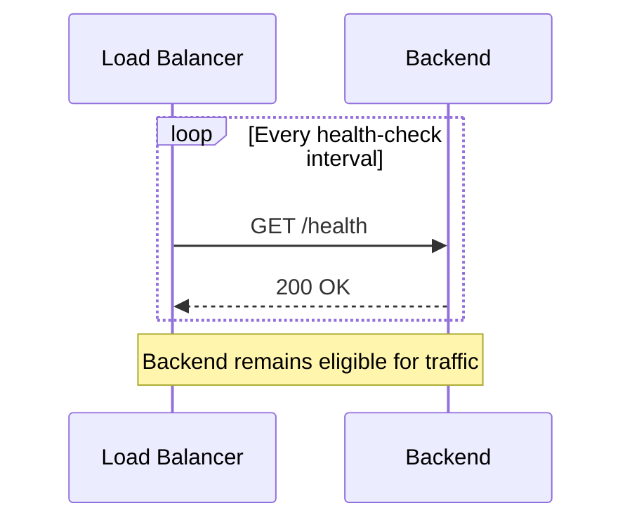
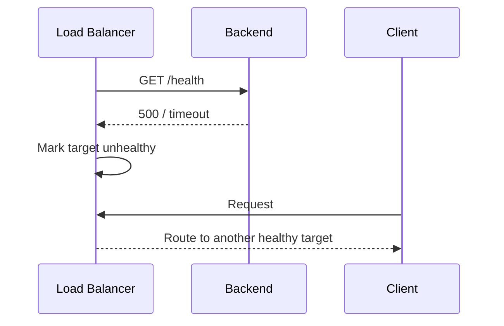
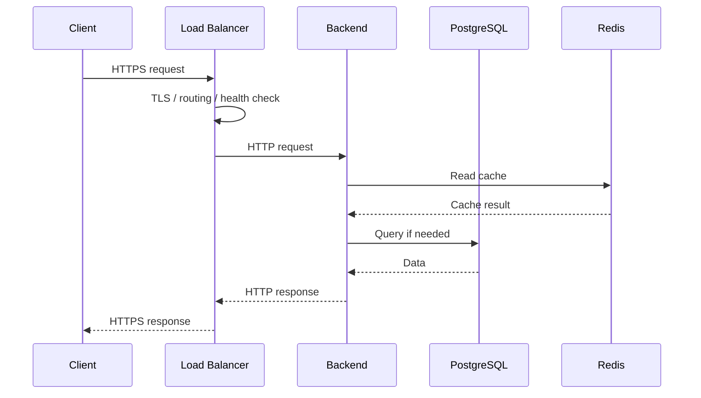
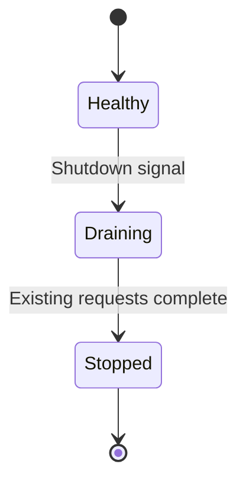
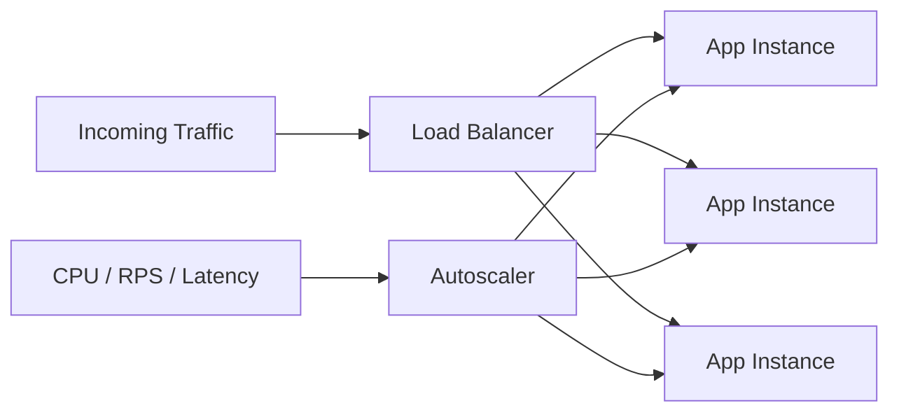

# 01- Load Balancing

## Overview

Load balancing distributes incoming network traffic across multiple backend instances instead of allowing clients to depend on a single server.

In a production system, load balancing is primarily a **scalability, availability, and traffic-management mechanism**. It allows application capacity to scale horizontally, removes unhealthy instances from service, and provides a stable entry point while backend infrastructure changes underneath it.

A typical architecture looks like:

```text
                         ┌───────────────┐
                         │    Clients    │
                         └───────┬───────┘
                                 │
                                 ▼
                       ┌──────────────────┐
                       │ Load Balancer    │
                       │                  │
                       │ Health Checks    │
                       │ Routing          │
                       │ TLS Termination  │
                       └────────┬─────────┘
                                │
                ┌───────────────┼───────────────┐
                │               │               │
                ▼               ▼               ▼
        ┌──────────────┐ ┌──────────────┐ ┌──────────────┐
        │ Backend #1   │ │ Backend #2   │ │ Backend #3   │
        │ Django       │ │ FastAPI      │ │ FastAPI      │
        └──────┬───────┘ └──────┬───────┘ └──────┬───────┘
               │                │                │
               └────────────────┼────────────────┘
                                ▼
                         ┌──────────────┐
                         │ PostgreSQL   │
                         └──────────────┘
```

The load balancer does not make an application horizontally scalable by itself. The application must also be designed so that requests can safely execute on multiple independent instances.

That usually means minimizing local state, externalizing sessions and shared state, and ensuring that dependencies such as databases, caches, and queues can handle the increased workload.

## Why Load Balancing Exists

A single application server creates several architectural problems:

```text
                    ┌───────────────┐
Clients ───────────►│ Single Server │
                    └───────────────┘
                           │
                           ├── CPU limit
                           ├── Memory limit
                           ├── Network limit
                           └── Single point of failure
```

If the server fails, traffic has nowhere else to go.

If traffic increases beyond the capacity of the machine, requests queue, latency increases, and eventually requests fail.

Horizontal scaling changes the architecture:

```text
                    ┌─────────────────┐
Clients ───────────►│ Load Balancer   │
                    └────────┬────────┘
                             │
                 ┌───────────┼───────────┐
                 ▼           ▼           ▼
              Server A    Server B    Server C
```

The system can increase capacity by adding instances rather than continually increasing the size of one machine.

## What a Load Balancer Does

A load balancer generally performs several responsibilities.

| Responsibility | Purpose |
|---|---|
| Traffic distribution | Sends requests to backend instances |
| Health checking | Prevents traffic from reaching unhealthy instances |
| Connection management | Handles client/backend connections |
| TLS termination | Decrypts HTTPS traffic at the edge |
| Routing | Selects targets based on configured rules |
| Failover | Removes unavailable targets |
| Connection draining | Allows existing requests to finish before termination |
| Observability | Provides traffic and latency metrics |
| Security integration | Works with firewalls, WAFs, and access controls |

The exact responsibilities depend on the type of load balancer.

## Load Balancer vs Reverse Proxy

These concepts overlap but are not identical.

A reverse proxy receives requests on behalf of backend servers.

```text
Client
  |
  v
Reverse Proxy
  |
  v
Backend
```

A load balancer specifically distributes traffic across multiple targets.

```text
Client
  |
  v
Load Balancer
  |
  +----> Backend A
  +----> Backend B
  +----> Backend C
```

Nginx can perform both roles.

For example:

```nginx
upstream backend {
    server app1:8000;
    server app2:8000;
    server app3:8000;
}

server {
    listen 80;

    location / {
        proxy_pass http://backend;
    }
}
```

In a larger AWS deployment, an Application Load Balancer may sit in front of multiple application instances or containers.

## Layer 4 vs Layer 7 Load Balancing

Load balancers are commonly classified by the network layer at which they operate.

### Layer 4

Layer 4 load balancing operates using transport-level information such as:

- Source IP
- Destination IP
- Source port
- Destination port
- TCP/UDP connection information

It does not need to understand HTTP semantics.

```text
Client
   |
   | TCP
   v
L4 Load Balancer
   |
   +---- TCP ----> Server A
   |
   +---- TCP ----> Server B
```

Advantages:

- Low processing overhead.
- High throughput.
- Protocol agnostic.
- Suitable for TCP and UDP workloads.

Limitations:

- Limited application-level routing.
- Cannot normally route based on URL path or HTTP headers.
- Less visibility into application semantics.

### Layer 7

Layer 7 load balancing understands application protocols such as HTTP.

It can make routing decisions using:

- Hostname.
- URL path.
- HTTP method.
- Headers.
- Cookies.
- Query parameters in supported implementations.

Example:

```text
api.example.com/users  ──► User Service
api.example.com/orders ──► Order Service
api.example.com/payments ─► Payment Service
```

Advantages:

- Application-aware routing.
- TLS termination.
- Path-based routing.
- Host-based routing.
- Header-based routing.
- Better application-level observability.

Limitations:

- More processing overhead.
- Protocol-specific.
- More complex configuration.

### Comparison

| Characteristic | Layer 4 | Layer 7 |
|---|---|---|
| Primary information | TCP/UDP | HTTP/application protocol |
| URL routing | No | Yes |
| Header routing | No | Yes |
| TLS termination | Limited/implementation-specific | Common |
| Protocol flexibility | High | Lower |
| Processing overhead | Lower | Higher |
| Typical use | TCP services | HTTP APIs and web applications |

## Common Load Balancing Algorithms

The routing algorithm determines which backend receives a request or connection.

### Round Robin

Requests are distributed sequentially.

```text
Request 1 → Server A
Request 2 → Server B
Request 3 → Server C
Request 4 → Server A
```

This works well when backend instances have similar capacity and requests have roughly similar cost.

### Weighted Round Robin

Servers receive traffic proportional to configured weights.

```text
Server A → weight 5
Server B → weight 3
Server C → weight 2
```

This is useful when instances have different capacities or during gradual deployments.

### Least Connections

Traffic is sent toward the backend with the fewest active connections.

```text
Server A → 100 connections
Server B → 30 connections
Server C → 50 connections

Next request → Server B
```

This is useful when request duration varies significantly.

### Least Response Time

The load balancer considers backend response performance in addition to connection state.

This can be useful when servers have different latency characteristics.

### IP Hash

A client identifier such as source IP is hashed to select a backend.

```text
hash(client_ip) → Server B
```

This can provide a form of session affinity, but it has limitations when clients share IP addresses or traffic patterns change.

### Random

A backend is selected randomly, sometimes with additional weighting or load-awareness.

### Algorithm Comparison

| Algorithm | Best For | Main Limitation |
|---|---|---|
| Round Robin | Similar instances and workloads | Ignores current load |
| Weighted Round Robin | Different instance capacities | Requires correct weights |
| Least Connections | Long-lived or variable-duration requests | Connection count is not always workload |
| Least Response Time | Variable backend performance | Requires latency tracking |
| IP Hash | Basic affinity | Uneven distribution and client-IP issues |
| Random | Simple distribution | No workload awareness |

## Health Checks

A load balancer must determine whether a backend should receive traffic.

A health check may look like:

```http
GET /health
```

A healthy response might be:

```http
HTTP/1.1 200 OK
Content-Type: application/json

{"status":"ok"}
```

The load balancer periodically checks the endpoint.



When the backend becomes unhealthy:



### Health Check Design

A health endpoint should answer an important operational question:

> Can this instance safely receive production traffic?

A simple liveness check might only verify that the process is running.

A readiness check should generally verify that the instance is ready to serve traffic.

These are different concepts.

```text
Liveness:
"Is the process alive?"

Readiness:
"Can this instance serve requests?"
```

For Kubernetes, this distinction maps naturally to liveness and readiness probes.

### Avoid Overly Deep Health Checks

A common mistake is creating a health endpoint that calls every dependency:

```text
/health
   |
   +--> PostgreSQL
   +--> Redis
   +--> Kafka
   +--> External API
   +--> Another Service
```

This can create cascading failures.

If Redis has a temporary issue, an application that could still serve many endpoints might be removed entirely from the load balancer.

Use separate checks where appropriate:

- Liveness.
- Readiness.
- Dependency health.
- Deep diagnostics.

## Request Lifecycle

A typical HTTP request through a load balancer follows this path:



In a production system, there may also be:

```text
Client
  ↓
DNS
  ↓
CDN / WAF
  ↓
Load Balancer
  ↓
Ingress / Reverse Proxy
  ↓
Application
  ↓
Cache / Database / Queue
```

Each additional layer adds capabilities but also increases operational complexity and latency.

## Stateless Applications

Load balancing works best when application instances are stateless.

A stateless application does not depend on local process memory or local disk for information required by another request.

Instead of:

```text
Request 1 → Server A
              |
              └── session stored in memory

Request 2 → Server B
              |
              └── session missing
```

Use shared infrastructure:

```text
Server A ──┐
           ├──► Redis
Server B ──┤
           │
Server C ──┘
```

Similarly, uploaded files should generally be stored in durable shared storage such as Amazon S3 rather than local container storage when multiple instances need access.

## Session Management

A common scaling problem is local session state.

### Poor Architecture

```text
Client
  |
  v
Load Balancer
  |
  +----> Server A
  |          |
  |          └── Session Memory
  |
  +----> Server B
             |
             └── No Session
```

### Better Architecture

```text
Client
  |
  v
Load Balancer
  |
  +----> Server A ──┐
  |                 |
  +----> Server B ──┼──► Redis
  |                 |
  +----> Server C ──┘
```

For Django, session storage can be externalized using Redis or a database depending on requirements.

For token-based authentication, the application can often avoid server-side session affinity entirely.

## Sticky Sessions

Sticky sessions, or session affinity, attempt to route a client consistently to the same backend.

```text
Client A ──► Server A
Client B ──► Server B
Client C ──► Server C
```

This can temporarily simplify applications that maintain local session state.

However, it introduces trade-offs:

- Uneven traffic distribution.
- Reduced failover flexibility.
- Instance-specific dependency.
- More difficult autoscaling.
- Session loss when an instance disappears.

Prefer stateless applications over sticky sessions when practical.

## Connection Management

A load balancer sits between clients and backend servers, so connection behavior matters.

Depending on the architecture:

```text
Client
   |
   | Many client connections
   v
Load Balancer
   |
   | Backend connection pool
   v
Application
```

The load balancer may reuse backend connections, reducing connection establishment overhead.

Backend services should still configure appropriate:

- Keep-alive settings.
- Connection limits.
- Request timeouts.
- Idle timeouts.
- Database connection pools.

A common production failure is allowing every application worker to establish too many database connections.

For example:

```text
10 application instances
×
8 workers each
×
10 DB connections
=
800 potential DB connections
```

The load balancer increased application capacity, but the database may become the new bottleneck.

## Timeouts

Timeouts must be deliberately configured.

Typical timeout categories include:

| Timeout | Purpose |
|---|---|
| Connect timeout | Maximum time to establish connection |
| Read timeout | Maximum time waiting for response data |
| Idle timeout | Maximum inactivity period |
| Request timeout | Maximum request duration |
| Backend timeout | Maximum time allowed for upstream response |

Timeouts should be consistent across the request chain.

For example:

```text
Client timeout       = 30s
Load balancer timeout = 25s
Application timeout   = 20s
Database timeout      = 5s
```

This creates a bounded failure model.

Avoid configurations such as:

```text
Client = 30s
Load Balancer = 120s
Application = 300s
```

because downstream work can continue long after the client has abandoned the request.

## Graceful Shutdown

Load-balanced applications must support graceful termination.

During deployment or autoscaling, an instance should stop receiving new traffic while completing existing requests.



A typical shutdown sequence is:

1. Mark the instance unavailable for new traffic.
2. Stop accepting new work.
3. Allow in-flight requests to complete.
4. Stop background workers where appropriate.
5. Close connections.
6. Terminate the instance.

This prevents deployments from abruptly terminating active requests.

## Load Balancing and Autoscaling

Load balancing and autoscaling solve different problems.

```text
Load Balancer
    |
    └── Distributes traffic

Autoscaler
    |
    └── Changes number of instances
```

Together:



Autoscaling signals can include:

- CPU utilization.
- Memory utilization.
- Requests per second.
- Request latency.
- Queue depth.
- Kafka consumer lag.
- Custom application metrics.

CPU alone is often insufficient.

For asynchronous workers, queue depth or message age may be more meaningful than CPU.

## Load Balancing Across Availability Zones

Production systems should avoid placing all backend capacity in one availability zone.

```text
                    Load Balancer
                         |
          ┌──────────────┼──────────────┐
          ▼              ▼              ▼
        AZ-A            AZ-B            AZ-C
      App x 2         App x 2         App x 2
```

This protects against an availability-zone failure.

The load balancer should route traffic only to healthy targets.

High availability generally requires:

- Multiple availability zones.
- Multiple application instances.
- Redundant load-balancer infrastructure.
- Independent failure domains.
- Automated health checks.
- Automated replacement.

## AWS Load Balancing

AWS provides multiple load-balancing options.

| AWS Service | Typical Use |
|---|---|
| Application Load Balancer | HTTP/HTTPS applications and APIs |
| Network Load Balancer | High-performance TCP/UDP/TLS workloads |
| Gateway Load Balancer | Deploying and scaling network virtual appliances |
| Classic Load Balancer | Legacy workloads |

For modern HTTP APIs built with Django or FastAPI, an Application Load Balancer is commonly appropriate when application-level routing is required.

A typical architecture is:

```text
Internet
   |
   v
Route 53
   |
   v
ALB
   |
   +---- Target Group ---- EC2
   |
   +---- Target Group ---- ECS
   |
   +---- Target Group ---- Kubernetes / Ingress integration
```

Security groups should restrict backend instances so that application traffic is accepted only from trusted sources where appropriate.

## Nginx Load Balancing

Nginx can distribute requests among upstream servers.

```nginx
upstream api_servers {
    least_conn;

    server api-1:8000;
    server api-2:8000;
    server api-3:8000;
}

server {
    listen 443 ssl;

    location / {
        proxy_pass http://api_servers;
        proxy_http_version 1.1;

        proxy_set_header Host $host;
        proxy_set_header X-Real-IP $remote_addr;
        proxy_set_header X-Forwarded-For $proxy_add_x_forwarded_for;
        proxy_set_header X-Forwarded-Proto $scheme;
    }
}
```

Important headers include:

- `Host`
- `X-Real-IP`
- `X-Forwarded-For`
- `X-Forwarded-Proto`

Applications must be configured to trust proxy headers correctly.

Blindly trusting arbitrary `X-Forwarded-For` headers can allow clients to spoof their apparent IP address.

## Load Balancing in Kubernetes

Kubernetes commonly introduces another abstraction layer.

```text
Internet
   |
   v
Cloud Load Balancer
   |
   v
Ingress / Gateway
   |
   v
Kubernetes Service
   |
   +---- Pod
   +---- Pod
   +---- Pod
```

A Kubernetes `Service` provides stable service discovery and distributes traffic across eligible pods.

Ingress or Gateway resources can perform HTTP routing.

The architecture should avoid unnecessary layers.

For example:

```text
ALB → Nginx → Kubernetes Service → Pod
```

may be justified for specific routing or security requirements, but every layer should have a clear responsibility.

## Reverse Proxy Headers

When TLS terminates at the load balancer:

```text
Client
  |
 HTTPS
  v
Load Balancer
  |
 HTTP
  v
Application
```

The application may otherwise believe the request was HTTP.

Forwarded headers communicate the original request context.

Example:

```http
X-Forwarded-Proto: https
X-Forwarded-For: 203.0.113.10
Host: api.example.com
```

Framework configuration must correctly handle these headers.

For Django, this can affect:

- Secure redirects.
- CSRF behavior.
- Absolute URL generation.
- Request security detection.

Proxy-header configuration should be explicit and restricted to trusted proxies.

## Security Considerations

A load balancer is part of the security boundary.

### TLS

Prefer HTTPS for external traffic.

```text
Client
  |
 HTTPS
  v
Load Balancer
  |
 HTTPS or controlled internal HTTP
  v
Application
```

For sensitive internal traffic, TLS may also be appropriate between internal components.

### Security Groups and Network Policies

Backend instances should not generally be directly reachable from the public internet if the load balancer is the intended public entry point.

```text
Internet
   |
   v
Load Balancer
   |
   v
Private Application Subnets
```

### WAF

A Web Application Firewall can inspect HTTP traffic before it reaches application servers.

```text
Internet
   |
   v
WAF
   |
   v
Load Balancer
   |
   v
Application
```

Typical protections include:

- SQL injection patterns.
- Cross-site scripting patterns.
- Malicious request signatures.
- Rate-based rules.

A WAF is not a replacement for application-level validation.

## Scalability Considerations

Load balancing enables horizontal scaling, but it does not remove bottlenecks.

A common scaling chain is:

```text
Clients
   |
   v
Load Balancer
   |
   v
Application Tier
   |
   +----► Redis
   |
   +----► PostgreSQL
   |
   +----► Kafka / SQS
```

As application capacity increases, the next bottleneck may become:

```text
Application
     |
     v
PostgreSQL
```

or:

```text
Application
     |
     v
Redis
```

or:

```text
Application
     |
     v
External API
```

Senior-level system design requires identifying the **system bottleneck**, not simply adding more application instances.

## Database Connection Scaling

One of the most important consequences of horizontal scaling is increased database connection pressure.

Suppose:

```text
20 application instances
×
4 processes
×
10 database connections
=
800 database connections
```

If PostgreSQL can safely handle only a fraction of that workload, adding application servers makes the system worse.

Solutions can include:

- Smaller application connection pools.
- PgBouncer.
- Connection reuse.
- Read replicas where appropriate.
- Query optimization.
- Caching.
- Workload separation.
- Database scaling.

The load balancer should therefore be considered part of the entire capacity-planning problem.

## Session and Cache Consistency

If application instances share Redis:

```text
App A ──┐
App B ──┼──► Redis
App C ──┘
```

the cache becomes shared infrastructure.

This introduces its own concerns:

- Redis availability.
- Cache stampedes.
- Key design.
- TTL strategy.
- Eviction behavior.
- Hot keys.
- Network latency.

Caching should not accidentally become a new single point of failure.

## Logging and Tracing

Requests crossing a load balancer should carry correlation information.

```text
Client
  |
  | X-Request-ID: req-abc123
  v
Load Balancer
  |
  v
Application
  |
  +--> PostgreSQL
  +--> Redis
  +--> Kafka
```

A consistent request ID allows logs from different services to be correlated.

Distributed tracing can extend this with trace/span IDs.

Useful fields include:

```text
request_id
trace_id
client_ip
route
target
status_code
latency
upstream_latency
```

## Performance Considerations

The load balancer introduces overhead, but properly configured load balancing should have relatively small impact compared with application and database work.

Important performance considerations include:

- TLS handshakes.
- Connection reuse.
- Keep-alive.
- Compression.
- Request buffering.
- Backend connection pools.
- Cross-zone traffic.
- Health-check frequency.
- Routing complexity.
- Payload size.

Do not optimize load-balancer latency in isolation. Measure the complete request path.

```text
Total latency ≈
DNS
+ connection establishment
+ TLS
+ load balancer
+ application
+ cache/database
+ response transfer
```

## Capacity Planning

A useful approximation is:

```text
Required capacity =
Peak traffic × average resource cost per request
```

For a more practical architecture, consider:

```text
Peak RPS
×
Target utilization
×
Failure headroom
```

For example, if the application needs to support 3,000 RPS and one instance safely handles 500 RPS:

```text
3,000 / 500 = 6 instances
```

Do not necessarily deploy only six instances.

You may require additional capacity for:

- Availability-zone failure.
- Rolling deployments.
- Traffic spikes.
- Autoscaling delay.
- Instance degradation.
- Maintenance.

If one availability zone must be able to fail without violating the service objective, capacity planning must explicitly account for that failure scenario.

## Cost Considerations

Load balancing introduces costs for:

- Load balancer instances or capacity units.
- Processed bytes.
- Cross-zone traffic in some architectures.
- TLS processing.
- Logging.
- Additional backend instances.

Cost optimization should not compromise reliability.

Common optimization opportunities include:

- Removing unnecessary proxy layers.
- Right-sizing backend instances.
- Using autoscaling.
- Reducing unnecessary cross-zone traffic.
- Caching static or repeated responses.
- Using connection reuse.
- Avoiding duplicate infrastructure.

## Disaster Recovery

Load balancing primarily addresses high availability within a deployment architecture. It does not automatically provide disaster recovery.

A regional disaster may require:

```text
Region A
   |
   v
Load Balancer
   |
   v
Application

Region B
   |
   v
Load Balancer
   |
   v
Application
```

DNS or a global traffic-management layer can direct traffic between regions.

Multi-region architecture introduces additional complexity:

- Database replication.
- Data consistency.
- Session management.
- Cache behavior.
- DNS failover.
- Deployment synchronization.
- Regional dependencies.
- Disaster recovery testing.

Do not introduce multi-region architecture solely because load balancing exists.

## Common Mistakes and Pitfalls

| Mistake | Why It Happens | Better Approach |
|---|---|---|
| Running one backend behind a load balancer | Treating LB as a complete HA solution | Deploy multiple targets across failure domains |
| Using sticky sessions by default | Local sessions are convenient | Prefer stateless services |
| Health check performs expensive work | Treating health endpoint as a diagnostic endpoint | Keep readiness checks bounded |
| No graceful shutdown | Instance is terminated immediately | Drain connections before termination |
| Ignoring database limits | Application tier scales independently | Capacity-plan downstream dependencies |
| Trusting arbitrary proxy headers | Assuming every `X-Forwarded-*` header is trusted | Trust only known proxies |
| No timeout strategy | Letting requests run indefinitely | Define bounded timeouts across layers |
| No observability | Looking only at CPU | Monitor RPS, latency, errors, saturation, and target health |
| Adding unnecessary proxy layers | Copying infrastructure patterns blindly | Give every network layer a clear responsibility |
| Assuming LB solves overload | Confusing distribution with capacity | Combine load balancing with autoscaling and backpressure |
| Health checks too aggressive | Temporary failures remove healthy capacity | Tune thresholds and intervals carefully |
| No spare capacity | Planning only for normal traffic | Include deployment and failure headroom |

## Interview Traps

### Is a Load Balancer Required for Horizontal Scaling?

Not strictly.

A service can technically run multiple instances without a traditional load balancer if another routing mechanism distributes traffic.

In production HTTP systems, however, a load balancer is a common mechanism for providing a stable endpoint and distributing traffic.

### Does a Load Balancer Make the System Highly Available?

No.

High availability requires redundancy across the entire critical path.

```text
Load Balancer
     |
     v
Multiple App Instances
     |
     v
Highly Available Database
     |
     v
Highly Available Cache / Queue
```

A redundant load balancer with a single database is not an end-to-end highly available system.

### Does Round Robin Guarantee Equal Load?

No.

It distributes according to the algorithm, not necessarily according to actual resource consumption.

One request may take 5 ms while another takes 30 seconds.

### Are Sticky Sessions Better?

Usually not for a modern stateless backend.

Sticky sessions can simplify legacy stateful applications but reduce flexibility and complicate scaling and failure recovery.

### Does Adding More Instances Always Improve Performance?

No.

Eventually another dependency becomes the bottleneck.

```text
More App Instances
       |
       v
More DB Connections
       |
       v
Database Saturation
       |
       v
Higher Latency
```

### Does a Health Check Guarantee the Application Is Healthy?

No.

It only tests what the health-check endpoint actually verifies.

A process can return `200 OK` while suffering from:

- Thread exhaustion.
- Connection pool exhaustion.
- Dependency saturation.
- Memory pressure.
- Severe latency.
- Partial feature failure.

## Production Checklist

Before deploying a load-balanced backend, verify:

### Traffic

- [ ] Multiple healthy backend targets exist.
- [ ] Traffic distribution is appropriate for workload characteristics.
- [ ] DNS and TLS configuration are correct.
- [ ] Client and backend connection behavior is understood.

### Health

- [ ] Readiness checks exist.
- [ ] Health checks are lightweight.
- [ ] Failure thresholds are tuned.
- [ ] Unhealthy targets are automatically removed.
- [ ] Recovery behavior is tested.

### Application

- [ ] Application instances are stateless where possible.
- [ ] Sessions are externally stored when necessary.
- [ ] Local filesystem state is not required for correctness.
- [ ] Graceful shutdown is implemented.
- [ ] Timeouts are configured.

### Database and Dependencies

- [ ] Database connection capacity has been calculated.
- [ ] Redis capacity has been considered.
- [ ] External API rate limits are understood.
- [ ] Queue and event-stream capacity has been considered.

### Security

- [ ] TLS is configured.
- [ ] Backend targets are not unnecessarily public.
- [ ] Security groups/network policies are restrictive.
- [ ] Proxy headers are trusted only from known infrastructure.
- [ ] WAF protections are considered where appropriate.

### Observability

- [ ] Request IDs are propagated.
- [ ] Load-balancer metrics are collected.
- [ ] Backend latency is monitored.
- [ ] Error rates are monitored.
- [ ] Target health is monitored.
- [ ] Logs and traces can correlate requests across layers.

### Reliability

- [ ] Multiple availability zones are used where required.
- [ ] Rolling deployments support connection draining.
- [ ] Capacity includes failure headroom.
- [ ] Autoscaling behavior has been tested.
- [ ] Failure scenarios have been exercised.

## Key Takeaways

- **Load balancing distributes traffic across backend targets, but high availability requires redundancy across the entire dependency chain.**
- **Layer 4 load balancing operates on transport-level information, while Layer 7 load balancing enables application-aware routing such as host and path-based routing.**
- **Stateless application design is usually preferable to sticky sessions because it improves horizontal scaling, failover, and deployment flexibility.**
- **Health checks, graceful shutdown, timeouts, connection management, observability, and downstream capacity planning are as important as the routing algorithm itself.**
- **Adding load-balanced instances only moves the bottleneck unless databases, caches, queues, external APIs, and other dependencies are capacity-planned alongside the application tier.**