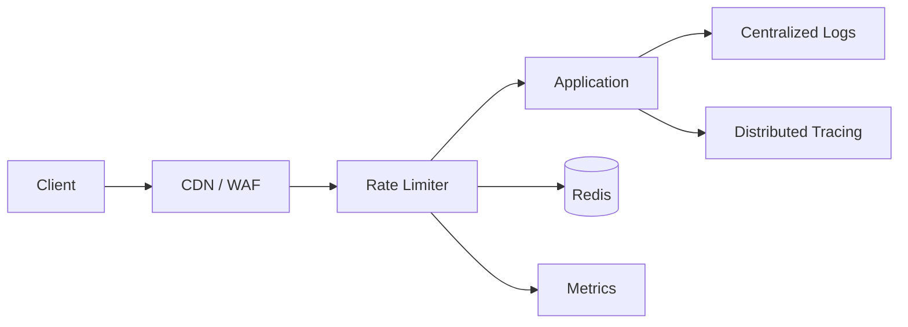
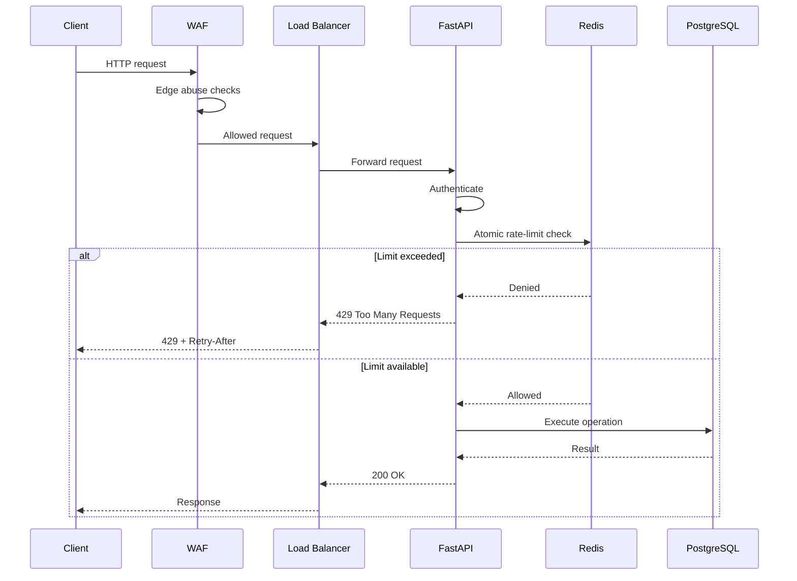

# 02- Rate Limiting

## Overview

Rate limiting controls how frequently a client, identity, or system component can perform an operation within a defined period.

It is primarily a **traffic-control and resource-protection mechanism**. A production API may be exposed to legitimate traffic spikes, accidental retry storms, abusive clients, credential attacks, expensive queries, or coordinated denial-of-service attempts. Without limits, a small number of clients can consume disproportionate resources and degrade service for everyone else.

A typical architecture is:

```text
                         Internet
                            |
                            v
                    ┌───────────────┐
                    │ CDN / WAF     │
                    └───────┬───────┘
                            |
                            v
                    ┌───────────────┐
                    │ Rate Limiter  │
                    └───────┬───────┘
                            |
                  Allowed Requests
                            |
                            v
                    ┌───────────────┐
                    │ Load Balancer │
                    └───────┬───────┘
                            |
             ┌──────────────┼──────────────┐
             v              v              v
          API #1          API #2          API #3
             |              |              |
             └──────────────┼──────────────┘
                            v
                     Redis / Database
```

Rate limiting is different from authentication, authorization, load balancing, and concurrency control:

| Mechanism | Primary Responsibility |
|---|---|
| Authentication | Identify who is making the request |
| Authorization | Determine what the identity is allowed to do |
| Rate limiting | Control how frequently operations can occur |
| Load balancing | Distribute traffic across targets |
| Concurrency limiting | Control how many operations execute simultaneously |
| Circuit breaker | Prevent calls to unhealthy dependencies |
| Queueing | Buffer work for asynchronous processing |

A robust system frequently uses several of these mechanisms together.

## Why Rate Limiting Exists

Suppose an API normally receives:

```text
1,000 requests/second
```

and one client accidentally starts sending:

```text
50,000 requests/second
```

Without protection, the additional traffic may cause:

```text
CPU saturation
      ↓
Request queue growth
      ↓
Higher latency
      ↓
Database connection exhaustion
      ↓
Timeouts
      ↓
Retries
      ↓
More traffic
      ↓
Cascading failure
```

Rate limiting interrupts this feedback loop before the application becomes saturated.

It protects:

- Application CPU.
- Memory.
- Database connections.
- Redis.
- External APIs.
- Queue capacity.
- Worker capacity.
- Network bandwidth.
- Expensive business operations.

It also provides **fairness** by preventing one client from monopolizing shared capacity.

## What Should Be Rate Limited?

Rate limiting should be applied according to the resource being protected.

Examples include:

| Resource | Example Limit |
|---|---|
| Public API | 100 requests/minute/client |
| Login | 5 attempts/minute/IP |
| Password reset | 3 requests/hour/account |
| Search endpoint | 30 requests/second/user |
| File upload | 10 uploads/minute/user |
| Expensive report | 5 requests/minute/account |
| Payment operation | Strict business-specific limit |
| External API calls | Provider-defined quota |
| Kafka publishing | Producer-specific throughput limit |

Not every endpoint needs the same limit.

A health endpoint and a database-intensive reporting endpoint should not necessarily have identical limits.

## Rate Limiting Dimensions

The key design question is:

> What identity should consume the quota?

Common dimensions include:

- IP address.
- User ID.
- API key.
- OAuth client ID.
- Organization/account.
- Device ID.
- Endpoint.
- HTTP method.
- Geographic region.
- Combination of several dimensions.

For example:

```text
user_id + endpoint
```

may be more appropriate for an authenticated API than:

```text
IP address
```

because many legitimate users can share one public IP.

### Multi-Dimensional Rate Limiting

Production systems often combine limits:

```text
Per IP:
    1,000 requests/minute

Per user:
    300 requests/minute

Per API key:
    10,000 requests/minute

Expensive endpoint:
    20 requests/minute/user
```

A request is allowed only if all relevant policies permit it.

## Rate Limiting Placement

Rate limiting can occur at several layers.

```text
                    Client
                      |
                      v
                 CDN / WAF
                      |
                 Edge Limit
                      |
                      v
               API Gateway / LB
                      |
               Global Limit
                      |
                      v
              Application Service
                      |
                Business Limit
                      |
                      v
                  Database
```

### Edge-Level Rate Limiting

Examples:

- CDN.
- WAF.
- API Gateway.
- Nginx.
- Cloud load balancer features.

Advantages:

- Rejects traffic before application resources are consumed.
- Protects the application from large request floods.
- Centralizes policy.
- Reduces unnecessary network and compute usage.

Limitations:

- May not understand business context.
- May not know authenticated user identity.
- Complex business-specific limits may require application logic.

### Application-Level Rate Limiting

The application can enforce limits after authentication and request parsing.

```text
Request
  |
  v
Authenticate
  |
  v
Identify user/account
  |
  v
Check rate limit
  |
  +---- exceeded ----> 429
  |
  v
Execute business logic
```

Advantages:

- Understands business identity.
- Can apply endpoint-specific policies.
- Can incorporate subscription tiers.
- Can use business context.

Limitations:

- Application resources have already been consumed.
- Every instance must coordinate when limits are global.
- Incorrect implementation can introduce race conditions.

A production architecture often combines edge protection with application-level policy enforcement.

## HTTP Response Semantics

When a request exceeds a limit, the API should normally return:

```http
HTTP/1.1 429 Too Many Requests
Content-Type: application/json
Retry-After: 30

{
  "error": "rate_limit_exceeded",
  "message": "Too many requests. Retry later."
}
```

`429 Too Many Requests` communicates that the client is being throttled.

Where appropriate, response metadata can communicate quota information:

```http
RateLimit-Limit: 1000
RateLimit-Remaining: 0
RateLimit-Reset: 1735689660
```

Exact header conventions should follow the API's chosen standard and infrastructure capabilities.

The client should respect server-provided retry information rather than blindly retrying.

## Rate Limiting Algorithms

Several algorithms are commonly used.

### Fixed Window

A fixed window allows a maximum number of requests during a fixed interval.

Example:

```text
Limit = 100 requests/minute

12:00:00 ───────────── 12:00:59
       maximum 100

12:01:00 ───────────── 12:01:59
       maximum 100
```

Conceptually:

```text
counter[user_id][minute] += 1
```

Advantages:

- Simple.
- Cheap.
- Easy to reason about.
- Easy to implement with Redis counters.

Limitations:

- Boundary bursts can bypass the intended average rate.

For example:

```text
12:00:59 → 100 requests
12:01:00 → 100 requests
```

The client can send 200 requests within approximately two seconds despite a configured limit of 100/minute.

### Sliding Window

A sliding window evaluates requests relative to the current time rather than fixed clock boundaries.

For example:

```text
Current time = 12:00:30

Window:
11:59:30 → 12:00:30
```

The limiter counts requests inside that moving interval.

Advantages:

- More accurate traffic control.
- Reduces fixed-window boundary bursts.

Limitations:

- More state.
- More computation.
- Distributed implementations require careful coordination.

### Sliding Window Counter

A hybrid approach approximates the sliding window using adjacent fixed windows.

Suppose:

```text
Previous window = 80 requests
Current window  = 20 requests
```

If 50% of the current window has elapsed, an approximation can weight the previous window:

```text
estimated =
    previous_count × remaining_fraction
    + current_count
```

This reduces state compared with storing every request timestamp.

### Token Bucket

Token bucket is one of the most useful algorithms for production APIs.

The bucket has:

- Capacity.
- Current token count.
- Refill rate.

Example:

```text
Bucket capacity = 100 tokens
Refill rate     = 10 tokens/second
Request cost    = 1 token
```

A request consumes a token.

```text
              Refill
                ↓
        ┌─────────────────┐
        │  ● ● ● ● ● ●    │
        │  Token Bucket   │
        └────────┬────────┘
                 |
              Request
                 |
          ┌──────┴──────┐
          │             │
       Token exists   Empty
          │             │
          v             v
        Allow         Reject
```

The bucket can accumulate tokens during idle periods, allowing controlled bursts up to the bucket capacity.

Advantages:

- Supports controlled bursts.
- Simple conceptual model.
- Efficient.
- Widely applicable to APIs and network traffic.

Limitations:

- Requires correct configuration of capacity and refill rate.
- Distributed implementation requires atomic state management.

### Leaky Bucket

Leaky bucket models traffic as a queue drained at a fixed rate.

```text
Incoming Requests
        |
        v
   ┌───────────┐
   │   Queue   │
   └─────┬─────┘
         |
         | fixed processing rate
         v
      Backend
```

It is useful when smoothing traffic is more important than allowing bursts.

Advantages:

- Produces predictable output rate.
- Smooths bursts.

Limitations:

- Queue growth can increase latency.
- Requires a policy for queue overflow.
- Less suitable when short controlled bursts are desirable.

## Algorithm Comparison

| Algorithm | Burst Handling | State | Accuracy | Typical Use |
|---|---|---:|---|---|
| Fixed Window | Poor | Low | Low at boundaries | Simple APIs |
| Sliding Window | Good | Higher | High | Strict quotas |
| Sliding Window Counter | Moderate | Medium | Approximate | High-volume APIs |
| Token Bucket | Controlled | Low/Medium | High | APIs and gateways |
| Leaky Bucket | Smooths bursts | Medium | High | Traffic shaping |

For many API systems, **token bucket** is a strong default when controlled bursts are acceptable.

## Token Bucket Internals

A token bucket can be modeled as:

```text
tokens = min(
    capacity,
    tokens + elapsed_time × refill_rate
)
```

Then:

```text
if tokens >= request_cost:
    tokens -= request_cost
    allow
else:
    reject
```

The important detail in a distributed system is that the read-modify-write operation must be atomic.

This is unsafe:

```text
GET tokens
calculate new value
SET tokens
```

Two application instances can read the same value simultaneously and both approve requests.

Use an atomic mechanism such as:

- Redis Lua scripts.
- Redis transactions where appropriate.
- Atomic Redis commands for simpler counters.
- A dedicated gateway with built-in distributed rate limiting.

## Redis-Based Rate Limiting

Redis is commonly used because rate-limit state is:

- Small.
- Frequently accessed.
- Short-lived.
- Shared across application instances.

Architecture:

```text
                  ┌──────────────┐
Request ─────────►│ Load Balancer│
                  └──────┬───────┘
                         |
              ┌──────────┼──────────┐
              v          v          v
            App #1     App #2     App #3
              |          |          |
              └──────────┼──────────┘
                         v
                    ┌─────────┐
                    │  Redis  │
                    └─────────┘
```

All instances consult the same distributed limiter.

## Fixed-Window Redis Example

A simple fixed-window implementation can use `INCR` and `EXPIRE`.

Conceptually:

```text
Key:
rate:user:123:minute:29123456

INCR key
EXPIRE key 60
```

A Python example using Redis:

```python
from redis import Redis

redis = Redis.from_url(
    "redis://localhost:6379/0",
    decode_responses=True,
)

def is_allowed(user_id: str, limit: int = 100) -> bool:
    key = f"rate:{user_id}"

    count = redis.incr(key)

    if count == 1:
        redis.expire(key, 60)

    return count <= limit
```

This demonstrates the concept, but production implementations should consider atomicity around expiration, failure behavior, key cardinality, and exact window semantics.

For a strict implementation, use a Redis-side atomic script or a mature rate-limiting library.

## Redis Token Bucket Example

A distributed token bucket requires atomic execution.

A Redis Lua script can calculate token replenishment and consume a token in one operation:

```lua
local key = KEYS[1]

local capacity = tonumber(ARGV[1])
local refill_rate = tonumber(ARGV[2])
local now = tonumber(ARGV[3])
local requested = tonumber(ARGV[4])

local state = redis.call("HMGET", key, "tokens", "timestamp")

local tokens = tonumber(state[1])
local timestamp = tonumber(state[2])

if tokens == nil then
    tokens = capacity
    timestamp = now
end

local elapsed = math.max(0, now - timestamp)
tokens = math.min(capacity, tokens + elapsed * refill_rate)

local allowed = 0

if tokens >= requested then
    tokens = tokens - requested
    allowed = 1
end

redis.call("HSET", key, "tokens", tokens, "timestamp", now)
redis.call("EXPIRE", key, math.ceil(capacity / refill_rate) + 1)

return {allowed, tokens}
```

The exact script used in production should be carefully reviewed for:

- Time units.
- Floating-point behavior.
- Redis version compatibility.
- TTL behavior.
- Failure handling.
- Memory usage.
- Script latency.

The key architectural property is atomicity: calculating available tokens and consuming them must behave as one operation.

## Django Integration

Rate limiting in Django can be implemented at several layers:

```text
Nginx / ALB / WAF
        |
        v
Django middleware
        |
        v
DRF throttling
        |
        v
View
```

Django REST Framework provides throttling mechanisms that can be customized for API-specific requirements.

A custom throttling policy might distinguish:

```text
Anonymous:
    30 requests/minute

Authenticated:
    300 requests/minute

Premium:
    5,000 requests/minute
```

For distributed deployments, ensure the throttle state is stored in shared infrastructure rather than process-local memory.

## FastAPI Integration

FastAPI applications can implement rate limiting through middleware or dependencies.

A simplified dependency pattern:

```python
from fastapi import Depends, HTTPException, Request, status


def rate_limit(request: Request) -> None:
    allowed = check_rate_limit(
        client_id=request.headers.get("X-API-Key", "anonymous")
    )

    if not allowed:
        raise HTTPException(
            status_code=status.HTTP_429_TOO_MANY_REQUESTS,
            detail="Rate limit exceeded",
            headers={"Retry-After": "30"},
        )


@app.get("/reports", dependencies=[Depends(rate_limit)])
async def get_reports():
    return {"status": "ok"}
```

In a multi-instance deployment, `check_rate_limit()` should use shared state such as Redis or a gateway-level limiter.

## Nginx Rate Limiting

Nginx can enforce rate limits before requests reach the application.

Example:

```nginx
http {
    limit_req_zone $binary_remote_addr zone=api_limit:10m rate=10r/s;

    server {
        listen 80;

        location /api/ {
            limit_req zone=api_limit burst=20 nodelay;

            proxy_pass http://backend;
        }
    }
}
```

This protects the application from excessive traffic at the proxy layer.

Important considerations:

- `$binary_remote_addr` is based on source address.
- Reverse-proxy deployments must handle client IP correctly.
- Shared NAT addresses can cause legitimate clients to share a quota.
- Proxy headers must not be blindly trusted.

## Rate Limiting and Authentication

Rate limiting should often occur both before and after authentication.

### Before Authentication

Useful for:

- Login.
- Signup.
- Password reset.
- Public APIs.
- Token issuance.

Example:

```text
IP address
    ↓
Request rate limit
    ↓
Authentication
```

### After Authentication

Useful for:

- Per-user quotas.
- Per-organization quotas.
- Subscription-based limits.
- API-key limits.

Example:

```text
Authentication
    ↓
user_id / account_id
    ↓
Rate limit
    ↓
Business operation
```

This layered approach prevents attackers from bypassing a per-user limit simply by creating multiple identities.

## Distributed Rate Limiting

A local in-memory limiter is insufficient when multiple application instances exist.

Incorrect:

```text
App #1 → Local Counter
App #2 → Local Counter
App #3 → Local Counter
```

If the intended limit is 100 requests/minute, the system could effectively allow:

```text
100 × 3 = 300 requests/minute
```

A distributed limiter uses shared state:

```text
App #1 ──┐
App #2 ──┼──► Redis ──► Shared Rate Limit
App #3 ──┘
```

This is one of the most important system-design considerations for rate limiting.

## Race Conditions

Consider this implementation:

```python
current = redis.get(key)

if int(current or 0) < limit:
    redis.set(key, int(current or 0) + 1)
    allow_request()
```

Two instances can execute it simultaneously:

```text
App A: GET → 99
App B: GET → 99

App A: SET → 100
App B: SET → 100

Both requests were allowed.
```

The counter is now inaccurate.

Use atomic operations:

```text
INCR
```

or an atomic Lua script when multiple operations must be combined.

## Rate Limiting and Concurrency Limiting

These controls are related but different.

Rate limiting:

```text
100 requests/second
```

controls **arrival rate**.

Concurrency limiting:

```text
maximum 20 requests executing simultaneously
```

controls **in-flight work**.

Consider a report endpoint where each request takes 10 seconds.

A rate limit of:

```text
100 requests/second
```

could still create:

```text
100 × 10 = ~1,000 concurrent operations
```

A concurrency limit may be necessary:

```text
Rate limit:
    100 requests/sec

Concurrency limit:
    20 active reports
```

Production systems may need both.

## Rate Limiting and Backpressure

Rate limiting is one form of backpressure.

Instead of allowing unlimited work into the system:

```text
Clients
   |
   v
Unlimited traffic
   |
   v
Overloaded backend
```

the system establishes a bounded capacity:

```text
Clients
   |
   v
Rate Limiter
   |
   +---- Allowed ----> Backend
   |
   +---- Rejected ----> 429
```

For asynchronous workloads, queue-based backpressure may be better:

```text
Client
  |
  v
API
  |
  v
Queue
  |
  v
Workers
```

The API can accept work within controlled limits while workers process the queue at a sustainable rate.

## Queue-Based Rate Limiting

For operations that do not need synchronous completion, a queue can protect downstream systems.

Example:

```text
API
 |
 | validate + rate limit
 v
SQS / Kafka
 |
 +---- Worker A
 +---- Worker B
 +---- Worker C
 |
 v
Database / External API
```

The queue absorbs short-term bursts.

However, a queue does not eliminate the need for rate limiting.

An unlimited producer can still cause:

- Queue growth.
- Memory/storage growth.
- Increased processing latency.
- Increased cost.
- Downstream overload.

Monitor queue depth and message age alongside producer rate.

## Fairness and Multi-Tenant Systems

In SaaS systems, a global rate limit can allow one tenant to consume most of the available capacity.

Instead, use tenant-aware quotas:

```text
Tenant A → 1,000 req/min
Tenant B → 1,000 req/min
Tenant C → 10,000 req/min
```

This creates predictable resource allocation.

For more advanced systems, use:

```text
Global limit
+
Tenant limit
+
User limit
+
Endpoint limit
```

The hierarchy should reflect the business and infrastructure constraints.

## Burst Capacity

A limit of:

```text
100 requests/second
```

does not necessarily mean:

```text
exactly 1 request every 10 ms
```

A token bucket might permit:

```text
Average rate: 100 req/s
Burst capacity: 200 requests
```

This allows short spikes while maintaining a sustainable long-term rate.

Burst capacity should be based on actual backend behavior.

A database-intensive endpoint may need:

```text
10 req/s
burst 5
```

while a cheap cache-backed endpoint may safely allow:

```text
1,000 req/s
burst 2,000
```

## Retry Behavior

Poor retry behavior can make rate limiting worse.

Consider:

```text
Client
  |
  v
429
  |
  v
Immediate retry
  |
  v
429
  |
  v
Immediate retry
```

Thousands of clients doing this can create a retry storm.

Clients should use:

- `Retry-After` when provided.
- Exponential backoff.
- Jitter.
- Maximum retry counts.
- Idempotent operations where retries are possible.

A common backoff model is:

```text
delay = min(max_delay, base × 2^attempt) + jitter
```

## Rate Limiting and Idempotency

Retries and rate limiting frequently interact.

For example:

```text
POST /payments
```

may be rate limited.

If the client receives a timeout and retries, the system must determine whether the first request was already processed.

A robust payment API may use:

```http
Idempotency-Key: 6c8f2d...
```

Rate limiting controls **how often** the client can submit requests.

Idempotency controls **whether repeated requests produce duplicate effects**.

They solve different problems and should not be confused.

## Response Policy

When a request is rejected, the response should be predictable.

A useful API response is:

```json
{
  "error": "rate_limit_exceeded",
  "message": "Request rate exceeded.",
  "retry_after_seconds": 30
}
```

Avoid exposing internal implementation details such as:

```text
Redis key names
internal server identifiers
exact internal counters
infrastructure topology
```

unless they are intentionally part of the public API contract.

## Security Considerations

Rate limiting is useful against abuse, but it is not a complete DDoS defense.

### Credential Attacks

Login endpoints should have stricter controls:

```text
IP-based limit
+
Account-based limit
+
Progressive delay
+
Authentication controls
```

### Distributed Attacks

An attacker can distribute requests across many IP addresses.

A simple IP-based limiter may therefore be insufficient.

Use multiple dimensions:

```text
IP
+
Account
+
API key
+
Device/session where appropriate
```

At very large scale, protection should also occur at:

```text
CDN
WAF
DDoS protection
Network edge
```

### Avoid User Enumeration

Rate-limit responses should not accidentally reveal whether an account exists.

For example, password-reset endpoints should carefully balance:

- Abuse prevention.
- User experience.
- Account enumeration resistance.

## Monitoring

A rate limiter should be observable.

Track:

- Allowed requests.
- Rejected requests.
- Rejection rate.
- Requests by client.
- Requests by endpoint.
- Requests by tenant.
- Current quota utilization.
- Redis latency.
- Redis errors.
- Limiter decision latency.
- Number of active policies.
- Queue depth where applicable.

Useful metrics include:

```text
rate_limit_allowed_total
rate_limit_rejected_total
rate_limit_check_duration_seconds
rate_limit_redis_errors_total
```

Monitor rejection rate as a percentage of traffic.

A sudden increase may indicate:

- Attack traffic.
- Client bugs.
- Retry storms.
- Incorrect deployment.
- Too-aggressive limits.
- Traffic growth.

## Observability Architecture



A rejected request should still be observable, but logging every rejected request at high volume can itself become expensive.

Use metrics for aggregate visibility and sampled logs for detailed diagnosis.

## High Availability

If Redis is the shared rate-limit store, Redis becomes part of the request path.

This creates an important question:

> What happens if the rate-limit datastore is unavailable?

Possible policies include:

### Fail Open

If the limiter cannot be checked:

```text
Redis unavailable
      |
      v
Allow request
```

Advantages:

- Preserves availability.
- Avoids turning a Redis failure into a complete API outage.

Risks:

- Protection disappears during the failure.
- Abuse can increase.

### Fail Closed

If the limiter cannot be checked:

```text
Redis unavailable
      |
      v
Reject request
```

Advantages:

- Preserves strict resource protection.

Risks:

- A limiter outage becomes an application outage.

The appropriate choice depends on the endpoint.

For example:

| Endpoint | Typical Preference |
|---|---|
| Public read API | Often fail open with edge protection |
| Login | Often stricter behavior |
| Payment | Business-specific |
| Internal expensive operation | Often fail closed or use another guard |

There is no universal answer.

## Cost Considerations

Rate limiting can reduce infrastructure cost by rejecting unnecessary traffic early.

However, distributed rate limiting also introduces costs:

- Redis infrastructure.
- Network calls.
- Lua execution.
- API gateway charges.
- WAF/CDN charges.
- Operational complexity.

A good architecture rejects clearly abusive traffic as early as practical.

```text
Internet
   |
   v
WAF / Edge Limit
   |
   v
API Gateway / Load Balancer
   |
   v
Application Limit
   |
   v
Business Logic
```

Do not send traffic to Redis and the application if the edge can safely reject it first.

## Common Mistakes and Pitfalls

| Mistake | Why It Happens | Better Approach |
|---|---|---|
| Using only IP-based limits | IP is easy to identify | Combine IP with authenticated identity |
| Local in-memory counters | Works in development | Use shared distributed state |
| Non-atomic counter logic | Simple GET/SET implementation | Use atomic Redis operations or Lua |
| Same limit for every endpoint | Easier configuration | Tune limits based on resource cost |
| Ignoring bursts | Focusing only on average rate | Configure burst capacity explicitly |
| Immediate retries after 429 | Client assumes failure is temporary | Respect `Retry-After` and use backoff |
| Rate limiting only at application layer | Business context is available there | Add edge protection for large traffic floods |
| Logging every rejected request | Useful during debugging | Prefer metrics and sampled logs |
| No failure policy | Assuming Redis never fails | Explicitly choose fail-open/fail-closed behavior |
| Limiting only authenticated users | Authentication feels authoritative | Protect authentication endpoints too |
| Confusing rate with concurrency | Both sound like traffic control | Limit arrival rate and in-flight work separately |
| Ignoring tenant fairness | Global quota is simpler | Use tenant-aware quotas where needed |
| Hardcoding limits | Limits evolve with capacity | Centralize and version policies |
| Returning HTTP 200 for throttling | Custom error handling | Use `429 Too Many Requests` |

## Interview Traps

### Is Rate Limiting the Same as Throttling?

The terms are often used interchangeably, but in system design discussions they can have slightly different meanings.

Rate limiting generally means enforcing a maximum request rate.

Throttling can refer more broadly to intentionally slowing or restricting work.

For practical backend design, the important distinction is the mechanism and policy rather than the terminology.

### Where Should Rate Limiting Happen?

There is no single correct location.

A mature architecture may use multiple layers:

```text
Edge:
    DDoS / abuse protection

Gateway:
    API quota

Application:
    User / tenant / business limits

Worker:
    External dependency limits
```

### Why Use Redis?

Redis is commonly used because rate-limit state is:

- Frequently accessed.
- Small.
- Short-lived.
- Shared across instances.
- Naturally compatible with atomic counters and TTLs.

Redis is not mandatory. An API gateway or managed service may be a better choice depending on requirements.

### Why Isn't a Load Balancer Enough?

A load balancer distributes traffic.

It does not necessarily enforce:

```text
100 requests/user/minute
```

It solves a different problem.

### Why Isn't a Queue Enough?

A queue provides buffering and asynchronous processing.

It does not automatically prevent unlimited producers from creating an unbounded backlog.

Rate limiting and queue-based backpressure often work together.

### What Happens When Redis Fails?

This is a key production-design question.

The answer should be explicit:

```text
Fail open?
Fail closed?
Fallback local limiter?
Fallback edge limiter?
Reject only expensive endpoints?
```

The correct strategy depends on the business impact of unrestricted traffic versus temporary request rejection.

## Practical Design Example

Consider a multi-tenant FastAPI service:

```text
                    Internet
                       |
                       v
                  CloudFront/WAF
                       |
                       v
                Load Balancer
                       |
                       v
               FastAPI instances
                 /           \
                /             \
               v               v
        Redis Rate Limit     PostgreSQL
```

Policy:

```text
Anonymous:
    60 requests/minute/IP

Authenticated:
    600 requests/minute/user

Tenant:
    10,000 requests/minute

Expensive reports:
    10 requests/minute/user

Login:
    5 attempts/minute/IP
```

A request flows through:



This architecture separates:

- Edge-level protection.
- Network-level distribution.
- Identity-aware quotas.
- Business-specific limits.
- Application execution.
- Database capacity.

## Production Checklist

### Policy

- [ ] Limits are defined per endpoint or workload class.
- [ ] Client identity is explicitly defined.
- [ ] Anonymous and authenticated traffic are treated appropriately.
- [ ] Tenant quotas exist where required.
- [ ] Burst behavior is intentional.

### Implementation

- [ ] Distributed state is used for distributed applications.
- [ ] Counter/token updates are atomic.
- [ ] TTLs prevent abandoned state from accumulating.
- [ ] Rate-limit keys have bounded cardinality.
- [ ] Policies are configurable.

### Reliability

- [ ] Limiter datastore failure behavior is defined.
- [ ] Redis/API gateway capacity is monitored.
- [ ] Rate limiting does not become an unnecessary single point of failure.
- [ ] Fail-open/fail-closed behavior is tested.

### API Behavior

- [ ] HTTP `429` is returned when appropriate.
- [ ] `Retry-After` is provided where useful.
- [ ] Clients implement exponential backoff and jitter.
- [ ] Rate-limit response format is documented.

### Security

- [ ] Login and credential endpoints are protected.
- [ ] IP-based controls are not the only defense.
- [ ] Distributed abuse is considered.
- [ ] WAF/CDN protection is used where appropriate.
- [ ] Sensitive internal limiter information is not exposed.

### Observability

- [ ] Allowed and rejected requests are measured.
- [ ] Rejection rate is monitored.
- [ ] Limiter latency is monitored.
- [ ] Redis errors are monitored.
- [ ] Client and tenant-level abuse patterns are visible.
- [ ] Metrics distinguish legitimate throttling from infrastructure failures.

### Capacity

- [ ] Rate limits correspond to actual backend capacity.
- [ ] Database limits are considered.
- [ ] External API quotas are considered.
- [ ] Worker and queue capacity are considered.
- [ ] Concurrency limits are used for expensive operations where appropriate.

## Key Takeaways

- **Rate limiting protects shared resources by controlling request arrival rates; it is distinct from authentication, authorization, load balancing, and concurrency limiting.**
- **Token bucket, fixed window, and sliding-window algorithms have different burst and accuracy characteristics; choose the algorithm based on workload and fairness requirements.**
- **Distributed applications require shared, atomic rate-limit state or a centralized gateway; non-atomic local counters are vulnerable to race conditions and inconsistent quotas.**
- **Production rate limiting should combine edge protection with identity-aware application policies, explicit failure behavior, backoff semantics, and strong observability.**
- **A rate limit is only useful when it reflects actual system capacity, including databases, caches, queues, external APIs, and expensive concurrent operations.**