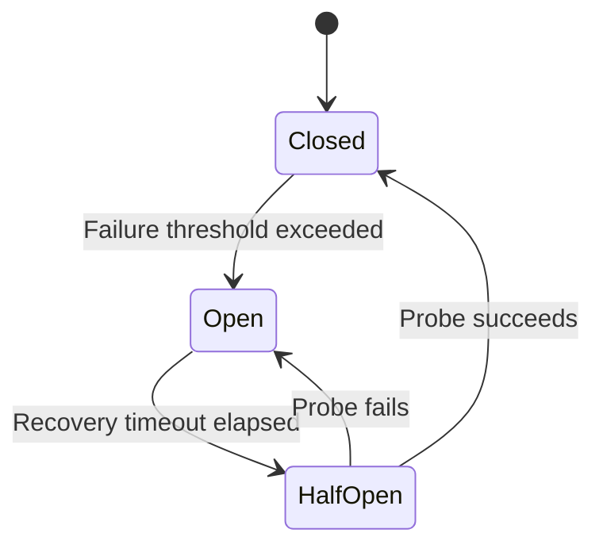
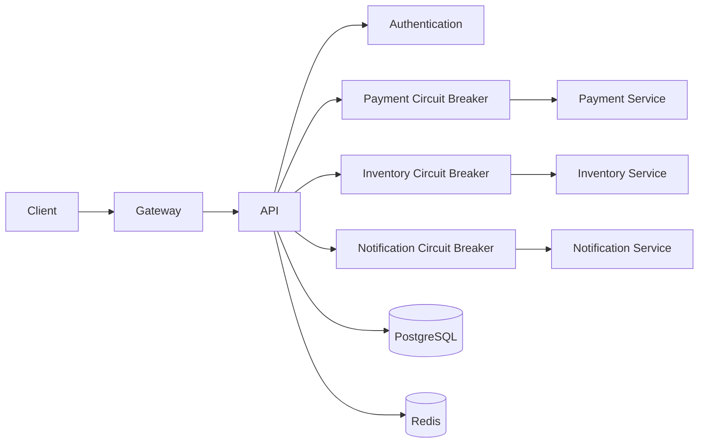

# 03- Circuit Breaker

## Overview

A circuit breaker is a resilience pattern that prevents an application from repeatedly calling a failing or overloaded dependency.

In a distributed system, a service rarely operates in isolation. A Django or FastAPI application may depend on PostgreSQL, Redis, another microservice, a payment provider, an authentication service, an external REST API, or a gRPC service.

When a dependency becomes unhealthy, continuing to send requests to it can turn a localized failure into a cascading failure:

```text
Service A
   |
   | requests
   v
Service B
   |
   X dependency failing
   |
   v
timeouts / errors
   |
   v
Service A workers blocked
   |
   v
thread / connection exhaustion
   |
   v
Service A becomes unhealthy
   |
   v
Services depending on A fail
```

A circuit breaker introduces a controlled failure boundary:

```text
Service A
   |
   v
Circuit Breaker
   |
   +---- CLOSED ----> Service B
   |
   +---- OPEN ------> Fail Fast
   |
   +---- HALF-OPEN -> Test Service B
```

The core idea is simple:

> When a dependency is demonstrably unhealthy, stop calling it temporarily and fail fast.

A circuit breaker does not make an unhealthy dependency healthy. It protects the caller and the rest of the system while the dependency recovers.

## Why Circuit Breakers Exist

Consider an API that calls a payment service.

Under normal conditions:

```text
API request
    |
    v
Payment Service
    |
    v
Response in 200 ms
```

Now suppose the payment service starts taking 30 seconds to respond.

If the API has 100 worker threads and every request waits for the payment service:

```text
100 requests
    |
    v
100 blocked workers
    |
    v
No workers available
    |
    v
Unrelated endpoints become slow
```

The failure has propagated beyond the payment dependency.

This is especially dangerous when clients retry:

```text
Client
  |
  v
Service A
  |
  v
Service B
  |
  X slow
  |
  v
Timeout
  |
  v
Client retries
  |
  v
Service A
  |
  v
Service B
```

Retries can multiply the traffic sent to an already unhealthy dependency.

A circuit breaker stops this feedback loop.

## What a Circuit Breaker Protects

Circuit breakers are primarily useful for protecting against:

- Repeated connection failures.
- Dependency timeouts.
- High error rates.
- Dependency overload.
- Network failures.
- Service crashes.
- Unavailable external APIs.
- gRPC connection failures.
- Slow downstream services.

They can protect:

- Application worker capacity.
- Connection pools.
- Thread pools.
- Async task capacity.
- Database connections.
- Network resources.
- Downstream services.
- Overall request latency.

## Circuit Breaker State Machine

A conventional circuit breaker has three states:

| State | Behavior |
|---|---|
| Closed | Requests flow normally |
| Open | Requests fail immediately without calling dependency |
| Half-Open | Limited requests test whether dependency recovered |

The state machine is:



### Closed

The circuit is operating normally.

Requests are allowed through:

```text
Caller
  |
  v
Circuit
  |
  v
Dependency
```

The circuit records relevant outcomes such as:

- Successful calls.
- Timeouts.
- Connection errors.
- Selected HTTP failures.
- Selected application-level failures.

If failures exceed the configured threshold, the circuit opens.

### Open

The circuit refuses calls immediately:

```text
Caller
  |
  v
Circuit
  |
  X
  |
  v
Fast failure
```

The dependency is not contacted.

This is the most important behavior of a circuit breaker.

Instead of:

```text
request → dependency → 30 second timeout
```

the caller gets:

```text
request → circuit → immediate failure
```

The circuit remains open for a configured recovery period.

### Half-Open

After the recovery timeout, the circuit allows a limited number of requests to test the dependency.

```text
Circuit
   |
   v
Half-Open
   |
   +---- Probe succeeds ----> Closed
   |
   +---- Probe fails -------> Open
```

The half-open state prevents an unhealthy dependency from receiving a full production traffic load immediately after the timeout.

## Failure Detection

A circuit breaker must define what counts as a failure.

Possible signals include:

- HTTP 5xx responses.
- Connection refused.
- Connection reset.
- DNS failures.
- Read timeouts.
- Connection timeouts.
- gRPC `UNAVAILABLE`.
- gRPC `DEADLINE_EXCEEDED`.

Not every error should trip the circuit.

For example:

```text
HTTP 400 → client error
HTTP 401 → authentication error
HTTP 404 → resource may not exist
HTTP 429 → dependency throttling
HTTP 500 → dependency failure
HTTP 503 → dependency unavailable
```

Whether `429` should count as a circuit failure depends on the architecture.

A dependency returning `400` because the caller sent invalid data should generally not be interpreted as evidence that the dependency itself is unhealthy.

## Failure Thresholds

A common beginner implementation is:

```text
Open circuit after 5 consecutive failures.
```

This can work in simple environments, but production systems often need more robust policies.

Possible policies include:

### Consecutive Failure Count

```text
5 failures in a row → Open
```

Advantages:

- Simple.
- Easy to implement.

Limitations:

- Sensitive to traffic patterns.
- A few failures can trip a low-volume service.
- Does not represent overall failure rate.

### Failure Percentage

For example:

```text
Minimum requests = 50
Failure rate > 50%
→ Open circuit
```

This is often more representative for high-volume services.

### Sliding Window

Evaluate recent outcomes:

```text
Last 100 requests:

Success: 40
Failure: 60

Failure rate = 60%
```

If the configured threshold is 50%, open the circuit.

A sliding window can be:

- Count-based.
- Time-based.

## Minimum Request Volume

Failure percentages are dangerous when the sample size is too small.

Suppose:

```text
1 request
1 failure
100% failure rate
```

Opening the circuit based on one failure is usually too aggressive.

Instead:

```text
Minimum sample = 50 requests
Failure threshold = 50%
```

This prevents statistical noise from causing unnecessary circuit transitions.

## Timeouts and Circuit Breakers

A circuit breaker does not replace timeouts.

They solve different problems.

### Timeout

Answers:

> How long should I wait for this individual request?

Example:

```text
Dependency timeout = 2 seconds
```

### Circuit Breaker

Answers:

> Should I continue sending requests to this dependency at all?

A resilient dependency call often looks like:

```text
Circuit Breaker
      |
      v
Timeout
      |
      v
Retry
      |
      v
Dependency
```

The exact ordering and retry policy depend on the system.

The important point is:

> Never use a circuit breaker as a substitute for a request timeout.

Without a timeout, the circuit may not receive failure signals quickly enough.

## Circuit Breaker and Retries

Retries and circuit breakers must be designed together.

A dangerous configuration is:

```text
Circuit Breaker
    |
    v
Retry 5 times
    |
    v
Dependency
```

If each attempt waits 5 seconds:

```text
5 attempts × 5 seconds = 25 seconds
```

A large number of concurrent requests can still consume significant resources before the circuit opens.

A better design uses:

- Short, explicit timeouts.
- Small retry counts.
- Exponential backoff.
- Jitter.
- Retry only transient failures.
- Circuit-breaking around the dependency call.

For example:

```text
Request
  |
  v
Circuit Breaker
  |
  v
Timeout: 1s
  |
  v
Retry: max 2
  |
  v
Dependency
```

The total retry budget must remain bounded.

## Circuit Breaker and Bulkheads

Circuit breakers and bulkheads solve different problems.

A circuit breaker prevents calls to an unhealthy dependency.

A bulkhead limits how many resources a dependency can consume.

For example:

```text
                    API
                     |
          ┌──────────┼──────────┐
          v          v          v
      Payments     Search     Notifications
          |          |             |
      CB + Pool   CB + Pool     CB + Pool
```

If the payment service becomes slow:

```text
Payment pool = 20 workers
```

Only the allocated capacity is consumed.

Search requests can continue using their own resources.

This is the bulkhead principle.

A production system often combines:

```text
Timeout
+
Circuit Breaker
+
Bulkhead
+
Carefully bounded Retry
```

## Circuit Breaker and Rate Limiting

Rate limiting controls traffic entering a system.

Circuit breaking controls traffic leaving a system toward an unhealthy dependency.

```text
Internet
   |
   v
Rate Limiter
   |
   v
Service A
   |
   v
Circuit Breaker
   |
   v
Service B
```

The two mechanisms complement each other.

| Pattern | Controls |
|---|---|
| Rate Limiter | Incoming request rate |
| Circuit Breaker | Calls to unhealthy dependencies |
| Bulkhead | Concurrent resource consumption |
| Timeout | Maximum wait duration |
| Retry | Recovery from transient failures |

## Circuit Breaker Architecture

A production service may look like:



Each dependency can have its own circuit.

This is preferable to one global circuit because dependency failures are independent.

If the notification service fails:

```text
Notification circuit → OPEN
```

but:

```text
Payment circuit → CLOSED
Inventory circuit → CLOSED
```

The application can continue processing operations that do not require notifications.

## Per-Dependency Circuit Breakers

A common mistake is to create one circuit breaker for an entire application.

Incorrect:

```text
Application
    |
Global Circuit
    |
All dependencies
```

If one dependency fails, unrelated operations can be blocked.

Prefer:

```text
Application
   |
   +── Payment Circuit
   |
   +── Inventory Circuit
   |
   +── Search Circuit
   |
   +── Email Circuit
```

Circuit state should generally correspond to a meaningful failure domain.

## Circuit Breaker Scope

The breaker can be scoped by:

- Dependency.
- Service.
- Endpoint.
- Region.
- Tenant.
- Operation.

Avoid excessive granularity.

For example:

```text
payment-service
```

may be a reasonable breaker scope.

Creating hundreds of independent breakers for every individual user can make monitoring and state management unnecessarily complex.

## Local vs Distributed Circuit State

Circuit breakers are commonly local to an application instance.

```text
App #1 → Local circuit
App #2 → Local circuit
App #3 → Local circuit
```

This is often desirable because circuit breaking is primarily about protecting each caller instance.

A distributed circuit state can introduce coordination overhead and additional failure modes.

### Local Circuit

Advantages:

- Fast.
- No network dependency.
- Simple.
- Failure isolation.

Limitation:

- Different instances may make different decisions.

For example:

```text
App #1 → OPEN
App #2 → CLOSED
App #3 → OPEN
```

This is not necessarily incorrect.

The instance that has observed the failures can stop calling the dependency while another instance may still test it.

### Distributed Circuit

A shared state can coordinate decisions:

```text
App #1 ──┐
App #2 ──┼──► Redis
App #3 ──┘
```

However, now Redis becomes part of the circuit-breaking decision path.

This can be unnecessary complexity unless the system has a strong requirement for globally coordinated behavior.

## Python Implementation

A circuit breaker can be represented using a small state machine.

```python
from __future__ import annotations

from dataclasses import dataclass
from enum import Enum
from time import monotonic
from typing import Callable, TypeVar


T = TypeVar("T")


class CircuitState(str, Enum):
    CLOSED = "closed"
    OPEN = "open"
    HALF_OPEN = "half_open"


class CircuitOpenError(RuntimeError):
    pass


@dataclass
class CircuitBreaker:
    failure_threshold: int = 5
    recovery_timeout: float = 30.0

    def __post_init__(self) -> None:
        self.state = CircuitState.CLOSED
        self.failure_count = 0
        self.opened_at: float | None = None

    def _transition_to_open(self) -> None:
        self.state = CircuitState.OPEN
        self.opened_at = monotonic()

    def _transition_to_closed(self) -> None:
        self.state = CircuitState.CLOSED
        self.failure_count = 0
        self.opened_at = None

    def _can_attempt(self) -> bool:
        if self.state == CircuitState.CLOSED:
            return True

        if self.state == CircuitState.OPEN:
            if self.opened_at is None:
                return False

            elapsed = monotonic() - self.opened_at

            if elapsed >= self.recovery_timeout:
                self.state = CircuitState.HALF_OPEN
                return True

            return False

        return True

    def call(self, operation: Callable[[], T]) -> T:
        if not self._can_attempt():
            raise CircuitOpenError("Circuit is open")

        try:
            result = operation()
        except Exception:
            self.failure_count += 1

            if self.failure_count >= self.failure_threshold:
                self._transition_to_open()

            raise
        else:
            self._transition_to_closed()
            return result
```

This implementation demonstrates the state machine but is not sufficient as-is for a high-concurrency production service.

A production implementation must consider:

- Thread safety.
- Async execution.
- Half-open probe concurrency.
- Failure classification.
- Sliding windows.
- Metrics.
- Logging.
- Configuration.
- Timeouts.
- Retry interaction.
- Process-level isolation.

## Async Circuit Breakers

FastAPI and asynchronous Python services require careful handling of concurrent requests.

A circuit breaker should not use blocking locks or synchronous operations that stall the event loop.

The half-open state is especially important.

If 1,000 requests arrive when the circuit becomes half-open, you usually do not want all 1,000 requests to probe the dependency simultaneously.

Instead:

```text
OPEN
 |
 | timeout elapsed
 v
HALF-OPEN
 |
 +---- one or small number of probes
 |
 +---- success → CLOSED
 |
 +---- failure → OPEN
```

This prevents a recovering dependency from being overwhelmed by a sudden flood.

## Half-Open Probe Control

Consider:

```text
Dependency was unavailable
       |
       v
Circuit OPEN
       |
       v
Recovery timeout
       |
       v
HALF-OPEN
       |
       v
1,000 concurrent requests arrive
```

Without coordination:

```text
1,000 probes → dependency
```

With controlled probing:

```text
1 probe → dependency
999 requests → fail fast / wait according to policy
```

This is an important production consideration.

## Fallbacks

When the circuit is open, the caller may have a fallback.

Examples:

```text
Product recommendations unavailable
        ↓
Return cached recommendations
```

```text
Notification service unavailable
        ↓
Publish event to durable queue
```

```text
Inventory service unavailable
        ↓
Return "inventory temporarily unavailable"
```

Fallbacks should be carefully designed.

A fallback must not silently return incorrect business data.

For example, returning stale inventory availability for a purchase operation can cause overselling.

### Safe vs Unsafe Fallbacks

| Operation | Potential Fallback |
|---|---|
| Product recommendations | Cached results |
| Analytics | Queue for later |
| Email | Durable queue |
| Search | Cached/popular results |
| Payment authorization | Usually fail safely |
| Inventory reservation | Usually fail safely |
| Authentication | Usually fail safely |

The business semantics determine whether a fallback is safe.

## Circuit Breaker with Kafka or SQS

For asynchronous work, a circuit breaker can prevent workers from repeatedly calling an unhealthy dependency.

```text
Kafka / SQS
    |
    v
Worker
    |
    v
Circuit Breaker
    |
    v
External API
```

When the dependency is unavailable:

```text
Worker
   |
   v
Circuit OPEN
   |
   +---- Retry later
   |
   +---- Delay message
   |
   +---- Dead-letter after policy
```

This can be combined with:

- Exponential backoff.
- Visibility timeouts.
- Retry topics.
- Dead-letter queues.
- Message attempt counters.

Do not continuously consume and immediately requeue a message while the circuit is open. That can create a hot retry loop.

## HTTP Status Handling

Circuit breakers should classify errors carefully.

A typical policy might look like:

| Result | Circuit Failure? | Reason |
|---|---:|---|
| HTTP 200 | No | Success |
| HTTP 400 | Usually no | Caller error |
| HTTP 401 | Usually no | Authentication issue |
| HTTP 403 | Usually no | Authorization issue |
| HTTP 404 | Usually no | Resource may not exist |
| HTTP 408 | Often yes | Timeout |
| HTTP 429 | Depends | Could indicate dependency overload |
| HTTP 500 | Usually yes | Server failure |
| HTTP 502 | Usually yes | Gateway/dependency failure |
| HTTP 503 | Usually yes | Service unavailable |
| HTTP 504 | Usually yes | Gateway timeout |

The policy should be based on the semantics of the dependency rather than blindly counting every non-2xx response.

## gRPC Circuit Breaking

gRPC provides structured status codes that can be classified for resilience.

Examples:

```text
UNAVAILABLE
DEADLINE_EXCEEDED
RESOURCE_EXHAUSTED
INTERNAL
```

A typical policy may treat:

```text
UNAVAILABLE
DEADLINE_EXCEEDED
```

as strong signals of dependency failure.

But:

```text
INVALID_ARGUMENT
NOT_FOUND
PERMISSION_DENIED
```

normally should not trip a dependency health circuit.

The exact policy depends on the service contract.

## Circuit Breaker and Service Discovery

In Kubernetes or AWS environments, service endpoints can change.

A circuit breaker should not permanently associate failure with a specific IP address if service discovery can route requests elsewhere.

For example:

```text
service-a
   |
   v
Kubernetes Service
   |
   +---- Pod 1
   +---- Pod 2
   +---- Pod 3
```

If only Pod 1 is unhealthy, a circuit breaker scoped to the entire service may hide healthy capacity.

At higher levels of infrastructure, load balancers and service meshes may already provide endpoint-level health handling.

The system should avoid overlapping resilience mechanisms without understanding their scopes.

## Circuit Breakers and Service Meshes

In Kubernetes, resilience can be implemented at the application layer or infrastructure layer.

```text
Application
    |
    v
Sidecar / Proxy
    |
    v
Service
```

A service mesh can provide:

- Traffic policies.
- Timeouts.
- Retries.
- Outlier detection.
- Circuit breaking.
- Load balancing.

Advantages:

- Centralized infrastructure policy.
- Consistent behavior.
- Less application code.

Application-level circuit breaking remains useful when the failure policy depends on business semantics.

For example:

```text
Payment authorization
```

requires different behavior from:

```text
Product recommendations
```

A proxy cannot always understand those business consequences.

## Cascading Failures

Circuit breakers are primarily a **cascading failure containment** mechanism.

Consider:

```text
                  ┌──────────────┐
                  │ API Gateway  │
                  └──────┬───────┘
                         |
                         v
                    Order Service
                    /           \
                   v             v
             Inventory       Payment
                 |               |
                 X               X
              failing          slow
```

Without circuit breakers:

```text
Order Service
   |
   +---- waits for Inventory
   |
   +---- waits for Payment
   |
   v
Worker exhaustion
```

With circuit breakers:

```text
Order Service
   |
   +---- Inventory → OPEN → Fast failure
   |
   +---- Payment → OPEN → Fast failure
```

The order service can degrade gracefully according to business rules instead of consuming all resources waiting for unavailable dependencies.

## Circuit Breaker Placement

The circuit should generally wrap the dependency operation.

Conceptually:

```text
Business Logic
      |
      v
Circuit Breaker
      |
      v
Timeout
      |
      v
Retry Policy
      |
      v
HTTP/gRPC Client
      |
      v
Dependency
```

However, retry placement requires careful thought.

For example:

```text
Circuit
   |
   +-- Retry
         |
         +-- Attempt 1
         +-- Attempt 2
```

means one logical call can produce multiple dependency calls.

The circuit's metrics should clearly distinguish:

- Logical operations.
- Individual attempts.

## Configuration

Circuit-breaker configuration should be explicit and environment-specific.

Example:

```yaml
dependencies:
  payment_service:
    timeout_seconds: 2
    retry_attempts: 2
    circuit:
      minimum_requests: 50
      failure_rate_threshold: 0.5
      open_duration_seconds: 30
      half_open_max_probes: 1

  inventory_service:
    timeout_seconds: 1
    retry_attempts: 1
    circuit:
      minimum_requests: 100
      failure_rate_threshold: 0.4
      open_duration_seconds: 15
      half_open_max_probes: 2
```

Avoid blindly copying the same settings to every dependency.

The correct values depend on:

- Dependency latency.
- Dependency capacity.
- Business criticality.
- Traffic volume.
- Recovery time.
- Retry behavior.
- Cost of failure.

## Monitoring

Circuit breakers require explicit observability.

Track:

- Current state.
- State transitions.
- Failure rate.
- Success rate.
- Dependency latency.
- Timeout rate.
- Rejected calls.
- Half-open probes.
- Retry counts.
- Fallback usage.

Useful metrics include:

```text
circuit_breaker_state
circuit_breaker_open_total
circuit_breaker_half_open_total
circuit_breaker_rejected_total
dependency_request_duration_seconds
dependency_timeout_total
dependency_failure_total
fallback_total
```

A particularly important alert is:

```text
Circuit remains OPEN for an unexpectedly long period
```

This can indicate a real dependency outage.

Another important metric is:

```text
Circuit OPEN transitions per dependency
```

A sudden increase can identify a failing service before users report widespread problems.

## Logging

State transitions should generally be logged:

```text
payment_service circuit:
CLOSED → OPEN
reason=high_failure_rate
failure_rate=0.73
threshold=0.50
```

When transitioning back:

```text
payment_service circuit:
HALF_OPEN → CLOSED
probe_success=true
```

Avoid logging every rejected request individually at high traffic volume.

Use metrics for high-cardinality aggregate visibility and logs for meaningful state transitions.

## Security Considerations

Circuit breakers are not security controls, but they influence security and availability.

Potential concerns include:

### Malicious Failure Induction

An attacker may intentionally cause dependency calls to fail in order to trigger a circuit.

For example:

```text
attacker
   |
   v
crafted requests
   |
   v
dependency failures
   |
   v
circuit opens
```

Mitigations include:

- Authentication.
- Authorization.
- Input validation.
- Rate limiting.
- Resource quotas.
- Dependency isolation.
- Careful failure classification.

### Sensitive Fallback Data

Fallbacks must not accidentally expose:

- Stale private information.
- Data belonging to another tenant.
- Internal error details.
- Authorization-sensitive cached responses.

Fallback paths must enforce the same security boundaries as normal paths.

## High Availability

Circuit breakers improve availability by preventing unhealthy dependencies from consuming all caller resources.

However, incorrect configuration can reduce availability.

For example:

```text
Failure threshold = 1
```

can cause frequent false-positive opens.

Likewise:

```text
Open duration = 1 hour
```

may keep a recovered dependency inaccessible for too long.

The circuit should be tuned using production observations.

## Recovery Behavior

A circuit breaker should recover gradually.

A useful recovery sequence is:

```text
Dependency fails
      |
      v
Circuit OPEN
      |
      | recovery timeout
      v
Circuit HALF-OPEN
      |
      v
Small probe
      |
   success?
    /    \
  yes     no
  |        |
  v        v
Closed    Open
```

For high-traffic services, consider allowing a small number of probes rather than immediately allowing all traffic.

This is especially important after an outage where thousands of callers may simultaneously detect recovery.

## Disaster Recovery

Circuit breakers help with transient and ongoing dependency failures, but they are not a disaster-recovery mechanism.

For critical dependencies, consider:

- Multi-AZ deployment.
- Multi-region deployment where justified.
- Failover.
- Replication.
- Durable queues.
- Backups.
- Alternative providers.
- Graceful degradation.

The circuit breaker sits inside the broader resilience strategy.

```text
                Resilience
                    |
       ┌────────────┼────────────┐
       v            v            v
   Timeouts     Circuit       Bulkheads
                 Breakers
       |
       +---- Retries
       |
       +---- Queues
       |
       +---- Failover
       |
       +---- Graceful Degradation
```

## Common Mistakes and Pitfalls

| Mistake | Why It Happens | Better Approach |
|---|---|---|
| No timeout | Assuming dependency calls always return | Always define bounded timeouts |
| Circuit on every exception | Simplifies implementation | Classify failures |
| Opening after one failure | Easy threshold | Use minimum sample volume |
| No half-open state | Simpler state machine | Probe recovery safely |
| Unlimited half-open probes | Concurrency overlooked | Limit probe count |
| One global circuit | Easy architecture | Use per-dependency failure domains |
| Circuit breaker without metrics | Pattern treated as invisible infrastructure | Monitor state and transitions |
| Aggressive retries | Assuming retries improve reliability | Bound retries and use backoff |
| Retry + breaker configured independently | Teams own different mechanisms | Design them as one resilience policy |
| Returning stale data blindly | Fallback seems convenient | Verify business safety |
| Distributed circuit state everywhere | Assumed consistency is always better | Prefer local state unless global coordination is required |
| Circuit opens on 4xx errors | Counts all failures equally | Distinguish caller errors from dependency failures |
| Very long open timeout | Avoiding repeated calls | Allow controlled recovery probes |
| No bulkhead | Circuit protects only after failure detection | Isolate dependency resources |
| Requeueing messages immediately | Trying to retry failed work | Use delayed retry/backoff/DLQ policies |

## Interview Traps

### Does a Circuit Breaker Stop All Failures?

No.

It prevents repeated calls after failure conditions cross configured thresholds.

A request can still fail while the circuit is closed.

### Does It Replace Retries?

No.

Retries can recover from transient failures.

Circuit breakers prevent repeated calls when failures persist.

They should be designed together.

### Does It Replace Timeouts?

No.

Timeouts determine how long an individual operation waits.

Circuit breakers determine whether future operations should be attempted.

### Why Is Half-Open Necessary?

Without half-open:

```text
OPEN → wait → CLOSED
```

could immediately send full production traffic to a dependency that has not actually recovered.

Half-open provides controlled probing.

### Should Circuit State Be Stored in Redis?

Not necessarily.

Local state is often sufficient and faster.

Distributed state is useful only when globally coordinated decisions are genuinely required.

### What If the Dependency Is Slow but Not Returning Errors?

This is a critical case.

A circuit breaker based only on error counts may not detect the problem.

Use:

```text
Timeouts
+
Latency monitoring
+
Failure classification
+
Circuit policies that account for timeouts
```

Timeouts often become the failure signal.

### Can Circuit Breakers Cause Outages?

Yes.

Incorrect thresholds can open circuits unnecessarily.

For example:

```text
Traffic = 10 req/min
Failures = 1
Failure rate = 10%
```

A poorly configured circuit could interpret normal statistical variation as dependency failure.

Minimum request volume and sensible thresholds are important.

## Production Design Checklist

### Dependency Protection

- [ ] Every remote dependency has an explicit timeout.
- [ ] Critical dependencies have circuit-breaking where appropriate.
- [ ] Failure classification is documented.
- [ ] Retry policies are bounded.
- [ ] Backoff and jitter are used where retries are appropriate.
- [ ] Dependency-specific limits are configured.

### Circuit Configuration

- [ ] Closed/open/half-open states are implemented correctly.
- [ ] Minimum request volume is defined.
- [ ] Failure threshold is based on actual traffic.
- [ ] Recovery timeout is configurable.
- [ ] Half-open probe concurrency is bounded.
- [ ] Circuit scope matches the dependency failure domain.

### Resource Isolation

- [ ] Expensive dependencies have bulkheads where necessary.
- [ ] Connection pools are bounded.
- [ ] Worker pools are bounded.
- [ ] One dependency cannot exhaust all application capacity.

### Fallbacks

- [ ] Fallback behavior is explicitly defined.
- [ ] Fallbacks are safe for the business operation.
- [ ] Cached data respects authorization and tenancy.
- [ ] Critical operations fail safely rather than silently succeeding.

### Observability

- [ ] Circuit state is measurable.
- [ ] State transitions are logged.
- [ ] Rejected calls are counted.
- [ ] Dependency latency is monitored.
- [ ] Timeout rates are monitored.
- [ ] Retry counts are monitored.
- [ ] Fallback usage is monitored.
- [ ] Alerts exist for prolonged OPEN states.

### Testing

- [ ] Dependency timeout behavior is tested.
- [ ] Connection failures are tested.
- [ ] High error-rate behavior is tested.
- [ ] Half-open recovery is tested.
- [ ] Concurrent half-open probes are tested.
- [ ] Retry storms are tested.
- [ ] Dependency recovery under load is tested.
- [ ] Fallback behavior is tested.

## Key Takeaways

- **A circuit breaker contains cascading failures by stopping calls to an unhealthy dependency and failing fast instead of allowing repeated timeouts and resource exhaustion.**
- **The three core states are CLOSED, OPEN, and HALF-OPEN; controlled half-open probing is essential for safe recovery.**
- **Circuit breakers complement, rather than replace, timeouts, bounded retries, backoff, rate limiting, and bulkheads.**
- **Production breakers must classify failures correctly, use dependency-specific thresholds, control half-open concurrency, and expose state transitions and rejection metrics.**
- **The strongest circuit-breaker designs are part of a broader resilience strategy that includes graceful degradation, queues, resource isolation, failover, and carefully defined business fallbacks.**