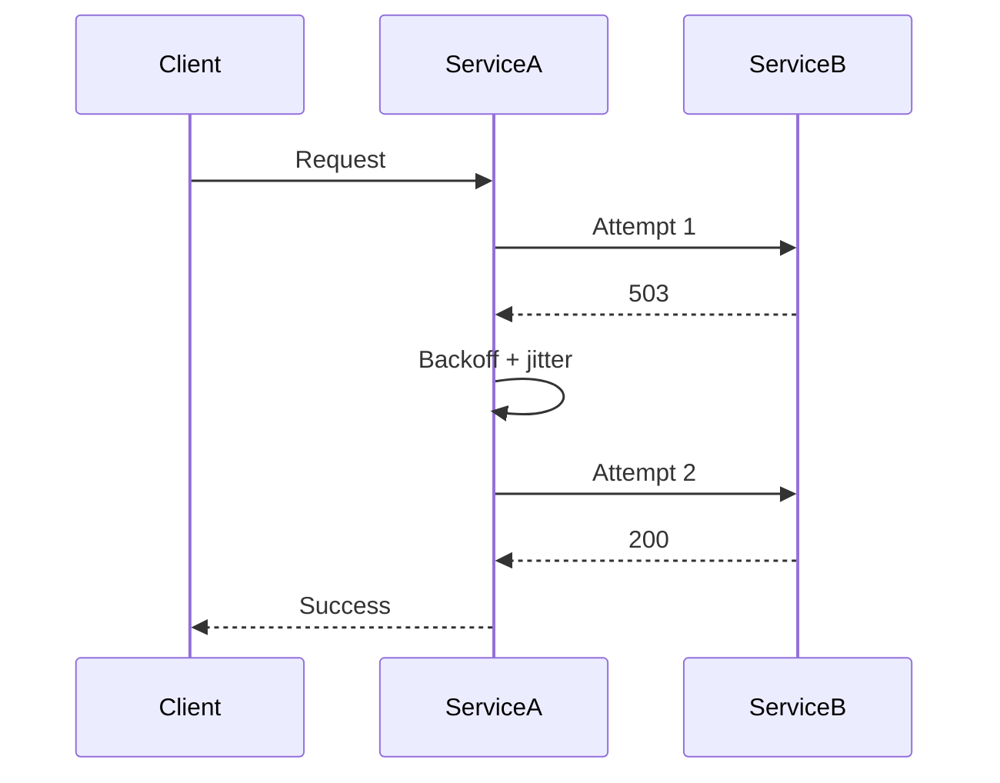

# 04- Retry Pattern

## Overview

The Retry Pattern is a resilience mechanism in which a system automatically attempts a failed operation again when the failure is likely to be transient.

Distributed systems routinely encounter temporary failures:

- Network connection resets.
- DNS resolution failures.
- Short-lived service overload.
- Database connection failures.
- HTTP `502`, `503`, or `504` responses.
- gRPC `UNAVAILABLE` or `DEADLINE_EXCEEDED`.
- Temporary cloud-service throttling.
- Leader elections or brief infrastructure transitions.

A retry can turn:

```text
Request → Temporary failure → Error
```

into:

```text
Request → Temporary failure → Retry → Success
```

However, retries are not inherently beneficial. An incorrectly designed retry mechanism can amplify an outage:

```text
Dependency becomes slow
        |
        v
Requests timeout
        |
        v
Clients retry
        |
        v
Traffic increases
        |
        v
Dependency becomes slower
        |
        v
More timeouts
        |
        v
More retries
```

This creates a **retry storm**.

Production retry design therefore requires more than choosing a retry count. It requires decisions about:

- Which failures are retryable.
- How many attempts are allowed.
- How long to wait between attempts.
- Whether exponential backoff is required.
- Whether jitter is required.
- Whether the operation is idempotent.
- How retries interact with timeouts.
- How retries interact with circuit breakers.
- How retries affect downstream capacity.
- When to stop retrying and move to a queue, fallback, or dead-letter path.

## Why Retries Exist

Remote operations fail for reasons that may disappear immediately.

For example:

```text
Service A → Service B
             |
             X temporary network failure
```

If Service B is healthy again 100 ms later, returning an error immediately may unnecessarily reduce availability.

A bounded retry gives the system another opportunity:

```text
Attempt 1
   |
   X transient failure
   |
   v
Backoff
   |
   v
Attempt 2
   |
   ✓ success
```

Retries are particularly effective when failures are:

- Short-lived.
- Intermittent.
- Explicitly classified as transient.
- Cheap to repeat.
- Safe to repeat.

They are much less useful when the failure is deterministic:

```text
HTTP 400
Invalid SQL
Invalid credentials
Missing resource
Permission denied
```

Repeating these requests generally produces the same failure.

## What a Retry Operation Actually Means

A retry is not simply:

```python
for _ in range(3):
    call()
```

A production retry policy is closer to:

```text
operation
    |
    v
classify result
    |
    +---- success --------------------> return
    |
    +---- non-retryable failure ------> fail
    |
    +---- retryable failure
              |
              v
        retry budget?
              |
        +-----+-----+
        |           |
       no          yes
        |           |
        v           v
       fail       backoff
                    |
                    v
                  retry
```

The retry mechanism needs an explicit policy.

## When to Use Retries

Retries are appropriate when the failure is plausibly transient.

Good candidates include:

| Failure | Usually Retryable? | Notes |
|---|---:|---|
| Connection reset | Yes | Often transient |
| Connection timeout | Yes | With bounded attempts |
| Read timeout | Often | Depends on operation semantics |
| HTTP 502 | Yes | Usually transient |
| HTTP 503 | Yes | Service unavailable |
| HTTP 504 | Yes | Gateway timeout |
| HTTP 429 | Yes | Respect `Retry-After` when available |
| gRPC `UNAVAILABLE` | Yes | Common transient failure |
| gRPC `DEADLINE_EXCEEDED` | Sometimes | Check operation semantics |
| HTTP 400 | No | Usually caller error |
| HTTP 401 | No | Fix authentication |
| HTTP 403 | No | Authorization issue |
| HTTP 404 | Usually no | Usually deterministic |
| Invalid request | No | Retrying does not fix input |
| Unique constraint violation | No | Usually deterministic |

The classification must ultimately be defined by the dependency contract.

## When Not to Retry

Retries should not be used to hide deterministic failures.

For example:

```text
POST /payments
HTTP 400
```

Retrying the request three times does not make an invalid payment request valid.

Similarly:

```text
HTTP 401
```

should generally trigger authentication handling, not repeated requests.

Avoid retries for:

- Invalid input.
- Authentication failures.
- Authorization failures.
- Malformed requests.
- Unsupported operations.
- Known business-rule failures.
- Permanent configuration errors.
- Schema incompatibility.
- Resource-not-found errors unless the resource may be created asynchronously.

A retry policy should answer:

> What evidence do we have that trying the same operation later has a reasonable chance of succeeding?

## Retry Lifecycle

A typical synchronous request lifecycle is:



The retry policy sits around the remote operation.

```text
Business Logic
      |
      v
Retry Policy
      |
      v
Timeout
      |
      v
HTTP / gRPC Client
      |
      v
Dependency
```

The exact ordering can vary by architecture, but timeout and retry budgets must be designed together.

## Retry Count

The retry count should be bounded.

For example:

```text
Maximum attempts = 3
```

could mean:

```text
Attempt 1 = original request
Attempt 2 = retry
Attempt 3 = retry
```

Therefore:

```text
Maximum retries = 2
```

Do not confuse:

- Maximum attempts.
- Maximum retries.

This distinction matters when calculating load and latency.

### Why Unlimited Retries Are Dangerous

Consider:

```text
100 requests/sec
```

If every request retries indefinitely against an unavailable dependency:

```text
100 req/s
→ timeout
→ retry
→ timeout
→ retry
→ ...
```

The caller itself becomes a source of unbounded load.

Retries must always have a termination condition.

## Exponential Backoff

A common retry strategy is exponential backoff.

Instead of retrying immediately:

```text
Attempt 1 → fail
Attempt 2 → immediately
Attempt 3 → immediately
```

wait increasingly longer:

```text
Attempt 1 → fail
      |
      | 100 ms
      v
Attempt 2 → fail
      |
      | 200 ms
      v
Attempt 3 → fail
```

A common formula is:

```text
delay = min(cap, base × 2^attempt)
```

For example:

```text
base = 100 ms
cap  = 5 seconds
```

could produce:

| Retry | Calculated Delay |
|---:|---:|
| 1 | 100 ms |
| 2 | 200 ms |
| 3 | 400 ms |
| 4 | 800 ms |
| 5 | 1.6 s |
| 6 | 3.2 s |
| 7 | 5 s |

The cap prevents the delay from growing indefinitely.

## Why Exponential Backoff Matters

Without backoff, many clients retry simultaneously:

```text
Dependency failure
      |
      +── Client A → retry immediately
      +── Client B → retry immediately
      +── Client C → retry immediately
      +── Client D → retry immediately
      +── ...
```

This can create a synchronized retry wave.

Backoff spreads attempts over time.

It also gives the dependency time to recover.

## Jitter

Exponential backoff alone does not fully solve synchronized retries.

Suppose 10,000 clients all use:

```text
100 ms
200 ms
400 ms
800 ms
```

If they all fail at the same time, they can still retry at nearly identical times.

**Jitter** introduces randomness.

Instead of:

```text
delay = 400 ms
```

use something like:

```text
delay = random(0, 400 ms)
```

or another bounded jitter strategy.

This spreads retries across time.

## Jitter Strategies

Common approaches include:

| Strategy | Behavior |
|---|---|
| Full jitter | Random value between zero and calculated exponential delay |
| Equal jitter | Fixed portion plus random portion |
| Decorrelated jitter | Next delay depends on previous delay and randomization |

Full jitter is simple and effective for many workloads:

```text
exponential_delay = min(cap, base × 2^attempt)
actual_delay = random(0, exponential_delay)
```

The goal is not mathematical perfection.

The goal is to avoid large numbers of clients retrying simultaneously.

## Python Retry Example

A simple production-oriented retry helper can be implemented with bounded exponential backoff and jitter.

```python
from __future__ import annotations

import random
import time
from collections.abc import Callable
from typing import TypeVar


T = TypeVar("T")


class RetryExhaustedError(RuntimeError):
    """Raised when all retry attempts are exhausted."""


def retry(
    operation: Callable[[], T],
    *,
    max_attempts: int = 3,
    base_delay: float = 0.1,
    max_delay: float = 5.0,
    retryable: Callable[[Exception], bool],
) -> T:
    if max_attempts < 1:
        raise ValueError("max_attempts must be at least 1")

    for attempt in range(max_attempts):
        try:
            return operation()
        except Exception as exc:
            if not retryable(exc):
                raise

            if attempt == max_attempts - 1:
                raise RetryExhaustedError(
                    f"Operation failed after {max_attempts} attempts"
                ) from exc

            exponential_delay = min(
                max_delay,
                base_delay * (2**attempt),
            )
            delay = random.uniform(0, exponential_delay)
            time.sleep(delay)

    raise AssertionError("Unreachable")
```

The important design properties are:

- Explicit maximum attempts.
- Retry classification.
- Exponential backoff.
- Maximum backoff cap.
- Random jitter.
- Immediate propagation of non-retryable failures.

For asynchronous applications, use an async sleep rather than blocking the event loop.

## Async Python Retry

For FastAPI or other asyncio-based services:

```python
from __future__ import annotations

import asyncio
import random
from collections.abc import Awaitable, Callable
from typing import TypeVar


T = TypeVar("T")


async def retry_async(
    operation: Callable[[], Awaitable[T]],
    *,
    max_attempts: int = 3,
    base_delay: float = 0.1,
    max_delay: float = 5.0,
    retryable: Callable[[Exception], bool],
) -> T:
    for attempt in range(max_attempts):
        try:
            return await operation()
        except Exception as exc:
            if not retryable(exc):
                raise

            if attempt == max_attempts - 1:
                raise

            exponential_delay = min(
                max_delay,
                base_delay * (2**attempt),
            )
            delay = random.uniform(0, exponential_delay)

            await asyncio.sleep(delay)

    raise AssertionError("Unreachable")
```

Do not use:

```python
time.sleep(...)
```

inside an async request handler because it blocks the event loop.

## Retry Budgets

Retry count alone is not enough.

A service may have:

```text
Maximum retries = 3
```

but if each attempt takes several seconds, the total request can become unacceptably slow.

A better model includes a **time budget**.

For example:

```text
Request deadline = 2 seconds

Attempt 1
  timeout = 800 ms

Backoff
  <= 100 ms

Attempt 2
  remaining budget

Attempt 3
  only if enough time remains
```

The retry mechanism should not retry when the remaining request deadline cannot support a meaningful attempt.

This is especially important for gRPC and distributed systems with propagated deadlines.

## Timeout Budget

Suppose:

```text
Client timeout = 5 seconds
Service A timeout = 4 seconds
Service B timeout = 3 seconds
```

If Service A retries Service B three times, the total operation can exceed the client's deadline.

A senior-level design treats time as a budget:

```text
End-to-end deadline
        |
        +── network
        +── application processing
        +── dependency attempt 1
        +── backoff
        +── dependency attempt 2
        +── response
```

Every layer must respect the upper-level deadline.

## Retry Amplification

Retries increase downstream traffic.

Suppose:

```text
Incoming traffic = 1,000 requests/sec
```

and each request can make:

```text
Maximum attempts = 3
```

In the worst case:

```text
1,000 × 3 = 3,000 attempts/sec
```

The dependency can receive up to three times the original traffic.

If multiple services retry the same dependency, amplification compounds.

For example:

```text
API Gateway
   |
   | retry × 3
   v
Service A
   |
   | retry × 3
   v
Service B
```

One logical request can result in:

```text
3 × 3 = 9
```

attempts against Service B.

This is one of the most important retry design considerations in distributed systems.

## Avoid Retry Multiplication

Retries should usually be owned by a clearly defined layer.

For example:

```text
Client
   |
   v
API
   |
   v
Service A
   |
   v
Service B
```

If both Service A and the HTTP client library automatically retry, the actual attempt count may become difficult to predict.

Prefer:

```text
One logical retry policy
        |
        v
Dependency call
```

or explicitly document layered retry budgets.

Avoid:

```text
Client retry ×
Gateway retry ×
Application retry ×
SDK retry ×
Service mesh retry
```

unless the resulting attempt multiplication is intentional and bounded.

## Idempotency

Retries create a fundamental correctness problem:

> What happens if the first attempt succeeds, but the response is lost?

Consider:

```text
Client
   |
   v
POST /payments
   |
   v
Payment Service
   |
   ✓ payment created
   |
   X response lost
```

The client sees a timeout:

```text
Client → timeout
```

It retries:

```text
Client
   |
   v
POST /payments
   |
   v
Payment Service
```

Without idempotency, two payments may be created.

Therefore:

```text
Retry + non-idempotent operation
```

requires special care.

Use idempotency keys for operations where duplicate execution is dangerous.

For example:

```http
POST /payments
Idempotency-Key: 9f5d1c8c-7d18-4a92-8c4e-example
```

The server can persist the result associated with the key.

## Safe Retry Matrix

| Operation | Retry Safety |
|---|---|
| GET | Usually safe |
| HEAD | Usually safe |
| PUT | Often idempotent if correctly implemented |
| DELETE | Often idempotent semantically |
| POST | Not inherently idempotent |
| Payment creation | Requires idempotency design |
| Email send | Requires duplicate-send consideration |
| Job submission | Requires deduplication strategy |

HTTP method semantics help, but they do not guarantee application-level idempotency.

A `POST` can be made safely retryable with an idempotency mechanism.

## Retry and Circuit Breaker

Retries and circuit breakers complement each other.

```text
Request
   |
   v
Circuit Breaker
   |
   +---- OPEN → fail fast
   |
   v
Retry Policy
   |
   v
Timeout
   |
   v
Dependency
```

A useful mental model is:

- **Timeout** limits how long one attempt waits.
- **Retry** gives transient failures another chance.
- **Backoff** spaces attempts apart.
- **Circuit breaker** stops attempts when the dependency remains unhealthy.

Without a circuit breaker:

```text
Retry → retry → retry → retry → ...
```

can continue across many requests.

With a circuit breaker:

```text
Failure rate increases
        |
        v
Circuit opens
        |
        v
Requests fail fast
```

## Retry and Rate Limiting

Rate limiting protects a service from excessive traffic.

Retries can bypass the intent of a rate limit if every failed request generates additional attempts.

For example:

```text
100 requests/sec
```

can become:

```text
300 attempts/sec
```

with two retries.

Therefore retry policies should be included when capacity is calculated.

If a dependency advertises:

```text
100 requests/sec
```

do not assume:

```text
100 incoming requests/sec
```

is safe when each request may retry.

The effective attempt rate matters.

## HTTP `Retry-After`

When a server returns:

```http
HTTP/1.1 429 Too Many Requests
Retry-After: 5
```

the client should generally respect the server's retry guidance when appropriate.

Similarly, a `503 Service Unavailable` response may include retry information.

A retry policy should not blindly ignore server-provided signals.

## Retry with Kafka

Retries in asynchronous systems are often implemented using retry topics rather than blocking the consumer.

Example:

```text
orders
   |
   v
Consumer
   |
   X transient failure
   |
   v
orders.retry.1
   |
   | delay
   v
orders.retry.2
   |
   | delay
   v
orders
```

This avoids keeping a consumer blocked while waiting.

A production architecture may use:

```text
Main Topic
   |
   v
Consumer
   |
   +---- success → complete
   |
   +---- transient failure → retry topic
   |
   +---- permanent failure → DLQ
```

Retry topics are particularly useful when the operation may take seconds or minutes to recover.

## Retry with Amazon SQS

SQS provides retry behavior through message visibility.

A common flow is:

```text
SQS
 |
 v
Worker
 |
 X failure
 |
 v
Message becomes visible again
 |
 v
Worker retries
```

The visibility timeout should be long enough to prevent another worker from processing the message while the current worker is still working.

For repeated failures, configure a redrive policy:

```text
Source Queue
     |
     | maxReceiveCount
     v
Dead-Letter Queue
```

Do not implement an unbounded immediate requeue loop.

## Retry with Celery

Celery provides task retry capabilities.

A task can explicitly retry a transient failure:

```python
from celery import shared_task


@shared_task(
    autoretry_for=(ConnectionError,),
    retry_backoff=True,
    retry_backoff_max=300,
    retry_jitter=True,
    max_retries=5,
)
def synchronize_customer(customer_id: int) -> None:
    synchronize_customer_with_remote_service(customer_id)
```

Important production considerations include:

- Maximum retry count.
- Backoff.
- Jitter.
- Task idempotency.
- Broker visibility/acknowledgment behavior.
- Dead-letter handling.
- Task execution time.
- Duplicate execution.

Celery retries do not automatically make a task idempotent.

## Retry and Databases

Retries against databases require care.

Transient failures can include:

- Connection resets.
- Serialization failures.
- Deadlocks.
- Temporary unavailable connections.

However, blindly retrying every database exception can hide programming errors.

For example:

```text
IntegrityError
```

may indicate a deterministic business or schema violation rather than a transient failure.

Database retries should be narrowly classified.

### Deadlocks

Some databases can abort transactions due to deadlocks.

A retry can be appropriate because the transaction may succeed when executed again.

The transaction must be retried as a complete unit:

```text
BEGIN
  |
  v
SQL operations
  |
  X deadlock
  |
  v
ROLLBACK
  |
  v
Retry complete transaction
```

Do not retry individual statements outside the correct transactional boundary.

## Retry and Transactions

Suppose:

```text
BEGIN
UPDATE account
INSERT transaction
COMMIT
```

If the application receives a network error after sending `COMMIT`, it may not know whether the transaction committed.

Retrying blindly can create duplicate effects.

The correct strategy depends on:

- Transaction semantics.
- Unique constraints.
- Idempotency keys.
- Transaction identifiers.
- Database guarantees.

A retry policy must understand the difference between:

```text
operation definitely failed
```

and:

```text
operation outcome is unknown
```

The second case is significantly harder.

## Unknown Outcome

A network timeout does not always mean the operation failed.

Consider:

```text
Client
   |
   | request
   v
Server
   |
   | operation succeeds
   v
Database
   |
   X response lost
   |
   v
Client timeout
```

The client cannot distinguish:

```text
operation failed
```

from:

```text
operation succeeded but response was lost
```

This is why retries can cause duplicates.

Solutions may include:

- Idempotency keys.
- Request IDs.
- Deduplication tables.
- Unique constraints.
- Transaction IDs.
- Querying operation status.
- Idempotent APIs.

## Retry and Distributed Transactions

Retries become especially difficult when an operation spans multiple services.

For example:

```text
Order Service
    |
    +---- Inventory
    |
    +---- Payment
    |
    +---- Shipping
```

If payment succeeds but the response is lost:

```text
Payment = SUCCESS
Caller = TIMEOUT
```

blindly retrying payment may create a duplicate charge.

At this level, retry design should be combined with:

- Idempotency.
- Saga patterns.
- Durable events.
- State machines.
- Compensation.
- Exactly-once business semantics where achievable.

## Retry Policies by Dependency

Different dependencies should have different retry policies.

```text
Payment
    timeout = 2s
    retries = 1

Search
    timeout = 500ms
    retries = 2

Analytics
    timeout = 1s
    retries = 3

Notification
    async queue
    retries = many
```

Do not create one global retry configuration such as:

```yaml
retries: 5
delay: 1s
```

for every dependency.

The correct policy depends on the dependency's characteristics and business importance.

## Production Configuration

A production retry configuration might look like:

```yaml
dependencies:
  inventory:
    timeout_seconds: 1.0
    retry:
      max_attempts: 2
      base_delay_seconds: 0.05
      max_delay_seconds: 0.5
      jitter: full

  search:
    timeout_seconds: 0.5
    retry:
      max_attempts: 3
      base_delay_seconds: 0.05
      max_delay_seconds: 0.5
      jitter: full

  payment:
    timeout_seconds: 2.0
    retry:
      max_attempts: 2
      base_delay_seconds: 0.1
      max_delay_seconds: 0.5
      jitter: full
```

These values are examples, not universal defaults.

Tune them using:

- Dependency latency.
- Traffic volume.
- SLOs.
- Capacity.
- Failure rates.
- Business impact.
- Recovery behavior.

## Observability

Retries must be visible in production.

Track:

- Attempt count.
- Retry count.
- Retry rate.
- Retry reason.
- Retry latency.
- Final success rate.
- Final failure rate.
- Exhausted retries.
- Backoff duration.
- Dependency status codes.
- Circuit-breaker state.

Useful metrics include:

```text
dependency_requests_total
dependency_retry_total
dependency_retry_exhausted_total
dependency_timeout_total
dependency_request_duration_seconds
dependency_errors_total
```

A critical metric is:

```text
retry amplification ratio
```

Conceptually:

```text
total dependency attempts
--------------------------------
logical dependency operations
```

For example:

```text
10,000 logical requests
15,000 dependency attempts

Retry amplification = 1.5x
```

A sudden increase can indicate a dependency incident or a poorly tuned policy.

## Logging

A retry should produce structured telemetry rather than noisy text logs.

Example:

```json
{
  "event": "dependency_retry",
  "dependency": "inventory-service",
  "attempt": 2,
  "max_attempts": 3,
  "reason": "timeout",
  "backoff_ms": 180,
  "request_id": "req-123"
}
```

Avoid logging sensitive request payloads.

Useful correlation fields include:

- Request ID.
- Trace ID.
- Dependency name.
- Attempt number.
- Error category.
- HTTP status.
- gRPC status.

## Distributed Tracing

Retries can make traces difficult to understand if each attempt is hidden.

A trace should make the relationship visible:

```text
Request
  |
  +-- inventory attempt 1
  |       |
  |       X timeout
  |
  +-- backoff
  |
  +-- inventory attempt 2
          |
          ✓ success
```

This helps distinguish:

```text
slow dependency
```

from:

```text
healthy dependency + aggressive client retry
```

Both can produce high latency but require different fixes.

## Security Considerations

Retries can amplify security-related traffic.

Potential problems include:

- Repeated authentication attempts.
- Repeated expensive authorization checks.
- Retry amplification against external systems.
- Repeated requests containing sensitive operations.
- Duplicate security-sensitive actions.

Do not retry:

```text
401 Unauthorized
403 Forbidden
```

just to "try again."

Also ensure retry logs do not expose:

- Access tokens.
- Passwords.
- API keys.
- Payment information.
- Personal data.

## Scalability Considerations

Retries increase system load.

When capacity planning, consider:

```text
effective load
=
incoming logical requests
× average attempts
```

For example:

```text
Incoming = 5,000 req/s
Average attempts = 1.2

Effective dependency load
= 5,000 × 1.2
= 6,000 attempts/s
```

During incidents, the average can increase sharply.

This is why retry policies must be part of capacity planning.

## Cost Considerations

Cloud services often charge per request or operation.

Retries can therefore increase cost.

For example:

```text
1 million logical requests
```

with an average of:

```text
1.3 attempts/request
```

results in approximately:

```text
1.3 million dependency attempts
```

Retry storms can cause both:

- Performance degradation.
- Unexpected cloud cost.

This matters particularly for:

- AWS APIs.
- Third-party SaaS APIs.
- Paid external APIs.
- Database operations.
- High-volume messaging systems.

## High Availability

Retries can improve availability when failures are transient.

For example:

```text
AZ-A dependency instance
        |
        X
        |
        v
Retry
        |
        v
AZ-B healthy instance
```

When combined with load balancing and service discovery, retries can recover from individual endpoint failures.

However, retries should not compensate for poor infrastructure health.

If every request requires three retries to succeed, the underlying service is unhealthy even if the overall API appears available.

## Disaster Recovery

Retries are useful during short recovery periods but are not a substitute for disaster recovery.

If a region is unavailable:

```text
Region A
   |
   X
```

retrying the same endpoint may be pointless.

A stronger design may use:

```text
Region A
   |
   X
   |
   v
Failover
   |
   v
Region B
```

Retry policy and failover strategy must therefore be coordinated.

## Common Mistakes and Pitfalls

| Mistake | Why It Happens | Better Approach |
|---|---|---|
| Retry every exception | Simpler implementation | Classify transient failures |
| Unlimited retries | Assumes eventual recovery | Always bound attempts |
| Immediate retries | Simple loop | Exponential backoff |
| No jitter | Backoff appears sufficient | Add jitter for distributed clients |
| Retry non-idempotent operations blindly | Treats retries as harmless | Use idempotency mechanisms |
| Ignore request deadlines | Retry policy designed independently | Respect remaining time budget |
| Retry at every layer | Each component adds its own policy | Define clear retry ownership |
| Retry 4xx responses | Treats all errors as temporary | Retry only appropriate statuses |
| Ignore `Retry-After` | Generic client policy | Respect server guidance when appropriate |
| Retry without circuit breaker | Each request keeps retrying | Combine bounded retries with circuit breaking |
| Use `time.sleep()` in async code | Synchronous example copied into FastAPI | Use `asyncio.sleep()` |
| Retry after transaction outcome is unknown | Assumes timeout means failure | Use idempotency or operation-status checks |
| Same retry policy for every dependency | Central configuration seems convenient | Tune per dependency |
| Hide retries from telemetry | Focuses only on final result | Track attempts and retry amplification |
| Retry indefinitely in queues | Treats every error as transient | Use retry limits and DLQs |

## Interview Traps

### Is Retry Always Good for Availability?

No.

Retries can increase availability during transient failures but reduce availability during overload if they amplify traffic.

The correct answer considers:

```text
Retryability
+
Backoff
+
Jitter
+
Timeout
+
Idempotency
+
Capacity
+
Circuit breaking
```

### Why Is Jitter Necessary?

Without jitter, clients that fail at approximately the same time can retry at approximately the same time.

That creates synchronized traffic spikes.

Jitter randomizes retry timing.

### Why Use Exponential Backoff?

It reduces pressure on an unhealthy dependency and gives it increasing recovery time between attempts.

### How Many Retries Should You Use?

There is no universal number.

The policy should be derived from:

- End-to-end latency budget.
- Dependency recovery characteristics.
- Request criticality.
- Dependency capacity.
- Failure rate.
- Idempotency guarantees.

A small bounded number is generally safer than aggressive retries.

### What Happens If the First Attempt Succeeds but the Response Is Lost?

The client may retry an operation that already succeeded.

This is the classic **unknown outcome** problem.

Use idempotency keys, deduplication, unique constraints, or operation-status APIs for non-idempotent operations.

### Should Retries Happen at Every Layer?

Usually not.

Layered retries can multiply attempts:

```text
Client × Gateway × Service × SDK
```

A single logical request can create a surprisingly large number of downstream attempts.

### Retry vs Circuit Breaker?

They have different purposes:

| Mechanism | Purpose |
|---|---|
| Timeout | Bound one attempt |
| Retry | Reattempt transient failure |
| Backoff | Delay retries |
| Jitter | Avoid synchronized retries |
| Circuit Breaker | Stop calls during persistent failure |
| Bulkhead | Limit resource consumption |

## Production Design Checklist

### Retry Policy

- [ ] Maximum attempts are explicitly configured.
- [ ] Retryable failures are explicitly classified.
- [ ] Non-retryable failures fail immediately.
- [ ] Exponential backoff is used where appropriate.
- [ ] Backoff has a maximum cap.
- [ ] Jitter is enabled for distributed clients.
- [ ] Server-provided retry guidance is respected where appropriate.

### Time and Latency

- [ ] Every dependency call has a timeout.
- [ ] Retry attempts respect the request deadline.
- [ ] Total retry latency fits the endpoint SLO.
- [ ] Backoff time is included in latency budgeting.
- [ ] Retry multiplication has been calculated.

### Correctness

- [ ] Retried operations are idempotent or deduplicated.
- [ ] Non-idempotent operations use idempotency keys where necessary.
- [ ] Unknown outcomes are handled explicitly.
- [ ] Database transaction retries operate at the correct transaction boundary.
- [ ] Queue consumers can safely process duplicate deliveries.

### Distributed Systems

- [ ] Retry ownership is clearly defined.
- [ ] Multiple retry layers are understood.
- [ ] Circuit breakers are used where appropriate.
- [ ] Bulkheads protect critical resources.
- [ ] Rate limits account for retry amplification.
- [ ] Queue-based retries are considered for long-running recovery.

### Observability

- [ ] Retry count is measurable.
- [ ] Retry reasons are measurable.
- [ ] Exhausted retries are measurable.
- [ ] Dependency latency is monitored.
- [ ] Timeout rates are monitored.
- [ ] Retry amplification is monitored.
- [ ] Distributed traces expose individual attempts.

### Testing

- [ ] Transient failures are tested.
- [ ] Permanent failures are tested.
- [ ] Timeout behavior is tested.
- [ ] Backoff behavior is tested.
- [ ] Jitter behavior is tested.
- [ ] Retry exhaustion is tested.
- [ ] Duplicate execution is tested.
- [ ] Idempotency behavior is tested.
- [ ] Retry storms are load-tested.

## Key Takeaways

- **Retries are a bounded resilience mechanism for transient failures; they should never be treated as a generic response to every error.**
- **Production retry policies require explicit failure classification, bounded attempts, exponential backoff, jitter, and strict timeout/deadline budgets.**
- **Retries increase downstream load and can amplify incidents, so retry behavior must be designed together with circuit breakers, rate limits, bulkheads, and capacity planning.**
- **Retries can duplicate side effects when an operation succeeds but its response is lost; idempotency, deduplication, and operation-status mechanisms are essential for non-idempotent workflows.**
- **For asynchronous systems, durable retry mechanisms such as Kafka retry topics, SQS visibility/redrive policies, Celery retries, and dead-letter queues are often safer than repeatedly blocking synchronous workers.**