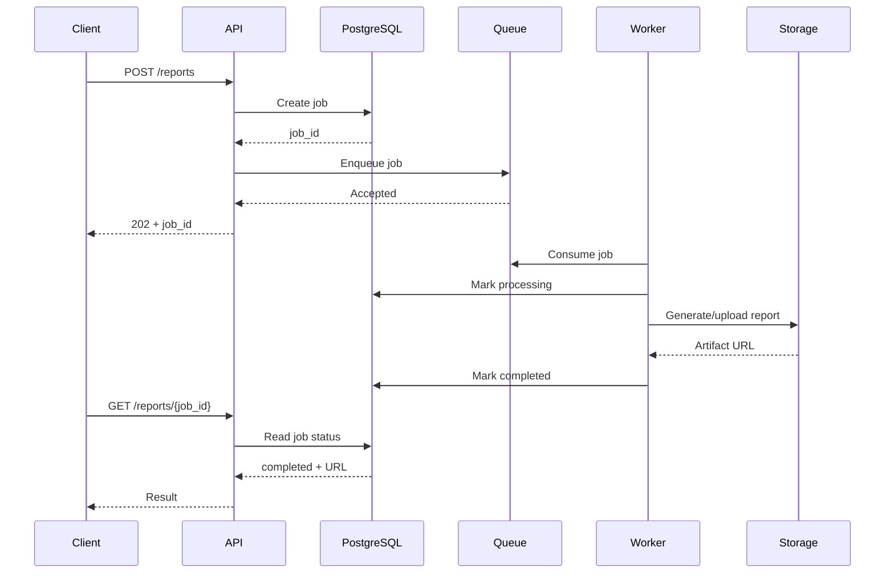

# 07- Async Processing

## Overview

Asynchronous processing separates request acceptance from work execution.

Instead of forcing an API request to perform every operation before returning a response, the application can accept the request, persist or enqueue the work, and let a worker process it independently.

A typical architecture is:

```text
Client
  |
  v
API
  |
  | validate + persist/enqueue
  v
Message Broker / Job Queue
  |
  v
Worker Pool
  |
  +----> PostgreSQL
  +----> Redis
  +----> External APIs
  +----> Object Storage
```

This pattern is useful when work is:

- Expensive.
- Slow.
- Retryable.
- Independent of the immediate HTTP response.
- Bursty.
- CPU-intensive.
- I/O-heavy.
- Better processed with controlled concurrency.

Common implementations include:

- Celery with Redis or RabbitMQ.
- AWS SQS with worker processes.
- Kafka consumer groups.
- Kubernetes worker deployments.
- Scheduled background jobs.
- Python `asyncio` for concurrent I/O within a process.

Async processing is not automatically faster. Its primary architectural benefits are **decoupling, resilience, controlled concurrency, workload isolation, and independent scaling**.

## Synchronous vs Asynchronous Processing

### Synchronous

```text
Client
  |
  v
API
  |
  v
Database
  |
  v
External API
  |
  v
API Response
  |
  v
Client
```

The client waits until the operation finishes.

Example:

```http
POST /reports
```

The API generates a large report before returning:

```http
HTTP/1.1 200 OK

{
  "report_url": "https://..."
}
```

This can become problematic if generation takes several minutes.

### Asynchronous

```text
Client
  |
  v
API
  |
  +----> Job Queue
  |          |
  v          v
202       Worker
Accepted     |
             v
          Database
             |
             v
          Storage
```

The API can immediately return:

```http
HTTP/1.1 202 Accepted

{
  "job_id": "job_123",
  "status": "queued"
}
```

The client can later retrieve the result.

## Why Async Processing Exists

Synchronous execution couples request latency to downstream processing time.

Consider:

```text
HTTP request
    |
    +── validate
    +── query database
    +── call third-party API
    +── generate PDF
    +── upload S3
    +── send email
    |
    v
Response
```

If every operation takes:

```text
DB query       = 100 ms
External API   = 500 ms
PDF generation = 3 s
S3 upload      = 500 ms
Email          = 300 ms
```

the request can take several seconds.

Worse, one slow dependency occupies application resources for the entire duration.

Async processing moves work that does not need to complete before the response into a separate execution path.

## When to Use Async Processing

Async processing is a strong fit for:

- Email delivery.
- Report generation.
- Image/video processing.
- Document conversion.
- Data imports.
- Webhook processing.
- Search indexing.
- Notifications.
- Batch operations.
- Analytics pipelines.
- Third-party API synchronization.
- Long-running workflows.
- Scheduled jobs.
- Event-driven processing.

It is less appropriate when the client fundamentally needs the result before continuing.

For example:

```text
GET /users/123
```

usually should not become an asynchronous job merely to avoid a database query.

## Async Processing Architecture

A production architecture usually contains four logical components:

```text
┌──────────────┐
│ API Service  │
└──────┬───────┘
       │
       │ enqueue
       v
┌──────────────┐
│ Message      │
│ Broker/Queue │
└──────┬───────┘
       │
       │ consume
       v
┌──────────────┐
│ Worker Pool  │
└──────┬───────┘
       │
       ├──────────────> PostgreSQL
       ├──────────────> Redis
       ├──────────────> S3
       └──────────────> External APIs
```

Each component has a distinct responsibility.

| Component | Responsibility |
|---|---|
| API | Validate request and create work |
| Broker | Buffer and deliver work |
| Worker | Execute work |
| Database | Persist business state |
| Object storage | Store large artifacts |
| Monitoring | Track health and backlog |

## Request Lifecycle

A robust asynchronous request usually follows this flow:



The important distinction is:

> The API request represents acceptance of work, not necessarily completion of work.

## Job State

Asynchronous jobs should generally have explicit lifecycle states.

```text
QUEUED
   |
   v
PROCESSING
   |
   +----> COMPLETED
   |
   +----> FAILED
              |
              v
           RETRYING
              |
              v
           PROCESSING
```

A database model might contain:

```text
id
status
attempt_count
created_at
started_at
completed_at
failed_at
error_code
result_location
```

This provides operational visibility and allows clients to query progress.

## The Queue Is Not the Source of Truth

A common architectural mistake is assuming that the message broker should contain all business state.

A queue should primarily represent **work to be processed**.

Business state should usually live in a durable datastore.

For example:

```text
PostgreSQL
    |
    | job = PROCESSING
    |
    v
Queue
    |
    | process(job_id)
    v
Worker
```

The message can contain:

```json
{
  "job_id": "job_123"
}
```

rather than duplicating a large business object.

The worker retrieves authoritative state using `job_id`.

This reduces message size and prevents stale duplicated state.

## Queue-Based Architecture

A queue decouples producer and consumer rates.

```text
Producer rate
     |
     v
┌───────────────┐
│ Queue         │
│               │
│ job 1         │
│ job 2         │
│ job 3         │
│ ...           │
└───────┬───────┘
        |
        v
Consumer rate
```

If producers temporarily become faster than consumers, the queue absorbs the burst.

If the difference is sustained, queue depth grows and backpressure must eventually be applied.

Async processing therefore works closely with:

- Backpressure.
- Rate limiting.
- Retry patterns.
- Circuit breakers.
- Bulkheads.
- Dead-letter queues.
- Idempotency.

## Choosing a Messaging Mechanism

Different systems solve different problems.

| Technology | Strong Fit | Main Characteristic |
|---|---|---|
| Celery | Python background jobs | Task execution framework |
| Redis | Lightweight queues/cache | Simple and fast |
| RabbitMQ | Work queues | Message routing and delivery |
| Amazon SQS | Managed job queues | Durable managed queue |
| Kafka | Event streaming | Durable partitioned log |
| `asyncio` | In-process I/O | Concurrent execution without broker |

The distinction between a **task queue** and an **event stream** is important.

A task queue typically answers:

> Which worker should execute this job?

Kafka can additionally answer:

> Which events occurred, and which independent consumers need to process them?

## Celery Architecture

A common Django architecture is:

```text
Django
  |
  v
Celery Producer
  |
  v
Redis / RabbitMQ
  |
  +----> Celery Worker 1
  +----> Celery Worker 2
  +----> Celery Worker 3
```

Example task:

```python
from celery import shared_task


@shared_task(
    bind=True,
    autoretry_for=(TimeoutError,),
    retry_backoff=True,
    retry_jitter=True,
    max_retries=5,
)
def generate_report(self, report_id: int) -> None:
    report = Report.objects.get(id=report_id)

    if report.status == "completed":
        return

    report.status = "processing"
    report.save(update_fields=["status"])

    build_report(report)
```

Production tasks should not assume that a task executes exactly once.

A worker can crash after performing the operation but before acknowledging the message.

Therefore, task handlers should be idempotent where possible.

## FastAPI Background Tasks vs Distributed Workers

FastAPI provides in-process background task execution.

Conceptually:

```text
HTTP Request
   |
   v
FastAPI
   |
   +----> Response
   |
   v
Background Task
```

This is useful for lightweight operations.

It is not equivalent to a durable distributed queue.

If the process crashes:

```text
FastAPI process
      |
      X
   crashes
      |
      v
Background task lost
```

For important work, use a durable external queue such as SQS, RabbitMQ, Kafka, or a properly configured Celery deployment.

## Async Python vs Async Processing

These concepts should not be confused.

### Python Async I/O

`asyncio` allows a process to efficiently handle concurrent I/O.

```python
import asyncio


async def fetch_user(user_id: int) -> dict:
    ...


async def fetch_users(user_ids: list[int]) -> list[dict]:
    return await asyncio.gather(
        *(fetch_user(user_id) for user_id in user_ids)
    )
```

This is about **concurrency inside an application process**.

### Distributed Async Processing

A queue-based architecture moves work outside the request process.

```text
API Process
    |
    v
Queue
    |
    v
Worker Processes
```

This is about:

- Durability.
- Isolation.
- Independent scaling.
- Failure recovery.
- Work distribution.

A senior engineer should distinguish these two concepts.

## CPU-Bound vs I/O-Bound Work

Async processing does not make CPU-bound work automatically faster.

### I/O-Bound

Examples:

- HTTP requests.
- Database queries.
- S3 operations.
- External API calls.

Async I/O can improve resource utilization.

### CPU-Bound

Examples:

- Video encoding.
- Image transformation.
- Large data processing.
- Cryptographic computation.

These usually benefit from:

- Worker processes.
- Multiprocessing.
- Distributed workers.
- Specialized compute resources.

For example:

```text
API
 |
 v
Queue
 |
 v
CPU Worker Pool
 |
 +----> Worker 1
 +----> Worker 2
 +----> Worker 3
```

## Database Transaction and Job Enqueueing

One of the most important production concerns is coordinating database state with asynchronous work.

Consider:

```python
order = create_order()

queue.publish({
    "order_id": order.id,
})
```

What happens if:

```text
Database commit succeeds
Queue publish fails
```

The order exists, but no worker receives the event.

The opposite can also happen:

```text
Queue publish succeeds
Database transaction rolls back
```

Now a worker receives a job for data that does not exist.

This is a classic distributed consistency problem.

## Transactional Outbox Pattern

A common solution is the transactional outbox.

```text
                PostgreSQL
          ┌──────────────────┐
          │ Business data    │
          │                  │
          │ Outbox event     │
          └────────┬─────────┘
                   |
                   v
             Outbox Publisher
                   |
                   v
              Message Broker
                   |
                   v
                Worker
```

The business transaction and outbox record are committed atomically.

Example:

```python
from django.db import transaction


with transaction.atomic():
    order = Order.objects.create(...)

    OutboxEvent.objects.create(
        event_type="order.created",
        aggregate_id=str(order.id),
        payload={"order_id": order.id},
    )
```

A publisher later sends the outbox event to the broker.

This avoids requiring a distributed transaction between PostgreSQL and the message broker.

## `transaction.on_commit`

For simpler Django cases, `transaction.on_commit()` can prevent a task from being published before the database transaction commits.

```python
from django.db import transaction


with transaction.atomic():
    order = Order.objects.create(...)

    transaction.on_commit(
        lambda: publish_order_created(order.id)
    )
```

This is useful when losing an event due to publisher failure is acceptable or separately handled.

For stronger delivery guarantees, an outbox is usually more robust because the pending event is persisted durably.

## Delivery Semantics

Async processing requires an explicit delivery model.

Common semantics include:

| Semantic | Meaning |
|---|---|
| At-most-once | Message may be lost, but should not be processed twice |
| At-least-once | Message should not be lost, but may be processed multiple times |
| Exactly-once | Processing appears to happen once under defined system boundaries |

Most distributed job systems favor **at-least-once processing** because retries and crashes naturally create duplicates.

Therefore:

```text
Message delivery
      |
      v
Worker
      |
      +── process
      |
      +── crash before ACK
      |
      v
Message delivered again
```

Workers should be idempotent.

## Idempotent Async Jobs

A common strategy is an idempotency key.

```python
from django.db import transaction


def process_payment(payment_id: int, idempotency_key: str) -> None:
    with transaction.atomic():
        operation, created = PaymentOperation.objects.get_or_create(
            idempotency_key=idempotency_key,
            defaults={"payment_id": payment_id},
        )

        if not created and operation.completed_at is not None:
            return

        charge_payment(payment_id)

        operation.mark_completed()
```

The database should enforce uniqueness:

```python
class PaymentOperation(models.Model):
    idempotency_key = models.CharField(
        max_length=255,
        unique=True,
    )
    payment = models.ForeignKey("Payment", on_delete=models.PROTECT)
    completed_at = models.DateTimeField(null=True)
```

Idempotency is especially important for:

- Payments.
- Emails.
- External API calls.
- Inventory updates.
- Order creation.
- Webhooks.

## Retry Strategy

Async jobs should generally retry only failures that may recover.

| Failure | Retry? |
|---|---|
| Temporary network timeout | Usually yes |
| HTTP 503 | Usually yes |
| HTTP 429 | Yes, respect provider guidance |
| Database connection failure | Usually yes |
| Invalid payload | Usually no |
| Authentication failure | Usually no until credentials fixed |
| Permission denied | Usually no |
| Business validation failure | Usually no |

A typical retry schedule uses exponential backoff:

```text
Attempt 1 → immediate
Attempt 2 → 1s
Attempt 3 → 2s
Attempt 4 → 4s
Attempt 5 → 8s
```

Add jitter so many workers do not retry simultaneously.

```text
delay = exponential_backoff + random_jitter
```

## Dead-Letter Queues

A task that repeatedly fails should not retry forever.

```text
Queue
  |
  v
Worker
  |
  +── success → ACK
  |
  +── temporary failure → retry
  |
  +── repeated failure → DLQ
```

Dead-letter queues allow operators to inspect and recover problematic messages.

Common reasons include:

- Poison messages.
- Invalid schema.
- Unexpected business state.
- Permanent downstream failures.
- Application bugs.

## Concurrency Control

Async processing can create too much concurrency.

Suppose:

```text
Queue backlog = 1 million jobs
Workers = 100
Concurrency per worker = 20
```

Potential concurrency:

```text
100 × 20 = 2,000 jobs
```

That may be completely unsafe if every job hits PostgreSQL.

Concurrency should be designed around downstream capacity.

```text
Queue
  |
  v
Worker concurrency
  |
  v
Connection pool
  |
  v
Database capacity
```

## Worker Scaling

Worker scaling can be horizontal:

```text
Queue
 |
 +----> Worker 1
 +----> Worker 2
 +----> Worker 3
 +----> Worker N
```

Scaling decisions can use:

- Queue depth.
- Oldest message age.
- Consumer lag.
- CPU.
- Memory.
- Processing latency.

Queue depth alone can be misleading.

If jobs become ten times slower, the same worker count may produce a rapidly growing backlog even though incoming request volume has not changed.

## Backpressure

Async processing and backpressure are closely related.

A queue can absorb a temporary burst:

```text
Producer
   |
   v
Queue
   |
   v
Workers
```

But if:

```text
producer rate > worker throughput
```

then:

```text
queue depth ↑
```

Eventually the system must:

- Scale workers.
- Slow producers.
- Reject new work.
- Shed low-priority work.
- Increase capacity.
- Extend retention.
- Process work later.

Async processing without overload control can simply move the failure from the API layer into the queue.

## Queue Ordering

Ordering requirements affect architecture.

Some workloads require:

```text
A → B → C
```

to be processed in order.

Others allow:

```text
A
B
C
```

to execute independently.

Ordering can reduce parallelism.

For example:

```text
Partition 0
   |
   +── A → B → C
```

must process sequentially if strict ordering is required.

If events are independent, partitioning and parallel consumers can increase throughput.

Always ask:

> What is the minimum ordering guarantee actually required?

Avoid paying the cost of global ordering when per-user or per-entity ordering is sufficient.

## Async Processing and Kafka

Kafka is useful when events need:

- Durable retention.
- Multiple independent consumers.
- Replay.
- Partition-based scaling.
- High throughput.
- Event-stream semantics.

Example:

```text
Order Service
     |
     v
Kafka: orders
     |
     +----> Inventory Consumer
     |
     +----> Notification Consumer
     |
     +----> Analytics Consumer
```

Each consumer group processes the stream independently.

This differs from a traditional task queue where one worker generally claims a task for processing.

## Async Processing and Amazon SQS

SQS is a strong fit for managed background work.

```text
API
 |
 v
SQS
 |
 +----> Worker A
 +----> Worker B
 +----> Worker C
```

It removes the operational burden of managing a message broker.

Typical production concerns include:

- Visibility timeout.
- Message retention.
- Long polling.
- Dead-letter queues.
- Approximate queue depth.
- Message age.
- Consumer concurrency.
- Idempotent processing.

The visibility timeout should be long enough for normal processing but not so long that failed messages remain invisible unnecessarily.

## Long Polling

Consumers should generally avoid continuously polling an empty queue.

Conceptually:

```text
Short polling:

Worker → Queue → empty
Worker → Queue → empty
Worker → Queue → empty
Worker → Queue → message
```

Long polling allows the consumer to wait for available work.

This reduces:

- Empty polling requests.
- Network overhead.
- API calls.
- Unnecessary cost.

## Monitoring Async Systems

Important metrics include:

### Queue Metrics

- Queue depth.
- Oldest message age.
- Enqueue rate.
- Dequeue rate.
- Processing rate.
- Consumer lag.
- Dead-letter count.

### Worker Metrics

- Active workers.
- Worker utilization.
- Task duration.
- Task failures.
- Retry count.
- Task throughput.
- Worker crashes.

### Business Metrics

- Jobs completed.
- Jobs failed.
- Jobs abandoned.
- Time from submission to completion.
- Success rate.
- SLA violations.

A queue can be operationally healthy while the business system is failing.

For example:

```text
Queue depth = low
```

but:

```text
Job completion latency = 30 minutes
```

because workers are processing extremely slowly.

## Observability With Correlation IDs

An asynchronous request crosses process boundaries, so correlation metadata should be propagated.

```text
HTTP Request
    |
    | trace_id = abc123
    v
Queue Message
    |
    | trace_id = abc123
    v
Worker
    |
    v
Database / External API
```

A message might contain:

```json
{
  "job_id": "job_123",
  "trace_id": "abc123",
  "event_type": "report.generate"
}
```

Do not blindly place sensitive information into messages merely for observability.

Prefer identifiers and retrieve sensitive data from authoritative stores.

## Security Considerations

Messages should be treated as untrusted input.

Workers should validate:

- Schema.
- Required fields.
- Identifier format.
- Authorization context where applicable.
- Payload size.
- Event version.

Avoid putting secrets directly into messages.

Use:

```text
message → resource ID → authorized lookup
```

rather than:

```text
message → password / token / sensitive payload
```

Protect broker access using:

- IAM policies.
- TLS.
- Authentication.
- Network controls.
- Least-privilege service accounts.
- Encryption at rest.

## Failure Handling

A robust worker should distinguish between:

```text
Success
Permanent failure
Transient failure
Unknown failure
```

Example:

```python
async def process_job(job: Job) -> None:
    try:
        await execute(job)
    except TemporaryDependencyError:
        raise
    except InvalidJobError:
        await move_to_dead_letter(job)
    except Exception:
        await record_unknown_failure(job)
        raise
```

Do not catch every exception and mark the task successful.

That can silently lose work.

## Poison Messages

A poison message is a message that repeatedly causes a worker to fail.

Without a dead-letter strategy:

```text
Queue
  |
  v
Worker
  |
  X failure
  |
  v
Retry
  |
  X failure
  |
  v
Retry forever
```

This can starve healthy work.

Use:

```text
Maximum attempts
       |
       v
Dead-letter queue
```

Then inspect and remediate the underlying cause.

## Job Expiration

Not all asynchronous work remains useful forever.

For example:

```text
Generate dashboard for user
```

If the user requests another dashboard five minutes later, the previous job may no longer matter.

Use:

- Job expiration.
- Deduplication.
- Coalescing.
- Cancellation where supported.
- Latest-state processing.

This prevents stale work from consuming capacity.

## Deduplication and Coalescing

Suppose a user changes a document ten times:

```text
Update 1
Update 2
Update 3
...
Update 10
```

If each update triggers expensive indexing, processing all ten may be wasteful.

Instead:

```text
Update 1 ─┐
Update 2  │
Update 3  ├──> Coalesced job
...       │
Update 10 ┘
```

The worker processes the latest relevant state.

This is useful for:

- Search indexing.
- Cache refreshes.
- UI synchronization.
- Materialized views.
- Notifications.

## Cancellation

Cancellation is harder than simply deleting a queue message.

Consider:

```text
Job
 |
 v
Worker
 |
 v
External API
```

If cancellation occurs after the external API call has started, the system may not be able to undo it.

Therefore, cancellation semantics should be explicit:

- Not started → cancel.
- Queued → remove or mark cancelled.
- Running → cooperative cancellation if supported.
- External side effect completed → compensate if possible.

Do not promise cancellation semantics that the underlying operation cannot guarantee.

## Cost Considerations

Async processing can reduce request infrastructure requirements by separating workload capacity from API capacity.

For example:

```text
API traffic
   |
   v
Small API fleet

Background workload
   |
   v
Independent worker fleet
```

Workers can scale independently.

However, asynchronous systems introduce additional costs:

- Message broker.
- Queue storage.
- Worker compute.
- Monitoring.
- Logs.
- Tracing.
- Data storage.
- Operational complexity.

Async architecture should therefore be justified by workload characteristics, not adopted simply because it appears more scalable.

## High Availability

Production worker systems should avoid a single worker instance.

Use:

```text
Queue
 |
 +----> Worker A
 +----> Worker B
 +----> Worker C
```

Workers should be stateless where possible.

If a worker crashes:

```text
Worker A
   |
   X crash
   |
   v
Message becomes available again
   |
   v
Worker B
```

This depends on the broker's delivery and acknowledgment semantics.

For durable workloads, design around worker failure as a normal event.

## Disaster Recovery

Define what happens to queued work during:

- Region failure.
- Broker failure.
- Database failure.
- Worker fleet failure.
- Deployment.
- Schema migration.
- External dependency outage.

Important questions:

- Is the queue durable?
- Can messages be replayed?
- What is the retention period?
- Can the worker resume safely?
- Is processing idempotent?
- Can the backlog be drained safely after recovery?
- Is cross-region replication required?
- Can the downstream system handle recovery traffic?

Recovery itself can create a load spike, so backlog draining should be controlled.

## Deployment Considerations

Rolling deployments can interrupt workers.

A safe worker shutdown should allow active tasks to complete or safely return them to the queue.

Conceptually:

```text
SIGTERM
   |
   v
Stop accepting new jobs
   |
   v
Finish active jobs
   |
   v
Acknowledge completed jobs
   |
   v
Exit
```

For long-running tasks, configure deployment timeouts carefully.

Killing workers immediately can increase duplicate processing.

## Schema Evolution

Message schemas outlive application deployments.

A producer may publish:

```json
{
  "event_type": "order.created",
  "order_id": 123
}
```

A newer producer might publish:

```json
{
  "event_type": "order.created",
  "order_id": 123,
  "currency": "USD"
}
```

Consumers should tolerate compatible evolution where possible.

Good practices include:

- Version event schemas when necessary.
- Prefer additive changes.
- Avoid removing required fields abruptly.
- Validate messages.
- Keep consumers backward-compatible during rolling deployments.
- Define ownership of event contracts.

## Common Mistakes

### Doing Everything Asynchronously

Not every operation benefits from a queue.

A simple database read should not become:

```text
API → Queue → Worker → Database → Queue → API
```

when the client needs the result immediately.

### Using In-Process Background Tasks for Critical Work

If the process crashes, the work may disappear.

Use durable queues for business-critical asynchronous work.

### Assuming Exactly-Once Execution

Workers can crash after side effects and before acknowledgment.

Design for duplicate delivery.

### No Idempotency

Retries can duplicate:

- Payments.
- Emails.
- Inventory changes.
- Database updates.

Use idempotency keys or durable state transitions.

### No Timeout

A stuck task can occupy worker capacity indefinitely.

### Unlimited Retries

A permanently invalid message can consume capacity forever.

Use maximum attempts and dead-letter handling.

### Huge Message Payloads

Large messages increase:

- Network overhead.
- Broker storage.
- Serialization cost.
- Memory usage.

Prefer identifiers and durable object storage for large payloads.

### Ignoring Backpressure

A queue can grow indefinitely if producers consistently outpace workers.

Monitor backlog and define overload behavior.

### Scaling Workers Without Capacity Planning

More workers can overload:

- PostgreSQL.
- Redis.
- External APIs.
- Object storage.
- Internal services.

### Losing Database-to-Queue Consistency

Publishing a message outside a database transaction can create missing or inconsistent work.

Use an outbox pattern where reliable event publication is required.

## Production Checklist

### Architecture

- [ ] Async work is genuinely decoupled from the immediate response.
- [ ] Queue/broker choice matches workload requirements.
- [ ] Producers and consumers are independently scalable.
- [ ] Workload priorities are defined.
- [ ] Backpressure behavior is explicit.

### Reliability

- [ ] At-least-once behavior is handled safely where applicable.
- [ ] Workers are idempotent.
- [ ] Retries use bounded exponential backoff.
- [ ] Retry jitter is enabled.
- [ ] Dead-letter handling exists.
- [ ] Poison messages cannot retry forever.
- [ ] Timeouts are configured.

### Data Consistency

- [ ] Database and queue consistency is addressed.
- [ ] Transactional outbox is used where appropriate.
- [ ] Job state is persisted.
- [ ] Message schemas are versioned or backward-compatible.
- [ ] Duplicate processing is safe.

### Scalability

- [ ] Worker concurrency is bounded.
- [ ] Downstream capacity is understood.
- [ ] Queue depth and age are monitored.
- [ ] Autoscaling has safe limits.
- [ ] Backlog recovery has been tested.

### Operations

- [ ] Correlation IDs are propagated.
- [ ] Structured logging is available.
- [ ] Distributed tracing covers asynchronous boundaries.
- [ ] Worker shutdown is graceful.
- [ ] Deployment behavior has been tested.
- [ ] Alert thresholds are defined.

### Security

- [ ] Broker access follows least privilege.
- [ ] Messages are encrypted where required.
- [ ] Sensitive information is not unnecessarily embedded in messages.
- [ ] Message schemas are validated.
- [ ] Worker inputs are treated as untrusted.

## Key Takeaways

- **Async processing decouples request handling from long-running or independently scalable work; it is primarily a reliability and architecture pattern, not simply a performance optimization.**
- **Durable queues, explicit job state, idempotent workers, bounded retries, and dead-letter handling are foundational requirements for production asynchronous systems.**
- **Database-to-queue consistency is a distributed-systems problem; transactional outbox is a strong pattern when reliable event publication is required.**
- **Async workers must be scaled according to downstream capacity, because increasing concurrency can simply move the bottleneck to PostgreSQL, Redis, or an external service.**
- **Production async systems require observable queue age, backlog, processing latency, retries, failures, and end-to-end job state, with explicit behavior for overload and recovery.**