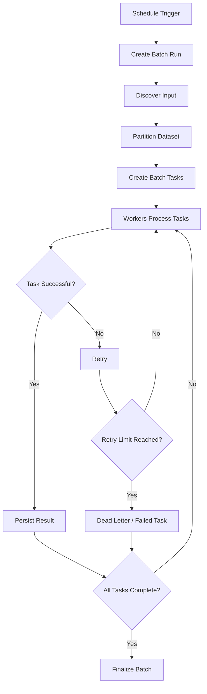

# 08- Batch Processing

## Overview

Batch processing executes a collection of records or jobs as a group rather than processing every item independently in real time.

A batch workload typically looks like:

```text
Input Dataset
     |
     v
Partition / Chunk
     |
     +----> Batch 1
     +----> Batch 2
     +----> Batch 3
     +----> ...
     |
     v
Processing Workers
     |
     v
Output / Database / Storage
```

Batch processing is useful when immediate results are unnecessary and throughput, cost efficiency, controlled resource consumption, or large-scale data processing are more important than per-record latency.

Common examples include:

- Nightly data synchronization.
- Large database exports.
- ETL pipelines.
- Invoice generation.
- Email campaigns.
- Analytics aggregation.
- Search index rebuilding.
- Data migration.
- Bulk API synchronization.
- Machine learning data preparation.
- Log processing.
- Reconciliation jobs.

Batch processing is different from asynchronous processing in scope. An asynchronous job may process one unit of work independently, while a batch workload intentionally groups many records together to improve throughput or reduce overhead.

## Why Batch Processing Exists

Processing millions of records individually can create substantial overhead.

For example:

```text
10 million records
      |
      +---- HTTP request
      +---- database transaction
      +---- serialization
      +---- network round trip
      +---- response
      |
      v
Repeated 10 million times
```

Batching can reduce this overhead:

```text
10 million records
      |
      v
10,000 batches × 1,000 records
      |
      v
Bulk processing
```

Instead of performing one database operation per record:

```sql
INSERT INTO orders (...) VALUES (...);
INSERT INTO orders (...) VALUES (...);
INSERT INTO orders (...) VALUES (...);
```

a system can use bulk operations:

```sql
INSERT INTO orders (...)
VALUES
    (...),
    (...),
    (...);
```

The goal is not simply to process "many records at once". The goal is to choose a processing strategy that balances:

- Throughput.
- Latency.
- Memory usage.
- Database load.
- Network overhead.
- Failure isolation.
- Cost.
- Operational complexity.

## Batch Processing vs Real-Time Processing

| Characteristic | Real-Time | Batch |
|---|---|---|
| Latency | Low | Higher |
| Throughput | Usually optimized for individual requests | Usually optimized for volume |
| Processing model | One event/request at a time | Groups of records |
| Resource efficiency | Can have higher per-item overhead | Usually better for bulk work |
| Failure handling | Per request/event | Per batch or record |
| Typical infrastructure | APIs, streams | Workers, schedulers, ETL |
| Examples | Payment API, user request | Daily billing, data migration |

The choice depends on business requirements.

If a customer submits a payment, waiting until midnight to process it is unacceptable.

If the company needs to calculate monthly revenue across billions of historical rows, processing everything synchronously through an HTTP API is inappropriate.

## Batch Processing Architecture

A production batch system usually contains:

```text
                 Scheduler
                    |
                    v
             Batch Controller
                    |
                    v
             Input Dataset
                    |
             Partition / Chunk
                    |
        +-----------+-----------+
        |           |           |
        v           v           v
     Worker 1    Worker 2    Worker N
        |           |           |
        +-----------+-----------+
                    |
                    v
             Output Storage
                    |
                    v
              Monitoring
```

The components can be implemented using different technologies.

| Component | Common Technologies |
|---|---|
| Scheduler | Airflow, EventBridge, Kubernetes CronJob |
| Controller | Python, Celery, Airflow DAG |
| Queue | SQS, Kafka, RabbitMQ |
| Workers | Python, Celery, Kubernetes Jobs |
| Database | PostgreSQL, MySQL |
| Object storage | Amazon S3 |
| Distributed processing | Spark, Ray |
| Monitoring | CloudWatch, Prometheus, Grafana |

## Batch Processing Lifecycle

A typical batch workflow is:



A batch run should have an explicit lifecycle.

For example:

```text
CREATED
   |
   v
RUNNING
   |
   +----> COMPLETED
   |
   +----> FAILED
   |
   +----> PARTIALLY_COMPLETED
```

This becomes important when processing large workloads where individual tasks can fail without invalidating the entire batch.

## Batch Size

Batch size is one of the most important tuning parameters.

Suppose:

```text
Dataset = 10,000,000 records
Batch size = 1,000
```

Then:

```text
10,000,000 / 1,000 = 10,000 batches
```

A larger batch size reduces scheduling and network overhead but increases memory usage and failure impact.

A smaller batch size improves failure isolation and allows more granular parallelism but increases coordination overhead.

| Batch Size | Advantages | Risks |
|---|---|---|
| Small | Lower memory, smaller failures | Higher overhead |
| Medium | Balanced | Requires tuning |
| Large | High throughput, fewer operations | Higher memory and failure cost |
| Huge | Potentially efficient sequentially | Poor isolation and resource pressure |

There is no universally correct batch size.

Tune it against:

- Record size.
- Database capacity.
- Worker memory.
- Query latency.
- Network bandwidth.
- External API limits.
- Transaction duration.

## Chunking

Chunking divides a large dataset into manageable pieces.

For example:

```text
10,000,000 records

Chunk 1:       1 - 1,000
Chunk 2:   1,001 - 2,000
Chunk 3:   2,001 - 3,000
...
Chunk N
```

A Python implementation might process records in chunks:

```python
from collections.abc import Iterable, Iterator, Sequence, TypeVar

T = TypeVar("T")


def chunks(items: Sequence[T], size: int) -> Iterator[Sequence[T]]:
    if size <= 0:
        raise ValueError("size must be greater than zero")

    for start in range(0, len(items), size):
        yield items[start:start + size]
```

However, loading millions of records into memory before chunking defeats the purpose.

For large datasets, prefer streaming or database-side pagination.

## Database Chunking

Avoid:

```python
records = list(Order.objects.all())
```

for a very large table.

This can consume excessive memory.

Django's `iterator()` can stream rows without constructing the entire queryset result in memory:

```python
from django.db import transaction

queryset = (
    Order.objects
    .filter(status="pending")
    .order_by("id")
)

for order in queryset.iterator(chunk_size=1_000):
    process_order(order)
```

For large-scale processing, keyset pagination is often preferable when explicit page boundaries are required.

## Offset Pagination vs Keyset Pagination

Offset pagination:

```sql
SELECT id, status
FROM orders
ORDER BY id
LIMIT 1000 OFFSET 5000000;
```

can become increasingly expensive because the database may need to walk through a large number of rows before returning the requested page.

Keyset pagination uses a stable cursor:

```sql
SELECT id, status
FROM orders
WHERE id > 5000000
ORDER BY id
LIMIT 1000;
```

The worker can then continue from the last processed identifier.

```text
last_id = 0

while True:
    rows = fetch_rows_after(last_id, limit=1000)

    if not rows:
        break

    process(rows)
    last_id = rows[-1].id
```

For very large datasets, this is often more predictable.

## Why Stable Ordering Matters

Batch processing requires deterministic boundaries.

Avoid relying on an unordered query:

```sql
SELECT *
FROM orders
LIMIT 1000;
```

Instead, use a stable ordering:

```sql
SELECT *
FROM orders
WHERE id > :last_id
ORDER BY id
LIMIT :batch_size;
```

Without deterministic ordering, records can potentially be skipped or processed more than once when the underlying dataset changes.

## Bulk Database Operations

Batching is particularly effective for databases.

Instead of:

```python
for order in orders:
    OrderLog.objects.create(
        order_id=order.id,
        status="processed",
    )
```

use a bulk operation where appropriate:

```python
logs = [
    OrderLog(
        order_id=order.id,
        status="processed",
    )
    for order in orders
]

OrderLog.objects.bulk_create(
    logs,
    batch_size=1_000,
)
```

This reduces database round trips.

However, bulk operations can bypass application-level behavior depending on the ORM and operation.

Consider:

- Model signals.
- Validation.
- `save()` overrides.
- Database triggers.
- Unique constraints.
- Foreign-key constraints.

Do not assume `bulk_create()` is behaviorally identical to calling `save()` for every object.

## Batch Transactions

A transaction can be scoped to an entire batch:

```text
Batch 1
  |
  +---- record A
  +---- record B
  +---- record C
  |
  v
COMMIT
```

This provides atomicity for the batch but can create long-running transactions.

Alternatively:

```text
Batch
 |
 +---- Chunk 1 → COMMIT
 +---- Chunk 2 → COMMIT
 +---- Chunk 3 → COMMIT
```

This reduces transaction duration and limits rollback scope.

For large workloads, smaller transaction boundaries are often safer.

### Long Transactions Can Cause Problems

Long-running transactions can:

- Hold locks.
- Increase WAL generation.
- Delay vacuum cleanup in PostgreSQL.
- Increase replication lag.
- Consume database resources.
- Increase rollback cost.

The correct transaction boundary depends on the business operation.

## Partial Failure

A batch containing 100,000 records should not necessarily fail completely because one record is invalid.

A robust design can track individual outcomes:

```text
Batch
 |
 +---- Record 1 → success
 +---- Record 2 → success
 +---- Record 3 → failed
 +---- Record 4 → success
 +---- ...
```

Possible batch metrics:

```text
Total:       100,000
Succeeded:    99,200
Failed:          700
Skipped:         100
```

The batch status could become:

```text
PARTIALLY_COMPLETED
```

This is more operationally useful than a binary success/failure state.

## Failure Isolation

Batch boundaries should be designed to limit blast radius.

Suppose one worker processes:

```text
1,000,000 records
```

and fails after 900,000 records.

Recovery can be difficult.

Instead:

```text
1,000,000 records
      |
      +---- 1,000 × 1,000-record tasks
```

A failed task affects only its own partition.

This also enables parallel execution.

## Idempotency

Batch processing frequently involves retries.

Consider:

```text
Batch 17
   |
   v
Worker processes records
   |
   X worker crashes
   |
   v
Batch 17 retried
```

Some records may have already been processed.

Therefore, batch operations should be idempotent where practical.

Common strategies include:

- Unique database constraints.
- Upserts.
- Idempotency keys.
- Processing-state tables.
- Checkpoints.
- Version numbers.

Example PostgreSQL pattern:

```sql
INSERT INTO processed_orders (order_id, batch_id)
VALUES (:order_id, :batch_id)
ON CONFLICT (order_id) DO NOTHING;
```

The database becomes the authority for whether the operation has already been applied.

## Checkpointing

Checkpointing records progress through a large workload.

```text
Dataset
 |
 +---- Batch 1 ✓
 +---- Batch 2 ✓
 +---- Batch 3 ✓
 +---- Batch 4 ✗
```

Instead of restarting from the beginning, the system resumes from the latest successful checkpoint.

A checkpoint may contain:

```text
batch_run_id
partition_id
last_processed_id
status
updated_at
```

For sequential processing:

```python
last_id = load_checkpoint()

while True:
    rows = fetch_rows_after(last_id, limit=1_000)

    if not rows:
        break

    process(rows)

    last_id = rows[-1].id
    save_checkpoint(last_id)
```

The checkpoint itself must be persisted durably.

## Checkpointing vs Idempotency

These solve different problems.

| Technique | Purpose |
|---|---|
| Idempotency | Safely repeat work |
| Checkpointing | Avoid unnecessary reprocessing |
| Retry | Recover from transient failure |
| DLQ | Isolate permanently failing work |

Production systems often need more than one.

A checkpoint does not eliminate duplicates if a worker crashes after performing a side effect but before updating the checkpoint.

## Parallel Batch Processing

A large batch can be partitioned:

```text
Dataset
   |
   v
Partitioner
   |
   +----> Partition A → Worker 1
   +----> Partition B → Worker 2
   +----> Partition C → Worker 3
   +----> Partition D → Worker 4
```

Parallelism increases throughput but introduces coordination problems.

Consider:

- Partition independence.
- Ordering requirements.
- Database contention.
- External API rate limits.
- Worker memory.
- Duplicate processing.
- Result aggregation.

More workers do not always mean more throughput.

## Partitioning Strategies

Common strategies include:

### ID Range

```text
Worker 1 → IDs 1–1,000,000
Worker 2 → IDs 1,000,001–2,000,000
```

Simple and efficient when IDs are well distributed.

### Hash Partitioning

```text
partition = hash(customer_id) % N
```

Useful for distributing entities across workers.

### Time Partitioning

```text
2026-08-01
2026-08-02
2026-08-03
```

Useful for time-series workloads.

### File Partitioning

```text
S3/
  input/
    part-0001.parquet
    part-0002.parquet
    part-0003.parquet
```

Useful for data pipelines.

## Work Distribution

A queue can distribute batch partitions dynamically.

```text
Batch Controller
      |
      v
      SQS
       |
       +----> Worker A
       +----> Worker B
       +----> Worker C
       +----> Worker D
```

This is often preferable to statically assigning partitions because faster workers can process more tasks.

The queue effectively acts as a work scheduler.

## Batch Processing with Celery

Celery can execute independent batch tasks.

```python
from celery import shared_task


@shared_task(
    bind=True,
    autoretry_for=(TimeoutError,),
    retry_backoff=True,
    retry_jitter=True,
    max_retries=5,
)
def process_partition(
    self,
    batch_run_id: str,
    partition_id: int,
) -> None:
    partition = load_partition(
        batch_run_id=batch_run_id,
        partition_id=partition_id,
    )

    for record in fetch_records(partition):
        process_record(record)
```

The batch controller can create partition tasks:

```text
Batch Run
   |
   +---- Partition 1
   +---- Partition 2
   +---- Partition 3
   +---- Partition N
```

The controller should not load the entire dataset into the worker's memory merely to distribute work.

## Batch Processing with SQS

A common AWS architecture is:

```text
EventBridge Scheduler
        |
        v
Batch Controller
        |
        v
Amazon SQS
        |
        +----> ECS Worker
        +----> ECS Worker
        +----> ECS Worker
        |
        v
PostgreSQL / S3
```

Each message can represent a partition:

```json
{
  "batch_run_id": "2026-08-23-orders",
  "partition_id": 42,
  "min_id": 42001,
  "max_id": 43000
}
```

Workers independently process the partition.

This provides:

- Horizontal scaling.
- Failure isolation.
- Retry handling.
- Visibility into individual partitions.

## Batch Processing with Airflow

Airflow is useful when batch work has dependencies.

For example:

```text
Extract
   |
   v
Validate
   |
   v
Transform
   |
   +----> Aggregate A
   |
   +----> Aggregate B
   |
   v
Load
   |
   v
Publish
```

A DAG represents orchestration rather than the actual high-throughput processing engine.

Airflow is often best used to coordinate systems such as:

- Python workers.
- Spark.
- SQL transformations.
- Kubernetes Jobs.
- AWS services.

Avoid turning a single Airflow task into a massive in-memory processing operation if a distributed processing system is more appropriate.

## Batch Processing with Kubernetes

Kubernetes Jobs are useful for finite workloads.

```yaml
apiVersion: batch/v1
kind: Job
metadata:
  name: order-reconciliation
spec:
  completions: 10
  parallelism: 3
  backoffLimit: 4
  template:
    spec:
      restartPolicy: Never
      containers:
        - name: worker
          image: example/order-worker:1.0.0
          args:
            - "process-partition"
```

The important distinction is:

- `completions` defines how many successful completions are required.
- `parallelism` controls concurrent execution.
- `backoffLimit` controls failed pod retries.

Production jobs should also define:

- Resource requests.
- Resource limits.
- Appropriate service accounts.
- Network policies.
- Timeouts.
- Observability.

## External API Batch Processing

Batch workloads frequently call third-party APIs.

Suppose:

```text
1,000,000 customers
```

must be synchronized with an external service.

Naively running:

```text
1,000,000 concurrent requests
```

is dangerous.

The downstream API may enforce:

```text
100 requests/second
```

A safe architecture is:

```text
Dataset
   |
   v
Batch Partitions
   |
   v
Queue
   |
   v
Workers
   |
   v
Rate Limiter
   |
   v
External API
```

The rate limiter should be shared appropriately across workers.

Redis can be used for distributed rate-limiting state when the workload requires it.

## Backpressure in Batch Systems

Batch workloads can overload downstream systems just as real-time systems can.

Consider:

```text
1,000 workers
    |
    v
PostgreSQL
```

If every worker opens multiple database connections, the database can become the bottleneck.

Instead, define concurrency based on downstream capacity:

```text
Database max safe concurrency
              |
              v
      Worker concurrency
              |
              v
        Batch throughput
```

The batch system should prioritize stable throughput over maximum instantaneous concurrency.

## Rate Limiting

Batch processing often requires rate limiting.

For example:

```text
External API:
100 requests/sec

Worker fleet:
20 workers
```

A local limiter per worker could accidentally produce:

```text
20 × 100 = 2,000 requests/sec
```

when the real limit is 100.

A distributed rate limiter or centralized work scheduler may be required.

## Memory Management

A common mistake is loading the entire dataset into memory.

Bad:

```python
records = list(Order.objects.all())

for record in records:
    process(record)
```

Better:

```python
for record in (
    Order.objects
    .order_by("id")
    .iterator(chunk_size=1_000)
):
    process(record)
```

For very large data processing, consider:

- Streaming.
- Chunked reads.
- S3 objects.
- Parquet.
- Columnar processing.
- Distributed computation.

Memory usage should remain approximately bounded as dataset size increases.

## Batch Input Formats

The input format affects processing efficiency.

Common choices include:

| Format | Typical Use |
|---|---|
| JSON | APIs and small datasets |
| CSV | Simple interchange |
| JSONL | Streaming records |
| Parquet | Analytics and large datasets |
| Avro | Schema-driven event/data pipelines |
| Database rows | Operational batch processing |

For analytical workloads, columnar formats such as Parquet can significantly reduce I/O because only required columns need to be read.

## Batch Processing and Object Storage

A scalable architecture can use S3 as the intermediate storage layer:

```text
Source
  |
  v
S3
  |
  +----> partition-001
  +----> partition-002
  +----> partition-003
  |
  v
Workers
  |
  v
Processed Output
```

This separates:

- Input durability.
- Processing compute.
- Output storage.

Workers can remain stateless and restart safely.

## Exactly-Once Output

Batch systems frequently need to ensure that the final result is not duplicated.

A robust pattern is to make output writes idempotent.

For example:

```sql
INSERT INTO daily_sales (
    business_date,
    customer_id,
    total
)
VALUES (
    :business_date,
    :customer_id,
    :total
)
ON CONFLICT (
    business_date,
    customer_id
)
DO UPDATE SET
    total = EXCLUDED.total;
```

This allows a batch to be safely retried.

The key is to define the uniqueness boundary explicitly.

## Batch Run Metadata

Maintain a durable representation of each execution.

Example:

```text
batch_runs
-----------
id
batch_type
status
started_at
completed_at
total_records
successful_records
failed_records
created_at
```

And optionally:

```text
batch_partitions
----------------
id
batch_run_id
partition_key
status
attempt_count
started_at
completed_at
last_error
```

This makes large batch operations observable and restartable.

## Observability

Monitor both infrastructure and business progress.

### Throughput

```text
records processed / second
```

### Batch Duration

```text
batch completion time
```

### Backlog

```text
unprocessed partitions
```

### Failure Rate

```text
failed records / total records
```

### Processing Lag

```text
current time - source record timestamp
```

Useful metrics include:

- Batch duration.
- Records processed.
- Records per second.
- Partition completion rate.
- Failed records.
- Retry count.
- Queue depth.
- Worker utilization.
- Database latency.
- External API latency.
- Database connection usage.
- Memory usage.
- CPU usage.

## Alerting

Useful alerts include:

- Batch missed its expected start time.
- Batch exceeded its SLA.
- Failure rate exceeds threshold.
- Queue backlog grows continuously.
- Oldest pending partition exceeds threshold.
- Worker fleet has insufficient capacity.
- Dead-letter count increases.
- External API rate-limit errors increase.
- Database connection saturation occurs.

Do not alert only on worker CPU.

A worker can have low CPU while being blocked on a slow database or external API.

## Cost Optimization

Batch processing is often an excellent candidate for cost optimization because work can be delayed and aggregated.

Possible strategies include:

- Larger efficient database operations.
- Spot capacity for fault-tolerant compute.
- Scheduled worker scaling.
- S3-based intermediate storage.
- Serverless jobs for irregular workloads.
- Compression.
- Columnar formats.
- Reducing unnecessary repeated reads.
- Processing only changed records.

However, larger batches can increase retry cost if a failure requires reprocessing a large amount of work.

Cost optimization should therefore consider:

```text
Compute cost
+
Storage cost
+
Network cost
+
Database cost
+
Retry cost
+
Operational cost
```

## High Availability

Batch processing often has different availability requirements from request-serving APIs.

An overnight reporting job may tolerate delayed completion.

A payment reconciliation job may not.

Define the actual batch SLA:

```text
Start by: 01:00
Complete by: 04:00
Maximum data loss: 0
Acceptable partial failure: < 0.1%
```

This allows architecture decisions to be based on business requirements.

Workers should be replaceable and stateless where possible.

## Disaster Recovery

For important batch workloads, determine whether processing can resume after:

- Worker failure.
- Database failure.
- Queue failure.
- Region failure.
- Deployment failure.
- Partial batch completion.

Strong recovery mechanisms include:

- Durable input.
- Durable checkpoints.
- Idempotent writes.
- Partition-level status.
- Retryable work.
- Immutable input files.
- Replayable events.

A good batch system should not require manually reconstructing its state after every failure.

## Concurrency and Database Capacity

A batch system should explicitly model database capacity.

Suppose:

```text
20 workers
×
10 concurrent operations
=
200 concurrent operations
```

If PostgreSQL can safely handle only 50 additional concurrent operations, the batch configuration is unsafe.

Worker concurrency should therefore be derived from downstream capacity rather than from the number of available CPU cores alone.

## Scheduling

Batch jobs can be triggered by:

- Cron.
- Airflow.
- EventBridge Scheduler.
- Kubernetes CronJob.
- Application scheduler.
- CI/CD pipelines.

For production workloads, use a scheduler that provides operational visibility and controlled retries.

Avoid relying on an individual developer laptop:

```text
Developer laptop
    |
    v
cron
```

This creates a single point of failure and poor observability.

## Time Zones and Scheduling

Time-based batch systems must define their time zone explicitly.

For example:

```text
"Run at midnight"
```

is ambiguous unless the system specifies:

```text
UTC
Asia/Kolkata
America/New_York
```

For global systems, storing timestamps in UTC while explicitly converting business-local dates is generally safer.

Daylight-saving transitions can otherwise create:

- Duplicate executions.
- Missing executions.
- Unexpected batch windows.

## Concurrency Control Between Batch Runs

A scheduler can accidentally start a second batch before the previous one completes.

```text
01:00 → Batch A starts
02:00 → Batch B starts
03:00 → Batch A still running
```

If both process the same data, duplicates or conflicting writes can occur.

Use a run lock or enforce uniqueness.

Example conceptual constraint:

```text
batch_type + business_date = UNIQUE
```

Then only one active run exists for that logical period.

## Incremental Processing

Processing the entire dataset every time is often unnecessary.

Instead of:

```text
All records
   |
   v
Process everything
```

use:

```text
Changed records since checkpoint
   |
   v
Process only delta
```

For example:

```sql
SELECT id, updated_at
FROM orders
WHERE updated_at > :last_successful_timestamp
ORDER BY updated_at, id;
```

For correctness, a timestamp alone can be insufficient if multiple records share the same timestamp.

A composite cursor such as:

```text
(updated_at, id)
```

can provide deterministic progression.

## Full vs Incremental Batch Processing

| Strategy | Advantages | Limitations |
|---|---|---|
| Full batch | Simple correctness model | Expensive at scale |
| Incremental | Efficient and scalable | More complex state management |
| Snapshot | Consistent input | Requires snapshot infrastructure |
| CDC | Near-real-time changes | More operational complexity |

A mature system often evolves from full processing toward incremental or change-data-capture approaches as scale increases.

## Batch Processing vs Streaming

Batch:

```text
Collect
  |
  v
Process periodically
```

Streaming:

```text
Event → Process immediately
Event → Process immediately
Event → Process immediately
```

The choice depends primarily on latency requirements.

| Requirement | Batch | Streaming |
|---|---:|---:|
| Hourly processing | Excellent | Possible |
| Daily reports | Excellent | Usually unnecessary |
| Sub-second reaction | Poor | Excellent |
| Large historical dataset | Excellent | Less natural |
| Event replay | Depends on architecture | Strong with Kafka |
| Simplicity | Usually simpler | Usually more complex |

Many production systems combine both.

For example:

```text
Kafka
  |
  +----> Real-time processing
  |
  +----> S3 historical storage
              |
              v
          Daily batch
```

## Common Mistakes

### Loading the Entire Dataset Into Memory

Large datasets can exhaust worker memory.

Use streaming, chunking, or partitioned processing.

### Using Huge Transactions

A single transaction containing millions of records can create locks, WAL pressure, and expensive rollbacks.

Use appropriate transaction boundaries.

### Using OFFSET for Deep Pagination

Large offsets can become inefficient.

Prefer keyset pagination where appropriate.

### No Stable Ordering

Unstable pagination can cause skipped or duplicated records.

Use deterministic ordering and cursor boundaries.

### No Idempotency

A worker retry can apply the same side effect twice.

Design writes to tolerate retries.

### Retrying the Entire Batch

If one partition fails, restarting millions of successful records is wasteful.

Retry at the smallest safe unit.

### Unbounded Parallelism

More workers can overload the database or downstream APIs.

Set explicit concurrency limits.

### Ignoring Partial Failure

A batch with 999,999 successes and one failure should not always be treated as identical to a total failure.

Track record-level and partition-level outcomes.

### No Checkpoint

Without checkpoints, large jobs may repeatedly restart from the beginning.

### Scheduler Overlap

A new run can start while the previous run is still processing.

Use locking or uniqueness constraints.

### No Backpressure

Batch workloads can overwhelm downstream systems when worker concurrency is increased without capacity planning.

### Treating Airflow as the Processing Engine

Airflow is primarily an orchestration system. It should coordinate large-scale processing rather than necessarily perform all processing itself.

### Assuming Exactly-Once Execution

Worker crashes and retries make duplicate execution possible.

Aim for idempotent effects rather than relying on exactly-once execution semantics.

## Interview Considerations

When designing a batch processing system, be prepared to explain:

### How would you process 1 billion records?

A strong answer should cover:

- Partitioning.
- Streaming/chunking.
- Keyset pagination.
- Parallel workers.
- Checkpointing.
- Idempotency.
- Database capacity.
- Backpressure.
- Monitoring.
- Retry strategy.

### How do you avoid reprocessing everything after a worker crash?

Use:

- Partition-level status.
- Checkpoints.
- Idempotent operations.
- Durable input.
- Retryable tasks.

### How do you prevent workers from overwhelming PostgreSQL?

Control:

- Worker count.
- Per-worker concurrency.
- Connection pool size.
- Batch size.
- Query complexity.

Measure database saturation before increasing concurrency.

### How do you make a batch restartable?

Persist:

```text
batch_run
partition
status
attempt_count
checkpoint
last_error
```

Then restart only unfinished work.

### How do you guarantee correctness with retries?

Do not rely on execution occurring once.

Use:

```text
At-least-once execution
        +
Idempotent effects
        +
Durable state
```

## Production Checklist

### Architecture

- [ ] Batch workload has a clearly defined SLA.
- [ ] Dataset is partitioned appropriately.
- [ ] Batch size is configurable.
- [ ] Workers are independently scalable.
- [ ] Processing boundaries are explicit.
- [ ] Scheduler cannot create unsafe overlapping runs.

### Data Processing

- [ ] Large datasets are not loaded entirely into memory.
- [ ] Pagination uses stable ordering.
- [ ] Keyset pagination is used where appropriate.
- [ ] Bulk database operations are used where safe.
- [ ] Transaction boundaries are appropriate.
- [ ] Input data is durable.

### Reliability

- [ ] Processing is idempotent.
- [ ] Failed partitions can be retried independently.
- [ ] Checkpoints are persisted.
- [ ] Retry limits are bounded.
- [ ] Poison records are isolated.
- [ ] Partial failures are represented explicitly.

### Scalability

- [ ] Worker concurrency is bounded.
- [ ] Database connection capacity is understood.
- [ ] External API limits are respected.
- [ ] Backpressure is implemented where required.
- [ ] Batch partitions can be processed in parallel safely.
- [ ] Autoscaling has sensible upper bounds.

### Observability

- [ ] Batch runs have unique identifiers.
- [ ] Partition status is observable.
- [ ] Processing throughput is measured.
- [ ] Batch duration is measured.
- [ ] Failure and retry counts are tracked.
- [ ] Queue depth or pending partition count is monitored.
- [ ] Alerts exist for SLA violations.

### Security

- [ ] Workers use least-privilege credentials.
- [ ] Sensitive data is not unnecessarily copied into intermediate messages.
- [ ] Input validation is performed.
- [ ] Object-storage access is restricted.
- [ ] Database credentials are managed through secure secret storage.
- [ ] Batch artifacts have appropriate retention and access policies.

### Disaster Recovery

- [ ] Input can be recovered or replayed.
- [ ] Batch state is durable.
- [ ] Failed work can be resumed.
- [ ] Outputs are idempotent.
- [ ] Recovery from worker and infrastructure failure has been tested.

## Key Takeaways

- **Batch processing optimizes large workloads for throughput, resource efficiency, and controlled execution rather than immediate per-record latency.**
- **Partitioning, chunking, stable pagination, bounded memory usage, and appropriate transaction boundaries are fundamental to processing large datasets safely.**
- **Production batch systems should be restartable through durable checkpoints, partition-level state, bounded retries, and idempotent side effects.**
- **Parallelism must be constrained by downstream capacity; adding workers without controlling database and external API concurrency can make the system less reliable.**
- **A mature batch architecture treats scheduling, partial failure, observability, backpressure, cost, and disaster recovery as first-class design concerns.**