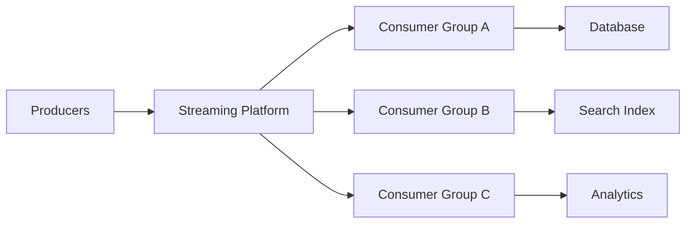
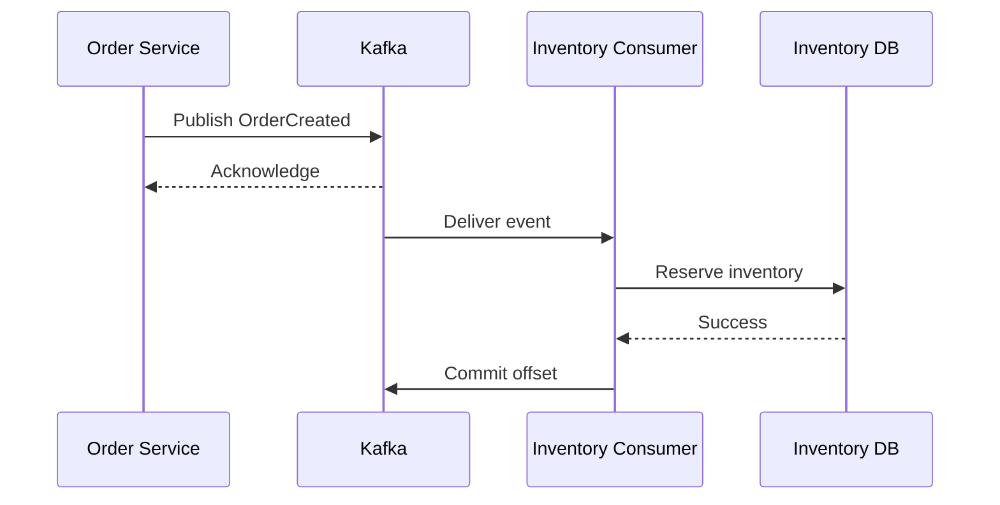

# 09- Streaming

## Overview

Streaming is a processing model where data is consumed and handled continuously as it becomes available rather than waiting for a complete dataset to accumulate.

A batch system typically follows:

```text
Collect data
     |
     v
Process later
     |
     v
Produce result
```

A streaming system follows:

```text
Producer
   |
   v
Event
   |
   v
Stream
   |
   +----> Consumer
   +----> Consumer
   +----> Consumer
```

Streaming is useful when a system needs low-latency processing, continuous data movement, event-driven behavior, or the ability to react to changes without waiting for a scheduled batch.

Common backend use cases include:

- Real-time notifications.
- Fraud detection.
- Order and payment events.
- Inventory updates.
- Log and telemetry processing.
- Metrics aggregation.
- Search indexing.
- Cache invalidation.
- CDC pipelines.
- Real-time analytics.
- Event-driven microservices.
- Activity feeds.
- IoT telemetry.

Kafka is a common infrastructure choice for high-throughput durable event streaming, while technologies such as Redis Streams, Amazon Kinesis, and managed Kafka services can serve different workload requirements.

## Streaming vs Batch Processing

| Characteristic | Batch | Streaming |
|---|---|---|
| Processing trigger | Schedule or accumulated dataset | Incoming data |
| Latency | Seconds to hours | Milliseconds to seconds |
| Data model | Dataset | Continuous event sequence |
| Throughput | High | Very high |
| State | Often bounded per run | Often continuously maintained |
| Replay | Depends on implementation | Strong with durable event logs |
| Failure recovery | Batch retry/checkpoint | Offset/checkpoint/replay |
| Typical tools | Airflow, Spark, Cron | Kafka, Kinesis, Flink |
| Operational complexity | Moderate | Higher |
| Best for | Historical processing | Continuous processing |

Streaming does not automatically mean real-time. A system can process events every few seconds and still be considered streaming.

The appropriate architecture depends on the required latency and consistency guarantees.

## Core Streaming Architecture

A production streaming system commonly contains:



The streaming platform decouples producers from consumers.

For example:

```text
Order Service
     |
     | OrderCreated
     v
   Kafka
     |
     +----> Notification Service
     |
     +----> Inventory Service
     |
     +----> Analytics Service
```

The producer does not need to know which downstream services consume the event.

## Why Streaming Exists

Synchronous service-to-service communication creates temporal and availability coupling.

For example:

```text
Order API
   |
   +----> Inventory API
   |
   +----> Payment API
   |
   +----> Notification API
   |
   v
Response
```

If one dependency becomes slow, the request may also become slow.

Streaming changes the interaction model:

```text
Order API
   |
   v
Publish OrderCreated
   |
   v
Return response

Kafka
 |
 +----> Inventory
 +----> Payment
 +----> Notification
```

This provides stronger decoupling.

However, asynchronous communication introduces its own complexity:

- Eventual consistency.
- Duplicate delivery.
- Ordering concerns.
- Replay.
- Consumer lag.
- Schema evolution.
- Operational monitoring.
- Failure recovery.

Streaming is therefore a trade-off, not a universal replacement for REST or gRPC.

## Events

An event represents something that has already happened.

Examples:

```text
OrderCreated
PaymentCompleted
UserRegistered
InvoiceGenerated
InventoryReserved
```

A typical event might look like:

```json
{
  "event_id": "8b7c2b8f-1b43-4b18-a7ef-1c8f5e8f3b20",
  "event_type": "OrderCreated",
  "event_version": 1,
  "occurred_at": "2026-08-23T12:30:00Z",
  "producer": "order-service",
  "payload": {
    "order_id": "ord_12345",
    "customer_id": "cus_9001",
    "total": 1499.00
  }
}
```

Important metadata commonly includes:

- Event ID.
- Event type.
- Event version.
- Producer.
- Timestamp.
- Correlation ID.
- Trace ID.
- Schema version.

Avoid placing unnecessary sensitive information into events because events may be retained for long periods and consumed by multiple systems.

## Event vs Command

An event states:

```text
Something happened.
```

A command states:

```text
Please perform this action.
```

| Event | Command |
|---|---|
| OrderCreated | CreateOrder |
| PaymentCompleted | ChargePayment |
| UserRegistered | SendWelcomeEmail |
| InventoryReserved | ReserveInventory |

Events generally represent facts.

Commands express intent.

This distinction becomes important when designing event-driven systems.

## Producer

A producer publishes events to the streaming platform.

Example using Python and Kafka:

```python
import json
from uuid import uuid4

from kafka import KafkaProducer


producer = KafkaProducer(
    bootstrap_servers=["kafka:9092"],
    value_serializer=lambda value: json.dumps(value).encode("utf-8"),
    acks="all",
    enable_idempotence=True,
)


event = {
    "event_id": str(uuid4()),
    "event_type": "OrderCreated",
    "event_version": 1,
    "payload": {
        "order_id": "ord_12345",
        "customer_id": "cus_9001",
    },
}

producer.send(
    "orders",
    key=event["payload"]["order_id"].encode("utf-8"),
    value=event,
)

producer.flush()
```

The exact producer configuration depends on the client library and Kafka deployment.

For production systems, producer reliability should be designed around:

- Acknowledgement level.
- Retries.
- Idempotence.
- Timeouts.
- Message size.
- Compression.
- Delivery semantics.

## Consumer

A consumer reads events and performs business logic.

```python
import json

from kafka import KafkaConsumer


consumer = KafkaConsumer(
    "orders",
    bootstrap_servers=["kafka:9092"],
    group_id="inventory-service",
    enable_auto_commit=False,
    value_deserializer=lambda value: json.loads(value.decode("utf-8")),
)

for message in consumer:
    event = message.value

    try:
        process_order_created(event)

        consumer.commit()
    except Exception:
        handle_failure(event)
```

The important production concern is not simply "consume the message".

The consumer must define:

- When the message is considered processed.
- What happens when processing fails.
- Whether processing is idempotent.
- How offsets are committed.
- How retries work.
- How poison messages are isolated.

## Streaming Data Flow

A typical Kafka-based flow is:



The important detail is that the producer acknowledgement and consumer processing acknowledgement are separate operations.

A successful publish does not mean that downstream business processing has completed.

## Topics

A Kafka topic is a logical stream of records.

Example:

```text
orders
payments
inventory
notifications
```

A topic can contain multiple partitions.

```text
orders
 |
 +---- Partition 0
 +---- Partition 1
 +---- Partition 2
 +---- Partition 3
```

Partitions provide parallelism and determine the unit of ordering.

## Partitions

Partitions are fundamental to Kafka scalability.

Suppose:

```text
Topic: orders
Partitions: 4
```

Events are distributed:

```text
Partition 0 → events
Partition 1 → events
Partition 2 → events
Partition 3 → events
```

Consumers in the same consumer group can process partitions in parallel.

```text
4 partitions
     |
     +---- Consumer A
     +---- Consumer B
     +---- Consumer C
     +---- Consumer D
```

The maximum useful consumer parallelism for a consumer group is bounded by the number of partitions.

If:

```text
Partitions = 4
Consumers = 20
```

at most four consumers can actively own partitions at a time.

## Choosing Partition Keys

The partition key affects:

- Ordering.
- Load distribution.
- Consumer parallelism.

Suppose order events use:

```text
key = order_id
```

All events for the same order can be routed to the same partition.

This provides ordering for that key.

For example:

```text
Order 123
 |
 +---- OrderCreated
 +---- PaymentCompleted
 +---- OrderShipped
```

can remain ordered within its partition.

However, using a poorly distributed key can create a hot partition.

Avoid keys with very low cardinality such as:

```text
country = "IN"
```

if most events belong to the same country.

## Ordering

Streaming systems generally provide limited ordering guarantees.

Kafka guarantees ordering within a partition, not across an entire topic.

Therefore:

```text
Partition 0:
A → B → C
```

is ordered.

But:

```text
Partition 0: A → C
Partition 1: B
```

does not provide a global:

```text
A → B → C
```

ordering guarantee.

If business correctness depends on ordering, partition related events using a stable key.

## Consumer Groups

A consumer group represents a logical application consuming a stream.

Example:

```text
orders topic
      |
      +---- notification-service group
      |
      +---- inventory-service group
      |
      +---- analytics-service group
```

Each group maintains its own consumption position.

This allows multiple independent applications to consume the same event stream.

Within a single consumer group:

```text
Partition 0 → Consumer A
Partition 1 → Consumer B
Partition 2 → Consumer C
```

A partition is assigned to only one consumer within the group at a time.

## Offset

An offset identifies a record's position within a partition.

Conceptually:

```text
Partition 0

offset 100 → event A
offset 101 → event B
offset 102 → event C
offset 103 → event D
```

A consumer tracks its progress.

If the consumer fails after processing offset 102, it can resume from the appropriate committed position.

Offsets are therefore critical for recovery and replay.

## Offset Commit Strategy

Two common approaches are:

### Commit Before Processing

```text
Read event
   |
   v
Commit offset
   |
   v
Process event
```

If the process crashes after committing but before processing, the event may be lost from the consumer's perspective.

### Commit After Processing

```text
Read event
   |
   v
Process event
   |
   v
Commit offset
```

If the process crashes after processing but before committing, the event may be processed again.

This produces an important principle:

> At-least-once delivery generally requires idempotent consumers.

## Consumer Lag

Consumer lag measures how far behind a consumer is relative to the latest available records.

Conceptually:

```text
Latest offset = 1,000,000
Consumer offset = 950,000

Lag = 50,000
```

Lag is one of the most important streaming health indicators.

Increasing lag can indicate:

- Consumer slowdown.
- Insufficient partitions.
- Database bottlenecks.
- External API latency.
- Consumer crashes.
- Rebalancing.
- Traffic spikes.

A consumer with low CPU can still have severe lag if it is blocked on I/O.

## Throughput

Streaming throughput is influenced by:

```text
Producer throughput
        |
        v
Broker capacity
        |
        v
Partition distribution
        |
        v
Consumer throughput
        |
        v
Downstream capacity
```

If consumers can process:

```text
10,000 events/sec
```

but producers generate:

```text
50,000 events/sec
```

backlog will grow.

The system needs one or more of:

- More partitions.
- More consumers.
- Faster consumers.
- More efficient processing.
- Backpressure.
- Traffic shaping.

## Backpressure

Backpressure prevents consumers or downstream dependencies from being overwhelmed.

Example:

```text
Kafka
  |
  v
Consumer
  |
  v
PostgreSQL
```

If PostgreSQL can safely process only 5,000 operations/sec, increasing consumers indefinitely is dangerous.

A healthy architecture respects downstream capacity:

```text
Kafka
  |
  v
Consumer Concurrency
  |
  v
Database Capacity
```

Streaming systems should be designed for controlled degradation rather than unlimited concurrency.

## Retry Strategies

A failed event can be retried.

However, immediate infinite retries are dangerous.

Bad:

```text
process event
   |
   X
   |
   v
retry immediately
   |
   X
   |
   v
retry immediately
```

This can create a retry storm.

Better:

```text
Failure
   |
   v
Retry with backoff
   |
   v
Retry
   |
   v
Retry limit
   |
   v
Dead Letter Queue / Error Topic
```

Use:

- Exponential backoff.
- Retry limits.
- Jitter.
- Failure classification.
- Dead-letter handling.

## Poison Messages

A poison message consistently fails because of:

- Invalid data.
- Unsupported schema.
- Business validation failure.
- Corrupt payload.
- Permanent downstream rejection.

Retrying it forever blocks useful processing or wastes resources.

Isolate poison messages after a bounded number of attempts.

```text
Kafka
 |
 v
Consumer
 |
 +---- success → continue
 |
 +---- transient failure → retry
 |
 +---- permanent failure → DLQ
```

## Idempotent Consumers

At-least-once delivery means duplicate processing can happen.

A consumer should therefore safely handle duplicates.

Example:

```sql
CREATE TABLE processed_events (
    event_id UUID PRIMARY KEY,
    processed_at TIMESTAMPTZ NOT NULL DEFAULT NOW()
);
```

Processing can use a transaction:

```sql
INSERT INTO processed_events (event_id)
VALUES (:event_id)
ON CONFLICT (event_id) DO NOTHING;
```

If the event already exists, the consumer knows the event was processed.

For business operations, the idempotency boundary should usually be aligned with the actual side effect.

## Transactional Side Effects

Consider:

```text
Consume event
   |
   v
Update PostgreSQL
   |
   X crash
   |
   v
Commit Kafka offset
```

If the database update succeeds but the offset is not committed, the event may be processed again.

Therefore, the database operation itself should be idempotent.

For stronger coordination between database changes and event publication, the transactional outbox pattern is commonly used.

## Transactional Outbox

Instead of:

```text
DB transaction
   |
   +---- update business data
   |
   +---- publish Kafka event
```

use:

```text
DB transaction
   |
   +---- update business data
   |
   +---- write outbox event
              |
              v
        Outbox Publisher
              |
              v
            Kafka
```

The business transaction and outbox write occur atomically.

Example:

```sql
BEGIN;

UPDATE orders
SET status = 'confirmed'
WHERE id = :order_id;

INSERT INTO outbox_events (
    event_id,
    event_type,
    aggregate_id,
    payload
)
VALUES (
    :event_id,
    'OrderConfirmed',
    :order_id,
    :payload
);

COMMIT;
```

A separate publisher reads the outbox and publishes to Kafka.

This prevents the classic failure:

```text
Database commit succeeds
Kafka publish fails
```

## Change Data Capture

Change Data Capture, or CDC, captures database changes and publishes them as events.

A common architecture is:

```text
PostgreSQL
    |
    v
Transaction Log
    |
    v
CDC Connector
    |
    v
Kafka
    |
    +----> Search
    +----> Analytics
    +----> Cache
    +----> Data Lake
```

CDC can reduce the need to manually publish application events for certain integration workloads.

However, CDC records database changes rather than necessarily representing business-level events.

For example:

```text
UPDATE orders SET status = 'paid'
```

is a database change.

It does not automatically mean:

```text
PaymentCompleted
```

Those semantics must be designed carefully.

## Event Schema Design

Events should have explicit contracts.

Example:

```json
{
  "event_id": "evt_123",
  "event_type": "OrderCreated",
  "event_version": 2,
  "occurred_at": "2026-08-23T12:30:00Z",
  "producer": "order-service",
  "payload": {
    "order_id": "ord_123",
    "customer_id": "cus_456",
    "currency": "INR",
    "total": 1499.0
  }
}
```

Schema design should consider:

- Backward compatibility.
- Forward compatibility.
- Required fields.
- Optional fields.
- Data types.
- Event versioning.
- Sensitive data.
- Consumer expectations.

Avoid changing an existing field's meaning without versioning.

## Schema Evolution

Suppose version 1 contains:

```json
{
  "customer_id": "123"
}
```

Version 2 adds:

```json
{
  "customer_id": "123",
  "customer_tier": "gold"
}
```

Adding optional fields is usually safer than changing existing fields incompatibly.

Potential strategies include:

- Explicit event versions.
- Schema Registry.
- Avro.
- Protobuf.
- JSON Schema.

For gRPC-based internal APIs, Protobuf already provides a strong schema model, but event contracts still require compatibility discipline.

## Serialization

Common event serialization formats include:

| Format | Strengths | Trade-offs |
|---|---|---|
| JSON | Human-readable, easy integration | Larger payloads |
| Avro | Compact, schema-driven | More infrastructure |
| Protobuf | Compact, strongly typed | Less human-readable |
| MessagePack | Compact | Less standardized ecosystem |

For internal high-throughput systems, binary formats can reduce payload size and serialization overhead.

For broad external integration, JSON may provide better interoperability.

## Event Size

Large events increase:

- Network bandwidth.
- Broker storage.
- Serialization cost.
- Consumer memory.
- Replication cost.
- Recovery time.

Avoid using an event as a data dump.

Prefer:

```json
{
  "event_type": "OrderCreated",
  "order_id": "ord_123"
}
```

when consumers can safely retrieve additional information.

However, relying excessively on synchronous database lookups can eliminate the benefits of event-driven processing.

The correct design depends on data ownership, availability, and consistency requirements.

## Event Retention

A durable streaming platform can retain events for a configured period.

For example:

```text
orders topic

Day 1 → events
Day 2 → events
Day 3 → events
...
```

Retention enables:

- Consumer recovery.
- Reprocessing.
- New consumers.
- Debugging.
- Backfilling.

Retention consumes storage.

Retention policy should be based on:

- Replay requirements.
- Compliance.
- Storage cost.
- Recovery objectives.
- Consumer recovery time.

## Replay

Replay means consuming historical events again.

A new service might need:

```text
All OrderCreated events
```

to build its initial state.

A replayable stream makes this possible.

However, replay can be dangerous if events trigger external side effects.

For example:

```text
OrderCreated
   |
   v
Send email
```

Replaying ten million events could send ten million emails again.

Consumers should distinguish between:

- Rebuilding state.
- Replaying side effects.

## Event Time vs Processing Time

Streaming systems often have at least two relevant timestamps.

### Event Time

When the event actually occurred.

```text
occurred_at = 12:00:00
```

### Processing Time

When the consumer processed it.

```text
processed_at = 12:00:07
```

The difference is processing latency:

```text
7 seconds
```

Late events make event-time processing more complex.

For analytics systems, windows should often be based on event time rather than processing time.

## Windowing

Streaming analytics frequently aggregate events into windows.

For example:

```text
12:00–12:01
12:01–12:02
12:02–12:03
```

Common window types include:

| Window | Description |
|---|---|
| Tumbling | Fixed, non-overlapping intervals |
| Sliding | Overlapping intervals |
| Session | Activity-based intervals |

Example:

```text
Count orders per minute
```

requires maintaining state for the current window.

Windowing becomes more complex when events arrive late or out of order.

## Stateful Stream Processing

Some streaming workloads require state.

Example:

```text
Events:
PaymentAttempt
PaymentAttempt
PaymentAttempt
```

The processor might maintain:

```text
customer_id → failed_attempt_count
```

State can be stored in:

- Local state stores.
- Redis.
- Kafka-backed state stores.
- Databases.
- Specialized stream processors.

Stateful processing introduces recovery and consistency considerations.

## Stream Processing vs Event Consumption

A simple consumer:

```text
Event
 |
 v
Process
 |
 v
Database
```

may be enough for many backend systems.

A stream processor performs more complex operations:

```text
Event Stream
     |
     v
Filter
     |
     v
Transform
     |
     v
Join
     |
     v
Aggregate
     |
     v
Window
     |
     v
Output Stream
```

Tools such as Kafka Streams, Apache Flink, and Spark Structured Streaming are designed for these workloads.

Do not introduce a distributed stream-processing framework when a simple consumer is sufficient.

## Streaming in Microservices

Streaming can reduce synchronous coupling.

Instead of:

```text
Order Service
   |
   +----HTTP----> Inventory
   |
   +----HTTP----> Notification
   |
   +----HTTP----> Analytics
```

use:

```text
Order Service
     |
     v
OrderCreated
     |
     v
Kafka
 |       |       |
 v       v       v
Inventory Notification Analytics
```

Each consumer can evolve independently.

However, event-driven microservices introduce eventual consistency.

For example:

```text
Order API response:
Order = CREATED

Inventory:
Order = PROCESSING

Analytics:
May not have received event yet
```

This is expected behavior and must be reflected in business workflows.

## Streaming and REST APIs

REST and streaming solve different problems.

A common architecture is:

```text
Client
  |
  v
REST API
  |
  v
Application Service
  |
  v
Kafka
  |
  +----> Async consumers
```

The REST API handles synchronous request/response interaction.

Kafka handles asynchronous propagation.

This hybrid architecture is common in production systems.

## Streaming and gRPC

gRPC supports streaming RPCs for direct service-to-service communication.

Common patterns include:

- Server streaming.
- Client streaming.
- Bidirectional streaming.

This differs from Kafka.

gRPC streaming is typically:

```text
Service A
   |
   | persistent RPC
   v
Service B
```

Kafka is:

```text
Producer
   |
   v
Durable event log
   |
   +----> Consumer A
   +----> Consumer B
```

gRPC provides direct communication.

Kafka provides durable decoupling and replay-oriented event distribution.

## Kafka vs Redis Streams vs SQS

| Feature | Kafka | Redis Streams | Amazon SQS |
|---|---|---|---|
| Primary model | Distributed event log | In-memory/data-structure stream | Managed message queue |
| Replay | Strong | Supported | Limited compared with Kafka |
| Ordering | Per partition | Stream order | FIFO available with FIFO queues |
| Consumer groups | Yes | Yes | Queue consumers |
| Long retention | Strong | Memory/storage dependent | Queue retention limits |
| Very high throughput | Excellent | Good | Excellent |
| Operational complexity | Higher | Moderate | Low |
| AWS integration | Via MSK/self-managed | Via Redis | Native |
| Best fit | Event streaming | Lightweight streams | Async work queues |

Use the simplest system that satisfies the requirements.

## Streaming Security

Streaming infrastructure often carries sensitive business data.

Security controls should include:

- TLS encryption.
- Authentication.
- Authorization.
- Network isolation.
- Least-privilege producer permissions.
- Least-privilege consumer permissions.
- Secret management.
- Audit logging.

For Kafka, access should be scoped to required topics and operations.

Avoid giving every service cluster-wide administrative privileges.

Sensitive fields should be minimized.

For example, avoid publishing:

```json
{
  "card_number": "..."
}
```

when a token or non-sensitive identifier is sufficient.

## High Availability

Production streaming infrastructure should avoid single points of failure.

For Kafka, this generally means:

- Multiple brokers.
- Replicated partitions.
- Appropriate replication factor.
- Failure-aware broker placement.
- Monitoring under-replicated partitions.
- Durable storage.
- Capacity headroom.

Consumers should also run multiple replicas where workload permits.

```text
Kafka
 |
 +---- Consumer A
 +---- Consumer B
 +---- Consumer C
```

Consumer group rebalancing allows work to continue when a consumer instance fails, subject to partition availability and processing semantics.

## Disaster Recovery

Streaming disaster recovery depends heavily on retention and replication strategy.

Possible approaches include:

- Multi-AZ deployment.
- Cross-region replication.
- Mirroring selected topics.
- Durable object-storage backups.
- Replay from source systems.
- Rebuilding derived state.

Do not assume that a replicated streaming cluster automatically provides complete disaster recovery.

Define:

```text
RPO
RTO
Retention
Replay strategy
Cross-region strategy
```

based on business requirements.

## Monitoring

Streaming systems require monitoring at multiple levels.

### Producer Metrics

Monitor:

- Publish rate.
- Publish latency.
- Error rate.
- Retry rate.
- Request latency.
- Message size.

### Broker Metrics

Monitor:

- CPU.
- Memory.
- Disk usage.
- Network throughput.
- Partition health.
- Under-replicated partitions.
- Request latency.

### Consumer Metrics

Monitor:

- Consumer lag.
- Processing latency.
- Error rate.
- Retry count.
- Rebalance frequency.
- Records processed.
- Records failed.

### Business Metrics

Technical metrics are not enough.

Monitor:

```text
Orders received
Orders processed
Payments completed
Failed payments
Inventory updates
```

A consumer can report healthy infrastructure metrics while business processing is broken.

## Consumer Lag Alerting

Lag should be evaluated relative to business SLA.

For example:

```text
Maximum acceptable processing delay = 30 seconds
```

An alert should be based on processing delay or lag growth rather than an arbitrary static number when possible.

A lag of 100,000 records might be harmless for a low-rate topic and catastrophic for a high-value transactional topic.

## Deployment Considerations

Streaming consumers should support graceful shutdown.

A deployment should approximately follow:

```text
Stop accepting new work
        |
        v
Finish current processing
        |
        v
Commit appropriate offset
        |
        v
Shutdown
```

Abrupt termination can increase duplicate processing or cause unnecessary rebalances.

For Kubernetes, configure appropriate:

- `terminationGracePeriodSeconds`.
- Readiness probes.
- Liveness probes.
- Resource requests.
- Resource limits.
- Pod disruption budgets.

## Scaling Consumers

Consumer scaling is constrained by partitions.

```text
Partitions = 12

Consumers = 3
→ 4 partitions/consumer

Consumers = 12
→ 1 partition/consumer

Consumers = 20
→ 8 consumers have no active partition
```

If more processing parallelism is required, increasing consumer replicas beyond the partition count does not solve the problem.

The system may require additional partitions.

Changing partition count later can also affect key distribution and ordering expectations, so partition planning matters.

## Hot Partitions

A bad partition key can create:

```text
Partition 0 → 80% traffic
Partition 1 → 5%
Partition 2 → 5%
Partition 3 → 10%
```

Even though the topic has four partitions, effective parallelism is much lower.

Monitor per-partition traffic rather than only aggregate throughput.

## Batch Consumption

Streaming consumers can process events individually or in small batches.

Individual:

```text
read → process → commit
read → process → commit
```

Batch:

```text
read 100
   |
   v
process 100
   |
   v
commit
```

Batch consumption can improve throughput by reducing:

- Network calls.
- Database round trips.
- Transaction overhead.

However, failure isolation becomes coarser.

If one record fails in a batch of 1,000, the system needs a strategy for determining which records were successfully processed.

## Database Writes from Streams

A common anti-pattern is:

```text
Kafka
 |
 v
Consumer
 |
 +---- INSERT
 +---- INSERT
 +---- INSERT
 +---- INSERT
```

with one database transaction per event.

At high throughput, database round trips can become the bottleneck.

Possible optimizations include:

- Consumer-side batching.
- Bulk inserts.
- Upserts.
- Connection pooling.
- Partition-aware processing.
- Asynchronous writes.

But database batching must remain compatible with correctness and failure semantics.

## Streaming and Caching

Streaming events can update Redis caches.

For example:

```text
ProductUpdated
      |
      v
Kafka
      |
      v
Cache Consumer
      |
      v
Redis
```

This avoids forcing every API request to rebuild or refresh cache state.

However, the cache may temporarily lag behind the source of truth.

Therefore, APIs must define acceptable consistency behavior.

## Streaming and Search Indexes

A common architecture is:

```text
PostgreSQL
     |
     v
Outbox / CDC
     |
     v
Kafka
     |
     v
Search Consumer
     |
     v
OpenSearch / Elasticsearch
```

This allows search indexes to be updated asynchronously.

The database remains the system of record while the search index becomes a derived representation.

## Common Mistakes

### Treating Kafka as a Database

Kafka is a durable event log, not a replacement for transactional business databases.

Do not use it as the primary system of record unless the architecture explicitly requires log-centric storage.

### Assuming Global Ordering

Kafka ordering is partition-scoped.

If the application requires ordering, define the ordering key and partition accordingly.

### Assuming Exactly-Once Processing

Exactly-once semantics are nuanced and do not automatically guarantee exactly-once external side effects.

Design idempotent consumers.

### Committing Offsets Too Early

Committing before processing can cause lost work after a crash.

Commit based on the actual processing guarantee.

### Infinite Retries

A poison message can cause a retry loop and consume excessive resources.

Use bounded retries and dead-letter handling.

### Ignoring Consumer Lag

A healthy broker does not mean consumers are healthy.

Monitor lag and processing latency.

### Too Few Partitions

Consumers cannot scale beyond available partitions.

Partition capacity should be planned before large traffic growth.

### Too Many Partitions Without Reason

Partitions have operational and resource costs.

Do not create excessive partitions without a scaling requirement.

### Poor Partition Key

A low-cardinality or skewed key can create hot partitions.

Measure distribution before selecting the key.

### Publishing Huge Events

Large messages increase network, storage, and processing costs.

Keep event payloads focused.

### Breaking Event Schemas

Consumers may deploy independently.

Schema changes must preserve compatibility or use explicit versioning.

### Doing Slow Work in the Consumer Thread

Blocking on slow external APIs can cause lag.

Use appropriate concurrency, asynchronous I/O, worker pools, or architectural decoupling.

### No Idempotency

At-least-once delivery makes duplicate processing normal.

Business effects should be safely repeatable.

### No Replay Strategy

If a derived database becomes corrupted, rebuilding it may be impossible without retained events or another durable source.

### No Backpressure

Unbounded concurrency can transfer pressure from Kafka into PostgreSQL, Redis, or external APIs.

## Interview Considerations

### How would you design a system processing one million events per second?

Discuss:

- Partition count.
- Producer throughput.
- Consumer groups.
- Horizontal scaling.
- Partition distribution.
- Network capacity.
- Serialization.
- Compression.
- Broker replication.
- Consumer lag.
- Downstream bottlenecks.
- Failure recovery.

### How do you guarantee ordering?

Define the scope first.

If ordering is required per order:

```text
partition_key = order_id
```

Then all events for that order are routed to the same partition.

Do not promise global ordering unless the architecture actually provides it.

### What happens if a consumer crashes?

A consumer group reassigns its partitions.

The replacement consumer resumes from the last committed offset.

If processing occurred before the offset commit, the event may be processed again.

Therefore, the consumer must be idempotent.

### How do you handle poison messages?

Use:

```text
Retry
  |
  v
Backoff
  |
  v
Retry limit
  |
  v
DLQ / error topic
```

Then monitor and remediate the underlying issue.

### How do you guarantee database and Kafka consistency?

Use patterns such as:

- Transactional outbox.
- Idempotent consumers.
- CDC.
- Kafka transactions where the complete operation remains inside the supported transactional boundary.

Do not assume a distributed transaction exists between arbitrary databases and Kafka.

## Production Checklist

### Architecture

- [ ] Streaming technology matches throughput and durability requirements.
- [ ] Producers and consumers are decoupled.
- [ ] Topics have clear ownership.
- [ ] Partition strategy is explicit.
- [ ] Consumer groups are defined per logical application.
- [ ] Event contracts are documented.

### Reliability

- [ ] Consumer processing is idempotent.
- [ ] Offset management is deliberate.
- [ ] Retries are bounded.
- [ ] Backoff and jitter are used where appropriate.
- [ ] Poison messages are isolated.
- [ ] Replay is supported where required.
- [ ] Graceful shutdown is implemented.

### Scalability

- [ ] Partition count supports expected consumer parallelism.
- [ ] Partition keys distribute traffic evenly.
- [ ] Consumer concurrency is bounded.
- [ ] Downstream systems can handle peak throughput.
- [ ] Consumer lag is monitored.
- [ ] Capacity headroom exists.

### Data

- [ ] Event schemas are versioned.
- [ ] Compatibility rules are defined.
- [ ] Event payloads are appropriately sized.
- [ ] Sensitive information is minimized.
- [ ] Retention matches replay requirements.
- [ ] Event-time semantics are defined where required.

### Observability

- [ ] Producer errors are monitored.
- [ ] Consumer lag is monitored.
- [ ] Processing latency is measured.
- [ ] Rebalance frequency is monitored.
- [ ] Retry and DLQ rates are tracked.
- [ ] Business-level processing metrics exist.
- [ ] Alerts are tied to business SLAs.

### Security

- [ ] TLS is enabled.
- [ ] Producers and consumers authenticate.
- [ ] Topic permissions use least privilege.
- [ ] Secrets are stored securely.
- [ ] Network access is restricted.
- [ ] Sensitive event fields are minimized.
- [ ] Audit requirements are addressed.

### Disaster Recovery

- [ ] Streaming data has appropriate replication.
- [ ] Retention is sufficient for recovery.
- [ ] Cross-region strategy is defined where required.
- [ ] Derived state can be rebuilt.
- [ ] Replay procedures have been tested.
- [ ] RPO and RTO are explicitly defined.

## Key Takeaways

- **Streaming continuously processes data as it arrives and is primarily valuable when low latency, decoupling, replayability, or continuous computation matters.**
- **Partitioning and consumer groups determine practical Kafka scalability; ordering is normally guaranteed within a partition, not globally.**
- **At-least-once processing is common, so idempotent consumers, deliberate offset management, bounded retries, and dead-letter handling are essential.**
- **Backpressure, consumer lag, downstream capacity, schema evolution, and replay are first-class production concerns rather than implementation details.**
- **Use streaming where its operational complexity is justified; REST, gRPC, queues, batch processing, and streaming each solve different communication and processing problems.**