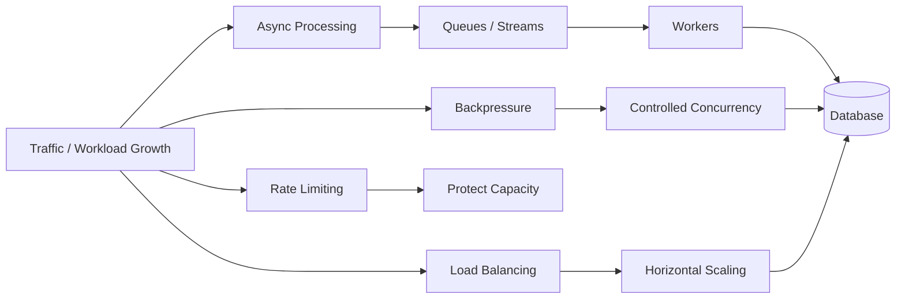
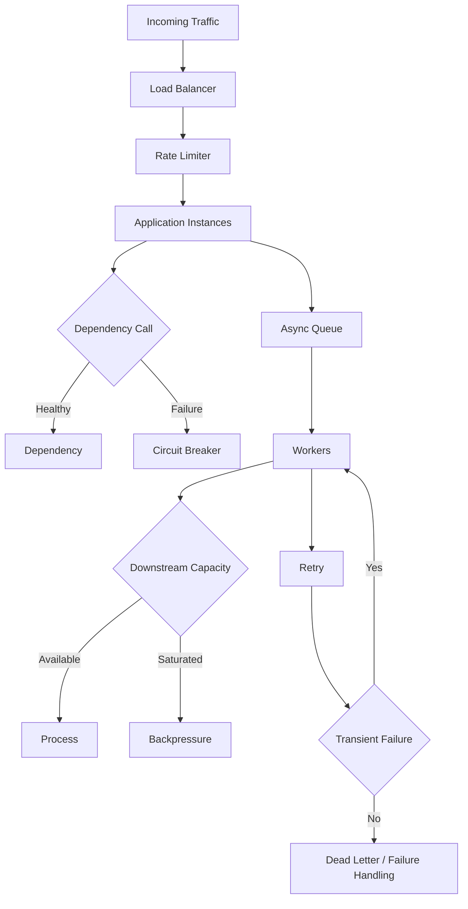
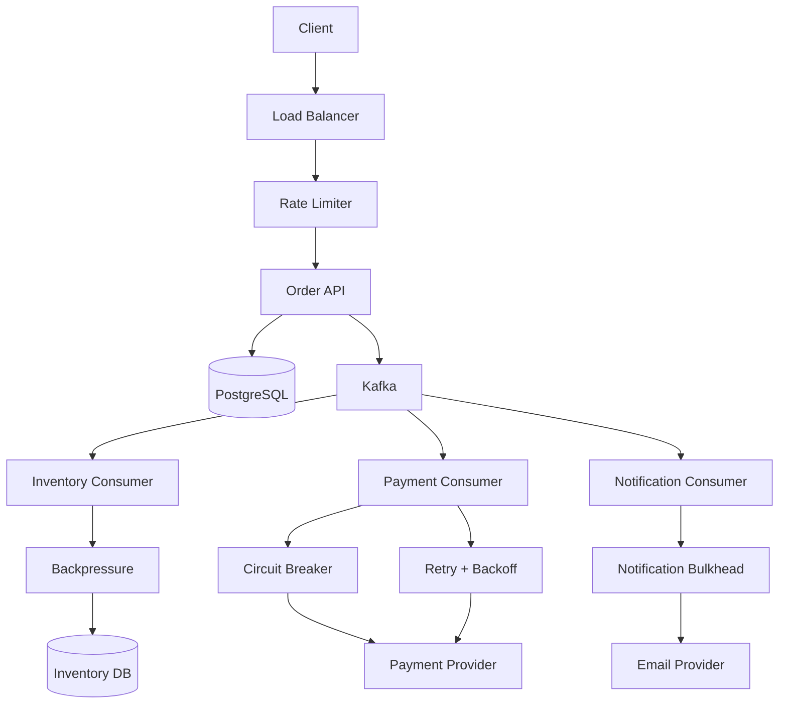
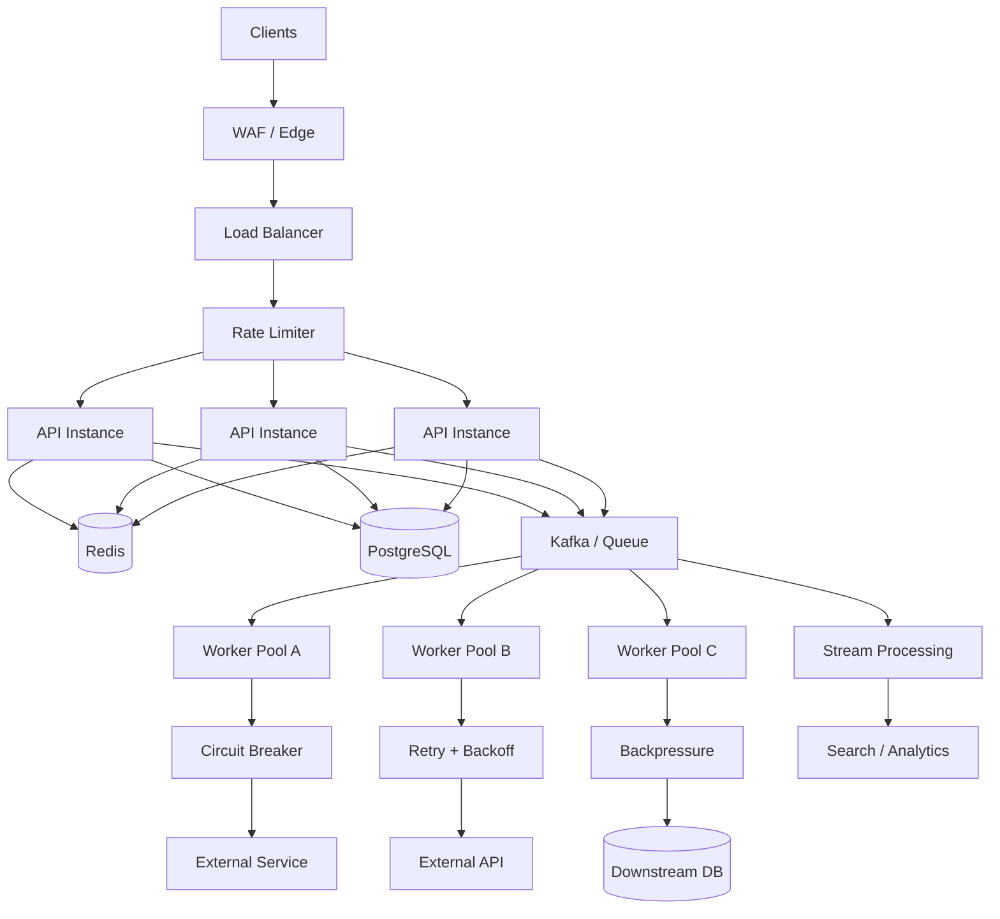

# 10- Summary

## Overview

Scalability patterns are architectural techniques used to increase system capacity, maintain predictable performance, isolate failures, and continue serving users as traffic, data volume, and workload complexity grow.

Scalability is not simply "adding more servers." A production system must identify the actual bottleneck and apply the appropriate mechanism:



The major scalability patterns covered in this section are complementary. A mature architecture typically combines several of them rather than selecting only one.

## Scalability Patterns at a Glance

| Pattern | Primary Problem | Main Mechanism | Typical Technologies |
|---|---|---|---|
| Load Balancing | Distributing traffic | Route requests across instances | AWS ALB, Nginx, Kubernetes Service |
| Rate Limiting | Excessive request volume | Limit requests per identity/resource | Redis, API Gateway, Nginx |
| Circuit Breaker | Failing dependencies | Temporarily stop calls to unhealthy services | Application libraries, service mesh |
| Retry | Transient failures | Retry failed operations | Python libraries, Celery, SDKs |
| Bulkhead | Failure/resource isolation | Separate capacity into independent pools | Kubernetes, worker pools |
| Backpressure | Producer overwhelms consumer | Control work admission | Queues, semaphores, Kafka |
| Async Processing | Slow/non-critical work | Move work outside request path | Celery, Kafka, SQS |
| Batch Processing | Per-item processing overhead | Process multiple items together | SQL bulk operations, Spark |
| Streaming | Continuous data processing | Process events as they arrive | Kafka, Kinesis, Redis Streams |

## The Core Relationship Between Patterns

These patterns solve different failure and scalability dimensions.



A robust backend often uses the patterns together:

```text
Client
  |
  v
Load Balancer
  |
  v
Rate Limiter
  |
  v
API Service
  |
  +---- synchronous request ----> Database
  |
  +---- async event -----------> Kafka / Queue
                                  |
                                  v
                                Worker
                                  |
                                  +---- Retry
                                  |
                                  +---- Circuit Breaker
                                  |
                                  +---- Bulkhead
                                  |
                                  +---- Backpressure
```

The important architectural skill is understanding **where each control belongs**.

## Load Balancing

Load balancing distributes incoming requests across multiple backend instances.

```text
                 +----> API Instance A
                 |
Client --> Load Balancer
                 |
                 +----> API Instance B
                 |
                 +----> API Instance C
```

It enables horizontal scaling and prevents one instance from becoming the sole capacity bottleneck.

### Common Strategies

| Strategy | Behavior | Typical Use |
|---|---|---|
| Round Robin | Rotate across instances | Similar-capacity instances |
| Least Connections | Prefer fewer active connections | Long-lived requests |
| Weighted | Route according to configured weights | Unequal capacity |
| IP Hash | Consistent client-to-instance mapping | Limited affinity requirements |
| Consistent Hashing | Stable mapping with minimal redistribution | Distributed caches |

In cloud environments, load balancing is often provided by managed services such as AWS Application Load Balancer or Kubernetes networking primitives.

### Production Considerations

Stateless application instances make load balancing substantially easier.

Avoid storing critical session state exclusively in local process memory:

```text
Request 1 → Instance A → local session
Request 2 → Instance B → session missing
```

Prefer shared state such as:

- PostgreSQL.
- Redis.
- Signed client-side tokens.
- Dedicated session stores.

Health checks must verify meaningful application health rather than only whether a process is alive.

## Rate Limiting

Rate limiting protects a system from excessive request volume.

Typical policies include:

```text
100 requests/minute/user
1,000 requests/minute/IP
10 requests/second/API key
```

Rate limiting protects:

- CPU.
- Memory.
- Database connections.
- External API quotas.
- Expensive business operations.

A common architecture is:

```text
Client
  |
  v
Nginx / API Gateway
  |
  v
Redis Rate Limiter
  |
  v
Application
```

Common algorithms include:

| Algorithm | Characteristics |
|---|---|
| Fixed Window | Simple but boundary bursts are possible |
| Sliding Window | More accurate traffic control |
| Token Bucket | Supports controlled bursts |
| Leaky Bucket | Smooths traffic rate |

Rate limiting should generally be applied before expensive application work.

A Redis-backed implementation can provide shared state across horizontally scaled API instances.

### Important Distinction

Rate limiting controls **how much work enters the system**.

Backpressure controls **how much work downstream components can safely accept**.

They are related but not interchangeable.

## Circuit Breaker

A circuit breaker prevents repeated calls to a failing dependency.

Without one:

```text
API
 |
 +----> Payment Service X
 +----> Payment Service X
 +----> Payment Service X
 +----> Payment Service X
```

If the dependency is unhealthy, every request continues consuming resources while waiting for failure.

A circuit breaker introduces states:

```text
CLOSED
  |
  | failures exceed threshold
  v
OPEN
  |
  | recovery timeout
  v
HALF-OPEN
  |
  +---- success ---> CLOSED
  |
  +---- failure ---> OPEN
```

### Purpose

The circuit breaker:

- Fails fast.
- Protects application resources.
- Prevents cascading failures.
- Gives dependencies time to recover.

It should generally be combined with timeouts.

A circuit breaker without a timeout is insufficient because calls may still remain blocked waiting for network operations.

### Production Considerations

Configure:

- Failure threshold.
- Failure window.
- Open duration.
- Half-open probe count.
- Timeout.
- Which failures count as dependency failures.

Do not trip the circuit for every HTTP 4xx response. Many 4xx responses represent valid business outcomes rather than dependency health failures.

## Retry Pattern

Retries handle transient failures such as:

- Temporary network errors.
- Connection resets.
- Timeouts.
- Temporary service unavailability.
- Rate-limit responses when retry semantics are explicitly supported.

A production retry policy commonly uses:

```text
Attempt 1
   |
   v
Failure
   |
   v
Backoff + Jitter
   |
   v
Attempt 2
   |
   v
Failure
   |
   v
Backoff + Jitter
   |
   v
Attempt 3
```

Exponential backoff reduces synchronized retry pressure.

Jitter prevents many clients from retrying simultaneously.

### Retry Safety

Retries are safe only when the operation is retryable.

For example:

```text
GET /orders/123
```

is generally easier to retry than:

```text
POST /payments
```

unless the payment operation has a reliable idempotency mechanism.

A retry can otherwise duplicate side effects.

### Retry and Circuit Breaker

Retries and circuit breakers complement each other.

```text
Request
  |
  v
Circuit Breaker
  |
  +---- OPEN ---> Fail Fast
  |
  +---- CLOSED
          |
          v
       Request
          |
          X
          |
          v
       Retry
```

Do not configure aggressive retries together with a large circuit-breaker threshold. That can multiply load during an outage.

## Bulkhead Pattern

The bulkhead pattern isolates resources so that failure in one workload does not consume all system capacity.

For example:

```text
Application
 |
 +---- Payment Worker Pool
 |
 +---- Email Worker Pool
 |
 +---- Reporting Worker Pool
```

If reporting becomes extremely slow, it should not consume every worker and prevent payment processing.

The pattern can be implemented using:

- Separate worker pools.
- Separate thread pools.
- Separate connection pools.
- Kubernetes resource limits.
- Separate queues.
- Separate service instances.

### Example

Without isolation:

```text
100 workers
 |
 +---- Payments
 +---- Emails
 +---- Reports
```

A large reporting backlog could consume all 100 workers.

With bulkheads:

```text
100 workers
 |
 +---- 40 Payment workers
 +---- 30 Email workers
 +---- 30 Reporting workers
```

The allocation should reflect business priority and actual workload behavior.

## Backpressure

Backpressure prevents a fast producer from overwhelming a slower consumer.

```text
Producer
   |
   v
Queue
   |
   v
Consumer
   |
   v
Slow Database
```

If the database can process only 5,000 operations/second while the producer generates 20,000 operations/second, unlimited concurrency will eventually exhaust resources.

Backpressure mechanisms include:

- Bounded queues.
- Semaphore limits.
- Consumer concurrency limits.
- Queue depth thresholds.
- Rate-based admission control.
- Kafka consumer pacing.
- HTTP `429` responses.
- Load shedding.

### Backpressure vs Rate Limiting

| Mechanism | Protects Against | Control Point |
|---|---|---|
| Rate Limiting | Excessive incoming traffic | Entry point |
| Backpressure | Downstream saturation | Processing pipeline |
| Circuit Breaker | Dependency failure | Dependency boundary |
| Bulkhead | Resource exhaustion | Resource pool |

## Async Processing

Async processing removes slow or non-critical work from the synchronous request path.

Instead of:

```text
HTTP Request
 |
 +---- Save DB
 +---- Send Email
 +---- Generate PDF
 +---- Call Analytics
 |
 v
Response
```

use:

```text
HTTP Request
 |
 +---- Save DB
 |
 +---- Publish Job
 |
 v
Response

Queue
 |
 v
Worker
 |
 +---- Email
 +---- PDF
 +---- Analytics
```

This reduces API latency and isolates expensive workloads.

Common technologies include:

- Celery.
- Kafka.
- Amazon SQS.
- Redis Streams.
- AWS Lambda.
- Kubernetes workers.

The choice depends on whether the workload needs task semantics, event streaming, replay, scheduling, or high-throughput processing.

## Batch Processing

Batch processing groups multiple operations together.

Instead of:

```text
INSERT row
INSERT row
INSERT row
INSERT row
```

a system may perform a bulk operation.

Batching can reduce:

- Network round trips.
- Transaction overhead.
- Serialization overhead.
- Database connection pressure.

Example:

```text
1,000 events
      |
      v
Batch
      |
      v
Bulk database operation
```

Batching is particularly useful for:

- ETL.
- Data imports.
- Reporting.
- Large database updates.
- Search indexing.
- Analytics.

Batch size should be bounded.

A huge batch can increase:

- Memory usage.
- Transaction duration.
- Lock duration.
- Failure recovery cost.

## Streaming

Streaming processes data continuously as it arrives.

```text
Producer
   |
   v
Kafka
   |
   +----> Consumer A
   +----> Consumer B
   +----> Consumer C
```

Streaming is appropriate when the system needs:

- Low-latency event processing.
- Continuous aggregation.
- Event-driven microservices.
- Replay.
- High-throughput event distribution.

Kafka partitions provide parallelism:

```text
Topic
 |
 +---- Partition 0
 +---- Partition 1
 +---- Partition 2
 +---- Partition 3
```

Consumer groups allow multiple instances to process partitions concurrently.

### Streaming Production Requirements

A production streaming system should account for:

- Partition strategy.
- Consumer groups.
- Offset management.
- Idempotency.
- Consumer lag.
- Schema evolution.
- Retry handling.
- Dead-letter processing.
- Replay.
- Retention.
- Backpressure.

## Choosing Between Async Processing, Batch, and Streaming

| Requirement | Async Task | Batch | Streaming |
|---|---:|---:|---:|
| Immediate response required | No | No | No |
| Continuous event processing | Limited | No | Yes |
| Scheduled large workload | Limited | Excellent | Limited |
| Replay historical events | Depends | Depends | Excellent |
| Simple background job | Excellent | Limited | Often excessive |
| High-throughput events | Good | Good | Excellent |
| Event-driven microservices | Good | No | Excellent |
| Large data transformation | Limited | Excellent | Excellent |
| Operational complexity | Low–Moderate | Moderate | High |

Do not use Kafka merely because the application has asynchronous work.

A simple Celery task or SQS queue may be a better architectural choice.

## Combining the Patterns

The strongest architectures combine patterns around specific failure modes.

Consider an order-processing platform:



Each pattern has a specific responsibility:

| Component | Pattern | Responsibility |
|---|---|---|
| Load Balancer | Load balancing | Distribute requests |
| Rate Limiter | Rate limiting | Protect entry point |
| Kafka | Async/streaming | Decouple workloads |
| Payment consumer | Retry | Handle transient failures |
| Payment integration | Circuit breaker | Stop calls during outages |
| Worker pools | Bulkhead | Isolate workloads |
| Database consumer | Backpressure | Respect downstream capacity |
| Kafka partitions | Streaming scalability | Parallelize processing |

## Failure Isolation

Scalability is strongly connected to failure isolation.

A system should prevent one degraded component from consuming resources required by unrelated workloads.

```text
                 Application
                     |
        +------------+------------+
        |            |            |
        v            v            v
     Payments      Email       Reporting
        |            |            |
     Bulkhead      Bulkhead     Bulkhead
        |            |            |
        v            v            v
   Payment API   Email API     Analytics
```

This prevents a reporting outage from becoming a payment outage.

The goal is not merely high throughput.

The goal is **predictable behavior under stress and failure**.

## Capacity Planning

Before selecting a scalability pattern, quantify the workload.

Important dimensions include:

- Requests per second.
- Peak requests per second.
- Average request latency.
- Payload size.
- Database operations per request.
- Concurrent requests.
- Queue arrival rate.
- Queue processing rate.
- Storage growth.
- Network bandwidth.
- External API quotas.

For a queue:

```text
Arrival rate = λ
Service rate = μ
```

If:

```text
λ > μ
```

backlog grows continuously.

No retry strategy or additional queue configuration can make that sustainable.

The system needs increased processing capacity, reduced workload, or controlled admission.

## Horizontal vs Vertical Scaling

### Vertical Scaling

Increase resources on an instance:

```text
4 CPU / 8 GB
     |
     v
16 CPU / 32 GB
```

Advantages:

- Simple.
- Often requires fewer instances.
- Useful for stateful workloads.

Limitations:

- Hardware limits.
- Larger failure domain.
- Potentially higher cost.
- Scaling may require replacement or restart.

### Horizontal Scaling

Add instances:

```text
Instance A
Instance B
Instance C
Instance D
```

Advantages:

- Better fault tolerance.
- Elastic capacity.
- Works well with stateless services.
- Enables rolling deployments.

Limitations:

- Requires load distribution.
- Shared state must be externalized.
- More operational complexity.

Most cloud-native stateless API systems favor horizontal scaling.

## Database Bottlenecks

Application scaling does not automatically scale the database.

For example:

```text
1 API instance
    |
    v
PostgreSQL

10 API instances
    |
    v
PostgreSQL
```

Ten application instances can produce ten times the database pressure.

Common database scaling techniques include:

- Query optimization.
- Proper indexes.
- Connection pooling.
- Read replicas.
- Caching.
- Partitioning.
- Sharding.
- Batch operations.
- Asynchronous writes.

A database often becomes the true bottleneck before application CPU does.

## Connection Pooling

Every application instance should avoid creating unbounded database connections.

Suppose:

```text
100 API instances
×
50 DB connections
=
5,000 potential connections
```

If PostgreSQL safely supports only a much smaller workload, scaling API instances can make the system less reliable.

Connection pools must be sized based on:

- Database capacity.
- Query latency.
- Application concurrency.
- Number of application replicas.
- Pooling architecture.

More connections do not necessarily mean more throughput.

## Caching and Scalability

Caching reduces repeated expensive operations.

```text
Client
  |
  v
API
  |
  v
Redis
  |
  +---- hit ---> Response
  |
  +---- miss --> PostgreSQL
```

Caching can reduce:

- Database load.
- Network latency.
- CPU usage.
- Repeated computation.

But caches introduce:

- Stale data.
- Invalidation complexity.
- Memory cost.
- Cache stampedes.
- Consistency trade-offs.

Caching should be applied to measurable bottlenecks rather than used indiscriminately.

## Reliability Patterns Must Be Composed Carefully

Individual resilience mechanisms can interact badly.

For example:

```text
Rate Limiter
    |
Retry
    |
Circuit Breaker
    |
Load Balancer
```

Poor configuration can amplify traffic.

Consider:

```text
100 clients
×
3 retries
×
5 backend dependencies
```

A failure can create a large amount of additional traffic.

This is why senior-level system design focuses on **failure amplification** rather than simply adding resilience mechanisms.

## Observability

Scalability patterns require measurable signals.

At minimum, monitor:

| Area | Metrics |
|---|---|
| API | RPS, latency, errors |
| Load Balancer | Target health, latency, rejected requests |
| Rate Limiter | Allowed, rejected, throttled requests |
| Circuit Breaker | Open/closed state, failures |
| Retry | Attempts, exhausted retries |
| Queue | Depth, age, throughput |
| Kafka | Consumer lag, partition health |
| Workers | Utilization, task latency |
| Database | CPU, connections, locks, query latency |
| Redis | Memory, hit ratio, latency |

Distributed tracing should connect:

```text
HTTP Request
    |
    v
Service A
    |
    v
Kafka / Queue
    |
    v
Worker
    |
    v
Database
```

Correlation IDs and trace IDs become especially important once asynchronous boundaries are introduced.

## Security Considerations

Scalability mechanisms must not weaken security.

Important controls include:

- Authenticate API clients before applying identity-based quotas.
- Avoid trusting arbitrary client-supplied identity headers.
- Apply authorization independently of rate limiting.
- Protect internal queues and brokers.
- Encrypt traffic between services.
- Restrict administrative access.
- Store credentials in managed secret stores.
- Avoid sensitive information in event payloads.
- Audit access to high-value messaging infrastructure.

A rate limit is not an authorization mechanism.

A circuit breaker is not a security boundary.

A queue is not a trusted storage location merely because it is internal.

## Cost Considerations

Scaling improves capacity but increases cost.

Cost drivers include:

- More compute instances.
- More load balancer capacity.
- Redis memory.
- Kafka partitions and broker capacity.
- Message retention.
- Database replicas.
- Cross-AZ traffic.
- Cross-region replication.
- Increased observability volume.

A scalable design should optimize for:

```text
Required capacity
+
Reliability target
+
Latency target
+
Operational simplicity
```

rather than maximum theoretical throughput.

Over-provisioning every component can produce a system that is expensive without being meaningfully more reliable.

## Disaster Recovery

Scalability and disaster recovery are related but distinct concerns.

A horizontally scaled service can still lose all capacity if its region becomes unavailable.

Production systems should define:

- RPO.
- RTO.
- Multi-AZ requirements.
- Multi-region requirements.
- Backup strategy.
- Data replication.
- Queue/event retention.
- Replay strategy.
- Recovery procedures.

Recovery procedures should be tested.

An architecture diagram showing a second region is not a disaster recovery strategy by itself.

## Common Architectural Mistakes

### Scaling the Application Before Finding the Bottleneck

If PostgreSQL is saturated, adding API replicas may increase database pressure.

Measure first.

### Unlimited Retries

Retries can turn a small dependency outage into a system-wide traffic storm.

Use bounded retries and exponential backoff with jitter.

### No Resource Isolation

One workload can consume all CPU, threads, connections, or workers.

Use bulkheads and explicit concurrency limits.

### Unbounded Queues

A queue can hide a capacity problem until storage or latency becomes unacceptable.

Monitor queue depth and message age.

### Treating Async as Free Scalability

Asynchronous processing reduces request latency but does not eliminate computational work.

The work still consumes:

- CPU.
- Memory.
- Database capacity.
- Network bandwidth.

### Adding Kafka for Every Background Job

Kafka is powerful but operationally expensive compared with simpler queue systems.

Use it when durable event streaming, replay, high throughput, or multiple independent consumers justify it.

### Ignoring Downstream Capacity

A worker pool can scale faster than its database or external API dependency.

The bottleneck simply moves.

### Using Too Many Resilience Mechanisms Without Modeling Their Interaction

Retries, queues, rate limits, load balancers, and circuit breakers can interact in unexpected ways.

Model failure propagation and traffic amplification.

## Interview Decision Framework

When asked to scale a backend system, use a structured approach.

### Identify the Bottleneck

Ask:

```text
What is saturated?
CPU?
Memory?
Database?
Network?
External API?
Queue?
Disk?
```

### Define the Scaling Objective

Clarify:

- Throughput.
- Latency.
- Availability.
- Cost.
- Data volume.
- Geographic distribution.

### Apply the Appropriate Pattern

| Problem | First Pattern to Consider |
|---|---|
| Too many incoming requests | Rate limiting |
| Multiple API instances needed | Load balancing |
| Dependency outage | Circuit breaker |
| Temporary dependency failure | Retry |
| One workload starving another | Bulkhead |
| Consumer slower than producer | Backpressure |
| Slow non-critical request work | Async processing |
| Large periodic dataset | Batch processing |
| Continuous event processing | Streaming |
| Repeated expensive reads | Caching |

### Verify the Secondary Effects

After choosing a pattern, ask:

```text
What becomes the next bottleneck?
```

For example:

```text
Scale API
   |
   v
Database saturates
   |
   v
Add caching
   |
   v
Cache stampede
   |
   v
Add request coalescing
```

Senior system design is largely about understanding these second-order effects.

## Production Design Principles

### Prefer Bounded Resources

Every important resource should have an intentional limit:

- Worker concurrency.
- Database connections.
- Queue depth.
- Request rate.
- Retry count.
- Message size.
- Batch size.
- Cache memory.

Unbounded systems eventually become unstable under pathological load.

### Prefer Graceful Degradation

When capacity is insufficient, a system should degrade predictably.

Examples:

```text
Disable recommendations
        |
        v
Continue checkout
```

or:

```text
Return cached data
        |
        v
Avoid unavailable analytics dependency
```

Not every feature needs to remain available for the core business transaction to succeed.

### Protect the Critical Path

Separate critical work from optional work.

```text
Checkout
 |
 +---- Payment       ← Critical
 +---- Inventory     ← Critical
 +---- Email         ← Async
 +---- Analytics     ← Async
 +---- Recommendations ← Optional
```

This reduces the blast radius of secondary failures.

### Make Side Effects Idempotent

Retries, duplicate messages, consumer restarts, and replay can all cause repeated execution.

Use:

- Idempotency keys.
- Unique constraints.
- Deduplication tables.
- Upserts.
- Transactional state transitions.

### Measure Before Optimizing

Use:

```text
Metrics
+
Logs
+
Tracing
+
Load Testing
+
Profiling
```

to identify bottlenecks.

Do not assume that the slowest-looking component is the actual system bottleneck.

## Reference Architecture

A production-oriented scalable backend can combine the patterns as follows:



The architecture is scalable because capacity is distributed across multiple independently controlled components.

It is resilient because failures can be contained rather than propagated across the entire system.

It remains operationally manageable only if every boundary has explicit limits, monitoring, ownership, and failure semantics.

## Key Takeaways

- **Scalability is a bottleneck-management problem: identify the limiting resource before adding capacity or introducing architectural complexity.**
- **Load balancing, rate limiting, circuit breakers, retries, bulkheads, backpressure, async processing, batching, and streaming solve different failure and capacity problems and are often composed together.**
- **Production scalability requires bounded resources, idempotent side effects, controlled concurrency, graceful degradation, and explicit protection of critical business paths.**
- **Every scaling decision creates secondary effects; increasing application capacity can simply move the bottleneck to PostgreSQL, Redis, Kafka, external APIs, network capacity, or another downstream dependency.**
- **Senior-level system design focuses not only on peak throughput but also on failure isolation, observability, recovery, cost, operational complexity, and predictable behavior under stress.**