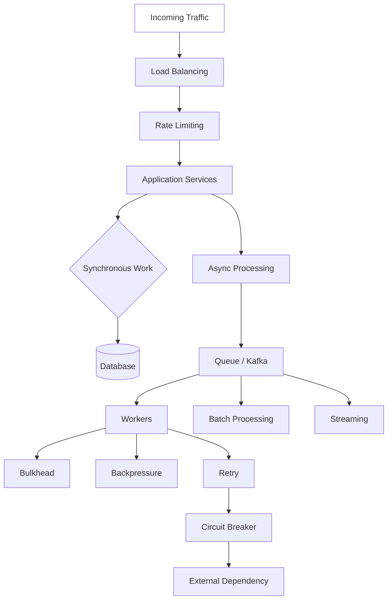
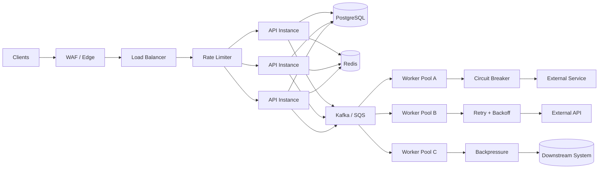

# README

## Overview

This section covers the core scalability patterns used to increase system capacity, control resource consumption, isolate failures, and maintain predictable behavior under increasing traffic and workload pressure.

The material progresses from request-level scalability mechanisms to distributed processing patterns and focuses on how these patterns interact in production backend systems.

## Topics

| File | Topic | Focus |
|---|---|---|
| [01- Load Balancing.md](./01-%20Load%20Balancing.md) | Load Balancing | Distributing traffic across healthy application instances and enabling horizontal scaling |
| [02- Rate Limiting.md](./02-%20Rate%20Limiting.md) | Rate Limiting | Controlling request volume and protecting application and downstream capacity |
| [03- Circuit Breaker.md](./03-%20Circuit%20Breaker.md) | Circuit Breaker | Preventing cascading failures when downstream dependencies become unhealthy |
| [04- Retry Pattern.md](./04-%20Retry%20Pattern.md) | Retry Pattern | Handling transient failures with bounded retries, backoff, and jitter |
| [05- Bulkhead Pattern.md](./05-%20Bulkhead%20Pattern.md) | Bulkhead Pattern | Isolating resources and preventing one workload from exhausting shared capacity |
| [06- Backpressure.md](./06-%20Backpressure.md) | Backpressure | Controlling producers when downstream consumers cannot keep up |
| [07- Async Processing.md](./07-%20Async%20Processing.md) | Async Processing | Moving slow or non-critical work outside the synchronous request path |
| [08- Batch Processing.md](./08-%20Batch%20Processing.md) | Batch Processing | Processing groups of records efficiently to reduce per-operation overhead |
| [09- Streaming.md](./09-%20Streaming.md) | Streaming | Processing continuous event flows with low latency and high throughput |
| [10- Summary.md](./10-%20Summary.md) | Summary | Consolidated scalability principles, patterns, trade-offs, and production guidance |

## Pattern Map



## How the Patterns Relate

These patterns solve different scalability and reliability problems and are commonly combined.

| Problem | Primary Pattern | Supporting Patterns |
|---|---|---|
| Too much incoming traffic | Rate Limiting | Load Balancing |
| Need more API capacity | Load Balancing | Horizontal Scaling |
| Downstream dependency outage | Circuit Breaker | Timeout, Retry |
| Temporary network/service failure | Retry | Backoff, Jitter |
| One workload consumes all resources | Bulkhead | Backpressure |
| Producer is faster than consumer | Backpressure | Queue, Rate Limiting |
| Slow non-critical work | Async Processing | Queue, Workers |
| Large periodic workload | Batch Processing | Async Processing |
| Continuous event processing | Streaming | Kafka, Consumer Groups |
| Repeated expensive reads | Caching | Rate Limiting |
| Database overload | Backpressure | Caching, Batching, Connection Pooling |

## Recommended Reading Path

The concepts are best understood in the following progression:

```text
Load Balancing
      |
      v
Rate Limiting
      |
      v
Circuit Breaker
      |
      v
Retry Pattern
      |
      v
Bulkhead
      |
      v
Backpressure
      |
      v
Async Processing
      |
      v
Batch Processing
      |
      v
Streaming
      |
      v
Summary
```

The progression moves from **traffic distribution and admission control** toward **failure isolation and distributed workload processing**.

## Production Architecture

A typical production backend may combine several patterns:



The important architectural principle is that each pattern should have a clearly defined responsibility.

For example:

- **Load balancing** distributes capacity.
- **Rate limiting** controls admission.
- **Circuit breakers** contain dependency failures.
- **Retries** handle transient failures.
- **Bulkheads** isolate resources.
- **Backpressure** protects downstream capacity.
- **Async processing** removes expensive work from request paths.
- **Batch processing** improves processing efficiency.
- **Streaming** handles continuous high-volume event flows.

## Technology Mapping

| Technology | Common Scalability Role |
|---|---|
| Nginx | Reverse proxy, load balancing, request limiting |
| AWS ALB | Managed application load balancing |
| Kubernetes | Horizontal scaling, service discovery, resource isolation |
| Redis | Rate limiting, caching, coordination |
| PostgreSQL | Primary transactional datastore |
| Celery | Distributed asynchronous task processing |
| Kafka | Event streaming and high-throughput asynchronous processing |
| Amazon SQS | Managed durable task/message queue |
| Python | Application and worker implementation |
| Django | Web application/API layer |
| FastAPI | High-performance API and service layer |
| gRPC | Efficient service-to-service communication |
| AWS | Managed infrastructure and scalable deployment primitives |

## Engineering Checklist

When designing a scalable backend, evaluate:

- [ ] Can application instances scale horizontally?
- [ ] Is incoming traffic distributed across healthy instances?
- [ ] Are request rates bounded?
- [ ] Are expensive operations moved off the synchronous path where appropriate?
- [ ] Are queues bounded and monitored?
- [ ] Is consumer capacity protected with backpressure?
- [ ] Are workloads isolated with bulkheads?
- [ ] Are retries bounded and combined with exponential backoff and jitter?
- [ ] Are downstream calls protected by timeouts and circuit breakers?
- [ ] Are side effects idempotent?
- [ ] Are database connections explicitly bounded?
- [ ] Are database bottlenecks measured before scaling application instances?
- [ ] Are queue depth and consumer lag monitored?
- [ ] Can the system degrade gracefully?
- [ ] Are critical and non-critical workloads separated?
- [ ] Are RPO and RTO defined for important workloads?
- [ ] Are scaling decisions validated through load testing and production metrics?

## Key Takeaways

- **Scalability patterns solve different capacity, reliability, and failure-isolation problems and should be composed deliberately rather than applied indiscriminately.**
- **Load balancing and rate limiting control traffic at the system boundary, while backpressure, bulkheads, and circuit breakers protect internal resources and dependencies.**
- **Async processing, batching, and streaming provide different approaches to distributed workload processing; the correct choice depends on latency, throughput, replay, and operational requirements.**
- **Production scalability requires bounded resources, explicit failure handling, idempotent operations, observability, graceful degradation, and capacity planning.**
- **The goal of scalability is predictable system behavior under increasing load and partial failure, not simply maximum theoretical throughput.**