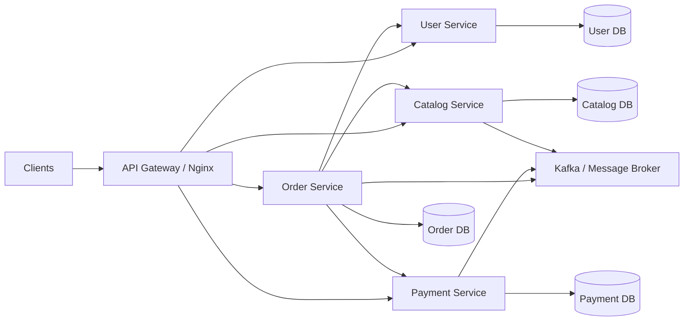
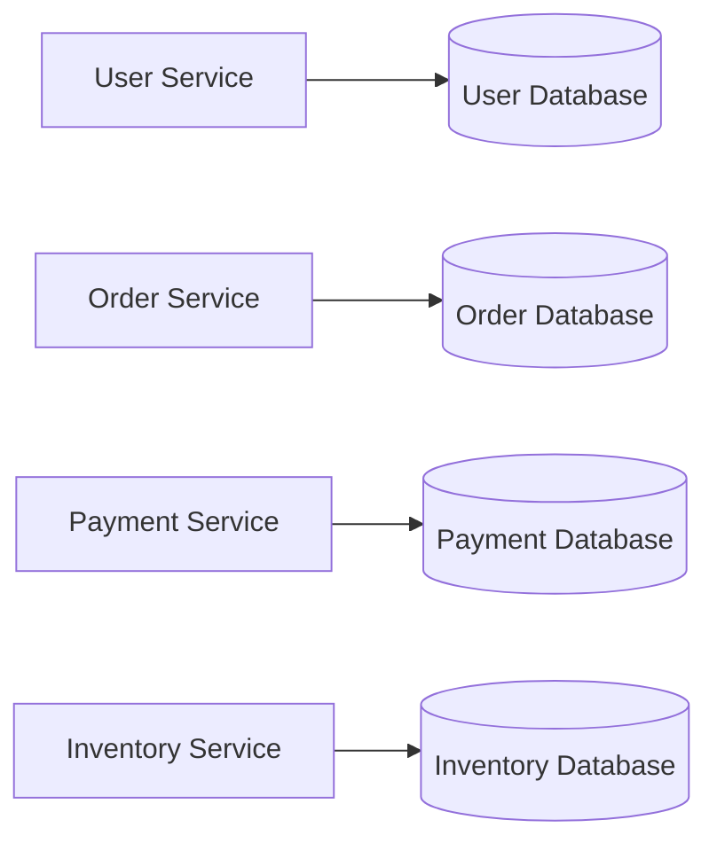
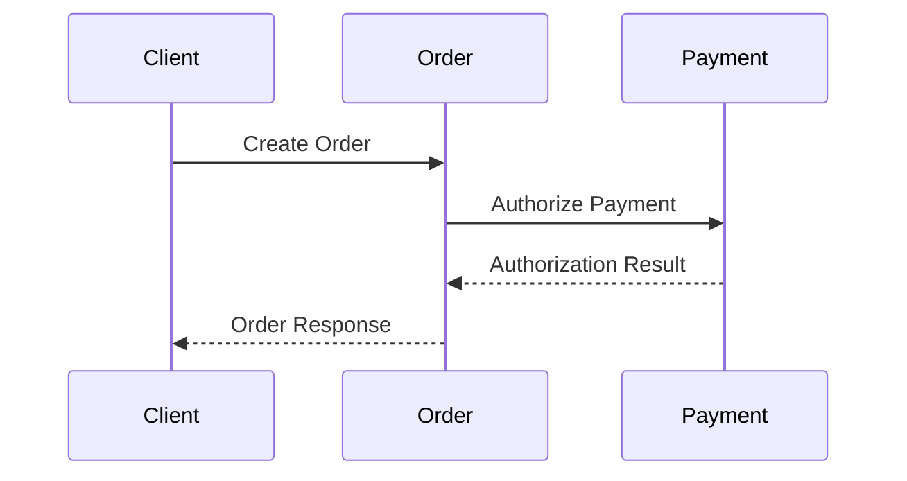
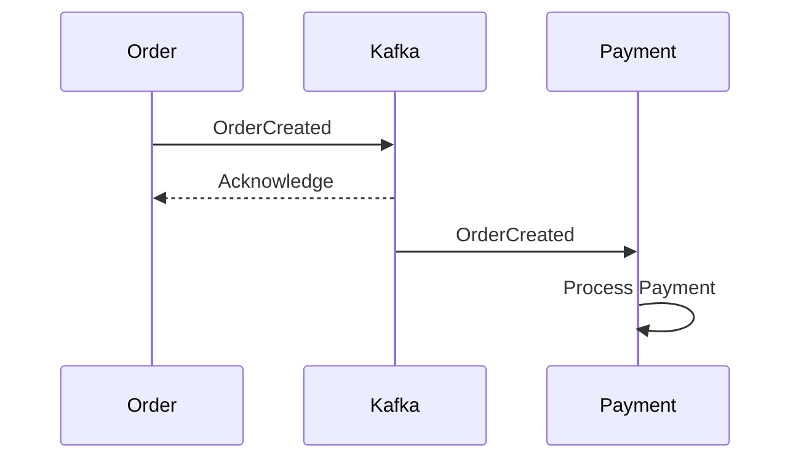
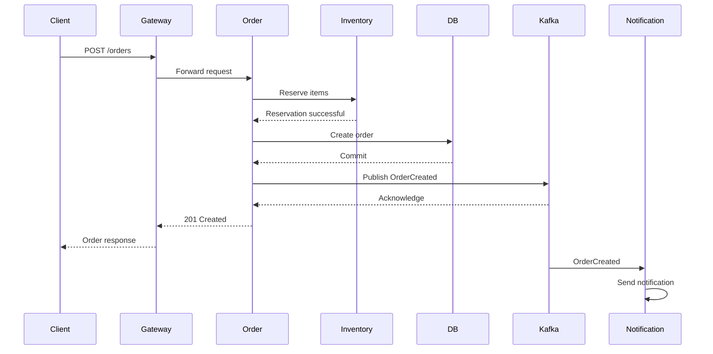
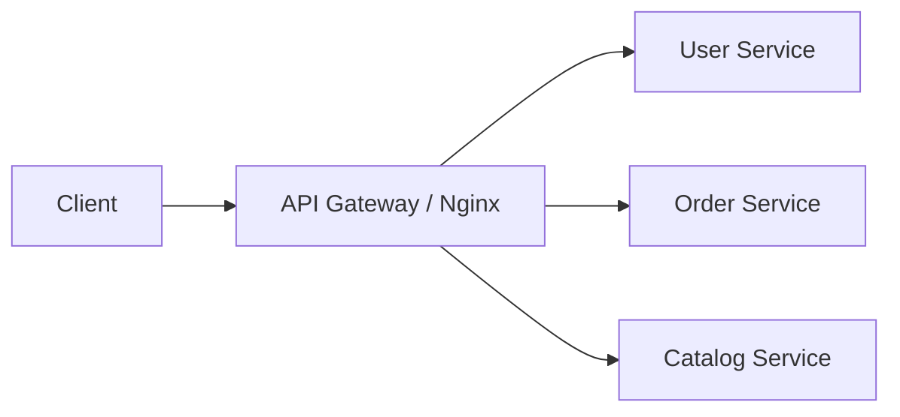
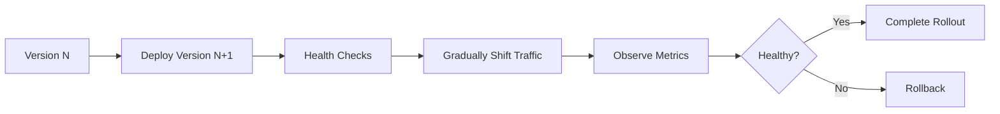

# 01- Introduction

## Overview

Microservices architecture is an approach to building a distributed application as a collection of independently deployable services, where each service owns a clearly defined business capability and communicates with other services through explicit interfaces.

The architectural value of microservices is not simply that an application contains multiple processes or repositories. The important properties are **independent deployment, bounded ownership, controlled coupling, isolated failure domains, and the ability to scale components according to their individual requirements**.

A production microservices system typically introduces additional infrastructure and operational complexity compared with a modular monolith. Network communication replaces many in-process function calls, distributed data replaces a single transactional boundary, and failures become partial rather than binary.



The goal is not to maximize the number of services. The goal is to establish service boundaries that allow a system to evolve, scale, deploy, and fail in controlled ways.

## Why Microservices Exist

A monolithic application can initially be simpler and often provides better development velocity. A single Django application, for example, can contain authentication, orders, payments, catalog management, and reporting while sharing one PostgreSQL database and one deployment pipeline.

As an organization and system grow, however, several forms of coupling can become expensive:

- Different teams modify the same codebase.
- A small change requires deploying the entire application.
- One workload requires significantly more compute than others.
- Failures in one subsystem affect unrelated functionality.
- Large deployments become slower and riskier.
- Teams need different release schedules.
- Different components require different scaling characteristics.
- A single database becomes a contention and ownership boundary.

Microservices address these problems by splitting the system around **business capabilities and ownership boundaries**.

The trade-off is that local complexity becomes distributed complexity.

| Monolith | Microservices |
|---|---|
| In-process communication | Network communication |
| Usually one deployment unit | Multiple deployment units |
| Often one database | Potentially database-per-service |
| Simple local transactions | Distributed consistency |
| Easier debugging | Distributed tracing required |
| Simpler deployment | Independent deployment |
| Lower operational overhead | Higher operational overhead |
| Scaling often applies to the whole application | Services can scale independently |
| Failure can be broad | Failures can be isolated |
| Usually simpler initially | Can become complex at scale |

Microservices should therefore be introduced because the organization and system have a genuine need for the resulting boundaries, not because the architecture is fashionable.

## Monolith to Microservices

A useful progression is:


A well-structured monolith is often a better starting point than prematurely creating dozens of services.

For example, a Django application can initially have:

```text
application/
├── users/
├── catalog/
├── orders/
├── payments/
└── notifications/
```

If these modules have clear interfaces and ownership boundaries, extracting `payments` or `notifications` later becomes significantly easier.

A poorly structured monolith with shared models, shared business logic, and unrestricted database access is much harder to decompose.

## What Defines a Microservice

A microservice should generally have the following characteristics:

| Property | Meaning |
|---|---|
| Business ownership | Represents a meaningful business capability |
| Independent deployment | Can be released without deploying unrelated services |
| Explicit API | Communicates through defined contracts |
| Encapsulated implementation | Internal implementation is not a dependency of other services |
| Controlled data ownership | Other services do not directly manipulate its database |
| Independent scaling | Can scale according to its workload |
| Failure boundary | Failures can be contained where practical |
| Observable operation | Health, metrics, logs, and traces can be monitored independently |

The exact size of a service is not defined by lines of code, number of endpoints, or number of database tables.

A service should be large enough to represent a coherent business capability and small enough that its ownership and operational behavior remain manageable.

## Service Boundaries

Service boundaries are one of the hardest parts of microservice architecture.

A strong boundary generally follows a **business capability** rather than a technical layer.

### Weak Boundaries

Splitting a system into services such as:

```text
Database Service
Validation Service
Controller Service
Repository Service
Email Service
```

usually creates excessive network communication and coupling.

A request might need to traverse several services just to perform one business operation.

### Stronger Boundaries

A commerce platform might instead use:

```text
Identity Service
Catalog Service
Order Service
Payment Service
Inventory Service
Notification Service
```

Each service represents a business capability.

The service boundary should answer:

> Which business capability can this team own, evolve, deploy, and operate independently?

## Bounded Contexts

Domain-driven design provides a useful way to reason about service boundaries.

A **bounded context** defines where a particular domain model and its terminology are valid.

For example, the concept of `Customer` may exist differently in different contexts:

```text
Identity Context
    Customer
    email
    credentials
    authentication status

Order Context
    Customer
    customer_id
    shipping address
    order history

Billing Context
    Customer
    billing profile
    payment method
```

These services should not necessarily share one universal `Customer` model.

Instead, each service owns the representation required by its business context.

## Data Ownership

A critical microservices principle is:

> A service should own its data.

For example:



The Order Service should not directly execute SQL against the Payment Service database.

Instead:

```text
Order Service
      |
      | API / Event
      v
Payment Service
      |
      v
Payment Database
```

This preserves ownership and allows the Payment Service to change its schema without breaking other services.

### Why Shared Databases Are Dangerous

A shared database creates hidden coupling:

```text
Service A ─┐
Service B ─┼──> Shared PostgreSQL Database
Service C ─┘
```

Even if the application is deployed as separate services, the database becomes a shared implementation boundary.

One service may change:

```sql
ALTER TABLE orders ...
```

and unexpectedly break another service.

A shared database can be appropriate during migration from a monolith, but it should generally be treated as transitional architecture rather than an ideal long-term ownership model.

## Service Communication

Microservices communicate primarily through two models:

| Communication | Characteristics | Typical Use |
|---|---|---|
| Synchronous | Caller waits for response | REST, gRPC |
| Asynchronous | Message/event processed independently | Kafka, SQS, RabbitMQ |

### Synchronous Communication



The Order Service depends directly on Payment availability.

Advantages:

- Simple request/response model
- Immediate result
- Easier for strongly interactive operations
- Straightforward API contracts

Limitations:

- Higher latency
- Runtime dependency between services
- Failure propagation
- Requires timeout and retry policies
- Can create dependency chains

### Asynchronous Communication



The producer does not need the consumer to complete its work before continuing.

Advantages:

- Loose runtime coupling
- Better workload absorption
- Natural buffering
- High throughput
- Independent consumer scaling

Limitations:

- Eventual consistency
- More complex debugging
- Duplicate delivery must be handled
- Ordering requires careful design
- Consumer lag must be monitored

## REST vs gRPC vs Events

| Approach | Best For | Strength | Main Trade-off |
|---|---|---|---|
| REST | Public APIs and broad integrations | Simple and widely understood | Higher protocol overhead and flexible contracts |
| gRPC | Internal service-to-service calls | Strong contracts and efficient binary protocol | Less convenient for browser/public clients |
| Kafka events | Event-driven workflows | High throughput and loose coupling | Eventual consistency and operational complexity |
| SQS | Durable asynchronous work | Managed queue semantics | Not a general event-streaming platform |

A production architecture may use all of these simultaneously.

For example:

```text
Browser
   |
   v
REST API
   |
   v
Order Service
   |
   +---- gRPC ----> Inventory Service
   |
   +---- Kafka ---> Notification Service
   |
   +---- Kafka ---> Analytics Pipeline
```

## Request Lifecycle

Consider a client creating an order.



Each network boundary introduces possible:

- Connection failures
- Timeouts
- Retries
- Duplicate requests
- Partial failures
- Authentication requirements
- Version compatibility problems
- Observability requirements

This is why distributed systems require substantially more engineering discipline than equivalent in-process code.

## API Contracts

A service boundary should expose a stable contract rather than internal implementation details.

For REST:

```http
POST /v1/orders
Content-Type: application/json
Authorization: Bearer <token>

{
  "customer_id": "cus_123",
  "items": [
    {
      "product_id": "prod_456",
      "quantity": 2
    }
  ]
}
```

The internal database schema should not necessarily mirror this contract.

For gRPC, contracts can be defined using Protocol Buffers:

```protobuf
syntax = "proto3";

package orders.v1;

service OrderService {
  rpc GetOrder(GetOrderRequest) returns (Order);
}

message GetOrderRequest {
  string order_id = 1;
}

message Order {
  string id = 1;
  string customer_id = 2;
  string status = 3;
}
```

Contract evolution should be backward compatible wherever rolling deployments are possible.

## Service Discovery

Services need to locate other services dynamically.

Common approaches include:

- Kubernetes DNS
- AWS Cloud Map
- Load balancers
- API gateways
- Service meshes
- Internal DNS

In Kubernetes, a service might be reachable through:

```text
http://payment-service.default.svc.cluster.local
```

The application should generally depend on a stable service name rather than individual pod IP addresses.

## API Gateway

An API gateway provides a controlled entry point for external clients.

Typical responsibilities include:

- TLS termination
- Authentication integration
- Routing
- Rate limiting
- Request validation
- Access logging
- CORS handling
- Traffic management



The gateway should not become the location for all business logic.

Business rules should remain within the services that own them.

## Reliability Patterns

Microservices require explicit failure handling.

Common patterns include:

| Pattern | Purpose |
|---|---|
| Timeout | Prevent indefinite waiting |
| Retry | Recover from transient failures |
| Exponential backoff | Avoid immediate repeated requests |
| Jitter | Prevent synchronized retry storms |
| Circuit breaker | Stop calls to unhealthy dependencies |
| Bulkhead | Isolate resource pools |
| Rate limiting | Protect system capacity |
| Backpressure | Prevent downstream overload |
| Idempotency | Make repeated operations safe |
| Dead-letter queue | Isolate repeatedly failing messages |

For example, a synchronous payment call should not use unlimited retries:

```text
Request
  |
  v
Timeout
  |
  v
Retry with exponential backoff
  |
  v
Circuit Breaker
  |
  v
Payment Service
```

These patterns should be considered together rather than independently.

## Distributed Transactions

A database transaction normally provides atomicity within one transactional boundary.

Across services, the following operation is not automatically atomic:

```text
Order DB
   |
   +-- Create Order

Payment DB
   |
   +-- Charge Payment

Inventory DB
   |
   +-- Reserve Inventory
```

A failure after payment succeeds but before inventory reservation completes creates a distributed consistency problem.

Common approaches include:

- Saga pattern
- Compensating transactions
- Transactional outbox
- Idempotent consumers
- Event-driven workflows

The correct solution depends on business requirements.

Do not attempt to recreate a global ACID transaction across every microservice unless there is a compelling architectural reason.

## Eventual Consistency

Microservices frequently use eventual consistency.

For example:

```text
Order Created
     |
     v
OrderCreated Event
     |
     +----> Inventory Service
     |
     +----> Notification Service
     |
     +----> Analytics Service
```

Different services may observe the event at different times.

This means an API might return:

```json
{
  "order_id": "ord_123",
  "status": "created",
  "inventory_status": "pending"
}
```

rather than waiting synchronously for every downstream subsystem.

The system must explicitly define acceptable consistency guarantees.

## Idempotency

Distributed systems commonly produce duplicate requests or messages.

For example:

```text
Client
  |
  | POST /payments
  | Idempotency-Key: abc123
  v
Payment Service
  |
  +---- Request succeeds
  |
  +---- Response lost
  |
  +---- Client retries
```

Without idempotency, the payment may be charged twice.

A service can persist the idempotency key and operation result:

```text
idempotency_key
----------------
abc123

request_hash
----------------
...

status
----------------
completed

response
----------------
...
```

The retry then returns the original result instead of executing the side effect again.

## Observability

Traditional application logging is insufficient for complex microservice systems.

A production system should provide:

- Structured logs
- Metrics
- Distributed traces
- Correlation IDs
- Request IDs
- Service-level indicators
- Dependency health metrics

A request might traverse:

```text
Nginx
  -> Order Service
      -> Inventory Service
          -> PostgreSQL
      -> Payment Service
          -> External Payment API
      -> Kafka
          -> Notification Service
```

A correlation or trace ID allows engineers to reconstruct this path.

```text
trace_id = 8f3a...
```

The same trace context should propagate across HTTP, gRPC, and messaging boundaries where supported.

## Scalability

Microservices allow independent scaling.

Suppose:

```text
Catalog:   5 requests/sec
Orders:   100 requests/sec
Search:  5,000 requests/sec
```

A monolith may require scaling the entire application.

With microservices:

```text
Catalog Service  -> 2 instances
Order Service    -> 8 instances
Search Service   -> 40 instances
```

However, independent scaling does not mean unlimited scaling.

Each service may still be constrained by:

- Database throughput
- Connection pools
- External APIs
- CPU
- Memory
- Network bandwidth
- Kafka partitions
- Queue consumer capacity

Scaling application instances without scaling the bottleneck simply moves the pressure downstream.

## Resource Isolation

A production Kubernetes deployment should explicitly control resource usage.

```yaml
apiVersion: apps/v1
kind: Deployment
metadata:
  name: order-service
spec:
  replicas: 3
  selector:
    matchLabels:
      app: order-service
  template:
    metadata:
      labels:
        app: order-service
    spec:
      containers:
        - name: order-service
          image: example/order-service:1.4.0
          resources:
            requests:
              cpu: "250m"
              memory: "256Mi"
            limits:
              cpu: "1"
              memory: "512Mi"
```

Resource requests help Kubernetes schedule workloads appropriately.

Limits prevent individual containers from consuming unlimited resources, although CPU and memory limit behavior should be understood carefully before applying aggressive limits.

## Deployment Strategy

Independent services enable independent deployment, but production deployment must account for compatibility.

A typical rolling deployment looks like:



For API changes, prefer compatibility across versions.

For example:

```text
Old Client
    |
    v
Service v1
Service v2
```

During a rolling deployment, both versions may temporarily coexist.

Therefore:

- Do not remove fields immediately.
- Do not change semantics unexpectedly.
- Prefer additive changes.
- Version breaking APIs.
- Use expand-and-contract database migrations.

## Security

Each service boundary is a security boundary that should be evaluated explicitly.

Important controls include:

- TLS for network communication
- Service authentication
- Authorization
- Short-lived credentials
- Secret management
- Network segmentation
- Least-privilege IAM
- Input validation
- Dependency security
- Audit logging

Service-to-service authentication should not rely solely on network location.

A request from:

```text
Order Service -> Payment Service
```

should still be authenticated and authorized.

On AWS, IAM roles, security groups, private networking, and managed secret stores can be combined to reduce credential exposure.

## Configuration and Secrets

Configuration should be externalized from application images.

Examples include:

```text
DATABASE_URL
KAFKA_BOOTSTRAP_SERVERS
REDIS_URL
PAYMENT_SERVICE_URL
LOG_LEVEL
```

Secrets should not be committed to Git.

For production systems, use appropriate secret-management mechanisms such as:

- AWS Secrets Manager
- AWS Systems Manager Parameter Store
- Kubernetes Secrets with appropriate protection
- Vault

Container images should remain immutable and environment-specific configuration should be injected at deployment time.

## CI/CD

Microservices increase the number of deployable units.

A repository might contain:

```text
services/
├── user-service/
├── catalog-service/
├── order-service/
├── payment-service/
└── notification-service/
```

CI/CD should independently validate and deploy each service.

A typical pipeline includes:

```text
Commit
  |
  v
Lint
  |
  v
Unit Tests
  |
  v
Integration Tests
  |
  v
Build Container
  |
  v
Security Scanning
  |
  v
Push Image
  |
  v
Deploy
  |
  v
Health Checks
  |
  v
Progressive Rollout
```

GitHub Actions, GitLab CI, AWS CodePipeline, or similar systems can implement this workflow.

## Common Mistakes

### Creating Too Many Services

A service for every model or feature creates excessive communication and operational overhead.

Symptoms include:

- Large numbers of network calls for one request
- Difficult local development
- Complex deployment coordination
- Excessive monitoring overhead
- Frequent cross-service changes

Start with meaningful business boundaries rather than arbitrary service counts.

### Sharing Databases

Direct database access across services creates hidden coupling.

Prefer:

```text
Service A -> Service B API/Event
```

over:

```text
Service A -> Service B Database
```

### Distributed Monolith

A distributed monolith occurs when services are physically separated but tightly coupled operationally.

For example:

```text
A -> B -> C -> D -> E
```

where every user request requires all services to be healthy.

The architecture gains distributed-system complexity without gaining meaningful independence.

### Excessive Synchronous Calls

A chain such as:

```text
API
 -> A
   -> B
     -> C
       -> D
```

increases latency and creates multiple failure points.

Use asynchronous communication where the business operation does not require immediate synchronous completion.

### Missing Timeouts

A service that waits indefinitely for a dependency can exhaust worker threads or event-loop capacity.

Every network dependency should have an explicit timeout appropriate to its workload.

### Blind Retries

Retries can amplify outages.

If 1,000 requests fail and every request retries three times, the downstream service can receive thousands of additional requests during an incident.

Use:

- Bounded retries
- Exponential backoff
- Jitter
- Idempotency
- Circuit breakers

### Treating Kafka as a Database

Kafka is a distributed event log, not a replacement for every transactional datastore.

Use it for:

- Event distribution
- Streaming
- Durable asynchronous processing
- Event-driven integration

Use PostgreSQL or another appropriate datastore for transactional application state.

### Ignoring Message Duplication

At-least-once delivery can produce duplicates.

Consumers should be designed to safely process repeated events through idempotency or deduplication mechanisms.

## Production Design Checklist

Before introducing or extracting a microservice, verify:

- [ ] The service represents a coherent business capability.
- [ ] Ownership is clearly assigned.
- [ ] The service owns its data.
- [ ] Its API or event contract is explicitly defined.
- [ ] Failure behavior is understood.
- [ ] Timeouts are configured.
- [ ] Retry behavior is bounded.
- [ ] Idempotency is considered.
- [ ] Authentication and authorization are defined.
- [ ] Logs and metrics are available.
- [ ] Distributed tracing is supported where appropriate.
- [ ] Health checks are implemented.
- [ ] Deployment is independently automatable.
- [ ] Database migrations are backward compatible.
- [ ] Capacity requirements are understood.
- [ ] Recovery and rollback procedures are defined.

## Interview Perspective

When asked whether an application should use microservices, avoid answering simply:

> "Microservices are better because they scale."

A stronger architectural answer considers:

1. Team structure and ownership.
2. Business-domain boundaries.
3. Deployment independence.
4. Scaling requirements.
5. Failure isolation requirements.
6. Data ownership.
7. Communication patterns.
8. Operational maturity.
9. Observability requirements.
10. Cost and infrastructure complexity.

A strong senior-level answer recognizes that microservices trade **local simplicity for distributed-system flexibility**.

## Key Takeaways

- **Microservices are independently deployable business capabilities, not merely multiple applications or containers.**
- **Strong service boundaries follow business ownership and bounded contexts while keeping data ownership explicit.**
- **Network communication introduces latency, partial failures, retries, consistency challenges, and observability requirements that do not exist in the same way inside a monolith.**
- **Microservices should be introduced when independent deployment, scaling, ownership, or failure isolation justifies their operational complexity.**
- **A well-designed modular monolith is often a better starting point than a prematurely distributed architecture.**