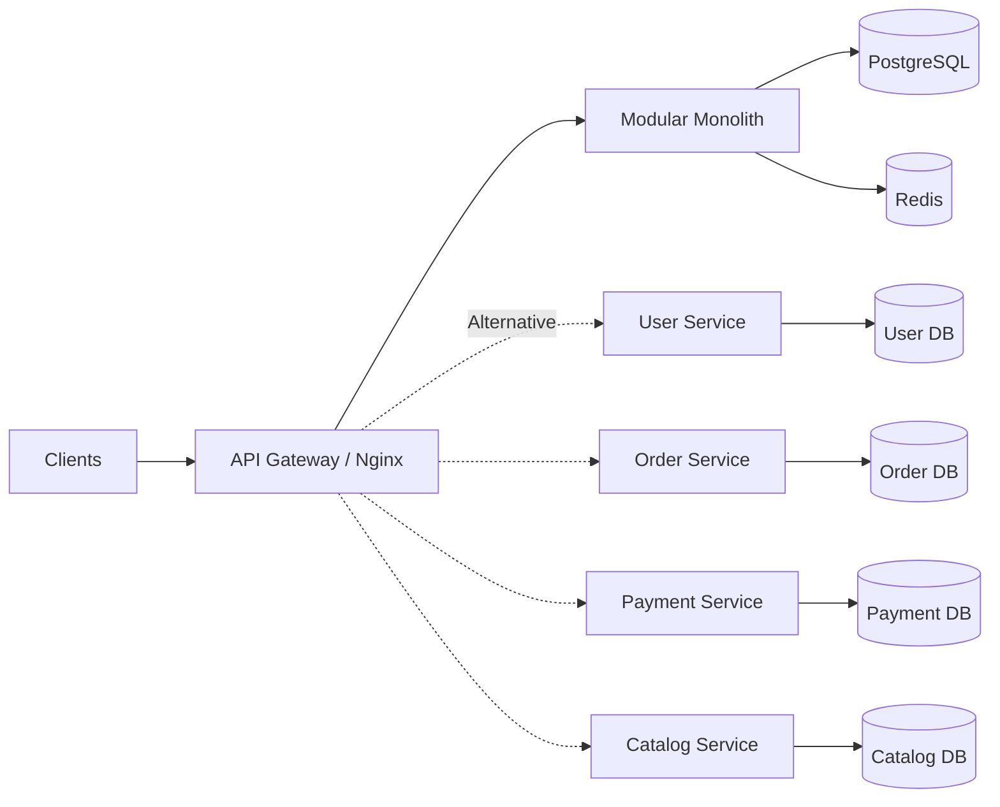
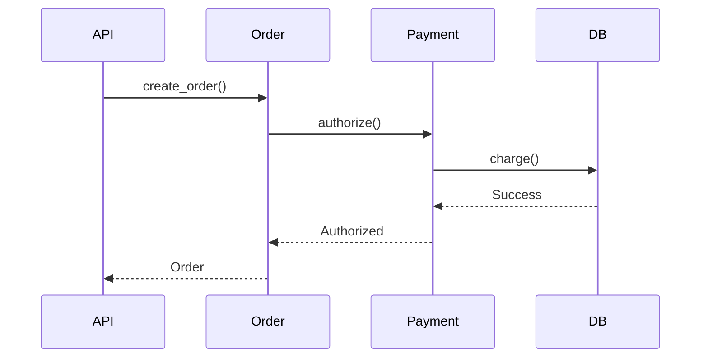
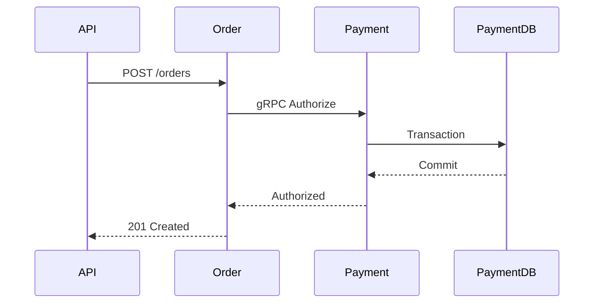
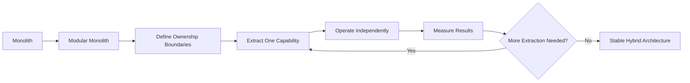
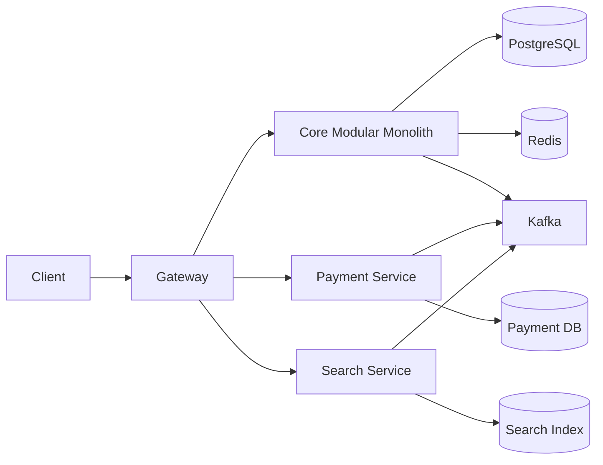

# 02- Microservices vs Monolith

## Overview

The choice between a monolith and microservices is primarily an architectural and organizational decision, not a simple technology choice.

A **monolith** packages most or all application capabilities into a single deployable system. A **microservices architecture** decomposes the system into independently deployable services aligned with business capabilities.

The important engineering question is not:

> "Which architecture is better?"

It is:

> "Which architecture provides the required scalability, deployment independence, ownership boundaries, reliability, and operational characteristics at an acceptable level of complexity?"

For many systems, a well-designed modular monolith is the better starting point. Microservices become valuable when organizational scale, domain boundaries, deployment requirements, workload characteristics, or failure isolation justify distributed-system complexity.



Both architectures can be production-grade. Both can also become poorly designed systems.

## Monolith

A monolith is an application deployed as one primary deployment unit.

A typical Django backend might contain:

```text
backend/
├── users/
├── catalog/
├── orders/
├── payments/
├── notifications/
└── reporting/
```

All modules execute within the same application process or deployment environment and commonly share infrastructure such as PostgreSQL and Redis.

A request might look like:

```text
Client
  |
  v
Nginx
  |
  v
Django Application
  |
  +--> Users
  +--> Orders
  +--> Payments
  +--> Catalog
  |
  v
PostgreSQL
```

The major advantage is that communication between components can remain in-process.

```python
order = order_service.create_order(
    customer_id=customer_id,
    items=items,
)
```

This is fundamentally different from:

```text
Order Service
    |
    | HTTP/gRPC
    v
Payment Service
```

The latter introduces network latency, timeouts, authentication, serialization, retries, and partial failures.

## Modular Monolith

A monolith does not have to mean a poorly structured codebase.

A **modular monolith** maintains explicit internal boundaries while retaining a single deployment unit.

```text
Django Application
│
├── identity/
│   └── Public interfaces
│
├── catalog/
│   └── Public interfaces
│
├── orders/
│   └── Public interfaces
│
├── payments/
│   └── Public interfaces
│
└── notifications/
    └── Public interfaces
```

The goal is to prevent modules from directly depending on internal implementation details.

For example:

```text
orders
  |
  +--> payments.public
  |
  +--> catalog.public

orders
  X--> payments.models.internal
```

This architecture can provide many benefits associated with microservices without immediately introducing distributed-system complexity.

A modular monolith is often an excellent foundation for future extraction.

## Microservices

Microservices split an application into independently deployable services.

For example:

```text
                 API Gateway
                      |
       +--------------+--------------+
       |              |              |
       v              v              v
   User Service   Order Service   Catalog Service
       |              |              |
       v              v              v
    User DB        Order DB       Catalog DB
```

Each service typically owns:

- A business capability
- Its application logic
- Its deployment lifecycle
- Its API or event contracts
- Its data ownership

Microservices introduce architectural freedom at the cost of distributed-system complexity.

## Core Comparison

| Dimension | Monolith | Microservices |
|---|---|---|
| Deployment | Single deployment unit | Multiple independent deployments |
| Communication | Mostly in-process | Network-based |
| Database | Often shared | Preferably service-owned |
| Scaling | Usually application-level | Service-level |
| Failure isolation | Lower | Potentially higher |
| Development complexity | Lower initially | Higher |
| Operational complexity | Lower | Significantly higher |
| Local development | Usually easier | More complex |
| Distributed tracing | Less critical | Usually essential |
| Transactions | Easier | Distributed consistency required |
| Team autonomy | Lower at large scale | Higher when boundaries are strong |
| Infrastructure cost | Usually lower | Usually higher |
| Technology flexibility | Lower | Higher |
| Deployment independence | Limited | Strong |
| Data consistency | Easier | Often eventual across services |
| Debugging | Simpler | Distributed debugging required |

## Communication Complexity

One of the most important differences is the communication boundary.

In a monolith:



The calls can be local function calls.

In microservices:



The second architecture introduces additional failure modes:

- DNS failure
- Connection failure
- TLS failure
- Timeout
- Service unavailable
- Connection pool exhaustion
- Serialization failure
- Retry storms
- Partial failure
- Network partition

This is one of the primary reasons microservices require more engineering maturity.

## Data Ownership

A monolith can commonly use a single PostgreSQL database:

```text
Django
  |
  +--> Users
  +--> Orders
  +--> Payments
  +--> Catalog
  |
  v
PostgreSQL
```

Transactions can therefore span multiple business modules.

```sql
BEGIN;

INSERT INTO orders (...);
INSERT INTO order_items (...);
UPDATE inventory SET quantity = quantity - 1;
INSERT INTO payments (...);

COMMIT;
```

In a microservices architecture, the equivalent operation may cross multiple databases:

```text
Order DB
Payment DB
Inventory DB
```

A normal database transaction cannot atomically commit all three.

This creates the need for patterns such as:

- Saga
- Transactional outbox
- Compensating transactions
- Idempotency
- Event-driven workflows
- Eventual consistency

This is a major architectural trade-off.

## Consistency

Monoliths generally make strong consistency easier because multiple operations can participate in one database transaction.

Microservices frequently introduce eventual consistency.

For example:

```text
Order Created
      |
      v
OrderCreated Event
      |
      +----> Inventory Service
      |
      +----> Payment Service
      |
      +----> Notification Service
```

The order may be created before all downstream operations complete.

The API might therefore return:

```json
{
  "order_id": "ord_123",
  "status": "processing"
}
```

rather than waiting for every downstream operation.

The correct architecture depends on business requirements.

If a workflow requires strict atomicity, decomposing it across services may introduce unacceptable complexity.

## Transactions

### Monolith

A monolith can often use:

```python
from django.db import transaction

with transaction.atomic():
    order = create_order()
    reserve_inventory()
    create_payment_record()
```

All operations can participate in one PostgreSQL transaction if they use the same transactional boundary.

### Microservices

The equivalent workflow may look like:

```text
Order Service
     |
     v
Order Created
     |
     v
Inventory Service
     |
     v
Inventory Reserved
     |
     v
Payment Service
     |
     v
Payment Authorized
```

Failures must be handled explicitly.

For example:

```text
Payment succeeds
      |
Inventory reservation fails
      |
      v
Compensating payment refund
```

The business process becomes a distributed state machine rather than one database transaction.

## Scaling

One of the strongest arguments for microservices is independent scaling.

Suppose a system has these workloads:

| Service | Traffic |
|---|---:|
| Catalog | 100 req/s |
| Orders | 500 req/s |
| Search | 10,000 req/s |
| Payments | 200 req/s |

With a monolith, scaling may look like:

```text
Entire Application
       |
       +--> 20 instances
```

Even if only search requires additional capacity, the whole application may need to scale.

With microservices:

```text
Catalog  -> 3 instances
Orders   -> 10 instances
Search   -> 50 instances
Payments -> 5 instances
```

Only the required workload is scaled.

However, the database or downstream dependency may still be the bottleneck.

```text
Search Service
      |
      v
PostgreSQL
      |
      X
  Bottleneck
```

Adding more application instances does not automatically increase database capacity.

## Failure Isolation

A monolith can have a large failure domain.

For example:

```text
Memory Leak
    |
    v
Application Instance
    |
    +--> Orders affected
    +--> Payments affected
    +--> Catalog affected
    +--> Users affected
```

Microservices can isolate failures:

```text
Payment Service
      |
      X
Payment Failure

Order Service ----> Healthy
Catalog Service --> Healthy
User Service ----> Healthy
```

However, failure isolation is not automatic.

If every service synchronously depends on the Payment Service, a Payment outage can still propagate across the system.

Good microservice architecture combines service boundaries with:

- Timeouts
- Circuit breakers
- Bulkheads
- Asynchronous processing
- Rate limiting
- Backpressure
- Graceful degradation

## Deployment Independence

A monolith typically follows:

```text
Code Change
    |
    v
Build Application
    |
    v
Deploy Entire Application
```

Microservices can support:

```text
Payment Change
     |
     v
Build Payment Service
     |
     v
Run Tests
     |
     v
Deploy Payment Service
```

This is valuable when teams need independent release schedules.

However, independent deployment requires backward-compatible contracts.

During a rolling deployment:

```text
Order Service v1
Order Service v2
```

may temporarily coexist.

Therefore APIs should generally evolve through additive and backward-compatible changes.

## Team Ownership

Architecture should reflect organizational boundaries.

A monolith may work well with:

```text
5 developers
    |
    v
One application
```

At larger scale:

```text
Team A -> Identity
Team B -> Orders
Team C -> Payments
Team D -> Catalog
```

Microservices can align ownership with business capabilities.

This is closely related to Conway's Law:

> Systems tend to reflect the communication structures of the organizations that build them.

Microservices should therefore not only be designed around technical components. They should consider:

- Team ownership
- Team autonomy
- Domain boundaries
- Release coordination
- Operational responsibility

Creating ten services while one team owns all ten does not automatically create meaningful organizational independence.

## Development Experience

Monolith:

```text
git clone
pip install
python manage.py runserver
```

Microservices:

```text
API Gateway
User Service
Order Service
Catalog Service
Payment Service
Kafka
Redis
PostgreSQL
Observability Stack
```

Local development becomes significantly more complicated.

Engineers may need:

- Docker Compose
- Kubernetes
- Local service discovery
- Multiple databases
- Message brokers
- Test infrastructure
- Mock dependencies

A microservice architecture that is difficult to run locally can significantly reduce developer productivity.

## Operational Complexity

A monolith might require:

```text
1 application
1 primary database
1 cache
1 deployment pipeline
```

A microservice environment might require:

```text
20 services
20 deployment pipelines
20 dashboards
20 alert groups
multiple databases
message brokers
service discovery
API gateway
distributed tracing
container orchestration
secret management
```

Every additional service creates operational responsibilities.

This means microservices should be evaluated not only by application complexity but by **total system complexity**.

## Observability

Observability requirements increase substantially with microservices.

A request might traverse:

```text
Nginx
  |
  v
Order Service
  |
  +--> Inventory Service
  |
  +--> Payment Service
  |       |
  |       +--> External Payment API
  |
  +--> Kafka
          |
          +--> Notification Service
```

Without distributed tracing, diagnosing latency or failure can be difficult.

Production microservices should typically use:

- Structured logging
- Metrics
- Distributed tracing
- Trace IDs
- Request IDs
- Service-level dashboards
- Dependency health metrics

## Cost

Microservices generally have higher infrastructure and operational costs.

| Cost Area | Monolith | Microservices |
|---|---|---|
| Compute | Lower | Higher |
| Databases | Usually fewer | Potentially many |
| Networking | Lower | Higher |
| Observability | Simpler | More expensive |
| CI/CD | Fewer pipelines | More pipelines |
| Infrastructure management | Simpler | More complex |
| Engineering operations | Lower | Higher |

A service that receives only a small amount of traffic may still require:

- Container resources
- Monitoring
- Deployment infrastructure
- Logging
- Networking
- Security configuration
- On-call ownership

Independent scaling should therefore justify the additional cost.

## Security

Microservices increase the number of trust boundaries.

A monolith might have:

```text
Client -> Application
```

Microservices might have:

```text
Client
  |
  v
Gateway
  |
  +--> Service A
  |
  +--> Service B
  |
  +--> Service C
```

Service-to-service communication should be authenticated and authorized.

Common controls include:

- TLS
- Service identity
- IAM roles
- Short-lived credentials
- Network policies
- Security groups
- Least-privilege access
- Secret management
- Audit logs

Do not assume that private networking alone makes service communication trusted.

## Reliability

A monolith has fewer network boundaries.

Microservices create more dependencies:

```text
A -> B -> C -> D
```

If each dependency has 99.9% availability and a request requires all four services synchronously, the theoretical combined availability is approximately:

```text
0.999 × 0.999 × 0.999 × 0.999
≈ 99.60%
```

This illustrates why dependency chains matter.

Real systems are more complicated because retries, caching, redundancy, asynchronous processing, and fallback behavior can change the effective availability.

Good microservice architecture minimizes unnecessary synchronous dependency chains.

## When a Monolith Is Better

A monolith is usually a strong choice when:

- The product is early-stage.
- The domain is not yet understood.
- The team is small.
- Deployment frequency is manageable.
- Scaling requirements are relatively uniform.
- Strong cross-module transactions are important.
- Operational maturity is limited.
- Infrastructure cost must remain low.
- Most functionality changes together.

A modular Django application can support significant traffic when it is properly designed, indexed, cached, horizontally scaled, and operated.

High traffic alone is not proof that microservices are required.

## When Microservices Are Better

Microservices become more attractive when:

- Teams require independent deployment.
- Domains have clear boundaries.
- Different workloads scale independently.
- Different components have different availability requirements.
- Failure isolation is important.
- Teams need technology autonomy.
- Components have independent release lifecycles.
- The organization can support distributed operations.
- Individual services have sufficiently distinct operational characteristics.

The organization must be capable of operating the architecture.

## Migration Strategy

Moving directly from a monolith to dozens of services is risky.

A safer approach is incremental decomposition.



A common extraction candidate is a subsystem with:

- Clear ownership
- Independent scaling needs
- High deployment frequency
- Well-defined APIs
- Significant operational independence

For example:

```text
Monolith
├── Users
├── Catalog
├── Orders
├── Payments
└── Notifications
```

might gradually become:

```text
Monolith
├── Users
├── Catalog
├── Orders
└── Notifications

Payment Service
```

The remaining monolith can then evolve independently.

## Strangler Pattern

The Strangler Pattern incrementally replaces functionality from a legacy system.

```text
                 Gateway
                    |
          +---------+---------+
          |                   |
          v                   v
     New Service          Legacy Monolith
```

Traffic for extracted functionality moves to the new service while the remaining functionality stays in the monolith.

Over time:

```text
Phase 1
Gateway -> Monolith

Phase 2
Gateway -> New Service
        -> Monolith

Phase 3
Gateway -> Multiple Services
        -> Remaining Monolith
```

This minimizes migration risk compared with a full rewrite.

## Hybrid Architecture

Production systems do not have to choose between "pure monolith" and "pure microservices."

A realistic architecture might be:



This can be an effective transitional or long-term architecture.

For example:

- Core business workflows remain in a modular monolith.
- Search is independently scalable.
- Payments have stricter isolation requirements.
- Kafka handles asynchronous integration.

Architecture should follow actual system requirements rather than forcing every component into the same deployment model.

## Decision Framework

Use the following questions when choosing an architecture:

| Question | Favors Monolith | Favors Microservices |
|---|---|---|
| Is the domain still changing rapidly? | Yes | No |
| Is the team small? | Yes | No |
| Are transactions mostly cross-domain? | Yes | No |
| Do workloads require independent scaling? | No | Yes |
| Do teams need independent releases? | No | Yes |
| Are domain boundaries well understood? | No | Yes |
| Is operational maturity low? | Yes | No |
| Is failure isolation critical? | Less | More |
| Is infrastructure cost highly constrained? | Yes | Less |
| Do components have independent lifecycles? | No | Yes |
| Is service ownership clear? | Not required | Required |
| Can the organization operate distributed systems? | Not required | Required |

## Common Mistakes

### Choosing Microservices Because of Scale

High request volume does not automatically require microservices.

A well-designed monolith can scale horizontally:

```text
Load Balancer
   |
   +--> Django 1
   +--> Django 2
   +--> Django 3
   +--> Django N
        |
        v
    PostgreSQL
```

If the database is the bottleneck, splitting the application into services may not solve the real problem.

### Assuming Microservices Automatically Scale Better

Microservices provide **independent scaling**, not infinite scalability.

The actual bottleneck may be:

- PostgreSQL
- Redis
- Kafka
- External APIs
- Network bandwidth
- Connection pools
- CPU
- Memory

### Creating Distributed Monoliths

A distributed monolith is often worse than a traditional monolith.

Example:

```text
API
 |
 v
A -> B -> C -> D -> E
```

If every request requires all five services synchronously, deployment and runtime independence may be mostly theoretical.

### Sharing Tables Between Services

This creates hidden coupling.

Prefer:

```text
Service A
    |
    | API/Event
    v
Service B
```

instead of:

```text
Service A
    |
    v
Service B Database
```

### Ignoring Operational Cost

Each service needs:

- Deployment
- Monitoring
- Logging
- Security
- Scaling
- Alerting
- Documentation
- Ownership
- Incident response

The engineering organization must be prepared to operate all of them.

### Rewriting Everything

A complete rewrite is usually riskier than incremental extraction.

Prefer:

```text
Modularize
    |
    v
Measure
    |
    v
Extract
    |
    v
Operate
    |
    v
Repeat
```

rather than replacing the entire system in one release.

## Production Recommendations

For most teams, the following progression is a strong default:

```text
Simple Application
      |
      v
Well-Structured Monolith
      |
      v
Modular Monolith
      |
      v
Identify Real Boundaries
      |
      v
Extract Only Where Justified
      |
      v
Microservices / Hybrid Architecture
```

When using microservices:

- Define ownership before extraction.
- Keep service APIs explicit.
- Keep database ownership explicit.
- Prefer asynchronous communication for workflows that do not require immediate responses.
- Use timeouts on every network dependency.
- Bound retries and use exponential backoff with jitter.
- Make message consumers idempotent.
- Implement distributed tracing.
- Version APIs carefully.
- Automate CI/CD.
- Treat infrastructure as code.
- Establish service-level monitoring and alerting.
- Document failure modes.
- Define rollback and disaster-recovery procedures.

## Interview Perspective

A strong interview answer should avoid treating architecture as a binary preference.

A useful decision process is:

```text
Business Requirements
        |
        v
Team Structure
        |
        v
Domain Boundaries
        |
        v
Scaling Requirements
        |
        v
Consistency Requirements
        |
        v
Failure Isolation
        |
        v
Deployment Requirements
        |
        v
Operational Maturity
        |
        v
Architecture Decision
```

When asked:

> "Would you choose microservices or a monolith?"

A senior-level response should be:

> "I would start with the business and operational requirements rather than choosing the architecture first. If the domain is still evolving and the team is small, I would favor a modular monolith because it minimizes distributed-system complexity. If teams need independent deployment, domains are well understood, workloads scale independently, and the organization can operate distributed infrastructure, I would introduce microservices incrementally."

The key interview trap is claiming that microservices are inherently more scalable, reliable, or modern.

They are a tool for solving specific organizational and technical problems.

## Key Takeaways

- **A modular monolith is often the best starting architecture because it preserves simple communication and transactions while allowing strong internal boundaries.**
- **Microservices provide independent deployment, scaling, ownership, and failure isolation, but introduce distributed-system complexity and operational cost.**
- **Architecture should be driven by domain boundaries, team ownership, consistency requirements, scaling characteristics, and operational maturity—not by traffic volume alone.**
- **Avoid distributed monoliths, shared database ownership, excessive synchronous dependencies, and premature service decomposition.**
- **When microservices are justified, prefer incremental extraction from a well-structured monolith over a large-scale rewrite.**