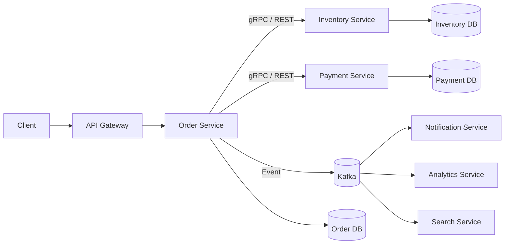
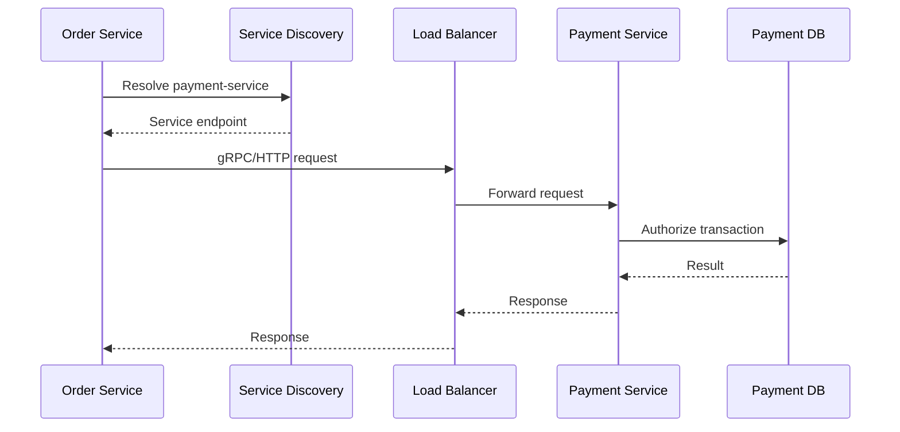
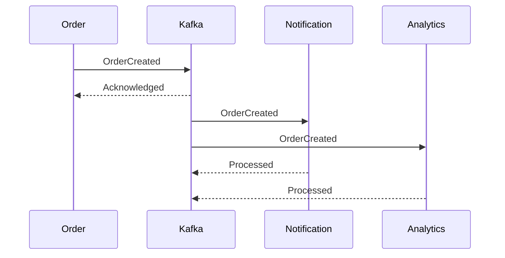
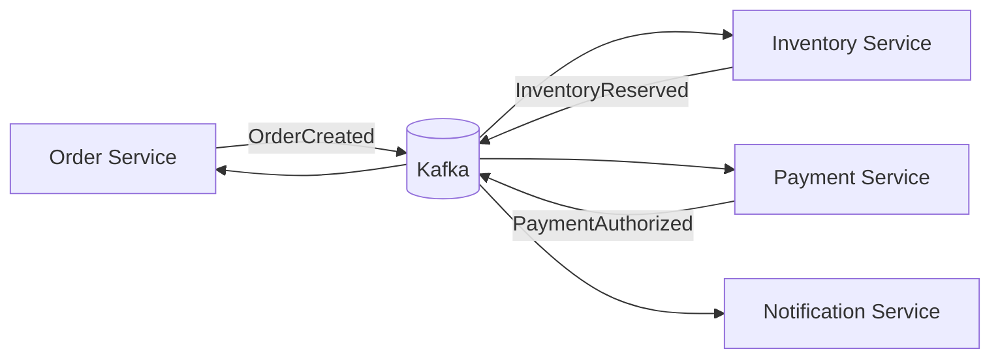
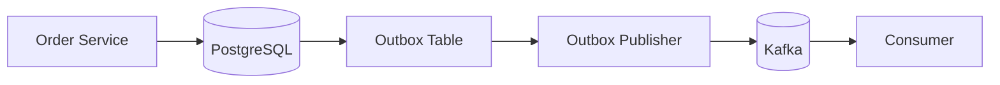
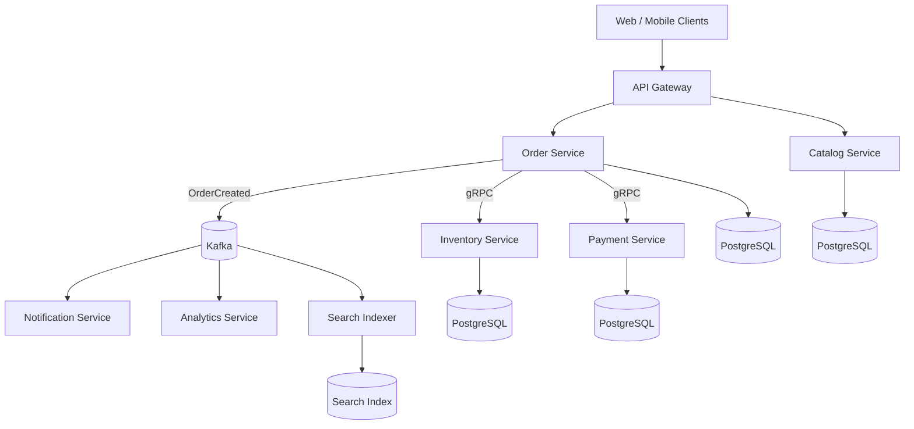
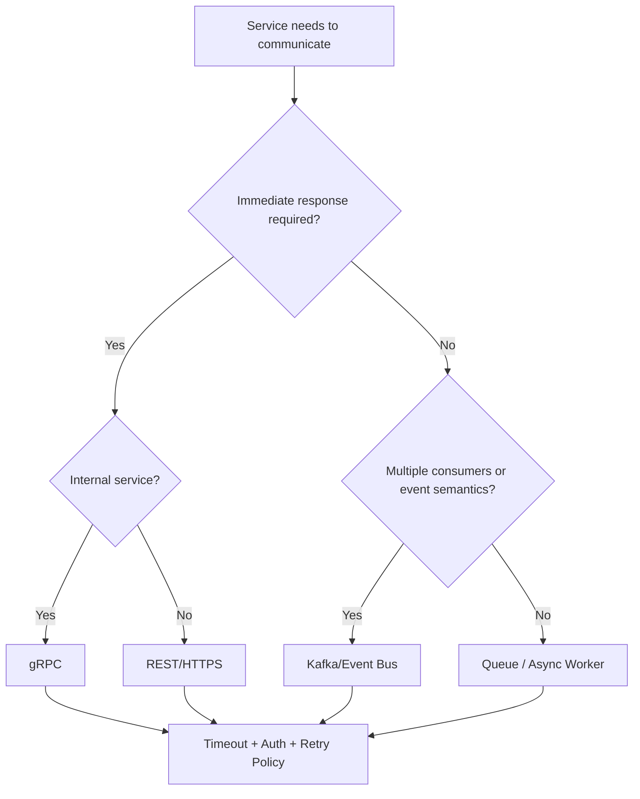

# 03- Service Communication

## Overview

Service communication defines how independently deployable services exchange data, invoke operations, coordinate workflows, and propagate state.

In a microservices architecture, communication is not merely an implementation detail. The communication model directly affects:

- Latency
- Availability
- Coupling
- Consistency
- Scalability
- Failure propagation
- Deployment independence
- Security
- Observability
- Operational complexity

The primary communication models are:

| Model | Examples | Typical Use |
|---|---|---|
| Synchronous request/response | REST, gRPC | Immediate responses and queries |
| Asynchronous messaging | Kafka, RabbitMQ, SQS | Decoupled workflows and events |
| Event-driven communication | Kafka events | State propagation and integration |
| Streaming | Kafka, Kinesis | Continuous high-volume data processing |

A production architecture usually combines several models rather than choosing one universally.



The central architectural decision is whether a dependency must be resolved **now** or can be processed **later**.

## Why Service Communication Is Difficult

Within a monolith, communication can be a function call:

```python
payment = payment_service.authorize(order)
```

The call executes within the same process.

Across services:

```text
Order Service
      |
      | Network
      v
Payment Service
```

The operation now depends on infrastructure outside the current process.

Possible failures include:

- DNS resolution failure
- TCP connection failure
- TLS negotiation failure
- Connection pool exhaustion
- Request timeout
- Service overload
- HTTP 5xx response
- Serialization failure
- Network partition
- Load balancer failure
- Dependency failure
- Incorrect service discovery
- Authentication failure

A senior engineer therefore treats every remote call as an unreliable boundary.

## Communication Models

### Synchronous Communication

The caller waits for the downstream service to respond.

```text
Order Service
     |
     | Request
     v
Payment Service
     |
     | Response
     v
Order Service
```

Typical technologies:

- HTTP/REST
- gRPC

Use synchronous communication when the caller genuinely needs the result before continuing.

Examples:

- Fetch customer profile
- Validate authorization
- Retrieve current inventory
- Request a payment authorization
- Query another service

### Asynchronous Communication

The producer submits work or publishes an event without waiting for downstream processing to finish.

```text
Order Service
     |
     | Event
     v
Kafka
     |
     +--> Notification
     +--> Analytics
     +--> Search
```

Use asynchronous communication when:

- Immediate results are unnecessary.
- Processing can happen later.
- Multiple consumers need the same event.
- Work may be expensive.
- Loose coupling is valuable.
- Traffic needs buffering.

Examples:

- Sending emails
- Generating reports
- Updating search indexes
- Analytics processing
- Audit processing
- Image/video processing

## REST

REST over HTTP is the most common synchronous service communication model.

Example:

```http
POST /internal/v1/payments/authorize
Content-Type: application/json
Authorization: Bearer <service-token>

{
  "order_id": "ord_123",
  "amount": 4999,
  "currency": "INR"
}
```

Response:

```json
{
  "payment_id": "pay_123",
  "status": "authorized"
}
```

REST is useful when:

- APIs cross organizational boundaries.
- Human-readable APIs are valuable.
- Browser or external clients consume the API.
- Interoperability matters.
- Existing HTTP infrastructure is important.

Advantages:

- Simple operational model
- Excellent tooling
- Easy debugging
- Broad language support
- Native HTTP semantics
- Easy integration with API gateways

Limitations:

- JSON can be relatively verbose.
- Contracts may be less strict without additional tooling.
- HTTP/JSON serialization introduces overhead.
- Poorly designed APIs can create excessive network calls.

## gRPC

gRPC is commonly used for internal service-to-service communication.

A service defines a contract using Protocol Buffers:

```protobuf
syntax = "proto3";

service PaymentService {
  rpc AuthorizePayment(AuthorizePaymentRequest)
      returns (AuthorizePaymentResponse);
}

message AuthorizePaymentRequest {
  string order_id = 1;
  int64 amount = 2;
  string currency = 3;
}

message AuthorizePaymentResponse {
  string payment_id = 1;
  string status = 2;
}
```

The communication flow becomes:

```text
Order Service
     |
     | gRPC
     v
Payment Service
```

Advantages include:

- Strong contracts
- Efficient binary serialization
- Generated client/server code
- HTTP/2 transport
- Streaming support
- Good fit for internal APIs

Limitations include:

- More tooling and operational complexity
- Less human-readable payloads
- Browser integration is less direct
- Debugging requires appropriate tooling
- Contract evolution requires discipline

For internal high-volume communication, gRPC is often a strong choice.

## REST vs gRPC

| Characteristic | REST | gRPC |
|---|---|---|
| Transport | HTTP | HTTP/2 |
| Default encoding | JSON | Protocol Buffers |
| Contract | OpenAPI/schema optional | `.proto` contract |
| Code generation | Optional | Built-in ecosystem |
| Payload size | Usually larger | Usually smaller |
| Human readability | Excellent | Lower |
| Browser support | Excellent | Requires additional mechanisms for browsers |
| Streaming | Possible | First-class |
| Internal service communication | Good | Excellent |
| External APIs | Excellent | Depends on consumers |
| Tooling maturity | Extremely broad | Strong |
| Debugging | Easy | Requires specialized tooling |

The decision should be based on requirements rather than protocol preference.

## Synchronous Request Lifecycle

A synchronous request may traverse several layers:



Each additional synchronous hop increases:

- Latency
- Failure probability
- Connection usage
- Resource consumption
- Operational complexity

A request chain such as:

```text
API
 |
 v
Order
 |
 v
Inventory
 |
 v
Pricing
 |
 v
Promotion
 |
 v
Customer
```

can become fragile.

Prefer shallow dependency graphs where practical.

## Latency Budget

Suppose an API has a 300 ms latency target:

```text
Total budget = 300 ms

Order processing       80 ms
Inventory call         50 ms
Payment call           80 ms
Database               50 ms
Network overhead       20 ms
-----------------------------
Total                  280 ms
```

A single downstream latency regression can violate the entire API SLO.

Therefore, service communication must be designed around latency budgets rather than simply asking whether a dependency is "fast."

## Timeouts

Every network request should have an explicit timeout.

Bad:

```python
response = client.post(url, json=payload)
```

Better:

```python
response = client.post(
    url,
    json=payload,
    timeout=2.0,
)
```

Timeouts prevent requests from consuming resources indefinitely.

Without timeouts:

```text
Service A
   |
   | waiting
   v
Service B
   |
   X
  stuck
```

Service A can accumulate blocked workers until it becomes unavailable itself.

Timeouts should be based on the actual latency budget.

Avoid blindly using very large values such as:

```text
timeout = 60 seconds
```

for a request that should normally complete in 100 ms.

## Connection Pooling

Creating a new TCP/TLS connection for every request is expensive.

Production clients should generally reuse connections through connection pools.

```text
Service A
   |
   +--> Connection 1 --> Service B
   +--> Connection 2 --> Service B
   +--> Connection 3 --> Service B
```

For Python services, configure HTTP or gRPC clients with appropriate connection pooling rather than creating a client per request.

Connection pools must also be bounded.

Too many connections can overload the downstream service or exhaust local resources.

## Retries

Retries can improve reliability for transient failures:

```text
Request
   |
   X transient failure
   |
   v
Retry
   |
   X
   |
   v
Retry
   |
   v
Success
```

However, retries amplify traffic.

Suppose:

```text
100 requests/second
```

and each request is retried twice:

```text
100 original
+ 100 retry 1
+ 100 retry 2
= 300 requests/second
```

During an outage, retries can therefore make the outage worse.

Use:

- Limited retry counts
- Exponential backoff
- Jitter
- Retryable-status classification
- Request deadlines
- Idempotency

Avoid retrying every error.

## Retryable vs Non-Retryable Errors

| Error | Usually Retry? | Reason |
|---|---|---|
| Connection reset | Yes | Often transient |
| Timeout | Sometimes | Depends on operation |
| HTTP 500 | Sometimes | May be transient |
| HTTP 502 | Usually | Gateway/transient failure |
| HTTP 503 | Usually | Temporary unavailability |
| HTTP 429 | Yes, with backoff | Rate limiting |
| HTTP 400 | No | Invalid request |
| HTTP 401 | No | Authentication problem |
| HTTP 403 | No | Authorization problem |
| HTTP 404 | Usually no | Resource may not exist |
| Validation error | No | Retrying does not fix input |

The exact policy depends on the operation and API contract.

## Idempotency

Retries create an important problem for state-changing operations.

Suppose:

```text
Order Service
     |
     | POST payment
     v
Payment Service
```

The Payment Service successfully charges the card, but the response is lost.

The caller retries.

Without idempotency:

```text
Request 1 -> Charge ₹4999 -> Success
Request 2 -> Charge ₹4999 -> Success
```

The customer may be charged twice.

An idempotency key allows the service to recognize duplicate requests:

```http
POST /payments
Idempotency-Key: 8d1c9f...
```

The payment service can persist the result associated with the key.

```text
Idempotency Key
       |
       v
Already processed?
   /          \
 Yes           No
 |              |
Return          Process
existing        request
result
```

Idempotency is critical for operations such as:

- Payments
- Order creation
- Resource provisioning
- Job submission
- Inventory reservations

## Circuit Breaker

A circuit breaker prevents repeated requests to an unhealthy dependency.

```text
Healthy
   |
   | failures exceed threshold
   v
Open
   |
   | cooldown
   v
Half-Open
   |
   +--> Success --> Closed
   |
   +--> Failure --> Open
```

This prevents a failing downstream service from consuming all resources in the caller.

Circuit breakers work particularly well with:

- Synchronous service calls
- External APIs
- Expensive dependencies
- High-volume traffic

They should be combined with timeouts and bounded retries.

## Bulkheads

Bulkheads isolate resources between different dependencies.

Suppose:

```text
Order Service
├── Payment pool
├── Inventory pool
└── Recommendation pool
```

If recommendations become slow, the recommendation pool can be exhausted without consuming all resources allocated to payment operations.

This prevents one dependency from taking down unrelated functionality.

## Backpressure

Backpressure controls what happens when a consumer cannot process incoming work quickly enough.

```text
Producer
   |
   v
Queue
   |
   v
Consumer
```

If:

```text
Producer = 10,000 messages/s
Consumer = 2,000 messages/s
```

the queue grows.

The system needs an explicit policy:

- Slow producers
- Reject requests
- Buffer temporarily
- Drop low-priority work
- Scale consumers
- Apply rate limits

Backpressure is essential for stable distributed systems.

## Asynchronous Messaging

Asynchronous messaging separates producers and consumers.



The producer does not need to know how many consumers exist.

This provides:

- Loose coupling
- Buffering
- Independent scaling
- Multiple consumers
- Event replay in suitable systems
- Better resilience for non-critical synchronous workflows

## Kafka for Service Communication

Kafka is particularly useful when services need to react to events.

Example:

```text
Order Service
     |
     | OrderCreated
     v
Kafka Topic
     |
     +--> Inventory
     +--> Notification
     +--> Analytics
     +--> Search
```

Kafka is not simply a replacement for REST.

Use REST/gRPC when a service needs a direct response.

Use Kafka when consumers need to react to an event independently.

## Commands vs Events

A **command** tells a specific service to perform an operation.

```text
ReserveInventory
```

An **event** describes something that already happened.

```text
InventoryReserved
```

| Type | Meaning | Typical Consumer |
|---|---|---|
| Command | "Do this" | Specific service |
| Event | "This happened" | One or more services |
| Query | "Give me this data" | Specific service |

This distinction helps prevent accidental coupling.

## Event-Driven Architecture

A typical event-driven workflow:



The workflow can become a distributed state machine.

The Order Service might maintain:

```text
PENDING
  |
  v
INVENTORY_RESERVED
  |
  v
PAYMENT_AUTHORIZED
  |
  v
CONFIRMED
```

Failures require explicit transitions.

## Transactional Outbox

A common reliability problem is:

```text
Database transaction succeeds
        |
        X
Kafka publish fails
```

Now the database says an order exists, but no event was published.

The transactional outbox pattern solves this by storing the business change and event in the same database transaction.



Example transaction:

```sql
BEGIN;

INSERT INTO orders (
    id,
    customer_id,
    status
)
VALUES (
    'ord_123',
    'cust_456',
    'created'
);

INSERT INTO outbox_events (
    event_id,
    event_type,
    aggregate_id,
    payload
)
VALUES (
    'evt_123',
    'OrderCreated',
    'ord_123',
    '{"order_id":"ord_123"}'
);

COMMIT;
```

A publisher later reads the outbox and publishes the event.

This provides much stronger reliability than independently committing the database and publishing to Kafka.

## Service Discovery

Services need a reliable way to locate one another.

Common approaches include:

- Kubernetes DNS
- AWS Cloud Map
- Load balancers
- Service registries
- DNS-based discovery

In Kubernetes:

```text
order-service
    |
    | DNS
    v
payment-service
```

A service can communicate using a stable service name rather than a pod IP.

Pod addresses are ephemeral and should not be treated as permanent identities.

## API Gateway

An API Gateway provides a controlled entry point for external clients.

```text
Internet
   |
   v
API Gateway
   |
   +--> User Service
   +--> Order Service
   +--> Catalog Service
```

Typical responsibilities include:

- TLS termination
- Authentication
- Rate limiting
- Request routing
- API versioning
- Request validation
- Observability
- Traffic policies

Nginx, AWS API Gateway, Envoy, and similar infrastructure can fulfill different parts of this role.

Do not turn the gateway into a large business-logic layer.

## Service Mesh

At larger scale, a service mesh can move communication concerns into infrastructure.

```text
Application
    |
    v
Sidecar Proxy
    |
    v
Network
    |
    v
Sidecar Proxy
    |
    v
Application
```

The proxy can provide:

- mTLS
- Traffic routing
- Retries
- Timeouts
- Load balancing
- Metrics
- Tracing

Examples include Istio and Linkerd.

A service mesh can standardize communication policies, but it also introduces significant operational complexity.

Do not deploy one merely because the system has microservices.

## Security

Service-to-service communication must use explicit identity and authorization.

Common controls include:

| Control | Purpose |
|---|---|
| TLS | Encrypt communication |
| mTLS | Authenticate both services |
| Service identity | Identify callers |
| IAM | Control AWS resource access |
| JWT/OAuth | Application-level authorization |
| Network policies | Restrict network paths |
| Security groups | Control network access |
| Secrets manager | Protect credentials |
| Audit logs | Track sensitive operations |

A private VPC does not mean that every internal service should automatically trust every other service.

A payment service should still verify that the caller is authorized to invoke payment operations.

## Versioning

Service contracts must evolve without breaking existing consumers.

Prefer additive changes.

For example:

```json
{
  "order_id": "ord_123",
  "status": "confirmed",
  "currency": "INR"
}
```

Adding:

```json
{
  "order_id": "ord_123",
  "status": "confirmed",
  "currency": "INR",
  "created_at": "2026-08-23T10:00:00Z"
}
```

is generally safer than removing or renaming an existing field.

For gRPC/Protobuf:

- Do not reuse field numbers.
- Prefer adding fields.
- Keep old clients compatible.
- Deprecate fields before removal.
- Avoid breaking changes during rolling deployments.

## Synchronous vs Asynchronous

| Requirement | Synchronous | Asynchronous |
|---|---:|---:|
| Immediate response required | Excellent | Poor |
| Loose coupling | Lower | Higher |
| Simple request flow | Excellent | Moderate |
| Failure isolation | Lower | Higher |
| Event fan-out | Poor | Excellent |
| Buffering | Poor | Excellent |
| Debugging | Easier | More complex |
| Event replay | Poor | Strong with Kafka-like systems |
| User-facing query | Excellent | Usually inappropriate |
| Background processing | Possible | Excellent |

A common production architecture uses both:

```text
REST/gRPC
    |
    +--> Immediate validation/query

Kafka
    |
    +--> Background processing
    +--> Notifications
    +--> Analytics
```

## Request Chaining

Avoid excessive synchronous chains.

Risky:

```text
API
 |
 v
Order
 |
 v
Inventory
 |
 v
Pricing
 |
 v
Promotion
 |
 v
Customer
 |
 v
Recommendation
```

A failure in one dependency can affect the entire request.

Prefer combining synchronous calls with asynchronous propagation where business semantics allow it.

```text
API
 |
 v
Order
 |
 +--> Inventory
 |
 +--> Kafka --> Analytics
          |
          +--> Notifications
```

## Data Access Across Services

Avoid treating another service's database as a shared query source.

Bad:

```text
Order Service
      |
      v
Customer Database
```

Prefer:

```text
Order Service
      |
      | API/Event
      v
Customer Service
```

If frequent cross-service queries create performance problems, consider:

- Local read models
- Materialized views
- Event-driven replication
- Search indexes
- Caches
- CQRS where justified

Do not solve every cross-service query by introducing synchronous calls.

## Reliability Patterns

Service communication commonly combines several resilience patterns.


Important patterns include:

| Pattern | Primary Purpose |
|---|---|
| Timeout | Prevent indefinite waiting |
| Retry | Handle transient failures |
| Circuit breaker | Stop repeated calls to unhealthy dependencies |
| Bulkhead | Isolate resource consumption |
| Rate limiting | Control request volume |
| Backpressure | Prevent overload propagation |
| Idempotency | Make retries safe |
| Queue | Buffer work |
| Cache | Reduce dependency load |
| Fallback | Preserve degraded functionality |

These patterns are complementary, not interchangeable.

## Observability

At minimum, production service communication should expose:

### Metrics

Track:

- Request rate
- Error rate
- Latency
- Timeout rate
- Retry count
- Circuit breaker state
- Connection pool usage
- Queue depth
- Kafka consumer lag
- Dependency availability

Useful latency measurements include:

```text
p50
p95
p99
p99.9
```

Average latency alone can hide serious tail-latency problems.

### Structured Logs

Example:

```json
{
  "timestamp": "2026-08-23T12:00:00Z",
  "service": "order-service",
  "dependency": "payment-service",
  "operation": "authorize",
  "trace_id": "abc123",
  "latency_ms": 84,
  "status": 200
}
```

### Distributed Tracing

A trace should follow a request across services:

```text
Trace ID: abc123

API
 |
 +-- Order Service
      |
      +-- Inventory Service
      |
      +-- Payment Service
```

This makes distributed latency and failure analysis significantly easier.

## Performance Considerations

Network calls are substantially more expensive than in-process calls.

A remote call may involve:

```text
Application
   |
   v
Serialization
   |
   v
Connection Pool
   |
   v
TCP/TLS
   |
   v
Load Balancer
   |
   v
Network
   |
   v
Remote Application
   |
   v
Deserialization
```

Therefore:

- Avoid unnecessary remote calls.
- Batch requests when appropriate.
- Use connection pooling.
- Prefer efficient serialization for high-volume internal communication.
- Cache stable data.
- Avoid synchronous dependency chains.
- Measure p95/p99 latency.
- Keep payloads bounded.
- Compress only when network cost justifies CPU overhead.

## Security Considerations

Production service communication should address:

- Authentication
- Authorization
- Encryption in transit
- Secret rotation
- Network segmentation
- Least privilege
- Replay protection where required
- Input validation
- Auditability
- Rate limiting

Never place credentials directly in source code:

```python
PAYMENT_TOKEN = "secret-token"
```

Use environment configuration or a secret-management system:

```python
import os

PAYMENT_TOKEN = os.environ["PAYMENT_SERVICE_TOKEN"]
```

For AWS deployments, prefer managed secret and identity mechanisms such as IAM roles and Secrets Manager where appropriate.

## Common Mistakes

### Treating Remote Calls Like Function Calls

This creates fragile code.

```python
payment.authorize(order)
```

may look local but can actually involve:

```text
DNS
Network
TLS
Load Balancer
Remote Service
Database
```

Always design remote calls with explicit failure behavior.

### No Timeout

An unbounded request can consume worker threads or async tasks indefinitely.

Every network dependency should have a defined deadline.

### Retry Everything

Retries on non-idempotent operations can duplicate side effects.

Retry policies should understand both the error and the operation semantics.

### Unlimited Retries

Unlimited retries can create retry storms.

Always bound:

- Attempts
- Time
- Concurrency

### Sharing Databases

Shared databases create hidden coupling and make independent deployments difficult.

Prefer service-owned data with explicit APIs or events.

### Excessive Synchronous Calls

A long synchronous dependency chain increases latency and failure propagation.

Use asynchronous processing when immediate results are unnecessary.

### No Idempotency

If a request can be retried, the operation should have a safe duplicate-processing strategy where side effects are possible.

### Ignoring Backpressure

A fast producer can overwhelm a slower consumer.

Measure queue depth and consumer lag and define overload behavior.

### Using Events for Everything

Event-driven systems introduce eventual consistency and debugging complexity.

Do not use asynchronous messaging when the caller genuinely requires an immediate authoritative response.

### Making the API Gateway a Monolith

Business logic should remain in domain services.

The gateway should primarily handle cross-cutting concerns and routing.

## Production Architecture Example

A production backend might combine multiple communication patterns:



Communication choices:

| Interaction | Recommended Model |
|---|---|
| Client → API | HTTPS/REST |
| Order → Inventory | gRPC |
| Order → Payment | gRPC with strict timeout/idempotency |
| Order → Notification | Kafka event |
| Order → Analytics | Kafka event |
| Catalog → Search | Event-driven |
| Background jobs | Kafka/Celery/SQS depending on requirements |
| High-volume event processing | Kafka |

The exact architecture depends on workload, consistency, and operational requirements.

## Decision Framework

Before selecting a communication mechanism, ask:

1. Does the caller need the result immediately?
2. Is the operation read-only or state-changing?
3. Can the operation tolerate eventual consistency?
4. What is the latency budget?
5. What happens if the dependency is unavailable?
6. Can the operation be safely retried?
7. Does the workload need buffering?
8. Will multiple consumers need the same information?
9. Does the event need replayability?
10. How large can the payload become?
11. What are the security requirements?
12. How will the interaction be observed and debugged?

A practical decision tree:



## Interview Traps

### "Microservices Should Always Use REST"

False.

Internal services may use:

- gRPC
- REST
- Kafka
- SQS
- RabbitMQ
- Other messaging systems

The protocol should match the communication requirement.

### "Kafka Replaces REST"

False.

Kafka is optimized for event and stream-oriented communication, not arbitrary synchronous request/response interactions.

### "Retries Make Systems Reliable"

Not by themselves.

Retries can increase load and cause cascading failures.

Retries need:

- Timeouts
- Backoff
- Jitter
- Attempt limits
- Idempotency
- Retry classification

### "Private Services Are Trusted"

False.

Internal networks still require authentication and authorization.

### "Asynchronous Means Faster"

Not necessarily.

Asynchronous communication improves decoupling and resilience for appropriate workflows, but it introduces queues, eventual consistency, and processing delay.

### "More Services Mean Better Scalability"

Not automatically.

The system still depends on:

- Databases
- Brokers
- Network capacity
- External APIs
- Shared infrastructure

Microservices primarily enable **independent scaling**, not unlimited scaling.

## Key Takeaways

- **Treat every remote service call as an unreliable network boundary with explicit timeouts, bounded retries, authentication, and failure handling.**
- **Use synchronous REST or gRPC when an immediate response is required; use asynchronous messaging and events when decoupling, buffering, fan-out, or eventual consistency is acceptable.**
- **Design for failure with idempotency, circuit breakers, bulkheads, backpressure, and carefully bounded retries rather than assuming dependencies are always healthy.**
- **Keep service contracts and data ownership explicit, evolve APIs backward-compatibly, and avoid shared databases and excessive synchronous dependency chains.**
- **Production service communication requires observability across the entire dependency graph, including metrics, structured logs, tracing, queue depth, consumer lag, and dependency-level SLOs.**