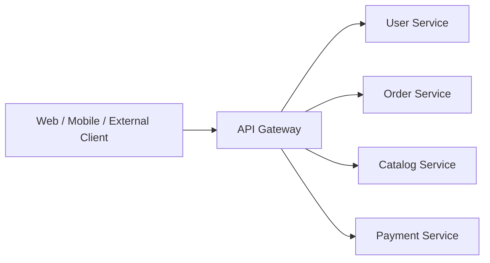
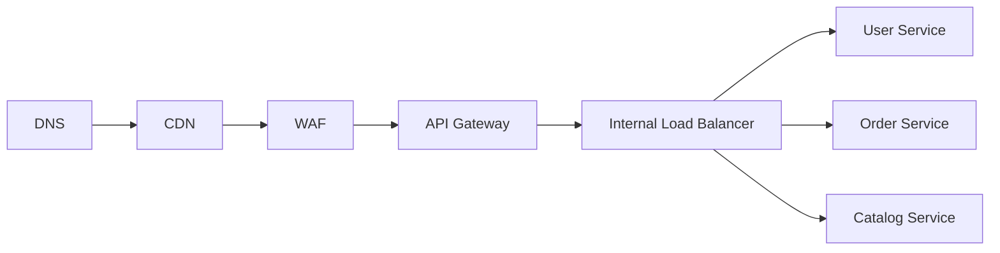
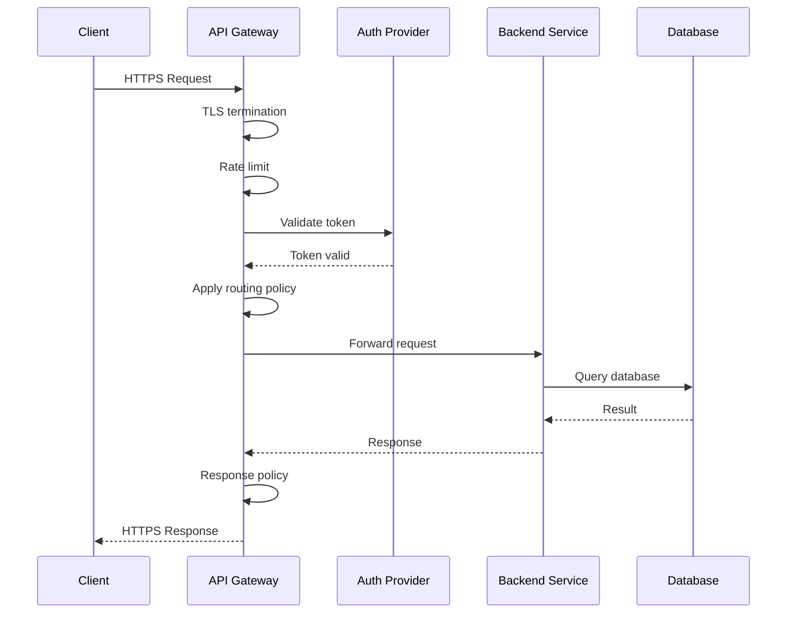
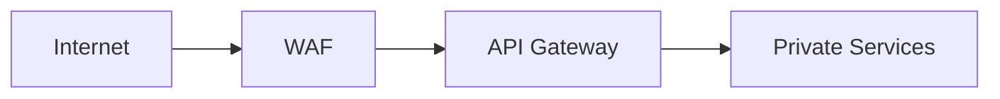
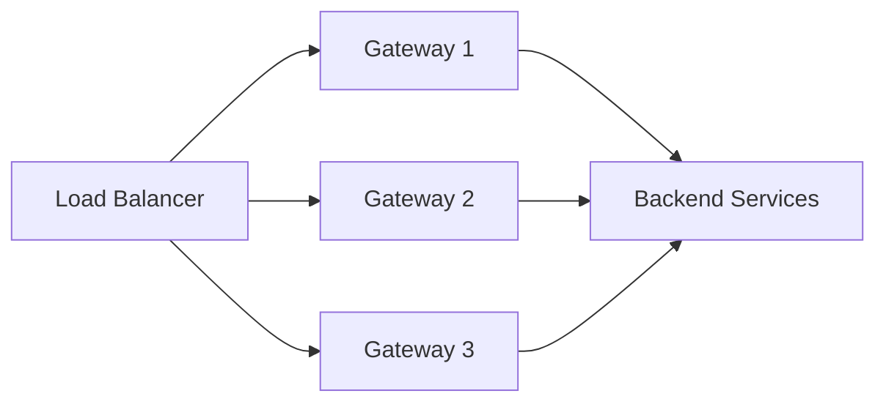

# 04- API Gateway

## Overview

An API Gateway is a controlled entry point between external clients and backend services. It receives client requests, applies cross-cutting policies, determines where requests should go, and returns responses to clients.

In a microservices architecture, the gateway commonly sits between the public internet and internal services:



The gateway is useful because exposing every internal service directly creates operational and security problems. Instead of requiring clients to understand the internal topology, the gateway provides a stable external API surface.

Typical responsibilities include:

- Request routing
- TLS termination
- Authentication
- Authorization
- Rate limiting
- Request validation
- API versioning
- CORS handling
- Load balancing
- Request transformation
- Response transformation
- Observability
- Traffic management
- Protection against malformed or abusive traffic

The gateway should generally handle **cross-cutting concerns**, not domain business logic.

## Why API Gateways Exist

Without a gateway, a client may need to communicate directly with multiple services:

```text
Mobile App
   |
   +--> User Service
   |
   +--> Order Service
   |
   +--> Payment Service
   |
   +--> Catalog Service
```

This exposes internal architecture to clients.

With a gateway:

```text
Mobile App
   |
   v
API Gateway
   |
   +--> User Service
   +--> Order Service
   +--> Payment Service
   +--> Catalog Service
```

The client only needs to know the gateway endpoint.

This provides an abstraction boundary between:

```text
External API contract
        |
        v
   API Gateway
        |
        v
Internal service topology
```

Internal services can therefore be deployed, scaled, or relocated without necessarily changing the public API.

## API Gateway vs Reverse Proxy vs Load Balancer

These concepts overlap but are not identical.

| Component | Primary Responsibility |
|---|---|
| Reverse proxy | Forward requests to backend servers |
| Load balancer | Distribute traffic across healthy instances |
| API gateway | Manage APIs and cross-cutting policies |
| Service mesh | Manage service-to-service traffic |
| WAF | Inspect and filter potentially malicious HTTP traffic |

A single infrastructure component can perform several roles.

For example, Nginx can act as:

- Reverse proxy
- Load balancer
- TLS terminator
- Basic rate limiter
- Request router

An API gateway usually provides a broader API management layer.

## Core Architecture

A production API gateway often sits behind DNS and sometimes a CDN/WAF:



Depending on the deployment platform, some of these responsibilities may be combined.

For example:

```text
Route 53
   |
   v
CloudFront
   |
   v
AWS WAF
   |
   v
API Gateway / ALB
   |
   v
ECS / EKS / EC2 Services
```

The correct architecture depends on traffic patterns, protocol requirements, latency requirements, security boundaries, and operational constraints.

## Request Lifecycle

A typical request can pass through several stages:



Each stage adds processing and potentially latency.

A gateway should therefore remain lightweight and predictable.

## Routing

Routing determines which backend service receives a request.

Example:

```text
/api/v1/users/*     -> User Service
/api/v1/orders/*    -> Order Service
/api/v1/catalog/*   -> Catalog Service
/api/v1/payments/*  -> Payment Service
```

A gateway can route based on:

- URL path
- HTTP method
- Hostname
- Headers
- Query parameters
- API version
- Authentication claims
- Traffic percentage

Example:

```text
/api/v1/orders/123
        |
        v
Order Service
```

Routing should be explicit and versionable.

## Path-Based Routing

Example Nginx configuration:

```nginx
server {
    listen 443 ssl;
    server_name api.example.com;

    location /api/v1/orders/ {
        proxy_pass http://order-service;
    }

    location /api/v1/users/ {
        proxy_pass http://user-service;
    }

    location /api/v1/catalog/ {
        proxy_pass http://catalog-service;
    }
}
```

For production systems, service discovery and dynamic upstream configuration should be handled carefully rather than hardcoding ephemeral container or pod addresses.

## Host-Based Routing

Different domains can route to different services:

```text
api.example.com      -> API Gateway
admin.example.com    -> Admin Service
auth.example.com     -> Authentication Service
```

This can be useful when APIs have distinct trust boundaries or deployment requirements.

## API Versioning

The gateway can expose versioned APIs:

```text
/api/v1/orders
/api/v2/orders
```

Internally:

```text
/api/v1/orders --> Order Service v1
/api/v2/orders --> Order Service v2
```

Versioning allows consumers to migrate independently.

Common strategies include:

| Strategy | Example |
|---|---|
| URI versioning | `/api/v1/orders` |
| Header versioning | `Accept: application/vnd.example.v2+json` |
| Query parameter | `/orders?version=2` |
| Host-based | `v2.api.example.com` |

URI versioning is often operationally straightforward, although the best strategy depends on the API governance model.

## Authentication

The gateway is a common location for authentication.

For example:

```http
GET /api/v1/orders
Authorization: Bearer eyJ...
```

The gateway validates the token and extracts identity information.

```text
Client
  |
  | Bearer token
  v
Gateway
  |
  | Validate
  v
Identity Provider
  |
  | Valid
  v
Backend Service
```

Common authentication mechanisms include:

- OAuth 2.0
- OpenID Connect
- JWT
- API keys
- Mutual TLS
- AWS IAM authentication

Authentication establishes **who the caller is**.

It does not automatically establish **what the caller is allowed to do**.

## Authorization

Authorization determines whether the authenticated identity can perform an operation.

For example:

```text
User authenticated
        |
        v
Is user allowed to access order 123?
        |
    +---+---+
    |       |
   Yes      No
    |       |
    v       v
Service   403
```

Authorization can be handled:

- At the gateway
- Inside backend services
- Through a combination of both

The gateway can enforce coarse-grained policies, but domain-specific authorization should usually remain close to the domain service.

For example:

```text
Gateway:
    "Is this caller authenticated?"

Order Service:
    "Does this user own order 123?"
```

This separation avoids putting business authorization rules into infrastructure configuration.

## Rate Limiting

The gateway is a natural enforcement point for rate limiting.

Example:

```text
Client
  |
  v
Gateway
  |
  | 100 requests/minute
  v
Backend
```

Rate limits can be applied by:

- IP address
- User ID
- API key
- Tenant
- Client application
- Endpoint

Example policy:

```text
Free tenant:
    100 requests/minute

Enterprise tenant:
    10,000 requests/minute
```

Rate limiting protects backend services from excessive traffic and abusive clients.

Common algorithms include:

- Token bucket
- Leaky bucket
- Fixed window
- Sliding window

For distributed gateways, rate-limit state may need to be shared using a distributed mechanism such as Redis or implemented by a managed gateway.

## Token Bucket

The token bucket model allows controlled bursts.

```text
Bucket capacity = 100 tokens
Refill rate     = 10 tokens/sec

Request arrives
      |
      v
Token available?
   /       \
 Yes        No
 |           |
Consume      Reject
token        request
```

If a client sends 20 requests immediately and enough tokens are available, the burst can be accepted.

The bucket then refills over time.

This is generally more flexible than a strict fixed-window limit.

## Load Balancing

The gateway may distribute requests across multiple instances:

```text
Gateway
   |
   +--> Service A - Instance 1
   +--> Service A - Instance 2
   +--> Service A - Instance 3
```

Common algorithms include:

- Round robin
- Least connections
- Weighted routing
- Consistent hashing
- Random selection

Health checks are essential.

An unhealthy instance should be removed from the traffic pool.

## Health Checks

A service can expose:

```http
GET /health/live
GET /health/ready
```

These should have distinct purposes.

### Liveness

Determines whether the process is alive.

```text
Process running?
```

### Readiness

Determines whether the instance should receive traffic.

```text
Can this instance safely serve requests?
```

For example, a service might be alive but unable to connect to a required database.

```text
Liveness  -> Healthy
Readiness -> Unhealthy
```

The gateway should generally route traffic based on readiness rather than simply process liveness.

## Timeouts

The gateway should enforce request deadlines.

Example:

```text
Client timeout:     5 seconds
Gateway timeout:    4 seconds
Backend timeout:    3 seconds
Database timeout:   2 seconds
```

The exact values depend on the application's latency budget.

A gateway timeout should prevent requests from remaining active indefinitely.

Without appropriate timeouts:

```text
Slow backend
     |
     v
Gateway connections accumulate
     |
     v
Gateway resources exhausted
     |
     v
Entire API becomes unavailable
```

## Retries

Gateways can perform retries for transient failures, but this must be handled carefully.

A retry can be dangerous for state-changing requests:

```http
POST /payments
```

If the first request succeeded but the response was lost, retrying may create a duplicate payment unless the operation is idempotent.

Safer candidates include:

- GET requests
- Explicitly idempotent operations
- Requests with idempotency keys
- Certain transient gateway failures

Avoid blindly configuring:

```text
retry = 5
```

for every route.

Retries should account for:

- HTTP method
- Operation semantics
- Error type
- Timeout budget
- Idempotency
- Retry count
- Backoff
- Jitter

## Circuit Breaking

A gateway can use circuit-breaking behavior to prevent repeated calls to an unhealthy backend.

```text
Closed
  |
  | repeated failures
  v
Open
  |
  | cooldown
  v
Half-Open
  |
  +--> success --> Closed
  |
  +--> failure --> Open
```

Circuit breaking is particularly useful when one backend is failing and continuing to send traffic would increase pressure on it.

However, circuit breakers should not replace proper service-level resilience.

## Request Transformation

The gateway may transform requests when necessary.

For example:

```text
External API
/api/v1/users

        |
        v

Internal API
/users
```

It may also:

- Add correlation IDs
- Normalize headers
- Validate request size
- Add trusted identity metadata
- Rewrite paths
- Normalize API versions

Transformation should remain simple.

Complex transformations can create hidden coupling between the gateway and backend implementations.

## Response Transformation

A gateway can also transform responses.

For example:

```text
Internal Service:

{
    "first_name": "Aranya",
    "last_name": "Majumdar",
    "internal_id": "123"
}
```

The external API might expose:

```json
{
  "name": "Aranya Majumdar"
}
```

This can be useful for API composition or compatibility, but excessive transformation can turn the gateway into a second application layer.

## API Composition

Sometimes a client needs data from several services.

Without a gateway:

```text
Mobile Client
  |
  +--> User Service
  +--> Order Service
  +--> Recommendation Service
```

With gateway composition:

```text
Mobile Client
      |
      v
API Gateway
   /    |    \
User  Order  Recommendation
   \    |    /
      Response
```

The gateway can aggregate responses into one API response.

This reduces client-side network calls.

However, composition increases gateway complexity and can increase latency.

If three services are called sequentially:

```text
Latency = T1 + T2 + T3
```

If they can safely execute concurrently:

```text
Latency ≈ max(T1, T2, T3)
```

The gateway therefore needs careful concurrency and timeout management.

## BFF Pattern

Backend for Frontend (BFF) is a specialized gateway architecture.

Instead of one generic gateway:

```text
Clients
   |
   v
API Gateway
   |
   +--> Services
```

there may be:

```text
Web Client --> Web BFF ----+
                           |
Mobile Client -> Mobile BFF +--> Backend Services
                           |
Admin Client -> Admin BFF -+
```

Each BFF optimizes the API for a specific client.

This is useful when:

- Web and mobile have different data requirements.
- Client-specific aggregation is significant.
- Release cycles differ.
- Payload requirements differ substantially.

The tradeoff is additional services and operational overhead.

## API Gateway vs BFF

| Aspect | API Gateway | BFF |
|---|---|---|
| Purpose | Generic API entry point | Client-specific backend |
| Routing | Core responsibility | Usually |
| Authentication | Common | Common |
| Rate limiting | Common | Common |
| Client-specific response shaping | Limited | Strong |
| Number of instances | Usually centralized | One or more per client |
| Business logic | Should be minimal | May contain client-specific orchestration |
| Best for | Shared API infrastructure | Multiple distinct client experiences |

A BFF can sit behind or replace parts of a conventional gateway layer.

## Security Boundary

The API gateway is often the first major application-level security boundary.



Security controls can include:

- TLS
- Authentication
- Authorization
- Rate limiting
- Request-size limits
- Schema validation
- IP restrictions
- WAF rules
- Bot protection
- DDoS protection
- Security headers
- Audit logging

Internal services should not assume that the gateway alone guarantees security.

Service-to-service authentication should still be enforced where required.

## TLS Termination

The gateway commonly terminates TLS:

```text
Client
  |
 HTTPS
  |
  v
Gateway
  |
  | Internal TLS or trusted network
  v
Service
```

For sensitive environments, encryption may continue internally:

```text
Client
  |
 HTTPS
  v
Gateway
  |
 mTLS
  v
Service
```

mTLS provides both encryption and service identity.

## Request Size Limits

Large request bodies can consume significant memory and bandwidth.

The gateway can enforce limits:

```text
Maximum request body:
10 MB
```

Requests exceeding the limit can be rejected early.

This prevents expensive processing from reaching backend services.

## CORS

For browser-based clients, the gateway may manage Cross-Origin Resource Sharing.

Example:

```http
Access-Control-Allow-Origin: https://app.example.com
Access-Control-Allow-Methods: GET, POST, PUT, DELETE
Access-Control-Allow-Headers: Authorization, Content-Type
```

Avoid using unrestricted policies such as:

```http
Access-Control-Allow-Origin: *
```

for authenticated applications unless the security model explicitly supports it.

## Observability

The gateway is an excellent location for measuring external API behavior.

Important metrics include:

| Metric | Purpose |
|---|---|
| Request rate | Traffic volume |
| 2xx rate | Successful requests |
| 4xx rate | Client errors |
| 5xx rate | Server-side failures |
| p50 latency | Typical latency |
| p95 latency | Tail latency |
| p99 latency | High tail latency |
| Upstream latency | Backend performance |
| Connection count | Resource usage |
| Active requests | Concurrency |
| Rate-limit rejects | Traffic control |
| Authentication failures | Security monitoring |
| Retry count | Resilience behavior |
| Circuit state | Dependency health |

The gateway should propagate a correlation or trace ID.

Example:

```http
X-Request-ID: 7c4a1b9f
```

For distributed tracing, use standardized tracing propagation such as W3C Trace Context where supported.

## Logging

Gateway logs should be structured.

Example:

```json
{
  "timestamp": "2026-08-23T14:20:10Z",
  "request_id": "req_123",
  "method": "GET",
  "path": "/api/v1/orders/123",
  "status": 200,
  "upstream": "order-service",
  "latency_ms": 42,
  "client_id": "mobile-app"
}
```

Do not log:

- Passwords
- Authorization headers
- Access tokens
- Session cookies
- Full payment credentials
- Sensitive personal data

Sensitive data should be redacted or excluded.

## Caching

Gateways can cache responses for suitable endpoints.

For example:

```text
GET /api/v1/catalog/products
```

may be cacheable.

A request can follow:

```text
Client
  |
  v
Gateway
  |
  +--> Cache HIT --> Response
  |
  +--> Cache MISS
          |
          v
       Backend
```

Caching can reduce:

- Backend load
- Network traffic
- Latency
- Database load

But caching introduces consistency concerns.

Avoid caching highly dynamic or security-sensitive responses without a well-defined cache policy.

## Cache-Control

HTTP caching should use explicit semantics.

Example:

```http
Cache-Control: public, max-age=60
```

For private user-specific data:

```http
Cache-Control: private, no-store
```

Never accidentally cache one user's personalized response and return it to another user.

## Scalability

The gateway itself can become a bottleneck.

A production gateway should generally be horizontally scalable:



Stateless gateways are easier to scale.

Avoid storing request-specific state in local memory unless the design explicitly supports it.

If distributed state is required, use an appropriate shared system such as Redis or a managed gateway capability.

## High Availability

A highly available gateway should avoid a single instance:

```text
Bad:

Internet
   |
   v
Gateway
   |
   v
Services
```

Prefer:

```text
Internet
   |
   v
Load Balancer
   |
   +--> Gateway A
   +--> Gateway B
   +--> Gateway C
```

Deploy instances across multiple availability zones where the platform supports it.

Also consider the availability of:

- DNS
- WAF
- Authentication provider
- Rate-limit store
- Service discovery
- Backend services

High availability is an end-to-end property.

## Kubernetes

In Kubernetes, a common architecture is:

```text
Internet
   |
   v
Ingress / Gateway
   |
   v
Kubernetes Service
   |
   +--> Pod
   +--> Pod
   +--> Pod
```

A Kubernetes `Service` provides stable discovery for backend pods.

Gateway implementations may include:

- NGINX Ingress
- Envoy-based gateways
- Cloud-provider gateways
- Kubernetes Gateway API implementations

Do not confuse an application API gateway with a Kubernetes Service. They solve different problems.

## AWS Architecture

A common AWS architecture can use:

```text
Route 53
   |
   v
CloudFront
   |
   v
AWS WAF
   |
   v
API Gateway / ALB
   |
   v
ECS / EKS
   |
   +--> Service A
   +--> Service B
   +--> Service C
```

Potential responsibilities:

| AWS Component | Typical Responsibility |
|---|---|
| Route 53 | DNS |
| CloudFront | CDN / edge delivery |
| AWS WAF | Web filtering |
| API Gateway | Managed API gateway |
| ALB | Layer 7 load balancing |
| ECS | Container orchestration |
| EKS | Kubernetes |
| IAM | Identity and authorization |
| CloudWatch | Metrics/logging |
| X-Ray / tracing tools | Distributed tracing |

The architecture should avoid duplicating capabilities unnecessarily.

## Nginx as an API Gateway

Nginx is commonly used as a reverse proxy and can provide gateway-like capabilities.

Example:

```nginx
upstream order_service {
    server order-service-1:8000;
    server order-service-2:8000;
}

server {
    listen 443 ssl;
    server_name api.example.com;

    location /api/v1/orders/ {
        proxy_pass http://order_service;

        proxy_set_header Host $host;
        proxy_set_header X-Request-ID $request_id;
        proxy_set_header X-Forwarded-For $proxy_add_x_forwarded_for;

        proxy_connect_timeout 2s;
        proxy_read_timeout 5s;
    }
}
```

Nginx can handle many gateway responsibilities, but it is not automatically a complete API-management platform.

For complex requirements involving:

- Developer portals
- API subscriptions
- Advanced authentication
- Usage plans
- Dynamic policies
- Rich analytics

a dedicated API gateway product may be more appropriate.

## API Gateway vs Service Mesh

These solve different communication boundaries.

```text
External Traffic

Client
  |
  v
API Gateway
  |
  v
Service A
  |
  v
Service B
  |
  v
Service C
```

The API gateway primarily handles:

```text
North-South traffic
```

A service mesh primarily handles:

```text
East-West traffic
```

| Concern | API Gateway | Service Mesh |
|---|---|---|
| External clients | Excellent | Usually not primary purpose |
| Service-to-service | Possible | Excellent |
| Authentication | Excellent | Excellent |
| mTLS | Possible | Strong |
| Rate limiting | Excellent | Possible |
| Routing | Excellent | Excellent |
| API management | Strong | Weak |
| Traffic policies | Strong | Strong |
| Developer API lifecycle | Strong | Weak |
| Typical placement | Edge | Internal network |

They can coexist.

## API Gateway vs Load Balancer

A load balancer answers:

> Which healthy backend instance should receive this request?

An API gateway answers:

> Is this request allowed, which API does it belong to, what policy applies, and where should it go?

A gateway can use a load balancer underneath it.

```text
Client
  |
  v
API Gateway
  |
  v
Load Balancer
  |
  +--> Instance A
  +--> Instance B
```

## Failure Handling

The gateway must define behavior when downstream services fail.

Possible strategies include:

### Fail Fast

```text
Service unavailable
       |
       v
Return 503
```

Appropriate when the dependency is mandatory.

### Fallback

```text
Recommendation Service unavailable
       |
       v
Return products without recommendations
```

Appropriate when functionality is optional.

### Cached Response

```text
Backend unavailable
       |
       v
Return recently cached data
```

Appropriate for suitable read-heavy APIs.

### Asynchronous Degradation

Instead of waiting:

```text
Request accepted
      |
      v
Queue background work
      |
      v
202 Accepted
```

This is appropriate when the API contract supports asynchronous processing.

## Error Handling

The gateway should expose consistent external error formats.

Example:

```json
{
  "error": {
    "code": "RATE_LIMITED",
    "message": "Too many requests",
    "request_id": "req_123"
  }
}
```

Avoid exposing internal details:

```json
{
  "error": "PostgreSQL connection failed on db-node-7"
}
```

Internal infrastructure details can leak sensitive information and make APIs harder to evolve.

A gateway can normalize infrastructure-level failures into stable API errors.

## Request Correlation

The gateway is a good place to establish a request ID.

```text
Client
  |
  | X-Request-ID
  v
Gateway
  |
  | propagate
  v
Order Service
  |
  | propagate
  v
Payment Service
```

All services should preserve the identifier.

This allows operators to search logs across the entire request path.

## Rate Limit State

For a single gateway instance, local memory may work:

```text
Gateway A
  |
  +--> Local counter
```

But with multiple instances:

```text
Gateway A --> counter A
Gateway B --> counter B
Gateway C --> counter C
```

the effective rate limit becomes inconsistent.

A distributed design can use:

```text
Gateway A --+
Gateway B ---+--> Redis
Gateway C --+
```

The exact implementation must consider:

- Atomicity
- Redis availability
- Network latency
- Key cardinality
- Expiration
- Failure behavior

A rate limiter should not itself become a single point of failure unless the availability tradeoff is intentional.

## Multi-Tenant APIs

In SaaS systems, gateway policies can be tenant-aware:

```text
Request
   |
   v
Authenticate tenant
   |
   v
Determine plan
   |
   +--> Free
   +--> Pro
   +--> Enterprise
   |
   v
Apply rate limit
   |
   v
Route request
```

Policies can include:

- Rate limits
- Quotas
- API access
- Allowed regions
- Feature flags
- Authentication requirements

Tenant identity should come from a trusted authentication mechanism, not an arbitrary client-provided header.

## Deployment Strategies

Gateway changes affect all clients, so deployment safety is important.

Useful techniques include:

- Blue-green deployments
- Canary releases
- Rolling deployments
- Configuration validation
- Automated smoke tests
- Contract tests
- Traffic shadowing where appropriate

A malformed routing rule can break an entire API surface.

Treat gateway configuration as production code.

## Configuration Management

Do not manually edit production gateway configuration.

Store configuration in version control:

```text
gateway/
├── routes/
├── policies/
├── authentication/
├── rate-limits/
└── tests/
```

Changes should pass:

```text
Commit
  |
  v
Validation
  |
  v
Automated tests
  |
  v
Review
  |
  v
Deployment
```

CI/CD should validate configuration before rollout.

## Common Mistakes

### Putting Business Logic in the Gateway

Bad:

```text
Gateway
  |
  +--> Calculate discounts
  +--> Validate inventory rules
  +--> Determine payment state
```

This creates a central bottleneck and makes the gateway harder to maintain.

Keep domain logic in domain services.

### Making the Gateway a Single Point of Failure

A single gateway instance can take down the entire application.

Use multiple instances and appropriate health checks.

### Unlimited Gateway Retries

Retries can amplify downstream failures.

Use bounded retries and respect the request deadline.

### Trusting Client Headers

Do not trust:

```http
X-User-Role: admin
```

because the client can forge it.

Identity and authorization information must originate from a trusted authentication mechanism.

### Exposing Internal Services

Avoid publicly exposing:

```text
payment.internal.example.com
inventory.internal.example.com
```

unless there is a deliberate security architecture requiring it.

Prefer controlled external access through the gateway.

### Logging Credentials

Never log:

```http
Authorization: Bearer eyJ...
```

or sensitive request bodies by default.

### Overusing API Composition

Calling ten services from the gateway for one request can create:

- High latency
- Increased failure probability
- High gateway CPU usage
- Complex dependency management

Use aggregation only where it materially improves the client API.

### Using Local State in a Distributed Gateway

A local session, rate-limit counter, or authorization cache can behave inconsistently across gateway instances.

Use stateless designs or explicitly distributed state.

### Ignoring Gateway Latency

Gateway processing adds latency.

Monitor:

```text
Gateway latency
Upstream latency
Total latency
```

so that gateway overhead can be distinguished from backend performance.

## Operational Checklist

Before deploying an API gateway, verify:

- TLS is configured correctly.
- Authentication is enforced.
- Authorization boundaries are defined.
- Rate limits are configured.
- Request size limits are enforced.
- Timeouts are explicit.
- Retries are bounded.
- Retryable operations are understood.
- Idempotency is supported for appropriate mutations.
- Health checks are configured.
- Gateway instances are horizontally scalable.
- Gateway configuration is version-controlled.
- Logs do not expose secrets.
- Request IDs are propagated.
- Distributed tracing is enabled where appropriate.
- 4xx and 5xx metrics are monitored.
- p95/p99 latency is monitored.
- Backend failures have explicit behavior.
- Deployment supports rollback.
- Gateway configuration is validated in CI/CD.

## Interview Traps

### "The API Gateway Should Contain All Business Logic"

Incorrect.

The gateway should primarily provide routing and cross-cutting concerns.

### "API Gateway and Load Balancer Are the Same"

Incorrect.

A load balancer distributes traffic; an API gateway additionally manages API-level policies and contracts.

### "The Gateway Makes Microservices Independent"

Not automatically.

A gateway can hide topology from clients, but excessive gateway orchestration can create tight coupling between the gateway and internal services.

### "One Gateway Is Enough"

A gateway is often a logical component rather than one physical server.

Production deployments normally use multiple instances or managed highly available infrastructure.

### "Authentication at the Gateway Is Enough"

Not necessarily.

Sensitive internal services may require independent authentication and authorization.

### "API Gateway Should Retry Every Failed Request"

Incorrect.

Retry safety depends on operation semantics, idempotency, timeout budgets, and error type.

## Key Takeaways

- **An API gateway provides a stable external API boundary for routing, authentication, rate limiting, traffic control, observability, and other cross-cutting concerns.**
- **Keep business logic out of the gateway; domain rules should remain owned by backend services.**
- **Design gateways as highly available, horizontally scalable infrastructure with explicit timeouts, bounded retries, health checks, and controlled failure behavior.**
- **Treat gateway configuration as production code: version it, test it, review it, deploy it through CI/CD, and maintain rollback capability.**
- **Use the gateway for north-south traffic and consider service meshes or direct service communication patterns for east-west traffic; the two concerns can coexist.**