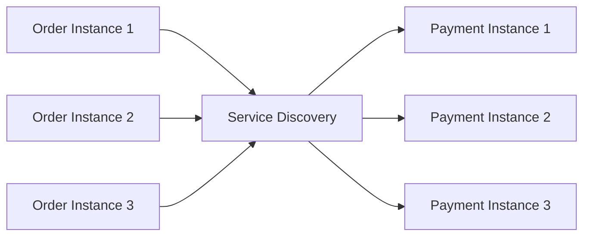
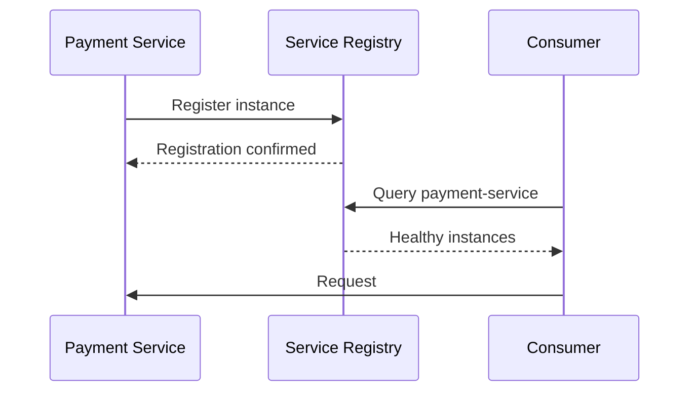
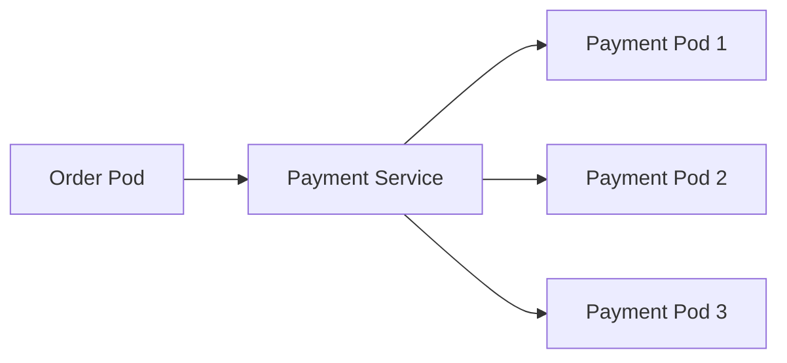
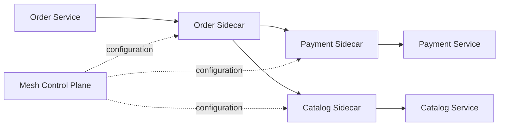
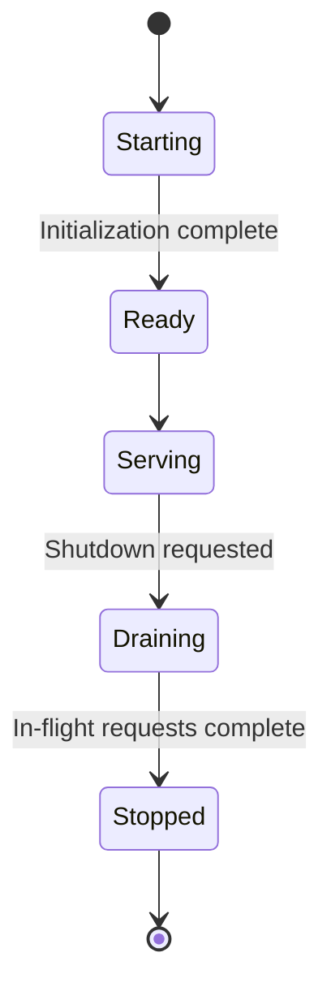

# 05- Service Discovery

## Overview

Service discovery is the mechanism that allows one service to locate another service dynamically without relying on hardcoded network addresses.

In a microservices architecture, service instances are usually ephemeral. Containers and Kubernetes pods can be created, destroyed, restarted, rescheduled, or scaled horizontally. Their IP addresses may therefore change frequently.

Instead of configuring:

```text
Order Service
    |
    | http://10.20.4.17:8000
    v
Payment Service
```

the caller uses a logical service identity:

```text
Order Service
    |
    | payment-service
    v
Service Discovery
    |
    v
Healthy Payment Instance
```

Service discovery separates **service identity** from **service location**.

This is important because scalable systems need to answer two questions independently:

- **What service am I trying to reach?**
- **Where is a currently healthy instance of that service?**

Service discovery is closely related to load balancing, health checking, DNS, Kubernetes Services, cloud service registries, and service meshes.

## Why Service Discovery Exists

In a small application, backend addresses can sometimes be configured statically:

```text
PAYMENT_HOST=10.0.1.20
PAYMENT_PORT=8000
```

This becomes fragile when multiple instances exist:

```text
Payment Instance 1 -> 10.0.1.20
Payment Instance 2 -> 10.0.2.14
Payment Instance 3 -> 10.0.3.51
```

Instances can change because of:

- Horizontal scaling
- Container restarts
- Kubernetes rescheduling
- Auto Scaling
- Deployment rollouts
- Instance failures
- Availability Zone failures
- Spot instance termination
- Infrastructure replacement

A service consumer should not need to track these changes manually.

Service discovery provides a dynamic mapping:

```text
payment-service
      |
      +--> 10.0.1.20:8000
      +--> 10.0.2.14:8000
      +--> 10.0.3.51:8000
```

When an instance disappears, discovery should stop returning it.

## Core Problem

Consider three Order Service instances calling Payment Service.

Without discovery:

```text
Order 1 ---> 10.0.1.20
Order 2 ---> 10.0.1.20
Order 3 ---> 10.0.1.20
```

If that instance fails, all three callers may fail.

With service discovery:



The discovery mechanism can return healthy instances dynamically.

## Service Identity

A service should have a stable logical identity.

For example:

```text
payment-service
order-service
inventory-service
user-service
notification-service
```

The identity should not depend on an individual container or pod IP.

The mapping becomes:

```text
Logical Service Name
        |
        v
Available Instances
```

For example:

```text
payment-service
        |
        +--> 10.0.1.10:8000
        +--> 10.0.2.20:8000
        +--> 10.0.3.30:8000
```

This abstraction allows infrastructure to change without requiring application configuration changes.

## Service Discovery Models

The two major models are:

| Model | Description |
|---|---|
| Client-side discovery | Client queries discovery and selects an instance |
| Server-side discovery | Client calls a stable endpoint and infrastructure selects an instance |

### Client-Side Discovery

```text
Order Service
      |
      | Query registry
      v
Service Registry
      |
      | instances
      v
Order Service
      |
      | choose instance
      v
Payment Service
```

The client is responsible for selecting the destination.

### Server-Side Discovery

```text
Order Service
      |
      v
Load Balancer / Proxy
      |
      v
Service Registry
      |
      +--> Payment Instance 1
      +--> Payment Instance 2
      +--> Payment Instance 3
```

The client only knows the stable endpoint.

## Client-Side vs Server-Side Discovery

| Aspect | Client-Side | Server-Side |
|---|---|---|
| Client chooses instance | Yes | No |
| Client needs registry knowledge | Usually | No |
| Infrastructure complexity | Lower | Higher |
| Client complexity | Higher | Lower |
| Load balancing | Client-side | Infrastructure-side |
| Failure handling | Client responsibility | Proxy/LB responsibility |
| Typical examples | Custom registry clients | Kubernetes Service, ALB, service proxy |

Both models are valid.

The correct choice depends on the deployment environment and operational requirements.

## Service Registry

A service registry maintains information about available service instances.

Conceptually:

```text
Service Registry

payment-service:
    10.0.1.10:8000
    10.0.2.20:8000
    10.0.3.30:8000

order-service:
    10.0.4.10:8000
    10.0.5.20:8000
```

The registry may also store metadata:

```text
service:
    payment-service

instance:
    host: 10.0.1.10
    port: 8000
    zone: ap-south-1a
    version: v2
    status: healthy
```

Potential registry technologies include:

- Kubernetes Service
- AWS Cloud Map
- Consul
- Eureka
- etcd
- DNS
- Service mesh control planes

The registry should be treated as infrastructure, not as an application database.

## Registration

When an instance starts, it needs to become discoverable.

A conceptual registration flow is:



Registration can be:

- Explicit
- Automatic
- Platform-managed
- DNS-based
- Container-orchestrator-managed

In Kubernetes, applications generally do not manually register their pods in a service registry. Kubernetes manages service endpoints through its control plane.

## Deregistration

When an instance stops serving traffic, it should no longer be returned by discovery.

```text
Instance
   |
   | shutdown
   v
Registry
   |
   | remove instance
   v
Only healthy instances remain
```

This becomes particularly important during deployments.

A graceful shutdown should generally:

1. Stop accepting new work.
2. Allow in-flight requests to finish within a deadline.
3. Become unready.
4. Be removed from traffic.
5. Terminate the process.

This prevents new requests from being sent to an instance that is shutting down.

## Health Checking

Registration alone does not mean an instance is healthy.

A registry may track:

```text
Registered
    |
    v
Health Check
    |
 +--+--+
 |     |
OK   Failed
 |     |
 v     v
Ready  Remove
```

Health checks may be:

- HTTP
- TCP
- gRPC
- Application-level
- Process-level
- Platform-managed

For example:

```http
GET /health/ready
```

A readiness check should represent whether the instance can actually serve traffic.

## Liveness vs Readiness

These should not be treated as the same signal.

| Check | Question |
|---|---|
| Liveness | Is the process alive? |
| Readiness | Can this instance serve traffic? |

Consider a Django service that has started successfully but cannot connect to PostgreSQL.

It may be:

```text
Liveness:  Healthy
Readiness: Unhealthy
```

The process is alive, but sending application traffic to it may produce errors.

For service discovery and traffic routing, readiness is usually the more useful signal.

## DNS-Based Discovery

DNS is one of the simplest forms of service discovery.

Instead of:

```text
http://10.20.10.25:8000
```

the application uses:

```text
http://payment-service.internal:8000
```

DNS resolves the logical name.

```text
payment-service.internal
          |
          v
DNS Resolver
          |
          v
IP address / service endpoint
```

DNS-based discovery is attractive because it uses mature infrastructure and requires relatively little application-specific code.

## DNS TTL

DNS records are cached according to their TTL.

For example:

```text
payment-service.internal
TTL = 10 seconds
```

A client may continue using a previously resolved address until the TTL expires.

This creates a tradeoff:

| Lower TTL | Higher TTL |
|---|---|
| Faster topology changes | More caching |
| More DNS queries | Fewer DNS queries |
| Better failure responsiveness | Lower DNS overhead |
| Potentially higher DNS cost/load | Staler information |

DNS is therefore not an instantaneous service registry.

## DNS and Connection Pooling

An important production detail is that DNS resolution and TCP connection reuse are separate concerns.

Suppose:

```text
payment-service.internal
```

resolves to:

```text
10.0.1.10
```

An HTTP client may establish a persistent connection to that address.

Later DNS changes:

```text
payment-service.internal
        |
        v
10.0.2.20
```

Existing connections may continue to use the old address.

This means service discovery behavior depends on:

- DNS TTL
- DNS resolver caching
- Application DNS behavior
- HTTP connection pooling
- TCP keepalive
- Load balancer behavior

This is a common source of confusion in distributed systems.

## Kubernetes Service Discovery

Kubernetes provides service discovery natively.

Consider:

```text
Deployment
    |
    +--> Pod
    +--> Pod
    +--> Pod

Service
    |
    v
Stable virtual endpoint
```

A Kubernetes Service provides a stable network identity while pods remain ephemeral.



The client does not need to know individual pod IPs.

## Kubernetes Service Example

```yaml
apiVersion: v1
kind: Service
metadata:
  name: payment-service
spec:
  selector:
    app: payment
  ports:
    - name: http
      port: 8000
      targetPort: 8000
```

A consumer can call:

```text
http://payment-service:8000
```

within the appropriate Kubernetes DNS scope.

Kubernetes maintains the service endpoints based on matching pods.

## Kubernetes DNS

Kubernetes commonly provides DNS names such as:

```text
payment-service
```

or, when a fully qualified name is needed:

```text
payment-service.production.svc.cluster.local
```

The exact form depends on namespace and cluster DNS configuration.

Within the same namespace, applications commonly use:

```text
http://payment-service:8000
```

This is preferable to hardcoding pod IPs.

## Kubernetes Endpoint Management

Conceptually:

```text
Payment Pods
     |
     | labels
     v
Service Selector
     |
     v
EndpointSlice
     |
     v
Service
```

EndpointSlices allow Kubernetes to represent service endpoints efficiently at scale.

A pod that becomes unready should not continue receiving normal service traffic through the readiness-aware endpoint mechanism.

## AWS Service Discovery

AWS environments can use AWS Cloud Map for service discovery.

A conceptual architecture is:

```text
ECS / EC2 / other workloads
          |
          v
AWS Cloud Map
          |
          v
Service instances
```

Applications can discover services using APIs or DNS-based namespaces depending on configuration.

This is useful when workloads need dynamic service registration without maintaining their own registry infrastructure.

## Client-Side Load Balancing

Client-side discovery often includes client-side load balancing.

Suppose discovery returns:

```text
Payment:
    A
    B
    C
```

The client selects an instance:

```text
Request 1 -> A
Request 2 -> B
Request 3 -> C
Request 4 -> A
```

Possible algorithms include:

- Round robin
- Weighted round robin
- Random
- Least loaded
- Consistent hashing
- Zone-aware routing

Client-side load balancing can reduce dependency on a centralized proxy but increases client complexity.

## Server-Side Load Balancing

With server-side discovery:

```text
Client
   |
   v
Stable Endpoint
   |
   v
Load Balancer
   |
   +--> A
   +--> B
   +--> C
```

The client does not need to know which instance is selected.

This is common with:

- Kubernetes Services
- AWS load balancers
- Nginx
- Envoy
- HAProxy

## Service Mesh Discovery

A service mesh typically adds service discovery and traffic management capabilities around service-to-service communication.



The application can often call a logical service name while the sidecar or node-level proxy handles:

- Service discovery
- Load balancing
- mTLS
- Retries
- Timeouts
- Traffic policies
- Telemetry

This shifts complexity from application code into infrastructure.

## Service Discovery and API Gateway

These concepts solve different problems.

```text
External Client
      |
      v
API Gateway
      |
      v
Service Discovery
      |
      v
Backend Service
```

The API gateway primarily manages external API traffic.

Service discovery determines where backend services are located.

A gateway can itself use service discovery to route requests dynamically.

## Service Discovery and Service Mesh

| Concern | Service Discovery | Service Mesh |
|---|---|---|
| Locate services | Core responsibility | Included |
| Health information | Common | Common |
| Load balancing | Often | Yes |
| mTLS | Not primary | Common |
| Retries | Not always | Common |
| Traffic splitting | Limited | Strong |
| Observability | Limited | Strong |
| Application integration | Often direct | Often transparent |
| Operational complexity | Lower | Higher |

A service mesh is broader than service discovery.

## Failure Modes

Service discovery itself can fail.

Potential failures include:

- Registry unavailable
- DNS unavailable
- Stale DNS records
- Incorrect health checks
- Registration failure
- Deregistration failure
- Network partition
- Control-plane failure
- Client-side cache corruption
- Incorrect service metadata

A resilient system should avoid making every request synchronously dependent on the registry.

For example, this design is risky:

```text
Every request
     |
     v
Query registry
     |
     v
Call service
```

A better design may cache discovery information:

```text
Service Client
     |
     +--> Local discovery cache
     |
     v
Backend Service
```

The cache must have bounded staleness and appropriate failure behavior.

## Stale Discovery Information

Suppose a registry says:

```text
Payment A = healthy
```

but Payment A has already crashed.

A client may still attempt:

```text
Request -> Payment A
```

This is why service discovery must be combined with:

- Health checks
- Timeouts
- Connection failure handling
- Retries where safe
- Circuit breakers
- Load balancing

Service discovery improves routing but does not eliminate network failures.

## Availability and Consistency

Service discovery often involves a tradeoff between:

- Availability
- Freshness
- Consistency
- Operational simplicity

For example, continuing to use a slightly stale endpoint list may be better than refusing all traffic because the registry is temporarily unavailable.

This is especially relevant during network partitions.

A practical client may behave like:

```text
Registry available?
   |
 +--+--+
 |     |
Yes    No
 |     |
 v     v
Refresh Use cached
cache   endpoints
```

The cached endpoints must still be protected by connection timeouts and health-aware failure handling.

## Deployment and Rolling Updates

Service discovery is particularly important during deployments.

Suppose version 1 is running:

```text
payment-service:
    v1
    v1
    v1
```

A rolling deployment introduces v2:

```text
payment-service:
    v1
    v1
    v2
```

Then:

```text
payment-service:
    v1
    v2
    v2
```

Eventually:

```text
payment-service:
    v2
    v2
    v2
```

Discovery should expose only instances that are ready to serve traffic.

A correct readiness strategy prevents requests from reaching v2 before initialization is complete.

## Graceful Shutdown

Graceful shutdown and service discovery must work together.

A typical lifecycle is:



When shutdown begins:

```text
Ready
  |
  v
Not Ready
  |
  v
Removed from service endpoints
  |
  v
Drain existing requests
  |
  v
Terminate
```

This reduces failed requests during deployments.

## Service Metadata

Discovery systems may expose metadata beyond addresses.

Example:

```json
{
  "service": "payment-service",
  "host": "10.0.2.10",
  "port": 8000,
  "version": "v2",
  "region": "ap-south-1",
  "zone": "ap-south-1a",
  "weight": 100
}
```

Metadata can support:

- Version routing
- Zone-aware routing
- Region-aware routing
- Canary releases
- Weighted traffic
- Capability-based routing

Do not put arbitrary application state into service discovery metadata. Keep it focused on routing and service topology.

## Zone-Aware Routing

In multi-AZ deployments, it can be preferable to route traffic to instances in the same availability zone when practical.

```text
Order Service
    |
    v
ap-south-1a
    |
    +--> Payment A

If unavailable:

ap-south-1b
    |
    +--> Payment B
```

This can reduce:

- Cross-AZ latency
- Cross-AZ network traffic
- Cross-AZ data transfer cost

However, strict zone affinity can reduce resilience if one zone becomes unhealthy.

A good design balances locality with failover.

## Region-Aware Discovery

Global systems may maintain regional instances:

```text
India
  |
  +--> payment-ap-south-1

Europe
  |
  +--> payment-eu-west-1

US
  |
  +--> payment-us-east-1
```

Requests can be routed to the nearest or preferred region.

Global routing should account for:

- Latency
- Data residency
- Compliance
- Regional capacity
- Disaster recovery
- Replication state

Do not assume the nearest region is always the correct region.

## Security Considerations

Service discovery can expose sensitive infrastructure information.

Potentially sensitive metadata includes:

- Private IP addresses
- Internal hostnames
- Ports
- Service versions
- Availability Zones
- Environment names

Protect the discovery system with:

- Authentication
- Authorization
- Network isolation
- Encryption
- Audit logging
- Least-privilege access

For example, an Order Service should not necessarily be allowed to discover every internal service.

Use service-level permissions where the platform supports them.

## Observability

Service discovery should be observable like any other critical infrastructure.

Monitor:

| Metric | Why It Matters |
|---|---|
| Registered instances | Detect topology changes |
| Healthy instances | Detect service degradation |
| Registration failures | Detect startup problems |
| Deregistration failures | Prevent stale endpoints |
| Discovery latency | Detect control-plane issues |
| DNS resolution failures | Detect naming problems |
| Stale endpoint rate | Detect unhealthy cache behavior |
| Registry availability | Detect infrastructure failure |
| Health-check failures | Detect service degradation |

Also monitor the application symptoms caused by discovery failures:

- Connection errors
- DNS errors
- Timeout rates
- 5xx responses
- Increased retry counts

## Performance Considerations

Service discovery adds infrastructure work.

Potential overhead includes:

- DNS lookups
- Registry queries
- Health checks
- Endpoint synchronization
- Connection establishment
- Proxy processing

Avoid querying a registry for every application request unless there is a specific architectural reason.

Prefer:

```text
Startup / periodic refresh
        |
        v
Local endpoint cache
        |
        v
Request processing
```

rather than:

```text
Request
   |
   v
Registry
   |
   v
Backend
```

Connection pooling can also significantly reduce network overhead.

## Python Example

A Python service should normally use a stable service endpoint rather than hardcoding ephemeral IP addresses.

For example:

```python
from os import getenv

PAYMENT_SERVICE_URL = getenv(
    "PAYMENT_SERVICE_URL",
    "http://payment-service:8000",
)
```

The application can then call:

```python
import httpx

from os import getenv

PAYMENT_SERVICE_URL = getenv(
    "PAYMENT_SERVICE_URL",
    "http://payment-service:8000",
)


async def get_payment(payment_id: str) -> dict:
    url = f"{PAYMENT_SERVICE_URL}/api/v1/payments/{payment_id}"

    async with httpx.AsyncClient(timeout=3.0) as client:
        response = await client.get(url)
        response.raise_for_status()
        return response.json()
```

The application depends on:

```text
payment-service
```

rather than:

```text
10.42.1.17
```

In production, the HTTP client should generally be reused rather than creating a new client for every request, so connection pooling is preserved.

## FastAPI Example

A FastAPI application can consume another service through a stable discovery name:

```python
from fastapi import FastAPI, HTTPException
import httpx

app = FastAPI()

payment_client = httpx.AsyncClient(
    base_url="http://payment-service:8000",
    timeout=httpx.Timeout(3.0),
)


@app.get("/orders/{order_id}")
async def get_order(order_id: str) -> dict:
    try:
        response = await payment_client.get(
            f"/api/v1/payments/order/{order_id}"
        )
        response.raise_for_status()
    except httpx.TimeoutException as exc:
        raise HTTPException(
            status_code=504,
            detail="Payment service timeout",
        ) from exc
    except httpx.HTTPError as exc:
        raise HTTPException(
            status_code=502,
            detail="Payment service unavailable",
        ) from exc

    return response.json()
```

In a production application, lifecycle management should explicitly close the shared client during application shutdown.

## Configuration

Service endpoints should be environment-specific.

Example:

```bash
PAYMENT_SERVICE_URL=http://payment-service:8000
```

Development:

```bash
PAYMENT_SERVICE_URL=http://localhost:8002
```

Production:

```bash
PAYMENT_SERVICE_URL=http://payment-service.production.svc.cluster.local:8000
```

The application code remains unchanged.

This is configuration-driven service location rather than hardcoded infrastructure topology.

## Service Discovery in Docker Compose

Docker Compose provides basic service discovery through service names.

Example:

```yaml
services:
  order-service:
    build: ./order-service
    depends_on:
      - payment-service

  payment-service:
    build: ./payment-service
```

The Order Service can communicate using:

```text
http://payment-service:8000
```

Docker's internal DNS resolves the service name.

This is simple and useful for local development, but production environments often require more advanced health checking, orchestration, scaling, and traffic-management capabilities.

## Docker Networking

Containers on the same Docker network can communicate using service names:

```text
order-service
      |
      | DNS
      v
payment-service
      |
      v
container IP
```

Do not use container IP addresses directly because they can change when containers are recreated.

## Service Discovery with gRPC

gRPC clients also need to resolve logical service addresses.

Conceptually:

```text
order-service
      |
      | payment-service:50051
      v
Service Discovery
      |
      v
Payment instances
```

Discovery can be provided by:

- DNS
- Kubernetes Services
- Service mesh
- Cloud service discovery
- Custom resolver implementations

For high-throughput internal communication, gRPC combined with Kubernetes service discovery or a service mesh is a common architecture.

## Service Discovery vs Configuration

These are related but different.

Static configuration:

```text
PAYMENT_HOST=payment-service
PAYMENT_PORT=8000
```

Service discovery:

```text
payment-service
      |
      +--> instance A
      +--> instance B
      +--> instance C
```

Configuration tells the application **which logical service to use**.

Service discovery determines **which concrete instance can serve the request**.

A mature architecture often uses both.

## Service Discovery vs API Gateway

| Concern | Service Discovery | API Gateway |
|---|---|---|
| Locate internal service | Yes | Often indirectly |
| External API entry point | No | Yes |
| Dynamic endpoint resolution | Yes | Possible |
| Authentication | Usually not primary | Common |
| Rate limiting | Usually not primary | Common |
| Internal load balancing | Common | Common |
| API versioning | No | Common |
| Service topology abstraction | Yes | Yes |

They frequently work together:

```text
Client
  |
  v
API Gateway
  |
  | discover
  v
Order Service
  |
  | discover
  v
Payment Service
```

## Common Mistakes

### Hardcoding Pod or Container IPs

Bad:

```text
PAYMENT_HOST=10.42.3.17
```

These addresses are ephemeral.

Use a stable service identity.

### Querying the Registry for Every Request

This increases:

- Latency
- Registry load
- Failure coupling

Cache discovery information where appropriate.

### Treating Registration as Health

A registered service can still be unhealthy.

Use readiness and health checks.

### Ignoring Stale Endpoints

Discovery data can become stale.

Always use:

- Connection timeouts
- Failure handling
- Health-aware routing
- Bounded retries
- Circuit breakers where appropriate

### Using Liveness as Readiness

A running process does not necessarily mean it can serve requests.

Use a meaningful readiness check.

### Making Discovery a Single Point of Failure

If every request requires the registry to be available, registry failure can become application-wide failure.

Use resilient discovery mechanisms and cached endpoint information.

### Ignoring DNS Caching

Changing a DNS record does not necessarily terminate existing connections immediately.

Consider DNS caching and connection-pool behavior.

### Registering Too Much Metadata

Do not turn service discovery into a general-purpose configuration database.

Keep metadata focused on service topology and routing.

### Forgetting Graceful Shutdown

An instance can continue receiving requests while terminating if deregistration and readiness are not coordinated.

Implement graceful draining.

## Production Best Practices

A production service discovery design should generally follow these principles:

- Use stable logical service names.
- Never depend on ephemeral container or pod IPs.
- Prefer platform-native discovery where available.
- Use readiness checks for traffic eligibility.
- Make discovery highly available.
- Cache discovery results where appropriate.
- Bound the lifetime of stale endpoint information.
- Combine discovery with timeouts and failure handling.
- Use connection pooling.
- Support graceful shutdown and endpoint draining.
- Protect discovery metadata with authentication and authorization.
- Monitor registration and health-check failures.
- Keep service discovery metadata focused.
- Prefer zone-aware routing when appropriate.
- Preserve cross-zone failover capability.
- Version and test service-discovery configuration.
- Avoid unnecessary custom discovery infrastructure when Kubernetes or cloud-native mechanisms already solve the problem.

## Architecture Decision Guide

| Environment | Recommended Approach |
|---|---|
| Local Docker development | Docker Compose DNS |
| Kubernetes | Kubernetes Service + DNS |
| AWS managed workloads | AWS Cloud Map, ALB/NLB, or platform-native discovery |
| Simple VM environment | DNS or load balancer |
| Large microservice platform | Platform discovery + service mesh where justified |
| Complex global deployment | Regional/global discovery with health-aware routing |
| Highly specialized platform | Dedicated registry such as Consul may be appropriate |

The simplest mechanism that satisfies the requirements is usually preferable.

## Interview Traps

### "Service Discovery Means DNS"

Not necessarily.

DNS is one implementation of service discovery. Registries, orchestrators, load balancers, and service meshes can also provide discovery.

### "Service Discovery Handles Failures"

Not by itself.

Discovery only helps identify endpoints. Network failures still require timeouts, retries, circuit breakers, and proper error handling.

### "Kubernetes Pods Are Stable"

Pod IP addresses are not a stable application-level identity.

Kubernetes Services provide stable discovery.

### "The Registry Must Be Queried for Every Request"

Usually false.

Clients and infrastructure commonly cache or synchronize endpoint information.

### "A Registered Instance Is Healthy"

Not necessarily.

Registration and health are separate concepts.

### "API Gateway and Service Discovery Are the Same"

They solve different problems. A gateway manages API traffic and cross-cutting policies; discovery determines where services can be reached.

## Key Takeaways

- **Service discovery decouples logical service identity from ephemeral instance addresses, allowing microservices to scale, restart, and move without hardcoded network dependencies.**
- **Client-side and server-side discovery are the two primary models; Kubernetes Services, DNS, load balancers, and cloud registries commonly implement server-side discovery.**
- **Service discovery must be combined with readiness checks, timeouts, connection pooling, graceful shutdown, and failure handling because discovery information can become stale.**
- **Avoid making the registry a synchronous dependency for every request; resilient systems commonly cache or synchronize endpoint information and tolerate temporary discovery failures.**
- **Prefer platform-native discovery mechanisms such as Kubernetes DNS or managed cloud discovery before introducing custom service-registry infrastructure.**