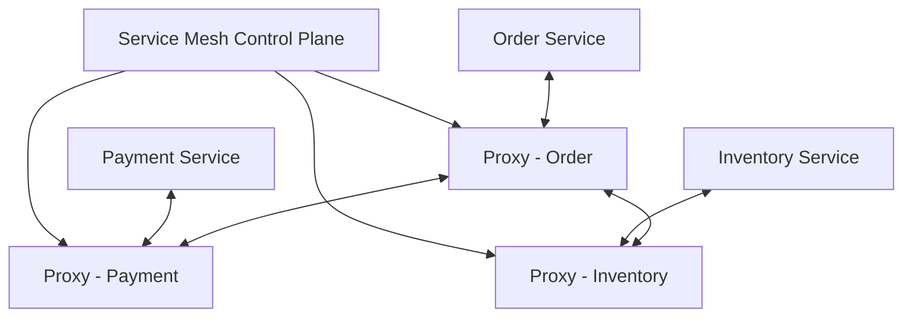
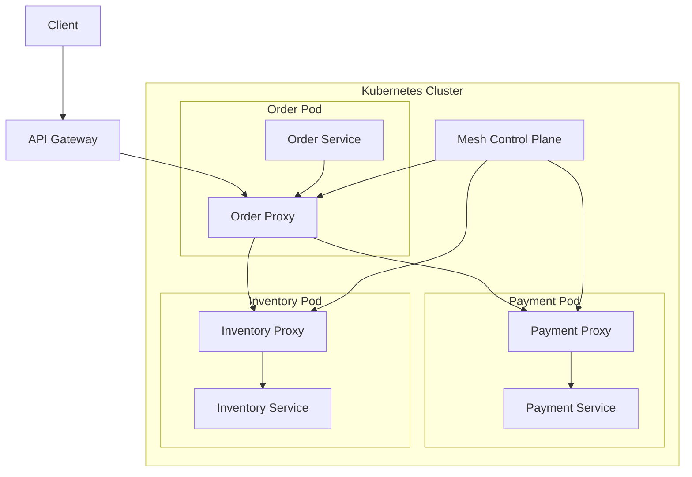

# 07- Service Mesh

## Overview

A service mesh is an infrastructure layer that manages service-to-service communication in a distributed application. Instead of requiring every microservice to implement networking concerns such as retries, timeouts, mutual TLS, traffic routing, telemetry, and circuit breaking independently, these capabilities can be moved into dedicated infrastructure components.

In a traditional microservices architecture, application code often owns both business logic and communication behavior:

```text
Order Service
    |
    +-- HTTP client
    +-- Retry logic
    +-- Timeout logic
    +-- TLS configuration
    +-- Metrics
    +-- Tracing
    |
    v
Payment Service
```

With a service mesh:

```text
Order Application
       |
       v
Order Proxy
       |
       | encrypted / observed traffic
       v
Payment Proxy
       |
       v
Payment Application
```

The application focuses primarily on business behavior while the mesh manages much of the communication infrastructure.

A service mesh is most useful when an organization operates enough services that cross-cutting networking requirements become difficult to implement and operate consistently across teams.

It is not automatically required for every microservices system. For a small deployment, adding a mesh can introduce more operational complexity than value.

## Why Service Meshes Exist

Microservices introduce a large amount of network communication.

A production system may have:

```text
API Gateway
    |
    +--> User Service
    |
    +--> Order Service
             |
             +--> Inventory Service
             |
             +--> Payment Service
             |
             +--> Notification Service
```

Every service-to-service call introduces concerns such as:

- Service discovery
- Load balancing
- Connection management
- TLS
- Authentication
- Authorization
- Retries
- Timeouts
- Circuit breaking
- Traffic routing
- Observability
- Fault isolation

Without a common infrastructure layer, teams often implement these capabilities independently.

This creates inconsistent behavior:

```text
Service A -> custom retry implementation
Service B -> different retry implementation
Service C -> no retry
Service D -> custom TLS handling
Service E -> different metrics format
```

A service mesh attempts to standardize these networking capabilities.

## Core Architecture

Most modern service meshes use a **data plane** and a **control plane**.

### Data Plane

The data plane handles actual application traffic.

It usually consists of proxies deployed alongside application instances.

```text
+-------------------------+
| Kubernetes Pod          |
|                         |
| +---------------------+ |
| | Application         | |
| | FastAPI / Django    | |
| +---------------------+ |
|           |             |
| +---------------------+ |
| | Sidecar Proxy       | |
| +---------------------+ |
+-------------------------+
```

The proxy can intercept outbound and inbound traffic.

### Control Plane

The control plane manages configuration and policy.

It may distribute:

- Service discovery information
- Certificates
- Routing rules
- Traffic policies
- Security policies
- Telemetry configuration

Conceptually:



The control plane generally does not sit in the request path for every application request. It configures the data-plane proxies, which then process traffic directly.

## Data Plane vs Control Plane

| Component | Responsibility | Request Path |
|---|---|---|
| Application | Business logic | Yes |
| Data-plane proxy | Network traffic | Yes |
| Control plane | Configuration and policy | Usually no |
| Service registry | Service location | Usually indirect |
| Certificate authority | Identity/certificates | Usually indirect |

This separation is fundamental to understanding service mesh architecture.

## Sidecar Proxy

Historically, service meshes commonly deployed one proxy beside every application container.

For example:

```text
Pod
+--------------------------------+
|                                |
|  FastAPI Application            |
|          |                     |
|          v                     |
|  Envoy Proxy                   |
|                                |
+--------------------------------+
```

Outbound traffic:

```text
Application
    |
    v
Local Proxy
    |
    v
Remote Proxy
    |
    v
Remote Application
```

The proxy can apply communication policies without requiring the application to implement them.

## Sidecar Request Flow

Consider:

```text
Order Service
    |
    | HTTP request
    v
Order Proxy
    |
    | mTLS
    v
Payment Proxy
    |
    v
Payment Service
```

The application may simply make a normal HTTP request:

```python
response = http_client.post(
    "http://payment-service/charges",
    json=payload,
)
```

The proxy can transparently apply:

- Encryption
- Retry policies
- Load balancing
- Metrics
- Tracing
- Routing rules

The exact capabilities depend on the mesh and protocol.

## Sidecar vs Application Library

There are two common approaches for solving cross-cutting communication concerns.

| Approach | Sidecar Proxy | Application Library |
|---|---|---|
| Language independent | Yes | Usually no |
| Centralized policy | Strong | Weaker |
| Application changes | Minimal | Required |
| Runtime overhead | Proxy overhead | Library overhead |
| Operational complexity | Higher infrastructure complexity | Higher application complexity |
| Consistency | High | Depends on implementation |
| Debugging | Requires mesh knowledge | More application-visible |

A service mesh is especially attractive in polyglot environments where services use Python, Go, Java, Rust, Node.js, and other languages.

## Ambient and Proxy-Based Architectures

Sidecars are not the only architecture.

Some modern service meshes support proxy deployment models that reduce the need for one full proxy per application pod.

Conceptually:

```text
Application Pods
      |
      v
Shared / Node-Level Networking Layer
      |
      v
Service Mesh Infrastructure
```

This can reduce resource overhead and simplify certain operational aspects.

However, the underlying design principle remains the same: move service communication concerns into infrastructure while preserving application-level business logic.

## Service Discovery

A service mesh can integrate with service discovery.

Without a mesh:

```text
Order Service
    |
    v
DNS / Kubernetes Service
    |
    v
Payment Pod
```

With a mesh:

```text
Order Proxy
    |
    v
Mesh Service Registry
    |
    v
Payment Proxy
```

In Kubernetes, service discovery is already provided by Kubernetes Services and DNS. A service mesh usually builds on top of that rather than replacing the entire Kubernetes networking model.

## Load Balancing

A mesh can perform load balancing between service instances.

Suppose:

```text
Payment Service
    |
    +--> Pod A
    +--> Pod B
    +--> Pod C
```

The proxy can distribute requests according to policies such as:

- Round robin
- Least request
- Random
- Locality-aware routing
- Weighted routing

Example:

```text
Order Proxy
     |
     +------> Payment Proxy A
     |
     +------> Payment Proxy B
     |
     +------> Payment Proxy C
```

This can provide more advanced traffic management than basic DNS-level load balancing.

## Traffic Routing

One of the strongest service mesh capabilities is programmable traffic routing.

For example:

```text
payment-service
       |
       +---- 90% ---> v1
       |
       +---- 10% ---> v2
```

This supports canary releases.

Another example:

```text
Header: X-User-Type: internal
              |
              v
           v2 service
```

External users may continue using v1.

## Canary Deployments

A service mesh can implement gradual traffic shifting:

```text
v1
|
| 95%
|
+--------------------+
                     |
                     v
                 v2 5%
```

Then:

```text
v1 -> 80%
v2 -> 20%
```

and eventually:

```text
v1 -> 0%
v2 -> 100%
```

This reduces the blast radius of a new deployment.

A production canary should be tied to measurable health indicators such as:

- Error rate
- Latency
- Saturation
- Business metrics
- Dependency failures

Traffic shifting without automated health evaluation is only partial canary support.

## Blue-Green Deployments

A mesh can also route traffic between two environments:

```text
                 +--> Blue
Client -> Proxy -+
                 +--> Green
```

Example:

```text
Blue: 100%
Green: 0%
```

After validation:

```text
Blue: 0%
Green: 100%
```

The mesh makes the traffic switch independent of the application binary itself.

## Retries

A service mesh can implement retries for transient failures.

For example:

```text
Order Proxy
    |
    | request
    v
Payment Proxy
    |
    X 503
    |
    | retry
    v
Payment Proxy
    |
    v
Payment Service
```

Retries can improve resilience but are dangerous when applied blindly.

For example, retrying:

```text
POST /charge
```

may create duplicate payment operations unless the API is idempotent.

A production retry policy should define:

- Maximum attempts
- Retryable status codes
- Retryable network failures
- Backoff
- Request deadlines
- Idempotency requirements

## Timeouts

A service mesh can enforce request deadlines.

Example:

```text
Order -> Payment
       timeout = 2 seconds
```

If Payment does not respond within the configured deadline, the proxy terminates the request.

Timeouts prevent resources from remaining occupied indefinitely.

A timeout should be connected to the end-to-end latency budget.

For example:

```text
Client deadline = 5s

Gateway      = 500ms
Order        = 500ms
Payment      = 2s
Inventory    = 1s
Network      = remaining budget
```

Independent arbitrary timeouts can produce poor distributed-system behavior.

## Circuit Breaking

A mesh can detect unhealthy downstream services and reduce traffic sent to them.

Conceptually:

```text
Payment Service
      |
      | repeated failures
      v
Circuit Breaker
      |
      v
Reject / shed requests
```

This prevents one unhealthy dependency from consuming excessive resources throughout the system.

Circuit breaking should be combined with:

- Timeouts
- Bulkheads
- Backpressure
- Retry controls

These mechanisms solve different failure modes and should not be treated as interchangeable.

## Outlier Detection

Some proxies can identify unhealthy service instances and temporarily remove them from load balancing.

Example:

```text
Payment Pods

Pod A -> healthy
Pod B -> repeated 5xx
Pod C -> healthy
```

The proxy can temporarily eject Pod B:

```text
Traffic
  |
  +--> Pod A
  |
  +--> Pod C

Pod B -> ejected
```

This can improve resilience without requiring immediate application-level intervention.

## Mutual TLS

Service meshes can provide mutual TLS, commonly called mTLS.

Traditional TLS:

```text
Client ---- TLS ----> Server
```

mTLS:

```text
Client <--- TLS ---> Server
   |                    |
Client cert          Server cert
```

Both parties authenticate each other.

This is particularly useful for zero-trust service communication.

## Why mTLS Matters

Without service identity:

```text
Service A ---> Service B
```

The network may know the source IP but not necessarily the authenticated workload identity.

With mTLS:

```text
Order Service
    |
    | identity = order-service
    | encrypted
    v
Payment Service
```

Policies can then be expressed around workload identity.

For example:

```text
order-service -> payment-service: ALLOW
inventory-service -> payment-service: DENY
```

## Certificate Management

mTLS requires certificate lifecycle management.

A production system needs:

- Certificate issuance
- Certificate rotation
- Expiration handling
- Trust-root management
- Workload identity
- Revocation or replacement strategy

Manual certificate management does not scale.

A service mesh control plane typically automates much of this lifecycle.

## Authorization

Authentication answers:

> Who is calling?

Authorization answers:

> Is this caller allowed to perform this operation?

For example:

```text
Caller identity:
order-service

Target:
payment-service

Operation:
POST /charges

Decision:
ALLOW
```

Authorization policies should be explicit and least-privileged.

## Observability

Service meshes can standardize network telemetry.

Common signals include:

- Request count
- Error rate
- Latency
- Throughput
- Connection failures
- Retry counts
- Circuit-breaker events
- TLS failures

This can produce a consistent service-to-service view.

## Distributed Tracing

A mesh can participate in distributed tracing.

Example:

```text
Client
  |
  v
API Gateway
  |
  v
Order Service
  |
  v
Payment Service
  |
  v
Database
```

A trace can show:

```text
Gateway       20ms
Order        100ms
Payment       80ms
Database      60ms
```

This helps identify latency contributors.

The application still needs correct trace-context propagation for complete end-to-end tracing.

A mesh does not eliminate the need for application instrumentation.

## Metrics

Useful service-mesh metrics include:

```text
request_total
request_duration
request_errors
retry_total
connection_errors
tls_handshake_errors
circuit_breaker_events
```

Metrics should be aggregated carefully.

High-cardinality labels such as:

```text
user_id
request_id
full_url
```

can create significant telemetry cost and resource consumption.

## Logging

Proxy access logs can provide network-level information.

Example:

```text
timestamp
source_service
destination_service
method
path
status
latency
bytes
```

However, logging every request from every proxy can become expensive at scale.

Production systems should use:

- Sampling
- Structured logs
- Centralized log aggregation
- Appropriate retention
- Sensitive-data filtering

## Service Mesh Architecture

A Kubernetes deployment may conceptually look like:



The application containers remain responsible for business logic.

The proxies handle communication infrastructure.

## Service Mesh and API Gateway

An API gateway and service mesh solve related but different problems.

| Capability | API Gateway | Service Mesh |
|---|---|---|
| External client traffic | Strong | Usually not primary purpose |
| Service-to-service traffic | Limited | Primary purpose |
| Authentication | Yes | Yes, especially workload identity |
| mTLS | Possible | Strong capability |
| Internal traffic routing | Limited | Strong |
| Canary routing | Possible | Strong |
| Rate limiting | Strong for external APIs | Often supported internally |
| Circuit breaking | Possible | Common |
| Observability | Strong | Strong |
| Protocol transformation | Common | Usually limited |
| Internet-facing edge | Yes | Usually no |

A common architecture is:

```text
Internet
   |
   v
API Gateway
   |
   v
Service Mesh
   |
   +--> Service A
   +--> Service B
   +--> Service C
```

The gateway manages north-south traffic.

The mesh manages east-west traffic.

## North-South vs East-West Traffic

**North-south traffic** enters or leaves the platform:

```text
Internet -> API Gateway -> Cluster
```

**East-west traffic** occurs between internal services:

```text
Order -> Payment
Order -> Inventory
Payment -> Fraud
```

This distinction is frequently tested in system design interviews.

## Service Mesh and Nginx

Nginx can act as:

- Reverse proxy
- Load balancer
- API gateway
- Ingress
- TLS termination layer

A service mesh provides broader service-to-service networking capabilities.

They can coexist:

```text
Internet
   |
   v
Nginx / API Gateway
   |
   v
Service Mesh
   |
   +--> Order
   +--> Payment
```

Avoid introducing a mesh merely because Nginx is already present.

The mesh should solve a demonstrated internal networking problem.

## Service Mesh and gRPC

Service meshes work particularly well with gRPC because gRPC is heavily used for internal service communication.

Example:

```text
Order Service
    |
    | gRPC
    v
Payment Service
```

The mesh can provide:

- mTLS
- Load balancing
- Timeouts
- Retry policies
- Metrics
- Tracing
- Traffic routing

The application still defines the gRPC contract through protobuf.

The mesh does not replace application-level semantics.

## Service Mesh and Kafka

A service mesh is primarily focused on service networking and does not replace Kafka.

Typical architecture:

```text
HTTP/gRPC
    |
    v
Service Mesh
    |
    v
Microservices

Kafka
    |
    +--> Event Consumers
```

Kafka provides asynchronous event transport.

The service mesh primarily manages network communication between workloads.

Trying to force every communication mechanism through the same abstraction is an architectural mistake.

## Service Mesh and Django/FastAPI

A Django or FastAPI application generally does not need mesh-specific business logic.

For example:

```python
import httpx


async def create_payment(order_id: str, amount: int) -> None:
    async with httpx.AsyncClient(timeout=2.0) as client:
        response = await client.post(
            "http://payment-service/charges",
            json={
                "order_id": order_id,
                "amount": amount,
            },
        )
        response.raise_for_status()
```

The application communicates with the service normally.

The mesh infrastructure can transparently manage:

```text
Django/FastAPI
      |
      v
Proxy
      |
      v
Payment Proxy
      |
      v
Payment Service
```

Application-level timeout and retry semantics should still be designed carefully. A mesh should not become an excuse to ignore client behavior.

## Retry Multiplication

One of the most dangerous production problems is retry multiplication.

Suppose:

```text
Application retries 3 times
        |
        v
Proxy retries 3 times
        |
        v
Downstream
```

One logical request can produce up to:

```text
3 × 3 = 9
```

attempts.

Across multiple service hops, the amplification can become much worse.

Therefore, define a clear ownership model for retries.

A common approach is:

- One primary layer owns retries.
- End-to-end deadlines are propagated.
- Retries are limited.
- Only safe/idempotent operations are retried.
- Retry budgets are monitored.

## Timeout Budgeting

A mesh should not introduce arbitrary timeout values independently of the application.

Bad:

```text
Gateway timeout = 30s
Service A = 60s
Service B = 60s
Service C = 60s
```

This allows downstream operations to outlive upstream requests.

A better design propagates deadlines:

```text
Client deadline
      |
      v
Gateway deadline
      |
      v
Service A deadline
      |
      v
Service B deadline
```

Each downstream operation should respect the remaining budget.

## Failure Modes

A service mesh introduces additional infrastructure and therefore additional failure modes.

Potential failures include:

- Proxy crash
- Control-plane outage
- Certificate issuance failure
- Configuration propagation failure
- Proxy resource exhaustion
- Incorrect traffic policy
- DNS failure
- Network partition
- Telemetry overload

The data plane should continue serving traffic using its last known valid configuration where safe.

The control plane should not become a synchronous dependency for every request.

## Proxy Resource Consumption

Every proxy consumes:

- CPU
- Memory
- Network bandwidth
- File descriptors
- Connections

With hundreds or thousands of pods, this overhead becomes significant.

For example:

```text
1,000 pods
    |
    +--> 1 proxy per pod
    |
    v
1,000 additional processes
```

This is one reason modern mesh architectures increasingly consider alternatives to full sidecars.

Capacity planning must include proxy overhead.

## High Availability

A production service mesh should avoid a single control-plane failure domain.

Recommended practices include:

- Multiple control-plane replicas
- Pod anti-affinity where appropriate
- Resource requests and limits
- Pod disruption budgets
- Multi-zone placement
- Automated certificate management
- Monitoring control-plane health
- Validating policy changes before rollout

The data plane should remain resilient to temporary control-plane unavailability.

## Security Considerations

A service mesh can significantly improve internal security, but it does not automatically make the system secure.

Important controls include:

### Workload Identity

Identify services using cryptographic workload identities rather than only IP addresses.

### mTLS

Encrypt service-to-service communication.

### Authorization Policies

Explicitly define which workloads can communicate.

### Least Privilege

Avoid broad policies such as:

```text
* -> *
```

Prefer:

```text
order-service -> payment-service: POST /charges
order-service -> inventory-service: GET /inventory/*
```

### Secret Protection

Do not place application secrets into proxy configuration unless required and properly protected.

### Policy Testing

Incorrect authorization rules can cause outages.

Policies should be tested before production rollout.

## Scalability Considerations

A mesh scales both application networking and networking infrastructure.

Consider:

- Number of services
- Number of workloads
- Requests per second
- Connection counts
- Proxy CPU
- Proxy memory
- Control-plane configuration size
- Certificate issuance rate
- Telemetry volume

At large scale, telemetry often becomes a bigger operational problem than raw request routing.

## Cost Considerations

Service mesh costs include more than licensing.

Consider:

- Proxy CPU
- Proxy memory
- Additional nodes
- Control-plane infrastructure
- Telemetry storage
- Metrics ingestion
- Log storage
- Trace storage
- Engineering operations
- Incident-response complexity

A mesh can reduce duplicated application engineering while increasing platform complexity.

The decision should therefore consider **total cost of ownership**, not just infrastructure cost.

## Deployment Strategy

Do not introduce a service mesh into every workload simultaneously.

A safer rollout is:

```text
Evaluate
   |
   v
Pilot
   |
   v
Observe
   |
   v
Limited Production
   |
   v
Expand
```

During rollout, compare:

- Request latency
- Error rates
- Resource consumption
- Deployment complexity
- Certificate behavior
- Policy correctness
- Operational burden

## Operational Best Practices

- Start with a specific networking problem rather than adopting a mesh as a default.
- Keep the control plane highly available.
- Monitor proxy resource usage.
- Define retry ownership explicitly.
- Propagate request deadlines.
- Use mTLS for sensitive internal communication.
- Apply workload-based authorization.
- Validate routing policies before production rollout.
- Avoid excessive telemetry cardinality.
- Sample logs and traces appropriately.
- Monitor certificate expiration and rotation.
- Treat mesh configuration as production configuration.
- Version and review traffic policies.
- Use canary deployments for mesh-policy changes.
- Maintain rollback procedures.
- Test control-plane failure behavior.
- Avoid synchronous dependency on the control plane.
- Account for proxy overhead during capacity planning.

## Common Mistakes

### Introducing a Mesh Too Early

A small system with five services may not need the operational complexity of a service mesh.

Start with simpler mechanisms when they are sufficient.

### Assuming the Mesh Solves Business-Level Reliability

A mesh can provide network-level resilience.

It cannot determine whether:

```text
POST /payment
```

is semantically safe to retry.

Business idempotency remains an application responsibility.

### Configuring Retries Everywhere

Retries can amplify traffic and turn a partial outage into a cascading failure.

### Ignoring Application Timeouts

A mesh timeout does not eliminate the need for application-level deadlines.

### Using mTLS Without Identity-Based Authorization

Encryption alone does not answer whether the caller should be allowed to access a resource.

### Ignoring Proxy Overhead

A proxy is another production process.

Thousands of proxies can consume substantial CPU and memory.

### Treating the Control Plane as Request Infrastructure

Application requests should generally not require synchronous control-plane access.

### Logging Everything

Proxy telemetry can generate enormous volumes of logs and traces.

### Assuming the Mesh Replaces an API Gateway

The mesh primarily addresses east-west traffic; an API gateway commonly handles north-south traffic.

### Making All Networking Transparent

Transparent behavior can make debugging harder.

Engineers must understand both:

```text
Application behavior
```

and:

```text
Mesh behavior
```

when diagnosing production failures.

## Production Failure Example

Consider:

```text
Client
  |
  v
API Gateway
  |
  v
Order Service
  |
  v
Payment Service
```

Suppose Payment becomes slow.

Without proper controls:

```text
Payment latency increases
        |
        v
Order requests remain open
        |
        v
Order worker/thread pool fills
        |
        v
Order latency increases
        |
        v
Gateway connections accumulate
        |
        v
System-wide degradation
```

A properly configured mesh can help with:

- Timeouts
- Connection limits
- Circuit breaking
- Load balancing
- Outlier detection
- Observability

But the overall architecture still needs:

- Application timeouts
- Bounded concurrency
- Idempotency
- Backpressure
- Capacity planning

A service mesh is one resilience layer, not the entire resilience strategy.

## Service Mesh Decision Framework

Ask the following before adopting one:

| Question | If Yes |
|---|---|
| Do many teams implement service communication differently? | Mesh becomes more attractive |
| Is mTLS required across many services? | Mesh becomes more attractive |
| Are advanced traffic policies required? | Mesh becomes more attractive |
| Do you need consistent service-level telemetry? | Mesh becomes more attractive |
| Are there only a few services? | Simpler mechanisms may be better |
| Is the platform already operationally complex? | Evaluate additional complexity carefully |
| Is proxy overhead acceptable? | Continue evaluation |
| Does the team have Kubernetes/platform expertise? | Adoption risk is lower |

The most important question is not:

> "Do modern microservices use service meshes?"

It is:

> "Does the operational value of centralized service networking justify the infrastructure complexity for this system?"

## Service Mesh vs Direct Service Communication

| Capability | Direct Communication | Service Mesh |
|---|---|---|
| HTTP/gRPC | Yes | Yes |
| Service discovery | Application/platform | Platform + mesh |
| mTLS | Application/platform | Strong built-in capability |
| Traffic routing | Application/load balancer | Advanced |
| Canary releases | Deployment-dependent | Strong |
| Circuit breaking | Application/library | Infrastructure policy |
| Observability | Application implementation | Standardized network telemetry |
| Operational complexity | Lower initially | Higher |
| Resource overhead | Lower | Higher |
| Polyglot consistency | Harder | Easier |

## Interview Traps

### "Service Mesh Is an API Gateway"

Incorrect.

An API gateway primarily manages external or north-south traffic. A service mesh primarily manages internal or east-west service communication.

### "The Control Plane Handles Every Request"

Usually incorrect.

The data-plane proxies handle application traffic. The control plane distributes configuration and policy.

### "mTLS Provides Authorization"

Incorrect.

mTLS provides encrypted communication and authenticated identities. Authorization policies determine whether an identity is permitted to perform an operation.

### "A Service Mesh Eliminates Retries in Application Code"

Not necessarily.

Retries may still be required at the application level when business semantics matter. The important architectural requirement is to avoid uncontrolled retry multiplication.

### "Service Mesh Makes Microservices Automatically Reliable"

Incorrect.

It provides infrastructure capabilities such as timeouts, routing, mTLS, load balancing, and circuit breaking. Application architecture still determines correctness, idempotency, data consistency, and business-level resilience.

### "Service Mesh Is Free Because It Is Infrastructure"

Incorrect.

Proxy CPU, memory, telemetry, control-plane resources, operational complexity, and engineering time all contribute to total cost.

## Key Takeaways

- **A service mesh moves cross-cutting service-to-service networking concerns such as mTLS, traffic routing, retries, timeouts, observability, and circuit breaking into infrastructure-managed components.**
- **The data plane handles application traffic while the control plane distributes configuration and policy; the control plane should not become a synchronous dependency for normal requests.**
- **Service meshes are particularly valuable for large, polyglot microservice platforms that need consistent networking, security, traffic management, and observability policies.**
- **Retries, timeouts, mTLS, and authorization still require architectural discipline; blindly enabling mesh policies can cause retry amplification, security gaps, or cascading failures.**
- **A service mesh is a trade-off: evaluate its operational value against proxy overhead, telemetry cost, platform complexity, and the maturity of the engineering organization before adopting it.**