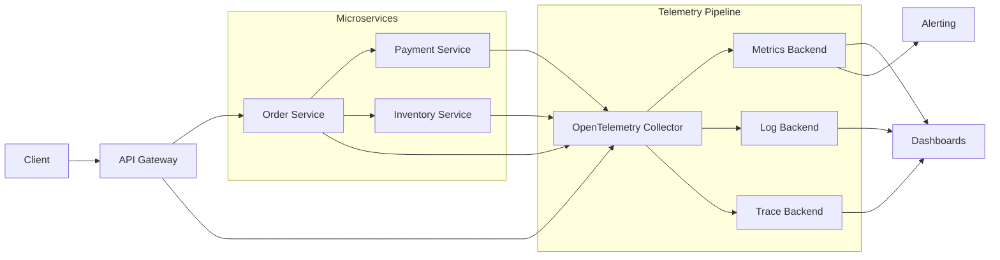

# 08- Observability

## Overview

Observability is the ability to understand the internal state and behavior of a system by examining the telemetry it produces. In distributed systems, observability is essential because a single user request may cross an API gateway, multiple microservices, databases, caches, queues, and external dependencies.

A production backend should allow engineers to answer questions such as:

- Is the system healthy?
- Which service is failing?
- Which endpoint is slow?
- Where is latency being introduced?
- Are errors increasing?
- Is a dependency unavailable?
- Are requests being retried?
- Is a deployment causing regressions?
- Which customers or workloads are affected?
- Is the system approaching a capacity limit?

The core observability signals are:

| Signal | Answers | Typical Technology |
|---|---|---|
| Metrics | What is happening at scale? | Prometheus, CloudWatch |
| Logs | What happened in detail? | Loki, Elasticsearch, CloudWatch Logs |
| Traces | Where did a request spend time? | OpenTelemetry, Jaeger, Tempo |
| Profiles | Where is CPU/memory time spent? | Pyroscope, profilers |
| Events | What significant state change occurred? | Kafka, CloudWatch Events |

A mature observability strategy combines these signals rather than relying on a single dashboard or logging system.

## Why Observability Matters in Microservices

A monolith may have a relatively simple request path:

```text
Client
  |
  v
Django
  |
  v
PostgreSQL
```

A microservices system may look like:

```text
Client
  |
  v
API Gateway
  |
  v
Order Service
  |
  +--> Inventory Service
  |        |
  |        +--> PostgreSQL
  |
  +--> Payment Service
  |        |
  |        +--> External Payment Provider
  |
  +--> Notification Service
           |
           +--> Kafka
```

If an order takes 4 seconds, application logs from the Order Service alone may not explain the problem.

The latency could originate from:

```text
Gateway
   |
   v
Order
   |
   +--> Inventory -> PostgreSQL
   |
   +--> Payment -> External Provider
```

Observability provides the correlation needed to investigate the entire request lifecycle.

## Monitoring vs Observability

Monitoring and observability are related but not identical.

**Monitoring** focuses on known conditions and predefined signals.

Examples:

- CPU > 80%
- Error rate > 5%
- Database connections > threshold
- Queue depth > threshold

**Observability** focuses on being able to investigate unknown or unexpected behavior.

For example:

> Why are only requests from one region experiencing elevated latency?

A monitoring system may detect the latency increase. Observability provides the dimensions, traces, logs, and context needed to investigate it.

| Monitoring | Observability |
|---|---|
| Known failure conditions | Unknown failure investigation |
| Alerts | Exploration |
| Dashboards | Correlated telemetry |
| Threshold-oriented | Context-oriented |
| "Something is wrong" | "Why is it wrong?" |

Production systems need both.

## The Three Pillars

The traditional observability model consists of:

```text
              Observability
                   |
       +-----------+-----------+
       |           |           |
    Metrics      Logs       Traces
       |           |           |
    Trends      Details     Request flow
```

These signals complement each other.

### Metrics

Metrics represent numerical measurements over time.

Examples:

```text
http_requests_total
http_request_duration_seconds
http_requests_in_flight
database_connections
cache_hit_ratio
queue_depth
```

Metrics are efficient for aggregation and alerting.

### Logs

Logs contain detailed event information.

Example:

```json
{
  "timestamp": "2026-08-23T12:30:01.421Z",
  "level": "ERROR",
  "service": "payment-service",
  "event": "payment_authorization_failed",
  "order_id": "ord_123",
  "provider": "stripe",
  "status_code": 502,
  "trace_id": "4bf92f3577b34da6"
}
```

Logs are useful for detailed investigation but can become expensive and difficult to query at high volume.

### Traces

A trace represents the lifecycle of a distributed operation.

For example:

```text
Trace
 |
 +-- API Gateway        20ms
 |
 +-- Order Service      80ms
 |     |
 |     +-- PostgreSQL   25ms
 |
 +-- Payment Service   500ms
       |
       +-- Provider    480ms
```

Tracing is especially valuable for distributed systems because it connects operations across services.

## Observability Architecture

A production architecture may look like:



The telemetry pipeline should generally be separated from the application's critical business path.

## Instrumentation

Instrumentation is the process of adding telemetry-producing capabilities to an application.

Instrumentation can be:

- Automatic
- Manual
- Framework-level
- Infrastructure-level

For Python services, OpenTelemetry can instrument frameworks and libraries while allowing custom spans and metrics.

Typical instrumentation targets include:

- HTTP requests
- Database queries
- Redis operations
- Kafka producers/consumers
- gRPC calls
- Celery tasks
- External API calls

## OpenTelemetry

OpenTelemetry provides a vendor-neutral framework for generating and exporting telemetry.

Conceptually:

```text
Django / FastAPI
      |
      v
OpenTelemetry SDK
      |
      v
OpenTelemetry Collector
      |
      +--> Metrics backend
      +--> Logs backend
      +--> Trace backend
```

This reduces direct coupling between application code and a specific observability vendor.

## Metrics

Metrics should be designed around operational questions rather than simply collecting every possible number.

Important HTTP metrics include:

```text
request count
request rate
error rate
request duration
in-flight requests
```

A useful metric model is:

```text
HTTP Requests
    |
    +--> Rate
    +--> Errors
    +--> Duration
    +--> Saturation
```

## Counter

A counter represents a monotonically increasing value.

Examples:

```text
http_requests_total
payment_failures_total
kafka_messages_processed_total
```

Counters are useful for calculating rates.

Conceptually:

```text
request rate = increase(request_count) / time
```

## Gauge

A gauge represents a value that can increase or decrease.

Examples:

```text
active_connections
queue_depth
memory_usage
in_flight_requests
```

A queue depth can move:

```text
100 -> 80 -> 120 -> 40
```

Therefore it is modeled as a gauge rather than a counter.

## Histogram

Histograms measure distributions.

They are particularly useful for latency.

Instead of storing only:

```text
average latency = 250ms
```

a histogram can show:

```text
p50 = 100ms
p95 = 500ms
p99 = 1.8s
```

This matters because averages can hide tail latency.

## Percentiles

For backend systems, latency percentiles are generally more useful than averages.

| Metric | Meaning |
|---|---|
| p50 | Median |
| p90 | 90% of requests are faster |
| p95 | 95% of requests are faster |
| p99 | 99% of requests are faster |
| p99.9 | 99.9% of requests are faster |

If:

```text
p50 = 100ms
p99 = 5s
```

the median looks healthy while a meaningful fraction of users experience severe latency.

## RED Method

For request-driven services, the RED method is useful:

- **Rate** — requests per second
- **Errors** — failed requests
- **Duration** — request latency

Example:

```text
Order Service

Rate:      2,500 req/s
Errors:    1.2%
p95:       320ms
p99:       1.4s
```

These provide a strong baseline for API health.

## USE Method

The USE method is particularly useful for infrastructure resources:

- **Utilization**
- **Saturation**
- **Errors**

Example:

```text
CPU utilization:       72%
CPU saturation:        high
CPU errors:             0
```

For a database:

```text
Connection utilization
Connection wait time
Query errors
```

RED and USE complement each other.

## Golden Signals

The four Google SRE golden signals are:

| Signal | Question |
|---|---|
| Latency | How long does it take? |
| Traffic | How much demand exists? |
| Errors | How often does it fail? |
| Saturation | How close is the system to capacity? |

A production dashboard should expose these at appropriate service boundaries.

## Structured Logging

Logs should be structured rather than plain strings.

Prefer:

```json
{
  "timestamp": "2026-08-23T12:30:01Z",
  "level": "INFO",
  "service": "order-service",
  "environment": "production",
  "event": "order_created",
  "order_id": "ord_123",
  "trace_id": "abc123",
  "duration_ms": 84
}
```

over:

```text
Order ord_123 created successfully in 84ms
```

Structured logs are easier to:

- Search
- Aggregate
- Filter
- Parse
- Correlate
- Analyze automatically

## Log Levels

Common levels include:

| Level | Usage |
|---|---|
| DEBUG | Detailed development diagnostics |
| INFO | Normal operational events |
| WARNING | Unexpected but recoverable conditions |
| ERROR | Operation failed |
| CRITICAL | Severe system-level failure |

Do not use `ERROR` for every expected business rejection.

For example:

```text
Invalid login password
```

may be a normal business outcome rather than an infrastructure error.

## What to Log

Useful fields include:

- Timestamp
- Service
- Environment
- Request ID
- Trace ID
- Span ID
- Operation
- Status
- Duration
- Error type
- Error message
- Relevant resource identifier

Avoid unnecessarily logging:

- Passwords
- Access tokens
- Session tokens
- Credit card data
- API secrets
- Sensitive personal information

## Correlation IDs

A correlation or request ID allows engineers to follow a logical operation across components.

Example:

```text
X-Request-ID: 8f91b2c1
```

The same identifier can appear in:

```text
Gateway logs
Order logs
Payment logs
Database audit events
```

Distributed tracing usually provides stronger correlation through trace and span identifiers, but request IDs can remain useful for operational workflows.

## Distributed Tracing

A trace consists of one or more spans.

```text
Trace: checkout-request

+-- Gateway span
|
+-- Order span
|     |
|     +-- PostgreSQL span
|
+-- Payment span
      |
      +-- External API span
```

Each span should represent a meaningful operation.

## Trace Context Propagation

Suppose:

```text
Client
  |
  v
Gateway
  |
  v
Order
  |
  v
Payment
```

The trace context must be propagated across requests.

Conceptually:

```text
Gateway
   |
   | trace context
   v
Order
   |
   | trace context
   v
Payment
```

Without propagation, distributed traces become disconnected.

Modern systems commonly use W3C Trace Context headers.

## Span Design

Good spans represent meaningful operations:

```text
HTTP GET /orders/{id}
DB SELECT orders
HTTP POST /payments
Redis GET order
Kafka publish order.created
```

Avoid creating a span for every trivial function call.

Excessive spans increase:

- Telemetry volume
- CPU usage
- Storage costs
- Trace complexity

## Trace Sampling

At high request volumes, storing every trace can become expensive.

Suppose:

```text
100,000 requests/second
```

and every request generates:

```text
20 spans
```

That creates:

```text
2,000,000 spans/second
```

Sampling can reduce this significantly.

Common strategies include:

- Head sampling
- Tail sampling
- Probability sampling
- Error-based sampling
- Latency-based sampling

A strong production strategy may retain more traces for errors and unusually slow requests.

## Logs vs Metrics vs Traces

| Requirement | Metrics | Logs | Traces |
|---|---:|---:|---:|
| Alerting | Excellent | Limited | Limited |
| Aggregation | Excellent | Good | Good |
| Detailed event context | Poor | Excellent | Good |
| Distributed request flow | Poor | Limited | Excellent |
| Storage efficiency | High | Low | Medium |
| Debugging individual request | Poor | Good | Excellent |
| Trend analysis | Excellent | Good | Good |

Do not attempt to use one signal for every purpose.

## Observability for Databases

Databases should be observed independently from application metrics.

For PostgreSQL, useful signals include:

- Connection count
- Connection utilization
- Query latency
- Slow queries
- Lock contention
- Deadlocks
- Transactions per second
- Cache hit ratio
- Replication lag
- Disk utilization
- WAL activity

Application latency can be high because of database saturation even when application CPU is low.

## Redis Observability

For Redis, monitor:

- Memory usage
- Evictions
- Hit ratio
- Miss ratio
- Commands per second
- Connected clients
- Blocked clients
- Latency
- Replication health

A cache failure can produce a sudden load increase on PostgreSQL.

For example:

```text
Redis outage
    |
    v
Cache misses increase
    |
    v
PostgreSQL traffic increases
    |
    v
DB saturation
    |
    v
API latency increases
```

This is a classic cascading failure that observability should make visible.

## Kafka Observability

For Kafka systems, important metrics include:

- Consumer lag
- Producer throughput
- Consumer throughput
- Request latency
- Broker health
- Under-replicated partitions
- Partition count
- Error rate

Consumer lag is particularly important.

```text
Produced:
10,000 messages/s

Consumed:
8,000 messages/s

Lag:
increasing
```

An increasing lag indicates that consumers cannot keep up with production.

## Celery Observability

For Celery workers, monitor:

- Queue depth
- Task execution time
- Task failure rate
- Retry count
- Worker utilization
- Task age
- Worker availability

A healthy API can still have a failing asynchronous pipeline.

Therefore asynchronous workloads should have independent SLOs.

## Kubernetes Observability

For Kubernetes, monitor multiple layers:

```text
Cluster
  |
  +--> Nodes
  |
  +--> Pods
  |
  +--> Containers
  |
  +--> Services
  |
  +--> Ingress
```

Useful signals include:

- CPU utilization
- Memory utilization
- Pod restarts
- OOM kills
- Scheduling failures
- Readiness failures
- Liveness failures
- Node pressure
- Network errors

Application-level metrics should not be replaced by Kubernetes infrastructure metrics.

## SLI, SLO, and SLA

These concepts connect observability to reliability engineering.

### SLI

A Service Level Indicator is a measured reliability signal.

Example:

```text
successful HTTP requests / total HTTP requests
```

### SLO

A Service Level Objective defines the target.

Example:

```text
99.9% successful requests over 30 days
```

### SLA

A Service Level Agreement is a contractual commitment, often with business consequences.

The relationship is:

```text
Measurement -> SLI
Target      -> SLO
Contract    -> SLA
```

## Error Budgets

If an SLO is:

```text
99.9% availability
```

then the allowed failure budget is approximately:

```text
0.1%
```

For a 30-day period:

```text
30 days × 24 × 60
= 43,200 minutes

0.1% × 43,200
= 43.2 minutes
```

The error budget provides a quantitative way to balance reliability and delivery velocity.

## Alerting

Alerts should indicate actionable conditions.

Good alert:

```text
Payment API error budget burn rate is critically high.
```

Poor alert:

```text
CPU > 70%
```

CPU may be 75% while the service is perfectly healthy.

Alerts should generally be based on user impact, SLOs, or meaningful infrastructure failure conditions.

## Alert Fatigue

If engineers receive hundreds of alerts every day, important alerts become less effective.

Common causes:

- Too many alerts
- No severity model
- Thresholds that are too sensitive
- Alerts without actionable remediation
- Duplicate alerts

A useful severity model may be:

| Severity | Meaning |
|---|---|
| Critical | Immediate user/business impact |
| High | Significant degradation |
| Warning | Emerging risk |
| Info | Operational notification |

## Burn Rate

SLO burn rate measures how quickly a service is consuming its error budget.

If failures are occurring much faster than the allowed SLO budget, the burn rate increases.

This is generally more useful for alerting than simple fixed error thresholds.

For example:

```text
SLO:
99.9%

Current error rate:
5%

Result:
rapid error-budget consumption
```

## Dashboard Design

A service dashboard should start with high-level health.

Example:

```text
Order Service
------------------------------------------------
Traffic          2,500 req/s
Error Rate       0.4%
p50              80ms
p95              240ms
p99              900ms

Dependencies
------------------------------------------------
PostgreSQL       Healthy
Redis            Healthy
Payment API      Degraded
Kafka            Healthy

Saturation
------------------------------------------------
CPU              62%
Memory           71%
Connections      78%
```

Detailed dashboards can then expose lower-level metrics.

## Dependency Observability

Services should monitor their dependencies explicitly.

Example:

```text
Order Service
 |
 +--> PostgreSQL
 +--> Redis
 +--> Payment API
 +--> Kafka
```

For each dependency, monitor:

- Request rate
- Error rate
- Latency
- Availability
- Timeout count
- Retry count

This makes dependency-induced failures easier to identify.

## Observability and Service Mesh

A service mesh can automatically generate network-level telemetry.

```text
Application
    |
    v
Service Mesh Proxy
    |
    +--> Metrics
    +--> Access logs
    +--> Trace context
    |
    v
Remote Service
```

This provides useful infrastructure-level visibility.

However, mesh telemetry cannot fully replace application instrumentation.

The mesh can tell you:

```text
POST /payments -> 502 -> 850ms
```

Application instrumentation may tell you:

```text
payment declined because provider authorization failed
```

Both layers are valuable.

## Python Application Instrumentation

A FastAPI application can expose metrics and traces through instrumentation libraries.

Conceptually:

```python
from fastapi import FastAPI

app = FastAPI()


@app.get("/orders/{order_id}")
async def get_order(order_id: str):
    return {"order_id": order_id}
```

The application can then be instrumented through framework integrations rather than manually adding logging to every route.

For custom business operations, explicit instrumentation can provide additional context.

```python
from opentelemetry import trace

tracer = trace.get_tracer(__name__)


async def process_order(order_id: str) -> None:
    with tracer.start_as_current_span("process_order") as span:
        span.set_attribute("order.id", order_id)

        # Business operation.
        ...
```

Avoid putting sensitive information into span attributes.

## Django Observability

For Django services, useful instrumentation targets include:

- HTTP middleware
- Database queries
- Cache operations
- Celery tasks
- External HTTP clients
- Background jobs

Useful application metrics include:

```text
django_http_requests_total
django_http_request_duration
database_query_duration
celery_task_failures
cache_hit_ratio
```

The exact metric names depend on the instrumentation stack.

## gRPC Observability

For gRPC services, monitor:

- Request count
- RPC latency
- RPC status
- Connection errors
- Deadline exceeded
- Retries
- Message sizes

Example:

```text
OrderService/CreateOrder
    |
    +--> request rate
    +--> p95 latency
    +--> status codes
    +--> deadline exceeded
```

gRPC status codes should be preserved in telemetry because they provide more useful semantics than generic HTTP status codes.

## Security Considerations

Observability systems frequently contain sensitive information.

Potential risks include:

- Tokens in logs
- Authorization headers
- Personal information
- Payment information
- Database query parameters
- Internal infrastructure details

Security controls should include:

- Log redaction
- Access control
- Encryption in transit
- Encryption at rest
- Retention policies
- Audit logging
- Data classification
- Least-privilege access

Never assume telemetry is safe merely because it is internal.

## Cardinality

Cardinality is one of the most important observability scaling concerns.

A metric like:

```text
http_requests_total{method="GET",status="200"}
```

has relatively low cardinality.

A metric like:

```text
http_requests_total{
    user_id="123456",
    request_id="abc...",
    session_id="..."
}
```

can have enormous cardinality.

High cardinality can cause:

- Memory growth
- Slow queries
- Expensive storage
- High ingestion costs
- Monitoring-system instability

Use controlled dimensions such as:

```text
service
route
method
status
region
environment
```

Avoid unbounded identifiers in metrics.

## Sampling Strategy

Telemetry volume should scale intentionally.

A practical strategy may be:

```text
Metrics:
100% aggregation

Logs:
100% errors
Sample successful requests

Traces:
100% errors
High percentage of slow requests
Sample normal traffic
```

The exact policy depends on traffic volume and operational requirements.

## High Availability

Observability infrastructure should not become a production single point of failure.

However, telemetry systems generally should not block application traffic.

Prefer asynchronous or buffered telemetry pipelines.

```text
Application
    |
    v
Local SDK / Collector
    |
    v
Telemetry Backend
```

If the telemetry backend becomes unavailable, the application should continue serving requests where possible.

Telemetry loss is usually preferable to application outage.

## Disaster Recovery

Consider recovery requirements for:

- Metrics
- Logs
- Traces
- Alert definitions
- Dashboards
- Recording rules
- SLO definitions
- Collector configuration

Not every telemetry signal needs the same retention or recovery objective.

For example:

| Data | Typical Priority |
|---|---|
| Active alerts | Very high |
| SLO configuration | Very high |
| Recent logs | High |
| Recent metrics | High |
| Historical traces | Medium |
| Long-term debug logs | Lower |

Observability configuration should be treated as code where practical.

## Cost Management

Observability can become one of the largest infrastructure expenses in high-volume systems.

Major cost drivers include:

```text
Metrics cardinality
+
Log volume
+
Trace volume
+
Retention period
+
Query workload
```

Control costs with:

- Sampling
- Aggregation
- Retention policies
- Log filtering
- Cardinality controls
- Tiered storage
- Compression
- Intelligent trace sampling

Do not solve observability problems by simply storing everything forever.

## Production Troubleshooting Workflow

A disciplined investigation often follows:

```text
Alert
  |
  v
Determine user impact
  |
  v
Check traffic / errors / latency
  |
  v
Identify affected service
  |
  v
Inspect dependency health
  |
  v
Open representative traces
  |
  v
Inspect correlated logs
  |
  v
Check infrastructure saturation
  |
  v
Determine recent changes
  |
  v
Mitigate
  |
  v
Verify recovery
```

The exact sequence can vary, but the important principle is to move from broad signals to detailed evidence.

## Example: High API Latency

Suppose:

```text
Order API p99:
4.2 seconds
```

Start with the RED signals:

```text
Traffic:
stable

Errors:
normal

Latency:
increasing
```

Then inspect traces:

```text
Order Service:
3.9s

PostgreSQL:
3.6s
```

Then database metrics:

```text
Connection utilization:
99%

Lock waits:
high
```

The root cause is likely database contention rather than application CPU.

Without distributed telemetry, an engineer might incorrectly scale the application layer.

## Example: Error Spike After Deployment

Suppose:

```text
Deployment:
v2.8.0

Error rate:
0.2% -> 8%
```

Compare:

```text
v2.7.9:
healthy

v2.8.0:
8% errors
```

Traces identify:

```text
Order Service
    |
    v
Payment Service
    |
    X
HTTP 500
```

Logs show:

```text
payment_provider_timeout
```

The deployment can then be rolled back while the underlying issue is investigated.

Observability is valuable because it shortens the path from:

```text
symptom -> evidence -> mitigation
```

## Common Mistakes

### Logging Only Errors

Successful requests are often necessary for understanding:

- Traffic patterns
- Latency distributions
- Normal behavior
- Correlation

Use metrics and traces for high-volume successful operations instead of logging every detail.

### Using Logs as Metrics

Searching millions of logs to determine request rate is inefficient.

Use metrics for aggregation.

### Using Metrics for Debugging Individual Requests

Metrics can tell you:

```text
p99 latency = 2.5s
```

but not necessarily which dependency caused a particular request to take 2.5 seconds.

Use traces.

### No Trace Context Propagation

Without propagation, distributed traces become disconnected.

### High-Cardinality Metrics

Putting user IDs, request IDs, or arbitrary URLs into metric labels can destabilize the metrics backend.

### Logging Sensitive Information

Application logs often contain credentials accidentally if request headers or payloads are logged indiscriminately.

### Alerting on Every Threshold

Not every unusual metric requires human intervention.

Alert on actionable conditions.

### Ignoring Background Jobs

A healthy HTTP API does not imply a healthy asynchronous system.

Monitor Celery, Kafka consumers, scheduled jobs, and other background workloads separately.

### Ignoring Dependency Metrics

An application may appear healthy while a dependency is approaching failure.

### No Deployment Correlation

Many production incidents are introduced by configuration or application changes.

Dashboards should make deployments and configuration changes visible alongside service health.

## Interview Traps

### "Observability Is Just Logging"

Incorrect.

Observability combines telemetry such as metrics, logs, traces, and sometimes profiles and events.

### "More Logs Mean Better Observability"

Incorrect.

Excessive logs can increase cost, noise, storage pressure, and debugging difficulty.

### "Average Latency Is Enough"

Incorrect.

Tail latency such as p95 and p99 is usually much more useful for user-facing systems.

### "Tracing Replaces Metrics"

Incorrect.

Tracing is excellent for individual request paths; metrics are better for aggregation, alerting, and long-term trends.

### "Every Request Should Always Be Traced"

Not necessarily.

At high traffic volumes, full tracing may be prohibitively expensive. Sampling should be designed around operational value.

### "Telemetry Can Never Affect Production"

Incorrect.

Excessive logging, high-cardinality metrics, synchronous exporters, or overloaded collectors can consume application resources and create production incidents.

## Production Checklist

Before considering a microservice production-ready, verify that it has:

- Request rate metrics
- Error-rate metrics
- p95/p99 latency
- Saturation metrics
- Structured logs
- Trace context propagation
- Distributed tracing
- Dependency telemetry
- Database telemetry
- Cache telemetry where applicable
- Queue/consumer telemetry where applicable
- Deployment visibility
- SLOs for important user-facing operations
- Actionable alerts
- Log redaction
- Telemetry access controls
- Retention policies
- Sampling policies
- Cardinality controls
- Dashboard ownership
- Incident-response procedures

## Key Takeaways

- **Observability combines metrics, logs, traces, and other telemetry to make distributed-system behavior explainable rather than merely detectable.**
- **Use metrics for trends and alerting, logs for detailed events, and traces for understanding distributed request paths and latency.**
- **Design observability around RED, USE, golden signals, SLIs, SLOs, and actionable alerts instead of collecting telemetry without an operational purpose.**
- **Control telemetry cardinality, sampling, retention, and sensitive-data exposure because observability itself has scalability, security, reliability, and cost implications.**
- **In microservices, correlate application, dependency, infrastructure, and deployment telemetry so engineers can move quickly from user-impacting symptoms to the actual failure domain.**