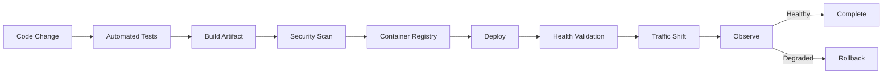
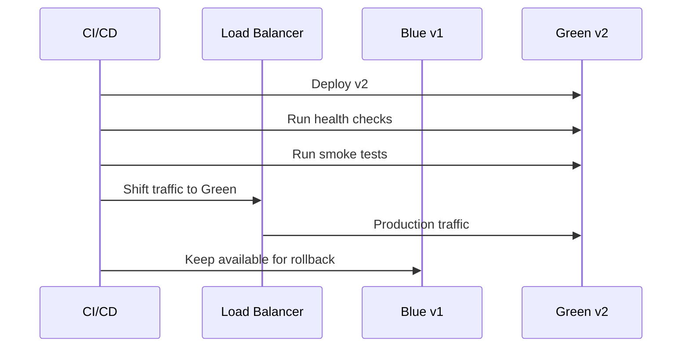
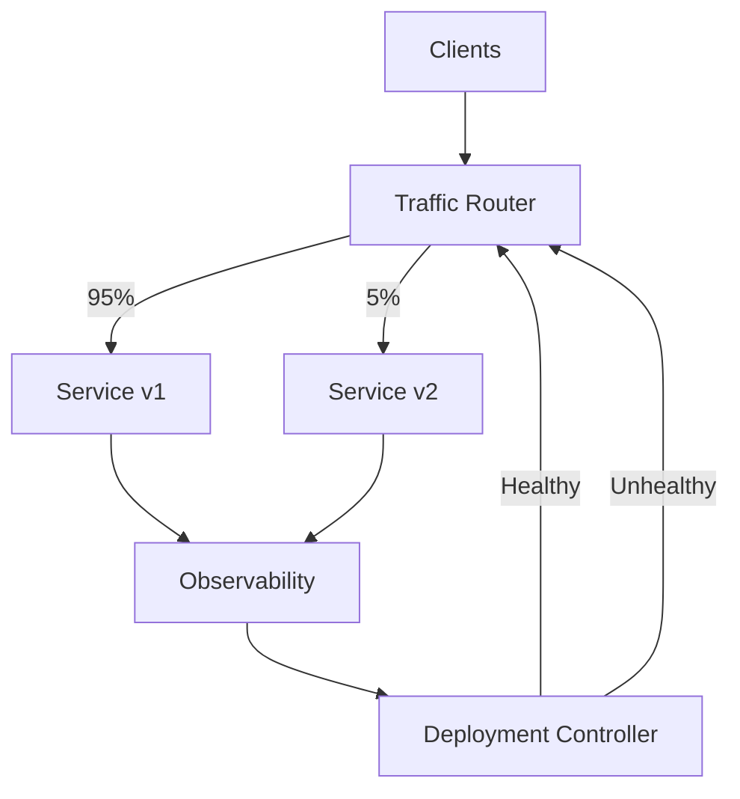
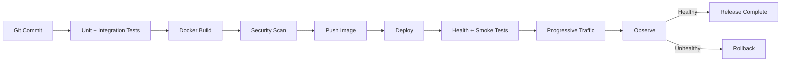

# 09- Deployment Strategies

## Overview

Deployment strategy defines how a new application version is introduced into production while controlling risk, availability impact, and rollback complexity.

In a microservices architecture, deployment is not simply:

```text
build -> copy files -> restart application
```

A production deployment changes a running distributed system:

```text
                    +------------------+
                    |    CI Pipeline   |
                    +--------+---------+
                             |
                             v
                    +------------------+
                    | Container Image  |
                    +--------+---------+
                             |
                             v
                    +------------------+
                    | Deployment Layer |
                    +--------+---------+
                             |
             +---------------+---------------+
             |               |               |
             v               v               v
        Service v1      Service v1      Service v2
             |               |               |
             +---------------+---------------+
                             |
                             v
                          Users
```

A good deployment strategy should answer:

- How much traffic reaches the new version initially?
- How quickly can the new version be rolled back?
- How is application health validated?
- What happens to existing connections?
- Can multiple versions coexist?
- How are database schema changes handled?
- How are asynchronous consumers upgraded?
- How is deployment impact measured?

Common strategies include:

| Strategy | Production Traffic | Rollback | Complexity | Typical Use |
|---|---|---|---|---|
| Recreate | All at once | Moderate | Low | Non-critical systems |
| Rolling | Gradually | Moderate | Low–Medium | Kubernetes services |
| Blue-Green | Switched between environments | Fast | Medium | High availability |
| Canary | Small percentage first | Fast | High | Risk-sensitive releases |
| A/B | Selected users | Controlled | High | Product experimentation |
| Shadow | Duplicate traffic | Not user-facing | High | Validation |
| Feature Flags | Runtime-controlled | Very fast | Medium | Gradual feature rollout |

Deployment strategy is part of reliability engineering, not merely CI/CD configuration.

## Deployment Goals

A production deployment should optimize several competing objectives:

```text
                Deployment Quality
                       |
       +---------------+---------------+
       |               |               |
   Availability      Safety          Speed
       |               |               |
   No downtime    Small blast       Fast delivery
                  radius
```

Important goals include:

- Minimal downtime
- Small blast radius
- Fast rollback
- Automated validation
- Controlled traffic exposure
- Backward compatibility
- Reproducibility
- Auditability
- Operational visibility

The correct strategy depends on the system's availability requirements and operational maturity.

## Deployment Lifecycle

A mature deployment pipeline typically looks like:



Each stage should fail safely.

For example, a failed health check should prevent additional traffic from reaching the new version.

## Immutable Deployments

An immutable deployment creates a new artifact rather than modifying an existing production instance.

For containerized applications:

```text
Source
  |
  v
Docker Build
  |
  v
image: order-service:8f92c1a
  |
  v
Registry
  |
  v
Production
```

The deployed image should be immutable and identifiable by a commit SHA or immutable digest.

Prefer:

```text
order-service@sha256:...
```

over relying solely on:

```text
order-service:latest
```

This makes deployments reproducible and simplifies rollback.

## Recreate Deployment

A recreate deployment terminates the existing version and then starts the new version.

```text
Before:

v1 v1 v1 v1
|  |  |  |
+--+--+--+

Deploy

STOP ALL

Start

v2 v2 v2 v2
```

### Advantages

- Very simple
- Easy to reason about
- No simultaneous versions
- Useful when old and new versions cannot coexist

### Limitations

- Usually causes downtime
- Creates a large availability gap
- Large blast radius
- Rollback may require another restart

### When to Use

Use recreate deployments primarily when:

- Downtime is acceptable
- The service is internal
- The workload is non-critical
- Versions cannot safely coexist

For public APIs with strict availability requirements, this is usually not the preferred strategy.

## Rolling Deployment

A rolling deployment gradually replaces instances.

Example:

```text
Initial:

v1 v1 v1 v1

Step 1:

v1 v1 v1 v2

Step 2:

v1 v1 v2 v2

Step 3:

v1 v2 v2 v2

Final:

v2 v2 v2 v2
```

The key property is that old and new versions coexist temporarily.

### Kubernetes Example

A Deployment can use rolling updates:

```yaml
apiVersion: apps/v1
kind: Deployment
metadata:
  name: order-service
spec:
  replicas: 6
  strategy:
    type: RollingUpdate
    rollingUpdate:
      maxUnavailable: 1
      maxSurge: 1
  selector:
    matchLabels:
      app: order-service
  template:
    metadata:
      labels:
        app: order-service
    spec:
      containers:
        - name: order-service
          image: example/order-service:8f92c1a
          ports:
            - containerPort: 8000
          readinessProbe:
            httpGet:
              path: /health/ready
              port: 8000
          livenessProbe:
            httpGet:
              path: /health/live
              port: 8000
```

`maxUnavailable` controls how many existing instances can be unavailable during the update.

`maxSurge` controls how many additional instances can temporarily exist above the desired replica count.

### Advantages

- Usually supports zero-downtime deployments
- Uses existing infrastructure
- Gradual replacement
- Native Kubernetes support

### Limitations

- Old and new versions coexist
- Requires backward compatibility
- Rollback can take time
- Incorrect readiness checks can cause unhealthy instances to receive traffic

### Production Considerations

A rolling deployment should use:

- Readiness probes
- Graceful shutdown
- Connection draining
- Appropriate termination grace periods
- Pod disruption controls
- Capacity headroom
- Version-compatible APIs

## Blue-Green Deployment

Blue-green deployment maintains two complete environments.

```text
                 Load Balancer
                      |
              +-------+-------+
              |               |
              v               v
          Blue v1          Green v2
          ACTIVE           STANDBY
```

Initially:

```text
100% -> Blue
0%   -> Green
```

After validation:

```text
0%   -> Blue
100% -> Green
```

### Deployment Flow



### Advantages

- Fast traffic switching
- Simple rollback
- Full environment validation before exposure
- Reduced deployment downtime

### Limitations

- Requires additional capacity
- Database changes can complicate rollback
- Two environments increase operational cost
- Stateful workloads require careful design

### Rollback

If Green fails:

```text
Current:

100% -> Green v2

Rollback:

100% -> Blue v1
```

The traffic switch can often happen much faster than rebuilding the old version.

## Canary Deployment

A canary deployment sends a small percentage of traffic to the new version before expanding the rollout.

```text
                  Load Balancer
                       |
          +------------+------------+
          |                         |
          v                         v
       v1: 95%                    v2: 5%
```

If metrics remain healthy:

```text
95/5
  |
  v
80/20
  |
  v
50/50
  |
  v
0/100
```

### Canary Signals

Typical promotion criteria include:

- Error rate
- p95/p99 latency
- HTTP 5xx rate
- CPU saturation
- Memory usage
- Dependency failures
- Business metrics
- Queue lag
- Payment success rate

A canary should not be promoted merely because the container is running.

## Canary Architecture



The deployment controller can increase or stop traffic based on predefined policies.

## Canary Advantages

- Small blast radius
- Early detection of regressions
- Real production traffic
- Controlled rollout
- Easier mitigation than full deployment

## Canary Limitations

- More operational complexity
- Requires reliable telemetry
- Traffic splitting must be accurate
- Small traffic percentages may not expose rare failures
- Requires careful promotion policies

A 1% canary is not automatically safe.

If the service receives only 100 requests per minute, 1% may produce almost no statistically useful data.

## Progressive Delivery

Progressive delivery generalizes canary and automated rollout strategies.

Example:

```text
Deploy
  |
  v
1%
  |
  v
5%
  |
  v
25%
  |
  v
50%
  |
  v
100%
```

At each stage:

```text
Observe
  |
  +--> Healthy --> Promote
  |
  +--> Unhealthy -> Stop/Rollback
```

This is particularly useful with Kubernetes and deployment controllers.

## A/B Deployment

A/B deployment routes different users to different versions.

For example:

```text
Users
 |
 +--> Group A -> v1
 |
 +--> Group B -> v2
```

Traffic selection can be based on:

- User ID
- Region
- Device
- Account type
- Cookie
- Experiment assignment

A/B deployment is primarily useful for product experimentation rather than purely technical deployment safety.

### Example

```text
Feature:
New checkout workflow

Control:
v1

Experiment:
v2
```

The system can compare:

- Conversion rate
- Checkout completion
- Error rate
- Latency
- Revenue

## Shadow Deployment

Shadow deployment sends a copy of production traffic to a new version without using its response for the actual user request.

```text
                 Request
                    |
                    v
                Router
                 /   \
                /     \
               v       v
             v1       v2
              |        |
           Response   Ignored
              |
              v
            User
```

The new version processes real traffic but does not affect user-visible behavior.

### Use Cases

- Major framework migrations
- New recommendation algorithms
- Database query rewrites
- Performance validation
- Large architectural changes

### Risks

Shadow traffic can still affect:

- Database load
- External APIs
- Kafka
- Redis
- CPU
- Memory

Therefore shadow systems must isolate side effects.

A shadow service should not accidentally send duplicate emails or charge customers.

## Feature Flags

Feature flags separate deployment from feature activation.

Without a feature flag:

```text
Deploy code
   |
   v
Feature immediately active
```

With a feature flag:

```text
Deploy code
   |
   v
Feature disabled
   |
   v
Enable gradually
```

Example:

```python
def checkout(request):
    if feature_flags.enabled("new_checkout", request.user):
        return new_checkout(request)

    return legacy_checkout(request)
```

Feature flags are useful for:

- Gradual rollout
- Emergency disablement
- A/B testing
- Customer-specific activation
- Operational mitigation

### Feature Flag Risks

Feature flags introduce technical debt if they are never removed.

Maintain:

- Owner
- Creation date
- Purpose
- Expected removal date
- Default state

## Deployment Strategies Comparison

| Strategy | Downtime | Rollback Speed | Infrastructure Cost | Risk Control |
|---|---:|---:|---:|---:|
| Recreate | High | Medium | Low | Low |
| Rolling | Low/None | Medium | Low | Medium |
| Blue-Green | Low/None | Fast | High | High |
| Canary | Low/None | Fast | Medium | Very High |
| A/B | Low/None | Fast | Medium | Product-focused |
| Shadow | Low/None | N/A | High | Validation-focused |
| Feature Flags | Low/None | Very Fast | Medium | Very High |

## Choosing a Deployment Strategy

A practical decision model is:

```text
Need zero downtime?
        |
       Yes
        |
        v
Can old/new versions coexist?
        |
      +---+
      |   |
     Yes  No
      |    |
      v    v
 Rolling  Blue-Green
    |
    v
Need very small blast radius?
    |
   Yes
    |
    v
 Canary
```

Consider:

- Availability requirements
- Traffic volume
- Rollback requirements
- Infrastructure budget
- Database compatibility
- Team maturity
- Observability maturity
- Kubernetes/service-mesh capabilities

For most mature microservice environments, rolling or progressive canary deployment is a strong default.

## Database Migration Compatibility

Database migrations are one of the most important deployment concerns.

Suppose v1 expects:

```sql
users.name
```

and v2 expects:

```sql
users.full_name
```

Changing the column immediately can break v1 while both versions are running.

Prefer an expand-and-contract migration.

### Expand

Add the new schema without removing the old one.

```text
users
  |
  +--> name
  +--> full_name
```

### Migrate

Application code writes both fields where necessary.

```text
v2
 |
 +--> name
 +--> full_name
```

### Switch

Deploy code that reads only the new field.

### Contract

After all old instances are gone, remove the old field.

```text
users
  |
  +--> full_name
```

This allows rolling deployments to coexist safely.

## Backward-Compatible APIs

During rolling deployments:

```text
v1 client -> v2 service
v2 client -> v1 service
```

may temporarily occur.

Therefore API contracts should generally be backward compatible.

Prefer additive changes:

```json
{
  "id": "123",
  "name": "Alice",
  "timezone": "Asia/Kolkata"
}
```

Adding a field is usually safer than removing or renaming an existing one.

Avoid changing:

- Required request fields
- Existing response semantics
- Enum values without compatibility analysis
- Serialization formats

without a migration strategy.

## Message Compatibility

Asynchronous systems have similar problems.

Suppose Kafka consumers process:

```json
{
  "order_id": "123",
  "amount": 100
}
```

A new producer might add:

```json
{
  "order_id": "123",
  "amount": 100,
  "currency": "INR"
}
```

This is generally safer than removing `amount` or changing its type.

Consumers should tolerate fields they do not understand when the serialization format allows it.

## Graceful Shutdown

A deployment should not abruptly terminate active requests.

A typical lifecycle is:

```text
Receive termination signal
        |
        v
Stop accepting new traffic
        |
        v
Readiness becomes false
        |
        v
Drain active connections
        |
        v
Finish in-flight work
        |
        v
Terminate process
```

For Kubernetes workloads, configure an appropriate termination grace period.

Example:

```yaml
spec:
  terminationGracePeriodSeconds: 30
```

The exact value should be based on observed request and shutdown durations rather than arbitrary defaults.

## Health Checks

Deployment systems need reliable health checks.

### Liveness

Answers:

> Is the process fundamentally alive?

A liveness failure may result in process restart.

### Readiness

Answers:

> Should this instance receive traffic?

Readiness should account for dependencies when appropriate, but avoid making the application permanently unready because of a non-critical dependency.

### Startup

Answers:

> Has the application finished initializing?

Useful for applications with slow startup.

A healthy deployment should distinguish these states.

## Smoke Tests

After deployment, execute lightweight production validation.

Examples:

```text
GET /health
POST /orders
GET /orders/{id}
```

Smoke tests should validate critical paths without creating harmful side effects.

For payment systems, for example, a synthetic transaction should not accidentally charge a real account.

## Deployment Verification

Verification should combine:

```text
Infrastructure health
+
Application health
+
Dependency health
+
Business health
```

Example:

```text
Infrastructure:
Healthy

HTTP 5xx:
0.2%

p99:
420ms

Payment success:
99.8%

Kafka lag:
Stable
```

A deployment is not healthy simply because Kubernetes reports all pods as `Ready`.

## Rollback

Rollback should be designed before deployment.

A rollback might mean:

```text
Canary:
5% -> 0%

Blue-Green:
Green -> Blue

Rolling:
v2 -> v1

Feature Flag:
enabled -> disabled
```

Rollback mechanisms should be:

- Automated where safe
- Tested regularly
- Fast
- Observable
- Documented

## Application Rollback vs Database Rollback

Application rollback is often straightforward:

```text
v2 -> v1
```

Database rollback can be dangerous.

For example:

```sql
DROP COLUMN customer_name;
```

If v2 is rolled back to v1, the old application may still require that column.

Therefore database migrations should favor forward-compatible changes over destructive rollback-dependent migrations.

## Kubernetes Rolling Deployment

A typical deployment flow is:

```text
kubectl apply
      |
      v
Deployment Controller
      |
      v
Create new ReplicaSet
      |
      v
Create new Pods
      |
      v
Readiness checks
      |
      v
Add ready Pods to Service
      |
      v
Terminate old Pods
```

Useful commands include:

```bash
kubectl rollout status deployment/order-service
```

```bash
kubectl rollout history deployment/order-service
```

```bash
kubectl rollout undo deployment/order-service
```

Inspect the deployment:

```bash
kubectl get deployment order-service
kubectl get pods -l app=order-service
```

## Docker Image Versioning

Avoid mutable production tags such as:

```text
latest
production
stable
```

Prefer immutable identifiers:

```text
order-service:2026.08.23.1
```

or:

```text
order-service:8f92c1a
```

Best practice is to deploy using immutable image digests when the platform supports them.

This ensures that the artifact deployed to production is precisely identifiable.

## CI/CD Pipeline

A production pipeline may look like:



CI should validate the artifact before deployment.

CD should deploy the same artifact that was tested rather than rebuilding it later.

## GitHub Actions Example

A simplified production-oriented pipeline might look like:

```yaml
name: Deploy

on:
  push:
    branches:
      - main

jobs:
  test:
    runs-on: ubuntu-latest

    steps:
      - uses: actions/checkout@v4

      - uses: actions/setup-python@v5
        with:
          python-version: "3.12"

      - name: Install dependencies
        run: pip install -r requirements.txt

      - name: Run tests
        run: pytest

  build:
    needs: test
    runs-on: ubuntu-latest

    steps:
      - uses: actions/checkout@v4

      - name: Build image
        run: |
          docker build \
            --tag order-service:${{ github.sha }} \
            .

      - name: Push image
        run: |
          docker push \
            registry.example.com/order-service:${{ github.sha }}

  deploy:
    needs: build
    runs-on: ubuntu-latest

    steps:
      - name: Deploy
        run: |
          kubectl set image deployment/order-service \
            order-service=registry.example.com/order-service:${{ github.sha }}

      - name: Wait for rollout
        run: |
          kubectl rollout status \
            deployment/order-service \
            --timeout=5m
```

Production pipelines should additionally handle:

- Credentials through secret managers
- Image signing
- Security scanning
- Deployment approvals where appropriate
- Environment protection
- Rollout verification
- Automated rollback

## Deployment and Service Discovery

In microservices, deployment changes service instances.

A service discovery layer must therefore tolerate:

```text
Instance added
Instance removed
Instance replaced
Instance becomes unhealthy
```

The sequence is often:

```text
New instance
   |
   v
Health check
   |
   v
Service registration
   |
   v
Traffic
```

A terminating instance should stop receiving new traffic before shutdown.

## Deployment and API Gateway

An API gateway can support deployment strategies through:

- Weighted routing
- Header-based routing
- Path-based routing
- Region-based routing
- Version-based routing

Example:

```text
/api/orders
     |
     v
API Gateway
     |
     +--> v1
     |
     +--> v2
```

A gateway can therefore become an important traffic-control point for canary and blue-green deployments.

## Deployment and Service Mesh

A service mesh can provide advanced traffic management:

```text
Client
  |
  v
Service Mesh
  |
  +--> v1 95%
  |
  +--> v2 5%
```

Capabilities may include:

- Weighted traffic
- Retries
- Timeouts
- Circuit breaking
- mTLS
- Traffic mirroring
- Request routing
- Telemetry

This can simplify progressive delivery in large Kubernetes environments.

## Deployment and Asynchronous Processing

Deploying HTTP services is often easier than deploying consumers.

Suppose:

```text
Kafka
  |
  v
Consumer v1
```

During deployment:

```text
Consumer v1 + Consumer v2
```

may consume the same topic concurrently.

Therefore consumer changes should be:

- Backward compatible
- Idempotent
- Safe under concurrent processing
- Compatible with existing messages

A consumer should generally tolerate messages produced by the previous version during the transition.

## Deployment and Celery

Celery workers require similar consideration.

A safe worker deployment may involve:

```text
Stop accepting new work
       |
       v
Finish current tasks
       |
       v
Drain worker
       |
       v
Start new worker
```

Long-running tasks require explicit shutdown and visibility into task state.

Never assume restarting workers is equivalent to safely deploying an HTTP service.

## Deployment Safety for Stateful Services

Stateless services are easier to deploy because instances can be replaced.

Stateful systems require additional considerations:

- Persistent volumes
- Database connections
- Replication
- Leader election
- Cache state
- Queue offsets
- Session state

For stateful systems, separate application deployment from state migration where possible.

## Security Considerations

Deployment systems have access to production infrastructure and therefore require strong security controls.

Use:

- Least-privilege CI credentials
- Short-lived credentials
- AWS IAM roles where appropriate
- Kubernetes RBAC
- Secret managers
- Image vulnerability scanning
- Signed artifacts
- Protected production branches
- Deployment approvals for high-risk changes
- Audit logs

Do not store production credentials directly in:

```text
Dockerfiles
Git repositories
GitHub Actions YAML
container images
```

## Deployment Observability

Every deployment should emit observable metadata.

Useful metadata includes:

```text
service
version
commit_sha
deployment_time
environment
deployment_id
operator
```

Dashboards should make it possible to correlate:

```text
Deployment
   |
   v
Latency change
   |
   v
Error increase
   |
   v
Rollback
```

A deployment marker on service dashboards can significantly reduce incident investigation time.

## Cost Considerations

Different deployment strategies have different infrastructure costs.

### Rolling

Usually cost-efficient because existing capacity is reused.

### Blue-Green

Requires approximately two environments during deployment.

### Canary

Requires additional capacity depending on implementation, but usually less than full blue-green duplication.

### Shadow

Can be expensive because duplicate workloads process traffic.

The cost should be evaluated against the business cost of deployment failure.

## Common Mistakes

### Treating Deployment as a Binary Event

A deployment is not simply:

```text
old -> new
```

It is often a transition:

```text
old + new
```

for some period of time.

Design APIs, schemas, and messages accordingly.

### No Rollback Plan

If the only rollback mechanism is "deploy the old version manually," recovery will be slow.

### Mutable Image Tags

Using `latest` makes artifact identification and rollback unreliable.

### Ignoring Database Compatibility

A perfectly safe application rollout can fail because the schema is incompatible with one of the running versions.

### Incorrect Readiness Probes

If readiness always returns `200`, Kubernetes may send traffic to an instance that cannot actually serve requests.

### No Capacity Headroom

Rolling deployments may temporarily require extra instances.

If the cluster is already at capacity, `maxSurge` can prevent a successful rollout.

### Deploying and Migrating Destructively at Once

Dropping database columns during the same release that changes application code makes rollback dangerous.

### No Graceful Shutdown

Abrupt termination can cause:

- Failed requests
- Lost work
- Connection resets
- Duplicate processing

### Canary Without Meaningful Traffic

A canary receiving almost no requests provides weak evidence.

### Canary Without Business Metrics

A service can have healthy CPU, latency, and error rates while a critical business workflow is broken.

### Forgetting Feature Flags

A feature flag that is never removed creates permanent complexity and hidden execution paths.

## Interview Traps

### "Blue-Green and Canary Are the Same"

They are not.

Blue-green primarily maintains two environments and switches traffic between them.

Canary progressively exposes a new version to a subset of traffic.

### "Rolling Deployment Means Zero Downtime"

Not automatically.

Zero downtime depends on:

- Readiness checks
- Capacity
- Graceful shutdown
- Connection draining
- Backward compatibility
- Correct rollout configuration

### "Rollback Always Means Deploying the Previous Application"

Not necessarily.

Rollback can be:

- Traffic switch
- Image rollback
- Feature flag disablement
- Configuration rollback
- Forward database migration

### "Database Rollback Is Symmetric With Application Rollback"

Usually not.

Database state may be shared by multiple versions and may contain data written by the newer version.

### "Canary Means 1% Traffic"

No.

The percentage should be based on traffic volume, risk, observability quality, and statistical confidence.

## Production Deployment Checklist

Before deploying a critical microservice, verify:

### Artifact

- Immutable image tag or digest
- Reproducible build
- Security scan completed
- Artifact provenance available

### Application

- Unit tests passing
- Integration tests passing
- Health endpoints available
- Graceful shutdown implemented
- Backward-compatible API changes

### Database

- Migration tested
- Expand-and-contract strategy where necessary
- Rollback implications understood
- Long-running migrations identified

### Infrastructure

- Capacity available
- Readiness probes configured
- Liveness probes configured
- Autoscaling configured appropriately
- Pod disruption policies reviewed

### Deployment

- Rollout strategy selected
- Blast radius understood
- Smoke tests available
- Rollback mechanism tested
- Deployment timeout configured

### Observability

- Metrics available
- Logs correlated
- Distributed tracing available
- Deployment markers configured
- SLOs defined
- Alerts configured

### Security

- CI/CD credentials protected
- Production access restricted
- Secrets externalized
- Deployment actions audited

## Key Takeaways

- **Choose deployment strategies based on availability requirements, blast radius, rollback speed, infrastructure cost, and the ability of old and new versions to coexist safely.**
- **Rolling, blue-green, and canary deployments reduce production risk, but they require reliable health checks, observability, graceful shutdown, and backward-compatible contracts.**
- **Database schemas, APIs, Kafka messages, and Celery workloads must support transitional states because multiple application versions commonly coexist during deployment.**
- **Rollback must be designed and tested before deployment; application rollback is usually easier than database rollback, so prefer backward-compatible expand-and-contract migrations.**
- **A mature deployment pipeline combines immutable artifacts, automated validation, progressive traffic control, observability, security controls, and a fast mitigation path.**