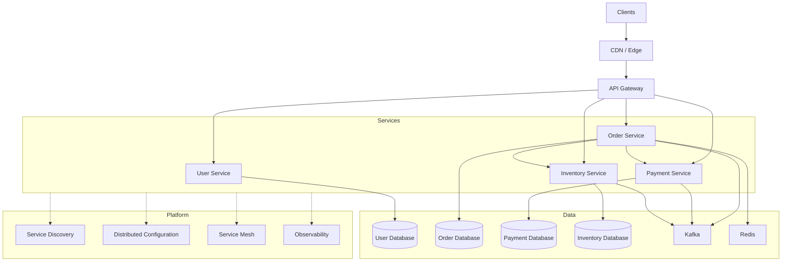

# 10- Summary

## Overview

Microservices architecture decomposes a system into independently deployable services organized around business capabilities. The architectural benefit is not simply "many small services"; it is the ability to isolate change, scale independently, deploy independently, and assign clear ownership boundaries.

The trade-off is substantial distributed-systems complexity. Once a monolith is decomposed, concerns that were previously handled by a single process or database become explicit engineering problems:

- Network communication
- Service discovery
- Failure propagation
- Distributed configuration
- Data ownership
- Observability
- Deployment coordination
- Security between services
- Distributed transactions
- Event delivery
- Version compatibility

A production microservices architecture therefore requires more than separating Django or FastAPI applications into repositories. The surrounding platform and operational model are equally important.

## Microservices Architecture at a Glance

A typical production architecture may look like:



The exact architecture varies, but the important principle is that each infrastructure component exists to solve a specific distributed-system problem.

## Core Architectural Principles

### Clear Service Boundaries

A service should own a cohesive business capability.

Examples:

| Service | Responsibility |
|---|---|
| User Service | Identity and user profile management |
| Order Service | Order lifecycle |
| Payment Service | Payment processing |
| Inventory Service | Stock reservation |
| Notification Service | Email/SMS/push delivery |

Avoid defining services primarily around technical layers such as:

```text
Database Service
Serializer Service
Model Service
Utility Service
```

A good service boundary generally aligns with business ownership and data ownership.

### Independent Deployability

A microservice should ideally be deployable without requiring all other services to be deployed simultaneously.

This requires:

- Backward-compatible APIs
- Version-tolerant events
- Database migration discipline
- Independent CI/CD pipelines
- Isolated configuration
- Automated testing

If every change requires deploying ten services together, the system may technically be composed of microservices but operationally behaves like a distributed monolith.

### Data Ownership

Each service should own its critical data.

For example:

```text
Order Service  -> orders_db
Payment Service -> payments_db
Inventory Service -> inventory_db
```

Avoid:

```text
Order Service --------+
                      |
Payment Service ------+--> shared_db
                      |
Inventory Service ----+
```

A shared database creates hidden coupling between services and makes independent deployment difficult.

## Service Communication

Microservices commonly communicate using synchronous and asynchronous mechanisms.

| Communication | Typical Technology | Best For |
|---|---|---|
| REST | HTTP/JSON | Public APIs and general service communication |
| gRPC | HTTP/2 + Protobuf | Internal low-latency RPC |
| Events | Kafka | Decoupled asynchronous workflows |
| Task queues | Celery | Background processing |
| Cache | Redis | Low-latency shared access patterns |

Synchronous communication is simple but introduces runtime dependency.

```text
Order Service
     |
     | HTTP/gRPC
     v
Payment Service
```

If Payment Service is unavailable, Order Service may fail or become slower.

Asynchronous communication separates the producer from immediate availability of the consumer:

```text
Order Service
     |
     v
Kafka
     |
     v
Payment Consumer
```

This improves decoupling but introduces eventual consistency, duplicate delivery concerns, retries, and operational complexity.

## Synchronous Communication

Use synchronous calls when the caller requires an immediate response.

Examples:

```text
GET user profile
Validate authorization
Check account status
Fetch current inventory
```

Production requirements include:

- Connection pooling
- Explicit timeouts
- Retries only where safe
- Circuit breaking where appropriate
- Request IDs
- Distributed tracing
- Rate limiting

Never allow an internal HTTP request to wait indefinitely.

A practical timeout hierarchy is:

```text
Client timeout
    >
Gateway timeout
    >
Service timeout
    >
Downstream timeout
```

The downstream timeout should normally be shorter than the caller's overall deadline.

## Asynchronous Communication

Use asynchronous communication when work does not need to complete within the request lifecycle.

Examples:

```text
Order created
    |
    +--> Send email
    +--> Generate invoice
    +--> Update analytics
    +--> Notify warehouse
```

Kafka is useful for durable event streams, while Celery is useful for background task execution.

Asynchronous systems require explicit handling for:

- Retries
- Idempotency
- Dead-letter queues
- Ordering
- Consumer lag
- Duplicate messages
- Poison messages
- Replay

## API Gateway

An API gateway provides a controlled external entry point.

Typical responsibilities include:

- Authentication
- Authorization enforcement
- TLS termination
- Routing
- Rate limiting
- Request validation
- Observability
- Traffic management

Example:

```text
Client
  |
  v
API Gateway
  |
  +--> User Service
  +--> Order Service
  +--> Payment Service
```

Nginx can provide reverse-proxy and routing capabilities, while cloud-native systems may use managed gateways or ingress controllers.

The gateway should not become a giant business-logic layer.

## Service Discovery

Dynamic environments create and destroy service instances continuously.

Instead of hardcoding:

```text
http://10.0.2.15:8000
```

services resolve logical names:

```text
http://payment-service
```

Service discovery can be:

- Client-side
- Server-side
- Platform-provided

Kubernetes provides service discovery through Services and DNS, reducing the need for application-level discovery in many deployments.

## Distributed Configuration

Configuration should be externalized from application artifacts.

Examples include:

- Database endpoints
- Feature flags
- Timeouts
- Service URLs
- Environment-specific settings
- Non-secret operational parameters

Secrets should be managed separately using mechanisms such as:

- AWS Secrets Manager
- Kubernetes Secrets with appropriate encryption and access controls
- External secret managers

Avoid baking environment-specific configuration into Docker images.

## Service Mesh

A service mesh moves common service-to-service networking concerns into infrastructure.

Typical capabilities include:

```text
Service
  |
Sidecar / Data Plane
  |
  +--> mTLS
  +--> Retries
  +--> Timeouts
  +--> Traffic splitting
  +--> Metrics
  +--> Tracing
  +--> Circuit breaking
```

This can simplify large Kubernetes environments but introduces another operational layer.

A service mesh is not automatically required for every microservices architecture.

Use it when the operational benefits justify the additional complexity.

## Observability

Distributed systems require observability across service boundaries.

The three primary signals are:

| Signal | Answers |
|---|---|
| Metrics | How is the system behaving quantitatively? |
| Logs | What happened? |
| Traces | Where did the request spend time? |

A request may travel through:

```text
Client
  -> API Gateway
  -> Order Service
  -> Payment Service
  -> Kafka
  -> Notification Service
```

Without distributed tracing, determining where latency or failure occurred becomes difficult.

Important metadata includes:

- Request ID
- Trace ID
- Span ID
- Service name
- Version
- Environment
- Region

## Deployment Strategies

Microservices benefit from independent deployment strategies.

Common approaches include:

| Strategy | Main Advantage | Main Risk |
|---|---|---|
| Rolling | Efficient and simple | Multiple versions coexist |
| Blue-Green | Fast rollback | Higher infrastructure cost |
| Canary | Small blast radius | Requires strong observability |
| Feature Flag | Fine-grained rollout | Flag complexity |
| Shadow | Production validation | Duplicate infrastructure load |

Deployment must account for compatibility between old and new versions.

For example:

```text
v1 + v2 running simultaneously
```

means:

```text
API compatibility
Database compatibility
Event compatibility
Configuration compatibility
```

must all be considered.

## Database Migration Strategy

Microservice deployments should generally use expand-and-contract migrations.

```text
Expand
  |
  v
Introduce new schema
  |
  v
Deploy compatible application
  |
  v
Migrate data
  |
  v
Switch reads/writes
  |
  v
Contract
  |
  v
Remove obsolete schema
```

Avoid destructive changes during the first deployment of a new application version.

For example, do not immediately remove a database column still required by the previous version.

## Reliability Patterns

Distributed systems fail in partial ways.

A service may be:

- Reachable but slow
- Healthy but overloaded
- Available but returning errors
- Connected but unable to access its database
- Processing messages but accumulating lag

Important reliability patterns include:

### Timeouts

Every network call should have an explicit deadline.

### Retries

Retries should be limited and used only when the operation is safe to retry.

Avoid:

```text
Retry immediately forever
```

Prefer:

```text
Attempt
  |
  v
Exponential backoff
  |
  v
Bounded retry
  |
  v
Fail / fallback
```

### Circuit Breakers

Circuit breakers prevent a failing dependency from consuming all caller resources.

```text
Closed
  |
  | failures exceed threshold
  v
Open
  |
  | cooldown
  v
Half-Open
  |
  +--> Healthy -> Closed
  |
  +--> Failed -> Open
```

### Bulkheads

Isolate resource pools so that one failing dependency does not consume all system capacity.

For example, separate worker pools or connection pools can prevent a slow downstream service from exhausting resources needed by unrelated operations.

## Idempotency

Distributed systems frequently retry operations.

An operation such as:

```http
POST /payments
```

could accidentally execute twice if the first response is lost.

Use an idempotency key:

```http
Idempotency-Key: 6c3b8a1e-...
```

The payment service can persist the result associated with that key.

This is especially important for:

- Payments
- Orders
- Resource creation
- Task processing
- Event consumers

Idempotency is one of the most important reliability properties in distributed systems.

## Distributed Transactions

Traditional database transactions work well within a single database.

Across services:

```text
Order DB
Payment DB
Inventory DB
```

a single ACID transaction generally cannot be assumed.

Instead, common approaches include:

- Saga pattern
- Transactional outbox
- Compensating transactions
- Event-driven workflows

A Saga may look like:

```text
Create Order
    |
    v
Reserve Inventory
    |
    v
Authorize Payment
    |
    v
Confirm Order
```

If payment fails:

```text
Cancel Order
Release Inventory
```

The system achieves consistency through coordinated state transitions rather than one global database transaction.

## Transactional Outbox

The transactional outbox pattern solves the problem of updating a database and publishing an event reliably.

Without an outbox:

```text
DB Transaction -> Commit
       |
       X
Kafka Publish -> Failure
```

The database changes but the event is lost.

With an outbox:

```text
DB Transaction
   |
   +--> Business Data
   |
   +--> Outbox Event
             |
             v
       Outbox Publisher
             |
             v
           Kafka
```

The business change and event record are committed atomically in the same database transaction.

A background publisher then delivers the event.

## Eventual Consistency

Microservices often trade immediate consistency for availability and decoupling.

Example:

```text
Order Created
      |
      v
Kafka Event
      |
      v
Inventory Updated
```

For a short period:

```text
Order Service: order = CREATED
Inventory Service: old state
```

This is eventual consistency.

The system should explicitly define which data can be temporarily stale and which operations require strong consistency.

## Caching

Redis is commonly used to reduce database load and latency.

Typical patterns include:

- Cache-aside
- Write-through
- Write-behind
- Distributed locking where carefully justified

Cache-aside:

```text
Request
  |
  v
Redis
  |
  +--> Hit -> Return
  |
  +--> Miss
          |
          v
      PostgreSQL
          |
          v
        Redis
```

Caching introduces consistency and invalidation problems.

Never assume:

```text
Cache = source of truth
```

unless the architecture explicitly defines it that way.

## Scalability

Microservices allow independent scaling.

For example:

```text
User Service       3 replicas
Order Service      10 replicas
Payment Service    20 replicas
Notification       50 workers
```

This is valuable when workloads differ significantly.

However, scaling one service does not automatically scale the entire workflow.

If Order Service is scaled from 10 to 100 replicas while Payment Service remains at capacity, the bottleneck simply moves downstream.

Therefore capacity planning must consider the complete dependency graph.

## Backpressure

A fast producer can overwhelm a slower consumer.

```text
Producer
  |
  | 10,000 msg/s
  v
Kafka
  |
  | 2,000 msg/s
  v
Consumer
```

The backlog grows.

Monitor:

- Queue depth
- Kafka consumer lag
- Processing rate
- Error rate
- Retry rate

Backpressure mechanisms may include:

- Rate limiting
- Bounded worker pools
- Queue limits
- Consumer scaling
- Load shedding

## Security

Microservices expand the security boundary.

Important controls include:

- TLS
- mTLS where appropriate
- Service authentication
- Authorization
- Short-lived credentials
- Least-privilege IAM
- Kubernetes RBAC
- Network policies
- Secret management
- Audit logging
- Input validation

Do not assume internal traffic is automatically trusted.

A compromised service should not automatically have unrestricted access to every other service.

## High Availability

A highly available microservice should avoid single-instance dependencies.

Typical design:

```text
                 Load Balancer
                      |
            +---------+---------+
            |         |         |
           v1        v1        v1
          Pod       Pod       Pod
```

Critical dependencies should also have appropriate redundancy.

Examples:

- Multi-AZ deployment
- Database replication
- Kafka replication
- Multiple worker instances
- Redundant gateways
- Health-aware routing

High availability is an end-to-end property. Three replicas are not useful if all three depend on one unavailable database.

## Disaster Recovery

Microservices require explicit recovery planning.

Consider:

- Database backups
- Point-in-time recovery
- Multi-AZ or multi-region architecture
- Kafka replication or replay strategy
- Configuration backup
- Infrastructure-as-code
- Container registry availability
- Recovery procedures

Define:

| Metric | Meaning |
|---|---|
| RPO | Maximum acceptable data loss |
| RTO | Maximum acceptable recovery time |

For example:

```text
RPO = 5 minutes
RTO = 30 minutes
```

should directly influence backup and recovery architecture.

## Cost Considerations

Microservices introduce operational overhead.

Costs may come from:

- More compute instances
- More load balancers
- Kubernetes infrastructure
- Service mesh
- Observability platforms
- Network traffic
- Kafka clusters
- Redis clusters
- Separate databases
- CI/CD pipelines
- Additional environments

The correct question is not:

> Are microservices more expensive?

It is:

> Does the additional infrastructure cost provide enough organizational, scalability, reliability, or deployment value?

A modular monolith may be the better architecture for many systems.

## Common Production Pitfalls

### Too Many Services

Splitting every feature into a separate service creates excessive network communication and operational overhead.

### Shared Database

A shared database creates hidden coupling and prevents genuine service autonomy.

### Distributed Monolith

If services must always deploy together, the architecture has retained monolithic coupling while adding distributed-system complexity.

### Synchronous Call Chains

Avoid chains such as:

```text
A -> B -> C -> D -> E
```

Each hop adds latency and failure probability.

### Unlimited Retries

Retries can amplify outages.

If 1,000 requests each retry five times:

```text
1,000 -> 5,000 downstream requests
```

A dependency under pressure can become even more overloaded.

### Missing Timeouts

An unavailable dependency can consume application threads, workers, or connections indefinitely.

### Treating Kafka as a Database

Kafka provides durable event-stream capabilities, but it should not automatically become the primary source of truth for every business domain.

### Ignoring Duplicate Messages

At-least-once delivery can result in duplicate processing.

Consumers should be idempotent.

### Poor Service Boundaries

A service boundary that cuts across one business transaction can create excessive coordination between services.

### Centralized Business Logic

Putting all business logic in the API gateway defeats service ownership.

### Overusing Service Meshes

A service mesh can solve real problems, but it also adds control-plane, data-plane, networking, debugging, and operational complexity.

## Interview Traps

### "Microservices Always Scale Better"

No.

They allow independent scaling, but network calls, coordination, and shared dependencies can become bottlenecks.

### "Every Service Needs Its Own Database Server"

Not necessarily.

The important principle is logical data ownership and controlled access. Physical infrastructure can be shared where appropriate, provided services do not bypass ownership boundaries.

### "REST Is Bad for Microservices"

No.

REST is often perfectly appropriate. gRPC can be advantageous for internal high-performance RPC, but protocol choice depends on requirements.

### "Microservices Guarantee High Availability"

No.

Microservices can improve fault isolation, but poor dependency design can create more failure modes.

### "Kafka Solves Distributed Transactions"

No.

Kafka provides messaging and streaming capabilities. Business consistency still requires appropriate transaction and workflow patterns.

### "Retries Improve Reliability"

Only when bounded, backoff-aware, and safe.

Poor retry policies can make an outage worse.

## Practical Architecture Checklist

When evaluating a microservices architecture, ask:

### Boundaries

- Does each service represent a cohesive business capability?
- Does each service have clear ownership?
- Can services evolve independently?

### Communication

- Is synchronous communication actually required?
- Could an event or asynchronous workflow reduce coupling?
- Are timeouts configured?
- Are retries bounded?
- Are calls idempotent?

### Data

- Does each service own its data?
- Are cross-service transactions avoided where possible?
- Are schema migrations backward compatible?
- Is eventual consistency explicitly accepted?

### Reliability

- Are failure modes understood?
- Are circuit breakers or bulkheads required?
- Is backpressure handled?
- Are duplicate events safe?

### Deployment

- Can services be deployed independently?
- Are artifacts immutable?
- Is rollback tested?
- Can old and new versions coexist?

### Observability

- Are metrics available?
- Are logs structured?
- Is distributed tracing available?
- Can deployments be correlated with incidents?

### Security

- Are service identities authenticated?
- Is authorization enforced?
- Are secrets externalized?
- Are network boundaries restricted?

### Operations

- Can the team debug a cross-service failure?
- Are on-call procedures documented?
- Are SLOs defined?
- Is disaster recovery tested?

## Architecture Decision Framework

Microservices should be introduced because the system has a concrete architectural need.

Strong reasons may include:

- Independent scaling requirements
- Independent deployment requirements
- Clear organizational ownership boundaries
- Strong fault-isolation requirements
- Significantly different workload characteristics
- Independent technology or release lifecycles

Weak reasons include:

- "Everyone uses microservices"
- "It looks better on a resume"
- "We want to use Kubernetes"
- "The monolith has many files"

A modular monolith can often provide strong separation without distributed-system overhead.

## Key Takeaways

- **Microservices are primarily an organizational and architectural boundary around independently owned business capabilities, not simply a collection of small applications.**
- **The major complexity introduced by microservices is distributed-systems complexity: network failures, eventual consistency, service discovery, observability, deployment coordination, and partial failure.**
- **Strong service boundaries require clear data ownership, backward-compatible contracts, controlled communication, and independent deployability; otherwise the system becomes a distributed monolith.**
- **Production microservices depend on reliability patterns such as timeouts, bounded retries, idempotency, circuit breakers, backpressure, transactional outbox, and Saga-based workflows where appropriate.**
- **Microservices are not universally superior; choose them when independent scaling, deployment, ownership, or fault isolation justifies the additional operational and architectural complexity.**