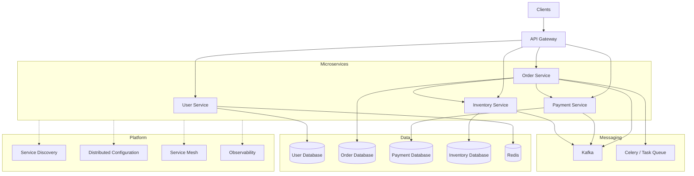

# README

## Overview

This section covers the architecture, communication, reliability, deployment, and operational concerns involved in building production-grade microservices.

Microservices decompose a backend system into independently deployable services aligned with business capabilities. The architectural benefit comes from **independent ownership, deployment, scaling, and fault isolation**—not simply from having multiple applications.

The trade-off is distributed-systems complexity. Network failures, service discovery, eventual consistency, observability, deployment compatibility, security, and operational overhead become first-class design concerns.

## Contents

| File | Topic | Focus |
|---|---|---|
| [01- Introduction](./01-%20Introduction.md) | Microservices Introduction | Core concepts, principles, architecture, service boundaries, and trade-offs |
| [02- Microservices vs Monolith](./02-%20Microservices%20vs%20Monolith.md) | Architecture Comparison | Monolith, modular monolith, microservices, and migration considerations |
| [03- Service Communication](./03-%20Service%20Communication.md) | Service Communication | REST, gRPC, synchronous communication, asynchronous messaging, and communication patterns |
| [04- API Gateway](./04-%20API%20Gateway.md) | API Gateway | Routing, authentication, rate limiting, aggregation, and edge concerns |
| [05- Service Discovery](./05-%20Service%20Discovery.md) | Service Discovery | Dynamic service registration, discovery mechanisms, DNS, and Kubernetes service discovery |
| [06- Distributed Configuration](./06-%20Distributed%20Configuration.md) | Distributed Configuration | Externalized configuration, configuration consistency, secrets, and runtime configuration |
| [07- Service Mesh](./07-%20Service%20Mesh.md) | Service Mesh | Traffic management, mTLS, retries, observability, and service-to-service networking |
| [08- Observability](./08-%20Observability.md) | Microservices Observability | Metrics, logs, traces, correlation IDs, SLOs, and distributed debugging |
| [09- Deployment Strategies](./09-%20Deployment%20Strategies.md) | Deployment Strategies | Rolling, blue-green, canary, feature flags, rollback, and version compatibility |
| [10- Summary](./10-%20Summary.md) | Microservices Summary | Consolidated architectural principles, production patterns, and design considerations |

## Architecture Map



## Core Engineering Themes

The section is organized around the major problems that emerge when a backend is distributed across independently deployable services.

### Service Boundaries

Services should represent cohesive business capabilities rather than arbitrary technical layers.

Good boundaries typically provide:

- Clear ownership
- Clear data ownership
- Independent deployment
- Independent scaling
- Limited coupling
- Explicit contracts

Poor boundaries create excessive synchronous calls and coordinated deployments, eventually producing a **distributed monolith**.

### Communication

Service communication generally falls into two categories:

| Pattern | Examples | Primary Trade-off |
|---|---|---|
| Synchronous | REST, gRPC | Simple request/response semantics but runtime coupling |
| Asynchronous | Kafka, Celery | Better decoupling but eventual consistency and delivery complexity |

Communication design should account for:

- Timeouts
- Retries
- Idempotency
- Circuit breakers
- Backpressure
- Authentication
- Authorization
- Observability

### Platform Capabilities

As the number of services grows, infrastructure concerns become increasingly important:

```text
                    API Gateway
                         |
              +----------+----------+
              |          |          |
           Service A  Service B  Service C
              |          |          |
              +----------+----------+
                         |
              Service Platform
              ├── Discovery
              ├── Configuration
              ├── Service Mesh
              └── Observability
```

These capabilities should solve concrete operational problems rather than being introduced solely because they are common in large architectures.

### Reliability

Distributed systems require explicit failure handling.

Important patterns include:

- Timeouts
- Bounded retries
- Exponential backoff
- Circuit breakers
- Bulkheads
- Idempotency
- Dead-letter handling
- Backpressure
- Load shedding
- Health checks

A service should assume that dependencies can be slow, unavailable, overloaded, or partially failed.

### Data Consistency

Independent service databases eliminate many cross-service ACID assumptions.

Common patterns include:

- Eventual consistency
- Saga
- Transactional outbox
- Compensating transactions
- Idempotent consumers
- Event-driven workflows

The architectural goal is not to eliminate inconsistency completely. It is to explicitly define where strong consistency is required and where eventual consistency is acceptable.

### Deployment

Independent services require compatible deployment practices.

Important techniques include:

- Rolling deployments
- Blue-green deployments
- Canary releases
- Feature flags
- Backward-compatible APIs
- Expand-and-contract database migrations
- Automated rollback
- Immutable container images

Multiple versions of a service may coexist during deployment, so contracts must tolerate mixed-version operation.

### Observability

A request can cross many services before producing a response.

A production system should make it possible to answer:

```text
Which service failed?
Where did latency increase?
Which dependency caused the failure?
Which deployment introduced the regression?
How many users are affected?
```

Core observability signals are:

| Signal | Purpose |
|---|---|
| Metrics | Quantitative system behavior |
| Logs | Detailed event information |
| Traces | Request flow across services |

Correlation IDs and distributed tracing are particularly important for debugging cross-service requests.

## Recommended Study Flow

The files are ordered so that architectural concepts build progressively:

```text
Introduction
    |
    v
Monolith vs Microservices
    |
    v
Service Communication
    |
    v
API Gateway
    |
    v
Service Discovery
    |
    v
Distributed Configuration
    |
    v
Service Mesh
    |
    v
Observability
    |
    v
Deployment Strategies
    |
    v
Summary
```

A practical progression is:

1. Understand why service boundaries exist.
2. Compare microservices with monolithic and modular-monolith architectures.
3. Learn synchronous and asynchronous communication.
4. Understand the responsibilities of an API gateway.
5. Understand how services locate one another in dynamic environments.
6. Learn how distributed configuration and secrets are managed.
7. Understand when a service mesh is justified.
8. Build observability across service boundaries.
9. Learn deployment and rollback strategies for independently evolving services.
10. Consolidate the patterns into an end-to-end architecture.

## Technology Mapping

The concepts in this section map to technologies commonly used in production backend systems:

| Concern | Technologies |
|---|---|
| Service implementation | Python, Django, FastAPI |
| Public API | REST, API Gateway, Nginx |
| Internal RPC | gRPC |
| Asynchronous messaging | Kafka |
| Background processing | Celery |
| Caching | Redis |
| Containers | Docker |
| Orchestration | Kubernetes |
| Databases | PostgreSQL |
| Service discovery | Kubernetes DNS / Service |
| Configuration | Environment variables, configuration stores, secret managers |
| Service networking | Kubernetes networking, service mesh |
| Observability | Metrics, structured logs, distributed tracing |
| Deployment | CI/CD, Kubernetes, AWS |

## Production Design Checklist

Before considering a microservices architecture production-ready, verify:

- [ ] Service boundaries represent business capabilities.
- [ ] Each service has clear ownership.
- [ ] Critical data has explicit ownership.
- [ ] APIs are backward compatible.
- [ ] Network calls have explicit timeouts.
- [ ] Retries are bounded and use backoff.
- [ ] Retryable operations are idempotent.
- [ ] Failure isolation is considered.
- [ ] Asynchronous workflows handle duplicate messages.
- [ ] Backpressure and queue growth are monitored.
- [ ] Secrets are externalized.
- [ ] Service-to-service authentication is implemented.
- [ ] Metrics, logs, and distributed traces are available.
- [ ] Deployments support mixed service versions.
- [ ] Database migrations are backward compatible.
- [ ] Rollback procedures are tested.
- [ ] SLOs and alerting policies are defined.
- [ ] Disaster recovery requirements are documented.
- [ ] Operational ownership is clear.

## Key Takeaways

- **Microservices should be organized around clear business capabilities with explicit service and data ownership.**
- **Distributed communication introduces failure modes that require timeouts, retries, idempotency, backpressure, and fault-isolation patterns.**
- **API gateways, service discovery, configuration, service meshes, and observability solve different operational problems and should not be introduced without a concrete need.**
- **Independent deployment requires backward-compatible contracts, safe database migrations, observability, and tested rollback strategies.**
- **A production microservices architecture is successful only when its operational complexity is justified by the scalability, ownership, deployment, and reliability benefits it provides.**