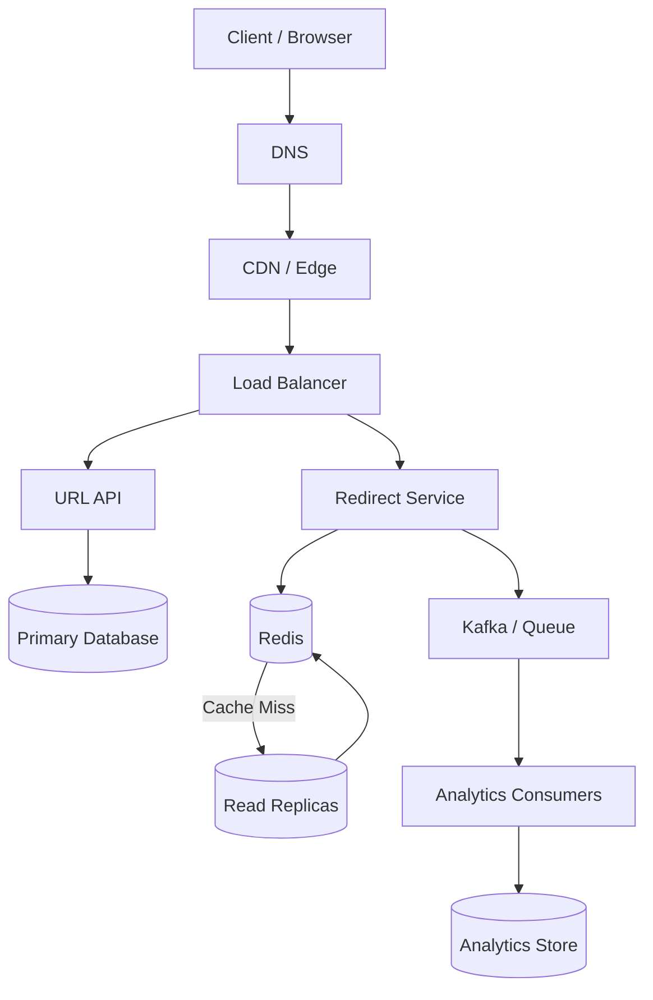
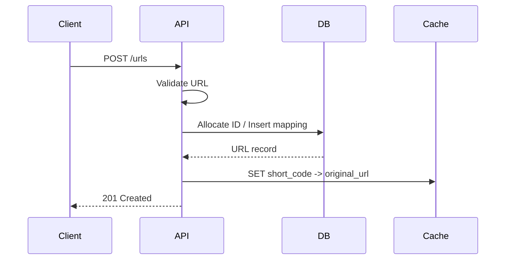
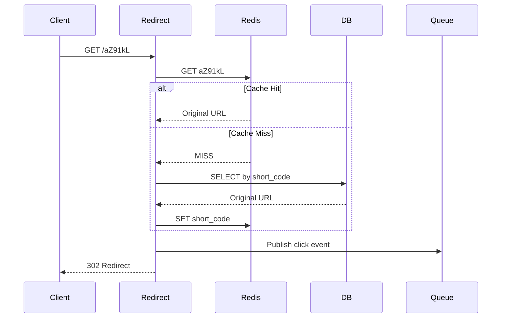
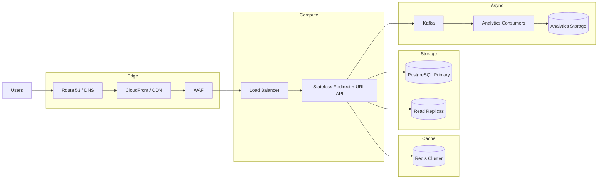

# 01- URL Shortener

## Overview

A URL shortener converts a long URL into a compact identifier that can be used as a short link.

For example:

```text
https://example.com/products/category/backend-engineering/articles/system-design
```

can become:

```text
https://short.example/Ab3xK9
```

The system appears simple, but it is a useful system-design case study because it combines several important backend engineering problems:

- High-volume reads
- Unique identifier generation
- Database key design
- Caching
- Hot keys
- Horizontal scaling
- Redirect latency
- Abuse prevention
- Analytics
- Data retention
- Availability and durability
- Read-heavy workload optimization

A production design should optimize the redirect path aggressively because the majority of traffic typically consists of users resolving existing short URLs rather than creating new ones.

## Problem Definition

The system provides two primary operations:

```text
POST /urls
GET  /{short_code}
```

The first operation creates a short URL.

The second operation resolves the short code and redirects the client to the original URL.

A typical interaction is:

```text
POST /urls

{
  "url": "https://example.com/products/123"
}
```

Response:

```json
{
  "short_url": "https://short.example/aZ91kL",
  "short_code": "aZ91kL"
}
```

A subsequent request:

```text
GET /aZ91kL
```

returns:

```http
HTTP/1.1 302 Found
Location: https://example.com/products/123
```

## Requirements

### Functional Requirements

The system should support:

- Creating a short URL.
- Resolving a short code to its original URL.
- Optional custom aliases.
- Optional expiration.
- Optional ownership information.
- Optional deletion or disabling.
- Optional click analytics.

A minimal version only requires URL creation and redirection.

### Non-Functional Requirements

Important production requirements include:

| Requirement | Design Implication |
|---|---|
| Low redirect latency | Redis/cache and efficient key-value lookups |
| High read throughput | Horizontal scaling and caching |
| High availability | Multiple application instances and database failover |
| Durable mappings | Persistent database |
| Globally unique codes | Collision-resistant ID generation |
| Abuse protection | Validation, rate limiting, malware detection |
| Horizontal scaling | Stateless API servers |
| Analytics scalability | Asynchronous event processing |
| Predictable capacity | Capacity planning and autoscaling |

## Scale Assumptions

For an interview, explicitly state assumptions before designing.

Assume:

- 100 million new URLs per month.
- 10 billion redirects per month.
- Read-to-write ratio of approximately 100:1.
- Average original URL size: 500 bytes.
- Short code length: 7 characters.
- Most traffic is concentrated on a relatively small percentage of popular URLs.
- URLs may optionally expire.

Approximate average write rate:

```text
100,000,000 / 30 days
≈ 3.3 million writes/day
≈ 38 writes/second
```

Approximate average redirect rate:

```text
10,000,000,000 / 30 days
≈ 333 million redirects/day
≈ 3,858 redirects/second
```

Real production systems should be designed for peak traffic rather than average traffic. A system averaging 4,000 requests/second may need to support tens of thousands of requests/second during traffic spikes.

## High-Level Architecture

A production architecture can separate the redirect path from the creation and analytics paths.



The critical path is:

```text
Client
  |
  v
Load Balancer
  |
  v
Redirect Service
  |
  +----> Redis
  |
  +----> Database on cache miss
  |
  v
HTTP Redirect
  |
  v
Destination URL
```

Analytics should not block the redirect response.

## URL Data Model

A minimal relational schema can look like:

```sql
CREATE TABLE urls (
    id BIGSERIAL PRIMARY KEY,
    short_code VARCHAR(16) NOT NULL UNIQUE,
    original_url TEXT NOT NULL,
    owner_id BIGINT NULL,
    created_at TIMESTAMPTZ NOT NULL DEFAULT NOW(),
    expires_at TIMESTAMPTZ NULL,
    is_active BOOLEAN NOT NULL DEFAULT TRUE
);

CREATE INDEX idx_urls_owner_id
    ON urls (owner_id);

CREATE INDEX idx_urls_expires_at
    ON urls (expires_at);
```

The most important lookup is:

```sql
SELECT original_url
FROM urls
WHERE short_code = $1
  AND is_active = TRUE;
```

Therefore, `short_code` must have a highly efficient unique index.

### Why Not Use the Original URL as the Key?

Using the original URL directly as the lookup key creates several problems:

- Very large keys
- Encoding problems
- URL normalization complexity
- Poor user-facing URLs
- Difficulty supporting multiple short links for one URL
- Potentially expensive indexing

The short code provides a compact stable identifier.

## Short Code Generation

The short code must be:

- Unique within the namespace.
- Compact.
- Efficient to generate.
- Safe for URLs.
- Efficient to index.
- Difficult enough to guess if privacy matters.

A common approach is to generate a numeric ID and encode it using Base62.

Base62 uses:

```text
0-9
a-z
A-Z
```

Total characters:

```text
62
```

A 7-character Base62 identifier provides:

```text
62^7 ≈ 3.52 trillion
```

possible combinations.

This is more than sufficient for many systems.

### Base62 Encoding

Suppose a database sequence generates:

```text
125789
```

Base62 encoding converts the integer into a compact string:

```text
125789 -> w7T
```

The exact representation depends on the chosen alphabet.

### Python Example

```python
ALPHABET = (
    "0123456789"
    "abcdefghijklmnopqrstuvwxyz"
    "ABCDEFGHIJKLMNOPQRSTUVWXYZ"
)


def encode_base62(value: int) -> str:
    if value < 0:
        raise ValueError("value must be non-negative")

    if value == 0:
        return ALPHABET[0]

    result = []

    while value:
        value, remainder = divmod(value, 62)
        result.append(ALPHABET[remainder])

    return "".join(reversed(result))
```

The complexity is approximately:

```text
O(log_62(n))
```

which is effectively constant time for practical ID sizes.

## ID Generation Strategies

There are several ways to generate identifiers.

| Strategy | Advantages | Limitations |
|---|---|---|
| Database auto-increment | Simple, compact | Centralized allocation |
| UUID | Globally unique | Large representation |
| UUID + encoding | Distributed | Still relatively long |
| Snowflake-style ID | Distributed and sortable | More infrastructure |
| Random Base62 | Harder to guess | Collision handling required |
| Hash of URL | Deterministic | Collision and canonicalization issues |

### Database Sequence

A simple design is:

```text
Database sequence
       |
       v
Numeric ID
       |
       v
Base62 encoder
       |
       v
Short code
```

This is appropriate when URL creation throughput is moderate and the database is already part of the architecture.

### Distributed ID Generation

At very large scale, a centralized sequence can become an architectural dependency.

A Snowflake-style identifier can be generated from:

```text
timestamp | worker_id | sequence
```

For example:

```text
41 bits timestamp
10 bits worker identifier
12 bits sequence
```

This allows multiple application instances to generate IDs without coordinating for every request.

The exact bit allocation depends on system requirements.

## Random Short Codes

Instead of deriving the short code from an ID, the application can generate random characters:

```text
a8Kp91X
Qz82LmP
7Yx2aBc
```

The system then attempts an insert:

```sql
INSERT INTO urls (short_code, original_url)
VALUES ($1, $2);
```

If the unique constraint fails, generate another code and retry.

This approach makes codes less predictable but introduces collision probability.

For a security-sensitive URL shortener, unpredictability can be preferable because sequential IDs expose information about creation volume and make enumeration easier.

## ID Predictability

Consider:

```text
abc001
abc002
abc003
abc004
```

An attacker can easily enumerate nearby URLs.

This can become an access-control problem if short URLs contain private or sensitive resources.

A short URL should not be treated as an authorization mechanism.

If URLs are private:

- Require authentication.
- Validate ownership.
- Use sufficiently unpredictable identifiers.
- Apply authorization checks.
- Avoid exposing sensitive metadata.

## Request Flow: URL Creation



A robust implementation should ensure that the database remains the source of truth.

The cache is an optimization and should not be treated as the durable storage layer.

## Request Flow: Redirect



The redirect path should avoid unnecessary processing.

Do not synchronously perform expensive analytics work before returning the redirect.

## HTTP Redirect Semantics

The system can use several redirect status codes.

| Status | Typical Use |
|---|---|
| `301` | Permanent redirect |
| `302` | Temporary redirect |
| `303` | See Other |
| `307` | Temporary redirect preserving method |
| `308` | Permanent redirect preserving method |

For a URL shortener, `302` or `307` is often safer when redirect behavior may change.

`301` and `308` can be aggressively cached by browsers and intermediary systems, making later destination changes difficult to control.

The correct status depends on product requirements.

## Caching Strategy

The redirect workload is read-heavy, making caching one of the highest-impact optimizations.

A Redis key can be:

```text
url:aZ91kL
```

with value:

```text
https://example.com/products/123
```

Example:

```text
SET url:aZ91kL "https://example.com/products/123" EX 3600
```

A cache-aside flow is:

```text
Request
  |
  v
Redis GET
  |
  +---- Hit ----> Redirect
  |
  +---- Miss
          |
          v
       Database
          |
          v
       Redis SET
          |
          v
       Redirect
```

### Cache TTL

TTL depends on product requirements.

Long TTL:

- Higher cache hit ratio
- Lower database load
- Higher staleness risk

Short TTL:

- More database traffic
- Less stale data
- Higher cache churn

If mappings are immutable after creation, long-lived caching becomes much easier.

## Hot Keys

A viral short URL may receive a disproportionate percentage of traffic.

For example:

```text
Total traffic: 100,000 requests/sec

Popular URL:
aZ91kL -> 60,000 requests/sec
```

This creates a hot-key problem.

Possible mitigations include:

- Redis clustering
- CDN caching
- Edge redirects
- Local in-process caching
- Request coalescing
- Traffic distribution
- Rate limiting

For highly popular immutable URLs, serving the redirect closer to the edge can significantly reduce origin load.

## CDN Considerations

A CDN can cache redirects depending on the response headers and provider behavior.

For example:

```http
HTTP/1.1 301 Moved Permanently
Location: https://example.com/resource
Cache-Control: public, max-age=3600
```

However, CDN caching must be compatible with product semantics.

If a destination can be changed immediately, aggressive caching can cause stale redirects.

A practical architecture is:

```text
Client
  |
  v
CDN
  |
  +---- Cached redirect
  |
  +---- Cache miss
          |
          v
      Redirect Service
          |
          v
        Redis
          |
          v
       Database
```

## Database Scaling

The database is the durable source of truth.

### Vertical Scaling

Initially:

```text
Application
     |
     v
PostgreSQL
```

Increase:

- CPU
- RAM
- Storage performance
- Connection capacity

This is often sufficient at moderate scale.

### Read Replicas

For a read-heavy system:

```text
                 +--> Read Replica 1
                 |
Application ---> +--> Read Replica 2
                 |
                 +--> Primary
```

However, read replicas introduce replication lag.

A newly created URL may be written to the primary and immediately requested before the replica has received the change.

Therefore, cache population directly after creation or reading from the primary for consistency-sensitive operations may be appropriate.

### Partitioning

At very large scale, URL records may be partitioned.

Possible partitioning approaches include:

- Hash partitioning by short code.
- Range partitioning by creation time.
- Sharding based on generated ID.

Partitioning should be introduced only when a single database instance or logical database architecture becomes a demonstrated bottleneck.

## Storage Estimates

Assume:

```text
100 million URLs/month
500 bytes original URL
100 bytes metadata/index overhead
```

Approximate raw data:

```text
100,000,000 × 600 bytes
≈ 60 GB/month
```

Over one year:

```text
≈ 720 GB
```

Real storage requirements will be larger because of:

- Indexes
- PostgreSQL page overhead
- WAL
- Replication
- Backups
- Metadata
- Analytics data

Capacity planning should use measured row and index sizes rather than theoretical payload size alone.

## Analytics Architecture

Analytics should not block redirects.

A poor design is:

```text
GET /abc123
   |
   +--> Database lookup
   |
   +--> Insert analytics record
   |
   +--> Calculate statistics
   |
   v
Redirect
```

This increases redirect latency and makes analytics availability part of the redirect path.

A better design is:

```text
Redirect Request
      |
      +----> Redis / Database
      |          |
      |          v
      |       Redirect
      |
      +----> Kafka
                |
                v
        Analytics Consumers
                |
                v
         Analytics Storage
```

A click event might contain:

```json
{
  "event_id": "01JXYZ...",
  "short_code": "aZ91kL",
  "timestamp": "2026-08-23T14:20:00Z",
  "country": "IN",
  "user_agent": "...",
  "referrer": "https://example.com"
}
```

Do not automatically store raw IP addresses indefinitely. Apply appropriate privacy, retention, and access-control policies.

## Event Delivery Semantics

Analytics systems commonly use at-least-once delivery.

This means the same click event may be processed more than once.

Consumers should therefore be idempotent.

For example:

```text
event_id = 01JXYZ...
```

can act as a deduplication key.

A consumer can maintain:

```text
processed_events(event_id)
```

or use an idempotent aggregation mechanism.

Do not assume:

```text
Kafka -> Consumer
```

means exactly-once business processing automatically.

## Expiration

URLs may have:

```text
expires_at
```

A redirect should verify:

```text
is_active = TRUE
AND
(expires_at IS NULL OR expires_at > NOW())
```

However, expiration should not require a background job to execute precisely at the expiration moment.

The redirect path should enforce expiration.

Background jobs can later clean up expired records.

This separates:

```text
Correctness
```

from:

```text
Storage cleanup
```

## Background Cleanup

A scheduled task can periodically delete expired URLs.

For example, Celery can run a periodic cleanup task:

```python
from celery import shared_task
from django.utils import timezone

from .models import ShortURL


@shared_task
def delete_expired_urls() -> int:
    now = timezone.now()

    deleted_count, _ = ShortURL.objects.filter(
        expires_at__isnull=False,
        expires_at__lte=now,
    ).delete()

    return deleted_count
```

For very large tables, avoid deleting millions of rows in one transaction.

Use batched deletion:

```text
Fetch limited IDs
      |
      v
Delete batch
      |
      v
Commit
      |
      v
Repeat
```

Large deletion jobs can otherwise create:

- Lock contention
- WAL spikes
- Replication lag
- Vacuum pressure
- Long-running transactions

## API Design

### Create Short URL

```http
POST /api/v1/urls
Content-Type: application/json
Authorization: Bearer <token>

{
  "url": "https://example.com/products/123",
  "expires_at": "2027-01-01T00:00:00Z"
}
```

Response:

```http
HTTP/1.1 201 Created
Content-Type: application/json
```

```json
{
  "id": "123456",
  "short_code": "aZ91kL",
  "short_url": "https://short.example/aZ91kL",
  "expires_at": "2027-01-01T00:00:00Z"
}
```

### Redirect

```http
GET /aZ91kL
```

Response:

```http
HTTP/1.1 302 Found
Location: https://example.com/products/123
```

### Disable URL

```http
DELETE /api/v1/urls/aZ91kL
Authorization: Bearer <token>
```

The delete operation can be implemented as a soft delete:

```text
is_active = false
```

This can preserve analytics and audit history.

## API Validation

Never blindly accept arbitrary URLs.

Validation should consider:

- URL scheme
- Maximum URL length
- Hostname validity
- Dangerous schemes
- Malformed URLs
- Internal network targets
- Abuse and malware
- Redirect loops

At minimum, restrict accepted schemes to:

```text
http
https
```

Reject:

```text
file://
javascript:
data:
ftp:
```

The exact validation policy depends on the product.

## SSRF Considerations

A URL shortener may look harmless, but URL validation can become an SSRF risk if the backend fetches the destination URL.

For example, if the application performs:

```text
POST /urls
{
  "url": "http://169.254.169.254/..."
}
```

and the server attempts to fetch that URL for validation or metadata extraction, the attacker may target cloud instance metadata.

Therefore:

- Do not fetch user-provided URLs unless required.
- If fetching is required, use strict egress controls.
- Block private IP ranges.
- Block link-local addresses.
- Re-resolve DNS carefully to avoid DNS rebinding.
- Restrict protocols.
- Use network isolation.

A basic shortener does not need to make an outbound request to the destination at creation time.

## Rate Limiting

URL creation is a natural abuse target.

Examples:

```text
100 requests/minute/user
1,000 requests/hour/IP
```

The exact limits should be based on product behavior.

Redis is commonly used for distributed rate limiting:

```text
rate_limit:user:123
```

A token-bucket or sliding-window algorithm can be used.

Redirect traffic should generally have different limits because legitimate links may suddenly become extremely popular.

Aggressive redirect rate limiting can accidentally block viral traffic.

## Abuse Prevention

URL shorteners are commonly abused for phishing and malicious redirects.

Production systems may need:

- Domain reputation checks
- Malware scanning
- Blocklists
- Allow lists for enterprise tenants
- Abuse reporting
- Automated link disabling
- Administrative controls
- Rate limiting
- CAPTCHA or verification for suspicious activity

Security controls should be asynchronous where possible so that normal URL creation remains fast.

## Security Model

A short URL is not equivalent to authorization.

Consider:

```text
https://short.example/aZ91kL
```

Anyone possessing the URL may be able to access the destination.

If the destination contains private data, enforce authorization at the destination service.

Security considerations include:

| Risk | Mitigation |
|---|---|
| Enumeration | Random/unpredictable identifiers |
| URL abuse | Validation and reputation checks |
| SSRF | Avoid server-side URL fetching |
| Account abuse | Authentication and rate limiting |
| Analytics privacy | Data minimization and retention |
| Admin abuse | RBAC and audit logging |
| Cache poisoning | Controlled cache writes |
| Open redirect abuse | Product-specific validation and abuse controls |

## Availability and Reliability

The redirect path should tolerate dependency failures.

For example:

```text
                    +--> Redis
                    |
Request --> Redirect+
                    |
                    +--> Database
```

If Redis fails:

```text
Request
  |
  v
Redis unavailable
  |
  v
Database
  |
  v
Redirect
```

A cache outage should degrade performance rather than make the entire system unavailable.

This requires:

- Redis timeouts
- Database connection pooling
- Database failover
- Multiple application instances
- Load balancing
- Health checks
- Autoscaling
- Graceful degradation

## Failure Scenarios

| Failure | Expected Behavior |
|---|---|
| Redis unavailable | Read from database |
| Read replica unavailable | Use another replica or primary |
| Analytics queue unavailable | Redirect still succeeds |
| Analytics consumer down | Events remain queued |
| One API instance fails | Load balancer routes elsewhere |
| Database primary fails | Managed failover / promoted replica |
| CDN unavailable | Route to origin if architecture supports it |
| Destination URL unavailable | Shortener can still return the redirect |

The key principle is:

> Non-critical dependencies should not unnecessarily become part of the critical request path.

## Connection Pooling

A high-throughput redirect service should not create a new database connection for every request.

Use connection pooling.

For PostgreSQL, application instances can use a bounded pool, and infrastructure such as PgBouncer can help control connection pressure.

For example:

```text
10 application instances
× 100 DB connections
= 1,000 possible connections
```

If PostgreSQL cannot support that connection count efficiently, the application architecture can overload the database even when CPU utilization appears low.

Connection limits must be designed across the entire fleet.

## Stateless Application Servers

The API and redirect service should be stateless.

Do not store URL mappings in local process memory as the authoritative state.

Instead:

```text
Application Instance A
Application Instance B
Application Instance C
        |
        v
 Redis / Database
```

This allows instances to be:

- Added
- Removed
- Restarted
- Rescheduled
- Autoscaled

without losing system state.

Local caching can still be used as an optimization if staleness and invalidation are understood.

## Horizontal Scaling

The redirect service can scale horizontally:

```text
                  Load Balancer
                 /      |      \
                /       |       \
               v        v        v
         Redirect-1 Redirect-2 Redirect-3
               \        |        /
                \       |       /
                     Redis
                       |
                    Database
```

The application layer is generally easier to scale than the database layer.

Therefore, cache effectiveness and database capacity are critical.

## Multi-Region Architecture

At global scale, latency may require regional deployment.

A possible architecture is:

```text
                     Global DNS
                         |
             +-----------+-----------+
             |                       |
             v                       v
        Region A                 Region B
        Redirect                Redirect
           |                       |
        Redis A                  Redis B
           |                       |
        DB A  <-------------->  DB B
```

Multi-region designs introduce significant complexity:

- Data replication
- Conflict handling
- Failover
- DNS propagation
- Cache consistency
- Region-level outages
- Cross-region network costs

For a URL mapping that rarely changes, asynchronous replication can often be acceptable.

The correct consistency model depends on whether users can modify or delete links immediately and what behavior is expected during regional failures.

## Read-After-Write Consistency

Consider:

```text
POST /urls
```

creates:

```text
aZ91kL
```

Immediately afterward:

```text
GET /aZ91kL
```

If the write goes to the primary and the read goes to a lagging replica, the redirect could temporarily return `404`.

Possible solutions include:

- Populate Redis immediately after creation.
- Read from the primary for a short consistency window.
- Use session-aware routing.
- Use a strongly consistent datastore.
- Accept eventual consistency if product requirements allow it.

Caching immediately after a successful write is often a simple solution.

## Custom Aliases

Users may want:

```text
https://short.example/company
```

instead of:

```text
https://short.example/aZ91kL
```

The database must enforce uniqueness:

```sql
CREATE UNIQUE INDEX idx_urls_short_code
ON urls(short_code);
```

Do not rely on:

```python
if not exists(code):
    create(code)
```

because concurrent requests can both observe that the code does not exist.

The database uniqueness constraint must be the final authority.

## Concurrency and Race Conditions

Suppose two requests simultaneously create:

```text
short_code = "company"
```

Both may execute:

```text
SELECT ...
```

and see no row.

Both then attempt:

```text
INSERT ...
```

Only one should succeed.

The database unique constraint handles this safely.

Application-level checks improve user experience but do not replace database constraints.

## Caching Negative Results

Caching `404` results can protect the database against repeated requests for invalid codes.

For example:

```text
url:not-found:aZ91kL
```

with a short TTL.

However, negative caching can cause problems if:

- A valid URL is created immediately afterward.
- Cache invalidation is incorrect.
- Attackers generate huge numbers of random codes.

Use a short TTL and carefully evaluate whether negative caching is needed.

## Cache Stampede

Suppose a popular key expires:

```text
url:aZ91kL
```

and suddenly thousands of requests miss Redis simultaneously.

All requests may query the database.

This creates a cache stampede.

Mitigations include:

- Randomized TTLs
- Request coalescing
- Distributed locks
- Proactive refresh
- Stale-while-revalidate
- CDN caching

For extremely hot URLs, keeping them cached for long periods may be simpler than repeatedly refreshing them.

## Monitoring

Monitor the system by request path and dependency.

### Application Metrics

Important metrics include:

```text
redirect_requests_total
redirect_latency_seconds
redirect_errors_total
url_creation_total
url_creation_errors_total
```

Useful latency percentiles:

```text
p50
p95
p99
```

Average latency alone is insufficient for production SLOs.

### Cache Metrics

Track:

```text
cache_hit_ratio
cache_miss_ratio
cache_evictions
cache_memory_usage
cache_latency
```

A falling cache hit ratio can dramatically increase database traffic.

### Database Metrics

Track:

- CPU
- Memory
- Disk I/O
- Query latency
- Connections
- Locks
- Replication lag
- WAL volume
- Storage growth

### Queue Metrics

For analytics:

- Consumer lag
- Queue depth
- Processing latency
- Error rate
- Dead-letter volume
- Retry count

## Distributed Tracing

A redirect request can be traced as:

```text
Client
  |
  v
Load Balancer
  |
  v
Redirect Service
  |
  +--> Redis
  |
  +--> PostgreSQL
  |
  +--> Kafka
```

A trace should allow engineers to determine whether latency came from:

```text
Application
Redis
Database
Kafka
Network
```

OpenTelemetry is a common framework for instrumentation across Python services.

## Logging

Use structured logs.

Example:

```json
{
  "timestamp": "2026-08-23T14:20:00Z",
  "level": "INFO",
  "service": "redirect-service",
  "request_id": "req-123",
  "short_code": "aZ91kL",
  "status_code": 302,
  "latency_ms": 4
}
```

Avoid logging sensitive information unnecessarily.

In particular, consider whether full destination URLs can contain:

- Tokens
- Personal information
- Internal identifiers
- Sensitive query parameters

## SLO Design

Example SLOs:

| Metric | Example Target |
|---|---:|
| Redirect availability | 99.99% |
| Redirect p95 latency | < 50 ms |
| URL creation availability | 99.9% |
| URL creation p95 latency | < 200 ms |
| Analytics processing latency | < 60 seconds |

These values are examples, not universal targets.

The SLO should be derived from product requirements and business impact.

## Disaster Recovery

The database contains the authoritative URL mappings and therefore requires strong durability guarantees.

Consider:

- Automated backups
- Point-in-time recovery
- Cross-region backups
- Replica failover
- Restore testing
- Defined RPO
- Defined RTO

For example:

```text
RPO: 5 minutes
RTO: 30 minutes
```

means:

- At most approximately 5 minutes of data loss is acceptable.
- Service restoration should occur within approximately 30 minutes.

Backups are not a disaster-recovery strategy unless restoration has been tested.

## Cost Considerations

The largest cost drivers are likely to be:

- Database storage
- Database I/O
- Redis
- CDN traffic
- Analytics storage
- Kafka or queue infrastructure
- Cross-region traffic
- Observability storage

Caching can reduce database cost but introduces its own infrastructure cost.

Analytics retention can become much more expensive than URL storage.

For example:

```text
100 million URLs
```

may be relatively small compared with:

```text
10 billion click events
```

Therefore, analytics retention and aggregation strategy should be designed separately from URL mapping storage.

## Technology Choices

A Python-oriented implementation could use:

| Component | Option |
|---|---|
| API | FastAPI |
| Alternative API | Django REST Framework |
| Database | PostgreSQL |
| Cache | Redis |
| Messaging | Kafka |
| Background jobs | Celery |
| Reverse proxy | Nginx |
| Containers | Docker |
| Orchestration | Kubernetes |
| Cloud | AWS |
| Metrics | Prometheus / CloudWatch |
| Tracing | OpenTelemetry |
| CI/CD | GitHub Actions |

The architecture does not require all of these components.

For a moderate workload, starting with:

```text
FastAPI
   |
PostgreSQL
   |
Redis
```

may be more appropriate than introducing Kafka, Kubernetes, and a service mesh immediately.

## Simplified FastAPI Redirect Example

```python
from fastapi import FastAPI, HTTPException
from fastapi.responses import RedirectResponse

app = FastAPI()


@app.get("/{short_code}", status_code=302)
async def redirect_url(short_code: str) -> RedirectResponse:
    original_url = await lookup_url(short_code)

    if original_url is None:
        raise HTTPException(status_code=404, detail="URL not found")

    return RedirectResponse(
        url=original_url,
        status_code=302,
    )
```

A production implementation would additionally need:

- Redis caching
- Database pooling
- Timeouts
- Structured logging
- Metrics
- Tracing
- Abuse controls
- URL validation
- Expiration handling
- Authentication for management APIs
- Proper error handling

## Common Mistakes

### Using MD5 or SHA-256 Directly as the Short Code

A hash can produce deterministic identifiers, but the raw representation is unnecessarily long.

It can also create semantic issues around URL normalization.

Hashing can be useful when the product requires deterministic mapping, but it should not automatically be the default.

### Checking Uniqueness Only in Application Code

This is unsafe:

```python
if not exists(code):
    create(code)
```

Concurrent requests can race.

Always enforce uniqueness at the database level.

### Making Analytics Synchronous

This increases redirect latency and couples availability to analytics infrastructure.

Publish an event asynchronously.

### Using the Database for Every Redirect

A read-heavy system can overload the database unnecessarily.

Use caching where the workload justifies it.

### Treating Redis as the Source of Truth

Redis is a cache unless explicitly designed and operated as durable primary storage.

Persistent URL mappings should normally reside in durable storage.

### Using Unlimited Retries

Retries can amplify failures.

Use:

- Timeouts
- Exponential backoff
- Maximum retry attempts
- Jitter
- Idempotency

### Returning `301` Without Considering Cache Semantics

Permanent redirects may be cached aggressively.

If destinations can change, use a redirect strategy compatible with the desired update semantics.

### Storing Unlimited Analytics

Click events can grow much faster than URL records.

Define:

- Retention
- Aggregation
- Partitioning
- Archival
- Deletion

before the analytics dataset becomes operationally expensive.

## Interview Discussion Points

A strong system-design interview discussion should cover more than the basic architecture.

### Why Base62?

Because it provides a compact representation of numeric IDs using a URL-safe alphabet.

### Why Not UUID?

UUIDs provide excellent uniqueness but are longer than necessary for a user-facing short code.

A UUID can still be appropriate when distributed generation and unpredictability are more important than compactness.

### What Happens When Redis Goes Down?

The application should fall back to the database with bounded timeouts and appropriate load protection.

The cache failure should degrade performance rather than necessarily cause total outage.

### How Do You Handle Hot URLs?

Use:

- Redis
- CDN/edge caching
- Local caching where appropriate
- Request coalescing
- Traffic controls

### How Do You Prevent Duplicate Codes?

Use a database unique constraint or an equivalent strongly consistent uniqueness mechanism.

### How Do You Scale Reads?

Use:

```text
CDN
  +
Redis
  +
Read replicas
  +
Horizontal application scaling
```

in that order of consideration based on actual bottlenecks.

### How Do You Scale Writes?

Writes are usually much lower than reads. Use:

- Stateless application servers
- Efficient database indexes
- Connection pooling
- Distributed ID generation if required
- Database scaling
- Partitioning/sharding only when necessary

### How Do You Handle Analytics?

Make analytics asynchronous:

```text
Redirect
   |
   +--> Response
   |
   +--> Kafka
          |
          v
      Consumers
          |
          v
   Analytics Storage
```

### What Is the Biggest Bottleneck?

For a read-heavy system, the database is often the first major bottleneck if caching is ineffective.

At larger scale, the bottleneck may move to:

- Cache capacity
- Network bandwidth
- CDN
- Database storage
- Analytics ingestion
- Hot-key concentration

Senior-level design means identifying the bottleneck from measured workload characteristics rather than assuming one component is always the bottleneck.

## Production Architecture

A mature implementation can evolve toward:



The architecture should still be introduced incrementally.

A production system should not adopt every infrastructure component simply because it appears in a reference architecture.

## Evolution Path

A sensible evolution path is:

```text
Stage 1
FastAPI/Django + PostgreSQL
        |
        v
Stage 2
Add Redis caching
        |
        v
Stage 3
Add horizontal application scaling
        |
        v
Stage 4
Add read replicas / managed database failover
        |
        v
Stage 5
Add asynchronous analytics
        |
        v
Stage 6
Add CDN / edge caching
        |
        v
Stage 7
Multi-region deployment if justified
```

Each stage should be driven by an observed requirement or bottleneck.

## Key Takeaways

- **The URL shortener is fundamentally a read-heavy key-value lookup system, so the redirect path should be optimized around low-latency cache and efficient database access.**
- **Short-code generation requires globally safe uniqueness; database constraints remain essential even when application-level collision checks exist.**
- **Redis, CDN caching, horizontal scaling, and read replicas can absorb high redirect traffic, while the durable database remains the source of truth.**
- **Analytics, cleanup, and other non-critical work should be asynchronous so failures or latency in those systems do not block redirects.**
- **A production design must explicitly handle hot keys, cache stampedes, abuse, SSRF, replication lag, retries, observability, disaster recovery, and evolving deployment requirements.**