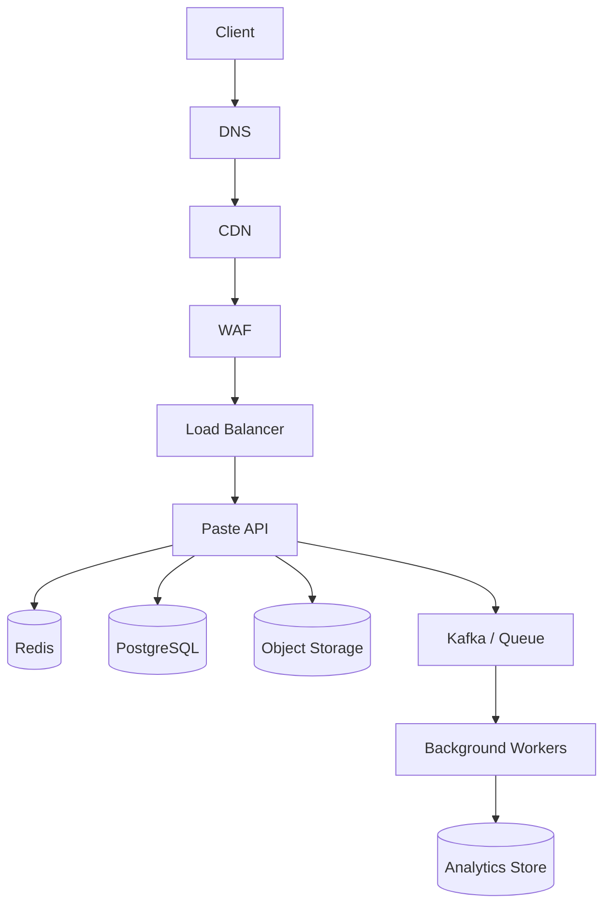
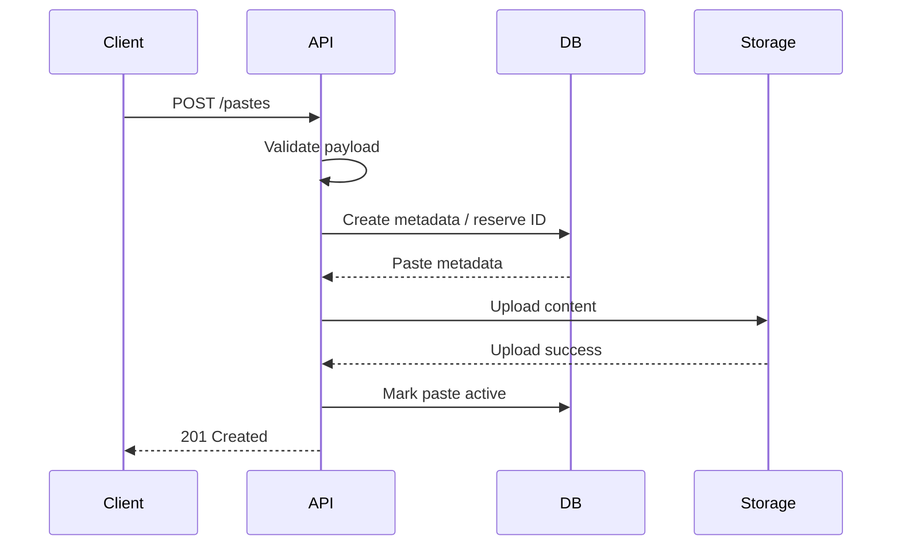
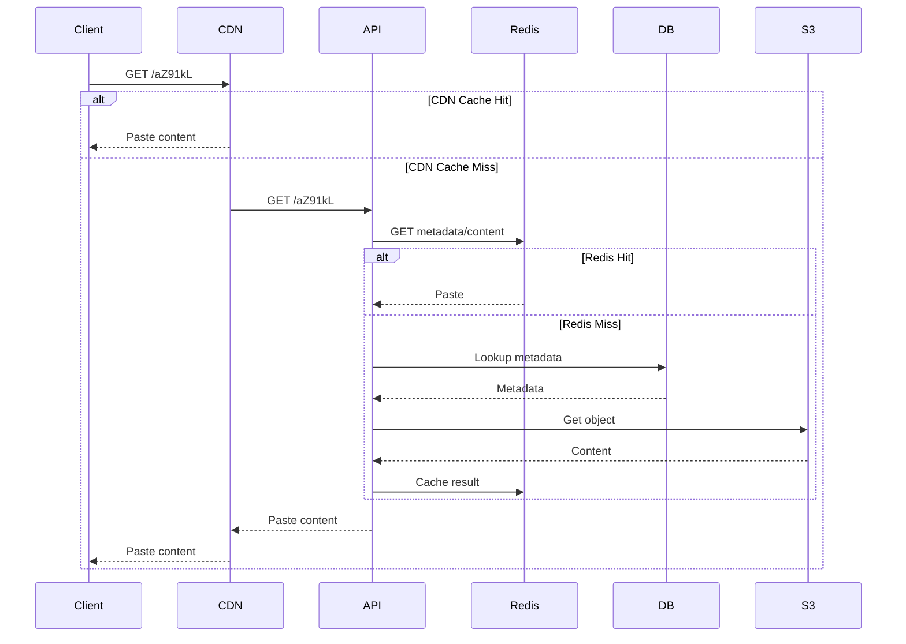
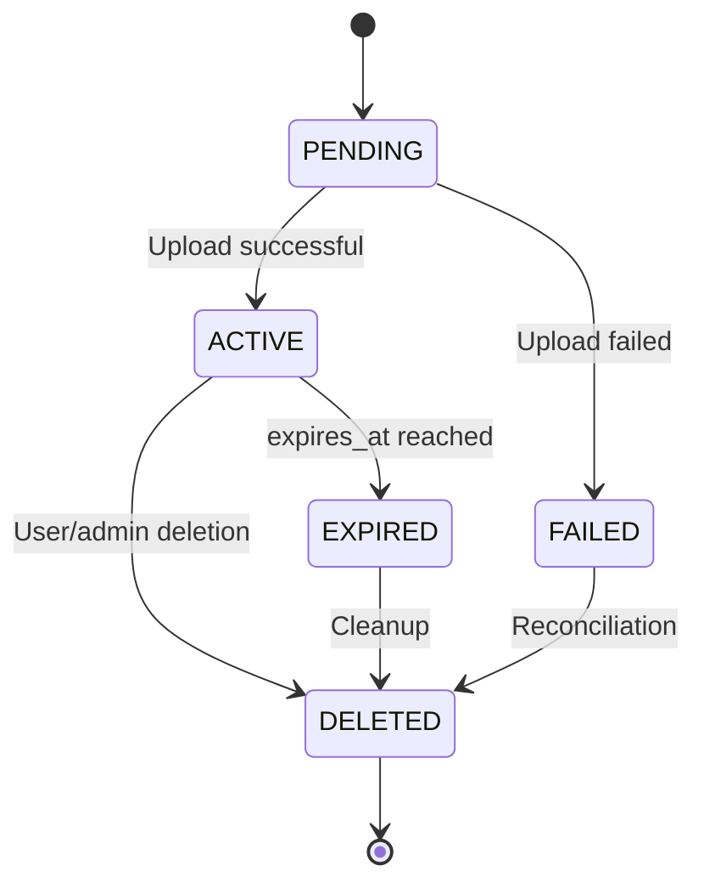
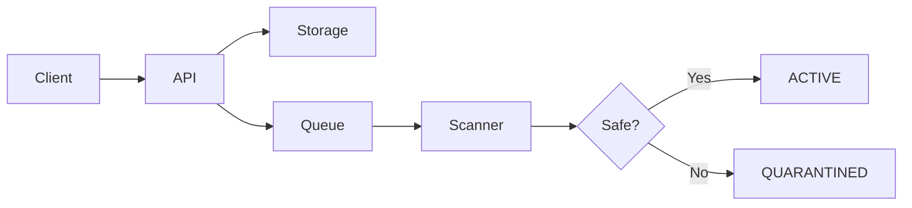
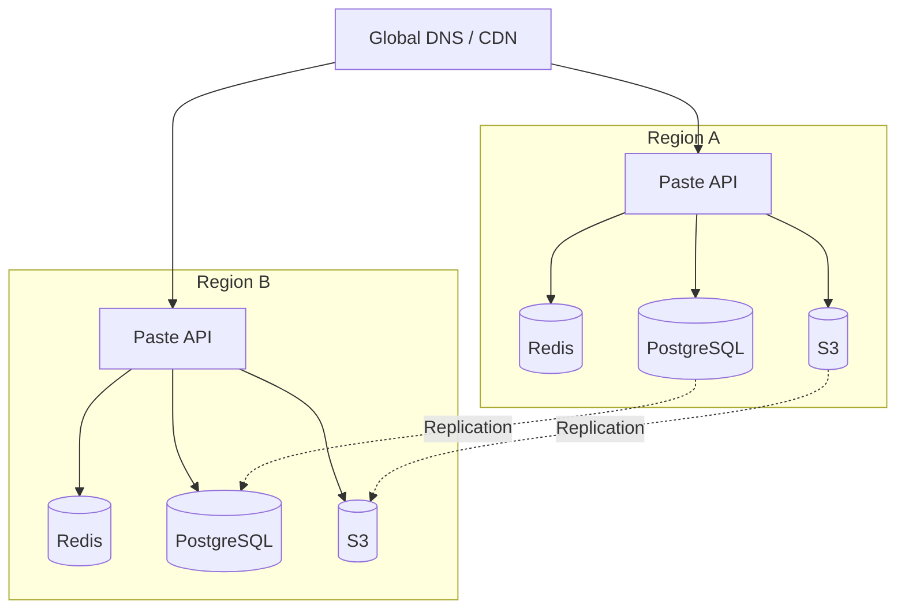
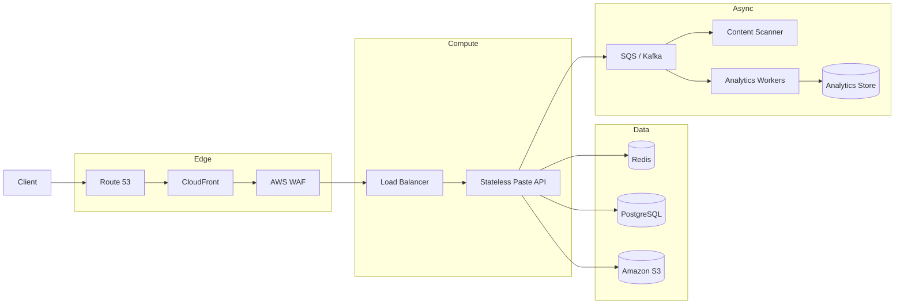

# 02- Pastebin

## Overview

Pastebin is a text-sharing system where users submit arbitrary text and receive a short, shareable URL.

A typical workflow is:

```text
POST /pastes
        |
        v
Store text + metadata
        |
        v
Generate paste ID
        |
        v
Return https://paste.example/Ab3xK9
```

A reader can then access:

```text
GET /Ab3xK9
        |
        v
Retrieve paste
        |
        v
Return content
```

Pastebin is a useful system-design case study because it combines:

- High-volume writes and reads
- Object storage
- Metadata storage
- Short identifier generation
- Expiration and lifecycle management
- Caching
- Large payload handling
- Abuse prevention
- Content security
- Hot objects
- CDN distribution
- Asynchronous processing
- Storage cost optimization
- Observability and operational reliability

The central architectural decision is to separate **paste metadata** from **paste content** when the system becomes large enough that storing every payload directly in a relational database becomes inefficient.

## Problem Definition

The system should allow users to create and retrieve text documents.

A minimal API could expose:

```http
POST /api/v1/pastes
GET  /{paste_id}
DELETE /api/v1/pastes/{paste_id}
```

A creation request might look like:

```http
POST /api/v1/pastes
Content-Type: application/json

{
  "content": "SELECT * FROM users;",
  "expires_in": 86400,
  "visibility": "unlisted"
}
```

Response:

```json
{
  "paste_id": "aZ91kL",
  "url": "https://paste.example/aZ91kL",
  "expires_at": "2026-08-24T15:00:00Z"
}
```

Retrieval:

```http
GET /aZ91kL
```

The service returns the stored content.

## Requirements

### Functional Requirements

A production Pastebin-like system may support:

- Creating pastes.
- Reading pastes.
- Deleting pastes.
- Expiration.
- Public, unlisted, or private visibility.
- Optional syntax highlighting metadata.
- Optional user ownership.
- Optional view counters.
- Optional custom expiration periods.
- Abuse reporting.
- Administrative moderation.

The core system only requires:

```text
Create paste
Retrieve paste
Expire paste
```

### Non-Functional Requirements

| Requirement | Design Implication |
|---|---|
| Low read latency | Cache popular pastes |
| High availability | Multiple application instances |
| Durable storage | Object/database storage |
| Large payload support | Avoid forcing all content through relational DB |
| High read throughput | CDN + object storage |
| Abuse resistance | Size limits, rate limits, malware/content controls |
| Horizontal scalability | Stateless application tier |
| Cost efficiency | Lifecycle policies and tiered storage |
| Reliable expiration | Application enforcement + asynchronous cleanup |

## Scale Assumptions

For an interview, establish assumptions before choosing infrastructure.

Assume:

- 10 million new pastes per month.
- 100 million paste reads per month.
- Average paste size: 20 KB.
- Maximum paste size: 10 MB.
- Read-to-write ratio: approximately 10:1.
- Most pastes expire within days or weeks.
- A small percentage of pastes receive most of the traffic.

Approximate average creation rate:

```text
10,000,000 / 30 days
≈ 333,333 pastes/day
≈ 3.9 pastes/second
```

Approximate average read rate:

```text
100,000,000 / 30 days
≈ 3.9 million reads/day
≈ 46 reads/second
```

Average traffic is not enough for capacity planning. Production systems should account for:

- Peak traffic
- Viral pastes
- Large payloads
- Retry storms
- Regional failures
- Traffic spikes after external events

A single paste receiving millions of requests can matter more than the average system throughput.

## High-Level Architecture

A scalable architecture separates metadata from content.



A typical read path is:

```text
Client
  |
  v
CDN
  |
  +---- Cache Hit ----> Paste Content
  |
  +---- Cache Miss
          |
          v
      Paste Service
          |
          v
       Metadata DB
          |
          v
      Object Storage
```

For smaller systems, object storage can initially be replaced by PostgreSQL.

## Metadata vs Content

This is one of the most important design decisions.

A paste has two categories of data.

### Metadata

Examples:

```text
paste_id
owner_id
object_key
created_at
expires_at
visibility
language
status
content_size
```

Metadata is structured and frequently queried.

### Content

Examples:

```text
print("hello")
SELECT * FROM users;
```

Content can be large and is usually retrieved using the paste ID.

A mature architecture stores:

```text
PostgreSQL
    |
    +--> Paste metadata

Object Storage
    |
    +--> Paste content
```

This avoids using PostgreSQL as a large blob store when object storage is a better fit.

## Data Model

A PostgreSQL metadata table could look like:

```sql
CREATE TABLE pastes (
    id BIGSERIAL PRIMARY KEY,
    paste_id VARCHAR(32) NOT NULL UNIQUE,
    owner_id BIGINT NULL,
    object_key TEXT NOT NULL UNIQUE,
    content_size BIGINT NOT NULL,
    content_type VARCHAR(255) NOT NULL DEFAULT 'text/plain',
    visibility VARCHAR(16) NOT NULL DEFAULT 'unlisted',
    language VARCHAR(64) NULL,
    created_at TIMESTAMPTZ NOT NULL DEFAULT NOW(),
    expires_at TIMESTAMPTZ NULL,
    status VARCHAR(16) NOT NULL DEFAULT 'active'
);

CREATE INDEX idx_pastes_owner_id
    ON pastes(owner_id);

CREATE INDEX idx_pastes_expires_at
    ON pastes(expires_at);

CREATE INDEX idx_pastes_status_expires_at
    ON pastes(status, expires_at);
```

The important lookup is:

```sql
SELECT
    paste_id,
    object_key,
    content_type,
    expires_at,
    status
FROM pastes
WHERE paste_id = $1;
```

The actual content can then be retrieved from object storage.

## Why Object Storage?

Object storage such as Amazon S3 is well suited for immutable text objects.

A paste can be stored as:

```text
s3://paste-content-prod/pastes/aZ/91/aZ91kL
```

The metadata database stores:

```text
paste_id = aZ91kL
object_key = pastes/aZ/91/aZ91kL
```

Advantages include:

- High durability
- Large storage capacity
- Independent scaling
- Lifecycle policies
- Low storage cost
- CDN integration
- No need to manage database blob capacity

The application does not need to store the entire paste content in PostgreSQL.

## Object Key Design

Avoid putting millions of objects into one conceptual directory structure if operational tooling or listing behavior becomes inefficient.

A deterministic prefix can distribute keys:

```text
pastes/aZ/91/aZ91kL
```

or:

```text
pastes/2026/08/23/aZ91kL
```

The exact key structure should be based on the object storage system, access pattern, lifecycle requirements, and operational tooling.

The application should treat the object key as an opaque identifier rather than constructing business logic around its physical path.

## Paste Creation Flow



The ordering matters.

You should avoid exposing a paste as active before its content is successfully stored.

A robust lifecycle can use states:

```text
PENDING
   |
   v
ACTIVE
   |
   v
EXPIRED
   |
   v
DELETED
```

If object storage upload fails:

```text
PENDING
   |
   v
FAILED
```

The background cleanup process can remove abandoned pending records.

## Atomicity Across Database and Object Storage

PostgreSQL and S3 do not participate in one distributed ACID transaction.

Therefore, this cannot be assumed:

```text
DB INSERT + S3 PUT = atomic transaction
```

Instead, design an explicit state machine.

Example:

```text
1. Generate paste ID.
2. Create metadata as PENDING.
3. Upload content.
4. Verify upload.
5. Mark metadata ACTIVE.
```

If step 3 fails:

```text
PENDING -> FAILED
```

If the database update fails after a successful upload, a background reconciliation process can identify orphaned objects.

This is a common distributed-systems pattern:

> When two durable systems cannot share one transaction, model intermediate states explicitly and make reconciliation part of the design.

## Alternative Creation Flow

For very large payloads, avoid sending the entire content through the application server.

Instead:

```text
Client
  |
  | 1. Request upload URL
  v
Paste API
  |
  | 2. Generate pre-signed URL
  v
Client
  |
  | 3. Upload directly
  v
S3
  |
  | 4. Confirm upload
  v
Paste API
```

This reduces:

- Application CPU
- Application bandwidth
- Memory usage
- Load balancer traffic
- Number of large payloads passing through backend instances

## Pre-Signed Upload

A backend can issue a short-lived pre-signed S3 URL.

Conceptually:

```text
POST /api/v1/pastes/upload

        |
        v

{
  "paste_id": "aZ91kL",
  "upload_url": "https://..."
}
```

The client then uploads directly to object storage.

The upload URL should:

- Expire quickly.
- Restrict the destination object.
- Restrict content size where supported.
- Restrict expected content type where appropriate.
- Never expose broad bucket permissions.

## Retrieval Flow

A typical retrieval request is:



For very popular immutable pastes, CDN caching can remove most origin traffic.

## HTTP Response Design

A paste can be returned as:

```http
HTTP/1.1 200 OK
Content-Type: text/plain; charset=utf-8
Cache-Control: public, max-age=3600
ETag: "abc123"
```

For HTML rendering:

```http
Content-Type: text/html; charset=utf-8
```

The application must distinguish between:

```text
Raw text
```

and:

```text
HTML
```

Never directly inject user-provided paste content into HTML without proper escaping.

## XSS and Content Security

Pastebin content is attacker-controlled input.

If the application renders:

```html
<pre>
<script>alert("xss")</script>
</pre>
```

without escaping, it can become an XSS vulnerability.

For raw text:

```http
Content-Type: text/plain
```

is generally safer.

If HTML rendering is required:

- HTML-escape user content.
- Use a strict Content Security Policy.
- Avoid unsafe inline scripts.
- Sanitize where necessary.
- Set appropriate security headers.
- Separate user content from application origin where appropriate.

A strong isolation strategy is:

```text
paste.example.com
```

for user-generated content, while the management application runs on:

```text
app.example.com
```

This can reduce the blast radius of content-related browser attacks.

## Content-Type Security

Do not blindly trust:

```text
Content-Type: text/html
```

provided by a client.

The server should control how stored content is served.

For raw paste content:

```http
Content-Type: text/plain; charset=utf-8
X-Content-Type-Options: nosniff
```

This reduces the risk of browsers interpreting content as executable resources.

## Paste Size Limits

Without size limits, attackers can submit extremely large payloads.

For example:

```text
POST /pastes
Content-Length: 10 GB
```

can exhaust:

- Memory
- Disk
- Network bandwidth
- Database capacity
- Object storage
- Worker resources

Define limits at multiple layers:

```text
CDN / WAF
    |
Load Balancer
    |
Application
    |
Object Storage
```

For example:

| Tier | Example Limit |
|---|---:|
| Anonymous user | 1 MB |
| Authenticated user | 10 MB |
| Enterprise | 100 MB |
| Maximum request duration | Bounded |
| Upload URL lifetime | 5–15 minutes |

These values are examples and should be based on product requirements.

## Streaming Uploads

Never load an arbitrarily large paste into Python memory.

Avoid:

```python
content = await request.body()
```

for large or unbounded payloads.

Prefer streaming or direct object-storage uploads.

A streaming design processes chunks:

```text
Request
  |
  v
Chunk 1
  |
Chunk 2
  |
Chunk 3
  |
  v
Object Storage
```

This keeps memory usage bounded.

## Short ID Generation

Paste IDs should be compact and unique.

Base62 is a common choice.

```python
ALPHABET = (
    "0123456789"
    "abcdefghijklmnopqrstuvwxyz"
    "ABCDEFGHIJKLMNOPQRSTUVWXYZ"
)


def encode_base62(value: int) -> str:
    if value < 0:
        raise ValueError("value must be non-negative")

    if value == 0:
        return ALPHABET[0]

    encoded = []

    while value:
        value, remainder = divmod(value, 62)
        encoded.append(ALPHABET[remainder])

    return "".join(reversed(encoded))
```

For example:

```text
Database ID
    |
    v
125789
    |
    v
Base62
    |
    v
w7T
```

However, sequential identifiers may be enumerable.

If unlisted pastes must be difficult to guess, use sufficiently random identifiers or a distributed ID followed by an encoding strategy that does not expose predictable sequential values.

## Identifier Security

A paste ID should not be considered an authorization mechanism.

This is unsafe:

```text
/aZ91kL -> private paste
```

with the assumption that the URL is impossible to guess.

If privacy matters, enforce access control.

Possible models include:

| Visibility | Access |
|---|---|
| Public | Anyone can read |
| Unlisted | Anyone with identifier can read |
| Private | Authenticated and authorized users |
| Organization | Authorized organization members |

For private pastes, the read path must validate authorization before retrieving the content.

## Caching

Pastebin is naturally cacheable when content is immutable.

A cache key can be:

```text
paste:aZ91kL
```

and the value:

```text
paste content
```

or metadata:

```json
{
  "object_key": "pastes/aZ/91/aZ91kL",
  "expires_at": "2026-08-24T15:00:00Z",
  "visibility": "public"
}
```

### Cache-Aside

```text
Request
  |
  v
Redis
  |
  +---- Hit ----> Response
  |
  +---- Miss
          |
          v
       Database
          |
          v
     Object Storage
          |
          v
       Redis
          |
          v
       Response
```

Because paste content is often immutable, caching is easier than for frequently changing resources.

## CDN Caching

Public immutable pastes are excellent CDN candidates.

A response can include:

```http
Cache-Control: public, max-age=86400, immutable
```

if the product guarantees that the object at that URL never changes.

If the same paste ID can be edited, do not use `immutable`.

Instead, use controlled TTLs and explicit invalidation.

The immutability decision has architectural consequences.

## Hot Pastes

A paste referenced by a viral post may receive:

```text
1,000,000 requests/minute
```

A single origin instance should not process every request.

The preferred hierarchy is:

```text
Browser Cache
      |
      v
CDN
      |
      v
Redis
      |
      v
Application
      |
      v
Object Storage
```

Each layer absorbs traffic before it reaches the next.

## Cache Stampede

If a highly popular paste expires from Redis simultaneously:

```text
10,000 requests
       |
       v
Redis MISS
       |
       +--> S3
       +--> S3
       +--> S3
       +--> ...
```

This can create unnecessary load.

Mitigations include:

- Long TTLs for immutable content.
- CDN caching.
- Request coalescing.
- Distributed locks.
- Stale-while-revalidate.
- Background refresh.
- Randomized TTLs.

For immutable content, long cache lifetimes are generally simpler.

## Expiration

Expiration is a core Pastebin requirement.

A paste may have:

```text
expires_at
```

Examples:

```text
10 minutes
1 hour
1 day
1 week
Never
```

The read path must enforce expiration.

Do not depend solely on a scheduled cleanup job.

Correctness should be:

```text
Current time >= expires_at
        |
        v
Treat paste as expired
```

Storage cleanup can happen later.

## Expiration Lifecycle



This explicit state model makes failures easier to reason about.

## Background Cleanup

A scheduled worker can remove expired metadata and objects.

A Celery task might look like:

```python
from celery import shared_task
from django.utils import timezone

from .models import Paste


@shared_task
def process_expired_pastes(batch_size: int = 1000) -> int:
    now = timezone.now()

    paste_ids = list(
        Paste.objects
        .filter(
            status="active",
            expires_at__isnull=False,
            expires_at__lte=now,
        )
        .values_list("id", flat=True)[:batch_size]
    )

    if not paste_ids:
        return 0

    Paste.objects.filter(id__in=paste_ids).update(
        status="expired"
    )

    return len(paste_ids)
```

Object deletion can then happen asynchronously.

For millions of expired objects, object storage lifecycle policies are often preferable to issuing individual delete operations from application workers.

## Object Storage Lifecycle Policies

Amazon S3 lifecycle policies can automatically transition or expire objects.

A conceptual policy might be:

```text
ACTIVE
  |
  | 7 days
  v
STANDARD
  |
  | 30 days
  v
INFREQUENT ACCESS
  |
  | 90 days
  v
DELETE
```

For Pastebin, if most content expires quickly, automatic deletion can substantially reduce storage costs.

The lifecycle policy should align with the application's retention guarantees.

## Read-After-Write Consistency

Suppose:

```text
POST /pastes
```

returns:

```text
aZ91kL
```

The client immediately calls:

```text
GET /aZ91kL
```

If metadata and content are stored in different systems, the application must ensure the paste is not exposed until the required content is available.

Using:

```text
PENDING -> ACTIVE
```

provides a clear consistency boundary.

## Database Scaling

Initially:

```text
Application
    |
    v
PostgreSQL
    |
    v
Object Storage
```

is sufficient.

As metadata grows, scale using:

- Better indexes
- Connection pooling
- Read replicas
- Partitioning
- Archival
- Database vertical scaling

Do not introduce sharding before identifying an actual database bottleneck.

## Read Replicas

Paste metadata is generally read-heavy.

A primary plus replicas can provide:

```text
                 +--> Replica 1
                 |
Application ---> +--> Replica 2
                 |
                 +--> Primary
```

However, replica lag matters.

If a paste is created and immediately read from a replica, the metadata might not yet exist there.

Solutions include:

- Read-after-write routing.
- Reading newly created records from the primary.
- Caching metadata immediately.
- Accepting eventual consistency if the product allows it.

## Analytics

Paste views can generate substantial event volume.

Do not synchronously update:

```text
view_count
```

with a database write on every request.

A hot paste could generate millions of writes to one row.

Instead:

```text
GET /aZ91kL
    |
    +--> Return paste
    |
    +--> Publish view event
              |
              v
            Kafka
              |
              v
          Aggregators
              |
              v
       Analytics Storage
```

Aggregations can be periodically persisted.

## Event Schema

A view event might contain:

```json
{
  "event_id": "01JXYZ...",
  "paste_id": "aZ91kL",
  "timestamp": "2026-08-23T15:30:00Z",
  "country": "IN",
  "user_agent": "...",
  "referrer": "https://example.com"
}
```

Avoid collecting unnecessary personal information.

Analytics systems should define:

- Retention
- Access control
- Aggregation
- Deletion
- Privacy requirements

## Exactly-Once vs At-Least-Once

A Kafka consumer may process an event more than once.

Therefore, analytics processing should be idempotent.

For example:

```text
event_id
```

can be used as a deduplication key.

Do not rely on exactly-once messaging semantics to automatically guarantee exactly-once business results.

The business operation itself should be designed to tolerate duplicate processing.

## Abuse Prevention

Pastebin-like services are attractive to attackers because they allow arbitrary content distribution.

Potential abuse includes:

- Malware distribution
- Phishing
- Spam
- Credential leaks
- Obfuscated scripts
- Illegal content
- Automated storage abuse
- Denial-of-service payloads

Controls can include:

- Authentication
- Anonymous rate limits
- Per-user quotas
- Maximum paste size
- Content moderation
- Abuse reporting
- Automated scanning
- Domain/IP reputation checks where relevant
- Administrative deletion
- Audit logging

Do not make expensive scanning part of every synchronous request unless required.

Use asynchronous processing when possible:

```text
Upload
  |
  v
PENDING
  |
  v
Queue
  |
  v
Scanner
  |
  +---- Clean ----> ACTIVE
  |
  +---- Suspicious -> QUARANTINED
```

## Content Moderation Pipeline

A mature system can use:



The API should not expose content as publicly accessible before security processing if the product requires scanning.

## Rate Limiting

Creation requests should be rate limited.

Possible dimensions include:

```text
IP address
User ID
API key
Organization
Network
```

Redis is commonly used for distributed counters or token buckets.

Example:

```text
paste:create:user:123
```

Rate limits should distinguish between:

```text
Create operations
Read operations
Admin operations
Upload operations
```

A single global limit is usually too crude.

## Quotas

Rate limiting controls request frequency.

Quotas control total resource consumption.

For example:

```text
Anonymous:
    10 pastes/hour
    1 MB/paste

Free user:
    1,000 pastes/day
    10 MB/paste

Enterprise:
    Custom limits
```

Quotas should account for storage consumption, not only request count.

## Authentication and Authorization

Management operations should be authenticated.

For example:

```http
POST /api/v1/pastes
Authorization: Bearer <token>
```

Ownership checks should happen server-side.

Do not trust:

```json
{
  "owner_id": 123
}
```

from the client.

The authenticated identity should determine ownership.

## Security Headers

For rendered paste pages, consider:

```http
Content-Security-Policy: default-src 'none'; style-src 'self'
X-Content-Type-Options: nosniff
Referrer-Policy: strict-origin-when-cross-origin
Permissions-Policy: geolocation=()
```

The exact CSP depends on the application's frontend architecture.

For raw text responses, a strict content type and `nosniff` are particularly important.

## Encryption

Sensitive content should be encrypted:

```text
Client
  |
 TLS
  |
Application
  |
 TLS
  |
S3 / PostgreSQL
```

At rest:

- Use managed encryption for object storage.
- Use database encryption capabilities.
- Protect encryption keys with a managed KMS.
- Restrict key permissions.

Encryption does not replace authorization.

## High Availability

The application tier should run multiple instances:

```text
                 Load Balancer
                /      |      \
               v       v       v
             API-1   API-2   API-3
```

Object storage should use its managed durability and availability capabilities.

PostgreSQL should use:

- Multi-AZ deployment where available.
- Automated backups.
- Failover.
- Replica monitoring.
- Tested restore procedures.

Redis should be deployed with appropriate replication/failover if it is on the critical path.

The system should still tolerate Redis failure if the database/object-storage path can handle the resulting load.

## Failure Scenarios

| Failure | Expected Behavior |
|---|---|
| Redis unavailable | Retrieve from origin |
| CDN unavailable | Requests reach application |
| Object storage temporarily unavailable | Return controlled error or retry with bounded timeout |
| Read replica unavailable | Route to another replica |
| Analytics unavailable | Paste retrieval still succeeds |
| Scanner unavailable | New paste remains pending if scanning is mandatory |
| Application instance fails | Load balancer routes to healthy instance |
| Database primary fails | Managed failover |
| Cleanup worker fails | Expired content remains inaccessible based on expiration logic |

The system should distinguish between:

```text
Serving correctness
```

and:

```text
Background cleanup
```

An expired paste must not become readable merely because the cleanup worker is down.

## Timeouts and Retries

Every remote dependency should have bounded timeouts.

For example:

```text
Redis timeout: 20 ms
Database timeout: 100 ms
S3 timeout: 500 ms
```

These are illustrative values.

Retries should be limited and use exponential backoff with jitter.

Avoid:

```text
retry forever
```

because a dependency outage can turn into a retry storm.

## Connection Pooling

Suppose:

```text
20 API instances
× 50 PostgreSQL connections
= 1,000 connections
```

If PostgreSQL can safely handle only a fraction of this, the application fleet can overload the database.

Use:

- Bounded connection pools.
- PgBouncer where appropriate.
- Connection limits.
- Database-side monitoring.

Connection capacity must be planned across the entire deployment, not per application instance in isolation.

## Stateless Application Architecture

Paste API instances should not store authoritative state locally.

Instead:

```text
API-1 \
API-2  +--> PostgreSQL
API-3 /       +
              |
              +--> S3
              |
              +--> Redis
```

This enables:

- Horizontal scaling
- Autoscaling
- Rolling deployments
- Kubernetes rescheduling
- Failure recovery

Local memory caching can still be used as an optimization if invalidation and memory limits are well understood.

## Kubernetes Deployment Considerations

A Kubernetes deployment might use:

```text
Deployment
    |
    +--> Multiple API Pods
            |
            v
        Service
            |
            v
        Ingress / Load Balancer
```

Important settings include:

- Resource requests.
- Resource limits.
- Readiness probes.
- Liveness probes.
- Pod disruption budgets.
- Horizontal Pod Autoscaler.
- Graceful termination.
- Rolling update configuration.

The application should stop accepting new traffic before termination and allow in-flight requests to complete where practical.

## Observability

Production Pastebin systems require visibility into both the API and storage layers.

### Application Metrics

Track:

```text
paste_create_total
paste_create_errors_total
paste_read_total
paste_read_errors_total
paste_read_latency_seconds
paste_upload_size_bytes
```

Track:

```text
p50
p95
p99
```

rather than relying only on average latency.

### Cache Metrics

Track:

```text
cache_hit_ratio
cache_miss_ratio
cache_evictions
cache_memory_usage
cache_latency
```

### Object Storage Metrics

Track:

- Request count
- Error rate
- Object count
- Storage consumption
- Download volume
- Lifecycle deletion
- Upload failures

### Queue Metrics

For asynchronous processing:

```text
queue_depth
consumer_lag
processing_latency
retry_count
dead_letter_count
```

### Database Metrics

Monitor:

- CPU
- Memory
- Connections
- Query latency
- Locks
- Storage
- Replication lag
- WAL generation
- Index usage

## Distributed Tracing

A retrieval trace could look like:

```text
GET /aZ91kL
    |
    +--> CDN
    |
    +--> API
          |
          +--> Redis
          |
          +--> PostgreSQL
          |
          +--> S3
```

OpenTelemetry can propagate trace context across services.

This allows engineers to determine whether a slow request is caused by:

```text
Application
Cache
Database
Object storage
Network
```

## Structured Logging

Use structured logs instead of free-form strings.

Example:

```json
{
  "timestamp": "2026-08-23T15:30:00Z",
  "level": "INFO",
  "service": "paste-api",
  "request_id": "req-123",
  "paste_id": "aZ91kL",
  "status_code": 200,
  "latency_ms": 12,
  "cache_hit": true
}
```

Do not log complete paste content by default.

Paste contents may contain:

- Passwords
- API keys
- Tokens
- Personal information
- Source code
- Internal configuration

Logging content can create a significant security incident even if the original paste storage is secure.

## SLOs

Example service objectives:

| Metric | Example Target |
|---|---:|
| Paste read availability | 99.99% |
| Paste read p95 latency | < 100 ms |
| Paste creation availability | 99.9% |
| Paste creation p95 latency | < 300 ms |
| Upload success rate | > 99.9% |
| Moderation processing latency | < 60 seconds |

These targets are illustrative.

The important engineering principle is to define SLOs based on user impact and then monitor them continuously.

## Disaster Recovery

The authoritative metadata and content require appropriate backup and recovery strategies.

### Metadata

PostgreSQL should have:

- Automated backups.
- Point-in-time recovery.
- Replication.
- Multi-AZ deployment.
- Restore testing.

### Content

Object storage should have:

- Versioning if required.
- Cross-region replication if justified.
- Lifecycle policies.
- Appropriate retention.
- Access logging where required.

### Example Recovery Objectives

```text
RPO: 15 minutes
RTO: 1 hour
```

The correct values depend on business requirements.

A backup that has never been restored is not a validated disaster-recovery strategy.

## Cost Considerations

At scale, content storage can dominate costs.

Important cost drivers include:

- Object storage
- CDN bandwidth
- API compute
- Database storage
- Redis
- Queue infrastructure
- Analytics storage
- Observability
- Cross-region replication

Expiration policies are particularly valuable.

If:

```text
10 million pastes/month
```

are created but:

```text
80% expire within 7 days
```

there is little reason to retain them indefinitely.

Object-storage lifecycle policies can automatically clean up content.

## Storage Strategy Comparison

| Strategy | Advantages | Limitations | Best Fit |
|---|---|---|---|
| PostgreSQL only | Simple | Blob/storage pressure | Small system |
| PostgreSQL + S3 | Scalable and durable | Two-system consistency | Production |
| S3 only | Simple content storage | Metadata queries become harder | Very simple systems |
| S3 + NoSQL | Highly scalable | More operational complexity | Very large scale |
| CDN + S3 | Extremely efficient reads | Cache invalidation concerns | Public immutable pastes |

For most production designs:

```text
PostgreSQL + S3 + Redis/CDN
```

is a strong default.

## Technology Choices

A Python-oriented implementation could use:

| Component | Technology |
|---|---|
| API | FastAPI |
| Alternative API | Django REST Framework |
| Metadata | PostgreSQL |
| Content | Amazon S3 |
| Cache | Redis |
| Async messaging | Kafka / SQS |
| Background tasks | Celery |
| Reverse proxy | Nginx |
| CDN | CloudFront |
| WAF | AWS WAF |
| Containers | Docker |
| Orchestration | Kubernetes / ECS |
| Metrics | Prometheus / CloudWatch |
| Tracing | OpenTelemetry |
| CI/CD | GitHub Actions |

Do not introduce every component immediately.

A smaller implementation can start with:

```text
FastAPI
   |
PostgreSQL
   |
S3
```

Redis can be introduced when database/object-storage latency or traffic justifies caching.

Kafka can be introduced when analytics or asynchronous processing requires durable high-throughput event streaming.

## FastAPI Creation Example

A simplified production-oriented endpoint could look like:

```python
from datetime import datetime, timezone
from uuid import uuid4

from fastapi import FastAPI, HTTPException, status
from pydantic import BaseModel, Field, HttpUrl


app = FastAPI()


class PasteCreateRequest(BaseModel):
    content: str = Field(min_length=1, max_length=1_000_000)
    expires_at: datetime | None = None


class PasteCreateResponse(BaseModel):
    paste_id: str
    url: str
    expires_at: datetime | None


@app.post(
    "/api/v1/pastes",
    response_model=PasteCreateResponse,
    status_code=status.HTTP_201_CREATED,
)
async def create_paste(
    payload: PasteCreateRequest,
) -> PasteCreateResponse:
    if payload.expires_at is not None:
        if payload.expires_at <= datetime.now(timezone.utc):
            raise HTTPException(
                status_code=400,
                detail="expires_at must be in the future",
            )

    paste_id = uuid4().hex[:12]

    # A real implementation would:
    # 1. Create PENDING metadata.
    # 2. Store content in object storage.
    # 3. Mark the record ACTIVE.
    # 4. Publish an asynchronous event.

    return PasteCreateResponse(
        paste_id=paste_id,
        url=f"https://paste.example/{paste_id}",
        expires_at=payload.expires_at,
    )
```

The example intentionally separates API validation from the storage workflow.

A production implementation should use a collision-safe identifier strategy and transactional state transitions.

## FastAPI Retrieval Example

```python
from fastapi import HTTPException
from fastapi.responses import PlainTextResponse


@app.get("/{paste_id}", response_class=PlainTextResponse)
async def get_paste(paste_id: str) -> PlainTextResponse:
    metadata = await get_paste_metadata(paste_id)

    if metadata is None:
        raise HTTPException(
            status_code=404,
            detail="Paste not found",
        )

    if metadata.status != "active":
        raise HTTPException(
            status_code=404,
            detail="Paste not found",
        )

    if (
        metadata.expires_at is not None
        and metadata.expires_at <= datetime.now(timezone.utc)
    ):
        raise HTTPException(
            status_code=404,
            detail="Paste expired",
        )

    content = await get_paste_content(metadata.object_key)

    return PlainTextResponse(
        content=content,
        headers={
            "X-Content-Type-Options": "nosniff",
            "Cache-Control": "public, max-age=3600",
        },
    )
```

A real implementation should add:

- Authorization.
- Redis caching.
- Database pooling.
- Object-storage timeouts.
- Metrics.
- Tracing.
- Structured logging.
- Abuse controls.
- Conditional requests.
- Proper cache behavior for private content.

## Conditional Requests

For immutable paste content, HTTP validators can reduce bandwidth.

Example:

```http
ETag: "9d377d..."
```

The client may send:

```http
If-None-Match: "9d377d..."
```

If unchanged:

```http
HTTP/1.1 304 Not Modified
```

This avoids transferring the entire paste again.

Conditional requests are especially useful for large content.

## Compression

Text compresses well.

For sufficiently large pastes, HTTP compression such as gzip or Brotli can reduce bandwidth.

However:

- Very small payloads may not benefit.
- Compression consumes CPU.
- CDN compression may already exist.
- Sensitive data requires careful consideration of compression-related side channels in contexts where attacker-controlled and secret data are mixed.

For ordinary public text content, CDN-managed compression is often a practical choice.

## Pagination and Listing

A user dashboard may expose:

```http
GET /api/v1/users/me/pastes
```

Do not use offset pagination indefinitely on large tables:

```sql
LIMIT 100 OFFSET 10000000;
```

Deep offsets can become expensive.

Prefer cursor-based pagination:

```text
GET /api/v1/users/me/pastes?cursor=eyJpZCI6...
```

using a stable indexed ordering such as:

```text
created_at DESC, id DESC
```

This is particularly important when a user owns a large number of pastes.

## Deletion Semantics

Deletion may involve multiple systems:

```text
PostgreSQL
S3
Redis
CDN
Analytics
```

A request cannot atomically delete from all of them.

A robust approach is:

```text
1. Mark metadata DELETED.
2. Prevent new reads.
3. Invalidate cache where required.
4. Queue object deletion.
5. Delete object asynchronously.
6. Apply CDN invalidation if necessary.
```

This provides immediate logical deletion while allowing physical cleanup to happen asynchronously.

## Cache Invalidation on Deletion

Suppose:

```text
Redis:
paste:aZ91kL -> content
```

and the user deletes the paste.

If Redis is not invalidated, the content may remain available until TTL expiration.

For deleted content:

```text
DELETE
  |
  +--> Mark DB record deleted
  |
  +--> Delete/invalidate Redis
  |
  +--> Invalidate CDN if necessary
  |
  +--> Queue S3 deletion
```

Security-sensitive deletion requirements should determine whether cache and CDN invalidation must be synchronous.

## Multi-Region Architecture

At global scale:



Multi-region deployment is not automatically better.

It introduces:

- Replication complexity
- Higher infrastructure cost
- More difficult failover
- Data residency concerns
- Cache consistency challenges
- Operational complexity

For immutable paste content, multi-region object replication is easier than multi-region mutable data.

## Disaster Scenario: Region Failure

If Region A fails:

```text
Global DNS / CDN
       |
       v
Region B
```

The system needs:

- Healthy application capacity in Region B.
- Available metadata.
- Available paste content.
- Correct routing.
- Appropriate cache warming.
- Tested failover procedures.

If only the application tier is replicated but metadata or content is not, the architecture is not actually multi-region.

## Common Mistakes

### Storing All Paste Content in PostgreSQL

This is simple initially but can create:

- Large database growth
- Backup growth
- Increased I/O
- Larger replication traffic
- Expensive database scaling

For a small system it is acceptable. At larger scale, object storage is generally more appropriate.

### Loading Large Uploads Into Application Memory

A request containing a 100 MB paste should not force a Python process to allocate 100 MB for every concurrent request.

Use streaming or direct object-storage uploads.

### Treating Paste IDs as Authorization

An unguessable ID does not replace authorization.

Private pastes require explicit access control.

### Rendering User Content as HTML

This can create XSS vulnerabilities.

Serve raw content as text or properly sanitize and escape rendered content.

### Relying Only on Cleanup Jobs for Expiration

If the cleanup worker is down, expired content must still be inaccessible.

Enforce expiration during reads.

### Updating a View Counter Synchronously

A hot paste can create a write hotspot.

Publish view events asynchronously and aggregate them.

### Ignoring Object/Metadata Consistency

PostgreSQL and S3 do not share one transaction.

Use explicit states and reconciliation.

### Deleting Only the Database Row

The object may remain in S3 and the cached content may remain in Redis/CDN.

Deletion must account for all storage and caching layers.

### Unlimited Paste Size

This enables resource exhaustion.

Enforce limits at the edge and application layers.

### Logging Paste Content

This can expose secrets and personal data.

Log metadata and identifiers instead of raw content.

## Production Pitfalls

### Orphaned Objects

A successful S3 upload followed by a database failure can produce:

```text
S3 object exists
Database record does not exist
```

Periodic reconciliation should detect and clean orphaned objects.

### Orphaned Metadata

The reverse can also happen:

```text
Database record exists
S3 object missing
```

The API should detect this condition and return a controlled error rather than exposing an internal storage failure.

### Cache Poisoning

Only trusted application paths should populate caches.

Validate identifiers and metadata before caching.

### Retry Storms

When S3 or PostgreSQL becomes slow, aggressive retries can multiply traffic.

Use:

```text
Timeout
+
Bounded retries
+
Exponential backoff
+
Jitter
```

### Database Connection Exhaustion

Horizontal scaling increases the number of application instances and therefore potentially increases database connections.

Connection pooling must be globally capacity-planned.

### CDN Stale Content

If paste content is mutable but CDN responses are cached as immutable, users can receive stale content.

The caching policy must match the mutability model.

## Interview Traps

### "Why Use S3 Instead of PostgreSQL?"

The strongest answer is not simply "S3 scales."

Explain that object storage provides:

- Independent storage scaling
- High durability
- Lower blob-storage cost
- Lifecycle policies
- CDN integration
- Reduced database pressure

while PostgreSQL remains responsible for structured metadata and transactional operations.

### "Why Do You Need Redis If You Have S3?"

S3 is durable object storage, not necessarily the lowest-latency serving layer for every request.

Redis can cache:

- Metadata
- Small paste content
- Frequently accessed objects

However, CDN caching may provide more value for public immutable pastes.

### "Can You Guarantee Atomic DB + S3 Writes?"

Not with a normal relational transaction.

Use:

```text
PENDING
ACTIVE
FAILED
```

and reconciliation.

### "How Do You Handle a Paste That Gets 10 Million Views?"

Push it toward the edge:

```text
Browser
  |
CDN
  |
Origin only on cache miss
```

Avoid sending all traffic through the application and database.

### "How Do You Expire a Paste Exactly at 12:00?"

Do not require a scheduled job to execute exactly at 12:00.

At read time:

```text
now >= expires_at
```

means the paste is expired.

The cleanup job is for physical deletion.

### "How Do You Count Views?"

Do not synchronously increment a single database row for every request.

Use asynchronous events and aggregation.

## Evolution Path

A practical architecture should evolve based on actual workload.

```text
Stage 1
FastAPI/Django
    |
PostgreSQL
    |
Paste content in PostgreSQL

        |
        v

Stage 2
Separate metadata from content
    |
PostgreSQL + S3

        |
        v

Stage 3
Add Redis
    |
PostgreSQL + S3 + Redis

        |
        v

Stage 4
Add CDN
    |
CDN + API + Redis + S3

        |
        v

Stage 5
Add asynchronous analytics
    |
Kafka/SQS + Consumers

        |
        v

Stage 6
Add abuse scanning
    |
Queue + Scanner + Moderation

        |
        v

Stage 7
Multi-region if justified
```

This progression avoids premature infrastructure complexity.

## Production Reference Architecture



The critical design principle is to keep the synchronous path small:

```text
Request
  |
  v
Authentication / Validation
  |
  v
Metadata Lookup
  |
  v
Content Retrieval
  |
  v
Response
```

Everything that is not required to serve the paste should be moved outside the critical path when practical.

## Key Takeaways

- **Separate structured paste metadata from large paste content as the system grows; PostgreSQL is well suited for metadata while object storage is better suited for durable blob content.**
- **Treat paste creation, expiration, and deletion as distributed workflows because PostgreSQL, Redis, CDN, and object storage cannot share one atomic transaction.**
- **Public and immutable pastes are excellent candidates for CDN and Redis caching, while hot-paste traffic should be absorbed at the edge instead of reaching the database.**
- **User-generated paste content is untrusted input; enforce size limits, authorization, safe content types, XSS protection, abuse controls, and appropriate encryption and retention policies.**
- **Keep analytics, moderation, cleanup, and other non-critical processing asynchronous so the paste read path remains low-latency and resilient to downstream failures.**