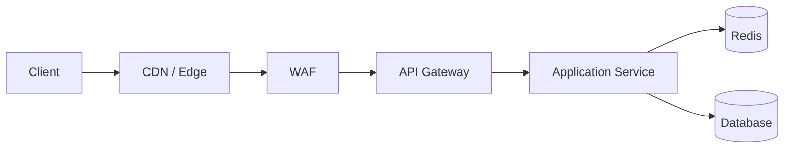
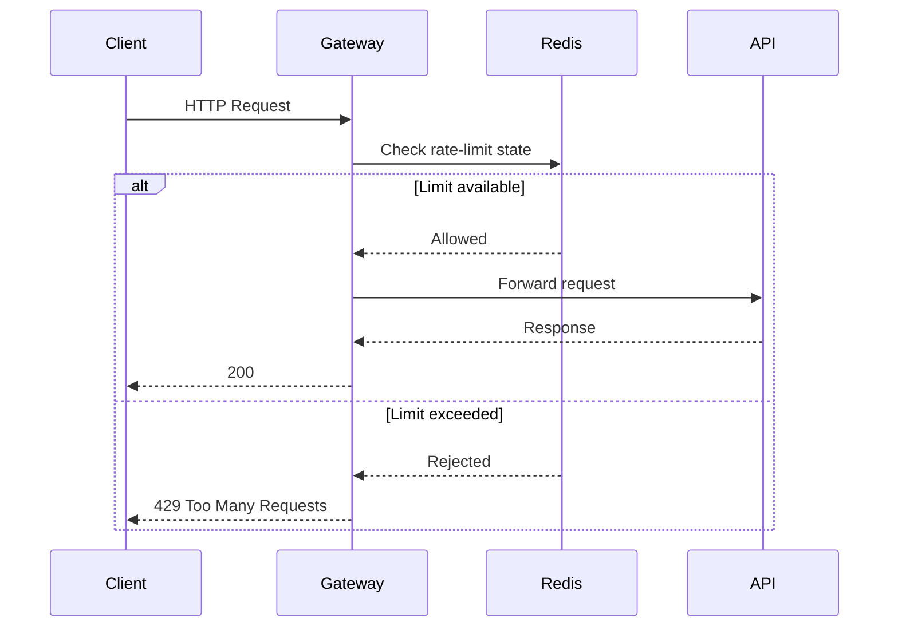
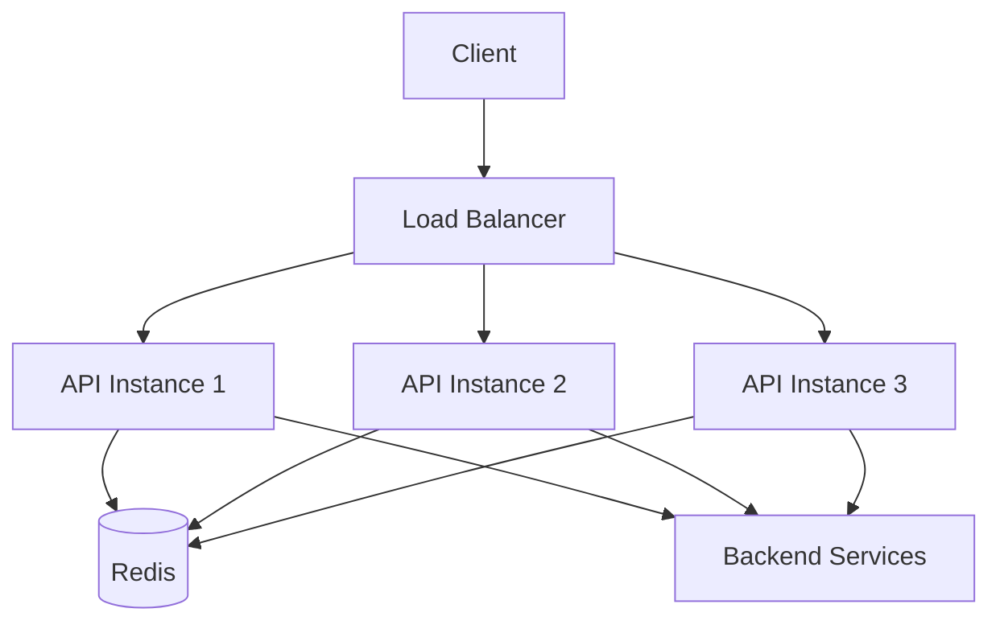
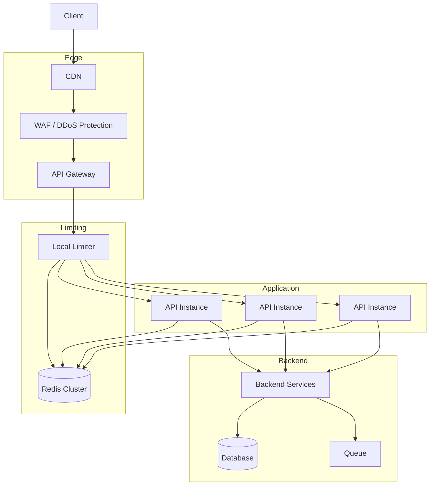

# 03- Rate Limiter

## Overview

A rate limiter controls how frequently a client, user, service, or resource can perform an operation within a defined policy.

In backend systems, rate limiting protects shared resources from:

- Accidental traffic spikes
- Malicious abuse
- Brute-force attacks
- API scraping
- Denial-of-service attempts
- Unbounded client retries
- Noisy neighbors
- Expensive downstream operations
- Resource exhaustion

A typical request path is:

```text
Client
  |
  v
API Gateway / Load Balancer
  |
  v
Rate Limiter
  |
  +---- Allowed ----> Backend Service
  |
  +---- Rejected ---> HTTP 429
```

Rate limiting is not simply an infrastructure feature. It is a capacity-management mechanism. A well-designed limiter translates a service's available capacity into explicit admission-control rules.

For example:

```text
100 requests / minute / user
```

does not mean the system can safely process exactly 100 arbitrary requests per minute. The actual policy must consider:

- Burst behavior
- Request cost
- Endpoint characteristics
- Dependency capacity
- Distributed deployment
- Fairness
- Retry behavior
- Authentication state

## Why Rate Limiting Matters

Without rate limiting, one client can consume a disproportionate amount of shared capacity.

Consider an API with:

```text
100 application instances
10,000 database connections
10,000 requests/second capacity
```

If one client generates:

```text
50,000 requests/second
```

the system may spend most of its capacity processing one consumer.

Rate limiting introduces an admission boundary:

```text
                Incoming Requests
                       |
                       v
                +--------------+
                | Rate Limiter |
                +--------------+
                  |          |
              Allowed      Rejected
                  |          |
                  v          v
              Backend     HTTP 429
```

This protects both the API and its downstream dependencies.

## Requirements

A production rate limiter should generally support:

- Per-user limits
- Per-IP limits
- Per-API-key limits
- Per-endpoint limits
- Service-to-service limits
- Configurable burst capacity
- Distributed enforcement
- Low latency
- High availability
- Atomic counter updates
- Clear rejection responses
- Monitoring
- Dynamic policy configuration
- Graceful degradation

For example:

| Policy | Limit |
|---|---:|
| Anonymous login attempts | 5/minute/IP |
| Authenticated API | 1,000/minute/user |
| Password reset | 3/hour/email |
| Expensive report endpoint | 10/minute/user |
| Internal service | 5,000/second/service |

The values are examples. Production limits should be derived from measured capacity and product requirements.

## Rate Limiting vs Throttling vs Quotas

These concepts are related but not identical.

| Concept | Purpose |
|---|---|
| Rate limiting | Controls request frequency |
| Throttling | Restricts or slows traffic when capacity is constrained |
| Quota | Controls total resource consumption over a larger period |
| Concurrency limit | Controls simultaneous in-flight operations |
| Circuit breaker | Stops calls to an unhealthy dependency |

For example:

```text
Rate limit:
100 requests/minute

Quota:
10,000 requests/day

Concurrency:
20 requests simultaneously

Circuit breaker:
Stop calling dependency after sustained failures
```

A mature system may use all four.

## Where Rate Limiting Belongs

Rate limiting can be implemented at several layers.



Common locations include:

| Layer | Strength | Typical Use |
|---|---|---|
| CDN / Edge | Very scalable | Global traffic protection |
| WAF | Security-focused | IP and attack mitigation |
| API Gateway | Centralized | API policies |
| Reverse proxy | Low latency | Nginx-level controls |
| Application | Business-aware | User/resource-specific limits |
| Redis | Shared state | Distributed application limiting |
| Database | Strong consistency | Usually not preferred for hot-path counters |

A common production architecture uses multiple layers.

For example:

```text
AWS WAF
    |
API Gateway / ALB
    |
Application-level limiter
    |
Redis
```

The edge protects infrastructure while the application limiter enforces business-specific policies.

## Request Lifecycle

A distributed API request may follow this flow:



The limiter should execute before expensive work whenever possible.

Rejecting a request after:

```text
Database query
+
External API call
+
CPU-intensive processing
```

does not provide meaningful protection.

## Rate-Limit Dimensions

A limiter needs a key that identifies the entity being controlled.

Possible keys include:

```text
IP address
User ID
API key
OAuth client ID
Organization ID
Endpoint
HTTP method
Resource ID
Service identity
```

A compound key can provide more precise policies:

```text
rate_limit:{user_id}:{endpoint}
```

For example:

```text
rate_limit:12345:/api/orders
```

This limits a specific user on a specific endpoint.

A hierarchical policy may use:

```text
IP limit
    +
User limit
    +
Endpoint limit
    +
Organization limit
```

The request is allowed only if all applicable policies permit it.

## Why Multiple Limits Are Useful

Suppose:

```text
Per-user:
1,000 requests/minute

Per-IP:
10,000 requests/minute
```

An attacker can create many accounts from one IP.

The IP-level limit still provides protection.

Conversely, many legitimate users may share one NAT gateway.

Therefore, relying only on IP addresses can incorrectly throttle legitimate users.

A robust system usually combines:

```text
Network identity
+
Authenticated identity
+
Resource identity
```

## Fixed Window

The fixed-window algorithm divides time into fixed intervals.

Example:

```text
10 requests / minute
```

The counter resets at:

```text
12:00
12:01
12:02
```

Conceptually:

```text
12:00:00 ---------------- 12:00:59
          10 requests

12:01:00 ---------------- 12:01:59
          10 requests
```

Implementation:

```text
key = rate_limit:user:123
window = current_minute

INCR key
EXPIRE key 60
```

### Advantages

- Very simple
- Low storage overhead
- Easy to understand
- Easy to implement in Redis

### Limitations

The main problem is the boundary burst.

A client can send:

```text
10 requests at 12:00:59
10 requests at 12:01:00
```

Result:

```text
20 requests in 2 seconds
```

even though the configured limit is:

```text
10 requests/minute
```

### When to Use

Fixed windows are appropriate when:

- Approximate enforcement is acceptable.
- The endpoint is not highly sensitive to bursts.
- Simplicity matters.
- The policy is coarse.

They are often sufficient for basic API protection.

## Sliding Window Log

The sliding-window log stores timestamps of recent requests.

For:

```text
10 requests / 60 seconds
```

the limiter examines timestamps in the previous 60 seconds.

Example:

```text
12:00:10
12:00:15
12:00:21
12:00:30
...
```

When a new request arrives:

```text
Remove timestamps older than 60 seconds
Count remaining timestamps
```

If:

```text
count < limit
```

the request is allowed.

### Advantages

- Accurate rolling-window behavior
- No fixed-window boundary spike
- Easy conceptual model

### Limitations

- Stores one timestamp per request
- Memory usage increases with traffic
- More expensive than a simple counter
- Requires atomic cleanup and insertion

For high-volume APIs, storing every timestamp can become unnecessarily expensive.

## Sliding Window Counter

A more efficient approximation combines adjacent fixed windows.

Suppose:

```text
Current window:
12:01:00 - 12:01:59

Previous window:
12:00:00 - 12:00:59
```

The estimated count can be calculated using the portion of the previous window that overlaps the current rolling period.

Conceptually:

```text
estimated =
    current_count
    +
    previous_count × overlap_ratio
```

This reduces memory usage while producing smoother behavior than a simple fixed window.

## Token Bucket

The token bucket algorithm is one of the most useful algorithms for production rate limiting.

A bucket contains tokens.

Example:

```text
Bucket capacity = 100 tokens
Refill rate     = 10 tokens/second
Request cost    = 1 token
```

Initially:

```text
100 tokens
```

Each request consumes one:

```text
100 -> 99 -> 98 -> 97
```

Tokens refill over time:

```text
97
 |
 | +10 tokens/sec
 v
100
```

The bucket cannot exceed its maximum capacity.

### Burst Handling

A token bucket naturally supports bursts.

If the bucket has:

```text
100 tokens
```

a client can consume up to 100 requests immediately.

After that:

```text
10 requests/second
```

can continue as tokens refill.

This is useful because real traffic is not perfectly uniform.

### Advantages

- Supports bursts
- Smooth long-term rate
- Efficient
- Low state requirements
- Good fit for distributed systems

### Limitations

- More complex than fixed windows
- Requires careful time calculations
- Distributed implementations require atomic state updates

## Token Bucket State

A conceptual Redis state is:

```json
{
  "tokens": 73.5,
  "last_refill": 1724420000.250
}
```

When a request arrives:

```text
elapsed = now - last_refill

new_tokens =
    min(
        capacity,
        tokens + elapsed × refill_rate
    )

if new_tokens >= request_cost:
    new_tokens -= request_cost
    allow
else:
    reject
```

The operation must be atomic.

## Token Bucket Example

```python
from dataclasses import dataclass
from time import monotonic


@dataclass
class TokenBucket:
    capacity: float
    refill_rate: float
    tokens: float
    last_refill: float

    def allow(self, cost: float = 1.0) -> bool:
        now = monotonic()
        elapsed = max(0.0, now - self.last_refill)

        self.tokens = min(
            self.capacity,
            self.tokens + elapsed * self.refill_rate,
        )
        self.last_refill = now

        if self.tokens < cost:
            return False

        self.tokens -= cost
        return True
```

This demonstrates the algorithm, but it is not a distributed production implementation because the state exists in one Python process.

For multiple application instances, shared state and atomic updates are required.

## Leaky Bucket

The leaky bucket models a queue draining at a fixed rate.

Conceptually:

```text
Incoming traffic
      |
      v
+-------------+
|    Queue    |
+-------------+
      |
      | fixed rate
      v
   Backend
```

If requests arrive faster than the configured processing rate, the queue grows.

When the queue reaches capacity, new requests are rejected.

### Advantages

- Smooth output rate
- Useful for controlling downstream load
- Helps absorb short bursts

### Limitations

- Queue management adds complexity
- Requests may experience waiting latency
- Queue capacity must be bounded
- Poor configuration can increase latency significantly

Leaky bucket is useful when the goal is not simply to reject requests but to smooth traffic into a downstream system.

## Token Bucket vs Leaky Bucket

| Property | Token Bucket | Leaky Bucket |
|---|---|---|
| Bursts | Explicitly supported | Usually smoothed |
| Output rate | Can burst | More constant |
| State | Token count + timestamp | Queue state |
| Typical use | API rate limiting | Traffic shaping |
| Latency | Usually low | Can increase due to queueing |
| Rejection | When tokens unavailable | When queue is full |

For many HTTP APIs, token bucket is the more natural starting point.

## Choosing an Algorithm

| Algorithm | Accuracy | Burst Support | Memory | Complexity |
|---|---|---|---|---|
| Fixed window | Low/medium | High at boundaries | Very low | Low |
| Sliding log | High | Controlled | High | Medium |
| Sliding counter | Medium/high | Controlled | Low | Medium |
| Token bucket | High | Excellent | Low | Medium |
| Leaky bucket | High | Smooths traffic | Medium | Medium/high |

A practical rule:

```text
Simple API protection
    -> Fixed window

Precise rolling policy
    -> Sliding window

Burst-friendly API
    -> Token bucket

Traffic shaping
    -> Leaky bucket
```

## Distributed Rate Limiting

A single-process limiter is insufficient when the service has multiple instances.

Consider:

```text
                    Load Balancer
                  /       |       \
                 v        v        v
              API-1    API-2    API-3
```

If each process keeps its own counter:

```text
API-1 -> 100 requests
API-2 -> 100 requests
API-3 -> 100 requests
```

the actual limit becomes:

```text
300 requests
```

instead of:

```text
100 requests
```

Therefore, distributed enforcement requires shared state or a centralized limiter.

## Redis-Based Architecture

Redis is a common choice because it provides:

- Low latency
- Atomic operations
- TTL support
- Lua scripting
- High throughput
- Shared state across application instances

Architecture:



The limiter becomes independent of which application instance receives the request.

## Redis Fixed-Window Implementation

A simple pattern is:

```text
INCR rate_limit:user:123:minute
EXPIRE rate_limit:user:123:minute 60
```

The important issue is atomicity.

If two application instances execute:

```text
INCR
EXPIRE
```

independently, failures between operations can leave incorrect TTL behavior.

A Lua script can make the operation atomic.

Example:

```lua
local current = redis.call("INCR", KEYS[1])

if current == 1 then
    redis.call("EXPIRE", KEYS[1], ARGV[1])
end

return current
```

Application logic:

```text
count = execute_atomic_script()

if count <= limit:
    allow
else:
    reject
```

## Redis Token Bucket

A distributed token bucket generally stores:

```text
tokens
last_refill_timestamp
```

and updates both atomically.

A Redis Lua script can:

1. Read current state.
2. Calculate elapsed time.
3. Refill tokens.
4. Cap tokens at capacity.
5. Determine whether enough tokens exist.
6. Deduct request cost.
7. Persist state.
8. Set an appropriate expiration.

The entire operation should execute atomically.

This prevents race conditions such as:

```text
Request A reads 1 token
Request B reads 1 token

A allows
B allows

Actual tokens consumed = 2
Available tokens = 1
```

## Redis Key Design

Use predictable, bounded keys.

Examples:

```text
rl:user:123
rl:ip:203.0.113.10
rl:api-key:abc123
rl:user:123:endpoint:orders
```

Avoid putting unbounded raw URLs or arbitrary headers directly into keys.

Normalize endpoint identifiers:

```text
/api/orders/123
/api/orders/456
```

should usually map to the same logical route:

```text
/api/orders/:id
```

Otherwise an attacker can create large numbers of distinct keys.

## Key Cardinality

Suppose the limiter uses:

```text
rl:{IP}:{URL}
```

An attacker can generate:

```text
/api/test/1
/api/test/2
/api/test/3
...
```

This can create millions of Redis keys.

Prefer normalized dimensions:

```text
rl:{IP}:{route_name}
```

and apply TTLs to all limiter state.

## Redis TTL

Rate-limit state should expire automatically.

For example:

```text
rl:user:123
TTL = 60 seconds
```

This prevents abandoned clients from leaving state indefinitely.

For token buckets, choose a TTL based on how long the bucket can remain relevant without traffic.

## Atomicity

Rate limiting is a classic race-condition problem.

This is unsafe:

```python
count = redis.get(key)

if count < limit:
    redis.incr(key)
    allow()
```

Two requests can both read:

```text
count = 99
```

and both increment.

Result:

```text
101
```

when only one should have been allowed.

Use:

- Redis atomic commands
- Lua scripts
- Redis Functions where appropriate
- A dedicated rate-limiting service

The check and state update must be atomic.

## Fail-Open vs Fail-Closed

What happens when Redis is unavailable?

### Fail-Open

```text
Redis unavailable
      |
      v
Allow request
```

Advantages:

- Preserves application availability
- Prevents Redis outage from taking down the API

Disadvantages:

- Rate limiting disappears
- Abuse may overload the backend

### Fail-Closed

```text
Redis unavailable
      |
      v
Reject request
```

Advantages:

- Strong protection
- Limits remain enforced

Disadvantages:

- Redis outage becomes an application outage

A common production strategy is:

```text
Security-critical endpoint
    -> fail closed or use an independent edge limiter

Normal API
    -> fail open with emergency protection
```

The correct choice depends on the endpoint.

## Multi-Layer Rate Limiting

A mature architecture can combine:

```text
Layer 1: WAF / Edge
    |
    v
Layer 2: API Gateway
    |
    v
Layer 3: Application limiter
    |
    v
Layer 4: Dependency-specific limiter
```

Example:

```text
Global IP:
10,000 req/min

User:
1,000 req/min

Expensive endpoint:
10 req/min

Database operation:
100 concurrent operations
```

Each layer protects a different resource.

## Concurrency Limiting

Rate limiting controls requests over time.

Concurrency limiting controls simultaneous operations.

For example:

```text
10 requests/second
```

does not prevent:

```text
10 requests
each taking 30 seconds
```

from producing:

```text
300 concurrent operations
```

Therefore expensive operations may require:

```text
Rate limit + concurrency limit
```

For example:

```text
Report API:
10 requests/minute/user
20 concurrent jobs/system
```

## Cost-Based Rate Limiting

Not every request costs the same.

Consider:

```text
GET /health
cost = 1

GET /users
cost = 2

POST /reports/generate
cost = 50
```

A token bucket can deduct different numbers of tokens.

This produces a more accurate capacity model than:

```text
1 request = 1 unit
```

For APIs with heterogeneous workloads, cost-based limiting is often superior.

## Priority Classes

Some traffic may be more important than others.

For example:

```text
Critical:
payments
authentication

Normal:
standard API

Best effort:
analytics
bulk exports
```

A system can assign different limits and concurrency pools.

This prevents low-priority workloads from consuming all capacity.

## HTTP Response

When a request is rejected, return:

```http
HTTP/1.1 429 Too Many Requests
Content-Type: application/json
Retry-After: 10
```

Example:

```json
{
  "detail": "Rate limit exceeded",
  "retry_after": 10
}
```

The `Retry-After` header can communicate when the client should retry.

Where the policy permits, response headers can expose remaining capacity:

```http
X-RateLimit-Limit: 100
X-RateLimit-Remaining: 0
X-RateLimit-Reset: 1724420100
```

Use consistent semantics across APIs.

## Client Retry Behavior

Rate limiting and retry behavior must be designed together.

A bad client can do:

```text
429
 |
 +--> retry immediately
 |
 +--> 429
 |
 +--> retry immediately
 |
 +--> 429
```

This creates a retry storm.

Clients should use:

```text
Exponential backoff
+
Jitter
+
Retry-After
```

For example:

```text
1s
2s
4s
8s
...
```

with random jitter.

## Retry Budget

A production system should not allow unlimited retries.

For example:

```text
Maximum retries = 3
Maximum retry duration = 30 seconds
```

The retry policy should be part of the client contract.

Retries consume capacity and should therefore be included in capacity planning.

## Rate Limiting and Idempotency

Rate limiting does not make an operation safe to retry.

For example:

```http
POST /payments
```

could succeed at the server while the client times out.

The client retries:

```http
POST /payments
```

If the endpoint is not idempotent, the payment may be duplicated.

Use idempotency keys where appropriate:

```http
Idempotency-Key: 7b1c...
```

Rate limiting and idempotency solve different problems.

## Authentication Endpoints

Authentication endpoints need stricter controls.

Example:

```text
POST /login
```

could be limited by:

```text
IP
+
Account identifier
+
Device/session signals
```

Do not rely exclusively on username because attackers can rotate usernames.

Password reset endpoints require similar protection.

The goal is to prevent:

- Credential stuffing
- Password spraying
- Account enumeration
- Email/SMS abuse

while minimizing denial of service against legitimate users.

## IP Address Challenges

IP-based rate limiting has limitations.

Many users may share one public IP because of:

- Corporate NAT
- Mobile networks
- Carrier-grade NAT
- Public Wi-Fi
- Proxies

Conversely, attackers can rotate IP addresses.

Therefore:

```text
IP-only limiting
```

is rarely sufficient for authenticated APIs.

Use identity-aware limits when authentication exists.

## Proxy and Client IP Security

Never blindly trust:

```http
X-Forwarded-For
```

from arbitrary clients.

If the application is behind a trusted proxy chain, configure trusted proxy behavior correctly.

Otherwise an attacker may send:

```http
X-Forwarded-For: 1.2.3.4
```

and bypass IP-based limits.

The infrastructure should define which proxies are trusted to supply client IP information.

## Distributed Deployment

Suppose:

```text
Kubernetes
    |
    +-- API Pod 1
    +-- API Pod 2
    +-- API Pod 3
    +-- API Pod 4
    +-- API Pod 5
```

A centralized Redis cluster provides shared state:

```text
API Pods
    |
    v
Redis Cluster
```

However, Redis itself becomes infrastructure that requires:

- High availability
- Capacity planning
- Monitoring
- Failover
- Memory management
- Eviction policy management

Do not treat Redis as an infinitely scalable counter.

## Redis Capacity Planning

Rate-limit state is usually small, but high cardinality can make it large.

Estimate:

```text
keys
× average key/value memory
```

For example:

```text
10 million active identities
× 200 bytes
≈ 2 GB
```

The real memory footprint is higher because Redis has object, hash-table, allocator, and metadata overhead.

Measure actual memory usage instead of relying solely on theoretical payload size.

## Hot Keys

A single popular identity can create a hot Redis key.

For example:

```text
rl:user:123
```

may receive millions of requests.

This can create a concentrated load on one Redis shard.

Mitigations depend on the architecture:

- Edge limiting before Redis
- Local token buckets
- Sharded counters
- Hierarchical limiting
- Dedicated capacity for high-volume clients

Do not blindly shard a single logical counter without understanding the effect on accuracy.

## Approximate vs Exact Limiting

Distributed rate limiting involves a trade-off.

### Exact

Every request participates in one authoritative state transition.

Advantages:

- Precise
- Predictable

Limitations:

- More coordination
- Potentially higher latency
- Shared-state dependency

### Approximate

Each node maintains local state or uses sampled/aggregated counters.

Advantages:

- Lower latency
- Better availability
- Less shared-state traffic

Limitations:

- Limits can temporarily be exceeded
- Harder to reason about

For abuse protection, approximate limits may be acceptable at the edge.

For billing or strict contractual quotas, stronger consistency may be required.

## Local + Global Rate Limiting

A hybrid approach can reduce Redis traffic.

```text
Client
  |
  v
Local limiter
  |
  +---- Reject
  |
  v
Global Redis limiter
  |
  +---- Reject
  |
  v
Backend
```

The local limiter can quickly reject obviously excessive traffic.

The global limiter maintains the shared policy.

This can reduce centralized limiter load while preserving global enforcement.

## API Gateway Integration

API gateways often provide native rate limiting.

A gateway can enforce:

```text
API key
User
Route
IP
```

before requests reach application containers.

Example:

```text
Internet
   |
   v
API Gateway
   |
   | rate limit
   v
FastAPI / Django
```

This is useful for infrastructure-level protection.

However, application-level limiting is still needed when the policy depends on business context.

For example:

```text
Maximum 5 password resets
per email address
per hour
```

requires application knowledge.

## Nginx Rate Limiting

Nginx can perform coarse request limiting at the edge.

Conceptually:

```nginx
limit_req_zone $binary_remote_addr zone=api_limit:10m rate=10r/s;

server {
    location /api/ {
        limit_req zone=api_limit burst=20 nodelay;
        proxy_pass http://backend;
    }
}
```

This is useful for:

- Basic IP protection
- Absorbing bursts
- Reducing traffic reaching application servers

It should not be the only limiter for distributed business-level policies.

## Python Application Limiting

A framework-level middleware can enforce policies.

Conceptually:

```python
from fastapi import Request
from fastapi.responses import JSONResponse


async def rate_limit_middleware(request: Request, call_next):
    allowed, retry_after = await check_rate_limit(request)

    if not allowed:
        return JSONResponse(
            status_code=429,
            content={
                "detail": "Rate limit exceeded",
                "retry_after": retry_after,
            },
            headers={
                "Retry-After": str(retry_after),
            },
        )

    return await call_next(request)
```

The actual `check_rate_limit()` implementation should use an atomic distributed algorithm when multiple application instances are involved.

## Endpoint-Specific Policies

A single global limit is usually insufficient.

For example:

```text
GET /products
    1,000 req/min/user

POST /orders
    100 req/min/user

POST /reports
    10 req/min/user

POST /password-reset
    3 req/hour/email
```

Expensive operations deserve stricter limits.

## Resource-Level Limits

Sometimes the right key is the resource rather than the caller.

Example:

```text
POST /documents/{document_id}/export
```

If generating an export consumes significant CPU, the limiter may enforce:

```text
5 concurrent exports/document
```

This protects the resource from excessive parallel work.

## Queue-Based Smoothing

For expensive asynchronous work:

```text
Client
  |
  v
API
  |
  v
Queue
  |
  v
Workers
```

The API can accept requests while the queue controls processing throughput.

A queue is not automatically a rate limiter.

You still need:

- Queue capacity
- Admission limits
- Worker concurrency
- Backpressure
- Dead-letter handling

The distinction is:

```text
Rate limiter -> controls admission
Queue -> buffers admitted work
Worker concurrency -> controls execution parallelism
```

## Backpressure

When downstream capacity decreases:

```text
Database slows
    |
    v
Application slows
    |
    v
Queue grows
    |
    v
Rate limiter reduces admission
```

This creates controlled backpressure.

Without it, the system can accumulate unlimited work until memory, queue storage, or database connections are exhausted.

## Adaptive Rate Limiting

Static limits do not always reflect current capacity.

An advanced system can adjust limits based on:

```text
CPU
Memory
Database latency
Queue depth
Error rate
Dependency health
```

For example:

```text
Normal:
1,000 req/s

Database latency increases:
500 req/s

Database unhealthy:
100 req/s
```

Adaptive limiting is more complex and should be introduced only when static policies are insufficient.

## Observability

Rate limiting must be observable.

Track:

```text
rate_limit_allowed_total
rate_limit_rejected_total
rate_limit_check_latency
rate_limit_backend_errors
rate_limit_fail_open_total
rate_limit_fail_closed_total
```

Break metrics down by useful dimensions:

```text
route
policy
tenant
region
status
```

Avoid high-cardinality labels such as arbitrary user IDs in Prometheus metrics.

## Important Metrics

| Metric | Why It Matters |
|---|---|
| Allowed requests | Traffic volume |
| Rejected requests | Policy pressure |
| Rejection percentage | Detect overly strict limits |
| Limiter latency | Hot-path overhead |
| Redis latency | Dependency health |
| Redis errors | Failover risk |
| Key count | Memory growth |
| Hot keys | Distribution problems |
| Retry rate | Client behavior |
| 429 rate | User impact |

A sudden increase in `429` responses may indicate either an attack or a poorly configured policy.

## Logging

A rejected request should produce useful structured metadata:

```json
{
  "event": "rate_limit_rejected",
  "route": "/api/v1/orders",
  "policy": "user_orders",
  "user_id_hash": "…",
  "retry_after_seconds": 12,
  "region": "ap-south-1",
  "request_id": "req-123"
}
```

Avoid logging sensitive identifiers unnecessarily.

For extremely high rejection rates, sample logs to avoid turning the logging system into another bottleneck.

## Alerting

Useful alerts include:

```text
Rate-limit rejection rate unexpectedly high
Redis latency above threshold
Redis unavailable
Rate-limit script errors
Limiter latency above SLO
Unexpected growth in limiter keys
Fail-open rate above threshold
```

An alert on `429` alone is not enough.

High `429` rates may be normal during known traffic spikes.

## Security Considerations

Rate limiting is an important security control but is not a complete DDoS defense.

For internet-facing services, use layered protection:

```text
Internet
   |
   v
CDN / DDoS Protection
   |
   v
WAF
   |
   v
Load Balancer
   |
   v
API Gateway
   |
   v
Application Rate Limiter
   |
   v
Backend
```

The closer the limiter is to the attacker, the less application infrastructure is consumed.

## Cost Considerations

Every rate-limit check introduces infrastructure cost.

If every request requires:

```text
API -> Redis
```

then:

```text
1 million API requests
≈ 1 million Redis operations
```

possibly more depending on the algorithm.

Reduce cost using:

- Edge rate limiting
- Local prefilters
- Efficient Lua scripts
- Appropriate TTLs
- Batching where semantically valid
- Avoiding unnecessary multiple Redis round trips

Do not optimize away a rate limiter that protects a much more expensive database or downstream API.

## Reliability Strategy

The rate limiter should not become a single point of failure.

A robust architecture can use:

```text
                    Edge Limiter
                         |
                         v
                  Application Limiter
                         |
                         v
                    Redis Cluster
```

If Redis fails, the edge limiter can continue providing coarse protection.

This is stronger than:

```text
Application
    |
    v
Redis
    |
    X
Everything fails
```

Critical infrastructure should have independent protection layers.

## Disaster Recovery

Rate-limit state is usually ephemeral.

Losing all counters during a Redis restart does not necessarily require restoring historical limiter state.

For example:

```text
Redis lost
    |
    v
Counters reset
```

This may be acceptable.

However, policy configuration is different.

Policies such as:

```text
premium_user_limit = 10,000/minute
```

should be stored in durable configuration.

Separate:

```text
Policy configuration
```

from:

```text
Ephemeral enforcement state
```

This distinction simplifies disaster recovery.

## Dynamic Configuration

Rate limits often need to change without redeploying every service.

Example:

```yaml
limits:
  default:
    requests: 1000
    window_seconds: 60

  orders:
    requests: 100
    window_seconds: 60

  reports:
    requests: 10
    window_seconds: 60
```

A configuration service or managed configuration system can distribute these policies.

Important properties include:

- Versioning
- Validation
- Rollback
- Audit logging
- Safe defaults
- Controlled rollout

Never allow malformed dynamic configuration to disable all protection.

## Policy Versioning

A useful pattern is:

```text
policy:v42
```

When the policy changes:

```text
v42 -> v43
```

New requests use the new policy.

This makes operational debugging easier:

```text
Request rejected
Policy = orders-v43
```

instead of having an unexplained limit change.

## Fairness

A global limiter can unintentionally favor high-volume clients.

For multi-tenant systems, use per-tenant limits.

For example:

```text
Tenant A -> 1,000 req/s
Tenant B -> 1,000 req/s
Tenant C -> 1,000 req/s
```

A global ceiling:

```text
3,000 req/s
```

can provide an additional safety boundary.

This is hierarchical rate limiting:

```text
Global
  |
  +-- Tenant
        |
        +-- User
              |
              +-- Endpoint
```

## Hierarchical Rate Limiting

A request can be accepted only if all applicable buckets allow it.

Example:

```text
Global:
100,000 req/s

Tenant:
10,000 req/s

User:
1,000 req/min

Endpoint:
10 req/min
```

This prevents one dimension from overwhelming another.

The implementation becomes more expensive because a request may require multiple limiter checks.

Use hierarchy only where the protection justifies the added complexity.

## Rate Limiting for Microservices

Rate limiting is not only an internet-facing concern.

Consider:

```text
Order Service
      |
      v
Payment Service
```

If Order Service sends too much traffic to Payment Service, Payment Service can fail even if external traffic is normal.

Service-to-service rate limits can protect dependencies:

```text
Order Service
    |
    | max 5,000 req/s
    v
Payment Service
```

This is especially useful for:

- Expensive downstream services
- Third-party APIs
- Legacy systems
- Database-heavy endpoints

## Third-Party API Limits

Suppose a service allows:

```text
Stripe-like provider:
100 requests/second
```

but your application receives:

```text
1,000 requests/second
```

The application needs a downstream-aware limiter.

A queue may also be required:

```text
Application
    |
    v
Rate Limiter
    |
    v
Queue
    |
    v
Third-Party API
```

The limit must be enforced based on the provider's contract, not merely your own API traffic.

## Rate Limiting and Circuit Breakers

These mechanisms solve different problems.

```text
Rate limiter:
"Do not send too much traffic."

Circuit breaker:
"The dependency is unhealthy; stop sending traffic."
```

They work well together:

```text
Incoming Requests
       |
       v
Rate Limiter
       |
       v
Circuit Breaker
       |
       v
Dependency
```

A rate limiter controls volume while a circuit breaker controls dependency failure propagation.

## Common Mistakes

### Using an In-Memory Counter in a Distributed Service

Each instance maintains separate state.

The actual global limit becomes:

```text
configured limit × instance count
```

Use shared state or edge enforcement.

### Using Database Rows as Hot Counters

Doing:

```sql
UPDATE rate_limits
SET count = count + 1
WHERE user_id = 123;
```

for every request can create:

- Lock contention
- High write load
- Database bottlenecks

Use Redis or a dedicated rate-limiting mechanism for high-frequency counters.

### Non-Atomic Check and Increment

This pattern is unsafe:

```text
GET
if allowed:
    INCR
```

Concurrent requests can both pass.

Use atomic operations.

### Using IP Address as the Only Identity

Shared NATs can cause false positives, while attackers can rotate IPs.

Combine IP and authenticated identity where appropriate.

### Trusting Client-Supplied IP Headers

Attackers can spoof headers if the proxy chain is not configured correctly.

Only trust forwarding headers from known proxies.

### Ignoring Burst Behavior

A fixed-window policy may allow twice the intended traffic around a window boundary.

Choose token bucket or sliding-window techniques when burst behavior matters.

### Returning 200 Instead of 429

Clients need a machine-readable signal that the request was rejected because of rate limiting.

Use:

```http
429 Too Many Requests
```

with appropriate retry information.

### Retrying 429 Immediately

This creates a retry storm.

Respect `Retry-After` and use exponential backoff with jitter.

### Making Redis a Single Point of Failure

A limiter backed by one Redis node can turn a cache failure into an API outage.

Use appropriate Redis availability and layered protection.

### Creating Unbounded Redis Keys

Using arbitrary URLs, headers, or attacker-controlled values in keys can exhaust Redis memory.

Normalize and bound key cardinality.

### Applying the Same Limit to Every Endpoint

Cheap reads and expensive writes have different resource costs.

Use endpoint-specific policies.

## Production Pitfalls

### Clock Skew

Distributed algorithms involving timestamps can behave incorrectly if nodes have significantly different clocks.

Prefer:

- Monotonic clocks for local calculations.
- Centralized time semantics where required.
- Synchronized system clocks.

Do not casually mix wall-clock timestamps and monotonic timestamps.

### Retry Amplification

Suppose:

```text
100 clients
× 5 retries
= 500 requests
```

A dependency outage can therefore multiply traffic.

Rate limits should account for retry behavior.

### Policy Changes During Traffic

Changing:

```text
100 req/min
```

to:

```text
10,000 req/min
```

can immediately overload downstream systems.

Dynamic policy changes should be:

- Validated
- Audited
- Gradually rolled out
- Reversible

### Limiter Latency

If the limiter adds:

```text
50 ms
```

to every request, it may violate the API latency SLO.

Measure:

```text
p50
p95
p99
```

of limiter operations.

### Hot Redis Keys

A highly active tenant can create a single hot key.

Monitor key distribution and use edge or local controls where appropriate.

### Fail-Open Abuse

Fail-open behavior protects availability but may remove the very control needed during an attack.

Use independent edge protection for public endpoints.

## Testing Strategy

Rate limiters require concurrency testing.

### Unit Tests

Test:

- First request allowed
- Limit boundary
- Request after limit
- Token refill
- Bucket capacity
- Expiration
- Different identities
- Different endpoints

### Concurrency Tests

Simulate:

```text
100 concurrent requests
```

against:

```text
limit = 10
```

and verify that only the permitted number succeeds according to the algorithm's defined semantics.

### Failure Tests

Test:

- Redis unavailable
- Redis timeout
- Redis slow
- Lua script failure
- Network partition
- Application restart
- Configuration service unavailable

### Load Tests

Measure:

```text
Limiter throughput
Limiter latency
Redis CPU
Redis memory
Network bandwidth
Application throughput
429 percentage
```

The limiter itself must survive the traffic it is intended to control.

## Testing Token Bucket Semantics

For:

```text
capacity = 100
refill = 10 tokens/sec
```

verify:

```text
Initial:
100 tokens

After 20 requests:
80 tokens

After 2 seconds:
100 tokens
```

Also test burst behavior:

```text
100 immediate requests -> allowed
101st immediate request -> rejected
```

assuming each request costs one token.

## Capacity Planning

Suppose:

```text
100,000 requests/second
```

reach the application.

If every request requires:

```text
2 Redis operations
```

the limiter may generate:

```text
200,000 Redis operations/second
```

before accounting for:

- Retries
- Multiple policies
- Reads/writes
- Background operations

If each request checks:

```text
global
+
tenant
+
user
+
endpoint
```

the operation count may increase further.

This is why a centralized limiter must be capacity-tested independently.

## Architecture Evolution

A practical evolution path is:

```text
Stage 1
Application-local fixed window

        |
        v

Stage 2
Redis-backed limiter

        |
        v

Stage 3
Token bucket / sliding window

        |
        v

Stage 4
API Gateway / WAF integration

        |
        v

Stage 5
Hierarchical limits

        |
        v

Stage 6
Cost-based and concurrency limits

        |
        v

Stage 7
Adaptive / multi-region enforcement
```

Do not jump directly to the most complex design.

Start with the simplest algorithm that satisfies the actual requirement.

## Production Reference Architecture



The architecture uses layered protection:

```text
Edge
  |
  v
Gateway
  |
  v
Local limiter
  |
  v
Distributed limiter
  |
  v
Application
  |
  v
Dependency-specific controls
```

Each layer has a different responsibility.

## Interview Questions

### Why is rate limiting needed?

To protect system capacity, enforce fairness, prevent abuse, and prevent clients from overwhelming shared resources.

### Why use Redis?

Redis provides low-latency shared state and atomic operations suitable for high-frequency distributed counters and token buckets.

### Why not PostgreSQL?

A database can implement counters, but high-frequency updates create contention and unnecessary database load. Redis is generally better suited to ephemeral rate-limit state.

### Why is atomicity important?

The check and state update must happen as one operation. Otherwise concurrent requests can bypass the configured limit.

### Token bucket vs fixed window?

Fixed window is simpler but has boundary bursts. Token bucket provides controlled bursts and smoother long-term enforcement.

### What happens if Redis fails?

The answer depends on endpoint criticality. Normal APIs may fail open with edge protection, while security-critical operations may fail closed or use an independent limiter.

### Is rate limiting enough for DDoS protection?

No. Application-level rate limiting happens too late for large volumetric attacks. Use CDN, WAF, and managed DDoS protection closer to the network edge.

### How do you rate-limit multiple application instances?

Use shared distributed state such as Redis, an API gateway limiter, or another centralized/distributed enforcement mechanism.

### How do you prevent one tenant from affecting others?

Use per-tenant limits and potentially hierarchical limits:

```text
Global -> Tenant -> User -> Endpoint
```

### How do you handle different request costs?

Use weighted or cost-based tokens so expensive operations consume more capacity than cheap requests.

## Key Takeaways

- **Rate limiting is an admission-control mechanism that protects system capacity, enforces fairness, and prevents abusive or accidental traffic from overwhelming backend resources.**
- **Token bucket is a strong general-purpose algorithm for APIs because it supports controlled bursts while maintaining a predictable long-term rate.**
- **Distributed rate limiting requires atomic shared state; Redis, API gateways, and edge infrastructure are common choices for enforcing policies across multiple application instances.**
- **Production systems should combine rate limiting with concurrency limits, quotas, retries with backoff, circuit breakers, and layered edge protection where appropriate.**
- **Treat rate-limit state, policy configuration, failure behavior, observability, and capacity planning as first-class system-design concerns rather than implementation details.**